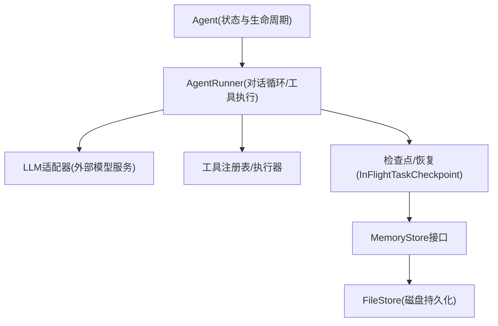
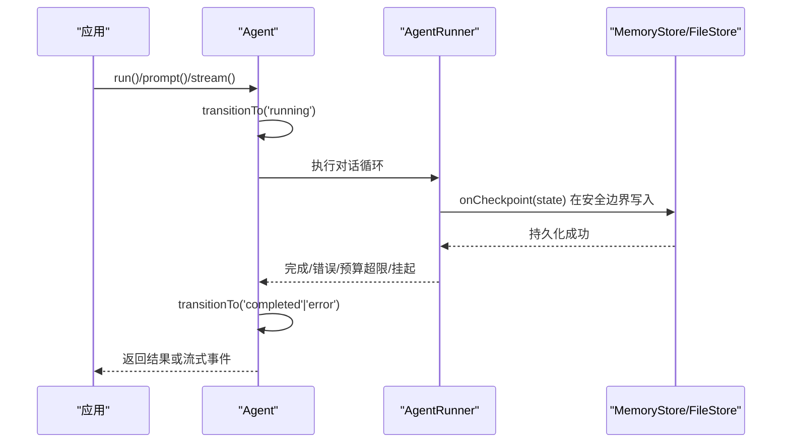
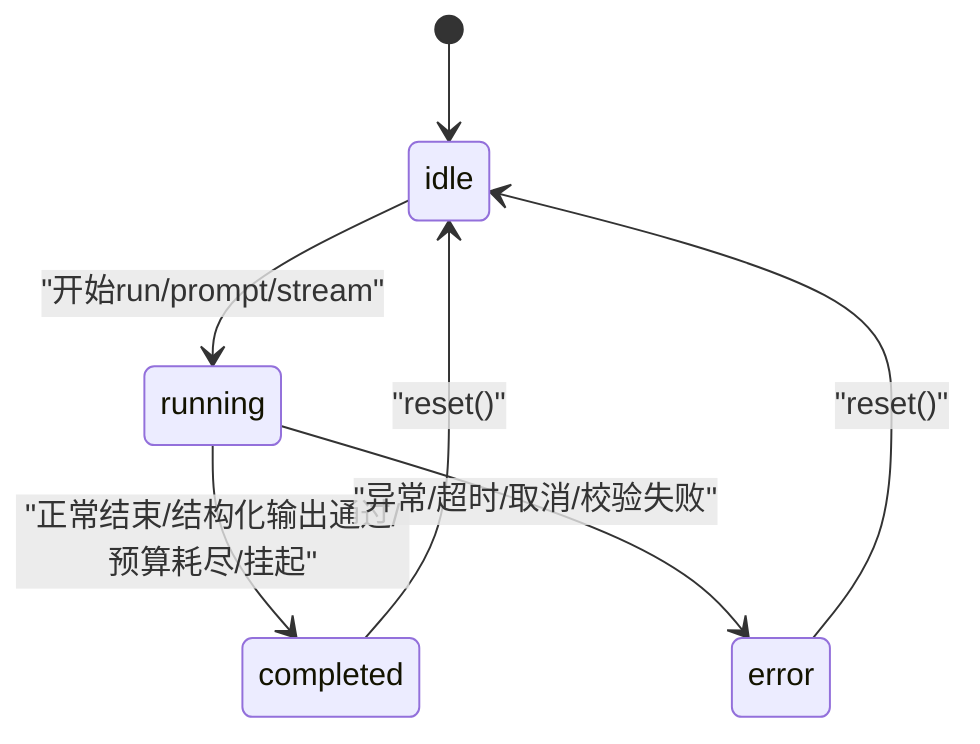
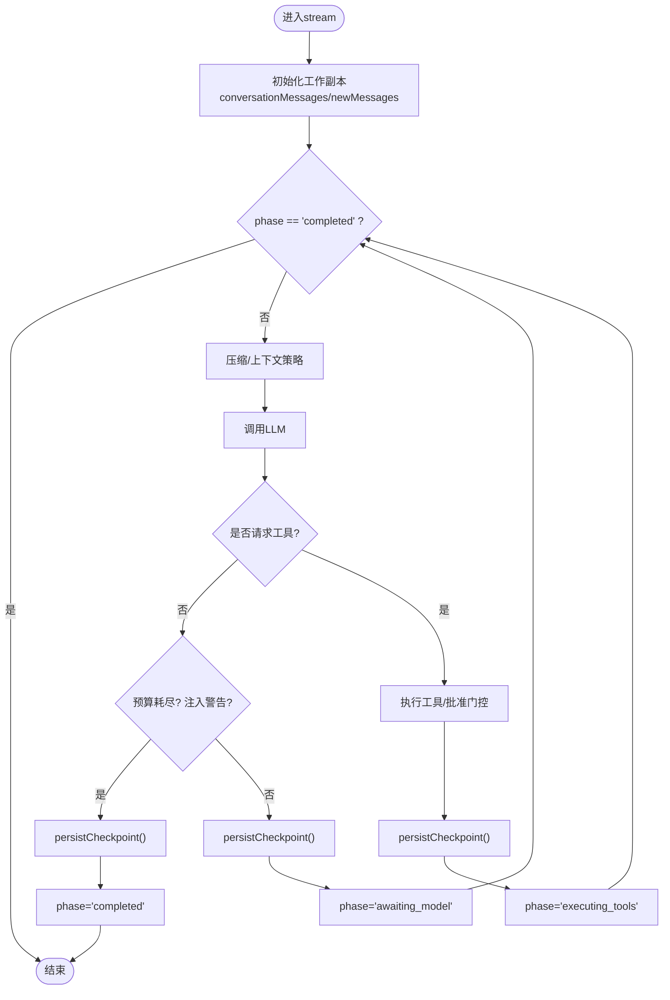
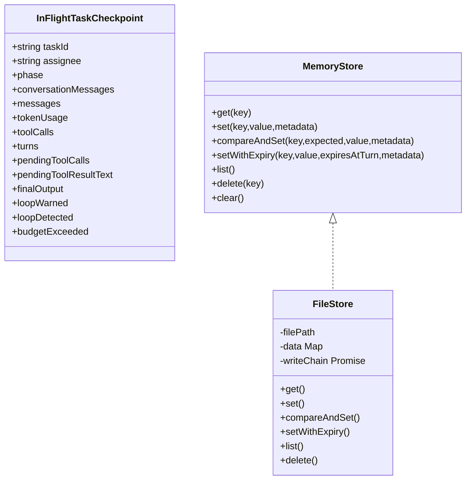
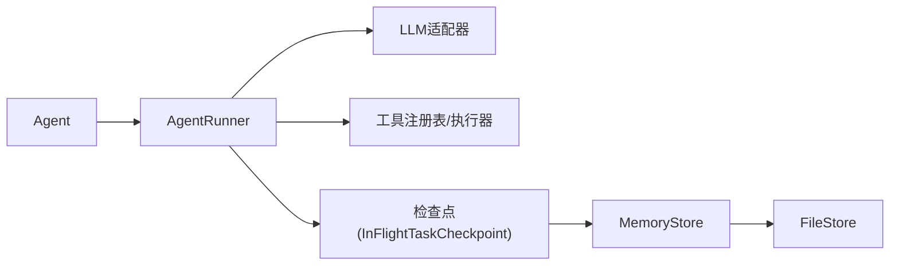

# 状态管理机制

<cite>
**本文引用的文件**
- [agent.ts](file://packages/core/src/agent/agent.ts)
- [runner.ts](file://packages/core/src/agent/runner.ts)
- [types.ts](file://packages/core/src/types.ts)
- [file-store.ts](file://packages/core/src/memory/file-store.ts)
</cite>

## 目录
1. [简介](#简介)
2. [项目结构](#项目结构)
3. [核心组件](#核心组件)
4. [架构总览](#架构总览)
5. [详细组件分析](#详细组件分析)
6. [依赖关系分析](#依赖关系分析)
7. [性能考虑](#性能考虑)
8. [故障排查指南](#故障排查指南)
9. [结论](#结论)
10. [附录](#附录)

## 简介
本文件系统性说明 Open Multi-Agent 智能体状态管理机制，聚焦 AgentState 的状态类型与转换规则、触发与约束条件、getState/reset 等方法的用途与实现原理、状态持久化（消息历史与检查点恢复）、并发环境下的线程安全保证、以及状态变化时的回调与事件通知。文档同时提供可视化图示与代码级引用路径，帮助读者在应用中正确管理与监控智能体状态。

## 项目结构
围绕状态管理的关键代码分布在以下模块：
- 高层 Agent 类：维护 AgentState、消息历史、生命周期状态转换、结果映射与追踪事件。
- Runner 执行器：驱动 LLM 调用、工具执行、循环检测、上下文压缩、检查点边界与恢复。
- 类型定义：AgentState、InFlightTaskCheckpoint、MemoryStore 等关键数据结构。
- 持久化存储：FileStore 提供原子写入的磁盘 MemoryStore，用于检查点与共享内存持久化。

图表来源
- [agent.ts:104-149](file://packages/core/src/agent/agent.ts#L104-L149)
- [runner.ts:877-1326](file://packages/core/src/agent/runner.ts#L877-L1326)
- [types.ts:2507-2530](file://packages/core/src/types.ts#L2507-L2530)
- [file-store.ts:80-182](file://packages/core/src/memory/file-store.ts#L80-L182)

章节来源
- [agent.ts:104-149](file://packages/core/src/agent/agent.ts#L104-L149)
- [runner.ts:877-1326](file://packages/core/src/agent/runner.ts#L877-L1326)
- [types.ts:2507-2530](file://packages/core/src/types.ts#L2507-L2530)
- [file-store.ts:80-182](file://packages/core/src/memory/file-store.ts#L80-L182)

## 核心组件
- AgentState：表示智能体运行期的生命周期状态与运行时数据，包含 status、messages、tokenUsage、error。
- Agent：封装 AgentRunner，负责状态机、消息历史、结果映射、追踪事件与回调。
- AgentRunner：实现多轮对话循环、工具调用、上下文策略、循环检测、检查点边界与恢复。
- InFlightTaskCheckpoint：可序列化的“进行中任务”检查点，保存阶段、消息、用量、待提交工具调用等。
- MemoryStore/FileStore：抽象持久化接口与基于文件的原子持久化实现，支撑检查点与共享内存持久化。

章节来源
- [types.ts:1247-1253](file://packages/core/src/types.ts#L1247-L1253)
- [agent.ts:104-149](file://packages/core/src/agent/agent.ts#L104-L149)
- [runner.ts:877-1326](file://packages/core/src/agent/runner.ts#L877-L1326)
- [types.ts:2507-2530](file://packages/core/src/types.ts#L2507-L2530)
- [file-store.ts:80-182](file://packages/core/src/memory/file-store.ts#L80-L182)

## 架构总览
下图展示从应用调用到状态落盘的关键流程，包括状态转换、检查点边界与恢复入口。

图表来源
- [agent.ts:391-597](file://packages/core/src/agent/agent.ts#L391-L597)
- [runner.ts:877-1326](file://packages/core/src/agent/runner.ts#L877-L1326)
- [types.ts:2507-2530](file://packages/core/src/types.ts#L2507-L2530)
- [file-store.ts:112-182](file://packages/core/src/memory/file-store.ts#L112-L182)

## 详细组件分析

### AgentState 状态机与转换规则
- 状态类型：idle、running、completed、error。
- 初始状态：Agent 构造时状态为 idle。
- 进入 running：调用 run/prompt/stream 时立即切换到 running。
- 进入 completed：正常结束、结构化输出校验通过、预算耗尽、被挂起（需审批）等场景切换至 completed。
- 进入 error：异常捕获、超时、取消、校验失败等场景切换至 error，并记录 error 字段。

图表来源
- [agent.ts:144-149](file://packages/core/src/agent/agent.ts#L144-L149)
- [agent.ts:391-597](file://packages/core/src/agent/agent.ts#L391-L597)
- [agent.ts:741-890](file://packages/core/src/agent/agent.ts#L741-L890)
- [agent.ts:988-994](file://packages/core/src/agent/agent.ts#L988-L994)

章节来源
- [agent.ts:144-149](file://packages/core/src/agent/agent.ts#L144-L149)
- [agent.ts:391-597](file://packages/core/src/agent/agent.ts#L391-L597)
- [agent.ts:741-890](file://packages/core/src/agent/agent.ts#L741-L890)
- [agent.ts:988-994](file://packages/core/src/agent/agent.ts#L988-L994)

### getState()、getHistory()、reset() 的使用与原理
- getState()：返回当前状态的浅拷贝快照（消息数组会复制），用于只读观察。
- getHistory()：返回持久化消息历史的副本，供外部读取或导出。
- reset()：清空持久化消息历史并将状态重置为 idle，不销毁后端连接。

使用建议：
- 在 UI 中周期性调用 getState() 渲染进度与用量。
- 在需要导出对话时调用 getHistory()。
- 在多轮会话结束后或用户主动“重新开始”时调用 reset()。

章节来源
- [agent.ts:334-355](file://packages/core/src/agent/agent.ts#L334-L355)

### 对话循环与检查点边界（Runner）
Runner 的核心职责：
- 维护 conversationMessages 与 newMessages，累积 tokenUsage、toolCalls、turns。
- 每轮调用前可选上下文压缩（滑动窗口/摘要/自定义）。
- 调用 LLM，提取 tool_use 块，执行工具，追加结果，直到 end_turn 或达到限制。
- 在多个安全边界调用 onCheckpoint(state)，将 InFlightTaskCheckpoint 持久化，支持崩溃恢复。
- 循环检测：注入警告、终止或继续；预算超限时提前结束。

图表来源
- [runner.ts:877-1326](file://packages/core/src/agent/runner.ts#L877-L1326)
- [runner.ts:1142-1178](file://packages/core/src/agent/runner.ts#L1142-L1178)

章节来源
- [runner.ts:877-1326](file://packages/core/src/agent/runner.ts#L877-L1326)
- [runner.ts:1142-1178](file://packages/core/src/agent/runner.ts#L1142-L1178)

### 状态持久化机制（检查点与恢复）
- 检查点结构：InFlightTaskCheckpoint 包含 phase、conversationMessages、messages、tokenUsage、toolCalls、turns、pendingToolCalls、finalOutput、loopWarned、loopDetected、budgetExceeded 等。
- 持久化时机：Runner 在多个安全边界调用 onCheckpoint(state)，由上层编排器写入 MemoryStore。
- 恢复机制：当 resumeState 存在时，Runner 从检查点恢复 conversationMessages/messages/usage/turns/phase 等，继续执行。
- 存储实现：FileStore 以单 JSON 文件形式原子写入（写临时文件→fsync→rename），保证进程内并发安全与断电一致性。

图表来源
- [types.ts:2507-2530](file://packages/core/src/types.ts#L2507-L2530)
- [types.ts:2842-2872](file://packages/core/src/types.ts#L2842-L2872)
- [file-store.ts:80-182](file://packages/core/src/memory/file-store.ts#L80-L182)

章节来源
- [types.ts:2507-2530](file://packages/core/src/types.ts#L2507-L2530)
- [types.ts:2842-2872](file://packages/core/src/types.ts#L2842-L2872)
- [file-store.ts:80-182](file://packages/core/src/memory/file-store.ts#L80-L182)

### 并发与线程安全
- 进程内串行化：FileStore 通过 writeChain 串行化所有写操作，避免竞态；读操作走内存镜像，保证一致性与性能。
- 原子写入：每次变更采用“临时文件+fsync+rename”，确保要么看到旧版本，要么看到新版本，不会出现半写文件。
- 跨进程范围：无跨进程锁，适用于“进程A崩溃后进程B恢复”的串行恢复场景。
- Runner 内部：单进程异步循环，按顺序推进 phase 并在检查点边界落盘，避免并发写入冲突。

章节来源
- [file-store.ts:10-31](file://packages/core/src/memory/file-store.ts#L10-L31)
- [file-store.ts:112-182](file://packages/core/src/memory/file-store.ts#L112-L182)
- [runner.ts:877-1326](file://packages/core/src/agent/runner.ts#L877-L1326)

### 回调与事件通知
- 消息回调：onMessage 在每条完整 LLMMessage 追加时触发，便于实时显示与审计。
- 工具回调：onToolCall/onToolResult 在工具调用前后触发，可用于审计与限流。
- 循环检测：检测到重复行为时，yield loop_detected 事件，并可通过配置选择 warn/inject/terminate。
- 追踪事件：emitAgentTrace 输出 agent span，包含 turns、tokens、toolCalls、duration 等指标。
- 流式事件：stream 模式下依次产出 text/tool_use/tool_result/done/error 等事件，便于前端实时更新。

章节来源
- [runner.ts:193-226](file://packages/core/src/agent/runner.ts#L193-L226)
- [runner.ts:1232-1268](file://packages/core/src/agent/runner.ts#L1232-L1268)
- [agent.ts:432-435](file://packages/core/src/agent/agent.ts#L432-L435)
- [agent.ts:599-642](file://packages/core/src/agent/agent.ts#L599-L642)
- [agent.ts:803-860](file://packages/core/src/agent/agent.ts#L803-L860)

### 应用中的状态管理与监控示例（步骤指引）
- 启动与运行：创建 Agent，调用 run/prompt 发起一次对话；或在 stream 中消费事件进行实时展示。
- 监控状态：定时调用 getState() 获取 status、messages、tokenUsage；结合 onMessage 与 onToolCall 做细粒度日志。
- 持久化：为 orchestrator 配置 checkpoint.store 为 FileStore，使崩溃后可 restore 继续执行。
- 恢复执行：使用 restore 传入相同 store/runId，Runner 会从 InFlightTaskCheckpoint 恢复 phase 与消息继续执行。
- 重置会话：在业务需要时调用 reset() 清空历史并回到 idle。

章节来源
- [agent.ts:290-328](file://packages/core/src/agent/agent.ts#L290-L328)
- [agent.ts:334-355](file://packages/core/src/agent/agent.ts#L334-L355)
- [types.ts:2349-2377](file://packages/core/src/types.ts#L2349-L2377)
- [file-store.ts:33-44](file://packages/core/src/memory/file-store.ts#L33-L44)

## 依赖关系分析
- Agent 依赖 AgentRunner 作为默认后端，也可替换为外部后端（ACP/Process）。
- AgentRunner 依赖 LLMAdapter、ToolRegistry、ToolExecutor、LoopDetector、Approval 门控、上下文策略与追踪。
- 检查点通过 MemoryStore 抽象，默认可由团队共享内存承载，推荐用 FileStore 做持久化。
- 类型层集中定义了状态、事件、检查点与存储接口，降低耦合。

图表来源
- [agent.ts:164-231](file://packages/core/src/agent/agent.ts#L164-L231)
- [runner.ts:877-1326](file://packages/core/src/agent/runner.ts#L877-L1326)
- [types.ts:2507-2530](file://packages/core/src/types.ts#L2507-L2530)
- [file-store.ts:80-182](file://packages/core/src/memory/file-store.ts#L80-L182)

章节来源
- [agent.ts:164-231](file://packages/core/src/agent/agent.ts#L164-L231)
- [runner.ts:877-1326](file://packages/core/src/agent/runner.ts#L877-L1326)
- [types.ts:2507-2530](file://packages/core/src/types.ts#L2507-L2530)
- [file-store.ts:80-182](file://packages/core/src/memory/file-store.ts#L80-L182)

## 性能考虑
- 上下文压缩：在每轮 LLM 调用前可选择滑动窗口、摘要或自定义压缩，减少输入长度与成本。
- 工具结果压缩：已消费的工具结果可按策略压缩，降低后续上下文体积。
- 检查点频率：仅在安全边界写入检查点，避免频繁 I/O 影响吞吐。
- 流式处理：优先使用 stream 模式，边生成边消费，降低首字节延迟。

[本节为通用指导，不直接分析具体文件]

## 故障排查指南
- 状态卡在 running：检查是否有未完成的工具调用或审批门控；查看 pendingToolCalls 与 onCheckpoint 是否持续写入。
- 预算超限：关注 budgetExceeded 标志与 afterRun 钩子；必要时调整 maxTokenBudget 或上下文策略。
- 循环检测告警：根据 loopDetection 配置选择 terminate/warn/inject；若反复出现，优化提示词或工具设计。
- 恢复失败：确认 checkpoint.store 可用且 key/runId 一致；检查 FileStore 文件版本与 entries 格式。
- 流式错误：捕获 error 事件并分类（超时/取消/校验/提供商错误），结合 trace span 定位问题。

章节来源
- [runner.ts:1232-1268](file://packages/core/src/agent/runner.ts#L1232-L1268)
- [agent.ts:564-597](file://packages/core/src/agent/agent.ts#L564-L597)
- [agent.ts:831-890](file://packages/core/src/agent/agent.ts#L831-L890)
- [file-store.ts:249-281](file://packages/core/src/memory/file-store.ts#L249-L281)

## 结论
Open Multi-Agent 的状态管理以 AgentState 为核心，配合 Agent 的生命周期方法与 AgentRunner 的检查点边界，实现了健壮的状态机与可恢复的执行语义。通过 MemoryStore/FileStore 的原子持久化，系统在崩溃后可从最近的安全边界恢复。结合丰富的回调与事件机制，开发者可在应用中高效地监控与管理智能体状态。

[本节为总结性内容，不直接分析具体文件]

## 附录
- 关键类型参考：
  - AgentState：status、messages、tokenUsage、error
  - InFlightTaskCheckpoint：phase、conversationMessages、messages、tokenUsage、toolCalls、turns、pendingToolCalls、finalOutput、loopWarned、loopDetected、budgetExceeded
  - MemoryStore：get/set/list/delete/clear 及可选 compareAndSet/setWithExpiry
- 典型用法路径：
  - 状态查询：Agent.getState()
  - 历史导出：Agent.getHistory()
  - 会话重置：Agent.reset()
  - 检查点配置：checkpoint.store = new FileStore(path)
  - 恢复执行：restore(team, { checkpoint: { store, runId } })

章节来源
- [types.ts:1247-1253](file://packages/core/src/types.ts#L1247-L1253)
- [types.ts:2507-2530](file://packages/core/src/types.ts#L2507-L2530)
- [types.ts:2842-2872](file://packages/core/src/types.ts#L2842-L2872)
- [agent.ts:334-355](file://packages/core/src/agent/agent.ts#L334-L355)
- [file-store.ts:33-44](file://packages/core/src/memory/file-store.ts#L33-L44)