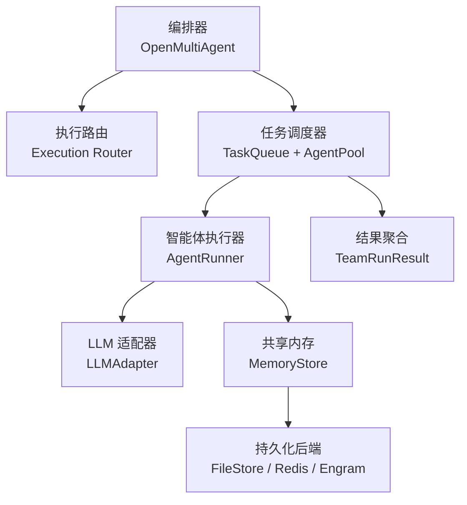
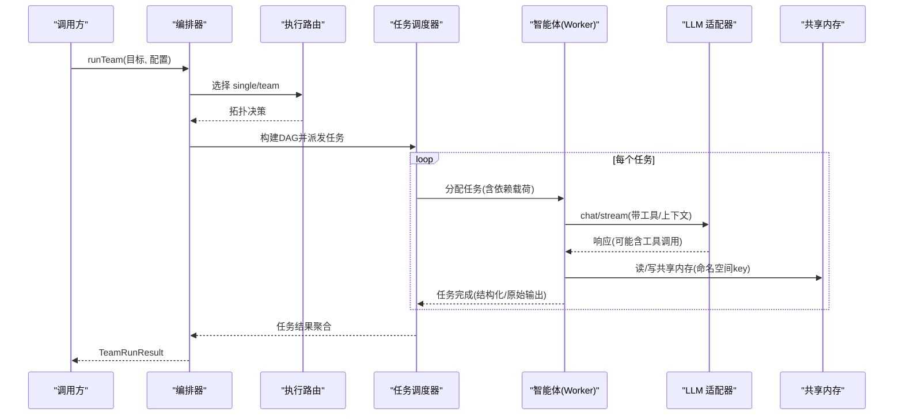
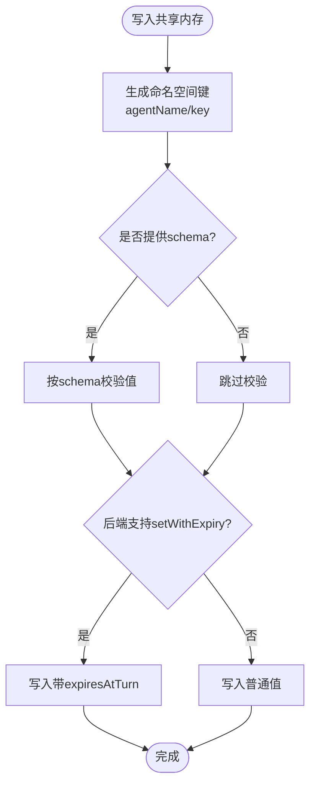
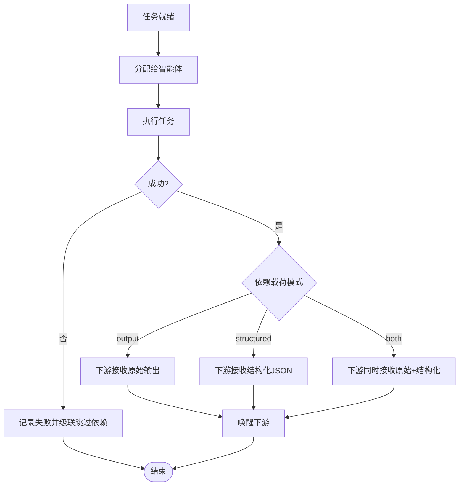
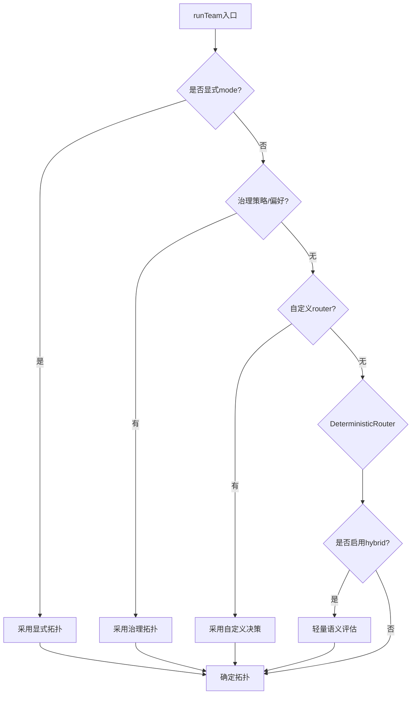
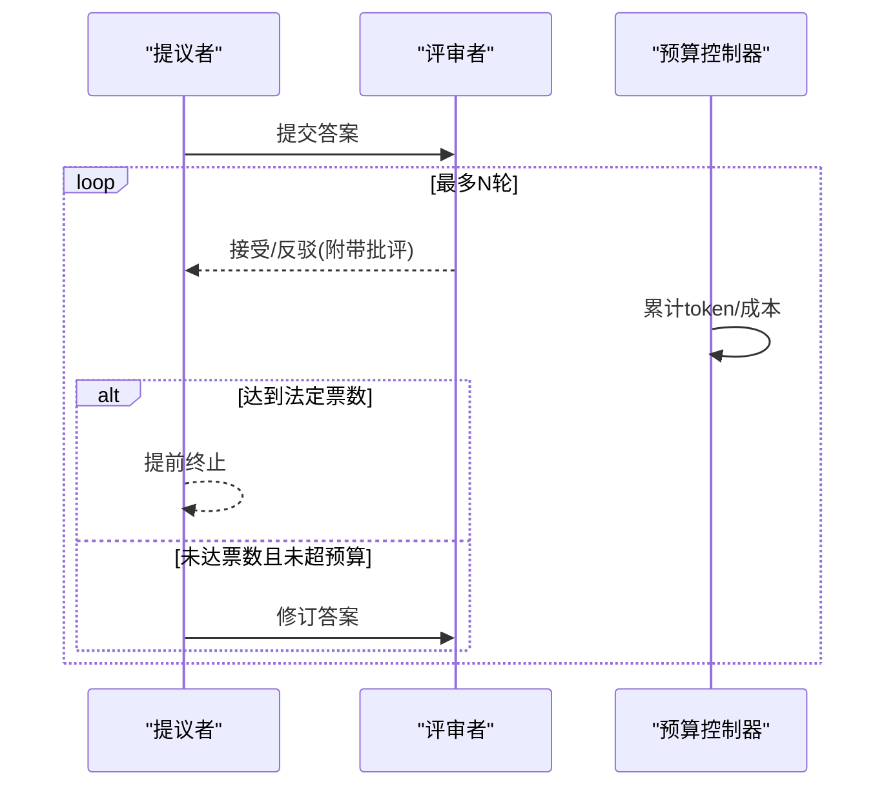
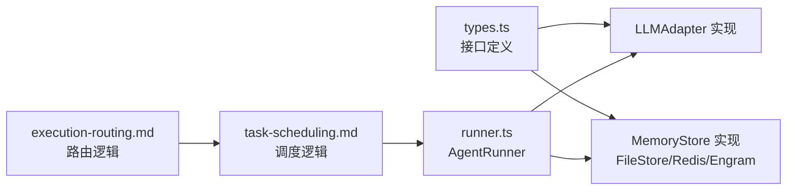

# 智能体间通信模式

<cite>
**本文引用的文件**
- [README.md](file://README.md)
- [shared-memory.md](file://docs/shared-memory.md)
- [task-scheduling.md](file://docs/task-scheduling.md)
- [execution-routing.md](file://docs/execution-routing.md)
- [consensus.md](file://docs/consensus.md)
- [types.ts](file://packages/core/src/types.ts)
- [runner.ts](file://packages/core/src/agent/runner.ts)
- [engram-store.ts](file://packages/core/examples/integrations/with-engram/engram-store.ts)
</cite>

## 目录
1. [简介](#简介)
2. [项目结构](#项目结构)
3. [核心组件](#核心组件)
4. [架构总览](#架构总览)
5. [详细组件分析](#详细组件分析)
6. [依赖关系分析](#依赖关系分析)
7. [性能考量](#性能考量)
8. [故障排查指南](#故障排查指南)
9. [结论](#结论)
10. [附录](#附录)

## 简介
本文件系统性梳理 Open Multi-Agent（OMA）中多智能体间的通信模式，覆盖直接通信、共享内存、消息队列等机制的特点与适用场景；深入解释共享内存的实现原理（数据同步、版本控制、冲突解决）；阐述智能体间消息传递协议（消息格式、路由机制、可靠性保证）；给出异步与同步通信的选择原则及超时、重试策略；并介绍权限控制、数据加密与访问审计等安全机制。文末提供实践建议与优化技巧，帮助在真实系统中稳定高效地运行多智能体协作。

## 项目结构
OMA 的通信能力由“编排器 + 任务调度 + 共享内存 + LLM 适配器”共同构成：
- 编排层：决定执行拓扑（单智能体或团队）、选择模型路由、协调任务 DAG。
- 调度层：事件驱动的任务队列，按依赖就绪顺序派发任务，维护并发上限。
- 共享内存：跨智能体的键值存储，支持进程内与持久化后端，可叠加脱敏装饰器。
- 消息通道：通过工具调用、结构化输出、共识验证等实现跨智能体的信息交换。

图表来源
- [execution-routing.md:1-222](file://docs/execution-routing.md#L1-L222)
- [task-scheduling.md:1-203](file://docs/task-scheduling.md#L1-L203)
- [runner.ts:472-486](file://packages/core/src/agent/runner.ts#L472-L486)
- [types.ts:2842-2872](file://packages/core/src/types.ts#L2842-L2872)

章节来源
- [README.md:46-97](file://README.md#L46-L97)
- [execution-routing.md:1-222](file://docs/execution-routing.md#L1-L222)
- [task-scheduling.md:1-203](file://docs/task-scheduling.md#L1-L203)

## 核心组件
- 共享内存接口与条目
  - MemoryStore：定义 get/set/list/delete/clear，可选 compareAndSet 与 setWithExpiry 用于原子更新与基于轮次的过期。
  - MemoryEntry：包含 key/value/metadata/createdAt/expiresAtTurn。
  - SharedMemoryValue：JSON 可序列化的值类型集合。
- 智能体运行器
  - AgentRunner：封装对话循环、工具调用、上下文压缩、预算与超时控制。
- 任务调度
  - 事件驱动：ready 集合与 in-flight 映射，完成即唤醒下游。
  - 依赖载荷：output/structured/both 三种注入方式，限制大小与校验失败策略。
- 执行路由
  - 决定 single/team 拓扑，支持混合语义路由与确定性默认策略。
- 共识验证
  - proposer/judge 多轮反驳与投票，支持 per-task verify 钩子。

章节来源
- [types.ts:2806-2872](file://packages/core/src/types.ts#L2806-L2872)
- [runner.ts:472-486](file://packages/core/src/agent/runner.ts#L472-L486)
- [task-scheduling.md:27-64](file://docs/task-scheduling.md#L27-L64)
- [execution-routing.md:1-222](file://docs/execution-routing.md#L1-L222)
- [consensus.md:1-64](file://docs/consensus.md#L1-L64)

## 架构总览
下图展示一次 runTeam 的典型通信路径：编排器根据目标选择拓扑，调度器将任务分配给智能体，智能体通过 LLM 适配器获取响应，必要时读写共享内存，最终汇总结果。

图表来源
- [execution-routing.md:1-222](file://docs/execution-routing.md#L1-L222)
- [task-scheduling.md:1-203](file://docs/task-scheduling.md#L1-L203)
- [runner.ts:472-486](file://packages/core/src/agent/runner.ts#L472-L486)
- [types.ts:2842-2872](file://packages/core/src/types.ts#L2842-L2872)

## 详细组件分析

### 共享内存：原理、同步与冲突解决
- 数据模型
  - 键名以 <agentName>/<key> 形式命名空间隔离。
  - 值类型为 JSON 可序列化集合；读取时解析为 SharedMemoryValue。
  - 支持可选的 turn-count TTL（expiresAtTurn），由上层 SharedMemory 计算并在支持的后端写入。
- 后端与持久化
  - 内置 FileStore 提供零依赖的文件系统存储，支持原子写入。
  - 可自定义 MemoryStore（如 Redis、Engram 等）以实现跨进程/基础设施共享。
  - RedactingStore 可在写入时对敏感信息进行脱敏，保护持久化内容。
- 同步与一致性
  - compareAndSet 提供原子比较并设置能力，用于需要 CAS 的场景（如审批决策）。
  - setWithExpiry 允许基于轮次 TTL 的过期策略；不支持的后端会退化为普通 set。
- 冲突与版本
  - 通过命名空间隔离减少冲突；CAS 可用于简单乐观锁。
  - 若需强一致或复杂合并策略，应在自定义 MemoryStore 中实现（如向量时钟、CRDT）。
- 使用要点
  - 仅当 sharedMemoryStore 显式传入时才生效；否则使用进程内默认存储。
  - 注意写入即落盘（持久化后端）时的脱敏处理。

图表来源
- [shared-memory.md:1-47](file://docs/shared-memory.md#L1-L47)
- [types.ts:2824-2872](file://packages/core/src/types.ts#L2824-L2872)

章节来源
- [shared-memory.md:1-47](file://docs/shared-memory.md#L1-L47)
- [types.ts:2806-2872](file://packages/core/src/types.ts#L2806-L2872)
- [engram-store.ts:1-40](file://packages/core/examples/integrations/with-engram/engram-store.ts#L1-L40)

### 任务调度与依赖载荷：类“消息队列”的可靠传递
- 事件驱动执行
  - TaskQueue 维护 ready 集合与 in-flight 映射；任务完成后立即唤醒下游。
  - AgentPool 作为并发上限的唯一权威，避免资源竞争。
- 依赖载荷注入
  - 默认注入 raw output；可通过 dependencyPayload 选择 structured/both。
  - structured 仅注入结构化 JSON；both 同时注入原始与结构化段落。
  - 缺失或不可序列化的结构化值会导致下游任务校验失败（不静默降级）。
  - 载荷大小限制（例如 64 KiB）防止过大传输。
- 失败与跳过传播
  - 失败/跳过会级联到依赖任务；无关分支继续执行。
- 中断与预算
  - 中止、预算耗尽、审批拒绝走“排空后跳过”路径：停止新任务 -> 等待进行中任务结束 -> 标记剩余任务为 skipped。

图表来源
- [task-scheduling.md:1-203](file://docs/task-scheduling.md#L1-L203)

章节来源
- [task-scheduling.md:1-203](file://docs/task-scheduling.md#L1-L203)

### 执行路由：同步/异步与拓扑选择
- 拓扑选择优先级
  - 显式 mode > 治理策略 > 自定义 router > 内置 DeterministicRouter > 混合语义路由（hybrid）。
- 混合语义路由
  - 仅在默认会选 Single 时进行一次无工具的轻量评估，提升高置信度场景的准确性。
- 失败策略
  - 默认 fallback：路由失败回退到确定性路由；fail：终止并上报错误码。
- 与模型路由正交
  - 执行路由决定 single/team；模型路由决定内部调用的模型/provider。

图表来源
- [execution-routing.md:1-222](file://docs/execution-routing.md#L1-L222)

章节来源
- [execution-routing.md:1-222](file://docs/execution-routing.md#L1-L222)

### 共识验证：跨智能体的质量保障
- 流程
  - proposer 产出答案，judges 多轮反驳/审视，达到法定票数即接受。
  - 支持 per-task verify 钩子，将验证嵌入流水线。
- 预算与观测
  - 所有 judge/revision 消耗计入父预算；达到阈值即停止后续 judge 调用。
  - 每轮判定通过 trace 事件记录，便于审计。

图表来源
- [consensus.md:1-64](file://docs/consensus.md#L1-L64)

章节来源
- [consensus.md:1-64](file://docs/consensus.md#L1-L64)

### 智能体运行器：对话循环与工具调用
- 职责
  - 发送消息给 LLM 适配器、提取工具调用、并行执行工具、累积 token 与耗时。
  - 支持上下文压缩策略、循环检测、预算与超时控制。
- 关键行为
  - 非流式内部调用，callTimeoutMs 统一各供应商超时。
  - 工具输出长度限制，避免上下文膨胀。

章节来源
- [runner.ts:1-504](file://packages/core/src/agent/runner.ts#L1-L504)
- [types.ts:1092-1117](file://packages/core/src/types.ts#L1092-L1117)

## 依赖关系分析
- 低耦合接口
  - MemoryStore 抽象使共享内存可替换；compareAndSet/setWithExpiry 为可选扩展点。
  - LLMAdapter 抽象屏蔽不同供应商差异，统一 chat/stream 契约。
- 组件耦合
  - 任务调度依赖 AgentPool 并发控制；AgentRunner 依赖 ToolExecutor 与 ToolRegistry。
  - 执行路由与模型路由相互独立，分别决定拓扑与模型选择。
- 外部集成
  - 示例 EngramStore 展示了如何以 REST API 实现 MemoryStore，支撑跨进程共享。

图表来源
- [types.ts:2842-2872](file://packages/core/src/types.ts#L2842-L2872)
- [runner.ts:472-486](file://packages/core/src/agent/runner.ts#L472-L486)
- [task-scheduling.md:1-203](file://docs/task-scheduling.md#L1-L203)
- [execution-routing.md:1-222](file://docs/execution-routing.md#L1-L222)

章节来源
- [types.ts:2842-2872](file://packages/core/src/types.ts#L2842-L2872)
- [runner.ts:472-486](file://packages/core/src/agent/runner.ts#L472-L486)
- [task-scheduling.md:1-203](file://docs/task-scheduling.md#L1-L203)
- [execution-routing.md:1-222](file://docs/execution-routing.md#L1-L222)
- [engram-store.ts:1-40](file://packages/core/examples/integrations/with-engram/engram-store.ts#L1-L40)

## 性能考量
- 共享内存
  - 优先使用 setWithExpiry 降低长期驻留数据的开销；对大对象进行分片或只存引用。
  - 使用 RedactingStore 在写入时脱敏，避免额外运行时开销。
- 任务调度
  - 合理设置 maxConcurrency，避免过度并发导致资源争用。
  - 使用 structured 依赖载荷减少下游解析成本，但注意 64 KiB 限制。
- 模型调用
  - 设置 callTimeoutMs 统一超时，避免个别供应商阻塞整体运行。
  - 利用上下文压缩策略（compact/summarize/sliding-window）控制上下文大小。
- 共识验证
  - 谨慎设置 quorum 与 maxRounds，避免过多 judge 调用造成延迟与成本上升。

[本节为通用指导，无需特定文件来源]

## 故障排查指南
- 共享内存
  - 写入未生效：检查是否传入了 sharedMemoryStore；确认键名命名空间正确。
  - 持久化泄露敏感信息：确认已包裹 RedactingStore 并配置匹配的正则模式。
  - TTL 不生效：后端未实现 setWithExpiry 时会退化；需在应用层做清理或升级后端。
- 任务调度
  - 任务卡住：检查依赖是否满足、AgentPool 是否饱和、是否存在预算耗尽或审批拒绝。
  - 依赖载荷过大：超过限制会导致下游任务失败；拆分或改用结构化小对象。
- 模型调用
  - 超时：调整 callTimeoutMs 与整体 timeoutMs；关注供应商 SDK 自身超时差异。
  - 循环：开启 loopDetection，避免陷入重复工具调用或文本输出。
- 共识验证
  - 预算超限：judge/revision 消耗计入父预算；适当降低 rounds 或 judges 数量。
  - 分歧过多：调整 onDissent 策略（revise/reject/keep）与 judgePrompt。

章节来源
- [shared-memory.md:29-47](file://docs/shared-memory.md#L29-L47)
- [task-scheduling.md:166-184](file://docs/task-scheduling.md#L166-L184)
- [runner.ts:1092-1117](file://packages/core/src/types.ts#L1092-L1117)
- [consensus.md:57-64](file://docs/consensus.md#L57-L64)

## 结论
OMA 通过“执行路由 + 任务调度 + 共享内存 + LLM 适配器”的组合，提供了灵活而可控的多智能体通信体系。共享内存适合跨智能体事实共享与中间结果传递；任务调度提供的依赖载荷机制充当可靠的“消息队列”，确保下游消费的一致性与可验证性；共识验证为关键结果提供质量保障。结合超时、预算、审批与审计，可在生产环境中稳健运行复杂的多智能体工作流。

[本节为总结性内容，无需特定文件来源]

## 附录

### 通信模式对比与选型建议
- 直接通信（工具调用/结构化输出）
  - 特点：强耦合于任务依赖，天然具备幂等与可追踪性。
  - 适用：上下游紧密耦合、需要严格校验的数据传递。
- 共享内存
  - 特点：解耦读写方，支持命名空间与 TTL；可实现跨进程共享。
  - 适用：多智能体共享事实、知识库、配置与中间状态。
- 消息队列（任务依赖载荷）
  - 特点：事件驱动、按依赖就绪派发，具备失败传播与预算控制。
  - 适用：长链路流水线、并行分支与结果聚合。

[本节为概念性内容，无需特定文件来源]

### 安全与合规
- 权限控制
  - ACP 代理的权限策略支持 auto-approve/reject/函数回调，最小权限原则。
- 数据脱敏
  - RedactingStore 在写入时脱敏凭证与自定义模式，保护持久化内容。
- 访问审计
  - 共识每轮判定通过 trace 事件记录；任务元数据与角色在执行回执中保留。

章节来源
- [types.ts:794-854](file://packages/core/src/types.ts#L794-L854)
- [shared-memory.md:29-47](file://docs/shared-memory.md#L29-L47)
- [consensus.md:61-64](file://docs/consensus.md#L61-L64)