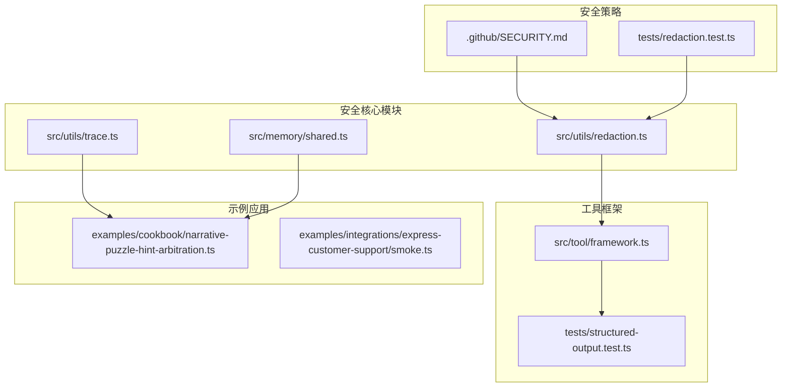
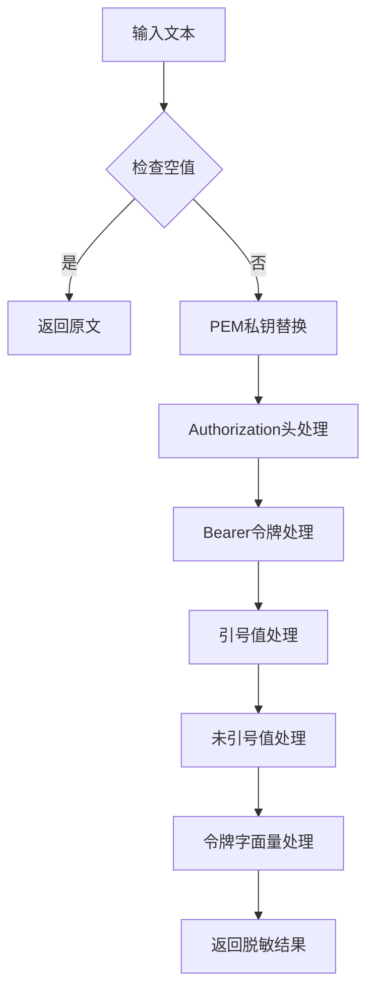
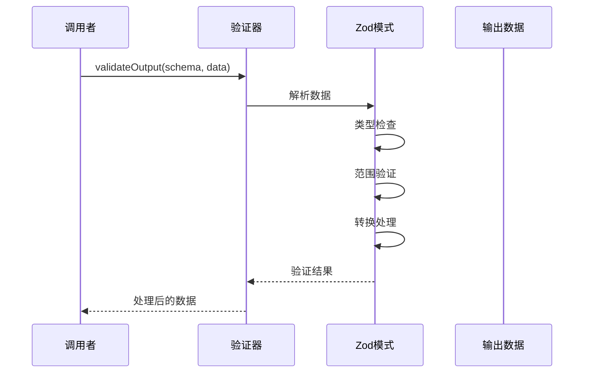
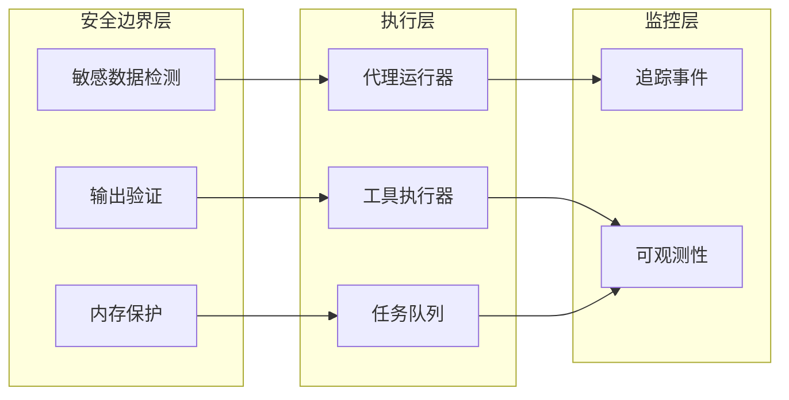
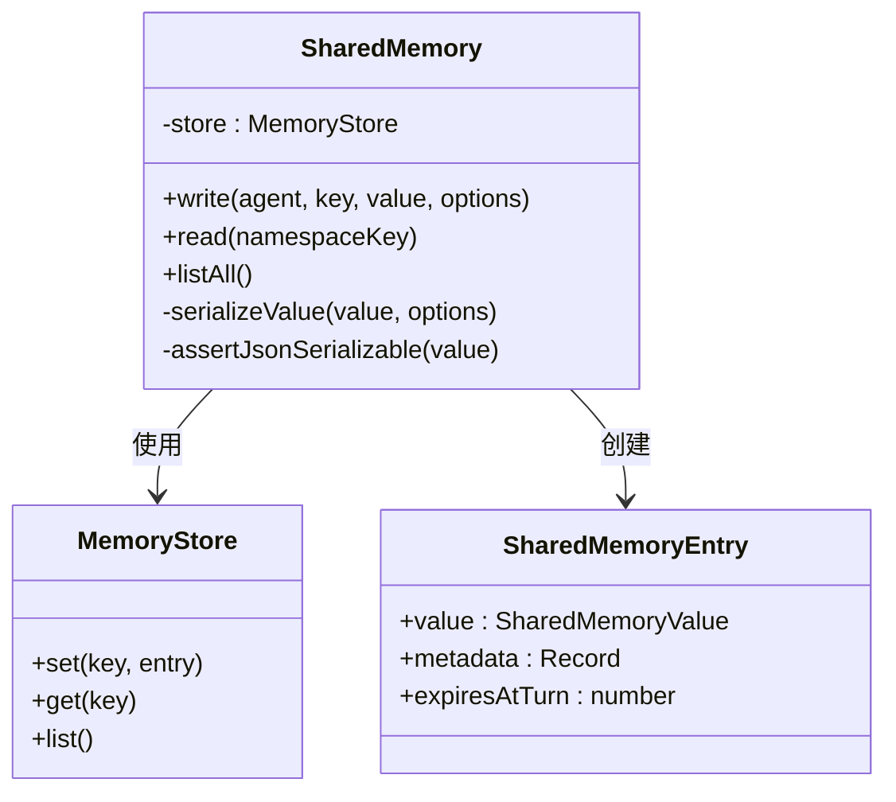
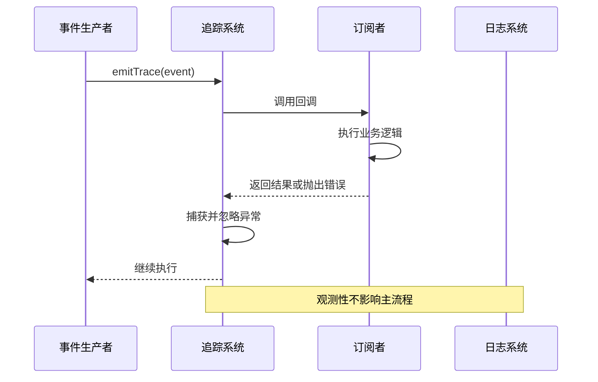
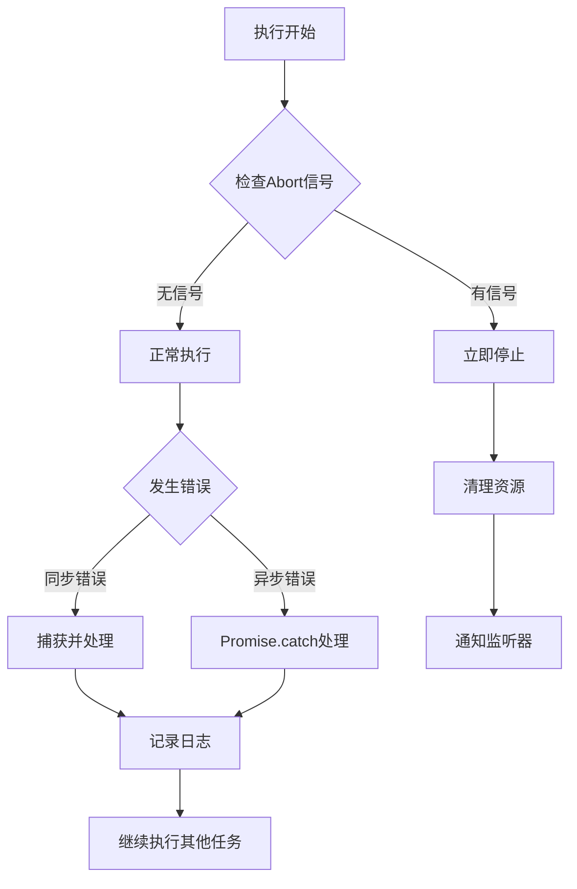
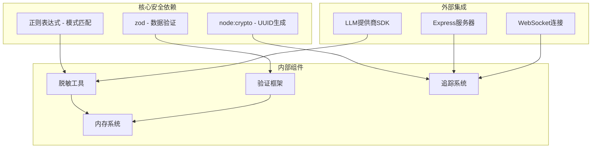

# 安全与数据保护

<cite>
**本文档引用的文件**
- [redaction.ts](file://src/utils/redaction.ts)
- [redaction.test.ts](file://tests/redaction.test.ts)
- [trace.ts](file://src/utils/trace.ts)
- [shared.ts](file://src/memory/shared.ts)
- [framework.ts](file://src/tool/framework.ts)
- [structured-output.test.ts](file://tests/structured-output.test.ts)
- [abort-signal-propagation.test.ts](file://tests/abort-signal-propagation.test.ts)
- [SECURITY.md](file://.github/SECURITY.md)
- [narrative-puzzle-hint-arbitration.ts](file://examples/cookbook/narrative-puzzle-hint-arbitration.ts)
- [smoke.ts](file://examples/integrations/express-customer-support/smoke.ts)
</cite>

## 目录
1. [简介](#简介)
2. [项目结构](#项目结构)
3. [核心组件](#核心组件)
4. [架构概览](#架构概览)
5. [详细组件分析](#详细组件分析)
6. [依赖关系分析](#依赖关系分析)
7. [性能考虑](#性能考虑)
8. [故障排除指南](#故障排除指南)
9. [结论](#结论)

## 简介

本文件专注于Open Multi-Agent项目的安全与数据保护机制。通过对代码库的深入分析，我们识别了以下关键安全特性：

- **敏感数据脱敏**：自动检测和移除API密钥、令牌、私钥等敏感信息
- **结构化输出验证**：使用Zod模式确保输出数据的完整性和安全性
- **内存访问控制**：受保护的共享内存系统，防止数据泄露
- **可观测性安全**：安全的追踪事件发射，不影响主执行流程
- **异常处理机制**：优雅的错误处理和信号中断支持

## 项目结构

**图表来源**
- [redaction.ts:1-130](file://src/utils/redaction.ts#L1-L130)
- [trace.ts:1-34](file://src/utils/trace.ts#L1-L34)
- [shared.ts:310-428](file://src/memory/shared.ts#L310-L428)

## 核心组件

### 敏感数据脱敏系统

项目实现了多层次的敏感数据保护机制：

**图表来源**
- [redaction.ts:31-93](file://src/utils/redaction.ts#L31-L93)

### 结构化输出验证

使用Zod模式进行严格的输出验证：

**图表来源**
- [framework.ts:273-275](file://src/tool/framework.ts#L273-L275)
- [structured-output.test.ts:123-163](file://tests/structured-output.test.ts#L123-L163)

**章节来源**
- [redaction.ts:25-123](file://src/utils/redaction.ts#L25-L123)
- [framework.ts:260-609](file://src/tool/framework.ts#L260-L609)
- [structured-output.test.ts:123-163](file://tests/structured-output.test.ts#L123-L163)

## 架构概览

**图表来源**
- [trace.ts:12-27](file://src/utils/trace.ts#L12-L27)
- [shared.ts:333-354](file://src/memory/shared.ts#L333-L354)

## 详细组件分析

### 敏感数据脱敏组件

该组件提供了全面的敏感信息保护功能：

#### 关键特性
- **多格式支持**：支持PEM私钥、Bearer令牌、Authorization头等多种格式
- **智能匹配**：使用正则表达式精确识别敏感数据
- **递归处理**：深度遍历对象结构，确保所有层级的数据都被处理
- **幂等性保证**：重复处理不会产生额外的脱敏标记

#### 安全机制
- **名称过滤**：仅对已知敏感字段名进行处理
- **结构保持**：保留数据结构完整性，只替换实际值
- **回退保护**：防止部分处理导致的数据损坏

**章节来源**
- [redaction.ts:27-93](file://src/utils/redaction.ts#L27-L93)
- [redaction.test.ts:1-79](file://tests/redaction.test.ts#L1-L79)

### 共享内存安全系统

实现了受控的数据访问机制：

**图表来源**
- [shared.ts:310-428](file://src/memory/shared.ts#L310-L428)

#### 安全特性
- **序列化验证**：确保只有JSON可序列化数据才能存储
- **循环引用检测**：防止内存泄漏和无限递归
- **元数据清理**：自动清理内部保留字段
- **类型约束**：有限数值检查，防止异常值

**章节来源**
- [shared.ts:333-426](file://src/memory/shared.ts#L333-L426)

### 可观测性安全设计

追踪系统采用非侵入式设计：

**图表来源**
- [trace.ts:12-27](file://src/utils/trace.ts#L12-L27)

**章节来源**
- [trace.ts:1-34](file://src/utils/trace.ts#L1-L34)

### 异常处理与信号管理

实现了健壮的错误处理机制：

**图表来源**
- [abort-signal-propagation.test.ts:22-78](file://tests/abort-signal-propagation.test.ts#L22-L78)

**章节来源**
- [abort-signal-propagation.test.ts:1-110](file://tests/abort-signal-propagation.test.ts#L1-L110)

### 安全策略与合规

项目遵循负责任的漏洞披露政策：

- **支持版本**：仅支持最新版本的安全更新
- **报告渠道**：通过邮件而非公开问题报告
- **响应时间**：48小时内确认收到，7天内提供修复方案

**章节来源**
- [SECURITY.md:1-18](file://.github/SECURITY.md#L1-L18)

## 依赖关系分析

**图表来源**
- [framework.ts:6471-6491](file://src/tool/framework.ts#L6471-L6491)
- [trace.ts:5-6](file://src/utils/trace.ts#L5-L6)

**章节来源**
- [framework.ts:6471-6491](file://src/tool/framework.ts#L6471-L6491)
- [trace.ts:5-6](file://src/utils/trace.ts#L5-L6)

## 性能考虑

### 脱敏操作优化
- **单次遍历**：使用多个正则表达式在单次传递中完成多种脱敏
- **早期退出**：空字符串快速返回，避免不必要的处理
- **内存效率**：流式处理大文本，避免创建中间副本

### 验证性能
- **编译时优化**：Zod模式在使用前进行编译
- **缓存机制**：复杂模式的结果可以被缓存复用
- **短路评估**：失败的验证快速终止，避免后续处理

### 内存管理
- **弱引用**：循环引用检测使用WeakSet避免内存泄漏
- **渐进式序列化**：大型对象分块处理
- **垃圾回收友好**：及时释放临时变量和闭包

## 故障排除指南

### 常见问题诊断

#### 脱敏不生效
1. **检查输入格式**：确保敏感数据符合预期格式
2. **验证字段名**：确认敏感字段名在白名单中
3. **测试正则表达式**：使用单元测试验证匹配规则

#### 验证失败
1. **查看错误详情**：检查具体的验证错误信息
2. **检查数据类型**：确保输入数据类型正确
3. **验证范围约束**：确认数值在允许范围内

#### 内存访问异常
1. **检查序列化**：确保数据可JSON序列化
2. **验证循环引用**：查找可能的循环引用
3. **检查元数据**：确认元数据格式正确

**章节来源**
- [redaction.test.ts:72-79](file://tests/redaction.test.ts#L72-L79)
- [structured-output.test.ts:123-163](file://tests/structured-output.test.ts#L123-L163)

### 安全配置建议

1. **定期更新依赖**：保持Zod和其他安全依赖的最新版本
2. **监控异常**：设置适当的日志级别跟踪安全相关事件
3. **审计访问**：定期审查共享内存的访问模式
4. **渗透测试**：定期进行安全评估和漏洞扫描

## 结论

Open Multi-Agent项目在设计上充分考虑了安全性和数据保护的重要性。通过实现多层次的安全机制，包括敏感数据脱敏、结构化输出验证、受控内存访问和非侵入式可观测性，项目建立了完整的安全防护体系。

主要优势包括：
- **自动化保护**：减少人为疏忽导致的安全风险
- **可验证性**：通过单元测试确保安全机制的有效性
- **性能优化**：在保证安全的前提下优化执行效率
- **合规性**：遵循负责任的漏洞披露政策

建议持续关注新的安全威胁，并根据实际使用场景调整安全策略。