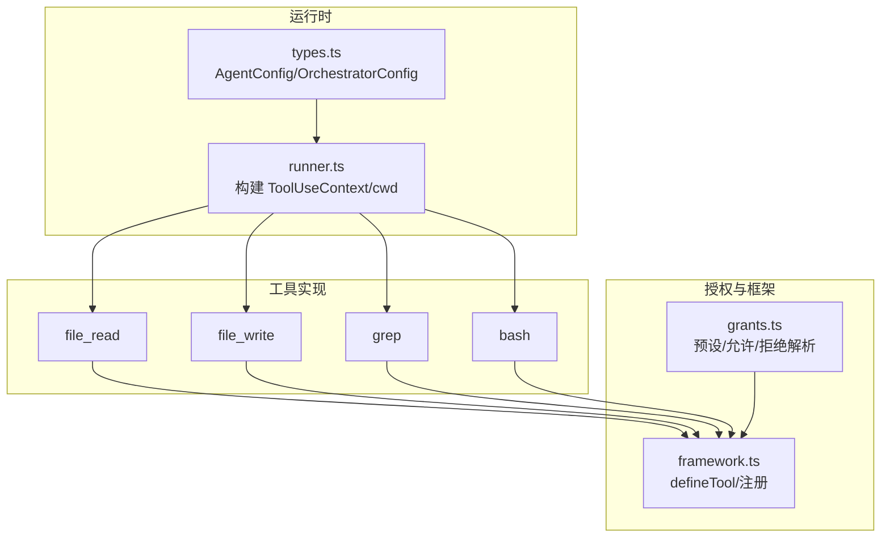
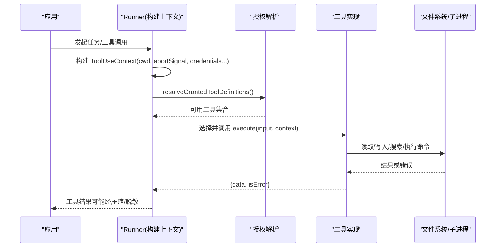
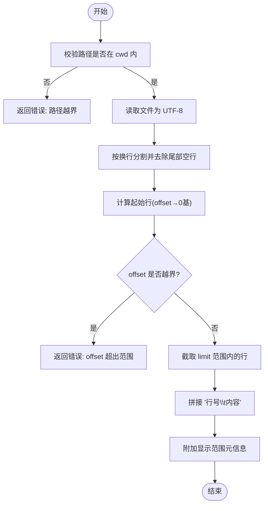
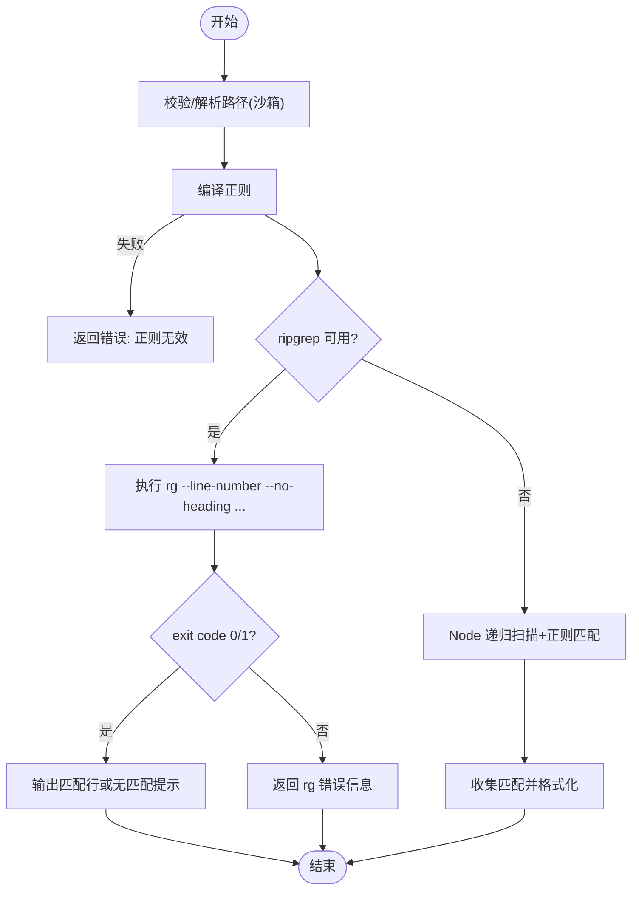
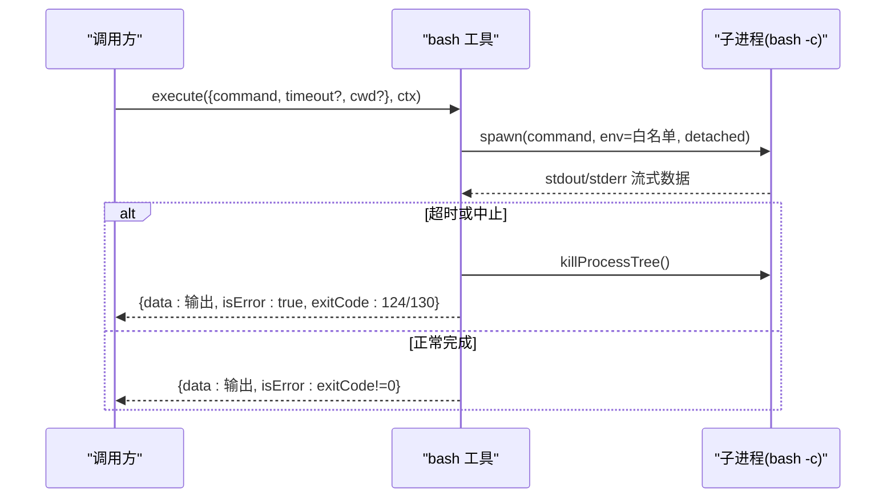
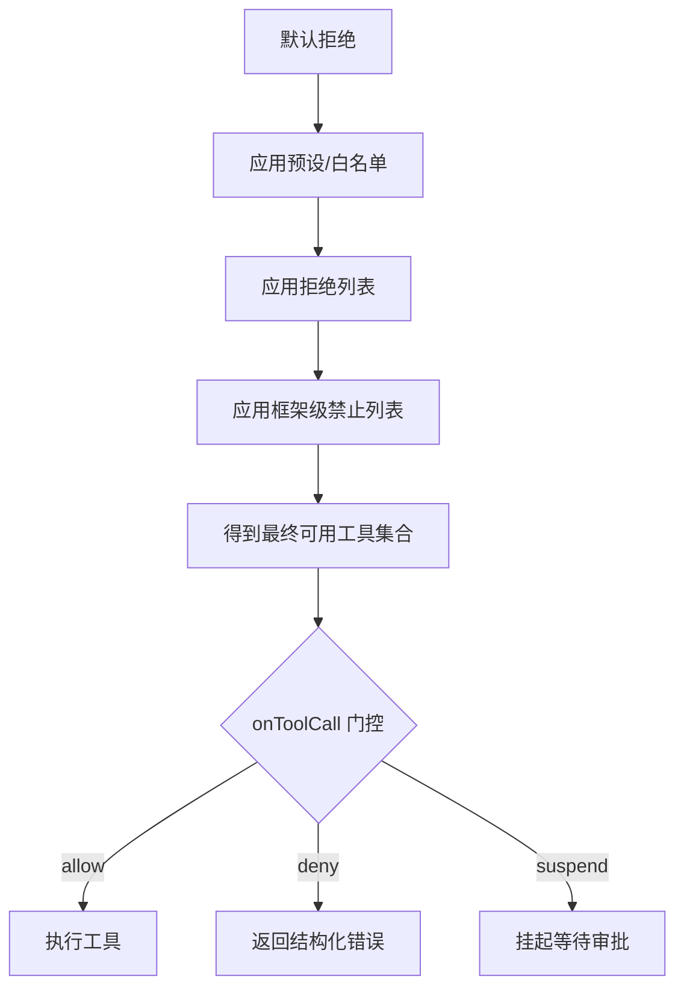
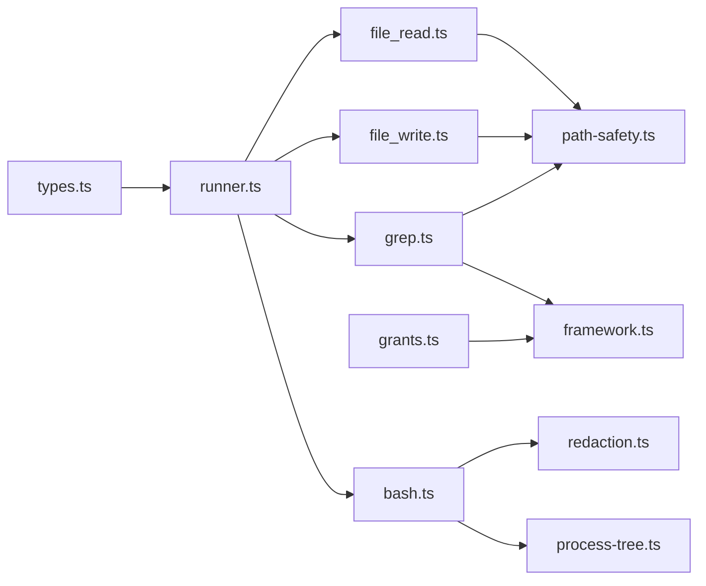

# 内置工具集

<cite>
**本文引用的文件**
- [packages/core/src/tool/built-in/file-read.ts](file://packages/core/src/tool/built-in/file-read.ts)
- [packages/core/src/tool/built-in/file-write.ts](file://packages/core/src/tool/built-in/file-write.ts)
- [packages/core/src/tool/built-in/grep.ts](file://packages/core/src/tool/built-in/grep.ts)
- [packages/core/src/tool/built-in/bash.ts](file://packages/core/src/tool/built-in/bash.ts)
- [packages/core/src/tool/grants.ts](file://packages/core/src/tool/grants.ts)
- [packages/core/src/tool/framework.ts](file://packages/core/src/tool/framework.ts)
- [packages/core/src/types.ts](file://packages/core/src/types.ts)
- [packages/core/src/agent/runner.ts](file://packages/core/src/agent/runner.ts)
- [docs/tool-configuration.md](file://docs/tool-configuration.md)
- [packages/core/README.md](file://packages/core/README.md)
</cite>

## 目录
1. [简介](#简介)
2. [项目结构](#项目结构)
3. [核心组件](#核心组件)
4. [架构总览](#架构总览)
5. [详细组件分析](#详细组件分析)
6. [依赖关系分析](#依赖关系分析)
7. [性能考虑](#性能考虑)
8. [故障排查指南](#故障排查指南)
9. [结论](#结论)
10. [附录](#附录)

## 简介
本章节面向使用 Open Multi-Agent（OMA）的开发者，系统化说明其内置工具集及其使用方法。重点覆盖：
- 文件系统工具：文件读写、目录创建、路径安全与沙箱限制
- 搜索工具：grep 的正则匹配、ripgrep 优先与 Node.js 回退
- 进程执行工具：bash 命令执行、超时控制、环境变量白名单与进程树清理
- 工具授权与安全模型：默认拒绝、预设、允许/拒绝列表、onToolCall 门控、后果性工具标记
- 参数配置、返回值格式、错误处理策略
- 扩展与自定义工具的方式
- 性能优化建议与最佳实践

## 项目结构
内置工具位于 core 包的 tool/built-in 目录下，通过统一的工具框架注册并暴露给 Agent 调用；工具授权与预设由 grants 模块集中管理；运行时上下文与沙箱根目录由 runner 与 types 定义；工具配置与安全策略在 docs/tool-configuration.md 中详细说明。

图表来源
- [packages/core/src/tool/built-in/file-read.ts:17-45](file://packages/core/src/tool/built-in/file-read.ts#L17-L45)
- [packages/core/src/tool/built-in/file-write.ts:18-35](file://packages/core/src/tool/built-in/file-write.ts#L18-L35)
- [packages/core/src/tool/built-in/grep.ts:29-67](file://packages/core/src/tool/built-in/grep.ts#L29-L67)
- [packages/core/src/tool/built-in/bash.ts:37-60](file://packages/core/src/tool/built-in/bash.ts#L37-L60)
- [packages/core/src/tool/grants.ts:11-15](file://packages/core/src/tool/grants.ts#L11-L15)
- [packages/core/src/agent/runner.ts:1796-1810](file://packages/core/src/agent/runner.ts#L1796-L1810)
- [packages/core/src/types.ts:544-557](file://packages/core/src/types.ts#L544-L557)

章节来源
- [packages/core/src/tool/built-in/file-read.ts:1-112](file://packages/core/src/tool/built-in/file-read.ts#L1-L112)
- [packages/core/src/tool/built-in/file-write.ts:1-89](file://packages/core/src/tool/built-in/file-write.ts#L1-L89)
- [packages/core/src/tool/built-in/grep.ts:1-292](file://packages/core/src/tool/built-in/grep.ts#L1-L292)
- [packages/core/src/tool/built-in/bash.ts:1-241](file://packages/core/src/tool/built-in/bash.ts#L1-L241)
- [packages/core/src/tool/grants.ts:1-90](file://packages/core/src/tool/grants.ts#L1-L90)
- [packages/core/src/agent/runner.ts:1796-1810](file://packages/core/src/agent/runner.ts#L1796-L1810)
- [packages/core/src/types.ts:544-557](file://packages/core/src/types.ts#L544-L557)
- [docs/tool-configuration.md:214-238](file://docs/tool-configuration.md#L214-L238)

## 核心组件
- 工具框架与注册：所有内置工具通过 defineTool 声明名称、描述、输入 Schema 与 execute 函数，统一进入工具注册表供调度器分发。
- 工具授权：TOOL_PRESETS 提供 readonly/readwrite/full 三套预设；resolveGrantedToolDefinitions 将预设、tools 白名单、disallowedTools 黑名单与框架级禁止列表组合，得到最终可用工具集合。
- 运行上下文：runner 为每次工具调用构造 ToolUseContext，包含 agent 信息、cwd（工作目录）、abortSignal、runId/taskId/toolCallId、credentials 等。
- 安全与沙箱：文件系统工具强制绝对路径并在 cwd 内校验；bash 不沙箱但支持超时、AbortSignal 与进程组清理；敏感输出会被脱敏。

章节来源
- [packages/core/src/tool/grants.ts:11-15](file://packages/core/src/tool/grants.ts#L11-L15)
- [packages/core/src/tool/grants.ts:35-89](file://packages/core/src/tool/grants.ts#L35-L89)
- [packages/core/src/agent/runner.ts:1796-1810](file://packages/core/src/agent/runner.ts#L1796-L1810)
- [docs/tool-configuration.md:391-441](file://docs/tool-configuration.md#L391-L441)

## 架构总览
下图展示一次工具调用的端到端流程：从编排层构建上下文，到授权检查，再到具体工具执行与结果返回。

图表来源
- [packages/core/src/agent/runner.ts:1796-1810](file://packages/core/src/agent/runner.ts#L1796-L1810)
- [packages/core/src/tool/grants.ts:35-89](file://packages/core/src/tool/grants.ts#L35-L89)
- [packages/core/src/tool/built-in/file-read.ts:47-109](file://packages/core/src/tool/built-in/file-read.ts#L47-L109)
- [packages/core/src/tool/built-in/file-write.ts:37-86](file://packages/core/src/tool/built-in/file-write.ts#L37-L86)
- [packages/core/src/tool/built-in/grep.ts:69-108](file://packages/core/src/tool/built-in/grep.ts#L69-L108)
- [packages/core/src/tool/built-in/bash.ts:62-78](file://packages/core/src/tool/built-in/bash.ts#L62-L78)

## 详细组件分析

### 文件系统工具：file_read
- 功能：按行号读取文件内容，支持 offset/limit 分页读取大文件，输出带“行号\t内容”的文本。
- 参数
  - path：必填，绝对路径
  - offset：可选，起始行号（1 基）
  - limit：可选，最大返回行数
- 返回值
  - data：带行号的文本片段或提示（如超出范围）
  - isError：false 表示成功，true 表示错误（如路径不在沙箱、IO 异常）
- 安全与路径
  - 通过 resolvePathWithinCwd 校验路径必须在 cwd 内（含符号链接解析后），否则返回错误
- 典型用法
  - 读取大型配置文件的前 N 行用于概览
  - 配合 grep 定位问题后再用 file_read 精确查看上下文

图表来源
- [packages/core/src/tool/built-in/file-read.ts:25-45](file://packages/core/src/tool/built-in/file-read.ts#L25-L45)
- [packages/core/src/tool/built-in/file-read.ts:47-109](file://packages/core/src/tool/built-in/file-read.ts#L47-L109)

章节来源
- [packages/core/src/tool/built-in/file-read.ts:1-112](file://packages/core/src/tool/built-in/file-read.ts#L1-L112)

### 文件系统工具：file_write
- 功能：创建或覆盖写入文件，自动创建父目录（等效 mkdir -p）。
- 参数
  - path：必填，绝对路径
  - content：必填，要写入的字符串内容
- 返回值
  - data：记录“创建/更新”、行数与字节数
  - isError：false 表示成功，true 表示 IO 或目录创建失败
- 安全与路径
  - 同样受 cwd 沙箱约束；ensureRoot=true 确保根目录存在
- 典型用法
  - 生成报告、补丁文件或临时数据
  - 批量生成测试数据

图表来源
- [packages/core/src/tool/built-in/file-write.ts:27-35](file://packages/core/src/tool/built-in/file-write.ts#L27-L35)
- [packages/core/src/tool/built-in/file-write.ts:37-86](file://packages/core/src/tool/built-in/file-write.ts#L37-L86)

章节来源
- [packages/core/src/tool/built-in/file-write.ts:1-89](file://packages/core/src/tool/built-in/file-write.ts#L1-L89)

### 搜索工具：grep
- 功能：在文件或目录中按正则搜索匹配行，优先使用 ripgrep（rg），不可用时回退到纯 Node.js 实现。
- 参数
  - pattern：必填，正则表达式
  - path：可选，目标目录或文件，默认工具工作目录
  - glob：可选，过滤文件模式（当 path 为目录时生效）
  - maxResults：可选，最大返回匹配行数（默认 100）
- 返回值
  - data：匹配行（含文件路径与行号），无匹配时返回友好提示
  - isError：false 表示正常（包括无匹配），true 表示非法正则或 rg 进程错误
- 行为细节
  - 正则编译失败立即报错
  - rg 退出码 1 视为“无匹配”，非 0/1 视为错误
  - Node 回退会跳过不可读文件，避免中断搜索
- 典型用法
  - 快速定位代码中的关键字、错误日志、配置项

图表来源
- [packages/core/src/tool/built-in/grep.ts:39-67](file://packages/core/src/tool/built-in/grep.ts#L39-L67)
- [packages/core/src/tool/built-in/grep.ts:69-108](file://packages/core/src/tool/built-in/grep.ts#L69-L108)
- [packages/core/src/tool/built-in/grep.ts:122-193](file://packages/core/src/tool/built-in/grep.ts#L122-L193)
- [packages/core/src/tool/built-in/grep.ts:205-273](file://packages/core/src/tool/built-in/grep.ts#L205-L273)

章节来源
- [packages/core/src/tool/built-in/grep.ts:1-292](file://packages/core/src/tool/built-in/grep.ts#L1-L292)

### 进程执行工具：bash
- 功能：以 bash -c 方式执行命令，捕获 stdout/stderr，支持超时与 AbortSignal。
- 参数
  - command：必填，要执行的 shell 命令
  - timeout：可选，超时毫秒数（默认 30000）
  - cwd：可选，命令工作目录
- 返回值
  - data：合并后的标准输出与错误输出（必要时标注 stderr 段）
  - isError：基于 exitCode 判断（非 0 为错误）
- 安全与环境
  - 环境变量白名单：仅传递 HOME/LANG/PATH 等必要变量，敏感键名会被过滤
  - 超时/中止：到达时间或收到 AbortSignal 时会终止整个进程树
  - 输出脱敏：对敏感信息进行脱敏处理
- 典型用法
  - 安装依赖、运行脚本、查询系统状态
  - 注意：bash 不受 cwd 沙箱限制，应谨慎授予

图表来源
- [packages/core/src/tool/built-in/bash.ts:37-78](file://packages/core/src/tool/built-in/bash.ts#L37-L78)
- [packages/core/src/tool/built-in/bash.ts:100-196](file://packages/core/src/tool/built-in/bash.ts#L100-L196)
- [packages/core/src/tool/built-in/bash.ts:198-241](file://packages/core/src/tool/built-in/bash.ts#L198-L241)

章节来源
- [packages/core/src/tool/built-in/bash.ts:1-241](file://packages/core/src/tool/built-in/bash.ts#L1-L241)

### 工具授权与安全模型
- 默认拒绝：未显式授予任何工具时，Agent 无法调用内置工具（bash、file_*、grep、glob 等）。
- 预设与过滤：
  - readonly：file_read、grep、glob
  - readwrite：readonly + file_write、file_edit
  - full：readwrite + bash
  - 可通过 tools 白名单与 disallowedTools 黑名单进一步裁剪
- 后果性工具：bash、file_write、file_edit 被标记为 consequential，可在未声明治理拓扑时触发确认门控（可配置 requireConsequentialConfirmation）。
- onToolCall 门控：在输入校验之后、execute 之前拦截单次调用，支持 allow/deny/suspend；suspend 可与持久化审批结合。
- 沙箱：文件系统工具强制绝对路径且在 cwd 内校验；bash 不沙箱但支持超时与进程树清理。

图表来源
- [packages/core/src/tool/grants.ts:11-15](file://packages/core/src/tool/grants.ts#L11-L15)
- [packages/core/src/tool/grants.ts:35-89](file://packages/core/src/tool/grants.ts#L35-L89)
- [docs/tool-configuration.md:214-238](file://docs/tool-configuration.md#L214-L238)
- [docs/tool-configuration.md:326-363](file://docs/tool-configuration.md#L326-L363)

章节来源
- [packages/core/src/tool/grants.ts:1-90](file://packages/core/src/tool/grants.ts#L1-L90)
- [docs/tool-configuration.md:214-363](file://docs/tool-configuration.md#L214-L363)

### 常见任务示例（步骤指引）
以下为常见任务的步骤式示例（不包含代码片段，仅提供操作路径参考）：
- 读取大文件的指定段落
  - 使用 file_read，传入绝对路径与 offset/limit，获取带行号的片段
  - 参考：[file_read 参数与返回:25-45](file://packages/core/src/tool/built-in/file-read.ts#L25-L45)
- 生成或更新配置文件
  - 使用 file_write，传入绝对路径与内容，自动创建父目录
  - 参考：[file_write 参数与返回:27-35](file://packages/core/src/tool/built-in/file-write.ts#L27-L35)
- 在项目中搜索关键字
  - 使用 grep，传入正则与目标路径，必要时设置 glob 与 maxResults
  - 参考：[grep 参数与行为:39-67](file://packages/core/src/tool/built-in/grep.ts#L39-L67)
- 执行一次性脚本
  - 使用 bash，设置合理 timeout 与 cwd，关注 exitCode 与输出
  - 参考：[bash 参数与超时:47-60](file://packages/core/src/tool/built-in/bash.ts#L47-L60)

章节来源
- [packages/core/src/tool/built-in/file-read.ts:25-45](file://packages/core/src/tool/built-in/file-read.ts#L25-L45)
- [packages/core/src/tool/built-in/file-write.ts:27-35](file://packages/core/src/tool/built-in/file-write.ts#L27-L35)
- [packages/core/src/tool/built-in/grep.ts:39-67](file://packages/core/src/tool/built-in/grep.ts#L39-L67)
- [packages/core/src/tool/built-in/bash.ts:47-60](file://packages/core/src/tool/built-in/bash.ts#L47-L60)

## 依赖关系分析
- 工具实现依赖：
  - file_read/file_write：fs/promises、path、zod、path-safety（cwd 校验）
  - grep：child_process（ripgrep）、fs/promises、path、fs-walk（目录遍历）、path-safety
  - bash：child_process、utils/redaction、utils/process-tree
- 授权与框架：
  - grants.ts 提供预设与解析逻辑
  - framework.ts 提供 defineTool 与工具注册
- 运行时：
  - runner.ts 构建 ToolUseContext（含 cwd、abortSignal、credentials）
  - types.ts 定义 AgentConfig/OrchestratorConfig 中与工具相关的字段（如 defaultCwd、toolPreset、tools、disallowedTools）

图表来源
- [packages/core/src/tool/built-in/file-read.ts:8-12](file://packages/core/src/tool/built-in/file-read.ts#L8-L12)
- [packages/core/src/tool/built-in/file-write.ts:8-13](file://packages/core/src/tool/built-in/file-write.ts#L8-L13)
- [packages/core/src/tool/built-in/grep.ts:10-18](file://packages/core/src/tool/built-in/grep.ts#L10-L18)
- [packages/core/src/tool/built-in/bash.ts:8-13](file://packages/core/src/tool/built-in/bash.ts#L8-L13)
- [packages/core/src/tool/grants.ts:1-90](file://packages/core/src/tool/grants.ts#L1-L90)
- [packages/core/src/agent/runner.ts:1796-1810](file://packages/core/src/agent/runner.ts#L1796-L1810)
- [packages/core/src/types.ts:544-557](file://packages/core/src/types.ts#L544-L557)

章节来源
- [packages/core/src/tool/built-in/file-read.ts:1-112](file://packages/core/src/tool/built-in/file-read.ts#L1-L112)
- [packages/core/src/tool/built-in/file-write.ts:1-89](file://packages/core/src/tool/built-in/file-write.ts#L1-L89)
- [packages/core/src/tool/built-in/grep.ts:1-292](file://packages/core/src/tool/built-in/grep.ts#L1-L292)
- [packages/core/src/tool/built-in/bash.ts:1-241](file://packages/core/src/tool/built-in/bash.ts#L1-L241)
- [packages/core/src/tool/grants.ts:1-90](file://packages/core/src/tool/grants.ts#L1-L90)
- [packages/core/src/agent/runner.ts:1796-1810](file://packages/core/src/agent/runner.ts#L1796-L1810)
- [packages/core/src/types.ts:544-557](file://packages/core/src/types.ts#L544-L557)

## 性能考虑
- 优先使用 ripgrep：grep 工具在未安装 rg 时回退到 Node 实现，性能差异显著；建议在环境中安装 rg 以获得更好吞吐。
- 限制搜索结果：合理设置 grep.maxResults，避免大量匹配导致响应过大。
- 分块读取大文件：file_read 使用 offset/limit 分页，避免一次性加载完整文件。
- 控制工具输出大小：通过 AgentConfig.maxToolOutputChars 或工具级 maxOutputChars 限制输出长度，减少上下文膨胀。
- 压缩历史工具结果：开启 compressToolResults，降低后续轮次的 token 成本。
- 谨慎授予 bash：bash 不受沙箱限制且可执行任意命令，仅在必要时授予，并结合 onToolCall 进行细粒度门控。
- 超时与中止：为长耗时命令设置 timeout，并监听 AbortSignal，及时释放资源。

章节来源
- [packages/core/src/tool/built-in/grep.ts:23-67](file://packages/core/src/tool/built-in/grep.ts#L23-L67)
- [packages/core/src/tool/built-in/file-read.ts:25-45](file://packages/core/src/tool/built-in/file-read.ts#L25-L45)
- [docs/tool-configuration.md:507-673](file://docs/tool-configuration.md#L507-L673)
- [packages/core/src/tool/built-in/bash.ts:47-60](file://packages/core/src/tool/built-in/bash.ts#L47-L60)

## 故障排查指南
- 路径越界错误（file_read/file_write/grep）
  - 现象：返回错误，提示路径不在沙箱
  - 原因：传入路径解析后不在当前 Agent 的 cwd 内
  - 解决：调整 AgentConfig.cwd 或使用相对路径并确保在沙箱内
  - 参考：[cwd 与沙箱规则:544-557](file://packages/core/src/types.ts#L544-L557)、[工具配置-文件系统工作目录:391-441](file://docs/tool-configuration.md#L391-L441)
- 正则无效（grep）
  - 现象：返回错误，提示正则无效
  - 原因：pattern 不是合法正则
  - 解决：修正正则语法或在客户端预校验
  - 参考：[grep 正则编译:79-88](file://packages/core/src/tool/built-in/grep.ts#L79-L88)
- ripgrep 进程错误（grep）
  - 现象：返回错误，提示 rg 进程错误
  - 原因：rg 执行异常或权限问题
  - 解决：检查 rg 安装与权限，或依赖 Node 回退继续执行
  - 参考：[grep rg 分支:122-193](file://packages/core/src/tool/built-in/grep.ts#L122-L193)
- bash 超时或被中止
  - 现象：返回错误，exitCode 为 124（超时）或 130（中止）
  - 原因：超过 timeout 或收到 AbortSignal
  - 解决：增大 timeout 或优化命令；确保上游正确取消
  - 参考：[bash 超时与中止:137-179](file://packages/core/src/tool/built-in/bash.ts#L137-L179)
- 环境变量泄露风险
  - 现象：shell 输出包含敏感信息
  - 原因：未启用脱敏或未限制环境变量
  - 解决：使用内置脱敏与白名单机制，避免向子进程传递敏感变量
  - 参考：[bash 环境白名单与脱敏:198-207](file://packages/core/src/tool/built-in/bash.ts#L198-L207)

章节来源
- [packages/core/src/tool/built-in/file-read.ts:47-64](file://packages/core/src/tool/built-in/file-read.ts#L47-L64)
- [packages/core/src/tool/built-in/file-write.ts:37-75](file://packages/core/src/tool/built-in/file-write.ts#L37-L75)
- [packages/core/src/tool/built-in/grep.ts:79-88](file://packages/core/src/tool/built-in/grep.ts#L79-L88)
- [packages/core/src/tool/built-in/grep.ts:153-191](file://packages/core/src/tool/built-in/grep.ts#L153-L191)
- [packages/core/src/tool/built-in/bash.ts:137-179](file://packages/core/src/tool/built-in/bash.ts#L137-L179)
- [packages/core/src/tool/built-in/bash.ts:198-207](file://packages/core/src/tool/built-in/bash.ts#L198-L207)

## 结论
Open Multi-Agent 的内置工具集围绕“默认拒绝、最小授权、可控执行”的安全原则设计。文件系统工具提供安全的读写与搜索能力，bash 提供强大的进程执行能力但需严格管控。通过预设、白/黑名单、onToolCall 门控与 cwd 沙箱，可以在灵活性与安全性之间取得平衡。生产环境中建议：
- 明确授予最小必要工具集
- 为长耗时命令设置超时与中止
- 限制工具输出大小并压缩历史结果
- 对后果性工具启用确认门控
- 在需要时安装 ripgrep 以提升搜索性能

## 附录

### 工具参数与返回值速查
- file_read
  - 参数：path（必填，绝对路径）、offset（可选，1 基）、limit（可选，正整数）
  - 返回：{ data: 文本, isError: boolean }
  - 参考：[file_read 定义:25-45](file://packages/core/src/tool/built-in/file-read.ts#L25-L45)
- file_write
  - 参数：path（必填，绝对路径）、content（必填，字符串）
  - 返回：{ data: 创建/更新摘要, isError: boolean }
  - 参考：[file_write 定义:27-35](file://packages/core/src/tool/built-in/file-write.ts#L27-L35)
- grep
  - 参数：pattern（必填，正则）、path（可选）、glob（可选）、maxResults（可选，正整数）
  - 返回：{ data: 匹配行或提示, isError: boolean }
  - 参考：[grep 定义:39-67](file://packages/core/src/tool/built-in/grep.ts#L39-L67)
- bash
  - 参数：command（必填）、timeout（可选，毫秒）、cwd（可选）
  - 返回：{ data: 输出, isError: boolean }
  - 参考：[bash 定义:47-60](file://packages/core/src/tool/built-in/bash.ts#L47-L60)

章节来源
- [packages/core/src/tool/built-in/file-read.ts:25-45](file://packages/core/src/tool/built-in/file-read.ts#L25-L45)
- [packages/core/src/tool/built-in/file-write.ts:27-35](file://packages/core/src/tool/built-in/file-write.ts#L27-L35)
- [packages/core/src/tool/built-in/grep.ts:39-67](file://packages/core/src/tool/built-in/grep.ts#L39-L67)
- [packages/core/src/tool/built-in/bash.ts:47-60](file://packages/core/src/tool/built-in/bash.ts#L47-L60)

### 扩展与自定义工具
- 使用 defineTool 定义新工具，并通过 customTools 注入到 Agent 配置，或通过 agent.addTool 在运行时注册
- 自定义工具不受预设/白名单过滤影响，但仍受 disallowedTools 与 onToolCall 门控约束
- 如需媒体输出，可使用 modelOutput 返回 text/image/file 等多部分内容
- 参考：
  - [工具配置-自定义工具:443-467](file://docs/tool-configuration.md#L443-L467)
  - [工具配置-丰富结果与媒体:540-648](file://docs/tool-configuration.md#L540-L648)

章节来源
- [docs/tool-configuration.md:443-467](file://docs/tool-configuration.md#L443-L467)
- [docs/tool-configuration.md:540-648](file://docs/tool-configuration.md#L540-L648)

### 安全与权限控制要点
- 默认拒绝：未显式授予则无任何内置工具可用
- 预设与过滤：readonly/readwrite/full 三档预设，结合 tools/disallowedTools 精细控制
- 后果性工具：bash/file_write/file_edit 标记为 consequential，可触发确认门控
- 沙箱：文件系统工具强制 cwd 内路径；bash 不沙箱但支持超时与进程树清理
- 参考：
  - [工具配置-默认拒绝与预设:214-238](file://docs/tool-configuration.md#L214-L238)
  - [工具配置-后果性工具与确认:140-213](file://docs/tool-configuration.md#L140-L213)
  - [工具配置-文件系统工作目录:391-441](file://docs/tool-configuration.md#L391-L441)

章节来源
- [docs/tool-configuration.md:140-238](file://docs/tool-configuration.md#L140-L238)
- [docs/tool-configuration.md:391-441](file://docs/tool-configuration.md#L391-L441)

### 相关文档与入口
- 核心包使用说明与示例索引
  - 参考：[Core README](file://packages/core/README.md)
- 工具与沙箱配置指南
  - 参考：[工具配置](file://docs/tool-configuration.md)

章节来源
- [packages/core/README.md:254-326](file://packages/core/README.md#L254-L326)
- [docs/tool-configuration.md:1-709](file://docs/tool-configuration.md#L1-L709)