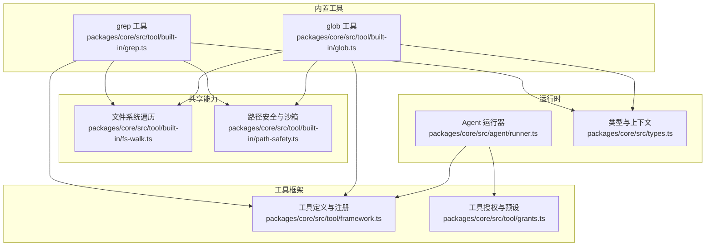
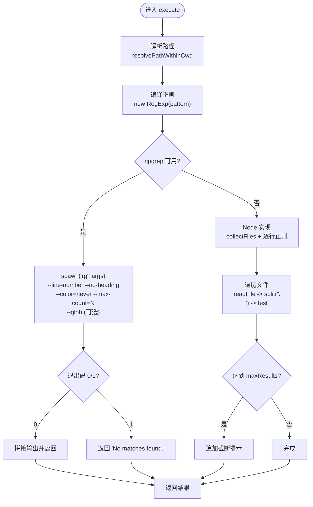
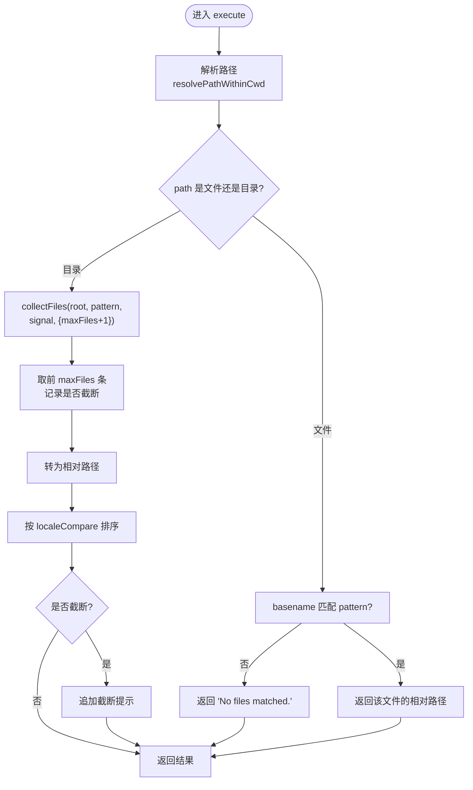
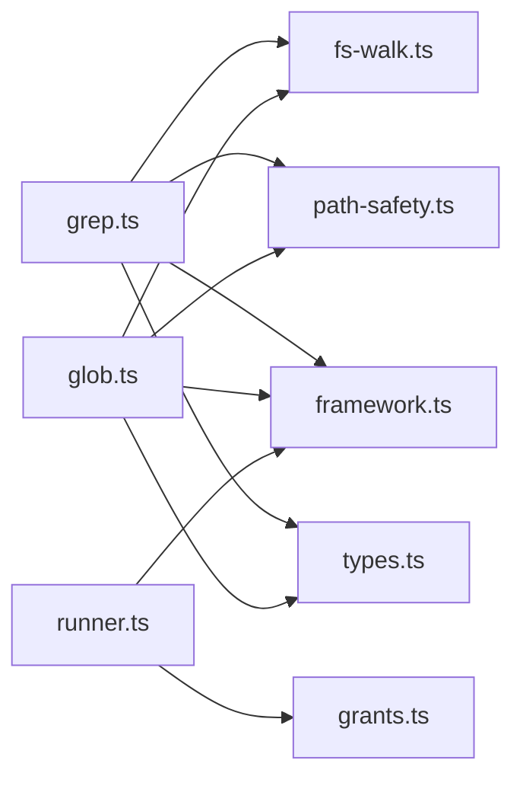

# 搜索工具

<cite>
**本文引用的文件**
- [grep.ts](file://packages/core/src/tool/built-in/grep.ts)
- [glob.ts](file://packages/core/src/tool/built-in/glob.ts)
- [fs-walk.ts](file://packages/core/src/tool/built-in/fs-walk.ts)
- [path-safety.ts](file://packages/core/src/tool/built-in/path-safety.ts)
- [framework.ts](file://packages/core/src/tool/framework.ts)
- [grants.ts](file://packages/core/src/tool/grants.ts)
- [types.ts](file://packages/core/src/types.ts)
- [runner.ts](file://packages/core/src/agent/runner.ts)
- [index.ts](file://packages/core/src/tool/built-in/index.ts)
</cite>

## 目录
1. [简介](#简介)
2. [项目结构](#项目结构)
3. [核心组件](#核心组件)
4. [架构总览](#架构总览)
5. [详细组件分析](#详细组件分析)
6. [依赖关系分析](#依赖关系分析)
7. [性能考虑](#性能考虑)
8. [故障排除指南](#故障排除指南)
9. [结论](#结论)
10. [附录：常见用法与最佳实践](#附录：常见用法与最佳实践)

## 简介
本文件系统性介绍 Open Multi-Agent 内置的搜索工具集，重点覆盖 grep 与 glob 两大能力。内容涵盖：
- grepTool：正则表达式匹配、多文件搜索、结果过滤与截断、ripgrep 优先与 Node.js 回退策略
- globTool：路径模式匹配、通配符使用、递归遍历、跳过目录、结果排序与截断
- 安全沙箱：工作目录限制、符号链接解析、路径越界保护
- 授权与配置：工具预设、允许/禁止列表、运行上下文（cwd、中止信号）
- 性能优化：大规模目录扫描、结果上限控制、避免重复 IO
- 常见问题与排障：权限、路径、正则错误、无匹配等

## 项目结构
搜索工具位于 core 包的内置工具模块中，围绕统一的工具框架定义与注册机制实现，并通过共享的文件系统遍历与安全模块保证一致性与安全性。

图表来源
- [grep.ts:29-108](file://packages/core/src/tool/built-in/grep.ts#L29-L108)
- [glob.ts:18-106](file://packages/core/src/tool/built-in/glob.ts#L18-L106)
- [fs-walk.ts:31-84](file://packages/core/src/tool/built-in/fs-walk.ts#L31-L84)
- [path-safety.ts:30-97](file://packages/core/src/tool/built-in/path-safety.ts#L30-L97)
- [framework.ts:71-117](file://packages/core/src/tool/framework.ts#L71-L117)
- [grants.ts:11-15](file://packages/core/src/tool/grants.ts#L11-L15)
- [runner.ts:817-827](file://packages/core/src/agent/runner.ts#L817-L827)
- [types.ts:544-557](file://packages/core/src/types.ts#L544-L557)

章节来源
- [grep.ts:29-108](file://packages/core/src/tool/built-in/grep.ts#L29-L108)
- [glob.ts:18-106](file://packages/core/src/tool/built-in/glob.ts#L18-L106)
- [fs-walk.ts:31-84](file://packages/core/src/tool/built-in/fs-walk.ts#L31-L84)
- [path-safety.ts:30-97](file://packages/core/src/tool/built-in/path-safety.ts#L30-L97)
- [framework.ts:71-117](file://packages/core/src/tool/framework.ts#L71-L117)
- [grants.ts:11-15](file://packages/core/src/tool/grants.ts#L11-L15)
- [runner.ts:817-827](file://packages/core/src/agent/runner.ts#L817-L827)
- [types.ts:544-557](file://packages/core/src/types.ts#L544-L557)

## 核心组件
- grepTool：在文件或目录中按正则搜索内容，返回匹配行、文件路径与行号；支持通过 glob 限定文件范围；默认限制结果数量；优先使用 ripgrep，不可用时回退到 Node.js 实现。
- globTool：列出目录下匹配文件名模式的文件路径，不读取内容；支持递归遍历、跳过常见大目录、结果排序与数量限制。
- fs-walk：提供一致的递归遍历逻辑与最小化 glob 匹配（支持 * 与 **/ 前缀），并跳过 .git、node_modules 等目录。
- path-safety：统一的路径安全校验与沙箱根目录解析，确保所有读写操作在受控工作目录内，并处理符号链接与不存在路径。
- framework：defineTool 定义工具、ToolRegistry 注册与导出 LLM 可用的 JSON Schema。
- grants：工具预设（readonly/readwrite/full）与允许/禁止列表的解析，决定 agent 实际可用工具集合。
- runner：构建 ToolUseContext（含 cwd、abortSignal 等），并在运行期解析最终可用工具。

章节来源
- [grep.ts:29-108](file://packages/core/src/tool/built-in/grep.ts#L29-L108)
- [glob.ts:18-106](file://packages/core/src/tool/built-in/glob.ts#L18-L106)
- [fs-walk.ts:31-84](file://packages/core/src/tool/built-in/fs-walk.ts#L31-L84)
- [path-safety.ts:30-97](file://packages/core/src/tool/built-in/path-safety.ts#L30-L97)
- [framework.ts:71-117](file://packages/core/src/tool/framework.ts#L71-L117)
- [grants.ts:11-15](file://packages/core/src/tool/grants.ts#L11-L15)
- [runner.ts:1795-1810](file://packages/core/src/agent/runner.ts#L1795-L1810)

## 架构总览
下图展示了从 Agent 运行器到具体搜索工具的调用链路与数据流。

图表来源
- [runner.ts:817-827](file://packages/core/src/agent/runner.ts#L817-L827)
- [framework.ts:71-117](file://packages/core/src/tool/framework.ts#L71-L117)
- [grep.ts:29-108](file://packages/core/src/tool/built-in/grep.ts#L29-L108)
- [glob.ts:18-106](file://packages/core/src/tool/built-in/glob.ts#L18-L106)
- [fs-walk.ts:31-84](file://packages/core/src/tool/built-in/fs-walk.ts#L31-L84)
- [path-safety.ts:30-97](file://packages/core/src/tool/built-in/path-safety.ts#L30-L97)

## 详细组件分析

### grep 工具
- 功能要点
  - 参数：pattern（必填）、path（可选，默认工作目录）、glob（可选，仅当 path 为目录时生效）、maxResults（可选，默认 100）
  - 输出：每行形如“相对路径:行号:匹配文本”，若未命中返回“无匹配”
  - 性能：优先尝试 ripgrep（rg），失败则回退到 Node.js 递归实现
  - 安全：通过 resolvePathWithinCwd 强制绝对路径并在沙箱根目录内解析，拒绝越界路径
  - 取消：支持 AbortSignal，可在长时间搜索时中断
- 执行流程
  - 编译正则，非法立即报错
  - 若 rg 可用，构造参数并启动子进程，收集 stdout/stderr，根据退出码判断结果
  - 否则使用 Node 实现：collectFiles 获取候选文件，逐行正则匹配，累积结果至 maxResults
  - 结果格式化并附加截断提示（当达到上限）

图表来源
- [grep.ts:69-108](file://packages/core/src/tool/built-in/grep.ts#L69-L108)
- [grep.ts:122-193](file://packages/core/src/tool/built-in/grep.ts#L122-L193)
- [grep.ts:205-273](file://packages/core/src/tool/built-in/grep.ts#L205-L273)
- [fs-walk.ts:31-84](file://packages/core/src/tool/built-in/fs-walk.ts#L31-L84)
- [path-safety.ts:30-97](file://packages/core/src/tool/built-in/path-safety.ts#L30-L97)

章节来源
- [grep.ts:29-108](file://packages/core/src/tool/built-in/grep.ts#L29-L108)
- [grep.ts:122-193](file://packages/core/src/tool/built-in/grep.ts#L122-L193)
- [grep.ts:205-273](file://packages/core/src/tool/built-in/grep.ts#L205-L273)

### glob 工具
- 功能要点
  - 参数：path（可选，默认工作目录）、pattern（可选，文件名 glob）、maxFiles（可选，默认 500）
  - 行为：不读取文件内容；递归遍历目录；跳过 .git、node_modules、dist、build 等目录；结果按字典序排序
  - 输出：相对路径列表，若为空返回“无匹配”；超过上限会附加截断提示
- 执行流程
  - 解析安全路径
  - 若 path 指向文件：直接按 pattern 匹配文件名
  - 若为目录：collectFiles 递归收集，最多收集 maxFiles+1 以检测是否截断
  - 将绝对路径转换为相对于根目录的相对路径，排序后返回

图表来源
- [glob.ts:18-106](file://packages/core/src/tool/built-in/glob.ts#L18-L106)
- [fs-walk.ts:31-84](file://packages/core/src/tool/built-in/fs-walk.ts#L31-L84)
- [path-safety.ts:30-97](file://packages/core/src/tool/built-in/path-safety.ts#L30-L97)

章节来源
- [glob.ts:18-106](file://packages/core/src/tool/built-in/glob.ts#L18-L106)

### 文件系统遍历与路径安全
- fs-walk
  - SKIP_DIRS：跳过 .git、.svn、.hg、node_modules、.next、dist、build
  - collectFiles：递归遍历，支持 glob 过滤与最大文件数限制，支持中止信号
  - matchesGlob：最小化 glob 匹配，支持 *.ext 与 **/ 前缀
- path-safety
  - defaultWorkspaceDir：默认沙箱根目录为 process.cwd()/.agent-workspace
  - resolvePathWithinCwd：强制绝对路径、解析真实路径、校验是否在根目录内、处理符号链接、必要时创建根目录（写工具）

章节来源
- [fs-walk.ts:11-20](file://packages/core/src/tool/built-in/fs-walk.ts#L11-L20)
- [fs-walk.ts:31-84](file://packages/core/src/tool/built-in/fs-walk.ts#L31-L84)
- [fs-walk.ts:91-99](file://packages/core/src/tool/built-in/fs-walk.ts#L91-L99)
- [path-safety.ts:15-24](file://packages/core/src/tool/built-in/path-safety.ts#L15-L24)
- [path-safety.ts:30-97](file://packages/core/src/tool/built-in/path-safety.ts#L30-L97)

### 工具框架与授权
- defineTool：声明工具名称、描述、输入 schema、执行函数与可选输出约束
- ToolRegistry：注册/列举/转换工具为 LLM 可用的 JSON Schema
- 工具预设与授权
  - readonly：file_read、grep、glob
  - readwrite：file_read、file_write、file_edit、grep、glob
  - full：上述 + bash
  - 允许/禁止列表与框架级禁用规则共同决定最终可用工具集合

章节来源
- [framework.ts:71-117](file://packages/core/src/tool/framework.ts#L71-L117)
- [framework.ts:127-261](file://packages/core/src/tool/framework.ts#L127-L261)
- [grants.ts:11-15](file://packages/core/src/tool/grants.ts#L11-L15)
- [grants.ts:35-89](file://packages/core/src/tool/grants.ts#L35-L89)

### 运行期上下文与配置
- ToolUseContext.cwd：文件系统工具的工作目录（string/null/undefined），用于沙箱控制
- runner 构建上下文：注入 agent 信息、abortSignal、credentials、runId/taskId 等
- 工具解析：基于预设/白名单/黑名单计算最终可用工具

章节来源
- [types.ts:544-557](file://packages/core/src/types.ts#L544-L557)
- [runner.ts:1795-1810](file://packages/core/src/agent/runner.ts#L1795-L1810)
- [runner.ts:817-827](file://packages/core/src/agent/runner.ts#L817-L827)

## 依赖关系分析
- grep 与 glob 均依赖 fs-walk 进行递归遍历与 glob 匹配
- 两者都通过 path-safety 进行路径安全校验，确保在沙箱内访问
- 工具通过 framework 的 defineTool 定义，并由 registry 注册与导出
- runner 在运行期解析工具授权，决定哪些工具对当前 agent 可见
- 类型定义集中在 types.ts，贯穿上下文与配置

图表来源
- [grep.ts:29-108](file://packages/core/src/tool/built-in/grep.ts#L29-L108)
- [glob.ts:18-106](file://packages/core/src/tool/built-in/glob.ts#L18-L106)
- [fs-walk.ts:31-84](file://packages/core/src/tool/built-in/fs-walk.ts#L31-L84)
- [path-safety.ts:30-97](file://packages/core/src/tool/built-in/path-safety.ts#L30-L97)
- [framework.ts:71-117](file://packages/core/src/tool/framework.ts#L71-L117)
- [grants.ts:11-15](file://packages/core/src/tool/grants.ts#L11-L15)
- [runner.ts:817-827](file://packages/core/src/agent/runner.ts#L817-L827)
- [types.ts:544-557](file://packages/core/src/types.ts#L544-L557)

章节来源
- [grep.ts:29-108](file://packages/core/src/tool/built-in/grep.ts#L29-L108)
- [glob.ts:18-106](file://packages/core/src/tool/built-in/glob.ts#L18-L106)
- [fs-walk.ts:31-84](file://packages/core/src/tool/built-in/fs-walk.ts#L31-L84)
- [path-safety.ts:30-97](file://packages/core/src/tool/built-in/path-safety.ts#L30-L97)
- [framework.ts:71-117](file://packages/core/src/tool/framework.ts#L71-L117)
- [grants.ts:11-15](file://packages/core/src/tool/grants.ts#L11-L15)
- [runner.ts:817-827](file://packages/core/src/agent/runner.ts#L817-L827)
- [types.ts:544-557](file://packages/core/src/types.ts#L544-L557)

## 性能考虑
- 优先使用 ripgrep：当环境安装 rg 时，grep 走外部进程，利用其 C++ 实现的高性能匹配与并行扫描
- 限制结果规模：grep 的 maxResults 与 glob 的 maxFiles 防止结果过大导致响应膨胀与内存压力
- 跳过无关目录：fs-walk 默认跳过 .git、node_modules、dist、build 等，减少不必要遍历
- 尽早短路：Node 回退实现中，一旦达到 maxResults 即停止继续匹配；glob 收集阶段也提前终止
- 支持中止：传递 AbortSignal，便于在长时间任务中及时中断
- 避免重复 IO：glob 不读取文件内容，仅在需要时由 grep 读取匹配文件

[本节为通用性能建议，不直接分析特定文件]

## 故障排除指南
- 路径不在沙箱内
  - 现象：报错提示路径超出工作目录
  - 原因：resolvePathWithinCwd 校验失败（相对路径、符号链接逃逸等）
  - 解决：传入绝对路径；调整 OrchestratorConfig.defaultCwd 或 AgentConfig.cwd；如需完全放开，可将 cwd 设为 null
- 无法访问路径
  - 现象：报“Cannot access path ...”
  - 原因：权限不足、路径不存在或目录不可读
  - 解决：检查文件系统权限与路径有效性
- 正则表达式无效
  - 现象：grep 返回“Invalid regular expression”
  - 解决：修正正则语法或使用更简单的模式
- 无匹配结果
  - 现象：返回“No matches found.”或“No files matched.”
  - 解决：确认 pattern/glob 是否正确；缩小/扩大搜索范围；检查是否被 SKIP_DIRS 排除
- 结果被截断
  - 现象：末尾提示“results capped at N”或“listing capped at N”
  - 解决：增大 maxResults/maxFiles；分批次搜索
- ripgrep 进程错误
  - 现象：返回“ripgrep process error — run may be retried with the Node.js fallback.”
  - 说明：rg 可用但执行出错，内部已回退到 Node 实现的策略；可重试或改用 Node 实现
- 工具未被授予
  - 现象：模型无法调用 grep/glob
  - 原因：工具预设/白名单/黑名单未包含
  - 解决：设置 toolPreset 为 readonly/readwrite/full，或在 allowedTools 中包含；注意 disallowedTools 会覆盖

章节来源
- [path-safety.ts:30-97](file://packages/core/src/tool/built-in/path-safety.ts#L30-L97)
- [path-safety.ts:115-124](file://packages/core/src/tool/built-in/path-safety.ts#L115-L124)
- [grep.ts:79-88](file://packages/core/src/tool/built-in/grep.ts#L79-L88)
- [grep.ts:153-191](file://packages/core/src/tool/built-in/grep.ts#L153-L191)
- [glob.ts:65-90](file://packages/core/src/tool/built-in/glob.ts#L65-L90)
- [grants.ts:35-89](file://packages/core/src/tool/grants.ts#L35-L89)

## 结论
Open Multi-Agent 的搜索工具集以安全、高性能和可扩展为核心设计目标：
- 通过 ripgrep 优先与 Node 回退兼顾性能与兼容性
- 借助 fs-walk 与 path-safety 保障跨平台一致性与沙箱安全
- 通过工具框架与授权机制灵活控制 agent 的搜索能力
- 提供丰富的参数与上限控制，适配大规模代码库与生产环境

## 附录：常见用法与最佳实践
- 快速定位某类问题
  - 使用 grep 的正则 pattern 精确匹配日志或错误片段
  - 结合 glob 限定文件类型（如 "*.ts"、"**/*.json"）缩小范围
- 先列后搜
  - 先用 glob 列出候选文件，再针对关键文件用 grep 深入搜索，降低 IO 成本
- 控制结果规模
  - 合理设置 maxResults/maxFiles，避免一次性返回过多内容
- 处理大型仓库
  - 优先启用 ripgrep；必要时分批搜索不同目录
  - 利用 SKIP_DIRS 自动跳过无关目录
- 安全与合规
  - 保持 cwd 指向最小必要目录；避免将敏感目录纳入沙箱
  - 谨慎使用 disallowedTools，防止误放行危险工具
- 调试技巧
  - 遇到“无匹配”时，先用 glob 验证路径与模式
  - 遇到正则错误时，逐步简化模式定位问题

[本节为通用实践建议，不直接分析特定文件]