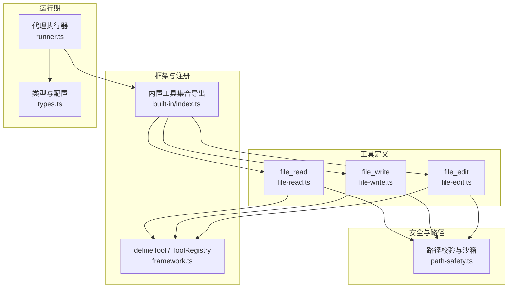
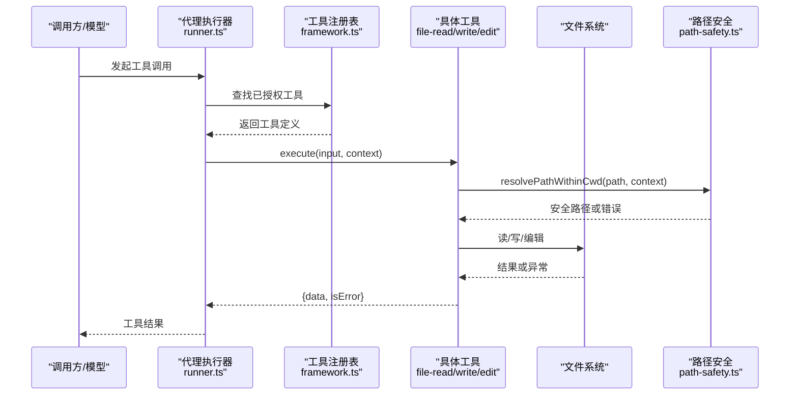
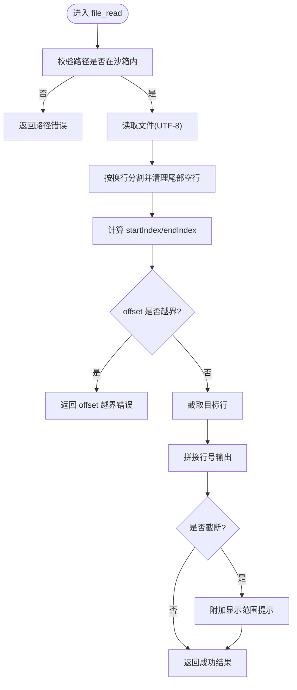
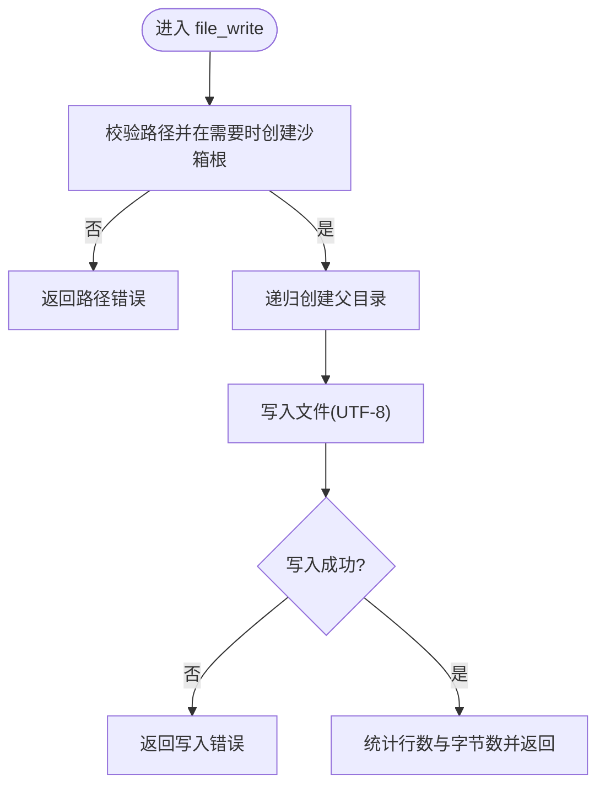
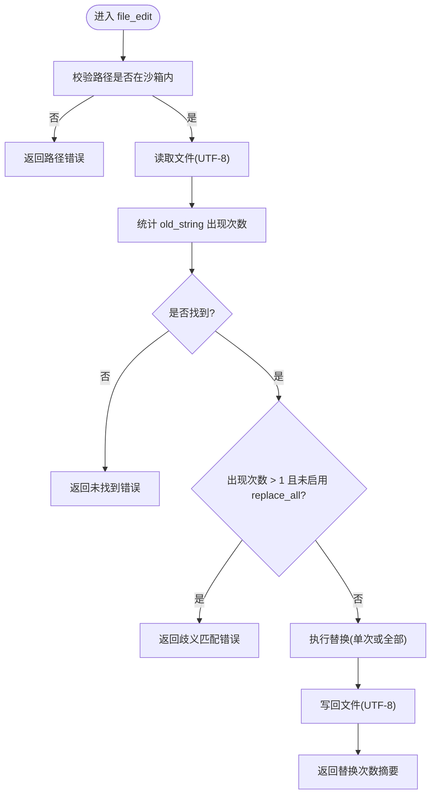
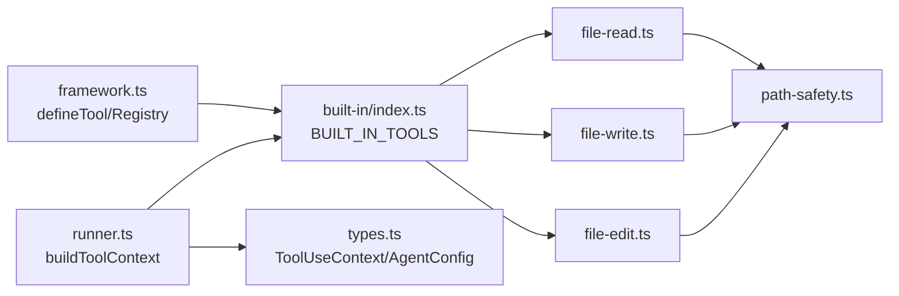

# 文件系统工具

<cite>
**本文引用的文件**
- [file-read.ts](file://packages/core/src/tool/built-in/file-read.ts)
- [file-write.ts](file://packages/core/src/tool/built-in/file-write.ts)
- [file-edit.ts](file://packages/core/src/tool/built-in/file-edit.ts)
- [path-safety.ts](file://packages/core/src/tool/built-in/path-safety.ts)
- [built-in/index.ts](file://packages/core/src/tool/built-in/index.ts)
- [framework.ts](file://packages/core/src/tool/framework.ts)
- [types.ts](file://packages/core/src/types.ts)
- [runner.ts](file://packages/core/src/agent/runner.ts)
- [built-in-tools.test.ts](file://packages/core/tests/built-in-tools.test.ts)
</cite>

## 目录
1. [简介](#简介)
2. [项目结构](#项目结构)
3. [核心组件](#核心组件)
4. [架构总览](#架构总览)
5. [详细组件分析](#详细组件分析)
6. [依赖关系分析](#依赖关系分析)
7. [性能考虑](#性能考虑)
8. [故障排查指南](#故障排查指南)
9. [结论](#结论)
10. [附录：使用示例与最佳实践](#附录使用示例与最佳实践)

## 简介
本文件面向 Open Multi-Agent 的文件系统工具集，聚焦以下内置工具：
- fileReadTool：读取文件内容，支持按行偏移与限制读取大文件。
- fileWriteTool：创建或覆盖写入文件，自动创建父目录。
- fileEditTool：对现有文件进行精确字符串替换，提供唯一性保护与批量替换选项。

文档将详细说明参数、编码、错误处理、安全沙箱、权限控制、性能优化与最佳实践，并提供基于测试用例的“代码片段路径”以便快速定位实现细节。

## 项目结构
文件系统工具位于 core 包的内置工具集中，统一通过工具框架定义并注册，运行时由代理执行器注入上下文（含工作目录、凭据等）后调用。

图表来源
- [file-read.ts:17-45](file://packages/core/src/tool/built-in/file-read.ts#L17-L45)
- [file-write.ts:18-35](file://packages/core/src/tool/built-in/file-write.ts#L18-L35)
- [file-edit.ts:18-48](file://packages/core/src/tool/built-in/file-edit.ts#L18-L48)
- [path-safety.ts:30-97](file://packages/core/src/tool/built-in/path-safety.ts#L30-L97)
- [framework.ts:71-117](file://packages/core/src/tool/framework.ts#L71-L117)
- [built-in/index.ts:37-44](file://packages/core/src/tool/built-in/index.ts#L37-L44)
- [runner.ts:1796-1810](file://packages/core/src/agent/runner.ts#L1796-L1810)
- [types.ts:531-557](file://packages/core/src/types.ts#L531-L557)

章节来源
- [built-in/index.ts:37-44](file://packages/core/src/tool/built-in/index.ts#L37-L44)
- [framework.ts:71-117](file://packages/core/src/tool/framework.ts#L71-L117)
- [runner.ts:1796-1810](file://packages/core/src/agent/runner.ts#L1796-L1810)
- [types.ts:531-557](file://packages/core/src/types.ts#L531-L557)

## 核心组件
- fileReadTool：以行为单位返回带行号的内容，支持 offset/limit 分页读取，适合大文件。
- fileWriteTool：原子式覆盖写入；不存在则创建；自动递归创建父目录；报告行数与字节数。
- fileEditTool：精确字符串替换；默认要求匹配唯一；可开启 replace_all 批量替换；失败时给出明确提示。
- 路径安全模块：强制绝对路径、解析符号链接、限制在沙箱根目录内，读写分离策略（写时才自动创建根）。

章节来源
- [file-read.ts:17-45](file://packages/core/src/tool/built-in/file-read.ts#L17-L45)
- [file-write.ts:18-35](file://packages/core/src/tool/built-in/file-write.ts#L18-L35)
- [file-edit.ts:18-48](file://packages/core/src/tool/built-in/file-edit.ts#L18-L48)
- [path-safety.ts:30-97](file://packages/core/src/tool/built-in/path-safety.ts#L30-L97)

## 架构总览
工具通过 defineTool 声明输入 Schema 与执行逻辑，注册到内置工具集合，由代理执行器在运行时根据授权与上下文（cwd、凭据等）调用。路径安全模块在所有文件工具中复用，确保操作被限制在受控工作目录内。

图表来源
- [runner.ts:1364-1410](file://packages/core/src/agent/runner.ts#L1364-L1410)
- [framework.ts:127-200](file://packages/core/src/tool/framework.ts#L127-L200)
- [file-read.ts:47-110](file://packages/core/src/tool/built-in/file-read.ts#L47-L110)
- [file-write.ts:37-87](file://packages/core/src/tool/built-in/file-write.ts#L37-L87)
- [file-edit.ts:50-118](file://packages/core/src/tool/built-in/file-edit.ts#L50-L118)
- [path-safety.ts:30-97](file://packages/core/src/tool/built-in/path-safety.ts#L30-L97)

## 详细组件分析

### fileReadTool（读取文件）
- 功能要点
  - 以行为为单位输出，每行前缀“行号\t内容”，便于定位。
  - 支持 offset（从第几行开始，1 基）与 limit（最多返回多少行），用于分块读取大文件。
  - 自动去除末尾多余空行，保证行号与文件位置一致。
  - 当未读取完整文件时，附加提示说明显示范围。
- 参数
  - path：必须为绝对路径。
  - offset：可选，非负整数，1 基行号起始。
  - limit：可选，正整数，最大返回行数。
- 编码格式
  - 内部以 UTF-8 解码读取。
- 错误处理
  - 路径不在沙箱内：返回错误信息。
  - 文件不存在或无法读取：返回包含错误消息的结果。
  - offset 超出文件末尾：返回错误并提示实际行数。
- 典型用法参考
  - 读取整文件并验证行号：[测试用例路径:93-103](file://packages/core/tests/built-in-tools.test.ts#L93-L103)
  - 使用 offset/limit 分页读取：[测试用例路径:105-118](file://packages/core/tests/built-in-tools.test.ts#L105-L118)
  - 读取不存在文件报错：[测试用例路径:120-128](file://packages/core/tests/built-in-tools.test.ts#L120-L128)
  - offset 越界报错：[测试用例路径:130-141](file://packages/core/tests/built-in-tools.test.ts#L130-L141)
  - 截断提示：[测试用例路径:143-153](file://packages/core/tests/built-in-tools.test.ts#L143-L153)

图表来源
- [file-read.ts:47-110](file://packages/core/src/tool/built-in/file-read.ts#L47-L110)
- [path-safety.ts:30-97](file://packages/core/src/tool/built-in/path-safety.ts#L30-L97)

章节来源
- [file-read.ts:17-110](file://packages/core/src/tool/built-in/file-read.ts#L17-L110)
- [built-in-tools.test.ts:93-153](file://packages/core/tests/built-in-tools.test.ts#L93-L153)

### fileWriteTool（写入文件）
- 功能要点
  - 若文件不存在则创建；存在则覆盖。
  - 自动递归创建父目录（等效 mkdir -p）。
  - 返回写入摘要：新建/更新、行数、字节数。
- 参数
  - path：必须为绝对路径。
  - content：要写入的完整内容。
- 编码格式
  - 以 UTF-8 写入。
- 错误处理
  - 路径不在沙箱内：返回错误。
  - 创建父目录失败：返回错误。
  - 写入失败：返回错误。
- 典型用法参考
  - 创建新文件：[测试用例路径:161-173](file://packages/core/tests/built-in-tools.test.ts#L161-L173)
  - 覆盖已有文件：[测试用例路径:175-188](file://packages/core/tests/built-in-tools.test.ts#L175-L188)
  - 自动创建深层目录：[测试用例路径:190-201](file://packages/core/tests/built-in-tools.test.ts#L190-L201)
  - 报告行数与字节数：[测试用例路径:203-212](file://packages/core/tests/built-in-tools.test.ts#L203-L212)

图表来源
- [file-write.ts:37-87](file://packages/core/src/tool/built-in/file-write.ts#L37-L87)
- [path-safety.ts:30-97](file://packages/core/src/tool/built-in/path-safety.ts#L30-L97)

章节来源
- [file-write.ts:18-87](file://packages/core/src/tool/built-in/file-write.ts#L18-L87)
- [built-in-tools.test.ts:161-212](file://packages/core/tests/built-in-tools.test.ts#L161-L212)

### fileEditTool（编辑文件）
- 功能要点
  - 精确字符串替换：old_string 必须与文件内容完全一致（包括空白与换行）。
  - 唯一性保护：默认 old_string 只能出现一次，否则报错以避免误替换。
  - 批量替换：设置 replace_all 为 true 可替换所有匹配项。
  - 不改变文件其他部分，仅替换指定片段。
- 参数
  - path：必须为绝对路径。
  - old_string：要查找的原始字符串。
  - new_string：替换后的新字符串。
  - replace_all：可选布尔值，是否替换全部匹配。
- 编码格式
  - 以 UTF-8 读取与写入。
- 错误处理
  - 路径不在沙箱内：返回错误。
  - 文件不存在或无法读取：返回错误。
  - 未找到 old_string：返回错误并提示需完全匹配。
  - 多次匹配且未启用 replace_all：返回错误并建议更精确的 old_string 或启用批量替换。
- 典型用法参考
  - 替换唯一字符串：[测试用例路径:220-234](file://packages/core/tests/built-in-tools.test.ts#L220-L234)
  - 未找到旧字符串报错：[测试用例路径:236-247](file://packages/core/tests/built-in-tools.test.ts#L236-L247)
  - 重复匹配报错：[测试用例路径:249-260](file://packages/core/tests/built-in-tools.test.ts#L249-L260)
  - 启用 replace_all 批量替换：[测试用例路径:262-275](file://packages/core/tests/built-in-tools.test.ts#L262-L275)
  - 编辑不存在文件报错：[测试用例路径:277-285](file://packages/core/tests/built-in-tools.test.ts#L277-L285)

图表来源
- [file-edit.ts:50-118](file://packages/core/src/tool/built-in/file-edit.ts#L50-L118)
- [path-safety.ts:30-97](file://packages/core/src/tool/built-in/path-safety.ts#L30-L97)

章节来源
- [file-edit.ts:18-162](file://packages/core/src/tool/built-in/file-edit.ts#L18-L162)
- [built-in-tools.test.ts:220-285](file://packages/core/tests/built-in-tools.test.ts#L220-L285)

### 路径安全与沙箱
- 强制绝对路径：所有内置文件工具均要求绝对路径。
- 沙箱根目录：
  - 默认工作目录为进程当前目录下的 .agent-workspace。
  - 可通过 AgentConfig.cwd 或 OrchestratorConfig.defaultCwd 调整。
  - 设置为 null 可禁用沙箱（接受任意路径）。
- 符号链接处理：解析真实路径后再判断是否在沙箱内，防止 TOCTOU 漏洞。
- 读写分离：
  - 读/搜索类工具（file_read、file_edit、grep、glob）遇到缺失的沙箱根会直接报错。
  - 写类工具（file_write）首次写入时会自动创建沙箱根目录。

章节来源
- [path-safety.ts:15-24](file://packages/core/src/tool/built-in/path-safety.ts#L15-L24)
- [path-safety.ts:30-97](file://packages/core/src/tool/built-in/path-safety.ts#L30-L97)
- [types.ts:548-557](file://packages/core/src/types.ts#L548-L557)
- [types.ts:1001-1009](file://packages/core/src/types.ts#L1001-L1009)
- [types.ts:2245-2252](file://packages/core/src/types.ts#L2245-L2252)

## 依赖关系分析
- 工具定义层：通过 defineTool 声明 name、description、inputSchema、execute 等元数据与实现。
- 工具注册层：内置工具集合统一导出，供代理执行器加载。
- 运行期层：代理执行器构建 ToolUseContext（含 cwd、凭据等），调用已授权工具。
- 安全层：路径安全模块被所有文件工具复用，确保操作在受控目录内进行。

图表来源
- [framework.ts:71-117](file://packages/core/src/tool/framework.ts#L71-L117)
- [built-in/index.ts:37-44](file://packages/core/src/tool/built-in/index.ts#L37-L44)
- [file-read.ts:17-45](file://packages/core/src/tool/built-in/file-read.ts#L17-L45)
- [file-write.ts:18-35](file://packages/core/src/tool/built-in/file-write.ts#L18-L35)
- [file-edit.ts:18-48](file://packages/core/src/tool/built-in/file-edit.ts#L18-L48)
- [path-safety.ts:30-97](file://packages/core/src/tool/built-in/path-safety.ts#L30-L97)
- [runner.ts:1796-1810](file://packages/core/src/agent/runner.ts#L1796-L1810)
- [types.ts:531-557](file://packages/core/src/types.ts#L531-L557)

章节来源
- [framework.ts:127-200](file://packages/core/src/tool/framework.ts#L127-L200)
- [built-in/index.ts:37-44](file://packages/core/src/tool/built-in/index.ts#L37-L44)
- [runner.ts:1796-1810](file://packages/core/src/agent/runner.ts#L1796-L1810)
- [types.ts:531-557](file://packages/core/src/types.ts#L531-L557)

## 性能考虑
- 大文件读取：使用 fileReadTool 的 offset/limit 分页读取，避免一次性加载整个文件到上下文窗口。
- 写入效率：fileWriteTool 自动创建父目录，减少额外调用；写入采用 UTF-8，避免编码转换开销。
- 编辑精度：fileEditTool 使用纯字符串匹配与替换，避免正则带来的性能与转义问题；仅在必要时启用 replace_all。
- 沙箱路径解析：路径安全模块在必要时解析符号链接并缓存根目录，减少重复开销。
- 结果压缩：执行器会对过长的工具输出进行压缩，降低上下文占用（与工具无关，但影响整体吞吐）。

[本节为通用性能建议，无需特定文件引用]

## 故障排查指南
- 路径不在沙箱内
  - 现象：工具返回错误，提示路径在工作目录之外。
  - 解决：检查 AgentConfig.cwd 或 OrchestratorConfig.defaultCwd；如需访问外部路径，可显式放宽或禁用沙箱（谨慎）。
  - 参考：[路径安全错误处理:115-124](file://packages/core/src/tool/built-in/path-safety.ts#L115-L124)
- 文件不存在或无法读取
  - 现象：fileReadTool/fileEditTool 返回“无法读取”错误。
  - 解决：确认文件是否存在、路径是否正确、权限是否足够。
  - 参考：[fileReadTool 错误分支:54-64](file://packages/core/src/tool/built-in/file-read.ts#L54-L64)、[fileEditTool 错误分支:57-68](file://packages/core/src/tool/built-in/file-edit.ts#L57-L68)
- offset 越界
  - 现象：fileReadTool 返回“offset 超出文件末尾”。
  - 解决：调整 offset 或使用 limit 限制读取范围。
  - 参考：[fileReadTool 越界处理:76-87](file://packages/core/src/tool/built-in/file-read.ts#L76-L87)
- 替换目标未找到或重复匹配
  - 现象：fileEditTool 返回“未找到”或“多次匹配”错误。
  - 解决：确保 old_string 完全匹配；如确需批量替换，设置 replace_all 为 true。
  - 参考：[fileEditTool 匹配与替换逻辑:70-98](file://packages/core/src/tool/built-in/file-edit.ts#L70-L98)
- 写入失败或目录创建失败
  - 现象：fileWriteTool 返回“写入失败”或“创建目录失败”。
  - 解决：检查磁盘空间、权限、父目录是否存在及可写。
  - 参考：[fileWriteTool 目录创建与写入:52-75](file://packages/core/src/tool/built-in/file-write.ts#L52-L75)

章节来源
- [path-safety.ts:115-124](file://packages/core/src/tool/built-in/path-safety.ts#L115-L124)
- [file-read.ts:54-87](file://packages/core/src/tool/built-in/file-read.ts#L54-L87)
- [file-edit.ts:57-98](file://packages/core/src/tool/built-in/file-edit.ts#L57-L98)
- [file-write.ts:52-75](file://packages/core/src/tool/built-in/file-write.ts#L52-L75)

## 结论
Open Multi-Agent 的文件系统工具集提供了安全、易用且高性能的文件操作能力：
- 安全性：强制绝对路径、符号链接解析、沙箱根限制，有效防止越权访问。
- 易用性：统一的输入 Schema、清晰的错误信息、丰富的提示信息（行号、范围、计数）。
- 性能：支持大文件分页读取、避免不必要的正则、自动目录创建与 UTF-8 编码。
- 扩展性：基于 defineTool 的工具框架便于扩展自定义工具，并通过注册表统一管理。

[本节为总结性内容，无需特定文件引用]

## 附录：使用示例与最佳实践

### 使用示例（以“代码片段路径”形式）
- 读取文件并验证行号
  - [测试用例路径:93-103](file://packages/core/tests/built-in-tools.test.ts#L93-L103)
- 使用 offset/limit 分页读取大文件
  - [测试用例路径:105-118](file://packages/core/tests/built-in-tools.test.ts#L105-L118)
- 创建新文件并自动创建深层目录
  - [测试用例路径:190-201](file://packages/core/tests/built-in-tools.test.ts#L190-L201)
- 覆盖已有文件并获取写入摘要
  - [测试用例路径:175-188](file://packages/core/tests/built-in-tools.test.ts#L175-L188)
- 精确替换唯一字符串
  - [测试用例路径:220-234](file://packages/core/tests/built-in-tools.test.ts#L220-L234)
- 批量替换多个匹配项
  - [测试用例路径:262-275](file://packages/core/tests/built-in-tools.test.ts#L262-L275)

### 最佳实践
- 始终使用绝对路径，并确保路径在沙箱根目录下。
- 对大文件优先使用 fileReadTool 的 offset/limit 分页读取，避免上下文溢出。
- 编辑文件时使用尽可能具体的 old_string，避免意外替换；必要时再启用 replace_all。
- 写入文件前确认父目录可写；利用 fileWriteTool 的自动目录创建简化流程。
- 合理配置 AgentConfig.cwd 或 OrchestratorConfig.defaultCwd，最小化暴露面；生产环境不建议禁用沙箱。
- 关注工具输出的长度限制与执行器的压缩策略，避免过长响应影响性能。

[本节为通用指导，无需特定文件引用]