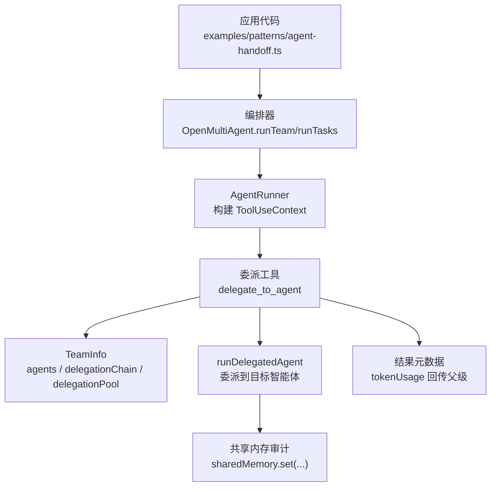
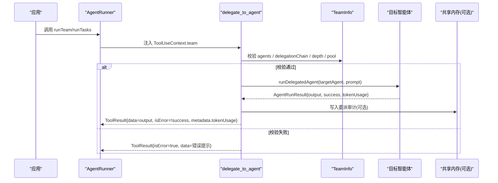
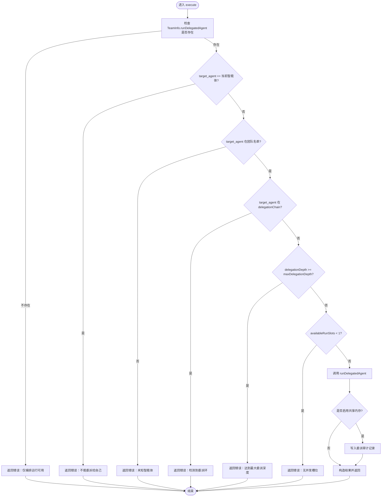
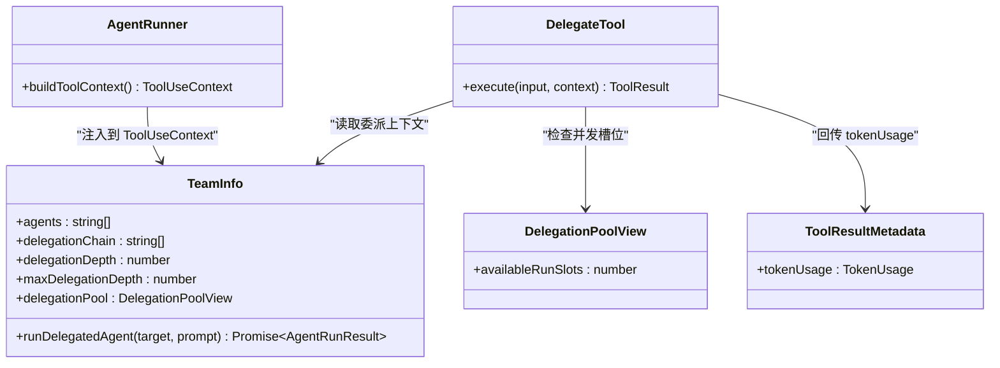

# 智能体委派工具

<cite>
**本文引用的文件**
- [delegate.ts](file://packages/core/src/tool/built-in/delegate.ts)
- [types.ts](file://packages/core/src/types.ts)
- [runner.ts](file://packages/core/src/agent/runner.ts)
- [agent-handoff.ts](file://packages/core/examples/patterns/agent-handoff.ts)
</cite>

## 目录
1. [简介](#简介)
2. [项目结构](#项目结构)
3. [核心组件](#核心组件)
4. [架构总览](#架构总览)
5. [详细组件分析](#详细组件分析)
6. [依赖关系分析](#依赖关系分析)
7. [性能考量](#性能考量)
8. [故障排除指南](#故障排除指南)
9. [结论](#结论)
10. [附录](#附录)

## 简介
本文件聚焦 Open Multi-Agent 的内置委派工具 delegateToAgentTool（注册名为 delegate_to_agent），系统说明在多智能体协作中如何进行任务委派与上下文传递，包括目标智能体选择、任务描述、优先级与深度控制、委派状态跟踪与结果回传机制，以及与编排系统的集成方式和性能优化策略。文档同时提供基于仓库示例的使用方式与最佳实践建议，帮助团队在复杂协作场景中安全、可控地使用委派能力。

## 项目结构
- 委派工具实现位于 packages/core/src/tool/built-in/delegate.ts，定义输入校验、执行流程与安全边界检查。
- 类型与编排配置集中在 packages/core/src/types.ts，包含 TeamInfo、DelegationPoolView、OrchestratorConfig.maxDelegationDepth、ToolResultMetadata.tokenUsage 等关键类型。
- 运行期上下文构建在 packages/core/src/agent/runner.ts，负责将 team 信息注入 ToolUseContext，使委派工具可在编排运行时访问。
- 使用示例位于 packages/core/examples/patterns/agent-handoff.ts，演示如何在 runTeam/runTasks 中启用并调用 delegate_to_agent。

图表来源
- [agent-handoff.ts:1-65](file://packages/core/examples/patterns/agent-handoff.ts#L1-L65)
- [runner.ts:1795-1811](file://packages/core/src/agent/runner.ts#L1795-L1811)
- [delegate.ts:1-110](file://packages/core/src/tool/built-in/delegate.ts#L1-L110)
- [types.ts:620-674](file://packages/core/src/types.ts#L620-L674)

章节来源
- [agent-handoff.ts:1-65](file://packages/core/examples/patterns/agent-handoff.ts#L1-L65)
- [runner.ts:1795-1811](file://packages/core/src/agent/runner.ts#L1795-L1811)
- [delegate.ts:1-110](file://packages/core/src/tool/built-in/delegate.ts#L1-L110)
- [types.ts:620-674](file://packages/core/src/types.ts#L620-L674)

## 核心组件
- 委派工具 delegate_to_agent：在编排运行的上下文中，允许当前智能体将子任务委派给同队其他智能体，并在同一对话轮次内读取其最终文本输出。
- TeamInfo：编排器注入的工具上下文，提供可用智能体名单、委派链、最大委派深度、并发池视图以及委派执行函数。
- OrchestratorConfig.maxDelegationDepth：限制委派链的最大嵌套深度，防止无限递归。
- DelegationPoolView.availableRunSlots：用于检测是否还有空闲并发槽位，避免嵌套委派导致阻塞。
- ToolResultMetadata.tokenUsage：委派执行的 token 用量通过此字段回传给父级 runner，保证预算与成本统计准确。

章节来源
- [delegate.ts:1-110](file://packages/core/src/tool/built-in/delegate.ts#L1-L110)
- [types.ts:620-674](file://packages/core/src/types.ts#L620-L674)
- [types.ts:2180-2191](file://packages/core/src/types.ts#L2180-L2191)

## 架构总览
委派工具在编排运行时由 AgentRunner 注入 TeamInfo，工具执行时进行参数校验、循环与深度检查、并发容量检查，然后调用 runDelegatedAgent 完成委派，并将结果与 tokenUsage 回传至父级 runner。若启用共享内存，还会写入审计记录。

图表来源
- [delegate.ts:31-107](file://packages/core/src/tool/built-in/delegate.ts#L31-L107)
- [types.ts:620-674](file://packages/core/src/types.ts#L620-L674)
- [runner.ts:1795-1811](file://packages/core/src/agent/runner.ts#L1795-L1811)

## 详细组件分析

### 委派工具 delegate_to_agent
- 作用：在当前智能体的对话轮次中，同步委派子任务给同队另一个智能体，并返回其最终文本输出。
- 可用性：仅在编排器注入 TeamInfo.runDelegatedAgent 的 runTeam/runTasks 环境中可用；独立 runAgent 默认不注册该工具。
- 输入参数：
  - target_agent：目标智能体名称（必须存在于团队名单）。
  - prompt：目标智能体的指令或问题（最小长度约束）。
- 执行流程要点：
  - 环境检查：缺少 runDelegatedAgent 则返回错误提示。
  - 自委派保护：禁止委派给自己。
  - 白名单校验：目标智能体必须在团队名单中。
  - 环路保护：检查 delegationChain，阻止 A→B→A 等循环。
  - 深度保护：检查 delegationDepth 与 maxDelegationDepth。
  - 并发保护：检查 delegationPool.availableRunSlots，避免无槽位导致的死锁。
  - 委派执行：调用 runDelegatedAgent 获取结果。
  - 审计写入：若启用 sharedMemory，写入委派审计记录（包含目标、成功与否等）。
  - 结果回传：返回 output，标记 isError 与 tokenUsage。

图表来源
- [delegate.ts:31-107](file://packages/core/src/tool/built-in/delegate.ts#L31-L107)

章节来源
- [delegate.ts:1-110](file://packages/core/src/tool/built-in/delegate.ts#L1-L110)

### 委派参数与配置
- 目标智能体选择：通过 target_agent 指定，需在团队名单中；可通过团队角色与能力声明辅助选择（见 Task.role / priority 与调度策略）。
- 任务描述：通过 prompt 传入，作为目标智能体的完整指令。
- 优先级设置：委派本身不直接携带优先级；可通过上层任务定义 Task.priority 与 OrchestratorConfig.schedulingStrategy 影响整体调度。
- 委派深度：OrchestratorConfig.maxDelegationDepth 控制最大嵌套深度（默认值由框架设定）；工具内部以 delegationDepth 计数。
- 并发控制：DelegationPoolView.availableRunSlots 用于避免嵌套委派在无槽位时阻塞；必要时调整 orchestrator.maxConcurrency。
- 上下文传递：TeamInfo.delegationChain 维护从根任务到当前智能体的委派路径，用于环路检测；sharedMemory 可用于跨智能体共享上下文与审计。

章节来源
- [types.ts:620-674](file://packages/core/src/types.ts#L620-L674)
- [types.ts:2180-2191](file://packages/core/src/types.ts#L2180-L2191)
- [types.ts:2131-2152](file://packages/core/src/types.ts#L2131-L2152)
- [types.ts:2052-2080](file://packages/core/src/types.ts#L2052-L2080)

### 委派状态跟踪与结果回传
- 状态跟踪：
  - delegationChain：记录委派路径，防止环路。
  - delegationDepth：记录当前嵌套层级，受 maxDelegationDepth 限制。
  - sharedMemory：可选地写入委派审计记录，便于事后追踪。
- 结果回传：
  - 委派结果以 ToolResult.data 形式返回给调用方智能体。
  - TokenUsage 通过 ToolResult.metadata.tokenUsage 回传，父级 runner 会累计到总用量，确保预算与成本统计准确。
  - 若委派失败，ToolResult.isError 为 true，并附带错误原因。

章节来源
- [delegate.ts:87-107](file://packages/core/src/tool/built-in/delegate.ts#L87-L107)
- [types.ts:655-674](file://packages/core/src/types.ts#L655-L674)

### 与编排系统的集成
- 上下文注入：AgentRunner 在构建 ToolUseContext 时将 TeamInfo 注入，使委派工具可访问团队信息与委派执行函数。
- 运行模式：仅在 runTeam/runTasks 的池化执行中注册委派工具；独立 runAgent 默认不注册。
- 审批与路由：委派行为受全局 onToolCall、onPlanReady、onTaskDispatch 等网关控制；模型路由与执行路由不影响委派工具本身的可用性，但会影响整体编排决策。

章节来源
- [runner.ts:1795-1811](file://packages/core/src/agent/runner.ts#L1795-L1811)
- [types.ts:2259-2343](file://packages/core/src/types.ts#L2259-L2343)

### 使用示例与团队协作
- 示例展示了如何创建团队、启用共享内存，并在 researcher 智能体的系统提示中指示其使用 delegate_to_agent 向 analyst 发起二次意见请求，最终合并回答。
- 关键点：
  - 在 tools 中显式启用 delegate_to_agent。
  - 通过 runTeam 启动编排运行，使委派工具可用。
  - 利用 sharedMemory 进行跨智能体上下文共享与审计。

章节来源
- [agent-handoff.ts:1-65](file://packages/core/examples/patterns/agent-handoff.ts#L1-L65)

## 依赖关系分析
- 委派工具依赖 TeamInfo 提供的 agents、delegationChain、delegationDepth、maxDelegationDepth、delegationPool 与 runDelegatedAgent。
- 结果元数据依赖 ToolResultMetadata.tokenUsage 以便父级 runner 聚合用量。
- 运行期上下文由 AgentRunner 注入，确保委派工具在编排环境中具备必要能力。

图表来源
- [delegate.ts:31-107](file://packages/core/src/tool/built-in/delegate.ts#L31-L107)
- [types.ts:620-674](file://packages/core/src/types.ts#L620-L674)
- [runner.ts:1795-1811](file://packages/core/src/agent/runner.ts#L1795-L1811)

章节来源
- [delegate.ts:1-110](file://packages/core/src/tool/built-in/delegate.ts#L1-L110)
- [types.ts:620-674](file://packages/core/src/types.ts#L620-L674)
- [runner.ts:1795-1811](file://packages/core/src/agent/runner.ts#L1795-L1811)

## 性能考量
- 委派深度限制：通过 maxDelegationDepth 控制嵌套深度，避免过深链路导致延迟与预算超支。
- 并发容量管理：通过 DelegationPoolView.availableRunSlots 检测槽位，避免嵌套委派在无槽位时阻塞；必要时提高 orchestrator.maxConcurrency。
- Token 预算与成本：委派产生的 tokenUsage 通过 ToolResultMetadata 回传，父级 runner 累计统计，结合 maxTokenBudget/maxCostBudget 保障总体预算。
- 共享内存审计：在启用 sharedMemory 时写入委派审计记录，有助于定位瓶颈与异常。

[本节为通用性能指导，不直接分析具体文件]

## 故障排除指南
- 错误：委派工具不可用
  - 现象：提示仅在编排运行中可用。
  - 处理：确保在 runTeam/runTasks 中启用委派工具；独立 runAgent 默认不注册。
- 错误：自委派
  - 现象：提示不能委派给自己。
  - 处理：选择其他团队成员作为目标。
- 错误：未知智能体
  - 现象：目标不在团队名单。
  - 处理：检查团队 roster，修正 target_agent。
- 错误：委派环
  - 现象：检测到 A→B→A 等循环。
  - 处理：重构计划，避免循环委派；必要时调整分工。
- 错误：达到最大委派深度
  - 现象：超过 maxDelegationDepth。
  - 处理：降低嵌套层级或提高 maxDelegationDepth（谨慎使用）。
- 错误：无并发槽位
  - 现象：availableRunSlots 不足。
  - 处理：提高 orchestrator.maxConcurrency，等待并行工作完成，或避免在高负载时委派。
- 审计写入失败
  - 现象：共享内存写入异常。
  - 处理：审计为尽力而为，不影响主流程；检查存储后端与权限。

章节来源
- [delegate.ts:31-107](file://packages/core/src/tool/built-in/delegate.ts#L31-L107)

## 结论
delegate_to_agent 提供了在多智能体协作中进行任务委派与上下文传递的关键能力。通过严格的参数校验、环路检测、深度限制与并发保护，配合 tokenUsage 回传与共享内存审计，能够在复杂协作场景中保持安全、可控与可观测。结合编排器的调度策略、预算控制与审批网关，可实现高效且稳健的智能体团队协作。

[本节为总结性内容，不直接分析具体文件]

## 附录
- 最佳实践
  - 明确团队分工与角色，合理设置 Task.role 与 priority，提升调度匹配度。
  - 控制委派深度，避免过深链路；优先使用扁平化协作。
  - 在高并发场景下，评估 availableRunSlots 并调整 maxConcurrency。
  - 启用 sharedMemory 进行审计与上下文共享，便于排障与复盘。
  - 结合 onToolCall/onPlanReady/onTaskDispatch 进行合规审批与风险控制。
- 参考示例
  - 参见 agent-handoff.ts，了解如何在 runTeam 中启用并使用 delegate_to_agent。

[本节为补充说明，不直接分析具体文件]