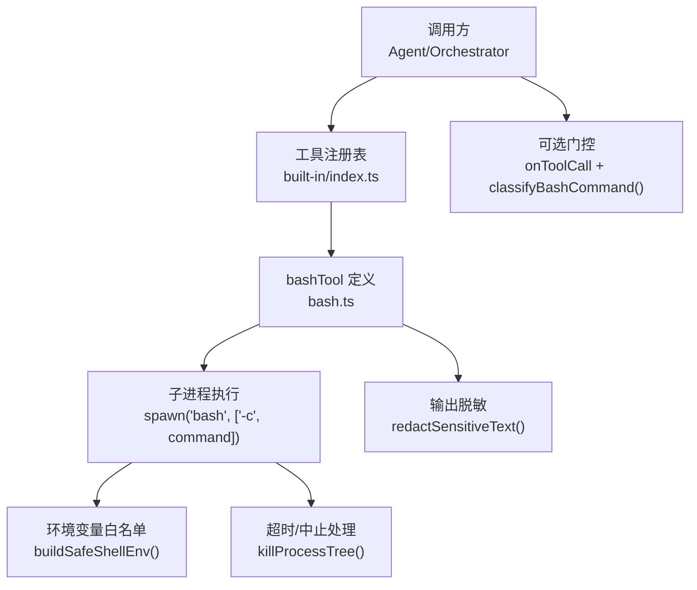
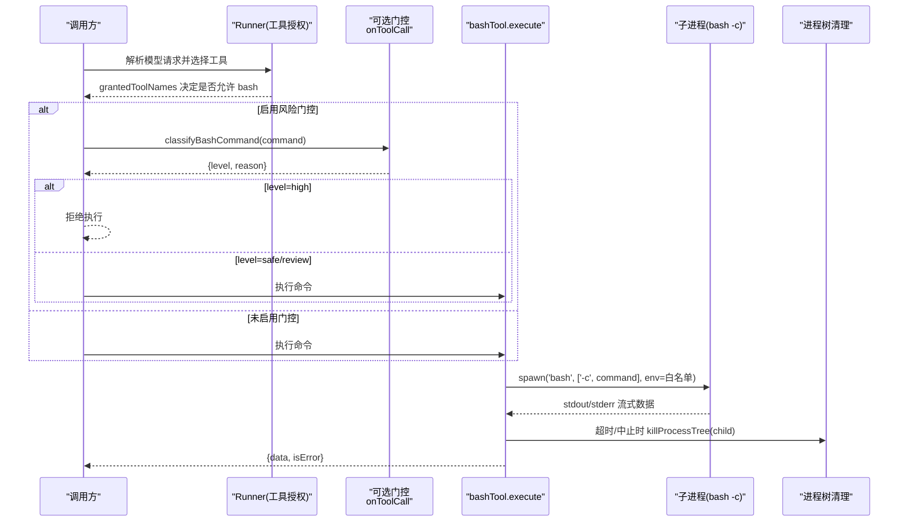
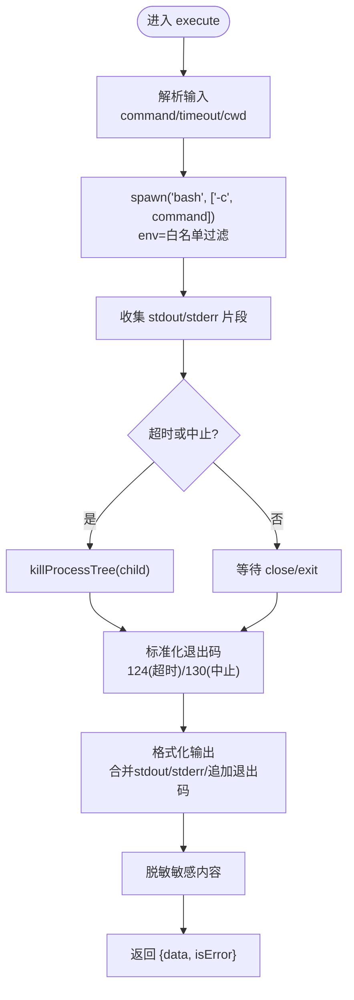
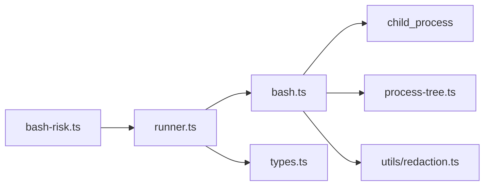

# 进程执行工具

<cite>
**本文引用的文件**
- [bash.ts](file://packages/core/src/tool/built-in/bash.ts)
- [bash-risk.ts](file://packages/core/src/tool/classifiers/bash-risk.ts)
- [process-tree.ts](file://packages/core/src/utils/process-tree.ts)
- [types.ts](file://packages/core/src/types.ts)
- [runner.ts](file://packages/core/src/agent/runner.ts)
- [built-in/index.ts](file://packages/core/src/tool/built-in/index.ts)
- [built-in-tools.test.ts](file://packages/core/tests/built-in-tools.test.ts)
</cite>

## 目录
1. [简介](#简介)
2. [项目结构](#项目结构)
3. [核心组件](#核心组件)
4. [架构总览](#架构总览)
5. [详细组件分析](#详细组件分析)
6. [依赖关系分析](#依赖关系分析)
7. [性能与资源管理](#性能与资源管理)
8. [故障排查指南](#故障排查指南)
9. [结论](#结论)
10. [附录：配置与集成清单](#附录：配置与集成清单)

## 简介
本文件聚焦 Open Multi-Agent 的内置进程执行工具 bashTool，系统性说明其命令执行能力、安全限制与沙箱机制、错误处理与异常恢复、性能监控与资源管理最佳实践，以及与框架其他组件的协作方式。文档面向不同技术背景的读者，提供从高层概览到代码级细节的分层说明，并辅以图示帮助理解数据流与控制流。

## 项目结构
bashTool 位于内置工具集合中，由工具注册表统一暴露；其执行过程涉及子进程创建、环境变量白名单过滤、超时与中止信号处理、输出脱敏与安全分类器（可选）等。关键文件如下：
- 工具实现：packages/core/src/tool/built-in/bash.ts
- 风险分类器（可选门控）：packages/core/src/tool/classifiers/bash-risk.ts
- 进程树清理：packages/core/src/utils/process-tree.ts
- 类型与上下文：packages/core/src/types.ts
- 运行器与工具授权：packages/core/src/agent/runner.ts
- 内置工具注册与导出：packages/core/src/tool/built-in/index.ts
- 行为验证测试：packages/core/tests/built-in-tools.test.ts

图表来源
- [built-in/index.ts:37-44](file://packages/core/src/tool/built-in/index.ts#L37-L44)
- [bash.ts:37-79](file://packages/core/src/tool/built-in/bash.ts#L37-L79)
- [bash.ts:96-196](file://packages/core/src/tool/built-in/bash.ts#L96-L196)
- [bash-risk.ts:162-190](file://packages/core/src/tool/classifiers/bash-risk.ts#L162-L190)

章节来源
- [built-in/index.ts:1-75](file://packages/core/src/tool/built-in/index.ts#L1-L75)
- [bash.ts:1-241](file://packages/core/src/tool/built-in/bash.ts#L1-L241)

## 核心组件
- bashTool：定义工具名称、描述、输入模式（command、timeout、cwd），并在 execute 中启动子进程、收集输出、返回结构化结果。
- 环境隔离：通过白名单传递环境变量，避免敏感键泄露至 shell。
- 超时与中止：支持毫秒级超时与 AbortSignal 中止，均会终止整个进程树。
- 输出处理：合并 stdout/stderr，附加退出码信息，并对疑似敏感信息进行脱敏。
- 风险分类器（可选）：classifyBashCommand 对命令进行 safe/review/high 分级，配合 onToolCall 门控策略。

章节来源
- [bash.ts:37-79](file://packages/core/src/tool/built-in/bash.ts#L37-L79)
- [bash.ts:96-196](file://packages/core/src/tool/built-in/bash.ts#L96-L196)
- [bash.ts:198-241](file://packages/core/src/tool/built-in/bash.ts#L198-L241)
- [bash-risk.ts:1-191](file://packages/core/src/tool/classifiers/bash-risk.ts#L1-L191)

## 架构总览
下图展示一次 bash 命令执行的端到端流程，包括工具授权、可选风险门控、子进程生命周期管理与结果回传。

图表来源
- [runner.ts:1391-1398](file://packages/core/src/agent/runner.ts#L1391-L1398)
- [bash.ts:62-79](file://packages/core/src/tool/built-in/bash.ts#L62-L79)
- [bash.ts:100-196](file://packages/core/src/tool/built-in/bash.ts#L100-L196)
- [process-tree.ts:13-33](file://packages/core/src/utils/process-tree.ts#L13-L33)
- [bash-risk.ts:162-190](file://packages/core/src/tool/classifiers/bash-risk.ts#L162-L190)

## 详细组件分析

### bashTool 实现与执行语义
- 输入参数
  - command：要执行的 bash 命令字符串。
  - timeout：可选超时毫秒数，默认值在实现中定义。
  - cwd：可选工作目录；若未设置则使用父级上下文提供的 cwd。
- 执行流程
  - 使用 child_process.spawn 以非交互模式执行 bash -c。
  - 仅传递环境变量白名单中的键，避免敏感信息泄露。
  - 监听 stdout/stderr 并累积为字符串。
  - 支持超时与 AbortSignal 中止，两者都会触发进程树清理。
  - 格式化输出：当仅有 stdout 时直接返回；同时存在 stderr 时分段标注；无输出时根据退出码给出提示文本；失败时附带退出码。
  - 输出经脱敏后再返回给调用方。
- 返回值
  - data：格式化后的输出文本。
  - isError：基于 exitCode 是否为 0 判断。

图表来源
- [bash.ts:62-79](file://packages/core/src/tool/built-in/bash.ts#L62-L79)
- [bash.ts:100-196](file://packages/core/src/tool/built-in/bash.ts#L100-L196)
- [bash.ts:198-241](file://packages/core/src/tool/built-in/bash.ts#L198-L241)

章节来源
- [bash.ts:37-79](file://packages/core/src/tool/built-in/bash.ts#L37-L79)
- [bash.ts:96-196](file://packages/core/src/tool/built-in/bash.ts#L96-L196)
- [bash.ts:198-241](file://packages/core/src/tool/built-in/bash.ts#L198-L241)

### 安全限制与沙箱机制
- 环境变量白名单
  - 仅允许有限的安全键（如 PATH、HOME、LANG、TERM、TMP*、USER 等）透传到子进程，其余键被丢弃。
  - 结合敏感键名检测，进一步降低密钥泄露风险。
- 工作目录与文件系统沙箱
  - 文件系统类工具受 ToolUseContext.cwd 约束，要求绝对路径且不能逃逸到沙箱根之外。
  - 可通过 AgentConfig.defaultCwd 或 AgentConfig.cwd 控制沙箱根；设置为 null 可全局禁用沙箱（不推荐）。
- 命令白名单/黑名单与默认拒绝
  - 通过 toolPreset、allowedTools、disallowedTools 组合控制可用工具集；未显式授予的工具将被拒绝执行。
  - 内置工具（含 bash）默认处于“需授权”状态，需在代理或编排器层面明确授予。
- 风险分类器（可选门控）
  - classifyBashCommand 将命令划分为 safe/review/high，用于在 onToolCall 中做细粒度放行/拒绝/人工确认。
  - 该分类器为启发式规则，并非安全边界；高安全场景应结合容器/VM/seccomp 等隔离手段。

章节来源
- [bash.ts:18-31](file://packages/core/src/tool/built-in/bash.ts#L18-L31)
- [bash.ts:198-207](file://packages/core/src/tool/built-in/bash.ts#L198-L207)
- [types.ts:547-557](file://packages/core/src/types.ts#L547-L557)
- [types.ts:1001-1009](file://packages/core/src/types.ts#L1001-L1009)
- [types.ts:2236-2252](file://packages/core/src/types.ts#L2236-L2252)
- [runner.ts:1391-1398](file://packages/core/src/agent/runner.ts#L1391-L1398)
- [bash-risk.ts:1-191](file://packages/core/src/tool/classifiers/bash-risk.ts#L1-L191)

### 错误处理与异常恢复
- 超时与中止
  - 超时：到达 timeoutMs 后强制终止进程树，标准化退出码为 124。
  - 中止：收到 AbortSignal 后终止进程树，标准化退出码为 130。
- 进程错误
  - 子进程 error 事件会立即结算 Promise，stderr 携带错误消息，退出码设为 127。
- 输出与状态
  - 无论成功与否，均返回 data 与 isError；失败时包含退出码信息以便上层诊断。
- 恢复与幂等
  - 对于需要幂等的“后果性”工具，可使用 toolCallId 作为外部幂等键（由框架注入）。
  - 检查点持久化确保中断后可恢复，避免重复副作用。

章节来源
- [bash.ts:119-196](file://packages/core/src/tool/built-in/bash.ts#L119-L196)
- [bash.ts:214-241](file://packages/core/src/tool/built-in/bash.ts#L214-L241)
- [types.ts:564-569](file://packages/core/src/types.ts#L564-L569)
- [runner.ts:1046-1058](file://packages/core/src/agent/runner.ts#L1046-L1058)

### 与其他工具的集成与协作
- 工具注册与授权
  - bashTool 通过 built-in/index.ts 注册到工具注册表；Agent/Orchestrator 通过 toolPreset/tools/disallowedTools 控制可见性与可用性。
- 运行期上下文
  - Runner 构建 ToolUseContext，注入 agent 信息、abortSignal、cwd、credentials 等，供工具消费。
- 风险门控
  - 可在 onToolCall 中接入 classifyBashCommand，对 bash 命令进行前置风险评估，再决定是否放行。

章节来源
- [built-in/index.ts:37-44](file://packages/core/src/tool/built-in/index.ts#L37-L44)
- [runner.ts:1795-1811](file://packages/core/src/agent/runner.ts#L1795-L1811)
- [runner.ts:1391-1398](file://packages/core/src/agent/runner.ts#L1391-L1398)
- [bash-risk.ts:1-191](file://packages/core/src/tool/classifiers/bash-risk.ts#L1-L191)

## 依赖关系分析
- bashTool 依赖 Node.js child_process 进行子进程管理，依赖 process-tree 工具完成跨平台进程树清理。
- 环境变量过滤依赖敏感键名检测工具。
- 运行时由 Runner 负责工具授权与上下文注入；可选风险分类器独立于执行路径，仅在门控阶段使用。

图表来源
- [bash.ts:8-12](file://packages/core/src/tool/built-in/bash.ts#L8-L12)
- [process-tree.ts:1-47](file://packages/core/src/utils/process-tree.ts#L1-L47)
- [runner.ts:1391-1398](file://packages/core/src/agent/runner.ts#L1391-L1398)
- [bash-risk.ts:162-190](file://packages/core/src/tool/classifiers/bash-risk.ts#L162-L190)

章节来源
- [bash.ts:1-241](file://packages/core/src/tool/built-in/bash.ts#L1-L241)
- [process-tree.ts:1-47](file://packages/core/src/utils/process-tree.ts#L1-L47)
- [runner.ts:1391-1398](file://packages/core/src/agent/runner.ts#L1391-L1398)

## 性能与资源管理
- 超时与中止
  - 合理设置 timeout 以避免长时间占用资源；结合 AbortSignal 实现快速取消。
- 进程树清理
  - 超时/中止时通过 killProcessTree 终止主进程及其后代，防止僵尸进程与管道泄漏。
- 输出大小控制
  - 建议在上层对工具输出长度进行限制（框架提供 maxToolOutputChars），避免大输出阻塞内存与网络。
- 观测与追踪
  - Runner 在执行工具时生成 span，记录工具名、代理名、任务 ID 等属性，便于性能分析与问题定位。
- 环境变量最小化
  - 仅传递白名单内的环境变量，减少不必要的环境污染与潜在开销。

章节来源
- [bash.ts:119-196](file://packages/core/src/tool/built-in/bash.ts#L119-L196)
- [process-tree.ts:13-33](file://packages/core/src/utils/process-tree.ts#L13-L33)
- [runner.ts:1376-1388](file://packages/core/src/agent/runner.ts#L1376-L1388)
- [types.ts:1112-1118](file://packages/core/src/types.ts#L1112-L1118)

## 故障排查指南
- 常见问题
  - 命令未执行：检查工具是否已授予（toolPreset/tools/disallowedTools），以及 onToolCall 门控是否拒绝。
  - 超时频繁：评估命令复杂度，调整 timeout；必要时拆分任务或使用异步后台任务。
  - 环境变量缺失：确认所需变量是否在白名单内；如需自定义，请在应用层注入或通过 credentials 传递。
  - 权限不足：避免在沙箱外操作；如需访问系统路径，请谨慎评估安全风险。
  - 输出过大：启用输出截断策略，或将大结果写入文件并通过文件工具读取。
- 诊断要点
  - 关注返回的 data 中是否包含退出码与 stderr 片段。
  - 检查日志中的工具执行 span 与错误堆栈。
  - 使用风险分类器输出 reason 辅助定位高危命令。

章节来源
- [bash.ts:214-241](file://packages/core/src/tool/built-in/bash.ts#L214-L241)
- [bash-risk.ts:162-190](file://packages/core/src/tool/classifiers/bash-risk.ts#L162-L190)
- [runner.ts:1391-1398](file://packages/core/src/agent/runner.ts#L1391-L1398)

## 结论
bashTool 提供了安全可控的 Shell 命令执行能力：通过环境变量白名单、工作目录沙箱、工具授权与可选风险分类器，构建了多层防护；借助超时、中止与进程树清理，保障资源回收与稳定性；结合框架的观测与上下文机制，便于在生产环境中进行性能监控与问题定位。建议在高风险场景中结合容器/VM/seccomp 等更强隔离手段，并始终遵循最小权限原则。

## 附录：配置与集成清单
- 命令执行配置
  - command：必填，待执行的 bash 命令。
  - timeout：可选，毫秒级超时；默认值在实现中定义。
  - cwd：可选，命令工作目录；继承自 ToolUseContext.cwd。
- 环境变量传递
  - 仅白名单键会被传递；敏感键名会被过滤。
- 安全限制
  - 工具授权：通过 toolPreset/tools/disallowedTools 控制。
  - 沙箱根：AgentConfig.defaultCwd/AgentConfig.cwd；null 表示禁用沙箱。
  - 风险门控：onToolCall + classifyBashCommand。
- 错误与恢复
  - 超时/中止标准化退出码；error 事件统一处理；支持 toolCallId 幂等。
- 性能与资源
  - 合理设置超时；限制输出长度；利用观测 span 进行分析。
- 集成示例（参考测试用例）
  - 基本执行、捕获 stderr、自定义工作目录、退出码、无输出处理、环境变量保护、输出脱敏、后台进程清理等。

章节来源
- [bash.ts:47-79](file://packages/core/src/tool/built-in/bash.ts#L47-L79)
- [bash.ts:198-207](file://packages/core/src/tool/built-in/bash.ts#L198-L207)
- [types.ts:547-557](file://packages/core/src/types.ts#L547-L557)
- [types.ts:1001-1009](file://packages/core/src/types.ts#L1001-L1009)
- [types.ts:2236-2252](file://packages/core/src/types.ts#L2236-L2252)
- [built-in-tools.test.ts:292-397](file://packages/core/tests/built-in-tools.test.ts#L292-L397)