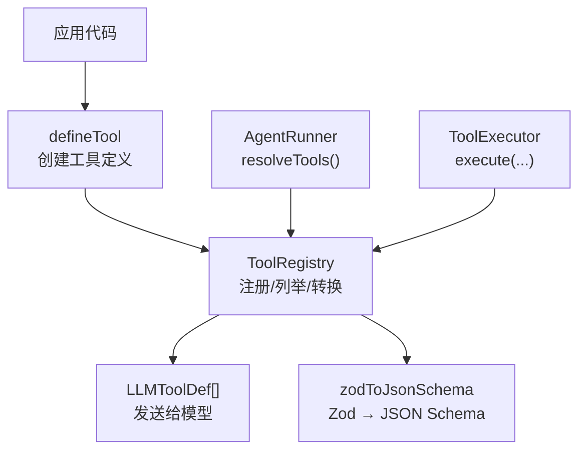
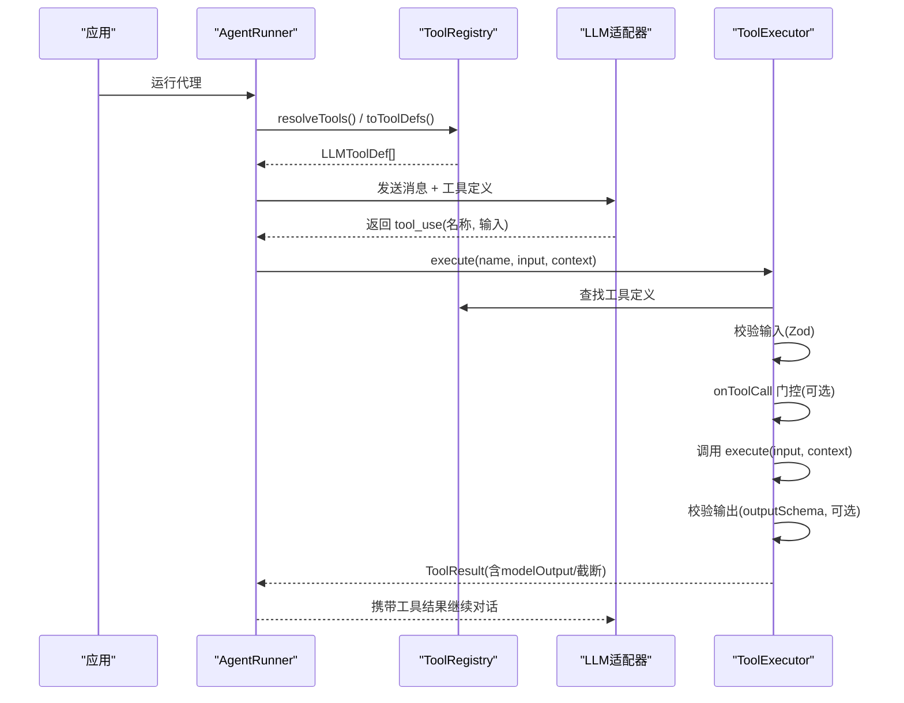
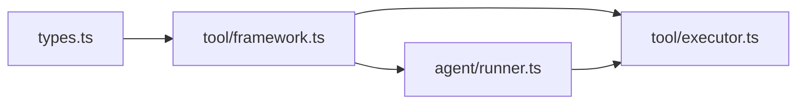
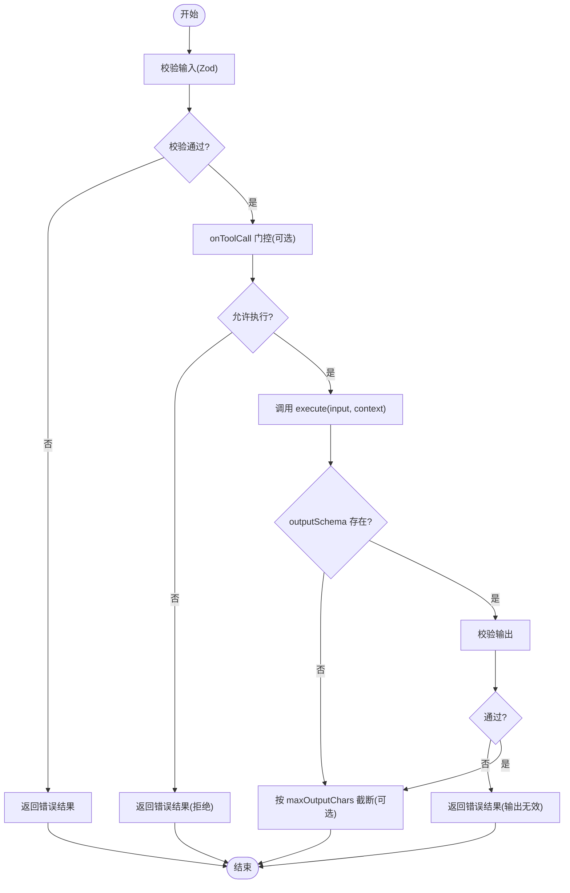

# 工具定义框架

<cite>
**本文引用的文件**
- [packages/core/src/tool/framework.ts](file://packages/core/src/tool/framework.ts)
- [packages/core/src/types.ts](file://packages/core/src/types.ts)
- [packages/core/src/index.ts](file://packages/core/src/index.ts)
- [packages/core/src/agent/runner.ts](file://packages/core/src/agent/runner.ts)
- [packages/core/src/tool/executor.ts](file://packages/core/src/tool/executor.ts)
- [packages/core/tests/tool-executor.test.ts](file://packages/core/tests/tool-executor.test.ts)
</cite>

## 目录
1. [简介](#简介)
2. [项目结构](#项目结构)
3. [核心组件](#核心组件)
4. [架构总览](#架构总览)
5. [详细组件分析](#详细组件分析)
6. [依赖关系分析](#依赖关系分析)
7. [性能考虑](#性能考虑)
8. [故障排查指南](#故障排查指南)
9. [结论](#结论)
10. [附录](#附录)

## 简介
本文件系统性解析 Open Multi-Agent 的工具定义框架，重点说明 defineTool 的使用方式与配置项（name、description、inputSchema、outputSchema、consequential、maxOutputChars 等），阐述 ToolDefinition 接口结构与扩展方式，解释 Zod Schema 在输入输出验证中的应用，以及 zodToJsonSchema 如何将 TypeScript/Zod 类型转换为 LLM 兼容的 JSON Schema。同时提供不同复杂度工具的示例路径与最佳实践建议，涵盖工具元数据管理与版本控制策略。

## 项目结构
工具定义框架位于 core 包的 tool 子系统中，对外通过 index.ts 统一导出 defineTool、ToolRegistry、zodToJsonSchema 等能力；Agent 执行器在调用 LLM 前会解析可用工具并生成 LLMToolDef 列表；工具执行由 ToolExecutor 负责参数校验、门控、执行与结果压缩。



图表来源
- [packages/core/src/tool/framework.ts:71-117](file://packages/core/src/tool/framework.ts#L71-L117)
- [packages/core/src/tool/framework.ts:127-261](file://packages/core/src/tool/framework.ts#L127-L261)
- [packages/core/src/tool/framework.ts:279-491](file://packages/core/src/tool/framework.ts#L279-L491)
- [packages/core/src/agent/runner.ts:902-912](file://packages/core/src/agent/runner.ts#L902-L912)
- [packages/core/src/index.ts:165-167](file://packages/core/src/index.ts#L165-L167)

章节来源
- [packages/core/src/index.ts:165-167](file://packages/core/src/index.ts#L165-L167)
- [packages/core/src/tool/framework.ts:71-117](file://packages/core/src/tool/framework.ts#L71-L117)
- [packages/core/src/tool/framework.ts:127-261](file://packages/core/src/tool/framework.ts#L127-L261)
- [packages/core/src/tool/framework.ts:279-491](file://packages/core/src/tool/framework.ts#L279-L491)
- [packages/core/src/agent/runner.ts:902-912](file://packages/core/src/agent/runner.ts#L902-L912)

## 核心组件
- defineTool：声明式创建工具定义，返回满足 ToolDefinition 接口的对象，支持可选的 consequential、outputSchema、llmInputSchema、maxOutputChars 等配置。
- ToolRegistry：维护工具集合，提供注册、查询、列举、卸载，以及将工具转换为 LLM 可消费的 LLMToolDef 或 Anthropic 风格 input_schema。
- zodToJsonSchema：将 Zod Schema 递归转换为 JSON Schema，用于向 LLM 暴露输入参数结构。
- ToolDefinition：工具契约，包含名称、描述、输入模式、可选输出模式、副作用标记、最大输出长度限制及 execute 实现。
- ToolUseContext：工具执行上下文，注入 agent、team、abortSignal、cwd、credentials、runId/taskId/toolCallId 等运行时信息。
- ToolExecutor：执行入口，负责参数校验、onToolCall 门控、执行、错误处理、结果压缩与追踪埋点。

章节来源
- [packages/core/src/tool/framework.ts:71-117](file://packages/core/src/tool/framework.ts#L71-L117)
- [packages/core/src/tool/framework.ts:127-261](file://packages/core/src/tool/framework.ts#L127-L261)
- [packages/core/src/tool/framework.ts:279-491](file://packages/core/src/tool/framework.ts#L279-L491)
- [packages/core/src/types.ts:511-516](file://packages/core/src/types.ts#L511-L516)
- [packages/core/src/types.ts:531-583](file://packages/core/src/types.ts#L531-L583)
- [packages/core/src/types.ts:676-734](file://packages/core/src/types.ts#L676-L734)

## 架构总览
下图展示从工具定义到 LLM 调用的完整链路：AgentRunner 解析工具集合并生成 LLMToolDef 列表；模型响应中可能包含 tool_use 请求；ToolExecutor 根据工具名查找定义，进行输入校验、门控检查、执行与结果压缩，最终将结果回传给模型继续对话。



图表来源
- [packages/core/src/agent/runner.ts:902-912](file://packages/core/src/agent/runner.ts#L902-L912)
- [packages/core/src/tool/framework.ts:204-261](file://packages/core/src/tool/framework.ts#L204-L261)
- [packages/core/src/tool/executor.ts](file://packages/core/src/tool/executor.ts)

## 详细组件分析

### defineTool 函数与配置项
- name/description：工具标识与人类可读描述，直接透传到 LLMToolDef，帮助模型理解何时调用。
- inputSchema：使用 Zod 定义的输入参数结构，默认会被 zodToJsonSchema 转换为 JSON Schema 发送给 LLM；也可通过 llmInputSchema 直接提供自定义 JSON Schema。
- outputSchema：对工具返回的 data 字段进行运行时校验，失败时返回错误 ToolResult，避免无效数据进入后续流程。
- consequential：标记该工具具有真实副作用（如写文件、发请求），用于治理与审批策略（例如需要人工确认）。
- maxOutputChars：单工具输出字符上限，超过时按“头+尾+标记”的方式截断，优先级高于代理级配置。
- execute：实际业务逻辑，接收已校验的输入与上下文，返回 ToolResult。

章节来源
- [packages/core/src/tool/framework.ts:71-117](file://packages/core/src/tool/framework.ts#L71-L117)
- [packages/core/src/types.ts:704-734](file://packages/core/src/types.ts#L704-L734)

### ToolDefinition 接口与扩展
- 基本字段：name、description、inputSchema、execute。
- 可选字段：consequential、outputSchema、llmInputSchema、maxOutputChars。
- 扩展方式：通过新增可选字段或组合多个工具定义来扩展能力；ToolRegistry 支持动态注册/卸载，便于运行时扩展工具集。

章节来源
- [packages/core/src/types.ts:704-734](file://packages/core/src/types.ts#L704-L734)
- [packages/core/src/tool/framework.ts:127-197](file://packages/core/src/tool/framework.ts#L127-L197)

### Zod Schema 与 JSON Schema 转换
- zodToJsonSchema 支持多种 Zod 类型：string、number、bigint、boolean、null、date、literal、enum/nativeEnum、array/tuple、object/record、optional/nullable/default、union/discriminatedUnion/intersection、effects/branded/readonly/catch/pipeline、any/unknown/never/void 等。
- 对于不支持的类型，降级为 {}（any），仍符合 JSON Schema 规范。
- 转换过程保留 description、required、default、enum、const、format 等语义，确保 LLM 能准确理解参数约束。

章节来源
- [packages/core/src/tool/framework.ts:279-491](file://packages/core/src/tool/framework.ts#L279-L491)

### 工具执行与结果处理
- 输入校验：基于 inputSchema 的 Zod 校验，失败返回错误结果。
- 门控机制：onToolCall 可在执行前决定 allow/deny/suspend，deny 时不执行工具并返回错误结果。
- 执行与输出校验：调用 execute 后，若定义了 outputSchema，则对 data 进行校验，失败返回错误结果。
- 输出截断：当设置 maxOutputChars 时，超出部分将被截断，保证模型上下文可控。
- 上下文注入：ToolUseContext 提供 agent、team、abortSignal、cwd、credentials、runId/taskId/toolCallId 等，便于工具实现安全与幂等性。

章节来源
- [packages/core/src/tool/executor.ts](file://packages/core/src/tool/executor.ts)
- [packages/core/src/types.ts:531-583](file://packages/core/src/types.ts#L531-L583)
- [packages/core/src/types.ts:676-734](file://packages/core/src/types.ts#L676-L734)

### 典型用法示例（以路径引用代替代码）
- 简单工具（字符串输入/输出）：参考测试中的 echoTool 定义与执行用例。
  - 示例路径：[packages/core/tests/tool-executor.test.ts:15-22](file://packages/core/tests/tool-executor.test.ts#L15-L22)
- 复杂参数工具（对象/数组/枚举/联合类型）：使用 z.object/z.array/z.enum/z.union 等组合构建输入模式。
  - 示例路径：[packages/core/tests/tool-executor.test.ts:110-139](file://packages/core/tests/tool-executor.test.ts#L110-L139)
- 带输出验证的工具（outputSchema）：在 defineTool 中附加 outputSchema，对返回 data 做结构化校验。
  - 示例路径：[packages/core/tests/tool-executor.test.ts:47-77](file://packages/core/tests/tool-executor.test.ts#L47-L77)
- 门控与拒绝场景（onToolCall）：演示 deny 决策下不执行工具并返回错误结果。
  - 示例路径：[packages/core/tests/tool-executor.test.ts:110-139](file://packages/core/tests/tool-executor.test.ts#L110-L139)

章节来源
- [packages/core/tests/tool-executor.test.ts:15-22](file://packages/core/tests/tool-executor.test.ts#L15-L22)
- [packages/core/tests/tool-executor.test.ts:47-77](file://packages/core/tests/tool-executor.test.ts#L47-L77)
- [packages/core/tests/tool-executor.test.ts:110-139](file://packages/core/tests/tool-executor.test.ts#L110-L139)

## 依赖关系分析
- 模块耦合：
  - framework.ts 依赖 types.ts 的 ToolDefinition、ToolUseContext、LLMToolDef 等类型。
  - agent/runner.ts 通过 ToolRegistry.toToolDefs() 获取 LLM 可用的工具定义。
  - tool/executor.ts 依赖 ToolRegistry 与 types.ts 的上下文与决策类型。
- 外部依赖：
  - zodToJsonSchema 依赖 Zod 内部 _def 结构进行类型识别与转换。
- 潜在循环：
  - 通过单一类型出口（types.ts）与模块化组织，保持依赖无环。



图表来源
- [packages/core/src/types.ts:511-516](file://packages/core/src/types.ts#L511-L516)
- [packages/core/src/tool/framework.ts:13-22](file://packages/core/src/tool/framework.ts#L13-L22)
- [packages/core/src/agent/runner.ts:902-912](file://packages/core/src/agent/runner.ts#L902-L912)

章节来源
- [packages/core/src/types.ts:511-516](file://packages/core/src/types.ts#L511-L516)
- [packages/core/src/tool/framework.ts:13-22](file://packages/core/src/tool/framework.ts#L13-L22)
- [packages/core/src/agent/runner.ts:902-912](file://packages/core/src/agent/runner.ts#L902-L912)

## 性能考虑
- 输入/输出校验：Zod 校验开销较小，但应避免过度复杂的 schema 导致转换与校验成本上升。
- 输出截断：合理设置 maxOutputChars，避免大文本占用模型上下文。
- 工具注册与转换：toToolDefs/toLLMTools 在每次 LLM 调用前执行，建议缓存工具定义或在启动时预计算。
- 并发执行：ToolExecutor 支持批量执行（见导出类型），在高吞吐场景下注意限流与资源隔离。

## 故障排查指南
- 工具未注册：执行未知工具名将返回错误结果。
  - 参考路径：[packages/core/tests/tool-executor.test.ts:95-100](file://packages/core/tests/tool-executor.test.ts#L95-L100)
- 输入校验失败：缺少必填字段或类型不符将返回错误结果。
  - 参考路径：[packages/core/tests/tool-executor.test.ts:102-108](file://packages/core/tests/tool-executor.test.ts#L102-L108)
- 门控拒绝：onToolCall 返回 deny 时不执行工具并返回错误结果。
  - 参考路径：[packages/core/tests/tool-executor.test.ts:110-139](file://packages/core/tests/tool-executor.test.ts#L110-L139)
- 执行异常：工具抛出异常会被捕获并转为错误结果。
  - 参考路径：[packages/core/tests/tool-executor.test.ts:199-200](file://packages/core/tests/tool-executor.test.ts#L199-L200)
- 中止信号：在执行期间触发 abort 将返回中止错误。
  - 参考路径：[packages/core/tests/tool-executor.test.ts:141-174](file://packages/core/tests/tool-executor.test.ts#L141-L174)

章节来源
- [packages/core/tests/tool-executor.test.ts:95-100](file://packages/core/tests/tool-executor.test.ts#L95-L100)
- [packages/core/tests/tool-executor.test.ts:102-108](file://packages/core/tests/tool-executor.test.ts#L102-L108)
- [packages/core/tests/tool-executor.test.ts:110-139](file://packages/core/tests/tool-executor.test.ts#L110-L139)
- [packages/core/tests/tool-executor.test.ts:141-174](file://packages/core/tests/tool-executor.test.ts#L141-L174)
- [packages/core/tests/tool-executor.test.ts:199-200](file://packages/core/tests/tool-executor.test.ts#L199-L200)

## 结论
Open Multi-Agent 的工具定义框架通过 defineTool 提供了声明式、类型安全的工具定义方式，结合 ToolRegistry 与 zodToJsonSchema 实现了从 TypeScript/Zod 到 LLM JSON Schema 的无缝转换。ToolDefinition 的扩展点（consequential、outputSchema、llmInputSchema、maxOutputChars）覆盖了副作用标记、输出校验、自定义输入模式与输出长度控制等关键需求。配合 ToolExecutor 的门控与错误处理机制，能够在生产环境中实现安全、可控且可观测的工具执行流程。

## 附录

### 工具定义类图（映射到源码）
```mermaid
classDiagram
class ToolDefinition {
+string name
+string description
+ZodSchema inputSchema
+boolean? consequential
+ZodSchema? outputSchema
+Record~string, unknown~? llmInputSchema
+number? maxOutputChars
+execute(input, context) Promise~ToolResult~
}
class ToolRegistry {
-Map tools
-Set runtimeToolNames
+register(tool, options?)
+get(name) ToolDefinition?
+list() ToolDefinition[]
+unregister(name)
+toToolDefs() LLMToolDef[]
+toRuntimeToolDefs() LLMToolDef[]
+toLLMTools() {name, description, input_schema}[]
}
class LLMToolDef {
+string name
+string description
+Record~string, unknown~ inputSchema
}
ToolRegistry --> ToolDefinition : "持有/转换"
ToolRegistry --> LLMToolDef : "生成"
```

图表来源
- [packages/core/src/tool/framework.ts:127-261](file://packages/core/src/tool/framework.ts#L127-L261)
- [packages/core/src/types.ts:511-516](file://packages/core/src/types.ts#L511-L516)
- [packages/core/src/types.ts:704-734](file://packages/core/src/types.ts#L704-L734)

### 工具执行流程图（映射到源码）


图表来源
- [packages/core/src/tool/executor.ts](file://packages/core/src/tool/executor.ts)
- [packages/core/src/types.ts:704-734](file://packages/core/src/types.ts#L704-L734)

### 最佳实践：工具元数据管理与版本控制
- 命名与描述：
  - name 应唯一且具语义，避免冲突；description 需清晰表达用途与约束，有助于模型选择。
- 输入/输出模式：
  - 优先使用 Zod 定义 inputSchema 与 outputSchema，确保类型一致性与可维护性。
  - 对第三方或外部系统提供的 JSON Schema，可通过 llmInputSchema 直接传入，减少转换误差。
- 副作用与治理：
  - 对具有真实副作用的工具设置 consequential=true，配合 onToolCall 门控实现审批与审计。
- 输出长度控制：
  - 为长输出工具设置 maxOutputChars，避免上下文溢出；必要时在工具内自行分段输出。
- 版本演进：
  - 通过 ToolRegistry.register/unregister 实现热插拔与灰度发布；对破坏性变更采用新名称或版本号后缀。
  - 在 beforeRun/afterRun 钩子中记录工具版本与配置快照，便于回溯与对比。
- 安全与隔离：
  - 使用 ToolUseContext.credentials 传递最小权限凭据；利用 cwd 沙箱限制文件系统访问范围。
  - 对敏感字段（如 credentials）自动脱敏，避免泄露至追踪与日志。