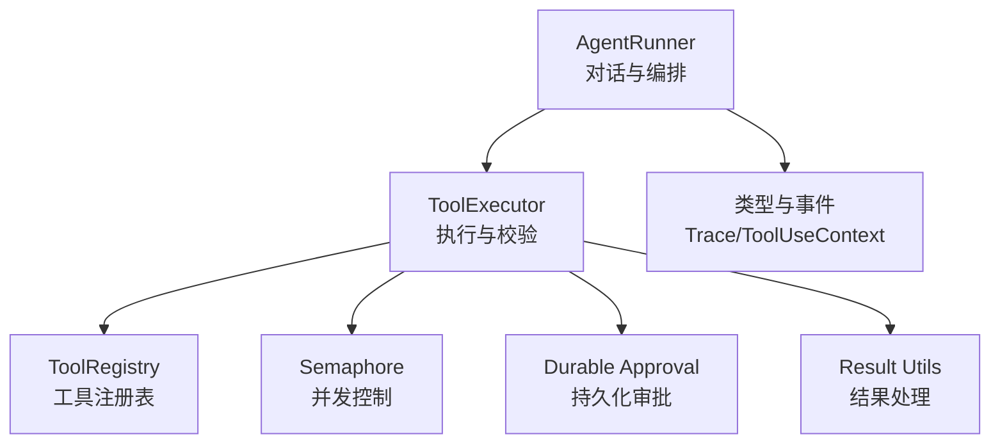
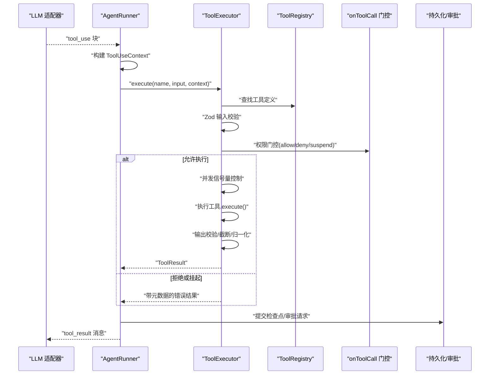
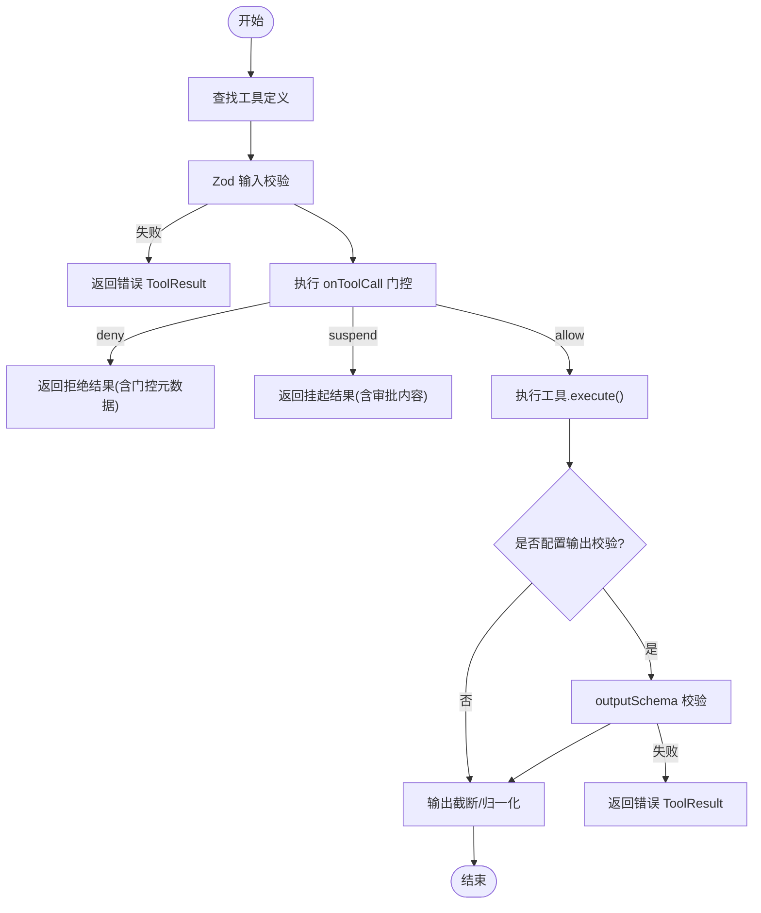
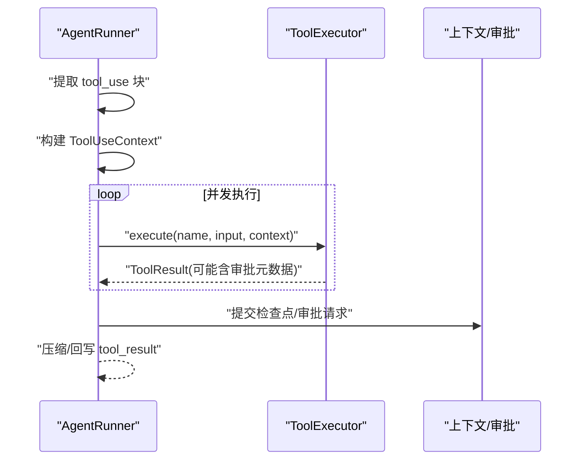
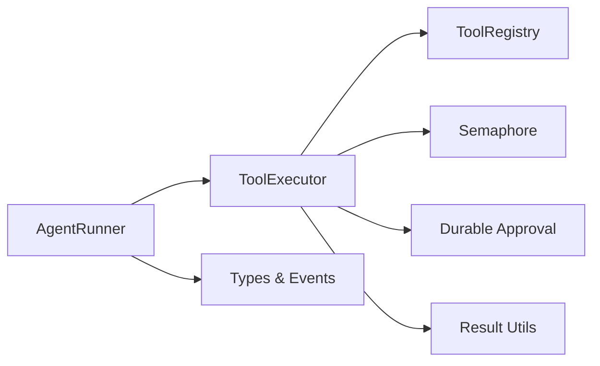
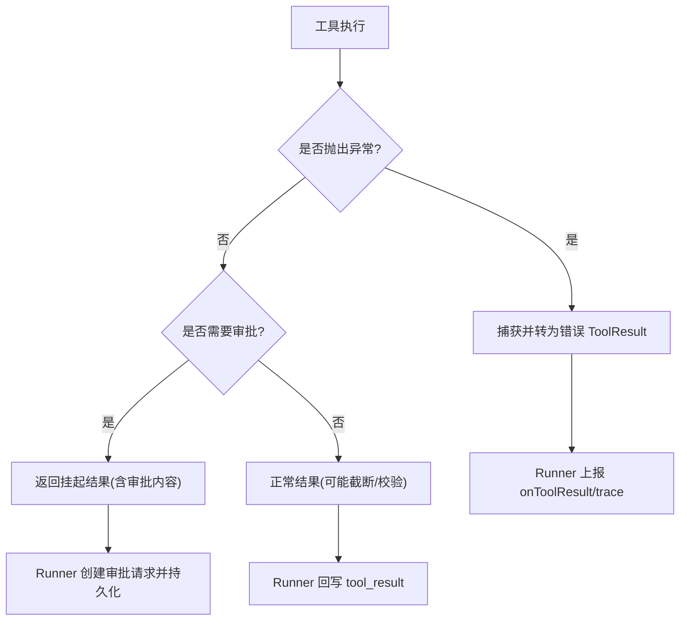

# 工具执行引擎

<cite>
**本文引用的文件**
- [packages/core/src/tool/executor.ts](file://packages/core/src/tool/executor.ts)
- [packages/core/src/agent/runner.ts](file://packages/core/src/agent/runner.ts)
- [packages/core/src/tool/framework.ts](file://packages/core/src/tool/framework.ts)
- [packages/core/src/types.ts](file://packages/core/src/types.ts)
- [packages/core/src/utils/semaphore.ts](file://packages/core/src/utils/semaphore.ts)
- [packages/core/src/approval/durable.ts](file://packages/core/src/approval/durable.ts)
- [packages/core/src/tool/result.ts](file://packages/core/src/tool/result.ts)
</cite>

## 目录
1. [简介](#简介)
2. [项目结构](#项目结构)
3. [核心组件](#核心组件)
4. [架构总览](#架构总览)
5. [详细组件分析](#详细组件分析)
6. [依赖关系分析](#依赖关系分析)
7. [性能与并发特性](#性能与并发特性)
8. [错误处理与异常恢复](#错误处理与异常恢复)
9. [监控与追踪](#监控与追踪)
10. [故障排查指南](#故障排查指南)
11. [结论](#结论)
12. [附录：复杂场景示例](#附录：复杂场景示例)

## 简介
本文件深入解析工具执行引擎的实现机制和执行流程，重点围绕 ToolExecutor 类的工作原理，覆盖工具调用解析、参数校验、权限检查、沙箱执行、结果处理等完整链路；解释 ToolUseContext 上下文对象的结构与作用（智能体信息、任务上下文、共享内存访问等）；阐述错误处理与异常恢复机制（超时控制、重试策略、资源清理）；说明工具执行的监控与追踪机制（性能指标收集、日志记录、调试信息）；并提供具体代码路径以展示如何处理异步操作、并发控制与资源管理等复杂场景。

## 项目结构
工具执行引擎位于 core 包中，由“运行器 + 执行器 + 工具框架”三部分构成：
- AgentRunner：驱动对话循环，负责 LLM 调用、工具调用提取、并行执行、结果回写、持久化与恢复。
- ToolExecutor：统一执行入口，负责输入校验、权限门控、并发控制、输出截断、错误归一化。
- ToolRegistry/defineTool：工具定义与注册，提供 JSON Schema 转换与运行时工具集合。

图表来源
- [packages/core/src/agent/runner.ts:875-1320](file://packages/core/src/agent/runner.ts#L875-L1320)
- [packages/core/src/tool/executor.ts:85-164](file://packages/core/src/tool/executor.ts#L85-L164)
- [packages/core/src/tool/framework.ts:127-261](file://packages/core/src/tool/framework.ts#L127-L261)
- [packages/core/src/types.ts:531-691](file://packages/core/src/types.ts#L531-L691)

章节来源
- [packages/core/src/agent/runner.ts:875-1320](file://packages/core/src/agent/runner.ts#L875-L1320)
- [packages/core/src/tool/executor.ts:85-164](file://packages/core/src/tool/executor.ts#L85-L164)
- [packages/core/src/tool/framework.ts:127-261](file://packages/core/src/tool/framework.ts#L127-L261)
- [packages/core/src/types.ts:531-691](file://packages/core/src/types.ts#L531-L691)

## 核心组件
- ToolExecutor：实现单工具与批量工具的并发执行，内置 Zod 输入校验、可选输出校验、可插拔 onToolCall 门控、最大输出长度截断、错误归一化为 ToolResult。
- AgentRunner：维护对话状态、提取 tool_use 块、构建 ToolUseContext、调度 ToolExecutor、处理结果压缩与消息回写、支持持久化与恢复。
- ToolRegistry/defineTool：声明式工具定义、JSON Schema 转换、运行时工具列表管理。
- 类型系统：ToolUseContext、ToolResult、ToolCallGate、TraceEvent 等贯穿全链路的契约。

章节来源
- [packages/core/src/tool/executor.ts:85-164](file://packages/core/src/tool/executor.ts#L85-L164)
- [packages/core/src/agent/runner.ts:1364-1486](file://packages/core/src/agent/runner.ts#L1364-L1486)
- [packages/core/src/tool/framework.ts:71-117](file://packages/core/src/tool/framework.ts#L71-L117)
- [packages/core/src/types.ts:531-691](file://packages/core/src/types.ts#L531-L691)

## 架构总览
下图展示了从模型返回 tool_use 到工具执行完成并回写结果的端到端流程，包括权限检查、并发控制、结果压缩与追踪埋点。

图表来源
- [packages/core/src/agent/runner.ts:990-1069](file://packages/core/src/agent/runner.ts#L990-L1069)
- [packages/core/src/tool/executor.ts:181-338](file://packages/core/src/tool/executor.ts#L181-L338)
- [packages/core/src/tool/framework.ts:204-261](file://packages/core/src/tool/framework.ts#L204-L261)
- [packages/core/src/approval/durable.ts:28-31](file://packages/core/src/approval/durable.ts#L28-L31)

## 详细组件分析

### ToolExecutor 工作原理
- 输入解析与校验：使用工具定义的 Zod schema 对 rawInput 进行 safeParse，失败时生成结构化错误信息。
- 权限门控：在输入校验后、执行前调用 onToolCall 钩子，支持 allow/deny/suspend 三种决策；若为 suspend，则返回包含 approvalRequestContent 的元数据，交由上层创建持久化审批。
- 并发控制：通过 Semaphore 限制同时运行的工具数量，默认上限为 4；批量执行 executeBatch 保证每个调用都有结果。
- 执行与输出处理：调用工具 execute，要求返回 ToolResult；非错误结果且定义了 outputSchema 时进行二次校验；按工具或代理级 maxOutputChars 进行字符串截断；将 modelOutput 拷贝并规范化。
- 错误隔离：所有同步/异步异常被捕获并转换为 isError=true 的 ToolResult，避免中断整体流程。

图表来源
- [packages/core/src/tool/executor.ts:181-338](file://packages/core/src/tool/executor.ts#L181-L338)
- [packages/core/src/tool/executor.ts:340-379](file://packages/core/src/tool/executor.ts#L340-L379)
- [packages/core/src/tool/executor.ts:421-442](file://packages/core/src/tool/executor.ts#L421-L442)

章节来源
- [packages/core/src/tool/executor.ts:85-164](file://packages/core/src/tool/executor.ts#L85-L164)
- [packages/core/src/tool/executor.ts:181-338](file://packages/core/src/tool/executor.ts#L181-L338)
- [packages/core/src/tool/executor.ts:340-379](file://packages/core/src/tool/executor.ts#L340-L379)
- [packages/core/src/tool/executor.ts:421-442](file://packages/core/src/tool/executor.ts#L421-L442)

### AgentRunner 中的工具执行编排
- 工具调用提取：从 LLM 响应中提取 tool_use 块，并在进入执行阶段前进行环路检测。
- 上下文构建：buildToolContext 注入 agent、abortSignal、cwd、runId/taskId/team/credentials 等。
- 并行执行：对 pendingToolCalls 使用 Promise.all 并发执行，内部受 ToolExecutor 的信号量约束。
- 结果回写：将 tool_result 写入对话历史，必要时压缩超长输出，触发 onMessage/onToolResult 回调。
- 持久化与恢复：在执行前后调用 persistCheckpoint，支持 checkpoint 恢复与审批边界。

图表来源
- [packages/core/src/agent/runner.ts:990-1069](file://packages/core/src/agent/runner.ts#L990-L1069)
- [packages/core/src/agent/runner.ts:1364-1486](file://packages/core/src/agent/runner.ts#L1364-L1486)
- [packages/core/src/agent/runner.ts:1795-1811](file://packages/core/src/agent/runner.ts#L1795-L1811)

章节来源
- [packages/core/src/agent/runner.ts:990-1069](file://packages/core/src/agent/runner.ts#L990-L1069)
- [packages/core/src/agent/runner.ts:1364-1486](file://packages/core/src/agent/runner.ts#L1364-L1486)
- [packages/core/src/agent/runner.ts:1795-1811](file://packages/core/src/agent/runner.ts#L1795-L1811)

### ToolUseContext 结构与职责
- agent：描述当前智能体的名称、角色与模型，便于审计与追踪。
- team：多智能体团队上下文，包含共享内存、委派深度、委派池视图及 runDelegatedAgent 能力。
- abortSignal/abortController：用于取消与超时控制，工具应优先读取 abortSignal。
- cwd：文件系统沙箱根目录，内置文件工具基于此进行路径白名单校验。
- runId/taskId/toolCallId：用于追踪、幂等与审批边界标识。
- credentials：按智能体作用域暴露密钥，自动脱敏。

章节来源
- [packages/core/src/types.ts:531-691](file://packages/core/src/types.ts#L531-L691)
- [packages/core/src/agent/runner.ts:1795-1811](file://packages/core/src/agent/runner.ts#L1795-L1811)

### 工具定义与注册
- defineTool：声明 name、description、inputSchema、consequential、outputSchema、llmInputSchema、maxOutputChars、execute。
- ToolRegistry：集中管理工具，支持 toToolDefs/toLLMTools 转换为 LLM 所需的 JSON Schema，支持运行时动态增删。

章节来源
- [packages/core/src/tool/framework.ts:71-117](file://packages/core/src/tool/framework.ts#L71-L117)
- [packages/core/src/tool/framework.ts:127-261](file://packages/core/src/tool/framework.ts#L127-L261)

## 依赖关系分析
- AgentRunner 依赖 ToolExecutor 执行工具，依赖 ToolRegistry 获取工具定义，依赖 types 中的上下文与事件类型。
- ToolExecutor 依赖 ToolRegistry、Semaphore、durable approval 工具与 result 工具。
- ToolRegistry 依赖 zodToJsonSchema 将 Zod schema 转为 JSON Schema。

图表来源
- [packages/core/src/agent/runner.ts:875-1320](file://packages/core/src/agent/runner.ts#L875-L1320)
- [packages/core/src/tool/executor.ts:85-164](file://packages/core/src/tool/executor.ts#L85-L164)
- [packages/core/src/tool/framework.ts:204-261](file://packages/core/src/tool/framework.ts#L204-L261)

章节来源
- [packages/core/src/agent/runner.ts:875-1320](file://packages/core/src/agent/runner.ts#L875-L1320)
- [packages/core/src/tool/executor.ts:85-164](file://packages/core/src/tool/executor.ts#L85-L164)
- [packages/core/src/tool/framework.ts:204-261](file://packages/core/src/tool/framework.ts#L204-L261)

## 性能与并发特性
- 并发上限：ToolExecutor 默认最多 4 个工具并行，可通过 maxConcurrency 调整。
- 输出截断：支持 per-tool 或代理级 maxOutputChars，保留头部约 70% 与尾部约 30%，并插入截断标记。
- 结果压缩：AgentRunner 对超长 tool_result 进行压缩，减少后续 LLM 调用成本。
- 令牌预算：Runner 累计 token 用量，超过预算时发出 budget_exceeded 事件。

章节来源
- [packages/core/src/tool/executor.ts:38-55](file://packages/core/src/tool/executor.ts#L38-L55)
- [packages/core/src/tool/executor.ts:359-379](file://packages/core/src/tool/executor.ts#L359-L379)
- [packages/core/src/agent/runner.ts:1204-1215](file://packages/core/src/agent/runner.ts#L1204-L1215)

## 错误处理与异常恢复
- 错误归一化：ToolExecutor 将所有异常捕获并返回 isError=true 的 ToolResult，确保循环继续。
- 权限拒绝：onToolCall deny 或默认拒绝未授权工具调用，附带门控元数据。
- 持久化审批：当工具请求挂起时，Runner 创建审批请求并持久化检查点；恢复时校验审批一致性，防止重放攻击。
- 超时与取消：通过 AbortSignal 在关键节点检查中止；Runner 支持 callTimeoutMs 与任务级超时。
- 资源清理：工具执行完成后，Runner 提交检查点并释放上下文；批处理中每个调用独立捕获错误，不影响其他调用。

图表来源
- [packages/core/src/tool/executor.ts:297-338](file://packages/core/src/tool/executor.ts#L297-L338)
- [packages/core/src/agent/runner.ts:1045-1069](file://packages/core/src/agent/runner.ts#L1045-L1069)
- [packages/core/src/agent/runner.ts:1436-1458](file://packages/core/src/agent/runner.ts#L1436-L1458)

章节来源
- [packages/core/src/tool/executor.ts:297-338](file://packages/core/src/tool/executor.ts#L297-L338)
- [packages/core/src/agent/runner.ts:1045-1069](file://packages/core/src/agent/runner.ts#L1045-L1069)
- [packages/core/src/agent/runner.ts:1436-1458](file://packages/core/src/agent/runner.ts#L1436-L1458)

## 监控与追踪
- Trace 事件：每次工具执行产生 tool_call 事件，包含工具名、是否错误、门控动作、输入输出摘要等。
- Span 与属性：Runner 为工具执行创建 span，携带 agent、tool、task 等属性；支持 traceRuntime 集成。
- 回调与流式事件：onToolCall/onToolResult 与 stream 事件（tool_use/tool_result/done/error）便于实时观测。
- 脱敏与审计：credentials 与敏感字段自动脱敏；审批请求与决策记录用于审计。

章节来源
- [packages/core/src/types.ts:2668-2728](file://packages/core/src/types.ts#L2668-L2728)
- [packages/core/src/agent/runner.ts:1376-1388](file://packages/core/src/agent/runner.ts#L1376-L1388)
- [packages/core/src/agent/runner.ts:1082-1103](file://packages/core/src/agent/runner.ts#L1082-L1103)

## 故障排查指南
- 工具未注册：ToolExecutor 会返回未注册的错误信息，检查 ToolRegistry 是否正确注册。
- 输入校验失败：查看 Zod issuesMessage，修正输入结构或 schema。
- 权限拒绝：检查 onToolCall 逻辑或 agent 的工具白名单/预设。
- 输出过长：调整 maxOutputChars 或启用结果压缩。
- 审批失败：确认 durable approval 的请求哈希一致性与上下文完整性。
- 超时/取消：检查 AbortSignal 与 callTimeoutMs 配置。

章节来源
- [packages/core/src/tool/executor.ts:118-133](file://packages/core/src/tool/executor.ts#L118-L133)
- [packages/core/src/tool/executor.ts:188-197](file://packages/core/src/tool/executor.ts#L188-L197)
- [packages/core/src/tool/executor.ts:250-295](file://packages/core/src/tool/executor.ts#L250-L295)
- [packages/core/src/tool/executor.ts:359-379](file://packages/core/src/tool/executor.ts#L359-L379)
- [packages/core/src/agent/runner.ts:1436-1458](file://packages/core/src/agent/runner.ts#L1436-L1458)

## 结论
工具执行引擎通过 ToolExecutor 与 AgentRunner 的协作，实现了安全、可控、可观测的工具执行流水线。其核心优势包括：严格的输入/输出校验、可插拔的权限门控、可配置的并发与输出截断、完善的持久化与恢复、以及全面的监控与追踪。借助 ToolUseContext，工具可以安全地访问智能体信息、任务上下文与共享内存，从而支撑复杂的异步与并发场景。

## 附录：复杂场景示例
以下示例以“代码片段路径”形式给出，便于读者直接定位实现位置：
- 异步操作与超时控制：在工具中使用 AbortSignal 检查取消，或在外部通过 AbortController 设置超时。
  - 参考路径：[packages/core/src/types.ts:531-583](file://packages/core/src/types.ts#L531-L583)
- 并发控制与限流：通过 ToolExecutor 的 maxConcurrency 限制并发；批量执行时使用 executeBatch。
  - 参考路径：[packages/core/src/tool/executor.ts:38-55](file://packages/core/src/tool/executor.ts#L38-L55)
  - 参考路径：[packages/core/src/tool/executor.ts:148-164](file://packages/core/src/tool/executor.ts#L148-L164)
- 资源管理与清理：工具执行完成后，Runner 提交检查点并释放上下文；批处理中错误隔离。
  - 参考路径：[packages/core/src/agent/runner.ts:1045-1069](file://packages/core/src/agent/runner.ts#L1045-L1069)
- 权限门控与审批：onToolCall 返回 suspend，Runner 创建审批请求并持久化；恢复时校验一致性。
  - 参考路径：[packages/core/src/tool/executor.ts:250-295](file://packages/core/src/tool/executor.ts#L250-L295)
  - 参考路径：[packages/core/src/agent/runner.ts:1026-1043](file://packages/core/src/agent/runner.ts#L1026-L1043)
- 结果压缩与截断：对超长 tool_result 进行压缩与截断，降低后续 LLM 成本。
  - 参考路径：[packages/core/src/agent/runner.ts:1759-1790](file://packages/core/src/agent/runner.ts#L1759-L1790)
  - 参考路径：[packages/core/src/tool/executor.ts:359-379](file://packages/core/src/tool/executor.ts#L359-L379)