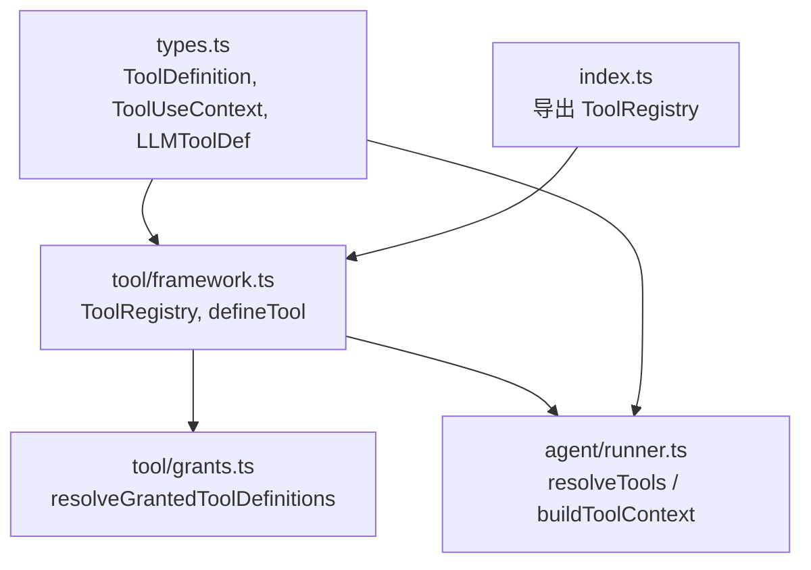
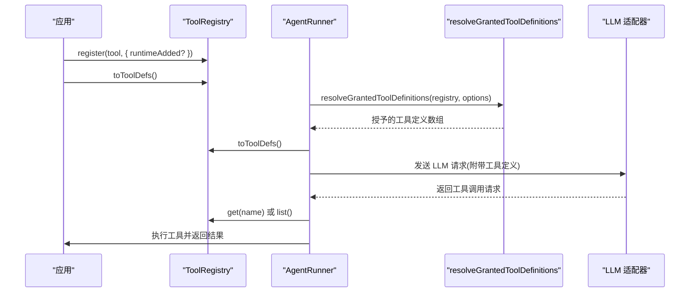
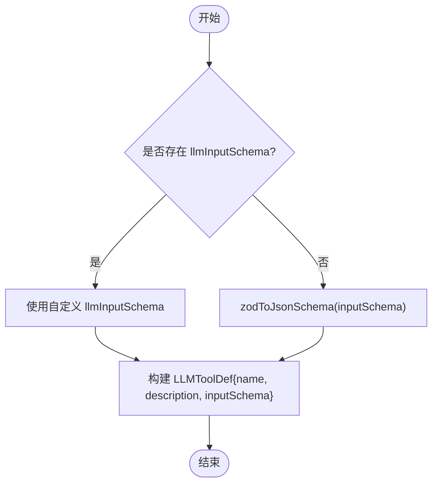
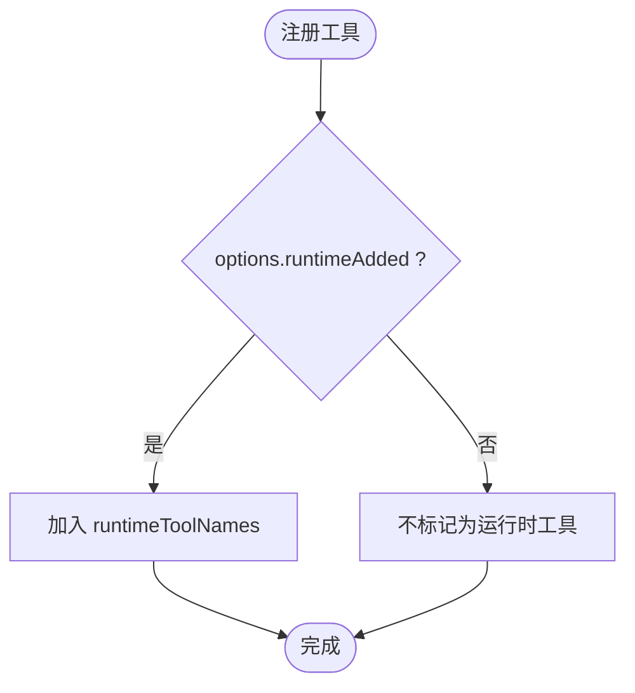
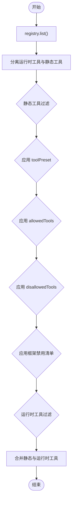
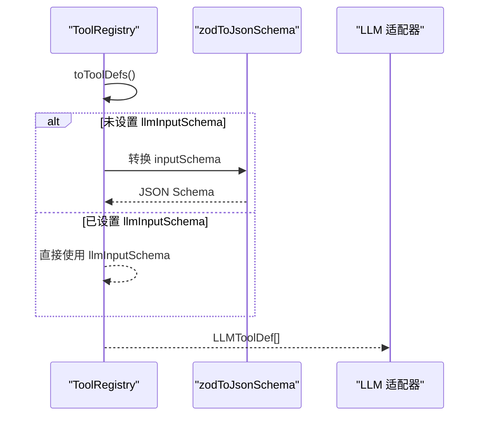
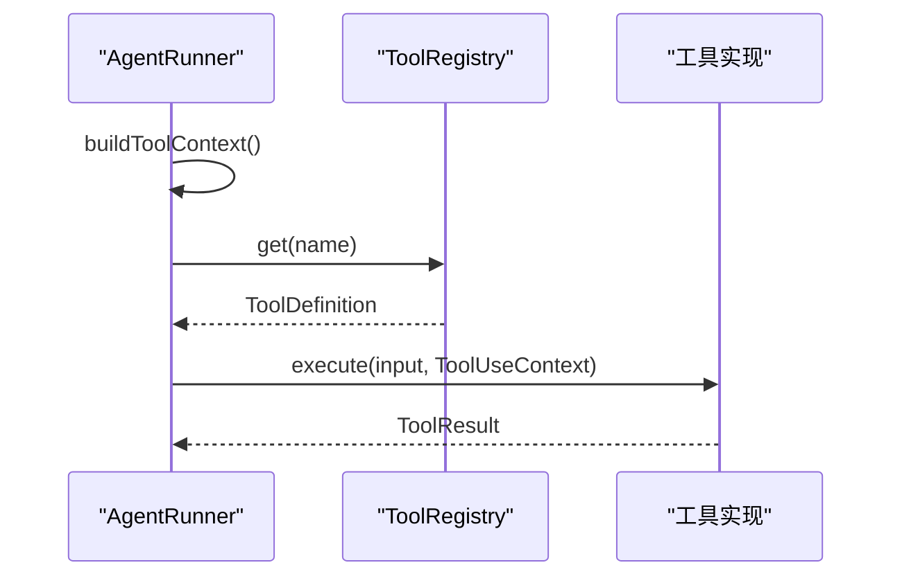
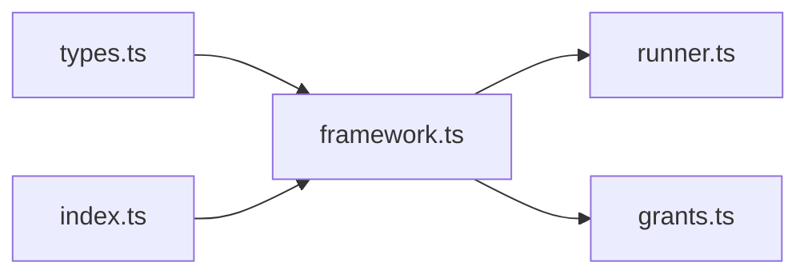

# 工具注册管理

<cite>
**本文引用的文件**
- [framework.ts](file://packages/core/src/tool/framework.ts)
- [grants.ts](file://packages/core/src/tool/grants.ts)
- [runner.ts](file://packages/core/src/agent/runner.ts)
- [types.ts](file://packages/core/src/types.ts)
- [index.ts](file://packages/core/src/index.ts)
</cite>

## 目录
1. [简介](#简介)
2. [项目结构](#项目结构)
3. [核心组件](#核心组件)
4. [架构总览](#架构总览)
5. [详细组件分析](#详细组件分析)
6. [依赖关系分析](#依赖关系分析)
7. [性能考量](#性能考量)
8. [故障排查指南](#故障排查指南)
9. [结论](#结论)
10. [附录](#附录)

## 简介
本文件系统性介绍 ToolRegistry 类的设计与使用，覆盖工具的注册、获取、列表查询、注销等生命周期操作；解释运行时工具添加机制（runtimeAdded）的作用与应用场景；阐述名称冲突检测与防重复注册机制；说明如何将工具集合转换为 LLM 适配器所需格式（toToolDefs、toLLMTools）；并提供最佳实践示例模式（批量注册、条件注册、动态工具管理等）；最后解释工具依赖注入与上下文传递机制。

## 项目结构
围绕工具注册的核心代码主要位于 core 包的 tool 层与 agent 运行器：
- 工具定义与注册中心：packages/core/src/tool/framework.ts
- 工具授权与白名单/黑名单解析：packages/core/src/tool/grants.ts
- 运行期工具解析与执行上下文构建：packages/core/src/agent/runner.ts
- 公共类型与上下文定义：packages/core/src/types.ts
- 对外导出入口：packages/core/src/index.ts



图表来源
- [framework.ts:127-260](file://packages/core/src/tool/framework.ts#L127-L260)
- [grants.ts:35-89](file://packages/core/src/tool/grants.ts#L35-L89)
- [runner.ts:817-827](file://packages/core/src/agent/runner.ts#L817-L827)
- [types.ts:511-583](file://packages/core/src/types.ts#L511-L583)
- [index.ts:165](file://packages/core/src/index.ts#L165)

章节来源
- [framework.ts:127-260](file://packages/core/src/tool/framework.ts#L127-L260)
- [grants.ts:35-89](file://packages/core/src/tool/grants.ts#L35-L89)
- [runner.ts:817-827](file://packages/core/src/agent/runner.ts#L817-L827)
- [types.ts:511-583](file://packages/core/src/types.ts#L511-L583)
- [index.ts:165](file://packages/core/src/index.ts#L165)

## 核心组件
- ToolRegistry：维护工具集合，提供注册、查询、列出、注销、转换到 LLM 适配器的能力。
- defineTool：声明式创建工具定义，支持输入校验、输出校验、最大输出长度控制、自定义 LLM Schema 等。
- resolveGrantedToolDefinitions：根据预设、白名单、黑名单和框架安全策略，计算当前 Agent 实际可用的工具集合。
- ToolUseContext：工具执行时注入的上下文，包含调用方 Agent 信息、团队上下文、取消信号、工作目录、元数据、任务/运行 ID、凭据等。

章节来源
- [framework.ts:71-117](file://packages/core/src/tool/framework.ts#L71-L117)
- [framework.ts:127-260](file://packages/core/src/tool/framework.ts#L127-L260)
- [grants.ts:35-89](file://packages/core/src/tool/grants.ts#L35-L89)
- [types.ts:511-583](file://packages/core/src/types.ts#L511-L583)

## 架构总览
ToolRegistry 作为“工具注册中心”，在 AgentRunner 启动前被填充工具，并在每次 LLM 调用前通过 resolveTools 计算最终可用工具集，再转换为 LLM 适配器所需的定义格式。



图表来源
- [framework.ts:137-151](file://packages/core/src/tool/framework.ts#L137-L151)
- [framework.ts:204-222](file://packages/core/src/tool/framework.ts#L204-L222)
- [grants.ts:35-89](file://packages/core/src/tool/grants.ts#L35-L89)
- [runner.ts:817-827](file://packages/core/src/agent/runner.ts#L817-L827)

## 详细组件分析

### ToolRegistry 设计与实现
- 内部存储
  - tools：Map<name, ToolDefinition>，保存所有已注册工具。
  - runtimeToolNames：Set<string>，记录通过 runtimeAdded 标记的动态工具名。
- 生命周期方法
  - register(tool, options?)：注册工具，若同名已存在则抛出错误，防止静默覆盖；当 options.runtimeAdded 为 true 时，将工具名加入 runtimeToolNames。
  - get(name)：按名称获取工具定义。
  - list()/getAll()：返回全部工具定义的数组。
  - has(name)：判断是否已注册。
  - unregister(name)/deregister(name)：移除工具，同时清理 runtimeToolNames。
- 转换方法
  - toToolDefs()：将所有工具转为 LLMToolDef[]，优先使用 llmInputSchema，否则通过 zodToJsonSchema 将 Zod schema 转为 JSON Schema。
  - toRuntimeToolDefs()：仅返回运行时动态添加的工具定义（用于审计或二次处理）。
  - toLLMTools()：转换为 Anthropic 风格的 input_schema 对象，便于直接构造 API 负载。

```mermaid
classDiagram
class ToolRegistry {
- Map~string, ToolDefinition~ tools
- Set~string~ runtimeToolNames
+ register(tool, options) void
+ get(name) ToolDefinition|undefined
+ list() ToolDefinition[]
+ getAll() ToolDefinition[]
+ has(name) boolean
+ unregister(name) void
+ deregister(name) void
+ toToolDefs() LLMToolDef[]
+ toRuntimeToolDefs() LLMToolDef[]
+ toLLMTools() {name, description, input_schema}[]
}
```

图表来源
- [framework.ts:127-260](file://packages/core/src/tool/framework.ts#L127-L260)

章节来源
- [framework.ts:127-260](file://packages/core/src/tool/framework.ts#L127-L260)

### 工具定义与转换：defineTool 与 zodToJsonSchema
- defineTool：统一入口，接收 name、description、inputSchema、可选 consequential、outputSchema、llmInputSchema、maxOutputChars、execute。返回 ToolDefinition。
- zodToJsonSchema：将 Zod schema 递归转换为 JSON Schema，支持基础类型、对象、数组、联合、判别联合、交集、可选/可空/默认值、枚举、字面量、记录、元组等，未知类型回退为空对象以兼容 JSON Schema。



图表来源
- [framework.ts:204-214](file://packages/core/src/tool/framework.ts#L204-L214)
- [framework.ts:279-491](file://packages/core/src/tool/framework.ts#L279-L491)

章节来源
- [framework.ts:71-117](file://packages/core/src/tool/framework.ts#L71-L117)
- [framework.ts:204-214](file://packages/core/src/tool/framework.ts#L204-L214)
- [framework.ts:279-491](file://packages/core/src/tool/framework.ts#L279-L491)

### 运行时工具添加机制（runtimeAdded）
- 作用
  - 区分“静态注册”与“运行时动态注册”的工具。
  - 在授权阶段，运行时工具默认始终可用（除非显式列入 disallowedTools），而静态工具需通过 toolPreset 或 allowedTools 明确授予。
- 应用场景
  - 插件化扩展：在运行时按需加载第三方工具。
  - 会话级能力：基于用户身份或会话状态动态启用特定工具。
  - 多租户隔离：不同租户动态挂载专属工具。
- 实现要点
  - register(tool, { runtimeAdded: true }) 将工具名加入 runtimeToolNames。
  - resolveGrantedToolDefinitions 会单独处理运行时工具，确保其默认授予，但允许黑名单过滤。



图表来源
- [framework.ts:137-151](file://packages/core/src/tool/framework.ts#L137-L151)
- [grants.ts:59-88](file://packages/core/src/tool/grants.ts#L59-L88)

章节来源
- [framework.ts:137-151](file://packages/core/src/tool/framework.ts#L137-L151)
- [grants.ts:59-88](file://packages/core/src/tool/grants.ts#L59-L88)

### 工具名称冲突检测与防重复注册
- 机制
  - register 中检查 tools.has(tool.name)，若已存在则抛出错误，提示使用唯一名称或先注销已有工具。
- 影响
  - 避免覆盖导致的行为不一致或安全漏洞。
  - 强制开发者显式管理工具命名空间。

章节来源
- [framework.ts:137-151](file://packages/core/src/tool/framework.ts#L137-L151)

### 工具授权与最终可用集合
- 流程
  - 从 registry.list() 获取全部工具。
  - 分离运行时工具与静态工具。
  - 对静态工具应用 toolPreset、allowedTools、disallowedTools 以及框架禁用清单。
  - 对运行时工具应用 disallowedTools（如配置了）。
  - 合并得到最终授予的工具集合。
- 返回值
  - 返回 ToolDefinition[]，供后续转换为 LLMToolDef[] 或直接使用。



图表来源
- [grants.ts:59-88](file://packages/core/src/tool/grants.ts#L59-L88)

章节来源
- [grants.ts:59-88](file://packages/core/src/tool/grants.ts#L59-L88)

### 将工具集合转换为 LLM 适配器格式
- toToolDefs()
  - 生成 LLMToolDef[]，字段包括 name、description、inputSchema（JSON Schema）。
  - 优先使用 llmInputSchema，否则由 zodToJsonSchema 转换。
- toLLMTools()
  - 生成 Anthropic 风格的结构：{ name, description, input_schema: { type: 'object', properties?, required? } }。
  - 若定义了 llmInputSchema，则包装为 object 并合并属性。



图表来源
- [framework.ts:204-214](file://packages/core/src/tool/framework.ts#L204-L214)
- [framework.ts:229-260](file://packages/core/src/tool/framework.ts#L229-L260)
- [framework.ts:279-491](file://packages/core/src/tool/framework.ts#L279-L491)

章节来源
- [framework.ts:204-214](file://packages/core/src/tool/framework.ts#L204-L214)
- [framework.ts:229-260](file://packages/core/src/tool/framework.ts#L229-L260)
- [framework.ts:279-491](file://packages/core/src/tool/framework.ts#L279-L491)

### 工具依赖注入与上下文传递
- 上下文来源
  - AgentRunner 在每个工具调用前构建 ToolUseContext，包含：
    - agent：调用方 Agent 的名称、角色、模型。
    - team：多 Agent 团队上下文（可选）。
    - abortSignal/abortController：取消控制。
    - cwd：文件系统沙箱根目录。
    - metadata：任意元数据（如会话 ID、请求 ID）。
    - runId/taskId/toolCallId：追踪与幂等键。
    - credentials：按 Agent 隔离的凭据（如 API Key）。
- 注入方式
  - 工具 execute(input, context) 接收 ToolUseContext，从而读取凭据、工作目录、取消信号等。
- 安全与隔离
  - credentials 来自 AgentConfig，每个 Agent 仅持有自身凭据，避免跨 Agent 泄露。
  - 敏感字段在观测系统中自动脱敏。



图表来源
- [runner.ts:1796-1810](file://packages/core/src/agent/runner.ts#L1796-L1810)
- [types.ts:511-583](file://packages/core/src/types.ts#L511-L583)

章节来源
- [runner.ts:1796-1810](file://packages/core/src/agent/runner.ts#L1796-L1810)
- [types.ts:511-583](file://packages/core/src/types.ts#L511-L583)

### 最佳实践与使用模式
以下为常见模式的实践建议（以步骤形式描述，避免粘贴具体代码）：
- 批量注册
  - 准备一组 ToolDefinition，遍历调用 registry.register(tool)。
  - 如需区分运行时工具，可为需要动态启用的工具传入 { runtimeAdded: true }。
  - 参考路径：[framework.ts:137-151](file://packages/core/src/tool/framework.ts#L137-L151)
- 条件注册
  - 根据环境变量、配置或运行时状态决定是否注册某工具。
  - 例如：仅在开启某个功能开关时注册对应工具。
  - 参考路径：[framework.ts:137-151](file://packages/core/src/tool/framework.ts#L137-L151)
- 动态工具管理
  - 使用 runtimeAdded 标记动态工具，以便在授权阶段默认授予。
  - 可在会话开始时按需注册，结束时注销。
  - 参考路径：[framework.ts:137-151](file://packages/core/src/tool/framework.ts#L137-L151), [grants.ts:59-88](file://packages/core/src/tool/grants.ts#L59-L88)
- 使用 toToolDefs/toLLMTools
  - 在构造 LLM 请求前，调用 registry.toToolDefs() 或 toLLMTools() 获取适配器所需格式。
  - 参考路径：[framework.ts:204-214](file://packages/core/src/tool/framework.ts#L204-L214), [framework.ts:229-260](file://packages/core/src/tool/framework.ts#L229-L260)
- 依赖注入与上下文
  - 在工具实现中通过 context.credentials 读取凭据，通过 context.cwd 限制文件访问范围，通过 context.abortSignal 响应取消。
  - 参考路径：[types.ts:511-583](file://packages/core/src/types.ts#L511-L583), [runner.ts:1796-1810](file://packages/core/src/agent/runner.ts#L1796-L1810)

章节来源
- [framework.ts:137-151](file://packages/core/src/tool/framework.ts#L137-L151)
- [framework.ts:204-214](file://packages/core/src/tool/framework.ts#L204-L214)
- [framework.ts:229-260](file://packages/core/src/tool/framework.ts#L229-L260)
- [grants.ts:59-88](file://packages/core/src/tool/grants.ts#L59-L88)
- [types.ts:511-583](file://packages/core/src/types.ts#L511-L583)
- [runner.ts:1796-1810](file://packages/core/src/agent/runner.ts#L1796-L1810)

## 依赖关系分析
- ToolRegistry 依赖 types 中的 ToolDefinition、ToolUseContext、LLMToolDef。
- AgentRunner 依赖 ToolRegistry 进行工具解析与执行上下文构建。
- grants 模块依赖 ToolRegistry 的 list() 与 toRuntimeToolDefs() 来计算授予集合。
- index.ts 将 ToolRegistry 暴露给外部使用者。



图表来源
- [framework.ts:127-260](file://packages/core/src/tool/framework.ts#L127-L260)
- [runner.ts:817-827](file://packages/core/src/agent/runner.ts#L817-L827)
- [grants.ts:35-89](file://packages/core/src/tool/grants.ts#L35-L89)
- [index.ts:165](file://packages/core/src/index.ts#L165)

章节来源
- [framework.ts:127-260](file://packages/core/src/tool/framework.ts#L127-L260)
- [runner.ts:817-827](file://packages/core/src/agent/runner.ts#L817-L827)
- [grants.ts:35-89](file://packages/core/src/tool/grants.ts#L35-L89)
- [index.ts:165](file://packages/core/src/index.ts#L165)

## 性能考量
- 转换开销
  - toToolDefs 会在每次 LLM 调用前转换工具定义。若工具数量较多，建议缓存转换结果或在会话级别复用。
- 授权计算
  - resolveGrantedToolDefinitions 会遍历工具集合并进行多次过滤。建议在 Agent 初始化时确定授予集合，减少重复计算。
- 运行时工具
  - 动态工具默认授予，注意避免过多动态工具导致 LLM 上下文膨胀。

[本节为通用指导，无需引用具体文件]

## 故障排查指南
- 名称冲突
  - 现象：注册同名工具时抛出错误。
  - 处理：确保工具名唯一，或在注册前先注销已有工具。
  - 参考路径：[framework.ts:137-151](file://packages/core/src/tool/framework.ts#L137-L151)
- 工具未被授予
  - 现象：模型请求的工具无法执行。
  - 处理：检查 toolPreset、allowedTools、disallowedTools 配置；确认是否为运行时工具且未被黑名单排除。
  - 参考路径：[grants.ts:59-88](file://packages/core/src/tool/grants.ts#L59-L88)
- 上下文缺失
  - 现象：工具内无法读取凭据或工作目录。
  - 处理：确认 AgentRunner 已正确构建 ToolUseContext，并传入必要的 credentials、cwd 等。
  - 参考路径：[runner.ts:1796-1810](file://packages/core/src/agent/runner.ts#L1796-L1810), [types.ts:511-583](file://packages/core/src/types.ts#L511-L583)

章节来源
- [framework.ts:137-151](file://packages/core/src/tool/framework.ts#L137-L151)
- [grants.ts:59-88](file://packages/core/src/tool/grants.ts#L59-L88)
- [runner.ts:1796-1810](file://packages/core/src/agent/runner.ts#L1796-L1810)
- [types.ts:511-583](file://packages/core/src/types.ts#L511-L583)

## 结论
ToolRegistry 提供了健壮的工具注册与管理能力，结合 defineTool 与 zodToJsonSchema 实现了类型安全的工具定义与 LLM 适配。通过 runtimeAdded 机制，系统支持灵活的动态工具扩展与授权策略。配合 AgentRunner 的上下文注入，工具可以安全地访问凭据、工作目录与取消信号。遵循本文的最佳实践，可以在复杂的多 Agent 场景中可靠地管理工具生命周期与权限。

[本节为总结性内容，无需引用具体文件]

## 附录
- 常用接口速览
  - ToolRegistry.register：注册工具，支持 runtimeAdded 标记。
  - ToolRegistry.get/list/has/unregister：查询与管理工具。
  - ToolRegistry.toToolDefs/toLLMTools：转换为 LLM 适配器所需格式。
  - defineTool：声明工具定义，支持输入/输出校验与自定义 LLM Schema。
  - ToolUseContext：工具执行上下文，包含凭据、工作目录、取消信号等。

章节来源
- [framework.ts:71-117](file://packages/core/src/tool/framework.ts#L71-L117)
- [framework.ts:127-260](file://packages/core/src/tool/framework.ts#L127-L260)
- [types.ts:511-583](file://packages/core/src/types.ts#L511-L583)