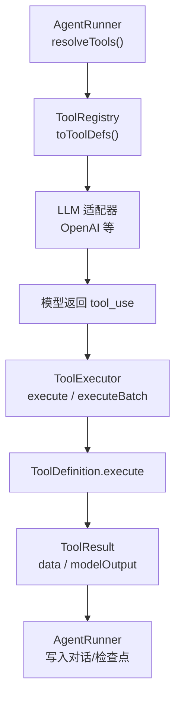
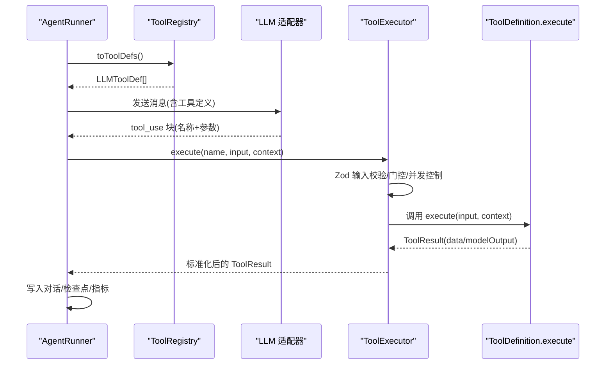
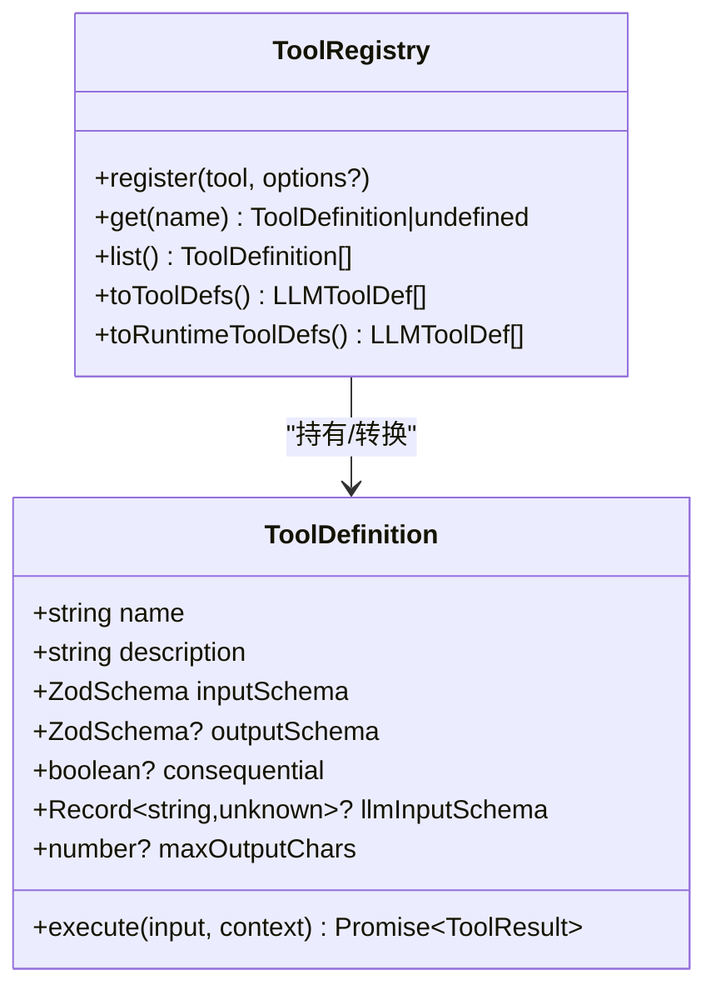
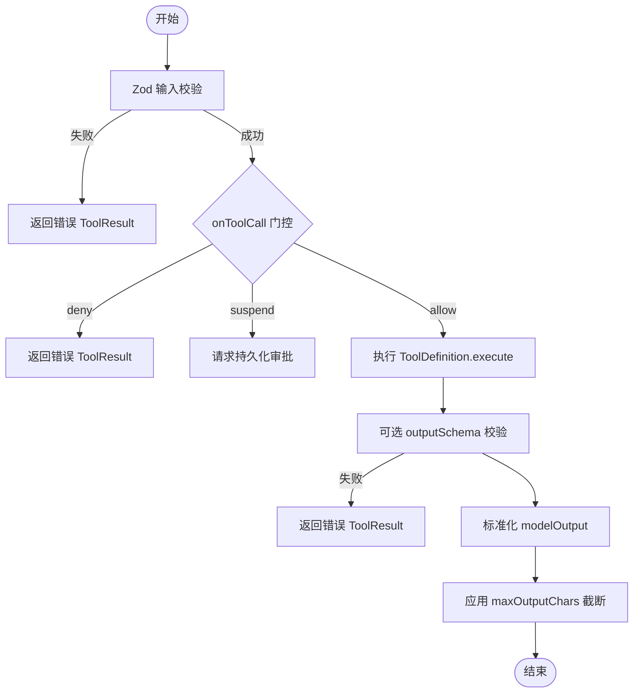
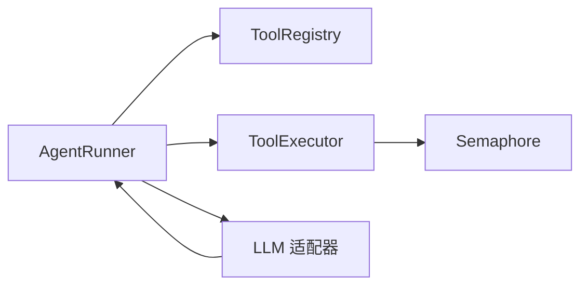

# 工具系统设计

<cite>
**本文引用的文件**
- [README.md](file://README.md)
- [tool-configuration.md](file://docs/tool-configuration.md)
- [packages/core/README.md](file://packages/core/README.md)
- [packages/core/src/index.ts](file://packages/core/src/index.ts)
- [packages/core/src/types.ts](file://packages/core/src/types.ts)
- [packages/core/src/tool/framework.ts](file://packages/core/src/tool/framework.ts)
- [packages/core/src/tool/executor.ts](file://packages/core/src/tool/executor.ts)
- [packages/core/src/tool/built-in/index.ts](file://packages/core/src/tool/built-in/index.ts)
- [packages/core/src/agent/runner.ts](file://packages/core/src/agent/runner.ts)
- [packages/core/src/llm/openai.ts](file://packages/core/src/llm/openai.ts)
</cite>

## 目录
1. [简介](#简介)
2. [项目结构](#项目结构)
3. [核心组件](#核心组件)
4. [架构总览](#架构总览)
5. [详细组件分析](#详细组件分析)
6. [依赖关系分析](#依赖关系分析)
7. [性能考量](#性能考量)
8. [故障排查指南](#故障排查指南)
9. [结论](#结论)
10. [附录](#附录)

## 简介
本文件系统性解析 Open Multi-Agent（OMA）工具系统的设计与实现，覆盖工具定义框架 ToolDefinition、执行流程（参数校验、安全沙箱、权限控制、结果处理）、内置工具集、自定义工具开发、元数据管理、版本控制、依赖注入机制，以及安全与性能最佳实践。内容基于仓库源码与文档进行提炼，确保技术细节准确且可操作。

## 项目结构
OMA 的工具系统位于 core 包中，围绕“定义—注册—授权—执行—输出”的完整链路组织：
- 定义层：ToolDefinition、defineTool、zodToJsonSchema
- 注册层：ToolRegistry（含运行时工具标记）
- 授权层：预设/白名单/黑名单/默认拒绝策略
- 执行层：ToolExecutor（并发控制、输入/输出校验、门控、截断、错误隔离）
- 集成层：AgentRunner 将 LLM 工具调用接入执行器；LLM 适配器负责流式工具调用拼装
- 内置工具：bash、file_read/write/edit、grep、glob、delegate_to_agent

图表来源
- [packages/core/src/agent/runner.ts:817-827](file://packages/core/src/agent/runner.ts#L817-L827)
- [packages/core/src/tool/framework.ts:204-214](file://packages/core/src/tool/framework.ts#L204-L214)
- [packages/core/src/llm/openai.ts:296-331](file://packages/core/src/llm/openai.ts#L296-L331)
- [packages/core/src/tool/executor.ts:112-164](file://packages/core/src/tool/executor.ts#L112-L164)

章节来源
- [packages/core/src/index.ts:162-180](file://packages/core/src/index.ts#L162-L180)
- [packages/core/src/agent/runner.ts:817-827](file://packages/core/src/agent/runner.ts#L817-L827)
- [packages/core/src/tool/framework.ts:127-261](file://packages/core/src/tool/framework.ts#L127-L261)
- [packages/core/src/tool/executor.ts:38-96](file://packages/core/src/tool/executor.ts#L38-L96)

## 核心组件
- ToolDefinition：描述工具名称、说明、输入 Schema、可选输出 Schema、是否具副作用、最大输出长度、执行函数及上下文。
- ToolRegistry：维护工具集合，提供 toToolDefs/toLLMTools 转换，支持运行时工具标记。
- ToolExecutor：统一执行入口，负责 Zod 输入校验、可选输出校验、并发限制、门控 onToolCall、持久化审批、结果截断与标准化。
- AgentRunner：根据预设/白名单/黑名单解析可用工具，驱动 LLM 循环，协调工具调用与结果回写。
- LLM 适配器：将模型流式输出的 tool_use 片段组装为结构化调用块。

章节来源
- [packages/core/src/tool/framework.ts:71-117](file://packages/core/src/tool/framework.ts#L71-L117)
- [packages/core/src/tool/framework.ts:127-261](file://packages/core/src/tool/framework.ts#L127-L261)
- [packages/core/src/tool/executor.ts:85-164](file://packages/core/src/tool/executor.ts#L85-L164)
- [packages/core/src/agent/runner.ts:817-827](file://packages/core/src/agent/runner.ts#L817-L827)
- [packages/core/src/llm/openai.ts:296-331](file://packages/core/src/llm/openai.ts#L296-L331)

## 架构总览
工具系统采用“声明式定义 + 集中注册 + 分层授权 + 安全执行”的架构：
- 定义：通过 defineTool 声明工具契约（输入/输出/副作用）。
- 注册：ToolRegistry 统一管理，避免重复命名冲突。
- 授权：默认拒绝，按 preset → allowlist → denylist 解析最终可用工具集。
- 执行：ToolExecutor 串行/并行执行，保证输入/输出类型安全，支持门控与持久化审批。
- 集成：AgentRunner 将工具能力暴露给 LLM，并处理结果到对话与检查点的落盘。

图表来源
- [packages/core/src/agent/runner.ts:817-827](file://packages/core/src/agent/runner.ts#L817-L827)
- [packages/core/src/tool/framework.ts:204-214](file://packages/core/src/tool/framework.ts#L204-L214)
- [packages/core/src/tool/executor.ts:112-164](file://packages/core/src/tool/executor.ts#L112-L164)
- [packages/core/src/llm/openai.ts:296-331](file://packages/core/src/llm/openai.ts#L296-L331)

## 详细组件分析

### 工具定义框架 ToolDefinition
- 字段与职责
  - name/description：工具标识与人类可读说明。
  - inputSchema：Zod Schema，用于强类型输入校验。
  - outputSchema（可选）：对 ToolResult.data 做二次校验，保障下游消费方契约。
  - consequential（可选）：标记具副作用工具，触发更严格的审批/确认策略。
  - llmInputSchema（可选）：直接指定 LLM 侧 JSON Schema，绕过自动转换。
  - maxOutputChars（可选）：单工具输出字符上限，优先于代理级配置。
  - execute：执行函数，接收已校验输入与 ToolUseContext，返回 ToolResult。
- 扩展方式
  - 通过 defineTool 创建新工具，注册到 ToolRegistry。
  - 使用 zodToJsonSchema 将 Zod Schema 转换为 LLM 所需的 JSON Schema。
  - 运行时动态添加工具（标记 runtimeAdded），便于插件化扩展。

图表来源
- [packages/core/src/tool/framework.ts:71-117](file://packages/core/src/tool/framework.ts#L71-L117)
- [packages/core/src/tool/framework.ts:127-261](file://packages/core/src/tool/framework.ts#L127-L261)

章节来源
- [packages/core/src/tool/framework.ts:71-117](file://packages/core/src/tool/framework.ts#L71-L117)
- [packages/core/src/tool/framework.ts:204-261](file://packages/core/src/tool/framework.ts#L204-L261)

### 工具执行流程（参数验证、安全沙箱、权限控制、结果处理）
- 参数验证
  - 使用 Zod 对输入进行严格校验，失败时返回结构化错误 ToolResult。
  - 支持可选的输出 Schema 校验，非错误结果在截断前进行二次验证。
- 安全沙箱
  - 文件系统工具（file_read/write/edit/grep/glob）受 cwd 沙箱约束，路径必须绝对且在根目录下解析。
  - bash 工具不受沙箱限制，需通过 disallowedTools 或 onToolCall 进行策略控制。
- 权限控制
  - 默认拒绝：未显式授予的工具不可用。
  - 三层解析：preset → tools（白名单）→ disallowedTools（黑名单）。
  - 每调用门控 onToolCall：可在执行前 allow/deny/suspend，支持持久化审批。
- 结果处理
  - 标准化 modelOutput：支持文本、图片、文件等多媒体内容，适配不同 Provider。
  - 输出截断：maxOutputChars 控制头部+尾部保留，避免对话膨胀。
  - 错误隔离：所有异常被捕获为 isError:true 的 ToolResult，不中断整体循环。

图表来源
- [packages/core/src/tool/executor.ts:181-338](file://packages/core/src/tool/executor.ts#L181-L338)
- [packages/core/src/tool/executor.ts:355-379](file://packages/core/src/tool/executor.ts#L355-L379)
- [docs/tool-configuration.md:391-441](file://docs/tool-configuration.md#L391-L441)

章节来源
- [packages/core/src/tool/executor.ts:181-338](file://packages/core/src/tool/executor.ts#L181-L338)
- [packages/core/src/tool/executor.ts:355-379](file://packages/core/src/tool/executor.ts#L355-L379)
- [docs/tool-configuration.md:391-441](file://docs/tool-configuration.md#L391-L441)

### 内置工具集与使用方法
- 内置工具
  - bash：执行 shell 命令（无沙箱，需谨慎授权）。
  - file_read/file_write/file_edit：受限路径的文件读写编辑。
  - grep/glob：文件搜索与模式匹配。
  - delegate_to_agent：团队内任务委派（需显式启用）。
- 注册与授予
  - registerBuiltInTools：批量注册内置工具到 ToolRegistry。
  - 通过 tools/toolPreset/disallowedTools 精确授予。
  - 默认拒绝：未授予的工具即使注册也不可用。
- 工作目录沙箱
  - defaultCwd/cwd：设置文件系统工具的根目录，支持 per-agent 覆盖。
  - 自动创建沙箱目录，避免越权访问宿主敏感路径。

章节来源
- [packages/core/src/tool/built-in/index.ts:1-75](file://packages/core/src/tool/built-in/index.ts#L1-L75)
- [docs/tool-configuration.md:214-250](file://docs/tool-configuration.md#L214-L250)
- [docs/tool-configuration.md:391-441](file://docs/tool-configuration.md#L391-L441)

### 自定义工具开发指南
- 定义工具
  - 使用 defineTool 声明 name/description/inputSchema/execute。
  - 可选 outputSchema 校验输出，consequential 标记副作用。
- 注册与授予
  - 通过 ToolRegistry.register 注册，或通过 customTools 注入。
  - 运行时 addTool 动态添加，始终可用但受 disallowedTools 限制。
- 凭据注入
  - 通过 AgentConfig.credentials 注入 per-agent 密钥，工具从 ToolUseContext.credentials 读取。
- 示例参考
  - 参见公开 API 导出与示例路径（如 rich-tool-results、risk-gated-bash）。

章节来源
- [packages/core/src/tool/framework.ts:71-117](file://packages/core/src/tool/framework.ts#L71-L117)
- [packages/core/src/index.ts:162-180](file://packages/core/src/index.ts#L162-L180)
- [docs/tool-configuration.md:443-506](file://docs/tool-configuration.md#L443-L506)

### 元数据管理、版本控制、依赖注入
- 元数据
  - ToolDefinition.description：面向模型的说明。
  - ToolUseContext.agent/team/runId/taskId/toolCallId：执行上下文中的身份与追踪信息。
  - ToolResult.metadata：门控/审批等元数据附加。
- 版本控制
  - 通过 ToolRegistry 的 register/unregister 管理生命周期。
  - 运行时工具标记（runtimeAdded）区分静态与动态工具。
- 依赖注入
  - ToolUseContext 注入 agent/team/abortSignal/credentials 等依赖。
  - AgentConfig.credentials 提供 per-agent 密钥注入。

章节来源
- [packages/core/src/types.ts:518-603](file://packages/core/src/types.ts#L518-L603)
- [packages/core/src/tool/framework.ts:127-192](file://packages/core/src/tool/framework.ts#L127-L192)
- [docs/tool-configuration.md:469-506](file://docs/tool-configuration.md#L469-L506)

### 代码示例（以路径引用代替具体代码）
- 定义与注册工具
  - 定义：[packages/core/src/tool/framework.ts:71-117](file://packages/core/src/tool/framework.ts#L71-L117)
  - 注册：[packages/core/src/tool/built-in/index.ts:64-75](file://packages/core/src/tool/built-in/index.ts#L64-L75)
- 授予与过滤
  - 预设/白名单/黑名单：[packages/core/src/agent/runner.ts:817-827](file://packages/core/src/agent/runner.ts#L817-L827)
  - 默认拒绝策略：[docs/tool-configuration.md:214-250](file://docs/tool-configuration.md#L214-L250)
- 执行与结果
  - 执行流程：[packages/core/src/tool/executor.ts:181-338](file://packages/core/src/tool/executor.ts#L181-L338)
  - 输出控制与多媒体：[docs/tool-configuration.md:507-648](file://docs/tool-configuration.md#L507-L648)

## 依赖关系分析
- 组件耦合
  - AgentRunner 依赖 ToolRegistry 获取可用工具定义，依赖 ToolExecutor 执行调用。
  - ToolExecutor 依赖 ToolRegistry 查找工具，依赖 Semaphore 控制并发。
  - LLM 适配器负责将模型流式响应转换为 tool_use 块，供 Runner 调度。
- 外部依赖
  - Zod：输入/输出 Schema 校验与 JSON Schema 转换。
  - Provider SDK：OpenAI/Anthropic/Gemini 等，影响 modelOutput 映射。
- 潜在循环
  - 当前设计无循环依赖；工具执行单向流向结果回写。

图表来源
- [packages/core/src/agent/runner.ts:817-827](file://packages/core/src/agent/runner.ts#L817-L827)
- [packages/core/src/tool/executor.ts:85-96](file://packages/core/src/tool/executor.ts#L85-L96)
- [packages/core/src/llm/openai.ts:296-331](file://packages/core/src/llm/openai.ts#L296-L331)

章节来源
- [packages/core/src/agent/runner.ts:817-827](file://packages/core/src/agent/runner.ts#L817-L827)
- [packages/core/src/tool/executor.ts:85-96](file://packages/core/src/tool/executor.ts#L85-L96)
- [packages/core/src/llm/openai.ts:296-331](file://packages/core/src/llm/openai.ts#L296-L331)

## 性能考量
- 并发控制
  - ToolExecutor 默认最大并发 4，可通过 maxConcurrency 调整，避免资源争用。
- 输出压缩
  - maxOutputChars 控制字符串输出大小；compressToolResults 可压缩历史结果，降低后续 token 成本。
- 上下文策略
  - 使用 contextStrategy 与 loopDetection 控制长对话与循环风险。
- Provider 差异
  - modelOutput 在不同 Provider 的映射可能带来额外开销，应谨慎选择 inline base64 与 URL 引用。

章节来源
- [packages/core/src/tool/executor.ts:38-55](file://packages/core/src/tool/executor.ts#L38-L55)
- [docs/tool-configuration.md:650-673](file://docs/tool-configuration.md#L650-L673)
- [packages/core/README.md:288-308](file://packages/core/README.md#L288-L308)

## 故障排查指南
- 常见错误
  - 工具未注册：返回 ToolResult 错误，提示未找到工具。
  - 输入校验失败：Zod issuesMessage 列出具体字段问题。
  - 输出校验失败：outputSchema 不满足时报错。
  - 门控拒绝：onToolCall 返回 deny 或 suspend，附带 reason。
  - 沙箱越界：文件系统工具路径不在 cwd 下被拒绝。
- 诊断建议
  - 检查工具名与注册状态。
  - 查看 onToolCall 决策与 reason。
  - 确认 cwd/defaultCwd 配置是否正确。
  - 审查 outputSchema 与实际返回结构。

章节来源
- [packages/core/src/tool/executor.ts:112-133](file://packages/core/src/tool/executor.ts#L112-L133)
- [packages/core/src/tool/executor.ts:181-238](file://packages/core/src/tool/executor.ts#L181-L238)
- [docs/tool-configuration.md:391-441](file://docs/tool-configuration.md#L391-L441)

## 结论
OMA 工具系统以强类型定义、默认拒绝的权限模型、安全的执行环境与灵活的输出控制为核心，提供了可扩展、可审计、可恢复的工具执行框架。通过 ToolDefinition、ToolRegistry、ToolExecutor 与 AgentRunner 的协作，既能满足生产环境的安全与性能要求，又保持了良好的扩展性与可观测性。

## 附录
- 快速开始与示例
  - 项目概览与安装：[README.md:48-98](file://README.md#L48-L98)
  - Core 包指南与示例索引：[packages/core/README.md:57-111](file://packages/core/README.md#L57-L111)
- 工具配置与安全
  - 工具配置与沙箱：[docs/tool-configuration.md:214-441](file://docs/tool-configuration.md#L214-L441)
  - 输出控制与多媒体：[docs/tool-configuration.md:507-648](file://docs/tool-configuration.md#L507-L648)
- 类型与上下文
  - 工具上下文与门控类型：[packages/core/src/types.ts:518-618](file://packages/core/src/types.ts#L518-L618)