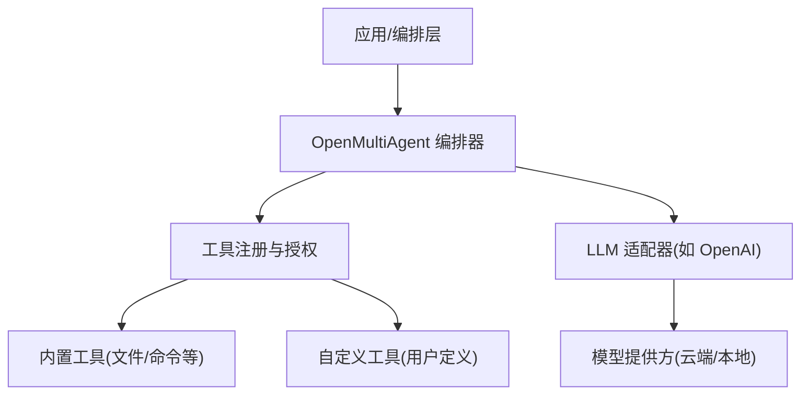
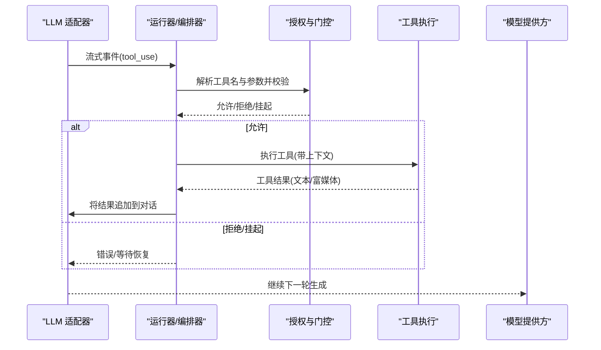
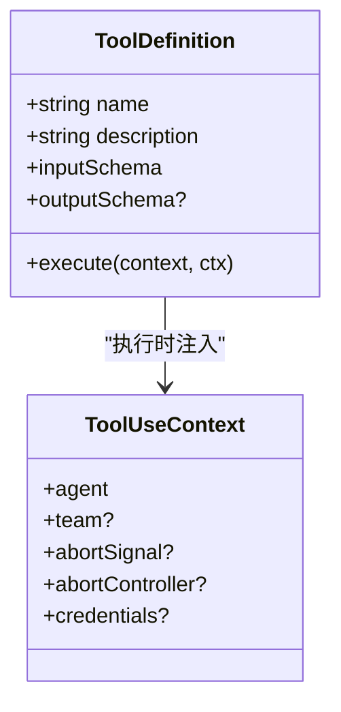
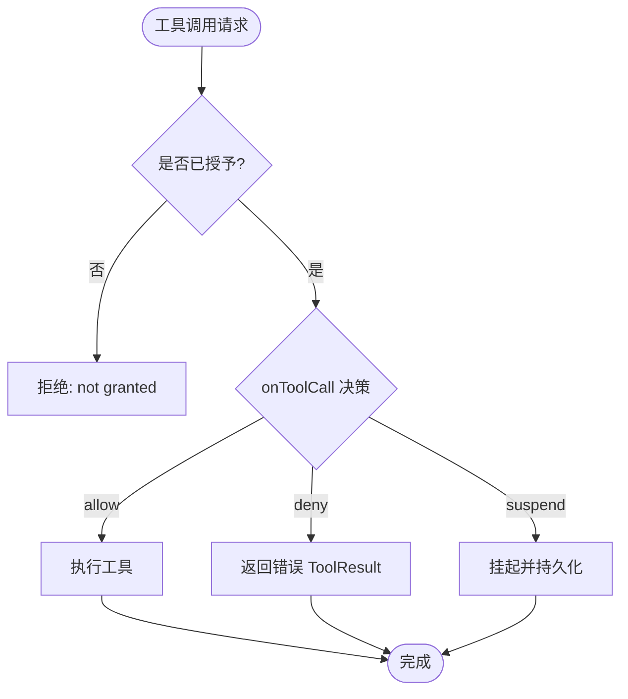

# 自定义工具开发

<cite>
**本文引用的文件**
- [README.md](file://README.md)
- [packages/core/README.md](file://packages/core/README.md)
- [docs/tool-configuration.md](file://docs/tool-configuration.md)
- [docs/providers.md](file://docs/providers.md)
- [packages/core/src/types.ts](file://packages/core/src/types.ts)
- [packages/core/src/llm/openai.ts](file://packages/core/src/llm/openai.ts)
- [packages/core/examples/patterns/rich-tool-results.ts](file://packages/core/examples/patterns/rich-tool-results.ts)
- [packages/core/examples/patterns/risk-gated-bash.ts](file://packages/core/examples/patterns/risk-gated-bash.ts)
</cite>

## 目录
1. [简介](#简介)
2. [项目结构](#项目结构)
3. [核心组件](#核心组件)
4. [架构总览](#架构总览)
5. [详细组件分析](#详细组件分析)
6. [依赖关系分析](#依赖关系分析)
7. [性能考虑](#性能考虑)
8. [故障排查指南](#故障排查指南)
9. [结论](#结论)
10. [附录](#附录)

## 简介
本指南面向希望在 Open Multi-Agent（OMA）中从零开始创建“自定义工具”的开发者，覆盖从需求分析、接口设计、实现与注册、权限与安全、测试验证到生产部署与监控的全流程。文档基于仓库中的官方文档与示例，提供可操作的实践路径与最佳实践建议，帮助你在多智能体编排中安全、可控地扩展工具能力。

## 项目结构
- 顶层 README 提供了项目定位、快速开始与生态概览。
- Core 包是编排运行时、工具框架、记忆、检查点、观测与 CLI 的核心。
- docs 包含工具配置、提供者、可观测性等专题文档。
- examples 提供可运行的脚本，涵盖基础用法、模式、集成与生产示例。

图表来源
- [packages/core/README.md:49-111](file://packages/core/README.md#L49-L111)
- [docs/tool-configuration.md:214-239](file://docs/tool-configuration.md#L214-L239)

章节来源
- [README.md:46-108](file://README.md#L46-L108)
- [packages/core/README.md:49-111](file://packages/core/README.md#L49-L111)

## 核心组件
- 工具定义与执行上下文：通过统一的工具定义与上下文注入，使工具具备类型安全的输入输出、可观测性与生命周期控制。
- 工具授权与白名单/黑名单：默认拒绝策略，显式授予内置工具；自定义工具在注册时即视为已授权但仍受全局禁用列表约束。
- 每调用门控 onToolCall：在输入校验后、执行前进行细粒度审批或拦截，支持挂起、恢复与人类审批。
- 文件系统沙箱：内置文件工具限制在工作目录内，bash 不沙箱化，需进程级隔离保障。
- 结果富媒体与压缩：支持图片/文件等多模态返回，并提供输出长度控制与旧结果压缩以节省上下文。

章节来源
- [docs/tool-configuration.md:214-239](file://docs/tool-configuration.md#L214-L239)
- [docs/tool-configuration.md:326-363](file://docs/tool-configuration.md#L326-L363)
- [docs/tool-configuration.md:391-441](file://docs/tool-configuration.md#L391-L441)
- [docs/tool-configuration.md:507-673](file://docs/tool-configuration.md#L507-L673)
- [packages/core/src/types.ts:518-546](file://packages/core/src/types.ts#L518-L546)

## 架构总览
下图展示了从 LLM 流式响应到工具调用、再到执行与结果回传的完整链路，以及门控与授权在其中的位置。

图表来源
- [packages/core/src/llm/openai.ts:296-331](file://packages/core/src/llm/openai.ts#L296-L331)
- [packages/core/src/types.ts:511-516](file://packages/core/src/types.ts#L511-L516)
- [docs/tool-configuration.md:326-363](file://docs/tool-configuration.md#L326-L363)

## 详细组件分析

### 工具定义与接口设计
- 使用 defineTool 声明工具名称、描述、输入 Schema（Zod）、可选输出 Schema 与 execute 函数。
- 输入由 Zod 严格校验，确保类型安全与边界防护。
- 输出可通过 data（应用侧保留）与 modelOutput（发送给模型的富媒体内容）分离，避免敏感数据泄露。
- 工具上下文 ToolUseContext 提供 agent/team、中止信号、凭据与作用域信息，便于资源管理与审计。

图表来源
- [packages/core/src/types.ts:511-516](file://packages/core/src/types.ts#L511-L516)
- [packages/core/src/types.ts:518-546](file://packages/core/src/types.ts#L518-L546)

章节来源
- [docs/tool-configuration.md:443-467](file://docs/tool-configuration.md#L443-L467)
- [packages/core/examples/patterns/rich-tool-results.ts:23-51](file://packages/core/examples/patterns/rich-tool-results.ts#L23-L51)

### 授权与访问控制
- 内置工具默认拒绝，必须通过 tools 或 toolPreset 显式授予。
- 自定义工具在注册时即视为已授权，但仍受 disallowedTools 约束。
- 支持预设（readonly/readwrite/full）、白名单与黑名单组合，精确控制可用工具集合。
- 对具有副作用的工具可标记 consequential，触发额外确认或治理策略。

图表来源
- [docs/tool-configuration.md:214-239](file://docs/tool-configuration.md#L214-L239)
- [docs/tool-configuration.md:326-363](file://docs/tool-configuration.md#L326-L363)

章节来源
- [docs/tool-configuration.md:251-289](file://docs/tool-configuration.md#L251-L289)
- [docs/tool-configuration.md:140-183](file://docs/tool-configuration.md#L140-L183)

### 安全与沙箱
- 文件系统工具限制在 per-agent 工作目录下，绝对路径与符号链接均会校验，防止越权访问。
- bash 不沙箱化，仅做进程组隔离；如需真正隔离请使用容器/VM/seccomp。
- 风险分类器 classifyBashCommand 可将命令分为 safe/review/high，配合 onToolCall 实现自动放行、人工审核或拒绝。
- 凭据按 Agent 作用域传递，避免共享密钥泄露；凭据键在追踪中被自动脱敏。

章节来源
- [docs/tool-configuration.md:391-441](file://docs/tool-configuration.md#L391-L441)
- [docs/tool-configuration.md:364-390](file://docs/tool-configuration.md#L364-L390)
- [docs/tool-configuration.md:469-505](file://docs/tool-configuration.md#L469-L505)

### 结果富媒体与输出控制
- 支持 text/image/file 等富媒体返回，适配不同提供商的传输格式。
- 通过 maxToolOutputChars 控制单条工具输出长度；compressToolResults 对已消费结果进行压缩，降低后续 token 成本。
- 应用侧 data 与模型可见 modelOutput 分离，避免敏感数据进入对话。

章节来源
- [docs/tool-configuration.md:507-673](file://docs/tool-configuration.md#L507-L673)
- [packages/core/examples/patterns/rich-tool-results.ts:23-51](file://packages/core/examples/patterns/rich-tool-results.ts#L23-L51)

### 典型开发模式与示例
- API 调用工具：封装外部服务调用，使用 Zod 校验输入，返回结构化数据；必要时通过 credentials 注入密钥。
- 数据处理工具：读取/转换/聚合数据，结合富媒体输出向模型展示图表或文件预览。
- 业务逻辑工具：封装复杂业务流程，结合 consequential 与 onToolCall 实现审批与合规。
- 风险门禁 bash：使用 classifyBashCommand 与 onToolCall 实现命令级风控。

章节来源
- [packages/core/examples/patterns/rich-tool-results.ts:1-70](file://packages/core/examples/patterns/rich-tool-results.ts#L1-L70)
- [packages/core/examples/patterns/risk-gated-bash.ts:1-95](file://packages/core/examples/patterns/risk-gated-bash.ts#L1-L95)
- [docs/tool-configuration.md:443-467](file://docs/tool-configuration.md#L443-L467)

## 依赖关系分析
- 工具定义依赖输入/输出 Schema 校验（Zod），保证契约稳定。
- 运行器依赖授权模块决定工具可达性，再经 onToolCall 门控决定是否执行。
- LLM 适配器负责将工具调用以流式事件形式下发给运行器，并在完成后将结果回写对话。
- 提供商无关的预算与治理策略可与工具执行组合，形成端到端的安全与成本控制。

图表来源
- [packages/core/src/types.ts:511-516](file://packages/core/src/types.ts#L511-L516)
- [packages/core/src/llm/openai.ts:296-331](file://packages/core/src/llm/openai.ts#L296-L331)
- [docs/tool-configuration.md:214-239](file://docs/tool-configuration.md#L214-L239)

章节来源
- [docs/tool-configuration.md:214-239](file://docs/tool-configuration.md#L214-L239)
- [packages/core/src/llm/openai.ts:296-331](file://packages/core/src/llm/openai.ts#L296-L331)

## 性能考虑
- 缓存策略：对外部 API 或计算密集型操作引入结果缓存（应用侧实现），减少重复调用与网络开销。
- 并发控制：利用任务 DAG 并行执行独立子任务；对共享资源加锁或限流，避免争用。
- 内存管理：控制工具输出大小，启用 compressToolResults；富媒体优先使用 URL 引用而非内联 base64，降低消息体积。
- 预算与成本：设置 maxTokenBudget/maxCostBudget，结合 estimateCost 实现成本上限；必要时降级为轻量模型或简化计划。
- 流式处理：利用流式事件尽早消费中间结果，提升交互体验与吞吐。

[本节为通用指导，不直接分析具体文件]

## 故障排查指南
- 工具未执行：检查是否已授予（tools/toolPreset），自定义工具需在 customTools 中注册；被 disallowedTools 禁止也会失败。
- 输入校验失败：确认 inputSchema 与实际传入参数一致；查看 onToolCall 的输入上下文。
- 输出过大导致成本飙升：调整 maxToolOutputChars 或启用 compressToolResults；富媒体改用 URL 引用。
- 命令被拒绝：使用 classifyBashCommand 预判风险级别；在 onToolCall 中实现 review 流程或收紧策略。
- 凭据问题：确认 AgentConfig.credentials 是否正确注入；注意凭据在追踪中会被脱敏。

章节来源
- [docs/tool-configuration.md:214-239](file://docs/tool-configuration.md#L214-L239)
- [docs/tool-configuration.md:326-363](file://docs/tool-configuration.md#L326-L363)
- [docs/tool-configuration.md:391-441](file://docs/tool-configuration.md#L391-L441)
- [docs/tool-configuration.md:507-673](file://docs/tool-configuration.md#L507-L673)

## 结论
通过 OMA 的工具框架，你可以以类型安全、可观测、可治理的方式扩展智能体的能力。遵循默认拒绝、最小权限、沙箱隔离与门控审批的原则，结合富媒体输出与预算控制，能够在保证安全与成本的前提下构建高质量的多智能体工作流。示例与文档提供了从简单到复杂的多种模式，便于按需复用与演进。

[本节为总结性内容，不直接分析具体文件]

## 附录

### 从零到一：自定义工具开发清单
- 需求分析：明确工具职责、输入输出、副作用与风险等级。
- 接口设计：定义 Zod Schema（input/output），编写 describe 与 execute。
- 实现与注册：在 customTools 中注册；如需团队统一接入，可在编排器层面集中配置。
- 授权与门控：配置 tools/toolPreset/disallowedTools；实现 onToolCall 进行审批与风控。
- 安全与沙箱：尽量使用文件系统沙箱；对 bash 使用风险分类器与人类审批。
- 测试验证：使用示例模式（rich-tool-results、risk-gated-bash）验证富媒体与门禁；构造边界用例与异常路径。
- 文档与版本：为工具编写使用说明、Schema 变更日志与兼容性说明；在 catalog 或示例索引中标注能力标签。
- 生产部署：设置预算上限、超时与重试；开启观测与追踪；对高风险工具启用强制审批与审计。

章节来源
- [packages/core/examples/patterns/rich-tool-results.ts:1-70](file://packages/core/examples/patterns/rich-tool-results.ts#L1-L70)
- [packages/core/examples/patterns/risk-gated-bash.ts:1-95](file://packages/core/examples/patterns/risk-gated-bash.ts#L1-L95)
- [docs/tool-configuration.md:214-239](file://docs/tool-configuration.md#L214-L239)
- [docs/tool-configuration.md:326-363](file://docs/tool-configuration.md#L326-L363)
- [docs/tool-configuration.md:507-673](file://docs/tool-configuration.md#L507-L673)