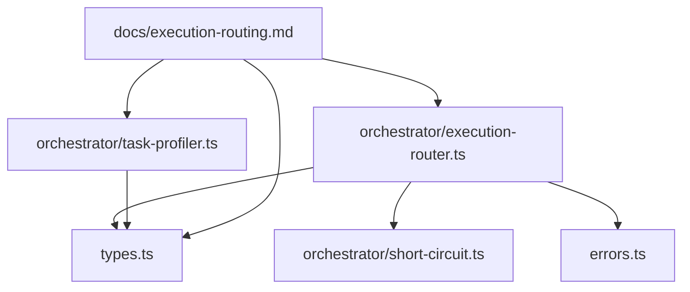
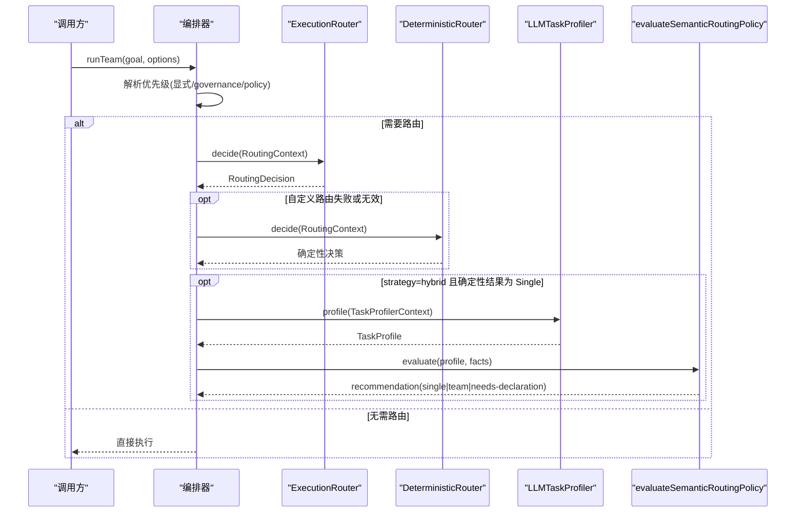
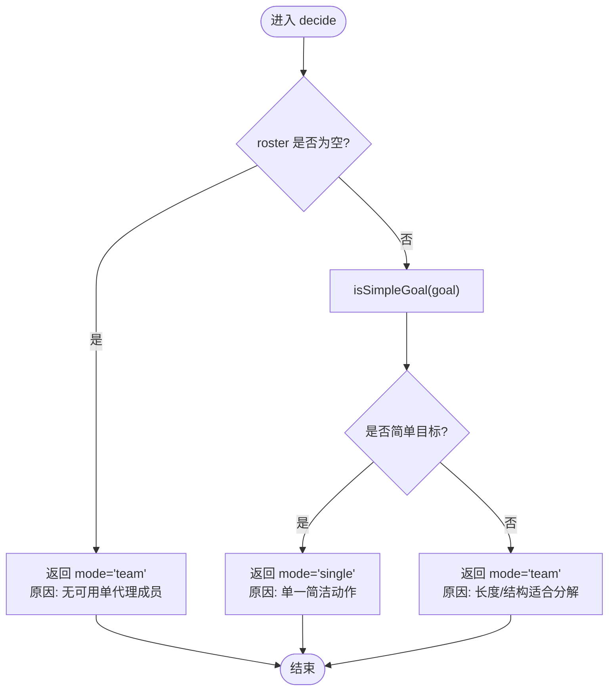
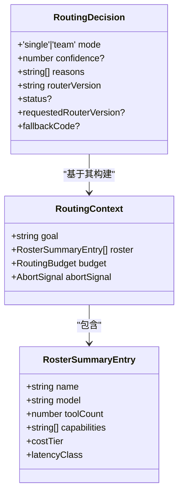
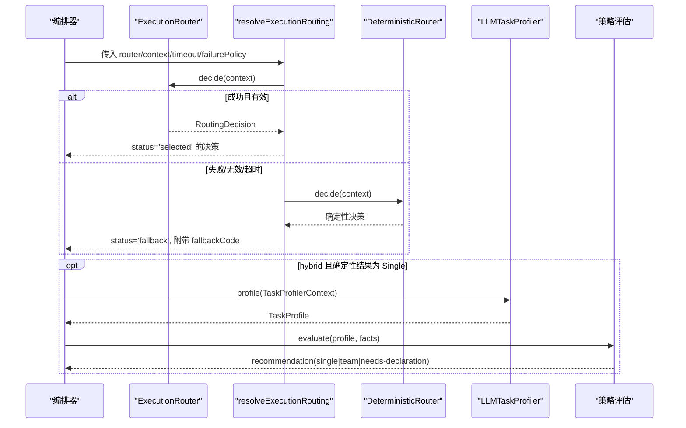
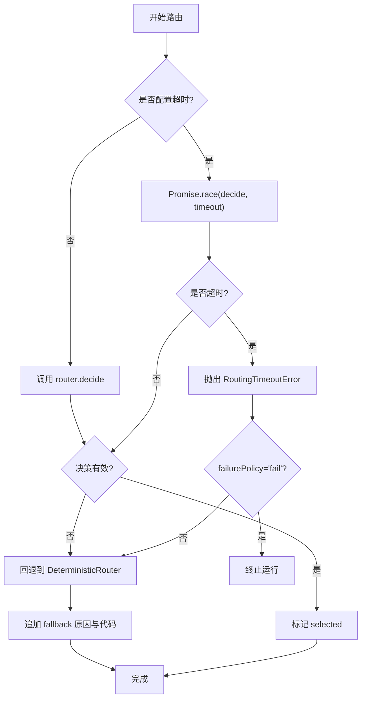
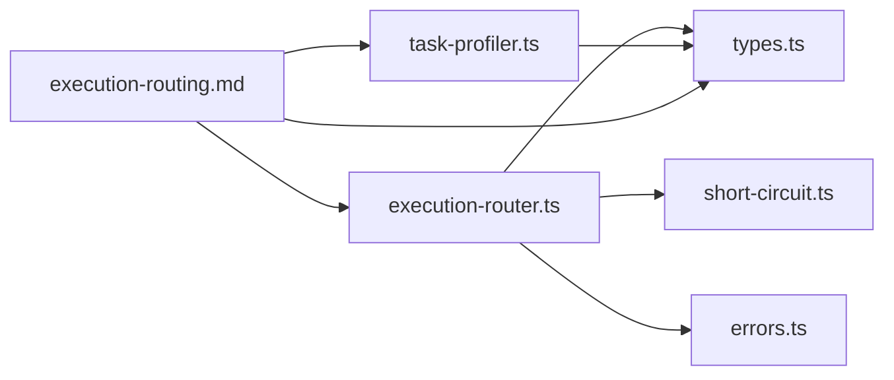

# 执行路由器核心

<cite>
**本文引用的文件**
- [execution-router.ts](file://packages/core/src/orchestrator/execution-router.ts)
- [short-circuit.ts](file://packages/core/src/orchestrator/short-circuit.ts)
- [task-profiler.ts](file://packages/core/src/orchestrator/task-profiler.ts)
- [errors.ts](file://packages/core/src/errors.ts)
- [types.ts](file://packages/core/src/types.ts)
- [execution-routing.md](file://docs/execution-routing.md)
</cite>

## 目录
1. [简介](#简介)
2. [项目结构](#项目结构)
3. [核心组件](#核心组件)
4. [架构总览](#架构总览)
5. [详细组件分析](#详细组件分析)
6. [依赖关系分析](#依赖关系分析)
7. [性能考量](#性能考量)
8. [故障排查指南](#故障排查指南)
9. [结论](#结论)
10. [附录](#附录)

## 简介
本文件聚焦 Open Multi-Agent 的执行路由器核心实现，围绕 DeterministicRouter 的工作原理、ExecutionRouter 接口设计、路由决策生命周期（从上下文构建到最终决策）、超时与错误处理、回退机制，以及自定义路由器的开发与最佳实践进行系统化说明。同时给出内置路由策略的配置与使用方式，并覆盖混合语义路由下的任务画像与策略评估流程。

## 项目结构
执行路由相关代码集中在 orchestrator 子模块中，并通过 types 暴露统一契约，配合 errors 提供可观测的错误类型，文档位于 docs/execution-routing.md 用于对外说明。

图表来源
- [execution-router.ts:1-225](file://packages/core/src/orchestrator/execution-router.ts#L1-L225)
- [short-circuit.ts:1-180](file://packages/core/src/orchestrator/short-circuit.ts#L1-L180)
- [task-profiler.ts:1-278](file://packages/core/src/orchestrator/task-profiler.ts#L1-L278)
- [errors.ts:1-239](file://packages/core/src/errors.ts#L1-L239)
- [types.ts:1551-1728](file://packages/core/src/types.ts#L1551-L1728)
- [execution-routing.md:1-222](file://docs/execution-routing.md#L1-L222)

章节来源
- [execution-router.ts:1-225](file://packages/core/src/orchestrator/execution-router.ts#L1-L225)
- [types.ts:1551-1728](file://packages/core/src/types.ts#L1551-L1728)
- [execution-routing.md:1-222](file://docs/execution-routing.md#L1-L222)

## 核心组件
- ExecutionRouter 接口：定义路由器的最小契约，要求提供稳定版本标识与 decide 方法，输入为 RoutingContext，输出为 RoutingDecision。
- DeterministicRouter：内置确定性路由器，基于“简单目标”启发式选择 single/team。
- buildRoutingContext：将 AgentConfig 列表转换为隐私友好的 RosterSummaryEntry 集合，并携带预算与中止信号。
- resolveExecutionRouting：封装超时、校验、回退与失败策略，保证路由基础设施不导致运行失败。
- LLMTaskProfiler 与 evaluateSemanticRoutingPolicy：混合模式下的语义任务画像与确定性策略评估。

章节来源
- [types.ts:1551-1728](file://packages/core/src/types.ts#L1551-L1728)
- [execution-router.ts:49-71](file://packages/core/src/orchestrator/execution-router.ts#L49-L71)
- [execution-router.ts:78-119](file://packages/core/src/orchestrator/execution-router.ts#L78-L119)
- [execution-router.ts:186-224](file://packages/core/src/orchestrator/execution-router.ts#L186-L224)
- [task-profiler.ts:94-173](file://packages/core/src/orchestrator/task-profiler.ts#L94-L173)
- [task-profiler.ts:227-277](file://packages/core/src/orchestrator/task-profiler.ts#L227-L277)

## 架构总览
下图展示自动 runTeam() 的拓扑选择优先级与执行路径：显式模式 > 治理拓扑/降级策略 > per-run 自定义 router > 编排器默认 router > 内置 DeterministicRouter；当启用 hybrid 时，若确定性结果为 Single，则可能触发一次无工具调用的语义画像与策略评估。

图表来源
- [execution-routing.md:7-21](file://docs/execution-routing.md#L7-L21)
- [execution-router.ts:186-224](file://packages/core/src/orchestrator/execution-router.ts#L186-L224)
- [task-profiler.ts:94-173](file://packages/core/src/orchestrator/task-profiler.ts#L94-L173)
- [task-profiler.ts:227-277](file://packages/core/src/orchestrator/task-profiler.ts#L227-L277)

## 详细组件分析

### DeterministicRouter 工作原理
- 空名单保护：当 roster 为空时，强制选择 team，避免单代理路径不可用。
- 简单目标判定：通过 isSimpleGoal 判断是否可直接走 single；否则选择 team。
- 决策输出：包含 mode、reasons、routerVersion，必要时附加 confidence。

图表来源
- [execution-router.ts:49-71](file://packages/core/src/orchestrator/execution-router.ts#L49-L71)
- [short-circuit.ts:146-149](file://packages/core/src/orchestrator/short-circuit.ts#L146-L149)

章节来源
- [execution-router.ts:49-71](file://packages/core/src/orchestrator/execution-router.ts#L49-L71)
- [short-circuit.ts:146-149](file://packages/core/src/orchestrator/short-circuit.ts#L146-L149)

### 上下文构建与验证机制
- buildRoutingContext：将 AgentConfig 映射为 RosterSummaryEntry，仅暴露 name/model/toolCount/capabilities/costTier/latencyClass 等必要字段，屏蔽 systemPrompt、凭据等敏感信息；同时携带 budget 与 abortSignal。
- isValidDecision：对路由决策进行严格校验，包括 mode 合法性、single 模式下 roster 非空、routerVersion 匹配、reasons 为字符串数组、confidence 范围在 [0,1]。

图表来源
- [types.ts:1551-1610](file://packages/core/src/types.ts#L1551-L1610)
- [execution-router.ts:78-119](file://packages/core/src/orchestrator/execution-router.ts#L78-L119)
- [execution-router.ts:150-171](file://packages/core/src/orchestrator/execution-router.ts#L150-L171)

章节来源
- [execution-router.ts:78-119](file://packages/core/src/orchestrator/execution-router.ts#L78-L119)
- [execution-router.ts:150-171](file://packages/core/src/orchestrator/execution-router.ts#L150-L171)
- [types.ts:1551-1610](file://packages/core/src/types.ts#L1551-L1610)

### 路由决策生命周期与混合语义路由
- 生命周期：
  - 解析优先级：显式 mode > 治理拓扑/降级策略 > per-run router > 编排器 router > 内置 DeterministicRouter。
  - 构建 RoutingContext：聚合 goal、roster、budget、abortSignal。
  - 执行 decide：支持同步/异步，受 timeoutMs 限制。
  - 校验决策：通过 isValidDecision 确保契约合规。
  - 失败回退：根据 failurePolicy 决定 fallback 或直接抛出。
  - 混合模式：当 strategy=hybrid 且确定性结果为 Single 时，进行一次无工具调用的语义画像与策略评估，可能升级为 Team 或要求声明治理。
- 关键配置：
  - executionRouting.strategy：'deterministic' | 'hybrid'
  - executionRouting.timeoutMs：共享的 router/profiler 截止时间
  - executionRouting.failurePolicy：'fallback' | 'fail'
  - executionRouting.confidenceThreshold：语义置信度阈值

图表来源
- [execution-routing.md:7-21](file://docs/execution-routing.md#L7-L21)
- [execution-router.ts:127-148](file://packages/core/src/orchestrator/execution-router.ts#L127-L148)
- [execution-router.ts:186-224](file://packages/core/src/orchestrator/execution-router.ts#L186-L224)
- [task-profiler.ts:94-173](file://packages/core/src/orchestrator/task-profiler.ts#L94-L173)
- [task-profiler.ts:227-277](file://packages/core/src/orchestrator/task-profiler.ts#L227-L277)

章节来源
- [execution-routing.md:7-21](file://docs/execution-routing.md#L7-L21)
- [execution-router.ts:127-148](file://packages/core/src/orchestrator/execution-router.ts#L127-L148)
- [execution-router.ts:186-224](file://packages/core/src/orchestrator/execution-router.ts#L186-L224)
- [task-profiler.ts:94-173](file://packages/core/src/orchestrator/task-profiler.ts#L94-L173)
- [task-profiler.ts:227-277](file://packages/core/src/orchestrator/task-profiler.ts#L227-L277)

### 超时处理、错误处理与回退机制
- 超时：
  - decideWithTimeout 使用 AbortSignal.timeout 与 mergeAbortSignals 合并外部中止信号，超时时抛出 RoutingTimeoutError。
- 错误分类：
  - RoutingValidationError：用于无效 router version 或无效决策，附带 fallbackCode。
  - RoutingTimeoutError：路由阶段超时。
  - 其他异常：归类为 router-error。
- 回退：
  - 默认 failurePolicy='fallback'：自定义路由失败时回退到 DeterministicRouter，并在决策中追加 reason 与 fallbackCode。
  - failurePolicy='fail'：直接抛出错误，终止运行。
- 可观测性：
  - 结果中的 routingDecision 记录 source、status、fallbackCode、semanticRoutingAssessment 等，便于追踪与诊断。

图表来源
- [execution-router.ts:121-148](file://packages/core/src/orchestrator/execution-router.ts#L121-L148)
- [execution-router.ts:150-179](file://packages/core/src/orchestrator/execution-router.ts#L150-L179)
- [execution-router.ts:186-224](file://packages/core/src/orchestrator/execution-router.ts#L186-L224)
- [errors.ts:83-94](file://packages/core/src/errors.ts#L83-L94)

章节来源
- [execution-router.ts:121-148](file://packages/core/src/orchestrator/execution-router.ts#L121-L148)
- [execution-router.ts:150-179](file://packages/core/src/orchestrator/execution-router.ts#L150-L179)
- [execution-router.ts:186-224](file://packages/core/src/orchestrator/execution-router.ts#L186-L224)
- [errors.ts:83-94](file://packages/core/src/errors.ts#L83-L94)

### 内置确定性策略与语言覆盖
- 简单目标启发式：
  - 信息密度估计：拉丁词组近似 token 密度，CJK 字符按 2.25 单位计算，超长连续段保留原始长度。
  - 复杂度模式：序列标记（英/中/日/韩）、协作/并行指令、枚举与多交付物连接词等。
- 语言覆盖分层：
  - 中日韩：结构标记 + 2.25 单位长度加权。
  - 拉丁脚本：长度处理同英文，但结构词模式仅限英语。
  - 其他脚本：保守估计，仅依赖长度阈值。

章节来源
- [short-circuit.ts:12-38](file://packages/core/src/orchestrator/short-circuit.ts#L12-L38)
- [short-circuit.ts:87-149](file://packages/core/src/orchestrator/short-circuit.ts#L87-L149)
- [execution-routing.md:183-204](file://docs/execution-routing.md#L183-L204)

### 混合语义路由与策略评估
- 任务画像：
  - LLMTaskProfiler 以单次无工具调用生成结构化 TaskProfile，包含证据来源、独立审查、冲突目标、副作用意图、权限隔离、可分解性、可并行性、复杂度、置信度与理由。
- 策略评估：
  - evaluateSemanticRoutingPolicy 结合框架事实（如是否存在后果性工具、权限边界数量）与置信度阈值，输出 single/team/needs-declaration。
- 安全与隐私：
  - 画像输入不包含系统提示、凭据、完整工具实现；goal 作为不受信数据处理。

章节来源
- [task-profiler.ts:94-173](file://packages/core/src/orchestrator/task-profiler.ts#L94-L173)
- [task-profiler.ts:227-277](file://packages/core/src/orchestrator/task-profiler.ts#L227-L277)
- [execution-routing.md:23-80](file://docs/execution-routing.md#L23-L80)

### 扩展 ExecutionRouter 接口与开发指南
- 接口契约：
  - version：非空字符串，用于版本识别与回退追踪。
  - decide：接收 RoutingContext，返回 RoutingDecision；支持同步或异步。
- 开发要点：
  - 保持轻量与快速，避免阻塞或昂贵 I/O。
  - 严格遵守决策校验规则：mode 合法、reasons 为字符串数组、confidence 在 [0,1]、single 时 roster 非空。
  - 利用 abortSignal 及时响应取消或超时。
  - 在复杂场景下优先使用 governance 声明或显式 mode，而非过度推断。
- 最佳实践：
  - 明确业务策略边界，避免侵入治理语义。
  - 提供清晰的 reasons，便于可观测性与排障。
  - 在 hybrid 模式下，谨慎依赖语义建议，必要时回退到确定性策略。

章节来源
- [types.ts:1551-1610](file://packages/core/src/types.ts#L1551-L1610)
- [types.ts:1724-1728](file://packages/core/src/types.ts#L1724-L1728)
- [execution-routing.md:81-119](file://docs/execution-routing.md#L81-L119)

### 配置与使用内置路由策略
- 确定性策略：
  - 设置 strategy='deterministic' 或使用默认行为，不进行额外模型调用。
- 混合策略：
  - 设置 strategy='hybrid'，并可选配置 confidenceThreshold、adapter、model、timeoutMs、failurePolicy。
- 每调用覆盖：
  - RunTeamOptions.executionRouter 与 executionRouting 可在单次调用中覆盖编排器默认值。

章节来源
- [execution-routing.md:162-181](file://docs/execution-routing.md#L162-L181)
- [types.ts:1654-1670](file://packages/core/src/types.ts#L1654-L1670)
- [types.ts:1750-1762](file://packages/core/src/types.ts#L1750-L1762)

### 路由失败场景处理
- 自定义路由失败：
  - 默认回退到 DeterministicRouter，并在决策中追加 reason 与 fallbackCode。
- 语义画像失败：
  - 保持确定性路线；若需严格失败，可设置 failurePolicy='fail'。
- 可观测字段：
  - routingDecision.status、requestedRouterVersion、fallbackCode 等用于机器可读的诊断。

章节来源
- [execution-routing.md:120-160](file://docs/execution-routing.md#L120-L160)
- [execution-router.ts:186-224](file://packages/core/src/orchestrator/execution-router.ts#L186-L224)

## 依赖关系分析
- execution-router.ts 依赖 short-circuit.ts 的 isSimpleGoal 与 errors.ts 的 RoutingTimeoutError，并通过 types.ts 获取契约类型。
- task-profiler.ts 依赖 structured-output 工具与 zod 校验，产出 TaskProfile，供策略评估使用。
- 文档 execution-routing.md 描述优先级、混合策略与失败行为，与代码实现保持一致。

图表来源
- [execution-router.ts:1-225](file://packages/core/src/orchestrator/execution-router.ts#L1-L225)
- [short-circuit.ts:1-180](file://packages/core/src/orchestrator/short-circuit.ts#L1-L180)
- [task-profiler.ts:1-278](file://packages/core/src/orchestrator/task-profiler.ts#L1-L278)
- [errors.ts:1-239](file://packages/core/src/errors.ts#L1-L239)
- [types.ts:1551-1728](file://packages/core/src/types.ts#L1551-L1728)
- [execution-routing.md:1-222](file://docs/execution-routing.md#L1-L222)

章节来源
- [execution-router.ts:1-225](file://packages/core/src/orchestrator/execution-router.ts#L1-L225)
- [task-profiler.ts:1-278](file://packages/core/src/orchestrator/task-profiler.ts#L1-L278)
- [execution-routing.md:1-222](file://docs/execution-routing.md#L1-L222)

## 性能考量
- 确定性路由为低成本启发式，避免不必要的模型调用。
- 混合模式仅在确定性结果为 Single 时触发一次无工具调用的画像，控制额外开销。
- 信息密度估计对 CJK 采用加权计数，兼顾跨语言可比性。
- 超时与中止信号确保长时间运行的路由不会阻塞整体执行。

[本节为通用指导，不直接分析具体文件]

## 故障排查指南
- 常见问题定位：
  - 路由超时：检查 timeoutMs 与外部 abortSignal；确认路由逻辑是否阻塞。
  - 无效决策：核对 mode、reasons、routerVersion、confidence 是否符合契约。
  - 语义画像失败：查看 profiler 输出结构与校验错误；必要时回退到确定性策略。
- 错误类型参考：
  - RoutingTimeoutError：路由阶段超时。
  - RoutingValidationError：路由版本或决策无效。
  - TaskProfileValidationError：画像输出不符合 schema。
- 可观测字段：
  - routingDecision.source/status/fallbackCode/semanticRoutingAssessment 用于追踪决策来源与回退状态。

章节来源
- [errors.ts:83-126](file://packages/core/src/errors.ts#L83-L126)
- [task-profiler.ts:50-60](file://packages/core/src/orchestrator/task-profiler.ts#L50-L60)
- [execution-routing.md:120-160](file://docs/execution-routing.md#L120-L160)

## 结论
Open Multi-Agent 的执行路由器以确定性策略为基础，辅以可选的混合语义路由，在保证低开销的同时提供灵活扩展能力。DeterministicRouter 通过简单目标启发式快速决策；ExecutionRouter 接口允许应用注入业务策略；resolveExecutionRouting 提供健壮的超时、校验与回退机制。通过合理的配置与最佳实践，可在不同场景下取得稳定、可观测且可控的路由效果。

[本节为总结，不直接分析具体文件]

## 附录
- 术语对照：
  - ExecutionRouter：执行拓扑路由器接口
  - RoutingContext：路由上下文（goal、roster、budget、abortSignal）
  - RoutingDecision：路由决策（mode、reasons、routerVersion、status、fallbackCode）
  - TaskProfile：语义任务画像（证据、审查、冲突、副作用、隔离、可分解、并行、复杂度、置信度）
  - SemanticRoutingAssessment：混合路由评估结果（推荐、实际模式、使用情况、回退状态）

[本节为概念性补充，不直接分析具体文件]