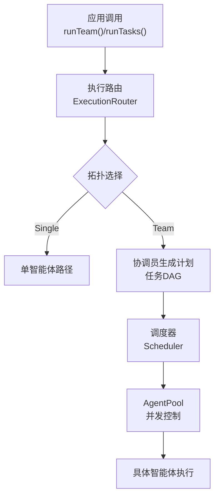
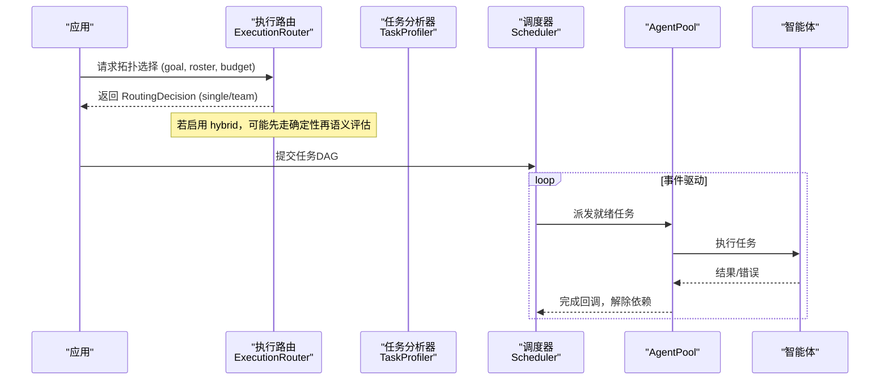
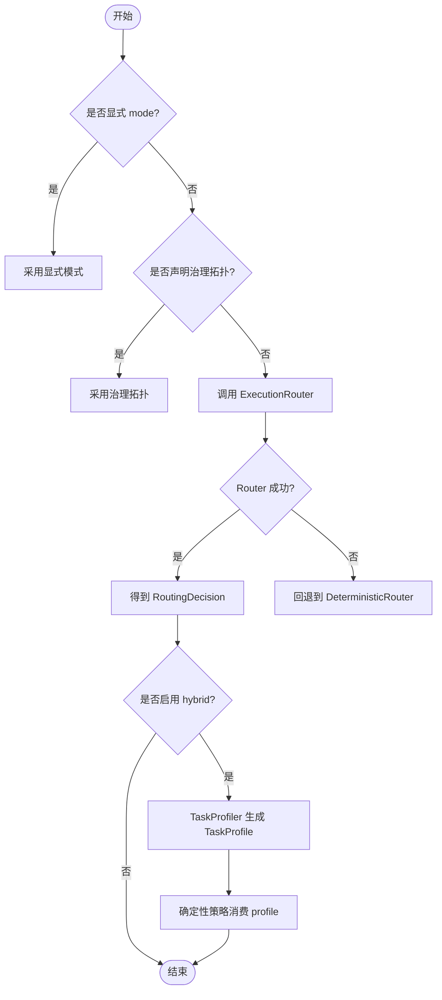
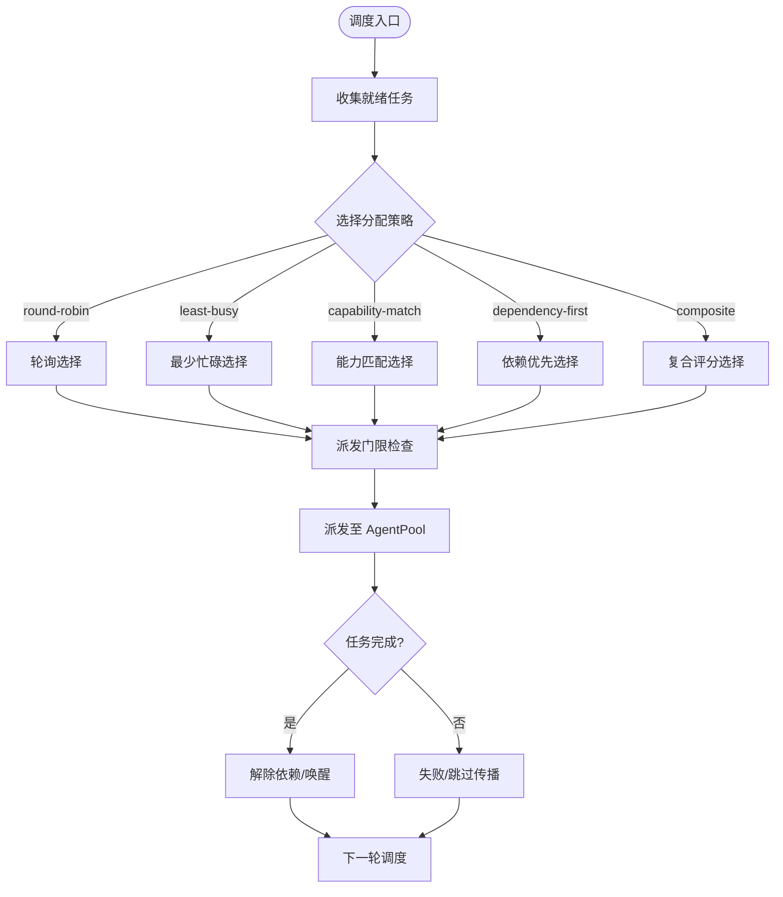
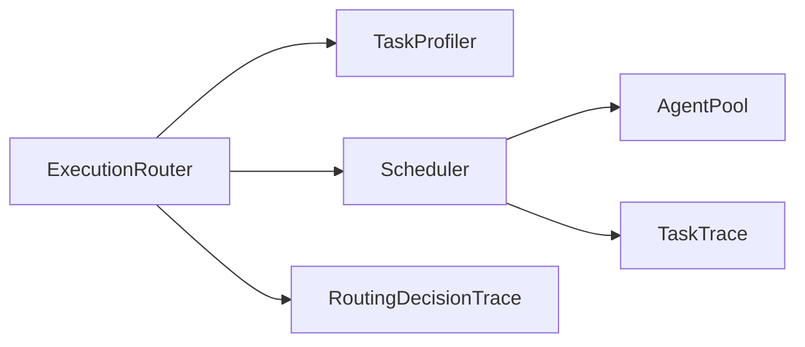

# 执行路由策略

<cite>
**本文引用的文件**
- [execution-routing.md](file://docs/execution-routing.md)
- [task-scheduling.md](file://docs/task-scheduling.md)
- [types.ts](file://packages/core/src/types.ts)
- [execution-router.ts](file://packages/core/src/orchestrator/execution-router.ts)
- [scheduler.ts](file://packages/core/src/orchestrator/scheduler.ts)
- [task-profiler.ts](file://packages/core/src/orchestrator/task-profiler.ts)
</cite>

## 目录
1. [简介](#简介)
2. [项目结构](#项目结构)
3. [核心组件](#核心组件)
4. [架构总览](#架构总览)
5. [详细组件分析](#详细组件分析)
6. [依赖关系分析](#依赖关系分析)
7. [性能考量](#性能考量)
8. [故障排查指南](#故障排查指南)
9. [结论](#结论)
10. [附录：配置与使用示例路径](#附录：配置与使用示例路径)

## 简介
本文件系统性阐述 Open Multi-Agent 的执行路由策略与调度算法，覆盖执行路由器 ExecutionRouter 的工作原理（拓扑选择、路由决策、负载均衡）、调度器 Scheduler 的策略（轮询、权重分配、优先级调度等），以及动态路由的实现机制（智能体选择、任务分配、故障转移）。同时提供路由策略的配置方法、性能调优技巧、监控指标与调试方法，确保读者能够基于仓库中的类型定义与文档实现可观测、可回退、可扩展的端到端路由系统。

## 项目结构
Open Multi-Agent 将“执行路由”和“任务调度”解耦为两个关键子系统：
- 执行路由：在 runTeam() 自动调用时决定 Single（单智能体）或 Team（协调员+多智能体）拓扑，支持确定性启发式与混合语义路由。
- 任务调度：以事件驱动的方式执行任务 DAG，负责就绪任务派发、AgentPool 并发控制、失败/跳过传播、预算与审批门控。

图表来源
- [execution-routing.md:1-222](file://docs/execution-routing.md#L1-L222)
- [task-scheduling.md:1-203](file://docs/task-scheduling.md#L1-L203)
- [types.ts:1579-1728](file://packages/core/src/types.ts#L1579-L1728)

章节来源
- [execution-routing.md:1-222](file://docs/execution-routing.md#L1-L222)
- [task-scheduling.md:1-203](file://docs/task-scheduling.md#L1-L203)
- [types.ts:1579-1728](file://packages/core/src/types.ts#L1579-L1728)

## 核心组件
- 执行路由器 ExecutionRouter：通过 decide(context) 返回 RoutingDecision，决定 single/team 拓扑；支持自定义实现与内置 DeterministicRouter。
- 混合语义路由：可选启用 hybrid 策略，通过 TaskProfiler 提取结构化语义信号，结合确定性策略进行升级/降级决策。
- 调度器 Scheduler：事件驱动的任务 DAG 执行引擎，维护就绪集合与 in-flight 映射，按策略选择智能体并派发任务。
- AgentPool：并发闸门，限制并发度，承载实际任务分发。
- 观察性与可追踪：RoutingDecisionTrace、TaskTrace 等事件用于监控与排障。

章节来源
- [types.ts:1579-1728](file://packages/core/src/types.ts#L1579-L1728)
- [types.ts:2131-2186](file://packages/core/src/types.ts#L2131-L2186)
- [execution-routing.md:1-222](file://docs/execution-routing.md#L1-L222)
- [task-scheduling.md:1-203](file://docs/task-scheduling.md#L1-L203)

## 架构总览
下图展示从 runTeam() 到任务执行的完整链路，包括路由决策、语义评估、调度派发与完成回调。

图表来源
- [execution-routing.md:23-80](file://docs/execution-routing.md#L23-L80)
- [task-scheduling.md:8-25](file://docs/task-scheduling.md#L8-L25)
- [types.ts:1654-1670](file://packages/core/src/types.ts#L1654-L1670)
- [types.ts:2774-2788](file://packages/core/src/types.ts#L2774-L2788)

## 详细组件分析

### 执行路由器 ExecutionRouter
- 工作原理
  - 输入：RoutingContext（目标 goal、精简名册 roster、剩余预算 budget、中止信号 abortSignal）。
  - 输出：RoutingDecision（mode: single/team、reasons、routerVersion、confidence、status/fallbackCode）。
  - 优先级：显式 mode > 治理拓扑/降级策略 > per-run router > orchestrator router > 内置 DeterministicRouter。
  - 混合语义路由：strategy=hybrid 时，仅在确定性结果为 Single 且需要时进行一次无工具模型调用，依据 TaskProfile 决定是否升级为 Team。
- 拓扑选择与路由决策
  - 确定性启发式：isSimpleGoal() 对多语言序列标记、长度与信息密度做轻量判断。
  - 语义评估：TaskProfiler 产出 TaskProfile（证据源、独立性、冲突目标、副作用意图、权限隔离、可分解性、并行性、复杂度、置信度、原因）。
  - 决策融合：确定性策略消费 profile 与框架事实，必要时升级至 Team；V1 不会将 Team 降级为 Single。
- 负载均衡
  - 执行路由不直接做负载分配；负载均衡由调度器与 AgentPool 承担。
- 故障处理
  - failurePolicy=fallback：自定义 Router/Profiler 异常或超时回退到确定性路由。
  - failurePolicy=fail：关闭模式，抛出带状态码的错误，运行跟踪会关闭并记录 status/fallbackCode。

图表来源
- [execution-routing.md:5-22](file://docs/execution-routing.md#L5-L22)
- [execution-routing.md:23-80](file://docs/execution-routing.md#L23-L80)
- [execution-routing.md:120-154](file://docs/execution-routing.md#L120-L154)
- [types.ts:1579-1728](file://packages/core/src/types.ts#L1579-L1728)

章节来源
- [execution-routing.md:5-22](file://docs/execution-routing.md#L5-L22)
- [execution-routing.md:23-80](file://docs/execution-routing.md#L23-L80)
- [execution-routing.md:120-154](file://docs/execution-routing.md#L120-L154)
- [types.ts:1579-1728](file://packages/core/src/types.ts#L1579-L1728)

### 调度器 Scheduler 与任务派发
- 事件驱动执行
  - 维护 ready set 与 in-flight map；当任务依赖满足时触发 task:ready。
  - 调度器根据当前 DAG 快照选择就绪任务，经派发门限检查（取消、预算、审批、AgentPool 容量）后派发。
  - 完成后立即解除依赖并唤醒执行循环。
- 任务结果与依赖载荷
  - agentResults 按智能体名称索引；taskResults 按稳定任务 ID 索引，保留未合并的原始结果。
  - 依赖载荷支持 output/structured/both，structured 仅注入结构化 JSON，超限或不可序列化会失败。
- 角色与元数据
  - assignee 标识具体工作实例，role 表示业务角色，metadata 携带受限键值信息（敏感信息脱敏）。
- 分配策略
  - round-robin：按名册顺序轮询，适用于可互换智能体。
  - least-busy：优先空闲智能体，适用于时长差异大的任务。
  - capability-match：基于能力与亲和度排序。
  - dependency-first：优先能解锁最多下游的任务。
  - composite：综合 fitWeight*fit + loadWeight*(1-normalizedCurrentLoad)，默认 fit=0.7、load=0.3。
- 审批与中断
  - onTaskDispatch/onApproval 作为审批门；中断、预算耗尽、审批拒绝统一走“排空-跳过”路径。

图表来源
- [task-scheduling.md:8-25](file://docs/task-scheduling.md#L8-L25)
- [task-scheduling.md:98-133](file://docs/task-scheduling.md#L98-L133)
- [task-scheduling.md:135-177](file://docs/task-scheduling.md#L135-L177)
- [types.ts:2131-2186](file://packages/core/src/types.ts#L2131-L2186)

章节来源
- [task-scheduling.md:8-25](file://docs/task-scheduling.md#L8-L25)
- [task-scheduling.md:98-133](file://docs/task-scheduling.md#L98-L133)
- [task-scheduling.md:135-177](file://docs/task-scheduling.md#L135-L177)
- [types.ts:2131-2186](file://packages/core/src/types.ts#L2131-L2186)

### 动态路由：智能体选择、任务分配、故障转移
- 智能体选择
  - 硬约束过滤：requiredTools、requiredCapabilities、requiredBackend、requiredProvider。
  - 策略排序：round-robin/least-busy/capability-match/dependency-first/composite。
- 任务分配
  - 事件驱动：依赖满足即派发；不等待同批其他就绪任务。
  - 委派链深度限制：maxDelegationDepth。
- 故障转移
  - 路由层：failurePolicy 控制 Router/Profiler 失败时的行为（回退或终止）。
  - 调度层：失败/跳过立即级联到依赖者；预算/审批门控阻止新任务进入。
  - 恢复与检查点：持久化安全边界与任务完成；恢复时重放已提交结果，保守执行无提交记录的调用。

章节来源
- [task-scheduling.md:166-184](file://docs/task-scheduling.md#L166-L184)
- [execution-routing.md:120-154](file://docs/execution-routing.md#L120-L154)
- [types.ts:2187-2210](file://packages/core/src/types.ts#L2187-L2210)

## 依赖关系分析
- 模块耦合
  - ExecutionRouter 与 TaskProfiler 解耦，通过标准接口协作；Router 不感知工具实现与凭据。
  - Scheduler 与 AgentPool 通过事件与容量信号协作，避免重复锁。
  - 观察性事件（RoutingDecisionTrace、TaskTrace）贯穿路由与调度，便于监控。
- 外部依赖
  - LLMAdapter/ModelRoutingRule 用于模型路由与适配器选择；不影响执行拓扑选择。
- 潜在循环
  - 路由与调度职责清晰，未见循环依赖；Router 不依赖 Scheduler，Scheduler 不反向依赖 Router。

图表来源
- [types.ts:1654-1670](file://packages/core/src/types.ts#L1654-L1670)
- [types.ts:2774-2788](file://packages/core/src/types.ts#L2774-L2788)
- [task-scheduling.md:8-25](file://docs/task-scheduling.md#L8-L25)

章节来源
- [types.ts:1654-1670](file://packages/core/src/types.ts#L1654-L1670)
- [types.ts:2774-2788](file://packages/core/src/types.ts#L2774-L2788)
- [task-scheduling.md:8-25](file://docs/task-scheduling.md#L8-L25)

## 性能考量
- 路由层
  - 默认 deterministic 无额外模型调用；hybrid 仅在必要时进行一次无工具模型调用，注意成本与延迟。
  - 合理设置 confidenceThreshold、timeoutMs、failurePolicy 平衡准确性与鲁棒性。
- 调度层
  - 选择合适策略：短任务用 round-robin；长任务波动大用 least-busy；强依赖图用 dependency-first；异构智能体用 composite。
  - 调整 schedulingWeights.fit/load 以平衡能力匹配与负载均衡。
  - 利用 AgentPool 并发上限与派发门限避免过载。
- 资源与预算
  - maxTokenBudget/maxCostBudget 配合 estimateCost 控制总体开销；预算越界停止新任务但允许进行中任务结算。
- 可观测性
  - 通过 RoutingDecisionTrace、TaskTrace 采集耗时、失败率、重试次数、跳过数等指标，定位瓶颈。

[本节为通用指导，无需特定文件引用]

## 故障排查指南
- 路由失败
  - 检查 routingDecision.status 与 fallbackCode；确认 requestedRouterVersion 与实际版本一致。
  - 若启用 hybrid，查看 semanticRoutingAssessment 中的 profilerVersion、recommendation、outcome、usage。
- 调度问题
  - 关注任务状态：task_start、task_complete、task_skipped、task_retry；核对 dependsOn 与依赖载荷。
  - 检查 onTaskDispatch/onApproval 是否阻断派发；确认 AgentPool 容量与并发限制。
- 预算与审批
  - 预算耗尽会停止新任务；审批拒绝会导致剩余任务被标记 skipped。
- 恢复与检查点
  - 恢复时跳过已完成任务，重放已提交工具结果；对外部代理后端保持任务粒度恢复。

章节来源
- [execution-routing.md:120-154](file://docs/execution-routing.md#L120-L154)
- [task-scheduling.md:135-184](file://docs/task-scheduling.md#L135-L184)
- [types.ts:2774-2788](file://packages/core/src/types.ts#L2774-L2788)

## 结论
Open Multi-Agent 的执行路由与调度系统以“路由与调度解耦、事件驱动执行、可观测可回退”为核心设计。ExecutionRouter 提供灵活而可控的拓扑选择，支持确定性启发式与混合语义路由；Scheduler 提供多种分配策略与严格的并发与预算门控。通过标准化接口与丰富的观察性事件，用户可在不同场景下快速配置、调优与排障，构建高可用、高性能的多智能体编排系统。

[本节为总结，无需特定文件引用]

## 附录：配置与使用示例路径
- 执行路由配置与示例
  - 混合语义路由配置与示例片段：[execution-routing.md:23-80](file://docs/execution-routing.md#L23-L80)
  - 自定义 ExecutionRouter 契约与示例：[execution-routing.md:81-118](file://docs/execution-routing.md#L81-L118)
  - 确定性策略与默认行为说明：[execution-routing.md:162-205](file://docs/execution-routing.md#L162-L205)
- 调度策略与参数
  - 调度策略与权重配置：[types.ts:2131-2186](file://packages/core/src/types.ts#L2131-L2186)
  - 事件驱动执行与派发流程：[task-scheduling.md:8-25](file://docs/task-scheduling.md#L8-L25)
  - 依赖载荷与任务元数据：[task-scheduling.md:27-97](file://docs/task-scheduling.md#L27-L97)
- 观察性与追踪
  - 路由决策追踪事件：[types.ts:2774-2788](file://packages/core/src/types.ts#L2774-L2788)
  - 任务生命周期事件：[task-scheduling.md:186-203](file://docs/task-scheduling.md#L186-L203)

章节来源
- [execution-routing.md:23-80](file://docs/execution-routing.md#L23-L80)
- [execution-routing.md:81-118](file://docs/execution-routing.md#L81-L118)
- [execution-routing.md:162-205](file://docs/execution-routing.md#L162-L205)
- [types.ts:2131-2186](file://packages/core/src/types.ts#L2131-L2186)
- [task-scheduling.md:8-25](file://docs/task-scheduling.md#L8-L25)
- [task-scheduling.md:27-97](file://docs/task-scheduling.md#L27-L97)
- [types.ts:2774-2788](file://packages/core/src/types.ts#L2774-L2788)
- [task-scheduling.md:186-203](file://docs/task-scheduling.md#L186-L203)