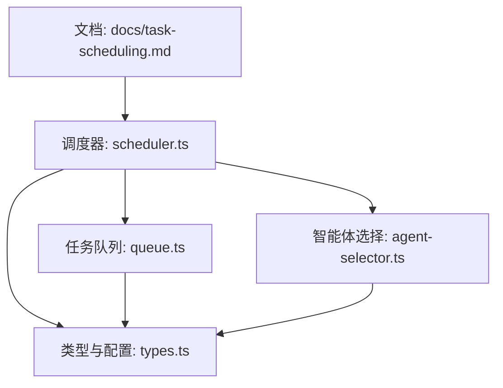
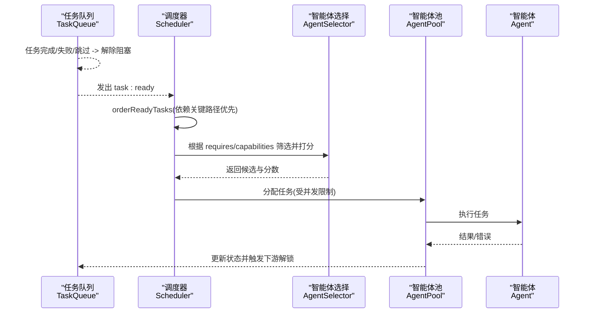
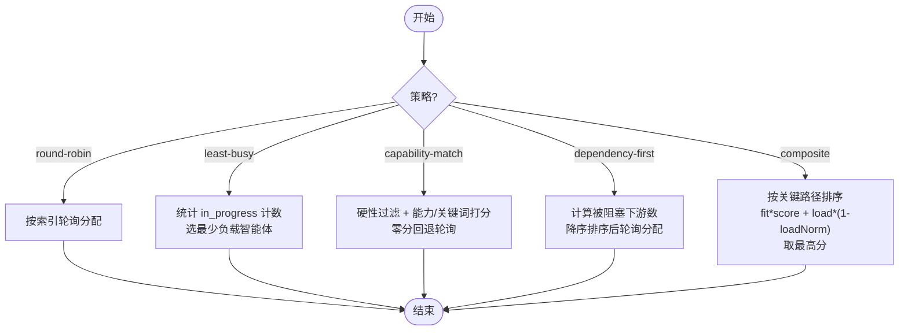
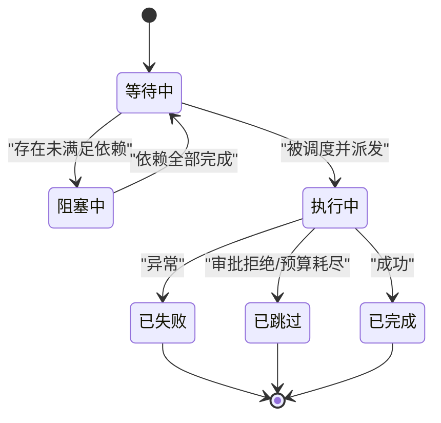
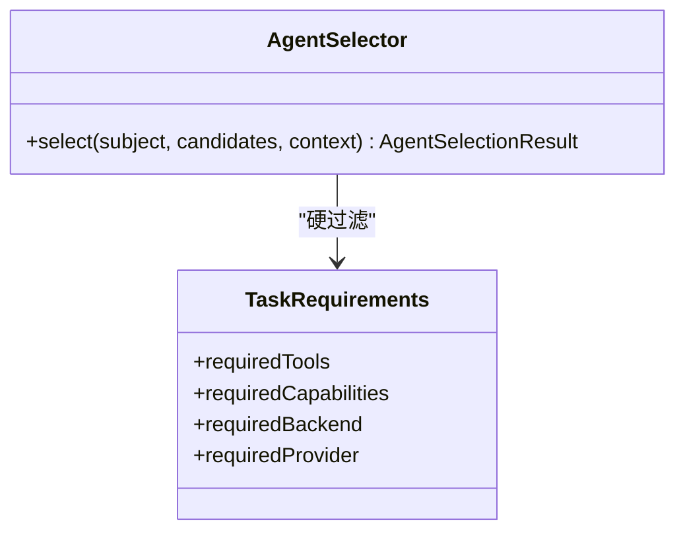
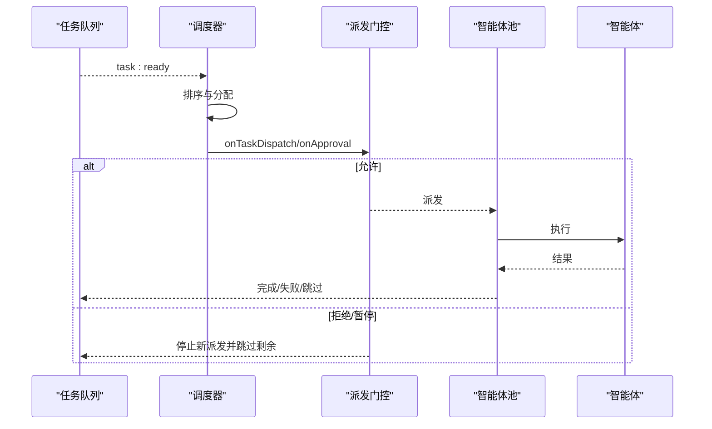
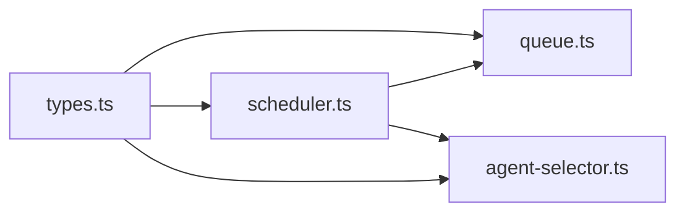

# 调度策略

<cite>
**本文引用的文件**
- [packages/core/src/orchestrator/scheduler.ts](file://packages/core/src/orchestrator/scheduler.ts)
- [packages/core/src/task/queue.ts](file://packages/core/src/task/queue.ts)
- [packages/core/src/orchestrator/agent-selector.ts](file://packages/core/src/orchestrator/agent-selector.ts)
- [packages/core/src/types.ts](file://packages/core/src/types.ts)
- [docs/task-scheduling.md](file://docs/task-scheduling.md)
</cite>

## 目录
1. [简介](#简介)
2. [项目结构](#项目结构)
3. [核心组件](#核心组件)
4. [架构总览](#架构总览)
5. [详细组件分析](#详细组件分析)
6. [依赖关系分析](#依赖关系分析)
7. [性能与并发](#性能与并发)
8. [故障排查指南](#故障排查指南)
9. [结论](#结论)
10. [附录：配置与调优](#附录：配置与调优)

## 简介
本文件系统性阐述 Open Multi-Agent 的调度策略系统，覆盖五种调度算法（轮询、最少忙碌、能力匹配、依赖优先、复合）、任务队列管理、事件驱动执行、审批门控、预算与检查点、以及监控与调优实践。目标是帮助读者在不同业务场景下选择合适的调度策略，并掌握基于智能体状态、任务复杂度与资源可用性的动态决策方法。

## 项目结构
调度相关代码主要分布在以下模块：
- 调度器与策略：packages/core/src/orchestrator/scheduler.ts
- 任务队列与生命周期：packages/core/src/task/queue.ts
- 智能体选择与硬性要求校验：packages/core/src/orchestrator/agent-selector.ts
- 类型与配置项定义：packages/core/src/types.ts
- 高层行为说明与示例参考：docs/task-scheduling.md

图表来源
- [packages/core/src/orchestrator/scheduler.ts:1-16](file://packages/core/src/orchestrator/scheduler.ts#L1-L16)
- [packages/core/src/task/queue.ts:1-10](file://packages/core/src/task/queue.ts#L1-L10)
- [packages/core/src/orchestrator/agent-selector.ts:1-10](file://packages/core/src/orchestrator/agent-selector.ts#L1-L10)
- [packages/core/src/types.ts:2131-2169](file://packages/core/src/types.ts#L2131-L2169)
- [docs/task-scheduling.md:1-26](file://docs/task-scheduling.md#L1-L26)

章节来源
- [packages/core/src/orchestrator/scheduler.ts:1-16](file://packages/core/src/orchestrator/scheduler.ts#L1-L16)
- [packages/core/src/task/queue.ts:1-10](file://packages/core/src/task/queue.ts#L1-L10)
- [packages/core/src/orchestrator/agent-selector.ts:1-10](file://packages/core/src/orchestrator/agent-selector.ts#L1-L10)
- [packages/core/src/types.ts:2131-2169](file://packages/core/src/types.ts#L2131-L2169)
- [docs/task-scheduling.md:1-26](file://docs/task-scheduling.md#L1-L26)

## 核心组件
- 调度器 Scheduler：封装五种调度策略，负责将待分配任务映射到可用智能体；支持批量 schedule 与单任务 scheduleTask，并提供 ready 任务排序 orderReadyTasks。
- 任务队列 TaskQueue：维护任务状态机（pending/blocked/in_progress/completed/failed/skipped），通过事件驱动推进 DAG 执行，支持快照/恢复、计划修订、失败/跳过级联。
- 智能体选择 AgentSelector：基于硬性要求（工具、能力、后端、提供商）进行过滤，再按声明能力与关键词相似度打分，提供可解释的选择理由。
- 类型与配置 OrchestratorConfig：暴露 schedulingStrategy、schedulingWeights、strictAssignees 等调度相关配置项。

章节来源
- [packages/core/src/orchestrator/scheduler.ts:18-82](file://packages/core/src/orchestrator/scheduler.ts#L18-L82)
- [packages/core/src/task/queue.ts:46-63](file://packages/core/src/task/queue.ts#L46-L63)
- [packages/core/src/orchestrator/agent-selector.ts:95-223](file://packages/core/src/orchestrator/agent-selector.ts#L95-L223)
- [packages/core/src/types.ts:2131-2169](file://packages/core/src/types.ts#L2131-L2169)

## 架构总览
事件驱动的执行循环由 TaskQueue 触发，Scheduler 在每次“就绪”时进行任务排序与分配，AgentPool 作为并发控制闸门，最终通过 Agent 执行任务。

图表来源
- [docs/task-scheduling.md:8-25](file://docs/task-scheduling.md#L8-L25)
- [packages/core/src/orchestrator/scheduler.ts:253-268](file://packages/core/src/orchestrator/scheduler.ts#L253-L268)
- [packages/core/src/orchestrator/agent-selector.ts:95-223](file://packages/core/src/orchestrator/agent-selector.ts#L95-L223)
- [packages/core/src/task/queue.ts:424-480](file://packages/core/src/task/queue.ts#L424-L480)

## 详细组件分析

### 调度器与五种策略
- 轮询 round-robin：按智能体索引均匀分配，适合可互换的智能体。
- 最少忙碌 least-busy：选择当前 in_progress 最少的智能体，适合任务时长差异大。
- 能力匹配 capability-match：先硬性过滤，再按声明能力与关键词相似度打分；零分时回退到轮询游标。
- 依赖优先 dependency-first：对“能解锁最多下游任务”的任务优先分配，适合强依赖 DAG。
- 复合 composite：按依赖关键路径排序后，综合 fitWeight*fit + loadWeight*(1 - normalizedLoad)，默认 fit=0.7、load=0.3。

图表来源
- [packages/core/src/orchestrator/scheduler.ts:128-214](file://packages/core/src/orchestrator/scheduler.ts#L128-L214)
- [packages/core/src/orchestrator/scheduler.ts:298-508](file://packages/core/src/orchestrator/scheduler.ts#L298-L508)
- [packages/core/src/orchestrator/scheduler.ts:559-564](file://packages/core/src/orchestrator/scheduler.ts#L559-L564)

章节来源
- [packages/core/src/orchestrator/scheduler.ts:18-82](file://packages/core/src/orchestrator/scheduler.ts#L18-L82)
- [packages/core/src/orchestrator/scheduler.ts:128-214](file://packages/core/src/orchestrator/scheduler.ts#L128-L214)
- [packages/core/src/orchestrator/scheduler.ts:298-508](file://packages/core/src/orchestrator/scheduler.ts#L298-L508)
- [packages/core/src/orchestrator/scheduler.ts:559-564](file://packages/core/src/orchestrator/scheduler.ts#L559-L564)

### 任务队列与事件驱动执行
- 状态机：pending → blocked → pending（依赖满足）→ in_progress → completed/failed/skipped。
- 事件：task:ready、task:complete、task:failed、task:skipped、all:complete。
- 级联：失败或跳过会向下游传播，避免死锁。
- 快照/恢复：支持序列化与恢复，支持计划修订追加新任务、重定向、覆盖。

图表来源
- [packages/core/src/task/queue.ts:46-63](file://packages/core/src/task/queue.ts#L46-L63)
- [packages/core/src/task/queue.ts:424-480](file://packages/core/src/task/queue.ts#L424-L480)
- [packages/core/src/task/queue.ts:514-545](file://packages/core/src/task/queue.ts#L514-L545)

章节来源
- [packages/core/src/task/queue.ts:46-63](file://packages/core/src/task/queue.ts#L46-L63)
- [packages/core/src/task/queue.ts:424-480](file://packages/core/src/task/queue.ts#L424-L480)
- [packages/core/src/task/queue.ts:514-545](file://packages/core/src/task/queue.ts#L514-L545)

### 智能体选择与硬性要求
- 硬性要求：requiredTools、requiredCapabilities、requiredBackend、requiredProvider，仅基于已解析的工具授予、后端与提供商判定，不从不结构化文本推断。
- 评分：先比较声明能力亲和度，再叠加关键词亲和度；无能力时回退为关键词顺序。
- 验证：调度前对所有任务进行硬性要求校验，未满足则报告 NO_ELIGIBLE_AGENT 或 ASSIGNEE_REQUIREMENTS_MISMATCH。

图表来源
- [packages/core/src/orchestrator/agent-selector.ts:95-223](file://packages/core/src/orchestrator/agent-selector.ts#L95-L223)
- [packages/core/src/types.ts:1360-1372](file://packages/core/src/types.ts#L1360-L1372)

章节来源
- [packages/core/src/orchestrator/agent-selector.ts:95-223](file://packages/core/src/orchestrator/agent-selector.ts#L95-L223)
- [packages/core/src/types.ts:1360-1372](file://packages/core/src/types.ts#L1360-L1372)

### 事件驱动执行流程（含审批与预算）
- 就绪任务经调度器分配给智能体后，进入派发门控（onTaskDispatch/onApproval）。
- 预算/中断/审批拒绝采用“排空-跳过”策略：停止接纳新任务，等待在途任务结算，剩余任务标记为 skipped。
- 检查点在安全边界持久化，恢复时重放已提交工具调用，保守运行无提交记录调用。

图表来源
- [docs/task-scheduling.md:8-25](file://docs/task-scheduling.md#L8-L25)
- [docs/task-scheduling.md:135-177](file://docs/task-scheduling.md#L135-L177)
- [packages/core/src/types.ts:2282-2335](file://packages/core/src/types.ts#L2282-L2335)

章节来源
- [docs/task-scheduling.md:8-25](file://docs/task-scheduling.md#L8-L25)
- [docs/task-scheduling.md:135-177](file://docs/task-scheduling.md#L135-L177)
- [packages/core/src/types.ts:2282-2335](file://packages/core/src/types.ts#L2282-L2335)

## 依赖关系分析
- 调度器依赖任务队列的状态快照与事件，依赖智能体选择器进行硬性过滤与打分。
- 任务队列依赖类型定义中的任务结构与状态枚举。
- 智能体选择器依赖工具授予解析与关键词相似度计算。

图表来源
- [packages/core/src/types.ts:2003-2080](file://packages/core/src/types.ts#L2003-L2080)
- [packages/core/src/task/queue.ts:1-20](file://packages/core/src/task/queue.ts#L1-L20)
- [packages/core/src/orchestrator/scheduler.ts:18-24](file://packages/core/src/orchestrator/scheduler.ts#L18-L24)
- [packages/core/src/orchestrator/agent-selector.ts:10-22](file://packages/core/src/orchestrator/agent-selector.ts#L10-L22)

章节来源
- [packages/core/src/types.ts:2003-2080](file://packages/core/src/types.ts#L2003-L2080)
- [packages/core/src/task/queue.ts:1-20](file://packages/core/src/task/queue.ts#L1-L20)
- [packages/core/src/orchestrator/scheduler.ts:18-24](file://packages/core/src/orchestrator/scheduler.ts#L18-L24)
- [packages/core/src/orchestrator/agent-selector.ts:10-22](file://packages/core/src/orchestrator/agent-selector.ts#L10-L22)

## 性能与并发
- 并发控制：AgentPool 的信号量是并发权威，调度器不引入额外锁；事件驱动执行一次只处理一个就绪任务，避免无关任务争用。
- 负载度量：least-busy 与 composite 使用 in_progress 计数作为负载指标；composite 对负载进行归一化并与 fit 加权。
- 批内一致性：composite 在同一调度调用中不会将本次已分配的负载计入后续候选，保证决策一致性与可扩展性。
- 建议：
  - 任务时长差异大：优先 least-busy 或 composite。
  - 强依赖 DAG：优先 dependency-first 或 composite。
  - 智能体同质且可互换：round-robin。
  - 角色分工明确：capability-match。

章节来源
- [docs/task-scheduling.md:8-25](file://docs/task-scheduling.md#L8-L25)
- [packages/core/src/orchestrator/scheduler.ts:319-363](file://packages/core/src/orchestrator/scheduler.ts#L319-L363)
- [packages/core/src/orchestrator/scheduler.ts:452-508](file://packages/core/src/orchestrator/scheduler.ts#L452-L508)

## 故障排查指南
- 无合格智能体：当任务硬性要求无法满足时，抛出 NO_ELIGIBLE_AGENT；若显式 assignee 不满足要求，则为 ASSIGNEE_REQUIREMENTS_MISMATCH。
- 审批拒绝/预算耗尽：采用“排空-跳过”，确保在途任务正常结算，剩余任务标记为 skipped。
- 依赖失败级联：失败或跳过会向下游传播，避免任务长期阻塞。
- 调试要点：
  - 检查任务的 requires 与智能体的 capabilities/tools/backend/provider 是否匹配。
  - 观察 onTaskDispatch/onApproval 返回值与抛出异常。
  - 查看队列进度与快照，确认依赖图与状态转换是否符合预期。

章节来源
- [packages/core/src/orchestrator/agent-selector.ts:236-299](file://packages/core/src/orchestrator/agent-selector.ts#L236-L299)
- [docs/task-scheduling.md:135-177](file://docs/task-scheduling.md#L135-L177)
- [packages/core/src/task/queue.ts:514-545](file://packages/core/src/task/queue.ts#L514-L545)

## 结论
Open Multi-Agent 的调度系统以事件驱动为核心，结合五种策略与严格的硬性要求校验，能够在复杂 DAG 中实现高吞吐、低延迟与可控的资源利用。通过合理选择策略、配置权重与审批门控，并结合预算与检查点机制，可在不同业务场景中取得稳定可靠的调度效果。

## 附录：配置与调优
- 调度策略配置：
  - schedulingStrategy：可选 'round-robin' | 'least-busy' | 'capability-match' | 'dependency-first' | 'composite'。
  - schedulingWeights：仅对 composite 生效，fit 默认 0.7，load 默认 0.3，必须非负且不同时为零。
  - strictAssignees：默认 true，拒绝协调器指定不在名单的智能体；设为 false 保留旧行为。
- 审批模式：
  - onTaskDispatch：事件驱动下的逐任务派发门控。
  - onApproval：兼容旧版批次语义的审批回调，二者互斥。
- 监控与优化：
  - 关注队列进度（pending/in_progress/completed/failed/skipped/blocked）。
  - 调整 weights 平衡“能力契合”与“负载均衡”。
  - 对长尾任务较多的场景，倾向 least-busy 或 composite。
  - 对强依赖流水线，倾向 dependency-first 或 composite。
  - 结合预算与检查点，保障稳定性与可恢复性。

章节来源
- [packages/core/src/types.ts:2131-2169](file://packages/core/src/types.ts#L2131-L2169)
- [packages/core/src/types.ts:2282-2335](file://packages/core/src/types.ts#L2282-L2335)
- [docs/task-scheduling.md:98-133](file://docs/task-scheduling.md#L98-L133)