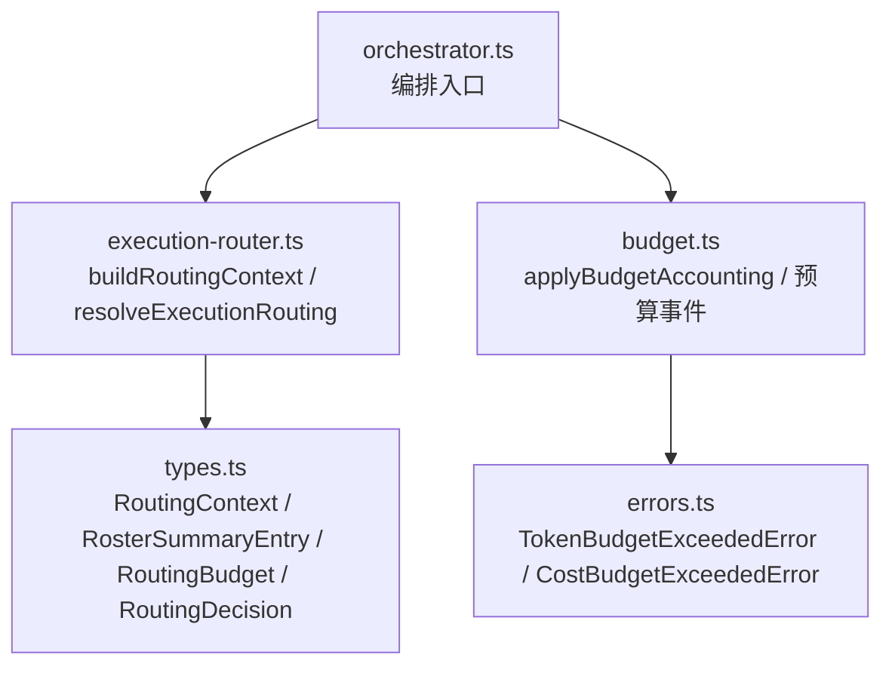
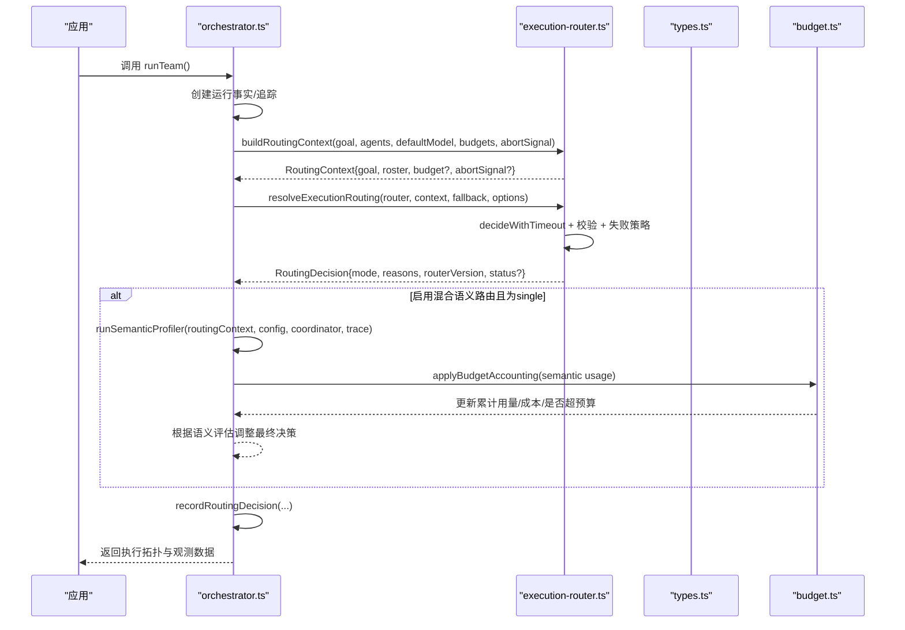
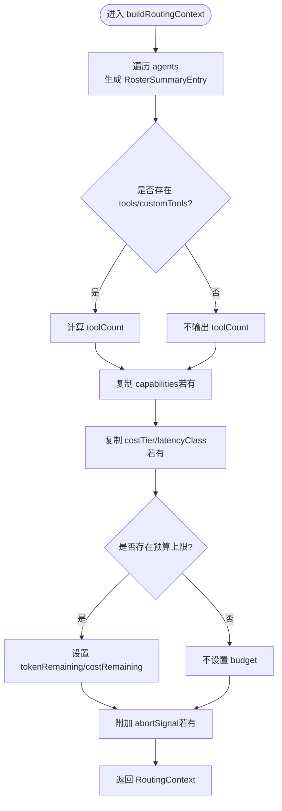
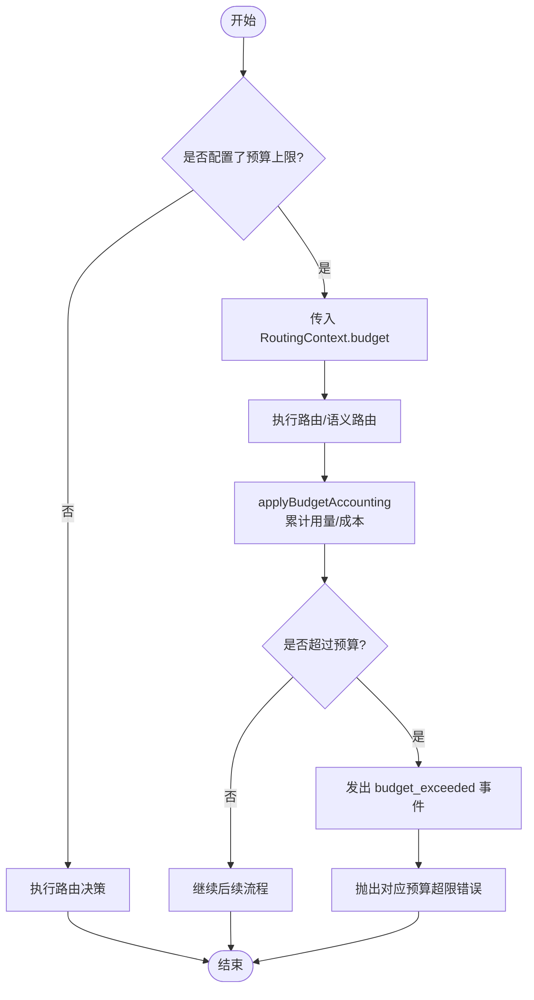
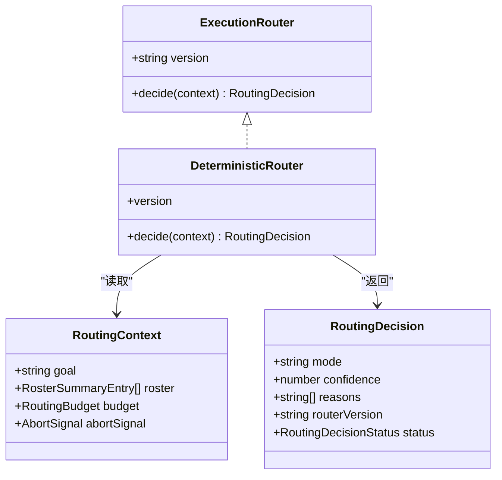
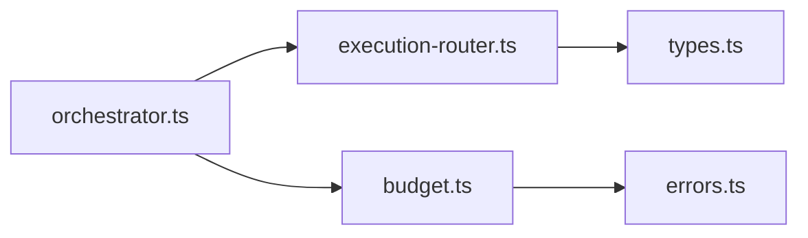

# 路由上下文管理

<cite>
**本文引用的文件**
- [execution-router.ts](file://packages/core/src/orchestrator/execution-router.ts)
- [orchestrator.ts](file://packages/core/src/orchestrator/orchestrator.ts)
- [types.ts](file://packages/core/src/types.ts)
- [budget.ts](file://packages/core/src/orchestrator/budget.ts)
- [errors.ts](file://packages/core/src/errors.ts)
</cite>

## 目录
1. [简介](#简介)
2. [项目结构](#项目结构)
3. [核心组件](#核心组件)
4. [架构总览](#架构总览)
5. [详细组件分析](#详细组件分析)
6. [依赖关系分析](#依赖关系分析)
7. [性能考量](#性能考量)
8. [故障排查指南](#故障排查指南)
9. [结论](#结论)
10. [附录：扩展与自定义指南](#附录：扩展与自定义指南)

## 简介
本文件聚焦于“执行拓扑路由”的上下文管理与数据流，围绕 RoutingContext 的结构设计、buildRoutingContext 的构建过程、智能体摘要信息（工具数量、能力标签、成本层级、延迟分类）、预算控制机制（Token 预算与成本预算的动态跟踪），以及上下文在路由决策中的作用与使用模式进行系统化说明。同时提供扩展与自定义路由器的实践建议。

## 项目结构
与路由上下文相关的核心代码集中在 orchestrator 与 types 模块中：
- execution-router.ts：定义 ExecutionRouter 接口、内置确定性路由器 DeterministicRouter，以及 buildRoutingContext、resolveExecutionRouting 等关键函数。
- orchestrator.ts：编排入口，负责组装运行事实、调用 buildRoutingContext、执行路由决策、记录路由结果并处理语义路由增强。
- types.ts：集中声明 RoutingContext、RosterSummaryEntry、RoutingBudget、RoutingDecision、ExecutionRouter、TaskProfiler 等相关类型。
- budget.ts：统一的预算会计与超限事件处理。
- errors.ts：运行时错误类型（如 TokenBudgetExceededError）。

**图表来源**
- [orchestrator.ts:1016-1037](file://packages/core/src/orchestrator/orchestrator.ts#L1016-L1037)
- [execution-router.ts:78-119](file://packages/core/src/orchestrator/execution-router.ts#L78-L119)
- [types.ts:1558-1586](file://packages/core/src/types.ts#L1558-L1586)
- [budget.ts:118-177](file://packages/core/src/orchestrator/budget.ts#L118-L177)

**章节来源**
- [execution-router.ts:78-119](file://packages/core/src/orchestrator/execution-router.ts#L78-L119)
- [orchestrator.ts:1016-1037](file://packages/core/src/orchestrator/orchestrator.ts#L1016-L1037)
- [types.ts:1558-1586](file://packages/core/src/types.ts#L1558-L1586)

## 核心组件
- RoutingContext：路由决策的稳定输入，包含目标 goal、智能体清单摘要 roster、可选预算 budget、可选中断信号 abortSignal。
- RosterSummaryEntry：对 AgentConfig 的隐私保护摘要，仅暴露 name、model、toolCount、capabilities、costTier、latencyClass 等字段，不包含系统提示等敏感信息。
- RoutingBudget：路由开始时的剩余预算视图，包含 tokenRemaining 与 costRemaining。
- ExecutionRouter：可插拔的执行拓扑路由器，要求实现 version 与 decide(context)。
- DeterministicRouter：内置确定性路由器，基于简单目标启发式与空清单检查返回 single/team。
- resolveExecutionRouting：封装超时、校验、失败策略与回退逻辑，确保路由失败不会导致整个运行失败。

**章节来源**
- [types.ts:1558-1586](file://packages/core/src/types.ts#L1558-L1586)
- [execution-router.ts:49-71](file://packages/core/src/orchestrator/execution-router.ts#L49-L71)
- [execution-router.ts:186-224](file://packages/core/src/orchestrator/execution-router.ts#L186-L224)

## 架构总览
下图展示了从编排器到路由器的完整数据流，包括上下文构建、路由决策、语义路由增强与预算会计。

**图表来源**
- [orchestrator.ts:1016-1185](file://packages/core/src/orchestrator/orchestrator.ts#L1016-L1185)
- [execution-router.ts:78-119](file://packages/core/src/orchestrator/execution-router.ts#L78-L119)
- [execution-router.ts:186-224](file://packages/core/src/orchestrator/execution-router.ts#L186-L224)
- [budget.ts:118-177](file://packages/core/src/orchestrator/budget.ts#L118-L177)

## 详细组件分析

### RoutingContext 与 RosterSummaryEntry 结构设计
- goal：当前任务的目标描述，用于启发式或语义路由判断。
- roster：智能体清单摘要数组，每个条目包含：
  - name：智能体名称
  - model：实际使用的模型标识（若未设置则继承默认模型）
  - toolCount：直接声明的工具总数（内置+自定义），便于快速评估复杂度
  - capabilities：显式声明的能力标签集合，供选择或过滤
  - costTier：相对成本层级（low/medium/high）
  - latencyClass：相对延迟层级（low/medium/high）
- budget：路由开始时的剩余预算视图，包含 tokenRemaining 与 costRemaining（可选）
- abortSignal：允许自定义路由器在运行或路由截止时提前停止工作

该设计将“最小必要信息”提供给路由器，避免泄露系统提示等敏感内容，同时保留足够的结构化信号以支持低成本、可解释的路由决策。

**章节来源**
- [types.ts:1558-1586](file://packages/core/src/types.ts#L1558-L1586)

### buildRoutingContext 如何构建完整上下文
buildRoutingContext 的职责是将高层配置转换为稳定的路由输入：
- 遍历 agents，生成 RosterSummaryEntry：
  - 计算 toolCount = 内置工具数 + 自定义工具数（任一存在才输出）
  - 复制 capabilities 数组（若存在）
  - 透传 costTier、latencyClass（若存在）
  - 解析 model：优先 agent.model，否则使用 defaultModel
- 构造 budget：当 maxTokenBudget 或 maxCostBudget 存在时，分别映射为 tokenRemaining/costRemaining
- 附加 abortSignal（若存在）

返回值即为 RoutingContext，作为 ExecutionRouter.decide 的输入。

**图表来源**
- [execution-router.ts:78-119](file://packages/core/src/orchestrator/execution-router.ts#L78-L119)

**章节来源**
- [execution-router.ts:78-119](file://packages/core/src/orchestrator/execution-router.ts#L78-L119)

### 智能体摘要信息与路由决策
- 工具数量（toolCount）：帮助路由器快速识别“单智能体能否胜任”，例如工具较少可能更适合 single 模式。
- 能力标签（capabilities）：可用于匹配任务需求或做硬过滤。
- 成本层级（costTier）与延迟层级（latencyClass）：为成本/时延敏感的路由策略提供结构化信号。
- 模型（model）：决定后续 LLM 调用的具体模型，影响成本与时延预期。

这些字段共同构成“轻量但足够”的上下文，使路由器无需访问完整 AgentConfig 即可做出合理决策。

**章节来源**
- [types.ts:1558-1571](file://packages/core/src/types.ts#L1558-L1571)

### 预算控制机制：Token 预算与成本预算的动态跟踪
- 路由阶段预算：RoutingContext.budget 提供路由开始时的剩余预算视图（tokenRemaining、costRemaining）。
- 语义路由增强阶段的预算会计：当启用混合语义路由时，orchestrator 会调用 applyBudgetAccounting，将语义路由产生的 usage 计入累计用量与成本，并检测是否超预算。
- 超限事件与错误：
  - 当达到 Token 预算上限时，会触发 budget_exceeded 事件并抛出 TokenBudgetExceededError。
  - 当达到成本预算上限时，会触发 budget_exceeded 事件并抛出 CostBudgetExceededError。
- 这些事件与错误会被上层观测系统捕获，并在运行指标中汇总。

**图表来源**
- [orchestrator.ts:1130-1185](file://packages/core/src/orchestrator/orchestrator.ts#L1130-L1185)
- [budget.ts:118-177](file://packages/core/src/orchestrator/budget.ts#L118-L177)
- [errors.ts:27-40](file://packages/core/src/errors.ts#L27-L40)

**章节来源**
- [orchestrator.ts:1130-1185](file://packages/core/src/orchestrator/orchestrator.ts#L1130-L1185)
- [budget.ts:118-177](file://packages/core/src/orchestrator/budget.ts#L118-L177)
- [errors.ts:27-40](file://packages/core/src/errors.ts#L27-L40)

### 上下文在路由决策过程中的作用与使用模式
- 输入侧：RoutingContext 为 ExecutionRouter.decide 提供稳定、语言无关的输入，包含目标、智能体摘要、预算视图与中断信号。
- 决策侧：DeterministicRouter 基于简单目标启发式与空清单检查返回 single/team；自定义路由器可基于 capabilities、toolCount、costTier、latencyClass 等字段制定更精细的策略。
- 健壮性：resolveExecutionRouting 提供超时、版本校验、决策合法性校验与失败策略（fallback/fail），确保路由失败不会破坏整体运行。
- 增强侧：在 hybrid 模式下，orchestrator 可在 deterministic 基础上引入语义路由评估，必要时覆盖为 team，并记录语义评估结果。

**图表来源**
- [types.ts:1579-1610](file://packages/core/src/types.ts#L1579-L1610)
- [execution-router.ts:49-71](file://packages/core/src/orchestrator/execution-router.ts#L49-L71)

**章节来源**
- [execution-router.ts:49-71](file://packages/core/src/orchestrator/execution-router.ts#L49-L71)
- [execution-router.ts:186-224](file://packages/core/src/orchestrator/execution-router.ts#L186-L224)
- [orchestrator.ts:1016-1185](file://packages/core/src/orchestrator/orchestrator.ts#L1016-L1185)

## 依赖关系分析
- orchestrator.ts 依赖 execution-router.ts 提供的 buildRoutingContext 与 resolveExecutionRouting。
- execution-router.ts 依赖 types.ts 中的 RoutingContext、RosterSummaryEntry、RoutingBudget、RoutingDecision、ExecutionRouter 等类型。
- orchestrator.ts 在混合语义路由路径中调用 budget.ts 的 applyBudgetAccounting，并可能触发 errors.ts 中的预算超限错误。
- 所有模块通过明确的接口与类型契约解耦，保证可扩展性与可测试性。

**图表来源**
- [orchestrator.ts:1016-1185](file://packages/core/src/orchestrator/orchestrator.ts#L1016-L1185)
- [execution-router.ts:78-119](file://packages/core/src/orchestrator/execution-router.ts#L78-L119)
- [budget.ts:118-177](file://packages/core/src/orchestrator/budget.ts#L118-L177)
- [errors.ts:27-40](file://packages/core/src/errors.ts#L27-L40)

**章节来源**
- [orchestrator.ts:1016-1185](file://packages/core/src/orchestrator/orchestrator.ts#L1016-L1185)
- [execution-router.ts:78-119](file://packages/core/src/orchestrator/execution-router.ts#L78-L119)
- [budget.ts:118-177](file://packages/core/src/orchestrator/budget.ts#L118-L177)
- [errors.ts:27-40](file://packages/core/src/errors.ts#L27-L40)

## 性能考量
- 路由上下文构建为 O(n) 遍历 agents，生成摘要列表，开销低。
- 确定性路由器的决策逻辑为常数时间，适合高频调用。
- 混合语义路由会增加一次 LLM 调用与预算会计，需权衡收益与成本；可通过 timeoutMs 与 failurePolicy 控制风险。
- 预算会计在每次语义路由后执行，避免无界增长；超限即停止后续昂贵操作。

[本节为通用指导，不直接分析具体文件]

## 故障排查指南
- 路由超时：resolveExecutionRouting 会在指定超时内执行 decide，超时将抛出路由超时错误并触发回退策略。
- 路由失败：当自定义路由器抛出错误或返回无效决策时，会根据 failurePolicy 选择回退到内置确定性路由器或向上抛出错误。
- 预算超限：当达到 Token 或成本预算上限时，会发出 budget_exceeded 事件并抛出相应错误；上层应捕获并记录。
- 诊断要点：
  - 检查 RoutingContext.budget 是否正确传入。
  - 确认 ExecutionRouter.version 非空且与期望一致。
  - 查看语义路由评估结果与实际模式是否一致。
  - 关注预算会计后的 exceeded 标志与累计用量。

**章节来源**
- [execution-router.ts:121-148](file://packages/core/src/orchestrator/execution-router.ts#L121-L148)
- [execution-router.ts:186-224](file://packages/core/src/orchestrator/execution-router.ts#L186-L224)
- [budget.ts:118-177](file://packages/core/src/orchestrator/budget.ts#L118-L177)
- [errors.ts:27-40](file://packages/core/src/errors.ts#L27-L40)

## 结论
RoutingContext 以最小必要信息驱动执行拓扑路由，结合 RosterSummaryEntry 的结构化摘要与 RoutingBudget 的预算视图，使路由器能够在低成本、可解释的前提下做出高质量决策。buildRoutingContext 将高层配置标准化为稳定输入；resolveExecutionRouting 保障路由过程的健壮性；预算会计确保运行在可控成本与资源范围内。通过混合语义路由，系统可在需要时增强决策质量，同时保持回退与观测能力。

[本节为总结性内容，不直接分析具体文件]

## 附录：扩展与自定义指南
- 实现自定义 ExecutionRouter：
  - 必须实现 version 与 decide(context)，返回符合 RoutingDecision 结构的决策。
  - 利用 roster 中的 capabilities、toolCount、costTier、latencyClass 制定策略。
  - 尊重 abortSignal，及时中止耗时计算。
- 配置路由策略：
  - 在 orchestrator 或 per-run 选项中设置 executionRouter 与 executionRouting（strategy、timeoutMs、failurePolicy 等）。
  - 如需语义增强，启用 strategy='hybrid'，并配置 profiler/model/adapter/confidenceThreshold。
- 预算控制：
  - 传入 maxTokenBudget/maxCostBudget，以便 buildRoutingContext 生成 RoutingContext.budget。
  - 监控 budget_exceeded 事件与错误，必要时降级或终止运行。
- 观测与调试：
  - 关注 ExecutionRoutingDecisionRecord 中的 source、status、fallbackCode、semanticRoutingAssessment 等字段，定位决策来源与原因。
  - 结合 tracing 与 metrics，分析路由耗时与预算消耗。

**章节来源**
- [types.ts:1654-1670](file://packages/core/src/types.ts#L1654-L1670)
- [execution-router.ts:186-224](file://packages/core/src/orchestrator/execution-router.ts#L186-L224)
- [orchestrator.ts:1016-1185](file://packages/core/src/orchestrator/orchestrator.ts#L1016-L1185)