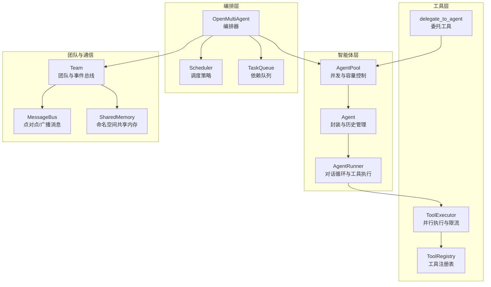
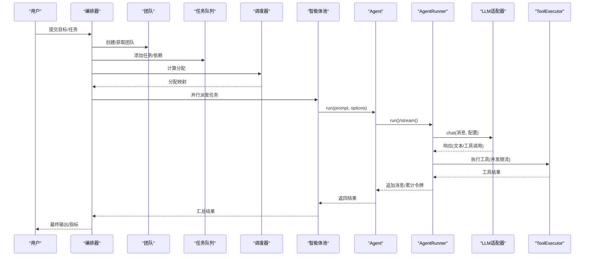
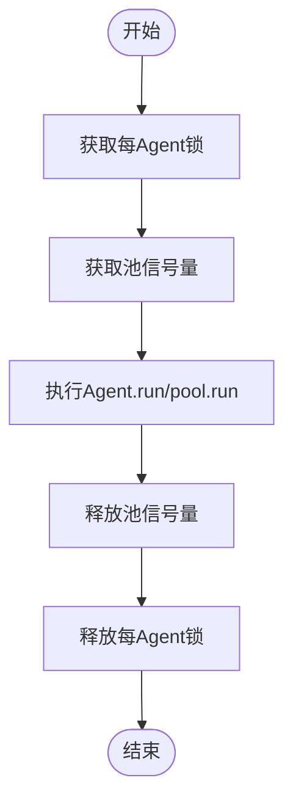
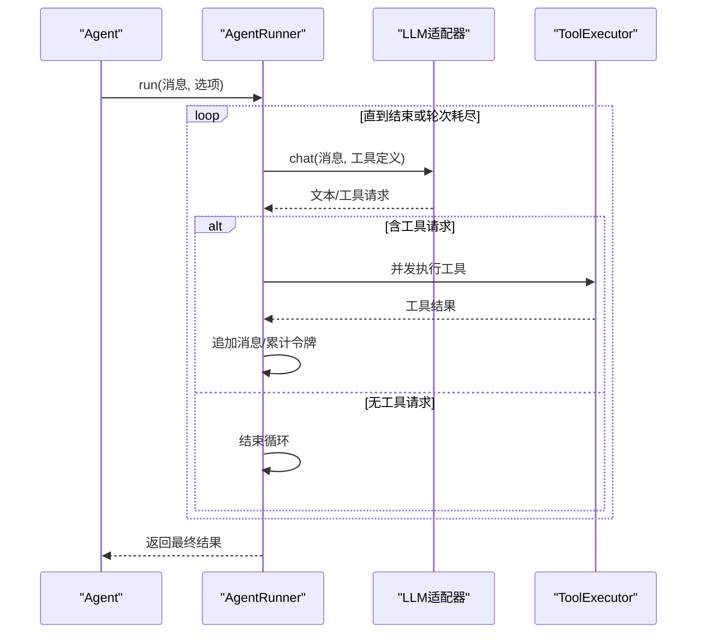
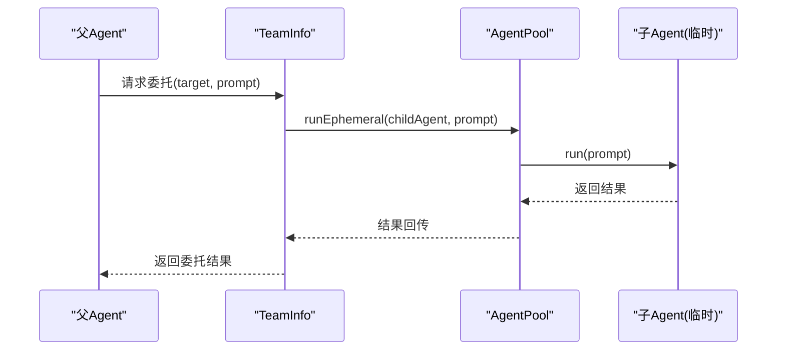
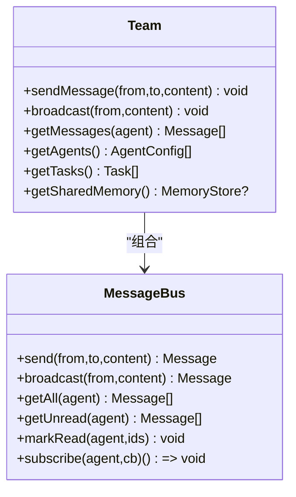
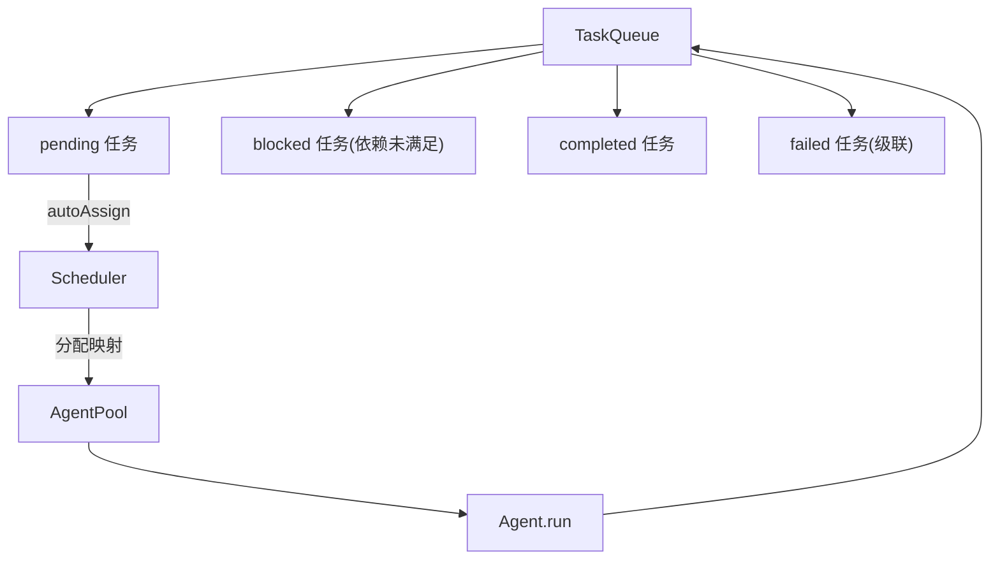
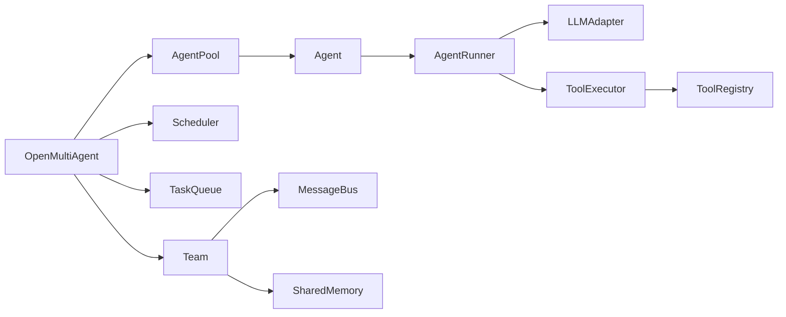
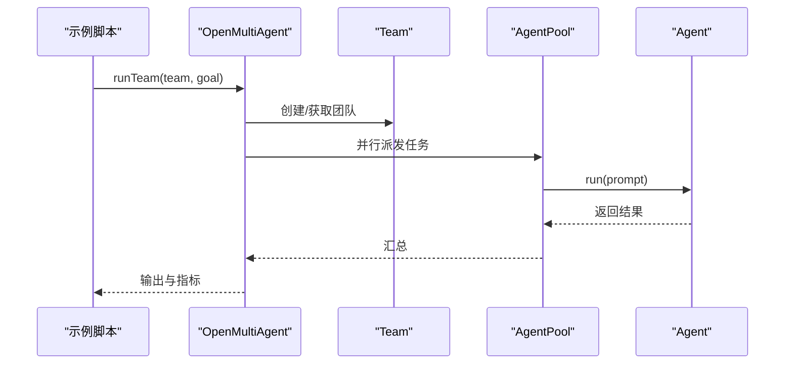

# 智能体协作机制

<cite>
**本文引用的文件**
- [agent.ts](file://src/agent/agent.ts)
- [runner.ts](file://src/agent/runner.ts)
- [pool.ts](file://src/agent/pool.ts)
- [semaphore.ts](file://src/utils/semaphore.ts)
- [executor.ts](file://src/tool/executor.ts)
- [delegate.ts](file://src/tool/built-in/delegate.ts)
- [messaging.ts](file://src/team/messaging.ts)
- [team.ts](file://src/team/team.ts)
- [scheduler.ts](file://src/orchestrator/scheduler.ts)
- [orchestrator.ts](file://src/orchestrator/orchestrator.ts)
- [shared.ts](file://src/memory/shared.ts)
- [queue.ts](file://src/task/queue.ts)
- [types.ts](file://src/types.ts)
- [team-collaboration.ts](file://examples/basics/team-collaboration.ts)
- [multi-model-team.ts](file://examples/basics/multi-model-team.ts)
- [agent-pool.test.ts](file://tests/agent-pool.test.ts)
- [team-messaging.test.ts](file://tests/team-messaging.test.ts)
</cite>

## 目录
1. [引言](#引言)
2. [项目结构](#项目结构)
3. [核心组件](#核心组件)
4. [架构总览](#架构总览)
5. [详细组件分析](#详细组件分析)
6. [依赖关系分析](#依赖关系分析)
7. [性能考量](#性能考量)
8. [故障排查指南](#故障排查指南)
9. [结论](#结论)
10. [附录](#附录)

## 引言
本技术文档围绕“智能体协作机制”展开，系统阐述在多智能体环境中如何实现协作模式与资源管理，包括：
- 智能体池化：并发控制与容量管理
- 智能体运行器：对话历史管理、工具执行循环、流式处理
- 智能体间通信：委托工具与代理执行流程
- 任务编排：调度策略、任务队列与状态同步
- 生命周期管理：从创建到销毁的全链路
- 错误处理、超时控制与资源清理

文档既面向初学者解释基本概念，也为有经验的开发者提供性能调优与扩展建议。

## 项目结构
该仓库采用按功能域分层的组织方式：
- agent：智能体封装、运行器与池化
- tool：工具框架、执行器与内置工具（如委托）
- team：团队协作、消息总线与共享内存
- orchestrator：编排器、调度器与任务队列
- memory：共享内存抽象
- task：任务模型与队列
- utils：通用工具（信号量、追踪等）
- examples：基础示例（团队协作、多模型团队）
- tests：行为验证与并发正确性测试

图示来源
- [agent.ts:94-670](file://src/agent/agent.ts#L94-L670)
- [runner.ts:348-800](file://src/agent/runner.ts#L348-L800)
- [pool.ts:58-370](file://src/agent/pool.ts#L58-L370)
- [executor.ts:54-264](file://src/tool/executor.ts#L54-L264)
- [delegate.ts:24-110](file://src/tool/built-in/delegate.ts#L24-L110)
- [orchestrator.ts:61-800](file://src/orchestrator/orchestrator.ts#L61-L800)
- [scheduler.ts:96-322](file://src/orchestrator/scheduler.ts#L96-L322)
- [queue.ts:55-470](file://src/task/queue.ts#L55-L470)
- [team.ts:88-346](file://src/team/team.ts#L88-L346)
- [messaging.ts:68-233](file://src/team/messaging.ts#L68-L233)
- [shared.ts:55-335](file://src/memory/shared.ts#L55-L335)

章节来源
- [agent.ts:94-670](file://src/agent/agent.ts#L94-L670)
- [runner.ts:348-800](file://src/agent/runner.ts#L348-L800)
- [pool.ts:58-370](file://src/agent/pool.ts#L58-L370)
- [executor.ts:54-264](file://src/tool/executor.ts#L54-L264)
- [delegate.ts:24-110](file://src/tool/built-in/delegate.ts#L24-L110)
- [orchestrator.ts:61-800](file://src/orchestrator/orchestrator.ts#L61-L800)
- [scheduler.ts:96-322](file://src/orchestrator/scheduler.ts#L96-L322)
- [queue.ts:55-470](file://src/task/queue.ts#L55-L470)
- [team.ts:88-346](file://src/team/team.ts#L88-L346)
- [messaging.ts:68-233](file://src/team/messaging.ts#L68-L233)
- [shared.ts:55-335](file://src/memory/shared.ts#L55-L335)

## 核心组件
- Agent：高层封装，负责持久对话历史、一次性对话、流式输出、动态工具注册与生命周期状态跟踪。
- AgentRunner：对话主循环，负责LLM调用、工具解析与执行、上下文压缩、令牌预算与循环检测。
- AgentPool：智能体池，提供并发上限、轮询派发、并行运行、状态统计与优雅关闭。
- ToolExecutor：工具执行器，支持输入/输出Zod校验、并发限流、批量执行与结果截断。
- Team：团队协作中心，包含消息总线、任务队列、共享内存与事件总线。
- Scheduler：任务调度器，支持轮询、最少忙碌、能力匹配、依赖优先四种策略。
- SharedMemory：命名空间共享内存，支持过期策略、摘要生成与跨任务/跨回合共享。
- TaskQueue：依赖感知的任务队列，支持级联失败/跳过、进度统计与事件桥接。
- MessageBus：轻量消息总线，支持点对点与广播、订阅回调与未读标记。

章节来源
- [agent.ts:94-670](file://src/agent/agent.ts#L94-L670)
- [runner.ts:348-800](file://src/agent/runner.ts#L348-L800)
- [pool.ts:58-370](file://src/agent/pool.ts#L58-L370)
- [executor.ts:54-264](file://src/tool/executor.ts#L54-L264)
- [team.ts:88-346](file://src/team/team.ts#L88-L346)
- [scheduler.ts:96-322](file://src/orchestrator/scheduler.ts#L96-L322)
- [shared.ts:55-335](file://src/memory/shared.ts#L55-L335)
- [queue.ts:55-470](file://src/task/queue.ts#L55-L470)
- [messaging.ts:68-233](file://src/team/messaging.ts#L68-L233)

## 架构总览
下图展示了从高层编排到底层执行的关键交互路径，以及并发与资源控制的边界。

图示来源
- [orchestrator.ts:561-800](file://src/orchestrator/orchestrator.ts#L561-L800)
- [pool.ts:147-293](file://src/agent/pool.ts#L147-L293)
- [agent.ts:205-410](file://src/agent/agent.ts#L205-L410)
- [runner.ts:638-790](file://src/agent/runner.ts#L638-L790)
- [executor.ts:114-130](file://src/tool/executor.ts#L114-L130)

## 详细组件分析

### 智能体池化与并发控制
- 并发上限：通过计数信号量控制池内并发槽位，避免资源争用与过载。
- 每实例串行：为同一Agent实例设置每Agent锁，确保实例内部状态（历史、令牌）不被竞态修改。
- 空闲槽位：提供可用槽位查询，用于避免嵌套调用导致的死锁。
- 临时运行：runEphemeral允许传入“新鲜”Agent实例，绕过每Agent锁，防止相互委托导致的死锁。
- 轮询派发：runAny基于游标进行轮询，结合并发限制保证公平性。
- 统计与关闭：提供状态快照与批量重置。

图示来源
- [pool.ts:147-191](file://src/agent/pool.ts#L147-L191)
- [semaphore.ts:24-95](file://src/utils/semaphore.ts#L24-L95)

章节来源
- [pool.ts:58-370](file://src/agent/pool.ts#L58-L370)
- [semaphore.ts:24-95](file://src/utils/semaphore.ts#L24-L95)
- [agent-pool.test.ts:181-262](file://tests/agent-pool.test.ts#L181-L262)

### 对话历史管理与运行器循环
- 历史管理：Agent维护持久对话历史；prompt追加消息并持久化；run为一次性对话。
- 循环执行：Runner以while(true)主循环推进，直到end_turn或达到最大轮次。
- 工具解析与执行：提取tool_use块，ToolExecutor并发执行并回填tool_result。
- 上下文压缩：滑动窗口、摘要模型、紧凑策略或自定义压缩，保障长对话可控。
- 令牌预算与超时：累计令牌，触发预算告警；支持每调用AbortSignal与整体超时。
- 结构化输出：可选输出模式，失败时二次尝试并反馈错误。

图示来源
- [agent.ts:205-410](file://src/agent/agent.ts#L205-L410)
- [runner.ts:638-790](file://src/agent/runner.ts#L638-L790)
- [executor.ts:114-130](file://src/tool/executor.ts#L114-L130)

章节来源
- [agent.ts:94-670](file://src/agent/agent.ts#L94-L670)
- [runner.ts:348-800](file://src/agent/runner.ts#L348-L800)
- [executor.ts:54-264](file://src/tool/executor.ts#L54-L264)

### 流式处理机制
- 流式事件：text、tool_use、tool_result、budget_exceeded、done、error。
- 实时回调：onMessage/onToolCall/onToolResult/onTrace等回调贯穿执行过程。
- 取消与超时：支持每调用与全局AbortSignal，确保及时中断。
- 结构化输出：可选结构化输出验证与二次尝试。

章节来源
- [runner.ts:673-790](file://src/agent/runner.ts#L673-L790)
- [agent.ts:245-251](file://src/agent/agent.ts#L245-L251)

### 智能体间通信与委托执行
- 委托工具：delegate_to_agent仅在编排运行中启用，要求注入TeamInfo与runDelegatedAgent。
- 互斥委托：通过runEphemeral构建“新鲜”Agent实例，绕过每Agent锁，避免相互委托死锁。
- 委托深度与环路检测：限制最大深度与检测委托链环路。
- 共享审计：可选写入共享内存记录委托结果元数据。

图示来源
- [delegate.ts:31-108](file://src/tool/built-in/delegate.ts#L31-L108)
- [orchestrator.ts:483-536](file://src/orchestrator/orchestrator.ts#L483-L536)
- [pool.ts:206-217](file://src/agent/pool.ts#L206-L217)

章节来源
- [delegate.ts:24-110](file://src/tool/built-in/delegate.ts#L24-L110)
- [orchestrator.ts:461-548](file://src/orchestrator/orchestrator.ts#L461-L548)
- [pool.ts:147-217](file://src/agent/pool.ts#L147-L217)

### 团队协作与消息总线
- 消息总线：支持点对点与广播，保留消息历史，按接收者跟踪未读状态。
- 事件桥接：TaskQueue事件桥接到Team事件总线，便于观察与集成。
- 共享内存：命名空间键值存储，支持过期策略与摘要生成，适合跨任务/回合共享。

图示来源
- [messaging.ts:68-233](file://src/team/messaging.ts#L68-L233)
- [team.ts:88-346](file://src/team/team.ts#L88-L346)

章节来源
- [messaging.ts:68-233](file://src/team/messaging.ts#L68-L233)
- [team.ts:88-346](file://src/team/team.ts#L88-L346)
- [team-messaging.test.ts:26-143](file://tests/team-messaging.test.ts#L26-L143)

### 任务编排与调度
- 任务队列：支持依赖解析、阻塞/就绪转换、级联失败/跳过、进度统计与事件。
- 调度策略：轮询、最少忙碌、能力匹配、依赖优先；可自动分配或手动更新assignee。
- 编排循环：按轮次并行派发，等待完成后自动解封下游任务，支持审批门控与预算超限跳过。

图示来源
- [queue.ts:55-470](file://src/task/queue.ts#L55-L470)
- [scheduler.ts:96-322](file://src/orchestrator/scheduler.ts#L96-L322)
- [orchestrator.ts:561-800](file://src/orchestrator/orchestrator.ts#L561-L800)

章节来源
- [queue.ts:55-470](file://src/task/queue.ts#L55-L470)
- [scheduler.ts:96-322](file://src/orchestrator/scheduler.ts#L96-L322)
- [orchestrator.ts:561-800](file://src/orchestrator/orchestrator.ts#L561-L800)

### 生命周期管理与资源清理
- Agent：状态机（idle/running/completed/error），历史与令牌累计，动态工具注册。
- AgentPool：批量shutdown重置所有Agent状态与历史。
- 编排器：执行期间累积令牌，预算超限时跳过剩余任务；取消信号触发跳过。
- 共享内存：turn计数推进，TTL条目到期过滤读取但不删除底层存储。

章节来源
- [agent.ts:122-278](file://src/agent/agent.ts#L122-L278)
- [pool.ts:333-337](file://src/agent/pool.ts#L333-L337)
- [orchestrator.ts:733-791](file://src/orchestrator/orchestrator.ts#L733-L791)
- [shared.ts:100-107](file://src/memory/shared.ts#L100-L107)

## 依赖关系分析
- 组件耦合：AgentRunner与ToolExecutor强耦合（工具执行），Agent与Runner弱耦合（封装与历史）。
- 外部依赖：LLM适配器抽象、Zod校验、AbortSignal取消、Node crypto随机ID。
- 并发边界：Semaphore在ToolExecutor与AgentPool分别承担工具并发与池并发，避免竞争。

图示来源
- [agent.ts:94-670](file://src/agent/agent.ts#L94-L670)
- [runner.ts:348-800](file://src/agent/runner.ts#L348-L800)
- [executor.ts:54-264](file://src/tool/executor.ts#L54-L264)
- [pool.ts:58-370](file://src/agent/pool.ts#L58-L370)
- [orchestrator.ts:61-800](file://src/orchestrator/orchestrator.ts#L61-L800)
- [team.ts:88-346](file://src/team/team.ts#L88-L346)
- [messaging.ts:68-233](file://src/team/messaging.ts#L68-L233)
- [shared.ts:55-335](file://src/memory/shared.ts#L55-L335)

章节来源
- [types.ts:1-200](file://src/types.ts#L1-L200)

## 性能考量
- 并发控制
  - 工具并发：ToolExecutor默认并发上限，避免IO密集工具拖垮整体吞吐。
  - 池并发：AgentPool限制总并发，避免LLM配额与网络拥塞。
- 上下文压缩
  - 滑动窗口：快速丢弃旧轮次，保持原子工具轮次不被切分。
  - 摘要模型：使用专用摘要模型降低上下文成本。
  - 紧凑策略：对长文本与工具结果进行截断与合并。
- 令牌预算
  - 运行期累计令牌，预算超限后触发跳过与告警，避免超额消费。
- 流式可观测
  - onTrace与onAgentStream提供细粒度指标，便于定位瓶颈。
- 资源清理
  - 共享内存不过期删除，避免分布式竞态；turn推进确保TTL语义一致。

## 故障排查指南
- 死锁与串行问题
  - 现象：相同Agent并发调用互相阻塞。
  - 解决：利用每Agent锁与runEphemeral临时绕过；检查嵌套委托链。
  - 参考：[agent-pool.test.ts:181-262](file://tests/agent-pool.test.ts#L181-L262)
- 并发超限
  - 现象：任务排队或报错“无空闲槽位”。
  - 解决：提升maxConcurrency或减少并行任务；确认availableRunSlots。
  - 参考：[pool.ts:86-88](file://src/agent/pool.ts#L86-L88)
- 委托失败
  - 现象：委托返回“无空闲槽位/未知Agent/深度超限/环路”。
  - 解决：增加maxConcurrency、检查roster与委托链、调整maxDelegationDepth。
  - 参考：[delegate.ts:78-85](file://src/tool/built-in/delegate.ts#L78-L85)
- 任务卡住
  - 现象：blocked任务长期无法推进。
  - 解决：检查上游依赖完成状态；使用getNextTask优先分配已分配任务。
  - 参考：[queue.ts:255-280](file://src/task/queue.ts#L255-L280)
- 令牌预算超限
  - 现象：预算告警并跳过后续任务。
  - 解决：降低maxTokenBudget或优化上下文策略。
  - 参考：[orchestrator.ts:733-747](file://src/orchestrator/orchestrator.ts#L733-L747)

章节来源
- [agent-pool.test.ts:181-262](file://tests/agent-pool.test.ts#L181-L262)
- [delegate.ts:78-85](file://src/tool/built-in/delegate.ts#L78-L85)
- [queue.ts:255-280](file://src/task/queue.ts#L255-L280)
- [orchestrator.ts:733-747](file://src/orchestrator/orchestrator.ts#L733-L747)

## 结论
该框架通过“智能体封装 + 运行器循环 + 池化并发 + 编排调度 + 团队通信”的分层设计，提供了高可靠、可扩展且易观测的多智能体协作能力。借助信号量、每Agent锁、委托工具与共享内存等机制，系统在复杂场景下仍能保持一致性与性能。建议在生产环境中结合流式追踪、令牌预算与上下文压缩策略，持续优化吞吐与成本。

## 附录

### 示例与实战参考
- 团队协作示例：展示三角色协作、事件进度与结果汇总。
  - 参考：[team-collaboration.ts:103-168](file://examples/basics/team-collaboration.ts#L103-L168)
- 多模型团队与自定义工具：混合Anthropic/OpenAI、自定义工具注册与AgentPool并发控制。
  - 参考：[multi-model-team.ts:116-262](file://examples/basics/multi-model-team.ts#L116-L262)

### 关键流程图（代码级）

图示来源
- [team-collaboration.ts:103-128](file://examples/basics/team-collaboration.ts#L103-L128)
- [orchestrator.ts:561-800](file://src/orchestrator/orchestrator.ts#L561-L800)
- [pool.ts:230-257](file://src/agent/pool.ts#L230-L257)