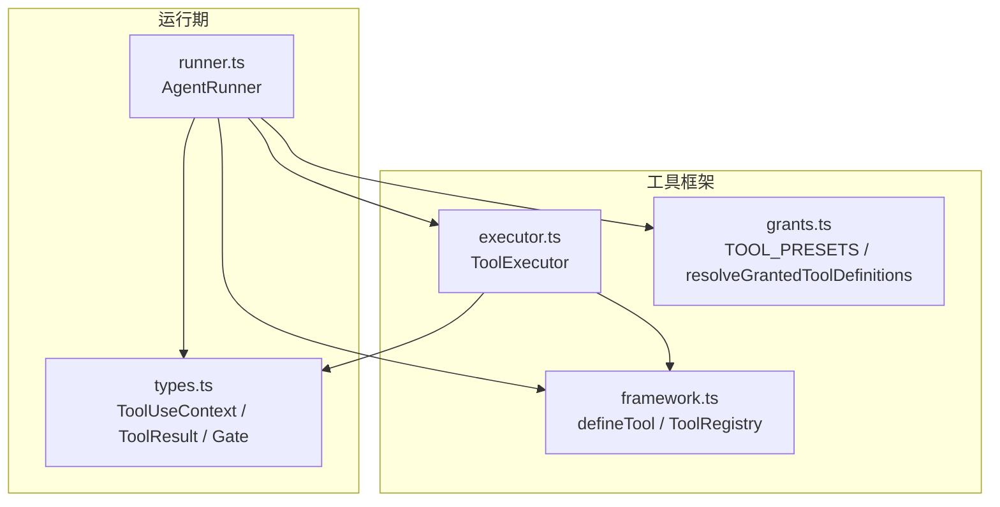
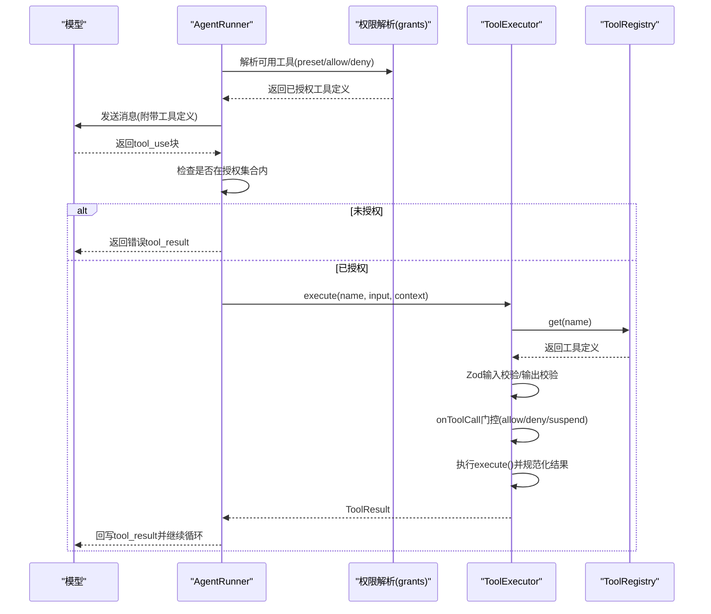
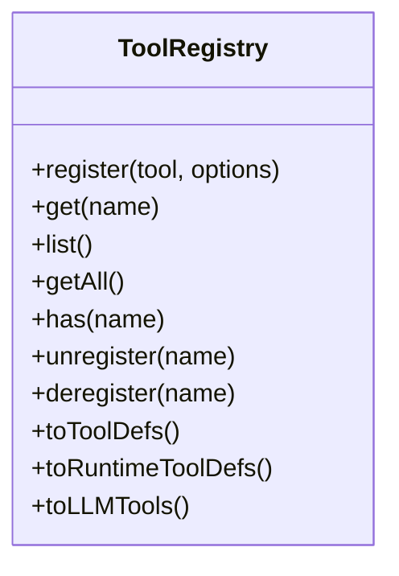
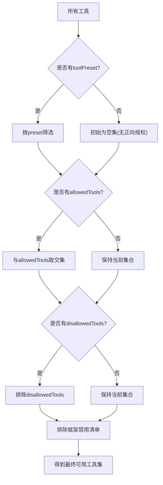
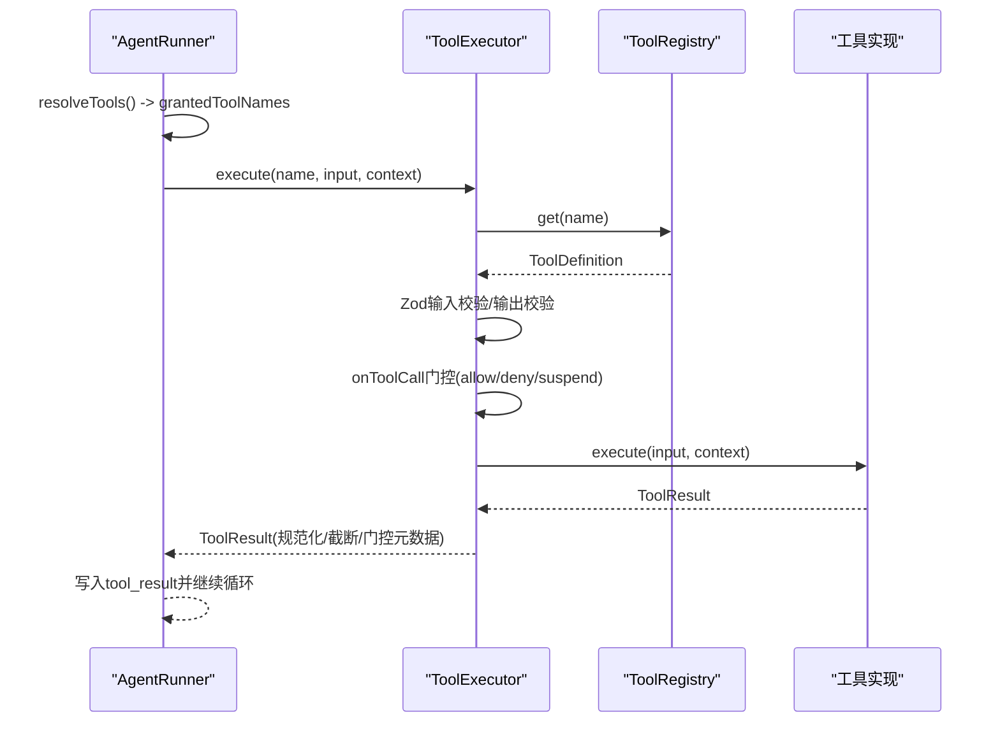
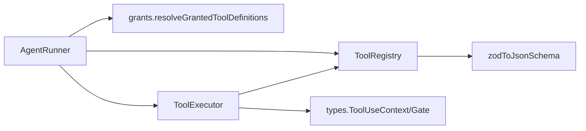

# 工具管理

<cite>
**本文引用的文件**
- [packages/core/src/tool/framework.ts](file://packages/core/src/tool/framework.ts)
- [packages/core/src/tool/executor.ts](file://packages/core/src/tool/executor.ts)
- [packages/core/src/tool/grants.ts](file://packages/core/src/tool/grants.ts)
- [packages/core/src/agent/runner.ts](file://packages/core/src/agent/runner.ts)
- [packages/core/src/types.ts](file://packages/core/src/types.ts)
</cite>

## 目录
1. [简介](#简介)
2. [项目结构](#项目结构)
3. [核心组件](#核心组件)
4. [架构总览](#架构总览)
5. [详细组件分析](#详细组件分析)
6. [依赖关系分析](#依赖关系分析)
7. [性能考量](#性能考量)
8. [故障排查指南](#故障排查指南)
9. [结论](#结论)
10. [附录](#附录)

## 简介
本章节面向“智能体的动态工具管理能力”，围绕运行时工具注册与注销、工具生命周期、工具注册表工作原理（发现、冲突处理、版本管理）、权限控制策略（白名单/黑名单/预设）、内置与自定义工具的集成方式、工具调用执行链路（从发现到结果返回）、上下文传递与错误处理，以及性能优化、资源管理与调试监控实践进行系统化说明。

## 项目结构
工具能力由以下核心模块构成：
- 工具定义与注册表：提供 defineTool、ToolRegistry、Zod→JSON Schema 转换等能力
- 工具执行器：负责输入校验、并发控制、审批门控、输出规范化与截断
- 权限与授予：预置工具集、白名单/黑名单解析、框架级禁用清单
- 运行器编排：AgentRunner 在每轮 LLM 调用前解析可用工具，构建 LLM 可见的工具定义，并在模型返回 tool_use 时调度执行
- 类型与上下文：统一的 ToolUseContext、ToolResult、ToolCallGate 等类型定义

**图表来源**
- [packages/core/src/tool/framework.ts:120-261](file://packages/core/src/tool/framework.ts#L120-L261)
- [packages/core/src/tool/executor.ts:85-164](file://packages/core/src/tool/executor.ts#L85-L164)
- [packages/core/src/tool/grants.ts:10-89](file://packages/core/src/tool/grants.ts#L10-L89)
- [packages/core/src/agent/runner.ts:902-951](file://packages/core/src/agent/runner.ts#L902-L951)
- [packages/core/src/types.ts:518-618](file://packages/core/src/types.ts#L518-L618)

**章节来源**
- [packages/core/src/tool/framework.ts:120-261](file://packages/core/src/tool/framework.ts#L120-L261)
- [packages/core/src/tool/executor.ts:85-164](file://packages/core/src/tool/executor.ts#L85-L164)
- [packages/core/src/tool/grants.ts:10-89](file://packages/core/src/tool/grants.ts#L10-L89)
- [packages/core/src/agent/runner.ts:902-951](file://packages/core/src/agent/runner.ts#L902-L951)
- [packages/core/src/types.ts:518-618](file://packages/core/src/types.ts#L518-L618)

## 核心组件
- 工具定义与注册表
  - defineTool：声明工具名称、描述、输入/输出 schema、是否具副作用、最大输出长度、执行函数
  - ToolRegistry：维护工具集合，支持注册、查询、列出、移除、转换为 LLM 可用的工具定义；区分“静态注册”和“运行时添加”的工具
- 工具执行器
  - ToolExecutor：按工具名查找实现，Zod 输入校验，可选输出校验，并发限制，per-call gate 门控，可恢复的持久化审批，错误统一封装为 ToolResult，输出截断
- 权限与授予
  - TOOL_PRESETS：readonly/readwrite/full 三套常用工具集
  - resolveGrantedToolDefinitions：基于 preset → allowedTools → disallowedTools → 框架禁用清单 的顺序计算最终可用工具集
- 运行器编排
  - AgentRunner：每轮 LLM 调用前解析可用工具并生成 LLMToolDef；当模型返回 tool_use 时，构造上下文并交由 ToolExecutor 执行；将结果回写对话并继续循环
- 类型与上下文
  - ToolUseContext：注入 agent 信息、团队上下文、取消信号、工作目录、元数据、任务/运行 ID、凭据等
  - ToolCallGate：每次调用前的门控回调，支持 allow/deny/suspend
  - ToolResult：应用数据、模型可见输出、错误标记、元数据（含 token 用量、门控决策、审批信息等）

**章节来源**
- [packages/core/src/tool/framework.ts:51-117](file://packages/core/src/tool/framework.ts#L51-L117)
- [packages/core/src/tool/framework.ts:120-261](file://packages/core/src/tool/framework.ts#L120-L261)
- [packages/core/src/tool/executor.ts:38-96](file://packages/core/src/tool/executor.ts#L38-L96)
- [packages/core/src/tool/grants.ts:10-89](file://packages/core/src/tool/grants.ts#L10-L89)
- [packages/core/src/agent/runner.ts:902-951](file://packages/core/src/agent/runner.ts#L902-L951)
- [packages/core/src/types.ts:518-618](file://packages/core/src/types.ts#L518-L618)

## 架构总览
下图展示一次工具调用的端到端流程：运行器解析可用工具并下发给模型；模型返回 tool_use；运行器校验授权后交由执行器执行；执行器完成输入校验、门控、执行、输出规范化与截断；结果回写对话并继续下一轮。

**图表来源**
- [packages/core/src/agent/runner.ts:902-951](file://packages/core/src/agent/runner.ts#L902-L951)
- [packages/core/src/agent/runner.ts:1364-1429](file://packages/core/src/agent/runner.ts#L1364-L1429)
- [packages/core/src/tool/executor.ts:112-164](file://packages/core/src/tool/executor.ts#L112-L164)
- [packages/core/src/tool/framework.ts:120-261](file://packages/core/src/tool/framework.ts#L120-L261)
- [packages/core/src/tool/grants.ts:35-89](file://packages/core/src/tool/grants.ts#L35-L89)

## 详细组件分析

### 工具注册表 ToolRegistry：发现、冲突与版本
- 工具发现
  - register：以 name 为键存储工具定义；支持标记 runtimeAdded 用于后续区分“运行时新增”的工具
  - list/get/has：基础查询接口
  - toToolDefs/toLLMTools：将工具转为 LLM 适配器所需的 JSON Schema 或 Anthropic 风格 input_schema
- 冲突处理
  - 重复注册同名工具会抛出错误，防止静默覆盖
- 版本管理
  - 当前实现不直接暴露版本号字段；可通过外部约定（如命名空间前缀）或包装 ToolDefinition 的方式扩展版本语义
  - 运行时工具通过 runtimeToolNames 集合追踪，便于单独导出或审计

**图表来源**
- [packages/core/src/tool/framework.ts:120-261](file://packages/core/src/tool/framework.ts#L120-L261)

**章节来源**
- [packages/core/src/tool/framework.ts:120-261](file://packages/core/src/tool/framework.ts#L120-L261)

### 运行时工具注册(addTool)与注销(removeTool)机制
- 运行时注册
  - 通过 ToolRegistry.register(tool, { runtimeAdded: true }) 将新工具加入注册表，并标记为运行时添加
  - 随后调用 AgentRunner.resolveTools() 会在本轮 LLM 调用中把该工具纳入可用工具集
- 运行时注销
  - 通过 ToolRegistry.unregister(name)/deregister(name) 移除工具并从运行时集合中清除
- 生命周期要点
  - 工具在注册后即可被后续 LLM 调用发现
  - 注销后不再出现在 toToolDefs()/toRuntimeToolDefs() 的结果中
  - 建议在执行关键副作用前再次校验授权集合，避免竞态

**章节来源**
- [packages/core/src/tool/framework.ts:120-261](file://packages/core/src/tool/framework.ts#L120-L261)
- [packages/core/src/agent/runner.ts:902-951](file://packages/core/src/agent/runner.ts#L902-L951)

### 权限控制策略：tools、disallowedTools、toolPreset
- 解析顺序
  - 先根据 toolPreset 选择一组内置工具
  - 再与 allowedTools 取交集
  - 最后排除 disallowedTools
  - 同时过滤 AGENT_FRAMEWORK_DISALLOWED（框架级禁用清单）
- 运行时工具
  - 运行时新增的工具默认可用，除非显式放入 disallowedTools
- 冲突告警
  - 若同时设置 toolPreset 与 allowedTools，或 allowedTools 与 disallowedTools 存在重叠，会发出警告日志

**图表来源**
- [packages/core/src/tool/grants.ts:35-89](file://packages/core/src/tool/grants.ts#L35-L89)

**章节来源**
- [packages/core/src/tool/grants.ts:10-89](file://packages/core/src/tool/grants.ts#L10-L89)

### 内置工具集成与自定义工具扩展
- 内置工具
  - 通过 TOOL_PRESETS 提供 readonly/readwrite/full 三类常见组合
  - 文件系统类工具受 cwd 沙箱约束，路径必须绝对且位于工作目录下
- 自定义工具
  - 使用 defineTool 声明输入/输出 schema、执行逻辑、是否具副作用、最大输出长度等
  - 自定义工具绕过 tools/toolPreset 的正向授权，但仍可被 disallowedTools 拒绝
  - 推荐为具副作用的工具设置 consequential=true，以便门控策略更严格

**章节来源**
- [packages/core/src/tool/grants.ts:10-15](file://packages/core/src/tool/grants.ts#L10-L15)
- [packages/core/src/tool/framework.ts:51-117](file://packages/core/src/tool/framework.ts#L51-L117)
- [packages/core/src/types.ts:966-974](file://packages/core/src/types.ts#L966-L974)

### 工具调用执行流程：从发现到结果返回
- 运行器侧
  - 每轮 LLM 调用前，resolveTools() 生成 LLMToolDef 列表并随请求下发
  - 模型返回 tool_use 后，运行器检查是否在 grantedToolNames 中，未授权则直接返回错误结果
  - 构造 ToolUseContext（包含 agent、team、cwd、credentials、runId/taskId/toolCallId 等），调用 ToolExecutor.execute
- 执行器侧
  - 查找工具定义，Zod 输入校验，必要时输出校验
  - 执行 onToolCall 门控（允许/拒绝/挂起等待持久化审批）
  - 执行工具实现，规范化 modelOutput，必要时截断超长输出
  - 统一错误封装为 ToolResult（isError=true），保证不会向上抛异常中断主循环
- 结果回写
  - 运行器将 tool_result 写入对话历史，继续下一轮推理或结束

**图表来源**
- [packages/core/src/agent/runner.ts:902-951](file://packages/core/src/agent/runner.ts#L902-L951)
- [packages/core/src/agent/runner.ts:1364-1429](file://packages/core/src/agent/runner.ts#L1364-L1429)
- [packages/core/src/tool/executor.ts:112-164](file://packages/core/src/tool/executor.ts#L112-L164)
- [packages/core/src/tool/executor.ts:181-338](file://packages/core/src/tool/executor.ts#L181-L338)

**章节来源**
- [packages/core/src/agent/runner.ts:902-951](file://packages/core/src/agent/runner.ts#L902-L951)
- [packages/core/src/agent/runner.ts:1364-1429](file://packages/core/src/agent/runner.ts#L1364-L1429)
- [packages/core/src/tool/executor.ts:112-164](file://packages/core/src/tool/executor.ts#L112-L164)
- [packages/core/src/tool/executor.ts:181-338](file://packages/core/src/tool/executor.ts#L181-L338)

### 上下文信息传递与错误处理
- 上下文传递
  - ToolUseContext 注入 agent 身份、团队上下文、取消信号、工作目录、元数据、任务/运行 ID、稳定 toolCallId、凭据等
  - 运行器在 buildToolContext 中组装上下文，确保每个工具调用具备一致的上下文环境
- 错误处理
  - 未知工具、Zod 校验失败、执行异常、非法输出格式等均被捕获并返回 isError=true 的 ToolResult
  - 门控拒绝或挂起时，附加 toolCallGate 元数据，便于审计与回放
  - 取消信号在多个阶段检查，尽早中止昂贵操作
- 可恢复性
  - 支持 durable approval：在 checkpoint 恢复场景下复用已审批决策，避免重复审查

**章节来源**
- [packages/core/src/types.ts:518-618](file://packages/core/src/types.ts#L518-L618)
- [packages/core/src/agent/runner.ts:1795-1811](file://packages/core/src/agent/runner.ts#L1795-L1811)
- [packages/core/src/tool/executor.ts:181-338](file://packages/core/src/tool/executor.ts#L181-L338)

## 依赖关系分析
- AgentRunner 依赖 ToolRegistry 与 ToolExecutor，并通过 grants 解析最终可用工具集
- ToolExecutor 依赖 ToolRegistry 获取工具定义，依赖 types 中的上下文与门控类型
- ToolRegistry 依赖 zodToJsonSchema 将输入 schema 转换为 LLM 所需 JSON Schema
- 权限解析依赖 TOOL_PRESETS 与 AGENT_FRAMEWORK_DISALLOWED

**图表来源**
- [packages/core/src/agent/runner.ts:902-951](file://packages/core/src/agent/runner.ts#L902-L951)
- [packages/core/src/tool/executor.ts:85-96](file://packages/core/src/tool/executor.ts#L85-L96)
- [packages/core/src/tool/framework.ts:120-261](file://packages/core/src/tool/framework.ts#L120-L261)
- [packages/core/src/tool/grants.ts:35-89](file://packages/core/src/tool/grants.ts#L35-L89)

**章节来源**
- [packages/core/src/agent/runner.ts:902-951](file://packages/core/src/agent/runner.ts#L902-L951)
- [packages/core/src/tool/executor.ts:85-96](file://packages/core/src/tool/executor.ts#L85-L96)
- [packages/core/src/tool/framework.ts:120-261](file://packages/core/src/tool/framework.ts#L120-L261)
- [packages/core/src/tool/grants.ts:35-89](file://packages/core/src/tool/grants.ts#L35-L89)

## 性能考量
- 并发控制
  - ToolExecutor 使用信号量限制并行工具调用数，避免资源争用与下游限流
- 输出截断
  - 支持 per-tool 与 agent-level 的最大输出字符数，保留首尾片段并插入截断标记，减少上下文膨胀
- 输入/输出校验
  - 使用 Zod 进行强类型校验，提前拦截非法参数；可选输出校验保障下游消费安全
- 上下文压缩
  - 运行器对已处理的 tool_result 进行规则化压缩，降低后续 LLM 调用成本
- 预算与超时
  - 支持 token 预算与调用超时，配合取消信号及时终止长耗时任务

**章节来源**
- [packages/core/src/tool/executor.ts:38-55](file://packages/core/src/tool/executor.ts#L38-L55)
- [packages/core/src/tool/executor.ts:359-379](file://packages/core/src/tool/executor.ts#L359-L379)
- [packages/core/src/agent/runner.ts:1759-1789](file://packages/core/src/agent/runner.ts#L1759-L1789)

## 故障排查指南
- 工具未授权
  - 现象：模型请求了未在 grantedToolNames 中的工具
  - 处理：返回错误 tool_result，提示需通过 tools/toolPreset/defaultToolPreset 授予
- 工具未注册
  - 现象：ToolExecutor 找不到工具
  - 处理：返回错误 tool_result，检查是否正确注册到 ToolRegistry
- 输入/输出校验失败
  - 现象：Zod 校验报错或输出不符合 outputSchema
  - 处理：返回错误 tool_result，修正工具 schema 或调用方输入
- 门控拒绝或挂起
  - 现象：onToolCall 返回 deny/suspend
  - 处理：查看 metadata.toolCallGate.reason；如需审批，进入持久化审批流程
- 取消与超时
  - 现象：abortSignal 触发或达到预算/超时
  - 处理：尽早检查取消信号，必要时缩短工具执行时间或调整预算

**章节来源**
- [packages/core/src/agent/runner.ts:1364-1429](file://packages/core/src/agent/runner.ts#L1364-L1429)
- [packages/core/src/tool/executor.ts:112-164](file://packages/core/src/tool/executor.ts#L112-L164)
- [packages/core/src/tool/executor.ts:181-338](file://packages/core/src/tool/executor.ts#L181-L338)

## 结论
该工具管理系统通过“注册表 + 执行器 + 权限解析 + 运行器编排”的分层设计，实现了安全的默认拒绝、灵活的运行时扩展、严格的输入输出校验、可控的并发与输出大小、以及可恢复的审批机制。结合上下文注入与完善的错误处理，既能满足复杂业务场景，又能在生产环境中保持稳定与可观测。

## 附录
- 最佳实践
  - 为具副作用的工具设置 consequential=true，并在 onToolCall 中实施更严格的审批策略
  - 合理配置 toolPreset/allowedTools/disallowedTools，避免冲突配置
  - 为长耗时工具实现取消信号检查，提升响应性
  - 使用 maxOutputChars 控制输出体积，避免上下文爆炸
  - 利用 credentials 隔离不同 agent 的密钥，避免越权访问
- 调试与监控
  - 通过 traceRuntime/traceSpan 记录工具执行 span，结合 onToolCall/onToolResult 回调观察执行过程
  - 关注 metadata.toolCallGate 与 approvalDecision，定位门控与审批问题
  - 使用 runId/taskId/toolCallId 关联跨组件调用链，便于回放与排障