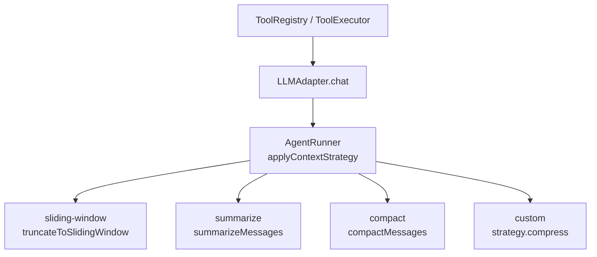
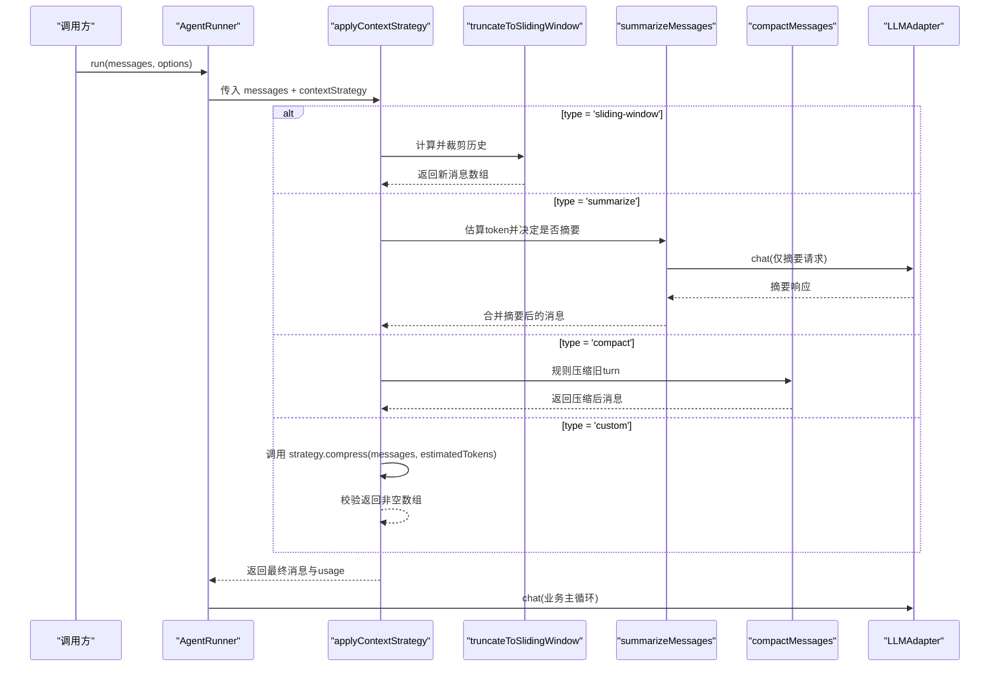
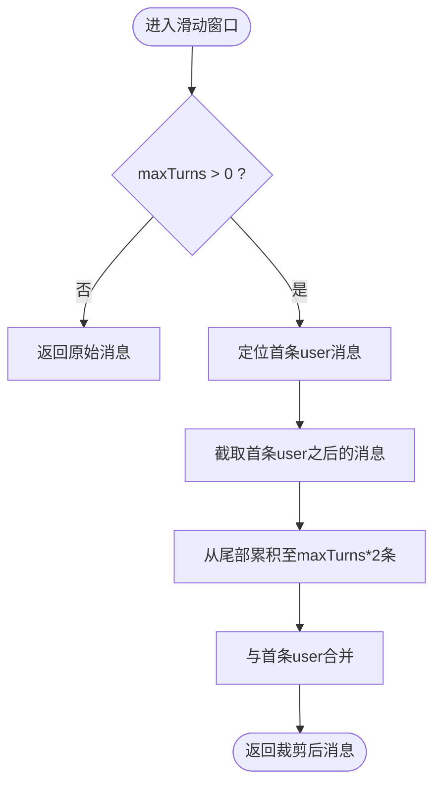
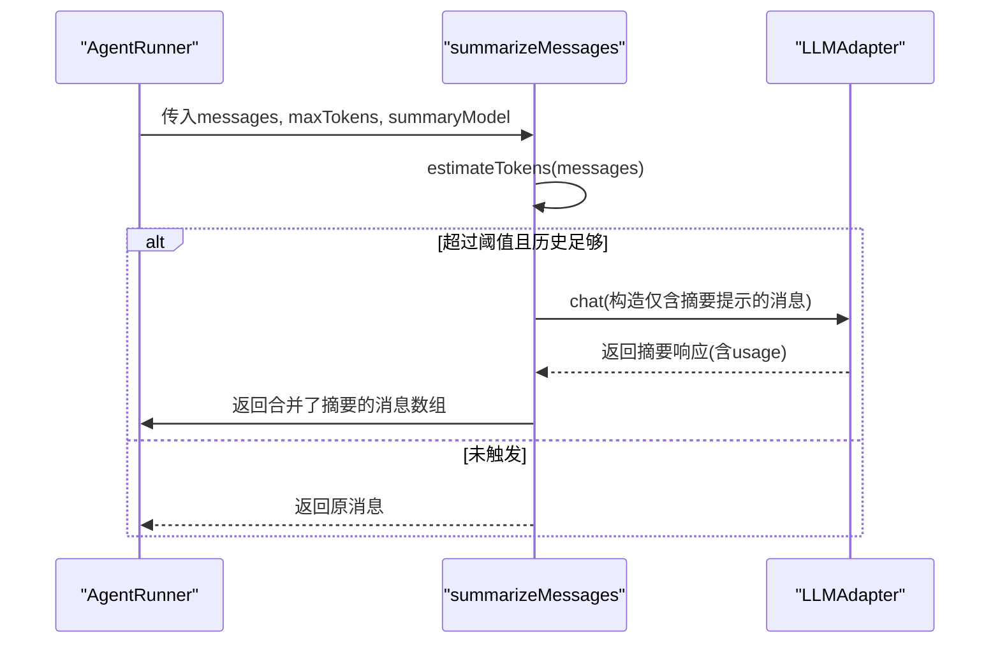
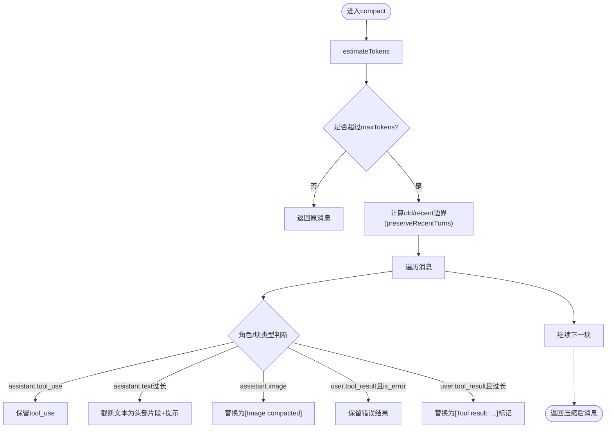
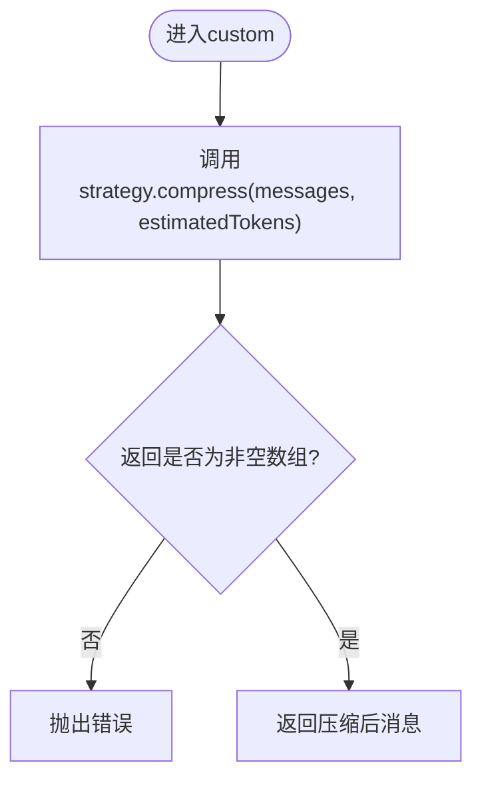
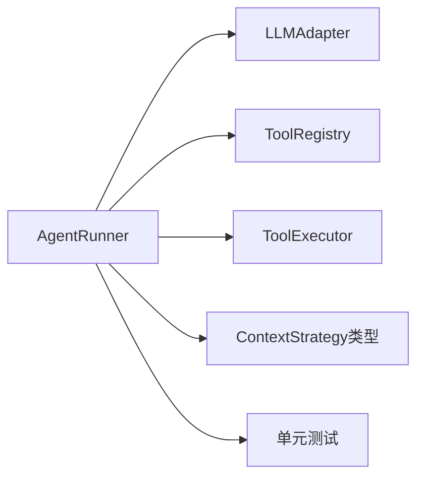

# 上下文策略管理

<cite>
**本文引用的文件**
- [runner.ts](file://packages/core/src/agent/runner.ts)
- [types.ts](file://packages/core/src/types.ts)
- [context-management.md](file://docs/context-management.md)
- [context-strategy.test.ts](file://packages/core/tests/context-strategy.test.ts)
</cite>

## 目录
1. [简介](#简介)
2. [项目结构](#项目结构)
3. [核心组件](#核心组件)
4. [架构总览](#架构总览)
5. [详细组件分析](#详细组件分析)
6. [依赖关系分析](#依赖关系分析)
7. [性能考量](#性能考量)
8. [故障排除指南](#故障排除指南)
9. [结论](#结论)
10. [附录](#附录)

## 简介
本文件围绕 ContextStrategy 接口与 applyContextStrategy 分发机制，系统阐述三种内置策略（sliding-window、summarize、compact）的行为、适用场景与配置方式，并给出自定义策略 compress 函数的实现要求与最佳实践。同时提供策略组合建议、性能对比与常见问题排查方法，帮助在长对话中平衡对话质量与资源消耗。

## 项目结构
- 类型定义：ContextStrategy 联合类型及其字段约束位于类型文件中。
- 运行时实现：AgentRunner 内部维护 applyContextStrategy 分发逻辑，以及各策略的具体实现方法。
- 文档说明：用户级配置示例、压缩工具结果、跨提供商推理保留等说明位于文档中。
- 测试覆盖：针对滑动窗口、摘要、压缩策略的边界行为与回归用例。

图表来源
- [runner.ts:773-805](file://packages/core/src/agent/runner.ts#L773-L805)
- [runner.ts:492-560](file://packages/core/src/agent/runner.ts#L492-L560)
- [runner.ts:683-771](file://packages/core/src/agent/runner.ts#L683-L771)
- [runner.ts:1576-1664](file://packages/core/src/agent/runner.ts#L1576-L1664)

章节来源
- [runner.ts:773-805](file://packages/core/src/agent/runner.ts#L773-L805)
- [types.ts:191-219](file://packages/core/src/types.ts#L191-L219)
- [context-management.md:1-23](file://docs/context-management.md#L1-L23)

## 核心组件
- ContextStrategy 联合类型：包含 sliding-window、summarize、compact、custom 四种策略形态，分别限定不同参数与回调签名。
- AgentRunner.applyContextStrategy：根据 strategy.type 分派到对应处理方法；对 custom 策略调用 compress 并校验返回值。
- 内置策略实现：
  - sliding-window：按“轮次”保留最近 N 轮，保证消息成对完整，首条 user 始终保留。
  - summarize：当估计 token 超过阈值时，将旧上下文发送给摘要模型生成摘要，并将摘要合并回首个 user 消息后继续。
  - compact：规则式压缩，不额外调用 LLM；对旧 turn 中的长文本和工具结果进行截断或标记，保留 tool_use 决策与错误结果，保护最近若干轮。
- 工具结果压缩：compressToolResults 可在进入对话前替换已消费的工具结果为短标记，与 contextStrategy 配合使用。

章节来源
- [types.ts:191-219](file://packages/core/src/types.ts#L191-L219)
- [runner.ts:773-805](file://packages/core/src/agent/runner.ts#L773-L805)
- [runner.ts:492-560](file://packages/core/src/agent/runner.ts#L492-L560)
- [runner.ts:683-771](file://packages/core/src/agent/runner.ts#L683-L771)
- [runner.ts:1576-1664](file://packages/core/src/agent/runner.ts#L1576-L1664)
- [context-management.md:24-55](file://docs/context-management.md#L24-L55)

## 架构总览
下图展示一次运行中上下文策略的分发与执行流程。

图表来源
- [runner.ts:773-805](file://packages/core/src/agent/runner.ts#L773-L805)
- [runner.ts:492-560](file://packages/core/src/agent/runner.ts#L492-L560)
- [runner.ts:683-771](file://packages/core/src/agent/runner.ts#L683-L771)
- [runner.ts:1576-1664](file://packages/core/src/agent/runner.ts#L1576-L1664)

## 详细组件分析

### sliding-window 策略
- 行为要点
  - 以“轮次”为单位裁剪历史，确保 assistant/user 成对保留，避免遗留孤立的 tool_use/tool_result。
  - 始终保留第一条 user 消息，防止丢失初始提示。
  - 当 maxTurns <= 0 时直接返回原消息。
- 适用场景
  - 追求最低开销与最简实现，适合短期多轮对话或对历史长度有严格上限的场景。
- 关键实现路径
  - 入口：applyContextStrategy -> truncateToSlidingWindow
  - 核心逻辑：从尾部累积消息直到达到 maxTurns * 2 条，再与首条 user 拼接。

图表来源
- [runner.ts:492-560](file://packages/core/src/agent/runner.ts#L492-L560)

章节来源
- [runner.ts:492-560](file://packages/core/src/agent/runner.ts#L492-L560)
- [runner.ts:773-782](file://packages/core/src/agent/runner.ts#L773-L782)
- [context-strategy.test.ts:76-110](file://packages/core/tests/context-strategy.test.ts#L76-L110)
- [context-strategy.test.ts:112-167](file://packages/core/tests/context-strategy.test.ts#L112-L167)
- [context-strategy.test.ts:169-229](file://packages/core/tests/context-strategy.test.ts#L169-L229)

### summarize 策略
- 行为要点
  - 当估计 token 超过 maxTokens 且历史足够长时，将旧上下文发送给 summaryModel（可配置）生成摘要。
  - 摘要内容通过合成前缀合并到首个 user 消息之后，保持 user/assistant 交替，避免连续 user 导致某些适配器拒绝。
  - 摘要调用会记录 usage，计入总 token 预算。
  - 摘要前会剥离图片等二进制数据，避免 base64 泄漏到摘要提示中。
- 适用场景
  - 需要保留较长历史语义但受限于输入 token 上限；希望用更小的代价维持上下文连贯性。
- 关键实现路径
  - 入口：applyContextStrategy -> summarizeMessages
  - 触发条件：estimatedTokens > maxTokens 且消息数满足最小门槛
  - 输出：将摘要作为合成文本插入到首个 user 之后，继续后续对话

图表来源
- [runner.ts:683-771](file://packages/core/src/agent/runner.ts#L683-L771)
- [runner.ts:773-793](file://packages/core/src/agent/runner.ts#L773-L793)

章节来源
- [runner.ts:683-771](file://packages/core/src/agent/runner.ts#L683-L771)
- [runner.ts:773-793](file://packages/core/src/agent/runner.ts#L773-L793)
- [context-strategy.test.ts:231-285](file://packages/core/tests/context-strategy.test.ts#L231-L285)
- [context-strategy.test.ts:287-357](file://packages/core/tests/context-strategy.test.ts#L287-L357)

### compact 策略
- 行为要点
  - 基于规则的本地压缩，不调用 LLM，因此不产生额外 token 成本。
  - 仅在估计 token 超过 maxTokens 时激活。
  - 保护最近 preserveRecentTurns 轮（默认 4），这些轮次的消息保持完整。
  - 对旧 turn 的处理：
    - 始终保留 tool_use 块（决策）。
    - 长 tool_result 被替换为紧凑标记（包含工具名等信息）。
    - 长 assistant 文本块会被截断为头部片段+省略号+总长度提示。
    - 错误 tool_result 不被压缩。
    - 图片块在旧区域替换为占位文本。
  - 不会重复压缩已被 compressToolResults 压缩过的结果。
- 适用场景
  - 需要在长对话中控制上下文大小，同时尽量保留对话骨架与关键信息；不希望引入额外 LLM 调用的场景。
- 关键实现路径
  - 入口：applyContextStrategy -> compactMessages
  - 核心逻辑：估算 token -> 确定边界 -> 遍历消息并按规则替换/截断 -> 返回新消息数组

图表来源
- [runner.ts:1576-1664](file://packages/core/src/agent/runner.ts#L1576-L1664)

章节来源
- [runner.ts:1576-1664](file://packages/core/src/agent/runner.ts#L1576-L1664)
- [runner.ts:773-797](file://packages/core/src/agent/runner.ts#L773-L797)
- [context-strategy.test.ts:410-827](file://packages/core/tests/context-strategy.test.ts#L410-L827)

### custom 策略
- 行为要点
  - 通过 strategy.compress(messages, estimatedTokens) 自定义压缩逻辑。
  - 框架会在每次 LLM 调用前调用该函数（包括首次），因此应在函数内部自行判断阈值与条件。
  - 必须返回非空的 LLMMessage[]，否则抛出错误。
- 适用场景
  - 需要结合业务上下文、外部知识库或复杂规则进行压缩；或与其他系统深度集成。
- 关键实现路径
  - 入口：applyContextStrategy -> strategy.compress
  - 校验：返回非空数组，否则报错

图表来源
- [runner.ts:773-805](file://packages/core/src/agent/runner.ts#L773-L805)
- [types.ts:208-219](file://packages/core/src/types.ts#L208-L219)

章节来源
- [runner.ts:773-805](file://packages/core/src/agent/runner.ts#L773-L805)
- [types.ts:208-219](file://packages/core/src/types.ts#L208-L219)
- [context-strategy.test.ts:359-404](file://packages/core/tests/context-strategy.test.ts#L359-L404)

## 依赖关系分析
- AgentRunner 依赖 LLMAdapter 进行实际聊天调用；依赖 ToolRegistry/ToolExecutor 处理工具调用。
- 策略间无相互依赖，均由 applyContextStrategy 统一调度。
- 估算 token 的方法用于触发 summarize 与 compact 的条件判断。
- 测试覆盖了策略对消息结构的约束（如 tool_use/tool_result 配对、角色交替、首条 user 保留等）。

图表来源
- [runner.ts:472-486](file://packages/core/src/agent/runner.ts#L472-L486)
- [types.ts:191-219](file://packages/core/src/types.ts#L191-L219)
- [context-strategy.test.ts:1-46](file://packages/core/tests/context-strategy.test.ts#L1-L46)

章节来源
- [runner.ts:472-486](file://packages/core/src/agent/runner.ts#L472-L486)
- [types.ts:191-219](file://packages/core/src/types.ts#L191-L219)
- [context-strategy.test.ts:1-46](file://packages/core/tests/context-strategy.test.ts#L1-L46)

## 性能考量
- 开销对比
  - sliding-window：零额外 LLM 调用，开销最低，但可能丢失早期语义。
  - summarize：会产生一次额外的摘要 LLM 调用，增加 token 成本，但能较好保留历史语义。
  - compact：零额外 LLM 调用，通过规则压缩，开销低，适合大文本与工具结果较多的场景。
- 触发条件
  - summarize：estimatedTokens > maxTokens 且消息数量满足最小门槛。
  - compact：estimatedTokens > maxTokens。
- 资源影响
  - summarize 的 usage 会计入总 token 预算；compact 与 sliding-window 不产生额外 usage。
- 建议
  - 若对话较短且对历史完整性要求不高，优先 sliding-window。
  - 若对话很长且需保留语义，考虑 summarize 或 compact；若不能接受额外 LLM 调用，选择 compact。
  - 结合 compressToolResults 进一步降低工具结果带来的上下文膨胀。

章节来源
- [runner.ts:683-771](file://packages/core/src/agent/runner.ts#L683-L771)
- [runner.ts:1576-1664](file://packages/core/src/agent/runner.ts#L1576-L1664)
- [context-strategy.test.ts:231-285](file://packages/core/tests/context-strategy.test.ts#L231-L285)
- [context-strategy.test.ts:802-827](file://packages/core/tests/context-strategy.test.ts#L802-L827)
- [context-management.md:24-55](file://docs/context-management.md#L24-L55)

## 故障排除指南
- 常见错误
  - custom.compress 返回空或非数组：会抛出错误，需检查实现并确保返回非空 LLMMessage[]。
  - 滑动窗口破坏 tool_use/tool_result 配对：框架已修复，确保按“轮次”裁剪而非简单按消息数切片。
  - 摘要泄露图片 base64：框架已在摘要前剥离图片数据，避免提示过大或被拒绝。
  - 角色交替被破坏：框架会合成前缀以避免连续 user 消息，适配不同提供商限制。
- 诊断步骤
  - 检查 contextStrategy 配置是否符合类型约束。
  - 观察日志中的 llm_call trace 事件，确认 summarize 是否触发及 usage 变化。
  - 验证压缩后的消息是否仍保持 tool_use/tool_result 配对与角色交替。
  - 对于 compact，检查 preserveRecentTurns、minToolResultChars、minTextBlockChars 等阈值是否合理。
- 参考用例
  - 滑动窗口保留首条 user、保持 tool_use/tool_result 配对与消息对计数。
  - 摘要策略触发、usage 累计、摘要注入位置正确。
  - compact 策略下工具结果压缩、文本截断、错误结果保留、最近轮保护。

章节来源
- [runner.ts:773-805](file://packages/core/src/agent/runner.ts#L773-L805)
- [runner.ts:492-560](file://packages/core/src/agent/runner.ts#L492-L560)
- [runner.ts:683-771](file://packages/core/src/agent/runner.ts#L683-L771)
- [runner.ts:1576-1664](file://packages/core/src/agent/runner.ts#L1576-L1664)
- [context-strategy.test.ts:76-110](file://packages/core/tests/context-strategy.test.ts#L76-L110)
- [context-strategy.test.ts:112-167](file://packages/core/tests/context-strategy.test.ts#L112-L167)
- [context-strategy.test.ts:231-285](file://packages/core/tests/context-strategy.test.ts#L231-L285)
- [context-strategy.test.ts:287-357](file://packages/core/tests/context-strategy.test.ts#L287-L357)
- [context-strategy.test.ts:410-827](file://packages/core/tests/context-strategy.test.ts#L410-L827)

## 结论
ContextStrategy 提供了灵活而可控的上下文管理机制。sliding-window 适合低成本快速裁剪；summarize 在长对话中更好地保留语义但带来额外 LLM 成本；compact 在不引入额外调用的前提下，通过规则压缩大幅节省上下文空间。根据业务需求选择合适的策略，并结合 compressToolResults 与合理的阈值配置，可以在对话质量与资源消耗之间取得良好平衡。

## 附录

### 配置示例（来自文档）
- 滑动窗口：设置 maxTurns 控制保留的轮次数。
- 摘要：设置 maxTokens 与可选 summaryModel。
- 压缩：设置 maxTokens 与 preserveRecentTurns 等阈值。
- 自定义：提供 compress 函数，接收 messages 与 estimatedTokens。

章节来源
- [context-management.md:1-23](file://docs/context-management.md#L1-L23)

### 工具结果压缩（来自文档）
- 可通过 compressToolResults 启用或配置阈值，自动替换已消费的工具结果为短标记。
- 与 contextStrategy 配合使用可获得最大上下文空间。

章节来源
- [context-management.md:24-55](file://docs/context-management.md#L24-L55)

### 自定义策略开发指南与最佳实践
- 实现要求
  - 函数签名：compress(messages, estimatedTokens) => Promise<LLMMessage[]> | LLMMessage[]
  - 必须在函数内部自行判断是否触发压缩（因为每次调用都会执行）。
  - 必须返回非空 LLMMessage[]，否则框架会抛出错误。
- 最佳实践
  - 优先保留首条 user 与关键 tool_use/tool_result 配对。
  - 对长文本与工具结果进行选择性截断或标记，避免丢失重要信息。
  - 注意不同提供商对消息结构的限制（如避免连续 user 消息）。
  - 结合 estimateTokens 做阈值判断，减少不必要的压缩。
  - 在自定义压缩中复用框架已有的压缩标记风格，便于调试与一致性。

章节来源
- [types.ts:208-219](file://packages/core/src/types.ts#L208-L219)
- [runner.ts:773-805](file://packages/core/src/agent/runner.ts#L773-L805)
- [context-strategy.test.ts:359-404](file://packages/core/tests/context-strategy.test.ts#L359-L404)