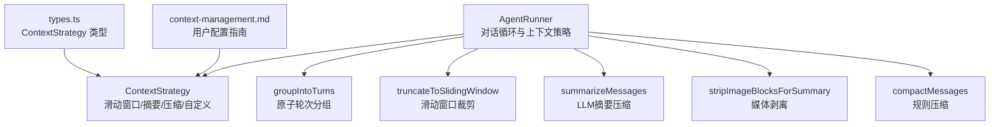
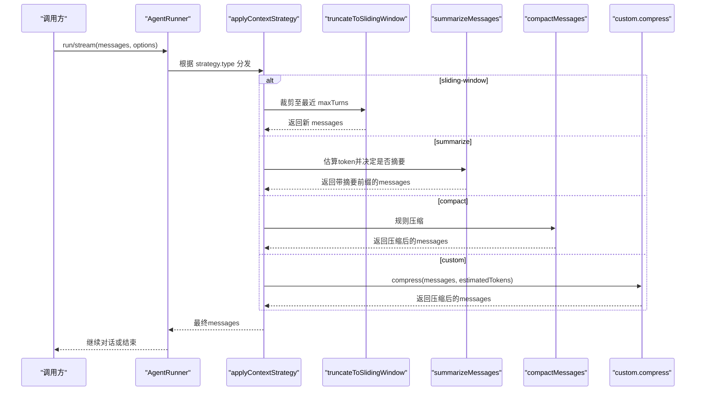
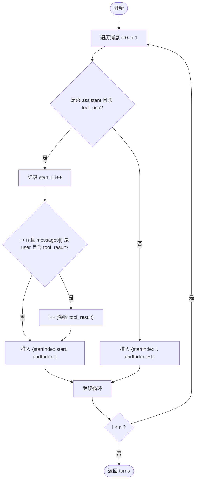
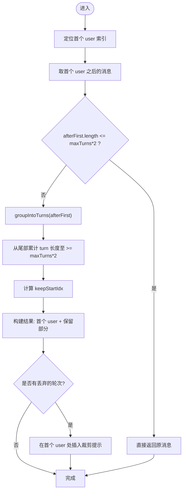
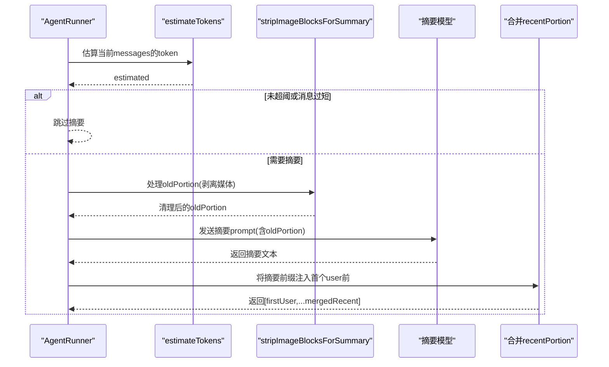
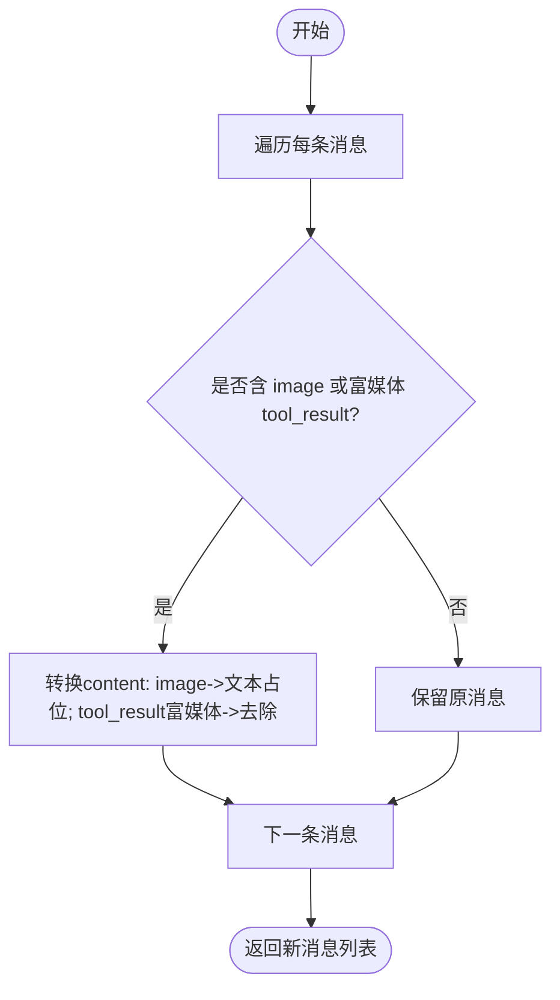
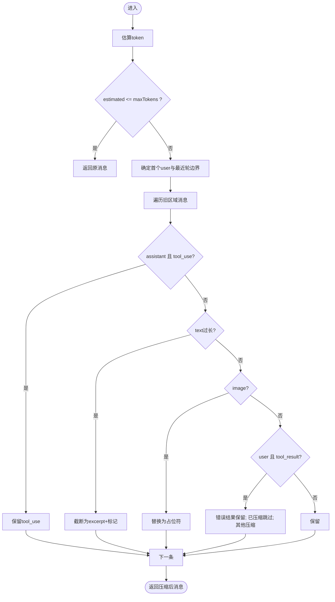
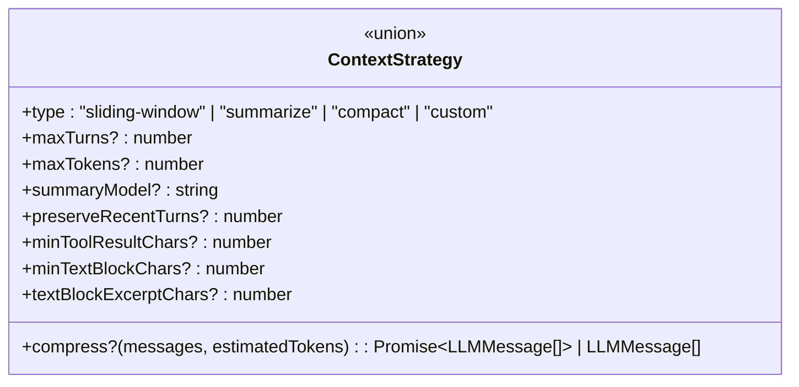
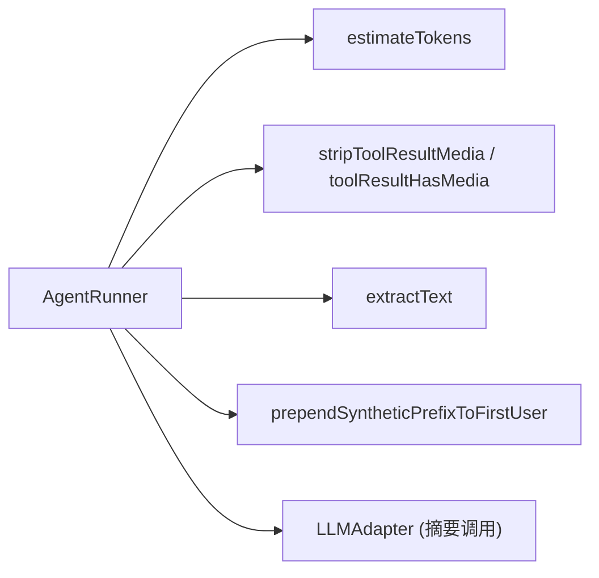

# 对话管理

<cite>
**本文引用的文件**
- [runner.ts](file://packages/core/src/agent/runner.ts)
- [types.ts](file://packages/core/src/types.ts)
- [context-management.md](file://docs/context-management.md)
</cite>

## 目录
1. [简介](#简介)
2. [项目结构](#项目结构)
3. [核心组件](#核心组件)
4. [架构总览](#架构总览)
5. [详细组件分析](#详细组件分析)
6. [依赖关系分析](#依赖关系分析)
7. [性能考量](#性能考量)
8. [故障排查指南](#故障排查指南)
9. [结论](#结论)
10. [附录](#附录)

## 简介
本文件深入解析对话管理机制，聚焦以下能力：
- 消息历史维护与上下文保持策略
- 将扁平消息数组分组为原子对话轮次的 groupIntoTurns
- 通过滑动窗口 truncateToSlidingWindow 控制对话长度
- 使用 LLM 生成摘要的 summarizeMessages 压缩旧对话
- 媒体内容剥离 stripImageBlocksForSummary 防止大文件影响性能
- ContextStrategy 的配置选项与自定义实现方法

## 项目结构
对话管理的核心逻辑集中在 AgentRunner 中，类型定义在 types.ts，用户文档在 docs/context-management.md。整体组织方式以“功能模块 + 类型契约”为主：
- runner.ts：实现对话循环、工具调用、上下文策略（滑动窗口/摘要/规则压缩/自定义）
- types.ts：定义 ContextStrategy 等类型契约
- context-management.md：面向用户的配置说明与最佳实践

图表来源
- [runner.ts:492-542](file://packages/core/src/agent/runner.ts#L492-L542)
- [runner.ts:683-805](file://packages/core/src/agent/runner.ts#L683-L805)
- [runner.ts:334-359](file://packages/core/src/agent/runner.ts#L334-L359)
- [runner.ts:375-390](file://packages/core/src/agent/runner.ts#L375-L390)
- [runner.ts:1576-1728](file://packages/core/src/agent/runner.ts#L1576-L1728)
- [types.ts:192-219](file://packages/core/src/types.ts#L192-L219)
- [context-management.md:1-23](file://docs/context-management.md#L1-L23)

章节来源
- [runner.ts:492-542](file://packages/core/src/agent/runner.ts#L492-L542)
- [runner.ts:683-805](file://packages/core/src/agent/runner.ts#L683-L805)
- [types.ts:192-219](file://packages/core/src/types.ts#L192-L219)
- [context-management.md:1-23](file://docs/context-management.md#L1-L23)

## 核心组件
- groupIntoTurns：将扁平消息序列按“助手+工具调用+工具结果”的原子对进行分组，避免拆分 tool_use/tool_result 对。
- truncateToSlidingWindow：基于最近 N 轮（maxTurns）的滑动窗口裁剪历史，保证不破坏原子轮次。
- summarizeMessages：当超过 token 阈值时，调用摘要模型对旧对话进行压缩，保留近期对话并注入摘要前缀。
- stripImageBlocksForSummary：在摘要前剥离图像与富媒体内容，替换为占位文本，避免 base64 膨胀导致上下文爆炸。
- compactMessages：规则型压缩，保留决策（tool_use）、错误结果，截断长文本与富媒体，保护最近若干轮。
- ContextStrategy：统一上下文策略接口，支持滑动窗口、摘要、规则压缩与自定义压缩回调。

章节来源
- [runner.ts:334-359](file://packages/core/src/agent/runner.ts#L334-L359)
- [runner.ts:492-542](file://packages/core/src/agent/runner.ts#L492-L542)
- [runner.ts:683-805](file://packages/core/src/agent/runner.ts#L683-L805)
- [runner.ts:375-390](file://packages/core/src/agent/runner.ts#L375-L390)
- [runner.ts:1576-1728](file://packages/core/src/agent/runner.ts#L1576-L1728)
- [types.ts:192-219](file://packages/core/src/types.ts#L192-L219)

## 架构总览
AgentRunner 在每次 LLM 调用前应用上下文策略，确保对话长度与 token 预算可控。策略选择由 RunnerOptions.contextStrategy 决定，内部通过 applyContextStrategy 分发到具体实现。

图表来源
- [runner.ts:773-805](file://packages/core/src/agent/runner.ts#L773-L805)
- [runner.ts:492-542](file://packages/core/src/agent/runner.ts#L492-L542)
- [runner.ts:683-771](file://packages/core/src/agent/runner.ts#L683-L771)
- [runner.ts:1576-1728](file://packages/core/src/agent/runner.ts#L1576-L1728)

## 详细组件分析

### groupIntoTurns：原子对话轮次分组
- 目标：将扁平消息数组划分为“原子轮次”，确保 assistant 的 tool_use 与其对应的 user tool_result 不被拆分。
- 行为：
  - 扫描消息，若当前是 assistant 且包含 tool_use，则将其与紧随其后的 user tool_result 合并为一个 turn。
  - 否则每个消息自成一轮。
- 复杂度：单次线性扫描 O(n)。
- 作用：后续滑动窗口与摘要均基于此分组，避免破坏 tool_use/tool_result 的完整性。

图表来源
- [runner.ts:334-359](file://packages/core/src/agent/runner.ts#L334-L359)

章节来源
- [runner.ts:334-359](file://packages/core/src/agent/runner.ts#L334-L359)

### truncateToSlidingWindow：滑动窗口机制
- 目标：仅保留最近的 N 轮对话，避免超出模型上下文限制。
- 行为：
  - 定位首个 user 消息，始终保留。
  - 对首个 user 之后的消息，按“消息对”语义累计，直到达到 target = maxTurns * 2。
  - 使用 groupIntoTurns 确保不拆分 tool_use/tool_result 对。
  - 若丢弃了历史，会在首个 user 处插入提示性前缀，告知历史被裁剪。
- 复杂度：O(n)，其中 n 为消息数。
- 适用场景：最轻量、成本最低的上下文控制。

图表来源
- [runner.ts:492-542](file://packages/core/src/agent/runner.ts#L492-L542)
- [runner.ts:334-359](file://packages/core/src/agent/runner.ts#L334-L359)

章节来源
- [runner.ts:492-542](file://packages/core/src/agent/runner.ts#L492-L542)

### summarizeMessages：LLM 摘要压缩
- 目标：当对话超过 token 阈值时，用摘要模型压缩旧对话，节省 token 并维持上下文连贯性。
- 行为：
  - 估算 token，若未超阈或消息过短则跳过。
  - 分割为 oldPortion（待摘要）与 recentPortion（保留）。
  - 对 oldPortion 调用 stripImageBlocksForSummary 剥离媒体，再序列化后发送给摘要模型。
  - 将摘要结果作为前缀注入到首个 user 消息之前，与 recentPortion 合并。
  - 缓存摘要签名，避免重复计算。
- 复杂度：取决于消息规模与摘要模型调用；I/O 密集。
- 注意事项：
  - 摘要模型可独立配置 summaryModel。
  - 媒体内容会被替换为描述性占位符，避免 base64 膨胀。

图表来源
- [runner.ts:683-771](file://packages/core/src/agent/runner.ts#L683-L771)
- [runner.ts:375-390](file://packages/core/src/agent/runner.ts#L375-L390)

章节来源
- [runner.ts:683-771](file://packages/core/src/agent/runner.ts#L683-L771)
- [runner.ts:375-390](file://packages/core/src/agent/runner.ts#L375-L390)

### stripImageBlocksForSummary：媒体内容剥离
- 目标：在摘要前移除图像与富媒体内容，防止 base64 数据导致 prompt 膨胀。
- 行为：
  - 遍历消息，若包含 image 或富媒体 tool_result，则替换为文本占位符或移除富媒体内容。
  - 保留非媒体块不变。
- 效果：大幅降低摘要请求的 token 消耗，同时仍让摘要模型知道该轮存在媒体。

图表来源
- [runner.ts:375-390](file://packages/core/src/agent/runner.ts#L375-L390)

章节来源
- [runner.ts:375-390](file://packages/core/src/agent/runner.ts#L375-L390)

### compactMessages：规则型上下文压缩
- 目标：在不调用额外 LLM 的情况下，按规则压缩旧对话，保留关键骨架。
- 行为：
  - 估算 token，低于阈值则跳过。
  - 保护首个 user 与最近 preserveRecentTurns 轮完整。
  - 对旧区域：
    - assistant 的 tool_use 始终保留（决策）。
    - 长文本块截断为 head excerpt + 标记。
    - 图像块替换为占位符。
    - tool_result 中错误结果永远保留；已压缩的结果不再重复压缩。
- 复杂度：O(n)。

图表来源
- [runner.ts:1576-1728](file://packages/core/src/agent/runner.ts#L1576-L1728)

章节来源
- [runner.ts:1576-1728](file://packages/core/src/agent/runner.ts#L1576-L1728)

### ContextStrategy：配置与自定义实现
- 类型定义：
  - sliding-window：保留最近 maxTurns 轮。
  - summarize：当超过 maxTokens 时，调用摘要模型压缩旧对话，可选 summaryModel。
  - compact：规则压缩，参数包括 maxTokens、preserveRecentTurns、minToolResultChars、minTextBlockChars、textBlockExcerptChars。
  - custom：提供 compress(messages, estimatedTokens) 回调，必须返回非空 LLMMessage[]。
- 使用位置：RunnerOptions.contextStrategy 传入，内部 applyContextStrategy 分发执行。

图表来源
- [types.ts:192-219](file://packages/core/src/types.ts#L192-L219)

章节来源
- [types.ts:192-219](file://packages/core/src/types.ts#L192-L219)
- [runner.ts:773-805](file://packages/core/src/agent/runner.ts#L773-L805)

## 依赖关系分析
- AgentRunner 依赖：
  - estimateTokens：用于触发阈值判断（滑动窗口/摘要/规则压缩）。
  - stripToolResultMedia / toolResultHasMedia：用于富媒体检测与剥离。
  - extractText：提取摘要模型的纯文本输出。
  - prependSyntheticPrefixToFirstUser：在首个 user 前注入提示或摘要。
- 外部集成：
  - LLMAdapter：用于实际摘要调用（summarizeMessages）。
  - ToolRegistry / ToolExecutor：在对话循环中执行工具调用（与本主题间接相关）。

图表来源
- [runner.ts:683-771](file://packages/core/src/agent/runner.ts#L683-L771)
- [runner.ts:375-390](file://packages/core/src/agent/runner.ts#L375-L390)

章节来源
- [runner.ts:683-771](file://packages/core/src/agent/runner.ts#L683-L771)
- [runner.ts:375-390](file://packages/core/src/agent/runner.ts#L375-L390)

## 性能考量
- 滑动窗口：零额外 LLM 调用，开销最小，适合稳定控制上下文长度。
- 摘要压缩：引入一次额外 LLM 调用，但能显著减少旧对话 token；建议配合 stripImageBlocksForSummary 避免媒体膨胀。
- 规则压缩：无额外 LLM 调用，适合快速削减长文本与富媒体，同时保留关键决策与错误信息。
- 自定义压缩：灵活但需自行保证性能与正确性；应谨慎处理媒体与大对象。

## 故障排查指南
- 摘要无效或过大：
  - 检查是否启用了 stripImageBlocksForSummary，避免 base64 图片进入摘要 prompt。
  - 确认 summaryModel 可用且未被 tools 干扰（摘要调用会关闭 tools）。
- 滑动窗口误删关键信息：
  - 调整 maxTurns，确保保留足够多的最近轮次。
  - 注意首个 user 始终保留，历史裁剪会插入提示前缀。
- 规则压缩丢失重要细节：
  - 调小 minTextBlockChars 或 textBlockExcerptChars 以保留更多上下文。
  - 确保 preserveRecentTurns 足够大，避免压缩到关键轮次。
- 自定义压缩异常：
  - 确保 compress 返回非空 LLMMessage[]，否则会抛出错误。
  - 验证 estimatedTokens 的使用，避免不必要的压缩。

章节来源
- [runner.ts:683-805](file://packages/core/src/agent/runner.ts#L683-L805)
- [runner.ts:492-542](file://packages/core/src/agent/runner.ts#L492-L542)
- [runner.ts:1576-1728](file://packages/core/src/agent/runner.ts#L1576-L1728)

## 结论
对话管理机制通过 groupIntoTurns、滑动窗口、LLM 摘要与规则压缩等多层策略，在保证 tool_use/tool_result 完整性的前提下，有效控制上下文长度与 token 消耗。ContextStrategy 提供了统一的扩展点，便于在不同场景下选择合适的策略或自定义实现。结合 stripImageBlocksForSummary 与规则压缩，可在不牺牲关键信息的前提下最大化节省 token。

## 附录
- 用户配置参考：见 context-management.md 中的策略选择与工具结果压缩说明。
- 类型契约：见 types.ts 中 ContextStrategy 的定义。
- 实现细节：见 runner.ts 中各方法的注释与实现。

章节来源
- [context-management.md:1-23](file://docs/context-management.md#L1-L23)
- [types.ts:192-219](file://packages/core/src/types.ts#L192-L219)
- [runner.ts:334-359](file://packages/core/src/agent/runner.ts#L334-L359)
- [runner.ts:492-542](file://packages/core/src/agent/runner.ts#L492-L542)
- [runner.ts:683-805](file://packages/core/src/agent/runner.ts#L683-L805)
- [runner.ts:1576-1728](file://packages/core/src/agent/runner.ts#L1576-L1728)