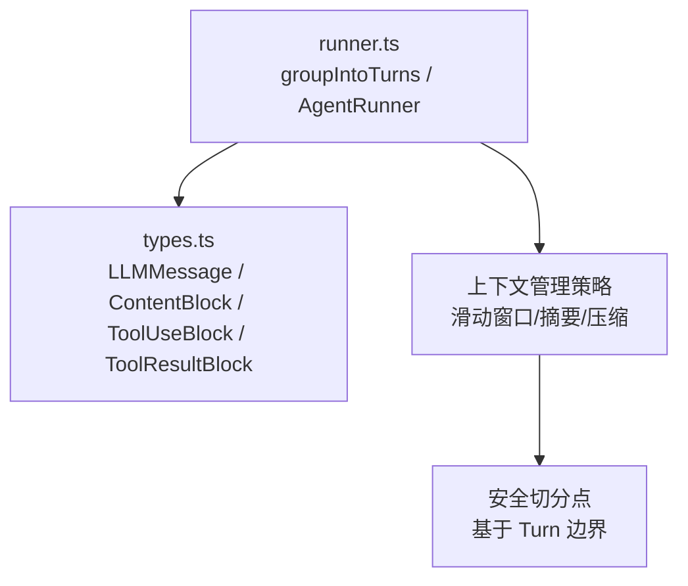
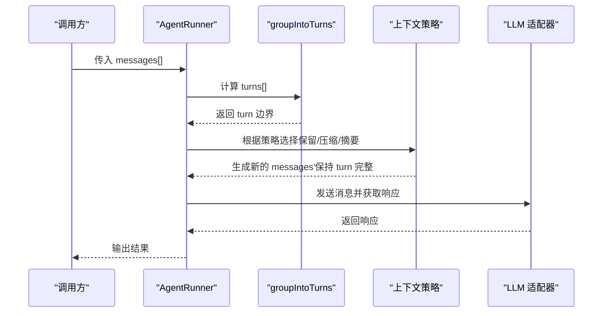
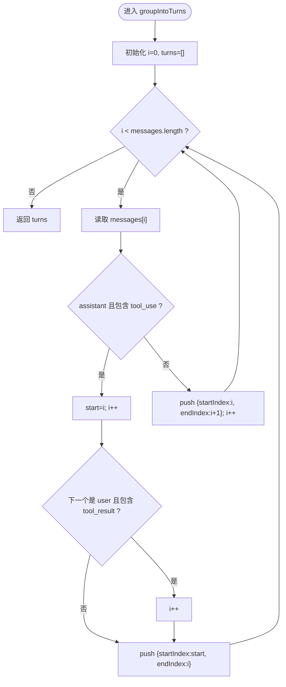
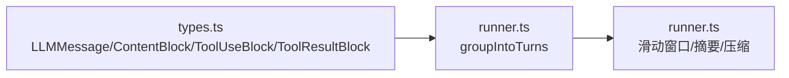

# 消息分组机制

<cite>
**本文引用的文件**
- [runner.ts](file://packages/core/src/agent/runner.ts)
- [types.ts](file://packages/core/src/types.ts)
</cite>

## 目录
1. [简介](#简介)
2. [项目结构](#项目结构)
3. [核心组件](#核心组件)
4. [架构总览](#架构总览)
5. [详细组件分析](#详细组件分析)
6. [依赖分析](#依赖分析)
7. [性能考虑](#性能考虑)
8. [故障排查指南](#故障排查指南)
9. [结论](#结论)
10. [附录：场景示例与边界条件](#附录：场景示例与边界条件)

## 简介
本文件聚焦于将扁平的消息数组按“原子对话轮次”进行分组的实现原理，重点解析 groupIntoTurns 函数如何保证 tool_use 与 tool_result 的配对不被拆分到不同轮次中。同时说明 Turn 接口的设计（startIndex、endIndex 的作用），以及该分组策略如何避免 API 拒绝孤立的 tool_use_id 引用问题。文末提供多种场景下的分组结果示意，帮助读者理解纯文本对话、工具调用对话和混合对话的处理方式。

## 项目结构
- 核心逻辑位于 packages/core/src/agent/runner.ts，包含 AgentRunner 及内部辅助函数，其中 groupIntoTurns 是消息分组的关键实现。
- 类型定义集中在 packages/core/src/types.ts，定义了 LLMMessage、ContentBlock、ToolUseBlock、ToolResultBlock 等数据结构，为分组逻辑提供数据契约。

图表来源
- [runner.ts:311-359](file://packages/core/src/agent/runner.ts#L311-L359)
- [types.ts:71-172](file://packages/core/src/types.ts#L71-L172)

章节来源
- [runner.ts:311-359](file://packages/core/src/agent/runner.ts#L311-L359)
- [types.ts:71-172](file://packages/core/src/types.ts#L71-L172)

## 核心组件
- Turn 接口：用 startIndex（含）与 endIndex（不含）表示一个原子轮次的消息区间，便于后续在任意位置安全切分而不破坏 tool_use/tool_result 的完整性。
- groupIntoTurns：遍历扁平消息数组，识别 assistant 消息中的 tool_use 块，若存在则把紧随其后的 user 消息（包含 tool_result）一并纳入同一轮次；否则每个单条消息自成一轮次。
- 使用方：AgentRunner 的滑动窗口截断、摘要压缩等上下文管理策略均基于 Turn 边界进行切分，确保不会将 tool_use 与其对应的 tool_result 拆散。

章节来源
- [runner.ts:311-359](file://packages/core/src/agent/runner.ts#L311-L359)
- [runner.ts:492-542](file://packages/core/src/agent/runner.ts#L492-L542)
- [types.ts:71-172](file://packages/core/src/types.ts#L71-L172)

## 架构总览
下图展示了消息从输入到分组、再到上下文管理的整体流程，强调以 Turn 为单位的切分策略。

图表来源
- [runner.ts:311-359](file://packages/core/src/agent/runner.ts#L311-L359)
- [runner.ts:492-542](file://packages/core/src/agent/runner.ts#L492-L542)

## 详细组件分析

### groupIntoTurns 算法与数据流
- 输入：LLMMessage[] 扁平消息数组
- 输出：Turn[]，每个 Turn 表示一个不可再分的原子轮次区间 [startIndex, endIndex)
- 关键规则：
  - 如果当前消息是 assistant 且 content 中包含至少一个 tool_use 块，则开启一个“工具调用轮次”，并将紧随其后的 user 消息（当且仅当其 content 中包含 tool_result 块）吸收进同一轮次，从而保证 tool_use 与 tool_result 成对出现。
  - 其他情况（普通用户或助手文本消息）各自成为独立轮次。
- 复杂度：单次线性扫描 O(n)，空间 O(k) 存储 turns（k 为轮次数）。

图表来源
- [runner.ts:334-359](file://packages/core/src/agent/runner.ts#L334-L359)

章节来源
- [runner.ts:334-359](file://packages/core/src/agent/runner.ts#L334-L359)

### Turn 接口设计
- startIndex：轮次起始索引（包含）
- endIndex：轮次结束索引（不包含）
- 作用：
  - 为上层策略提供安全的切分边界，避免在 tool_use 与 tool_result 之间切割。
  - 支持滑动窗口、摘要、压缩等多种上下文管理策略统一以“轮次”为单位操作消息数组。

章节来源
- [runner.ts:311-318](file://packages/core/src/agent/runner.ts#L311-L318)

### 与上下文管理策略的集成
- 滑动窗口截断：从尾部累积消息数量，直到达到目标阈值，但必须沿 turn 边界切分，确保不拆分 tool_use/tool_result 对。
- 摘要压缩：将历史消息分段并通过模型摘要，同样遵循 turn 边界，避免产生孤立 tool_use_id。
- 压缩旧消息：对旧区域的 tool_result 进行选择性压缩，保留错误结果与关键信息，同时维持 tool_use_id 的一致性。

章节来源
- [runner.ts:492-542](file://packages/core/src/agent/runner.ts#L492-L542)
- [runner.ts:683-771](file://packages/core/src/agent/runner.ts#L683-L771)
- [runner.ts:1624-1698](file://packages/core/src/agent/runner.ts#L1624-L1698)

### 为什么能避免 API 拒绝孤立 tool_use_id
- Anthropic/OpenAI 等 API 要求 tool_result 必须引用有效的 tool_use_id，若消息被错误切分导致 tool_use 与 tool_result 分离，会触发校验失败。
- groupIntoTurns 将 tool_use 与紧随其后的 tool_result 绑定在同一 turn 内，任何基于 turn 边界的切分都不会将它们拆开，从而从根本上避免孤立引用问题。

章节来源
- [runner.ts:320-333](file://packages/core/src/agent/runner.ts#L320-L333)

## 依赖分析
- runner.ts 依赖 types.ts 中的消息与内容块类型，确保分组逻辑与数据契约一致。
- AgentRunner 的其他方法（滑动窗口、摘要、压缩）都依赖 groupIntoTurns 提供的 turn 边界，形成稳定的分层依赖。

图表来源
- [types.ts:71-172](file://packages/core/src/types.ts#L71-L172)
- [runner.ts:311-359](file://packages/core/src/agent/runner.ts#L311-L359)
- [runner.ts:492-542](file://packages/core/src/agent/runner.ts#L492-L542)

章节来源
- [types.ts:71-172](file://packages/core/src/types.ts#L71-L172)
- [runner.ts:311-359](file://packages/core/src/agent/runner.ts#L311-L359)
- [runner.ts:492-542](file://packages/core/src/agent/runner.ts#L492-L542)

## 性能考虑
- 时间复杂度：groupIntoTurns 为 O(n)，适合长对话的高效处理。
- 空间复杂度：turns 列表大小为 O(k)，k 通常远小于 n。
- 切分策略：基于 turn 的切分避免了重复扫描与复杂判断，减少不必要的内存分配。
- 建议：在超长对话中优先使用滑动窗口或摘要策略，结合 turn 边界控制上下文大小，降低 token 成本与超时风险。

[本节为通用性能讨论，无需特定文件引用]

## 故障排查指南
- 现象：API 报错提示孤立 tool_use_id 引用。
  - 可能原因：消息被按原始条数切分而非按 turn 边界切分。
  - 解决：确保所有切分逻辑使用 groupIntoTurns 返回的 turn 边界。
- 现象：tool_result 丢失或被误删。
  - 可能原因：自定义压缩/摘要逻辑未尊重 turn 边界。
  - 解决：在压缩/摘要前，先按 turn 划分，再对每个 turn 单独处理。
- 现象：对话状态不一致。
  - 可能原因：在中间位置插入或删除消息时破坏了 turn 连续性。
  - 解决：维护消息数组时，尽量在 turn 边界处进行增删改。

章节来源
- [runner.ts:320-333](file://packages/core/src/agent/runner.ts#L320-L333)
- [runner.ts:492-542](file://packages/core/src/agent/runner.ts#L492-L542)

## 结论
groupIntoTurns 通过识别 assistant 消息中的 tool_use 块，并将其与紧随其后的 tool_result 绑定在同一 turn 中，提供了安全的原子轮次边界。配合滑动窗口、摘要与压缩等上下文管理策略，能够在长对话中有效避免孤立 tool_use_id 导致的 API 拒绝问题，同时保持对话语义的完整性与可解释性。

[本节为总结性内容，无需特定文件引用]

## 附录：场景示例与边界条件
以下示例展示不同场景下 groupIntoTurns 的输出（以索引区间表示），帮助理解分组行为。注意：以下为概念性示例，实际实现请参考源码路径。

- 纯文本对话
  - 输入：user(text), assistant(text), user(text), assistant(text)
  - 分组：每轮一条消息，turn 区间分别为 [0,1), [1,2), [2,3), [3,4)
  - 参考路径：[runner.ts:334-359](file://packages/core/src/agent/runner.ts#L334-L359)

- 工具调用对话
  - 输入：assistant(tool_use...), user(tool_result...)
  - 分组：两者合并为一个 turn，区间为 [0,2)
  - 参考路径：[runner.ts:334-359](file://packages/core/src/agent/runner.ts#L334-L359)

- 混合对话
  - 输入：user(text), assistant(tool_use...), user(tool_result...), assistant(text), user(text)
  - 分组：
    - [0,1): user(text)
    - [1,3): assistant(tool_use) + user(tool_result)
    - [3,4): assistant(text)
    - [4,5): user(text)
  - 参考路径：[runner.ts:334-359](file://packages/core/src/agent/runner.ts#L334-L359)

- 边界条件
  - assistant 有 tool_use 但无紧随的 user(tool_result)：仍视为一个 turn，区间为 [i, i+1)
  - 多个连续的 tool_use/tool_result 对：每对各自形成一个 turn
  - 空消息数组：返回空 turns 列表

章节来源
- [runner.ts:334-359](file://packages/core/src/agent/runner.ts#L334-L359)