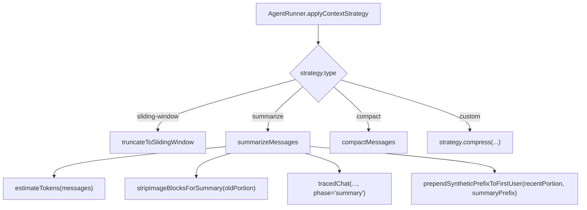
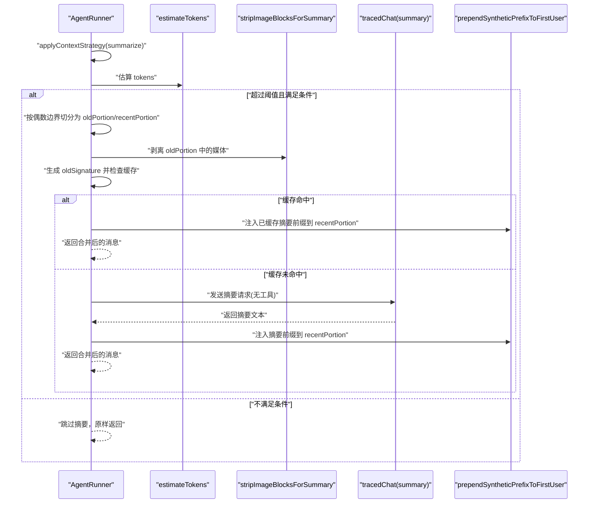
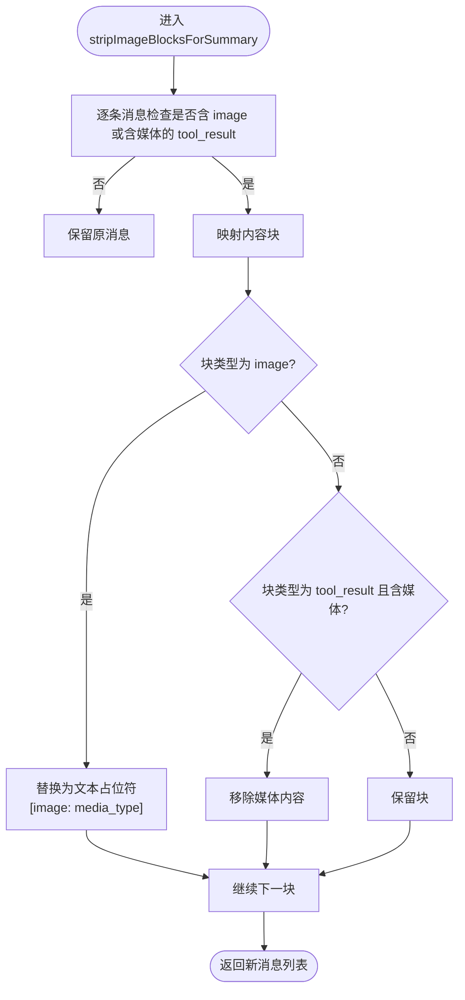
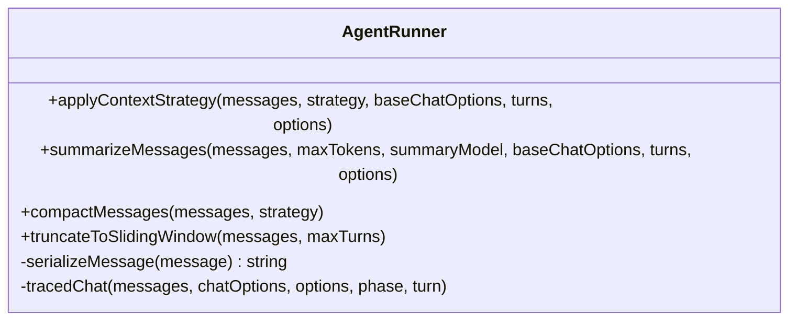
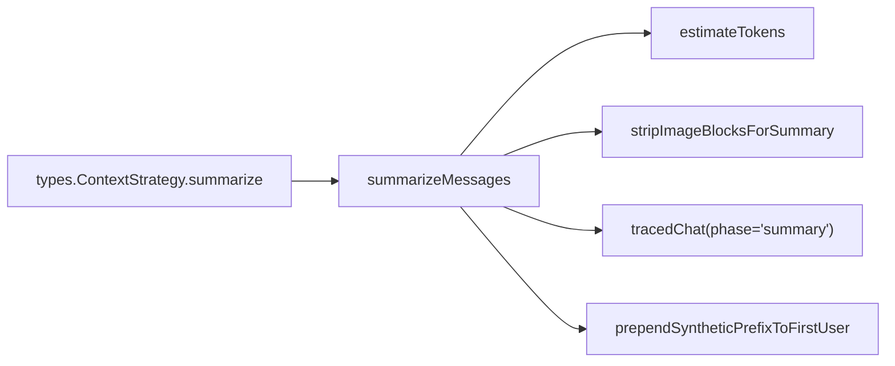

# 消息摘要压缩

<cite>
**本文引用的文件**
- [runner.ts](file://packages/core/src/agent/runner.ts)
- [tokens.ts](file://packages/core/src/utils/tokens.ts)
- [types.ts](file://packages/core/src/types.ts)
- [context-strategy.test.ts](file://packages/core/tests/context-strategy.test.ts)
</cite>

## 目录
1. [简介](#简介)
2. [项目结构](#项目结构)
3. [核心组件](#核心组件)
4. [架构总览](#架构总览)
5. [详细组件分析](#详细组件分析)
6. [依赖关系分析](#依赖关系分析)
7. [性能考量](#性能考量)
8. [故障排查指南](#故障排查指南)
9. [结论](#结论)
10. [附录](#附录)

## 简介
本文围绕 AgentRunner 中的 summarizeMessages 函数，系统解析“消息摘要压缩”机制：何时触发、如何分割历史与近期对话、如何保证工具调用完整性、如何处理媒体内容以避免大文件影响摘要性能、摘要提示词设计要点、缓存机制避免重复摘要相同历史、自定义摘要模型配置与最佳实践，以及质量评估与调试技巧。

## 项目结构
- 摘要逻辑集中在 runner.ts 的 AgentRunner 中，通过 applyContextStrategy 路由到 summarize 策略。
- token 估算使用轻量启发式 estimateTokens（tokens.ts），不依赖具体模型的 tokenizer。
- 上下文策略类型定义在 types.ts，包括 sliding-window、summarize、compact 和 custom。
- 行为验证由 context-strategy.test.ts 覆盖，尤其针对图片附件泄漏等边界场景。

图表来源
- [runner.ts:683-771](file://packages/core/src/agent/runner.ts#L683-L771)
- [runner.ts:773-805](file://packages/core/src/agent/runner.ts#L773-L805)
- [tokens.ts:8-30](file://packages/core/src/utils/tokens.ts#L8-L30)

章节来源
- [runner.ts:683-805](file://packages/core/src/agent/runner.ts#L683-L805)
- [tokens.ts:8-30](file://packages/core/src/utils/tokens.ts#L8-L30)
- [types.ts:191-219](file://packages/core/src/types.ts#L191-L219)

## 核心组件
- summarizeMessages：实现基于 LLM 的历史摘要压缩，负责触发判断、旧/新分段、媒体剥离、提示构建、缓存命中与合并。
- stripImageBlocksForSummary：将旧段中的 image 与含媒体的 tool_result 替换为占位文本，防止 base64 数据进入摘要提示。
- estimateTokens：轻量字符启发式估算 token，用于阈值判断。
- prependSyntheticPrefixToFirstUser：在首个 user 前插入合成前缀，避免连续 user 轮次并承载摘要文本。
- applyContextStrategy：根据策略类型分发到不同压缩方式。

章节来源
- [runner.ts:368-390](file://packages/core/src/agent/runner.ts#L368-L390)
- [runner.ts:405-428](file://packages/core/src/agent/runner.ts#L405-L428)
- [runner.ts:683-771](file://packages/core/src/agent/runner.ts#L683-L771)
- [runner.ts:773-805](file://packages/core/src/agent/runner.ts#L773-L805)
- [tokens.ts:8-30](file://packages/core/src/utils/tokens.ts#L8-L30)

## 架构总览
摘要压缩的整体流程如下：
- 在进入每轮 LLM 调用前，若启用 summarize 策略，则先估算当前消息的 token 数。
- 当估算超过 maxTokens 且消息数大于等于 4，并且存在有效的用户首条消息与后续多轮交互时，执行摘要。
- 以“偶数边界”切分 rest（user/assistant 对）为 oldPortion 与 recentPortion，确保不会拆分 tool_use/tool_result 成对。
- 对 oldPortion 进行媒体剥离后生成签名，检查缓存；命中则直接复用摘要前缀。
- 未命中则构造摘要提示，调用 tracedChat(phase='summary')，得到摘要文本并写入缓存。
- 将摘要前缀注入到 recentPortion 的首个 user 之前，返回新的消息序列。

图表来源
- [runner.ts:683-771](file://packages/core/src/agent/runner.ts#L683-L771)
- [runner.ts:773-805](file://packages/core/src/agent/runner.ts#L773-L805)
- [tokens.ts:8-30](file://packages/core/src/utils/tokens.ts#L8-L30)

## 详细组件分析

### 触发条件与分割策略
- 触发条件：
  - 估算 token 超过策略配置的 maxTokens。
  - 消息总数至少为 4。
  - 必须存在首个 user 消息，且其后还有至少一轮交互（rest.length >= 2）。
- 分割策略：
  - 从首个 user 之后开始计算 rest，按“偶数边界”切分：splitAt = Math.max(2, floor(rest.length / 4) * 2)。
  - 该策略保证不会把 assistant 的 tool_use 与其对应的 user tool_result 拆开，从而保持工具调用完整性。
  - oldPortion 进入摘要流程，recentPortion 保持原样并在末尾注入摘要前缀。

章节来源
- [runner.ts:691-711](file://packages/core/src/agent/runner.ts#L691-L711)

### 媒体内容处理：stripImageBlocksForSummary
- 目的：防止 base64 图像或工具结果中的媒体被序列化进摘要提示，导致 token 暴涨甚至上下文超限。
- 处理方式：
  - 遍历消息，若包含 image 或含媒体的 tool_result，则对该消息的内容块逐一处理。
  - image 块替换为文本占位符，保留媒体类型信息以便摘要可提及。
  - 含媒体的 tool_result 通过 stripToolResultMedia 移除媒体部分，仅保留文本。
- 注意：仅对 oldPortion 做剥离；recentPortion 不会被序列化，因此保持原样。

图表来源
- [runner.ts:368-390](file://packages/core/src/agent/runner.ts#L368-L390)

章节来源
- [runner.ts:368-390](file://packages/core/src/agent/runner.ts#L368-L390)

### 摘要提示词设计与关键要素
- 提示词目标：面向 LLM 的对话历史摘要，强调保留用户目标、约束与决策，保留关键工具输出与未决问题，使用简洁要点，禁止捏造细节。
- 输入组织：
  - 单条 user 消息，包含两段文本：摘要指令 + 经序列化拼接的 oldPortion 文本。
- 输出处理：
  - 提取纯文本作为摘要前缀，封装为 [Conversation summary]... 形式。
  - 若为空，则回退为不可用标记。
- 选项设置：
  - 关闭 tools，避免摘要阶段产生工具调用。
  - 模型优先使用策略提供的 summaryModel，否则回退到默认模型。

章节来源
- [runner.ts:729-755](file://packages/core/src/agent/runner.ts#L729-L755)
- [runner.ts:757-770](file://packages/core/src/agent/runner.ts#L757-L770)

### 缓存机制：summarizeCache
- 作用：避免对相同的旧历史重复调用摘要模型，降低延迟与成本。
- 键生成：oldPortion 经媒体剥离后，序列化每条消息并以换行拼接，形成 oldSignature。
- 命中逻辑：若缓存中存在相同 oldSignature，则直接复用其 summaryPrefix，将其注入到 recentPortion 的首个 user 之前。
- 更新逻辑：首次成功摘要后，将 { oldSignature, summaryPrefix } 写入缓存。

章节来源
- [runner.ts:720-727](file://packages/core/src/agent/runner.ts#L720-L727)
- [runner.ts:762-770](file://packages/core/src/agent/runner.ts#L762-L770)

### 最近段注入：prependSyntheticPrefixToFirstUser
- 作用：将摘要前缀安全地注入到 recentPortion 的第一个 user 之前，避免连续 user 轮次（某些后端限制）并确保摘要不与原始用户提示拼接。
- 行为：
  - 若无 user 消息，则在开头插入一条 assistant 文本作为前缀。
  - 若有 user 消息，则将前缀与该 user 的消息内容合并。

章节来源
- [runner.ts:405-428](file://packages/core/src/agent/runner.ts#L405-L428)

### 上下文策略路由
- applyContextStrategy 根据 strategy.type 选择不同压缩方式：
  - sliding-window：滑动窗口截断。
  - summarize：调用 summarizeMessages。
  - compact：规则化压缩。
  - custom：调用自定义 compress 回调。

章节来源
- [runner.ts:773-805](file://packages/core/src/agent/runner.ts#L773-L805)

### 类图：AgentRunner 相关方法

图表来源
- [runner.ts:488-490](file://packages/core/src/agent/runner.ts#L488-L490)
- [runner.ts:492-542](file://packages/core/src/agent/runner.ts#L492-L542)
- [runner.ts:584-679](file://packages/core/src/agent/runner.ts#L584-L679)
- [runner.ts:683-771](file://packages/core/src/agent/runner.ts#L683-L771)
- [runner.ts:773-805](file://packages/core/src/agent/runner.ts#L773-L805)
- [runner.ts:1576-1698](file://packages/core/src/agent/runner.ts#L1576-L1698)

## 依赖关系分析
- summarizeMessages 依赖：
  - estimateTokens：轻量 token 估算，决定触发阈值。
  - stripImageBlocksForSummary：媒体剥离，保障摘要提示体积可控。
  - tracedChat：统一带追踪与超时的模型调用，phase='summary'。
  - prependSyntheticPrefixToFirstUser：安全注入摘要前缀。
- 类型依赖：
  - ContextStrategy 的 summarize 变体提供 maxTokens 与可选 summaryModel。
  - LLMMessage/ContentBlock 等类型贯穿消息处理链路。

图表来源
- [runner.ts:683-771](file://packages/core/src/agent/runner.ts#L683-L771)
- [tokens.ts:8-30](file://packages/core/src/utils/tokens.ts#L8-L30)
- [types.ts:191-194](file://packages/core/src/types.ts#L191-L194)

章节来源
- [runner.ts:683-771](file://packages/core/src/agent/runner.ts#L683-L771)
- [tokens.ts:8-30](file://packages/core/src/utils/tokens.ts#L8-L30)
- [types.ts:191-194](file://packages/core/src/types.ts#L191-L194)

## 性能考量
- 触发阈值：
  - 使用 estimateTokens 的字符启发式（约 4 字符/token）快速估算，避免引入重型 tokenizer。
  - 仅在超过 maxTokens 且消息数足够时触发，减少不必要的摘要开销。
- 媒体剥离：
  - 对 oldPortion 中的 image 与含媒体 tool_result 进行剥离，避免 base64 数据进入摘要提示，显著降低 token 膨胀风险。
- 缓存命中：
  - 通过 oldSignature 精确匹配旧历史，命中后零额外模型调用，直接复用摘要前缀。
- 最近段保护：
  - recentPortion 不被序列化进摘要提示，保持最新上下文完整，提升响应质量。
- 工具调用完整性：
  - 按偶数边界切分，确保 tool_use/tool_result 成对，避免破坏工具调用语义。

章节来源
- [tokens.ts:8-30](file://packages/core/src/utils/tokens.ts#L8-L30)
- [runner.ts:368-390](file://packages/core/src/agent/runner.ts#L368-L390)
- [runner.ts:691-711](file://packages/core/src/agent/runner.ts#L691-L711)
- [runner.ts:720-727](file://packages/core/src/agent/runner.ts#L720-L727)

## 故障排查指南
- 常见问题定位：
  - 摘要未触发：检查 estimateTokens 估算值与 maxTokens 的关系，确认消息数与首条 user 是否存在。
  - 摘要提示过大：确认 stripImageBlocksForSummary 是否生效，避免 base64 泄漏。
  - 工具调用断裂：确认 splitAt 是否为偶数边界，避免拆分 tool_use/tool_result。
  - 重复摘要：检查 summarizeCache 的 oldSignature 是否正确生成与命中。
- 测试用例参考：
  - 图片附件不应泄漏到摘要提示，且提示长度应受控。
  - 自定义压缩策略下，消息数组缩小不会导致新消息丢失。
- 调试建议：
  - 开启 tracing，观察 phase='summary' 的调用与 token 用量。
  - 打印 oldSignature 与 summaryPrefix，验证缓存命中路径。
  - 对比 oldPortion 与 recentPortion 的序列化结果，确认媒体剥离效果。

章节来源
- [context-strategy.test.ts:287-357](file://packages/core/tests/context-strategy.test.ts#L287-L357)
- [context-strategy.test.ts:359-404](file://packages/core/tests/context-strategy.test.ts#L359-L404)
- [runner.ts:584-679](file://packages/core/src/agent/runner.ts#L584-L679)

## 结论
summarizeMessages 通过严格的触发条件、安全的分割策略、媒体剥离与缓存机制，在保证工具调用完整性的前提下，有效压缩历史上下文，降低 token 消耗与上下文超限风险。结合自定义摘要模型与合理的提示词设计，可在长对话场景中维持高质量推理与稳定性能。

## 附录

### 自定义摘要模型配置与最佳实践
- 配置位置：
  - 在 ContextStrategy 的 summarize 变体中设置 summaryModel，可为空表示使用默认模型。
- 最佳实践：
  - 为摘要任务选择更轻量、低延迟的模型，以降低摘要开销。
  - 关闭 tools，避免摘要阶段产生工具调用。
  - 合理设置 maxTokens，平衡压缩率与上下文保留度。
  - 利用缓存命中减少重复摘要，关注 oldSignature 的变化粒度。

章节来源
- [types.ts:191-194](file://packages/core/src/types.ts#L191-L194)
- [runner.ts:747-751](file://packages/core/src/agent/runner.ts#L747-L751)

### 摘要质量评估与调试技巧
- 质量评估维度：
  - 是否保留用户目标、约束与决策。
  - 是否保留关键工具输出与未决问题。
  - 是否使用简洁要点且不捏造细节。
- 调试技巧：
  - 通过 tracedChat 的 phase='summary' 观测摘要调用与 token 用量。
  - 检查摘要前缀是否成功注入到首个 user 之前，避免连续 user 轮次。
  - 对比启用/禁用摘要策略下的最终消息序列，评估压缩效果。

章节来源
- [runner.ts:729-770](file://packages/core/src/agent/runner.ts#L729-L770)
- [runner.ts:584-679](file://packages/core/src/agent/runner.ts#L584-L679)