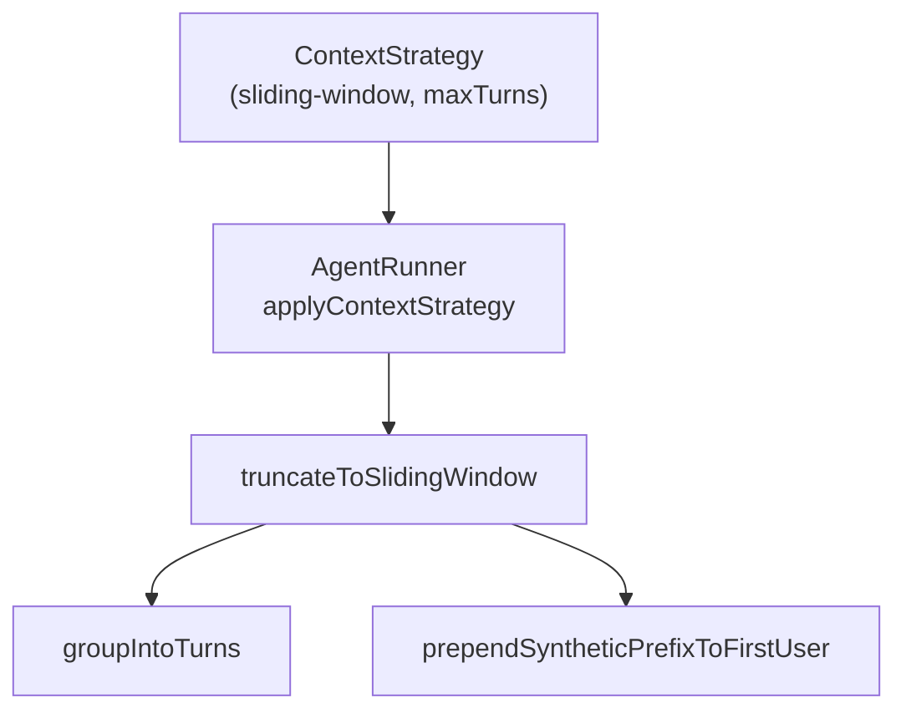
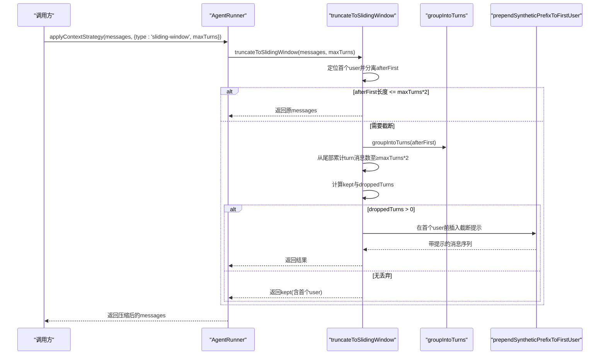
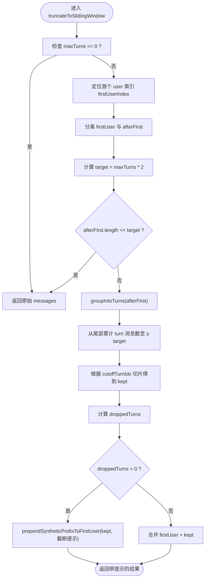
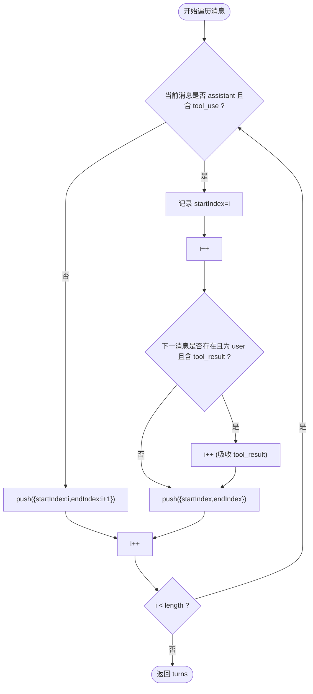
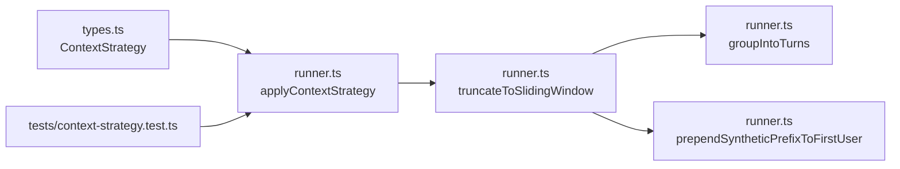

# 滑动窗口截断

<cite>
**本文引用的文件**
- [runner.ts](file://packages/core/src/agent/runner.ts)
- [types.ts](file://packages/core/src/types.ts)
- [context-strategy.test.ts](file://packages/core/tests/context-strategy.test.ts)
- [context-management.md](file://docs/context-management.md)
</cite>

## 目录
1. [简介](#简介)
2. [项目结构](#项目结构)
3. [核心组件](#核心组件)
4. [架构总览](#架构总览)
5. [详细组件分析](#详细组件分析)
6. [依赖关系分析](#依赖关系分析)
7. [性能考虑](#性能考虑)
8. [故障排查指南](#故障排查指南)
9. [结论](#结论)
10. [附录：配置示例与边界情况](#附录：配置示例与边界情况)

## 简介
本文深入解析 AgentRunner 中的滑动窗口截断函数 truncateToSlidingWindow，说明其如何基于 maxTurns 计算目标消息数量、从尾部累积消息直到达到目标长度、确保用户首条消息不被截断、通过 groupIntoTurns 保证 tool_use/tool_result 对的原子性，以及 droppedTurns 计数与提示信息的生成机制。同时给出不同 maxTurns 值的配置示例、性能考量与边界处理建议。

## 项目结构
- 核心实现位于 packages/core/src/agent/runner.ts，包含滑动窗口截断、回合分组、合成前缀注入等逻辑。
- 类型定义位于 packages/core/src/types.ts，定义了 ContextStrategy 的 sliding-window 模式及 maxTurns 字段。
- 行为验证位于 packages/core/tests/context-strategy.test.ts，覆盖工具对完整性、消息对数量语义、提示信息注入等用例。
- 文档参考 docs/context-management.md，提供高层上下文管理策略说明。

图表来源
- [runner.ts:773-782](file://packages/core/src/agent/runner.ts#L773-L782)
- [runner.ts:492-542](file://packages/core/src/agent/runner.ts#L492-L542)
- [runner.ts:334-359](file://packages/core/src/agent/runner.ts#L334-L359)
- [runner.ts:411-428](file://packages/core/src/agent/runner.ts#L411-L428)
- [types.ts:192-194](file://packages/core/src/types.ts#L192-L194)

章节来源
- [runner.ts:492-542](file://packages/core/src/agent/runner.ts#L492-L542)
- [runner.ts:334-359](file://packages/core/src/agent/runner.ts#L334-L359)
- [runner.ts:411-428](file://packages/core/src/agent/runner.ts#L411-L428)
- [types.ts:192-194](file://packages/core/src/types.ts#L192-L194)

## 核心组件
- truncateToSlidingWindow：根据 maxTurns 将历史消息压缩到“最近 N 轮”的滑动窗口内，保持对话骨架完整。
- groupIntoTurns：将扁平消息数组划分为“原子回合”，确保 tool_use 与其紧随的 tool_result 成对保留。
- prependSyntheticPrefixToFirstUser：在首个 user 消息前插入合成提示（如被截断通知），避免连续 user 回合或摘要拼接问题。
- applyContextStrategy：调度具体上下文策略，当 strategy.type === 'sliding-window' 时调用 truncateToSlidingWindow。

章节来源
- [runner.ts:492-542](file://packages/core/src/agent/runner.ts#L492-L542)
- [runner.ts:334-359](file://packages/core/src/agent/runner.ts#L334-L359)
- [runner.ts:411-428](file://packages/core/src/agent/runner.ts#L411-L428)
- [runner.ts:773-782](file://packages/core/src/agent/runner.ts#L773-L782)

## 架构总览
滑动窗口截断的整体流程如下：
- 输入：LLMMessage[] 与 maxTurns
- 步骤：
  1) 定位并保留首个 user 消息；
  2) 计算目标消息数 target = maxTurns * 2；
  3) 若 afterFirst 长度未超过 target，直接返回原消息；
  4) 否则将 afterFirst 按回合分组，从尾部累计消息数直至 ≥ target；
  5) 截取对应范围，得到 kept；
  6) 若存在被丢弃回合，则在首个 user 消息前插入“已截断”的合成提示；
  7) 输出合并后的消息序列。

图表来源
- [runner.ts:773-782](file://packages/core/src/agent/runner.ts#L773-L782)
- [runner.ts:492-542](file://packages/core/src/agent/runner.ts#L492-L542)
- [runner.ts:334-359](file://packages/core/src/agent/runner.ts#L334-L359)
- [runner.ts:411-428](file://packages/core/src/agent/runner.ts#L411-L428)

## 详细组件分析

### truncateToSlidingWindow：滑动窗口算法详解
- 目标计算：target = maxTurns * 2。该设计保留了“消息对数量”的历史语义：对于纯文本对话，maxTurns=N 表示保留最近的 2N 条消息（即 N 个 user-assistant 对）。
- 首个用户保护：始终保留第一个 user 消息，避免丢失初始上下文。
- 回合分组：使用 groupIntoTurns 将 afterFirst 划分为原子回合，避免在 tool_use 与 tool_result 之间切分。
- 尾部累积：从最后一个回合向前累加消息数，直到累计数 ≥ target，确定 cutoffTurnIdx。
- 切片与丢弃统计：根据 cutoffTurnIdx 得到 keptTurns 与 kept，计算 droppedTurns = turns.length - keptTurns.length。
- 提示注入：若 droppedTurns > 0，通过 prependSyntheticPrefixToFirstUser 在首个 user 消息前插入“已截断”的提示，告知模型历史已被裁剪。
- 返回：若无丢弃则直接返回 kept（含首个 user）；若有丢弃则返回带提示的结果。

图表来源
- [runner.ts:492-542](file://packages/core/src/agent/runner.ts#L492-L542)

章节来源
- [runner.ts:492-542](file://packages/core/src/agent/runner.ts#L492-L542)

### groupIntoTurns：保证 tool_use/tool_result 对完整性
- 规则：
  - 普通消息（user/assistant 文本）视为单条回合；
  - assistant 消息若包含 tool_use 块，则将其与紧随的 user 消息（包含 tool_result）打包为一个原子回合；
  - 这样可防止 API 因 orphaned tool_use_id 而拒绝请求。
- 复杂度：O(n)，一次线性扫描构建 Turn 列表。
- 安全性：即使边界落在工具回合内部，也只会整回合丢弃，不会拆分 tool_use/tool_result。

图表来源
- [runner.ts:334-359](file://packages/core/src/agent/runner.ts#L334-L359)

章节来源
- [runner.ts:334-359](file://packages/core/src/agent/runner.ts#L334-L359)

### prependSyntheticPrefixToFirstUser：合成前缀注入
- 作用：在首个 user 消息前插入合成文本（例如“历史已截断”的提示），避免连续 user 回合导致某些后端（如 Bedrock）报错，同时避免摘要文本直接拼接在原用户提示上。
- 行为：
  - 若不存在 user 消息，则插入一个 assistant 文本作为前导；
  - 若存在 user 消息，则将提示文本与该 user 消息内容合并。
- 使用场景：滑动窗口截断产生 droppedTurns > 0 时，用于向模型传达历史被裁剪的事实。

章节来源
- [runner.ts:411-428](file://packages/core/src/agent/runner.ts#L411-L428)

### 应用入口：applyContextStrategy
- 当 contextStrategy.type === 'sliding-window' 时，调用 truncateToSlidingWindow 并返回压缩后的消息与零用量。
- 其他策略（summarize、compact、custom.compress）在此处统一调度。

章节来源
- [runner.ts:773-782](file://packages/core/src/agent/runner.ts#L773-L782)

## 依赖关系分析
- runner.ts 内部依赖：
  - truncateToSlidingWindow 依赖 groupIntoTurns 与 prependSyntheticPrefixToFirstUser；
  - applyContextStrategy 根据策略类型路由到具体实现。
- 类型依赖：
  - ContextStrategy 的 sliding-window 模式要求提供 maxTurns。
- 测试依赖：
  - context-strategy.test.ts 验证了工具对完整性、消息对数量语义、提示信息注入等行为。

图表来源
- [types.ts:192-194](file://packages/core/src/types.ts#L192-L194)
- [runner.ts:773-782](file://packages/core/src/agent/runner.ts#L773-L782)
- [runner.ts:492-542](file://packages/core/src/agent/runner.ts#L492-L542)
- [runner.ts:334-359](file://packages/core/src/agent/runner.ts#L334-L359)
- [runner.ts:411-428](file://packages/core/src/agent/runner.ts#L411-L428)
- [context-strategy.test.ts:100-229](file://packages/core/tests/context-strategy.test.ts#L100-L229)

章节来源
- [types.ts:192-194](file://packages/core/src/types.ts#L192-L194)
- [runner.ts:773-782](file://packages/core/src/agent/runner.ts#L773-L782)
- [context-strategy.test.ts:100-229](file://packages/core/tests/context-strategy.test.ts#L100-L229)

## 性能考虑
- 时间复杂度：
  - groupIntoTurns：O(n)，单次线性扫描；
  - 尾部累积：O(k)，k 为保留的回合数，通常远小于 n；
  - 总体 O(n)。
- 空间复杂度：
  - 额外存储 turns 数组与切片结果，O(n)。
- 优化点：
  - 当 afterFirst.length <= target 时直接返回，避免不必要的分组与切片；
  - 仅在必要时注入合成前缀，减少字符串拼接开销；
  - 对于超长历史，建议结合 summarize/compact 策略进一步控制 token 增长。

[本节为通用性能讨论，不直接分析具体代码行]

## 故障排查指南
- 常见问题：
  - 工具调用被拒绝（orphaned tool_use_id）：确认使用了 groupIntoTurns 进行回合分组，避免拆分 tool_use/tool_result；
  - 连续 user 回合导致后端报错：确认通过 prependSyntheticPrefixToFirstUser 注入合成前缀，避免连续 user；
  - 历史被意外截断：检查 maxTurns 设置是否过小，或历史长度远超 target。
- 调试建议：
  - 打印 droppedTurns 与 kept 消息数量，确认是否符合预期；
  - 检查首个 user 消息是否被保留；
  - 在测试中复现边界场景（见下方附录）。

章节来源
- [runner.ts:492-542](file://packages/core/src/agent/runner.ts#L492-L542)
- [runner.ts:334-359](file://packages/core/src/agent/runner.ts#L334-L359)
- [runner.ts:411-428](file://packages/core/src/agent/runner.ts#L411-L428)
- [context-strategy.test.ts:100-229](file://packages/core/tests/context-strategy.test.ts#L100-L229)

## 结论
truncateToSlidingWindow 以“消息对数量”语义为核心，通过 groupIntoTurns 保证工具调用的原子性，从尾部累积消息至 target = maxTurns * 2，并在必要时注入合成提示以告知模型历史已被裁剪。该实现兼顾了正确性（API 兼容性）、可解释性（明确提示）与性能（线性复杂度），适用于长对话的上下文管理。

[本节为总结性内容，不直接分析具体代码行]

## 附录：配置示例与边界情况

### 配置示例（不同 maxTurns 的影响）
- 示例一：maxTurns=1
  - 目标消息数 target=2；
  - 仅保留首个 user 与最近的 2 条消息（通常为最近一轮的 assistant+user）；
  - 若存在丢弃，会在首个 user 前插入“已截断”提示。
- 示例二：maxTurns=2
  - 目标消息数 target=4；
  - 保留首个 user 与最近的 4 条消息（两对 user-assistant）；
  - 适合中等长度的对话历史。
- 示例三：maxTurns=10
  - 目标消息数 target=20；
  - 保留首个 user 与最近的 20 条消息；
  - 适合较长对话但需严格控制上下文的场景。

章节来源
- [types.ts:192-194](file://packages/core/src/types.ts#L192-L194)
- [context-management.md:10](file://docs/context-management.md#L10)

### 边界情况处理
- maxTurns ≤ 0：直接返回原始消息，不做任何截断；
- 无 user 消息：仍会尝试分组与切片，但最终结果可能不包含 user；
- 仅有 afterFirst 且长度 ≤ target：无需截断，直接返回；
- 工具调用边界：由于按回合分组，不会出现 tool_use 与 tool_result 分离的情况；
- 提示注入：仅在 droppedTurns > 0 时注入，避免冗余信息。

章节来源
- [runner.ts:492-542](file://packages/core/src/agent/runner.ts#L492-L542)
- [runner.ts:334-359](file://packages/core/src/agent/runner.ts#L334-L359)
- [context-strategy.test.ts:100-229](file://packages/core/tests/context-strategy.test.ts#L100-L229)