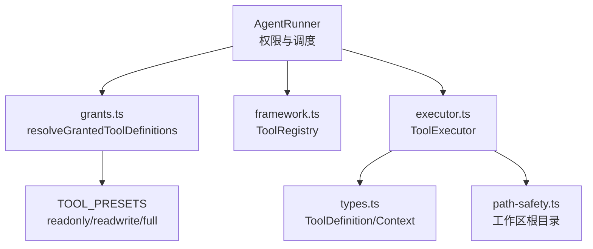
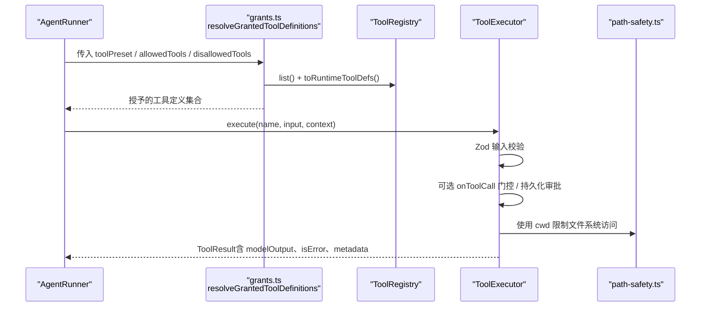
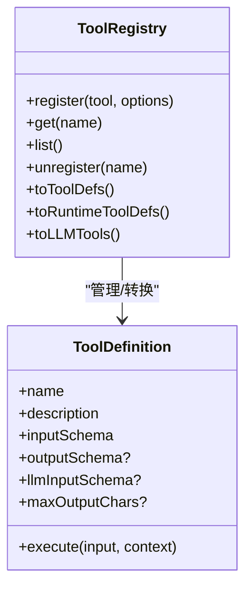
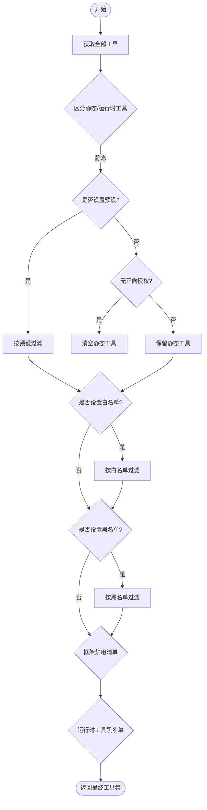
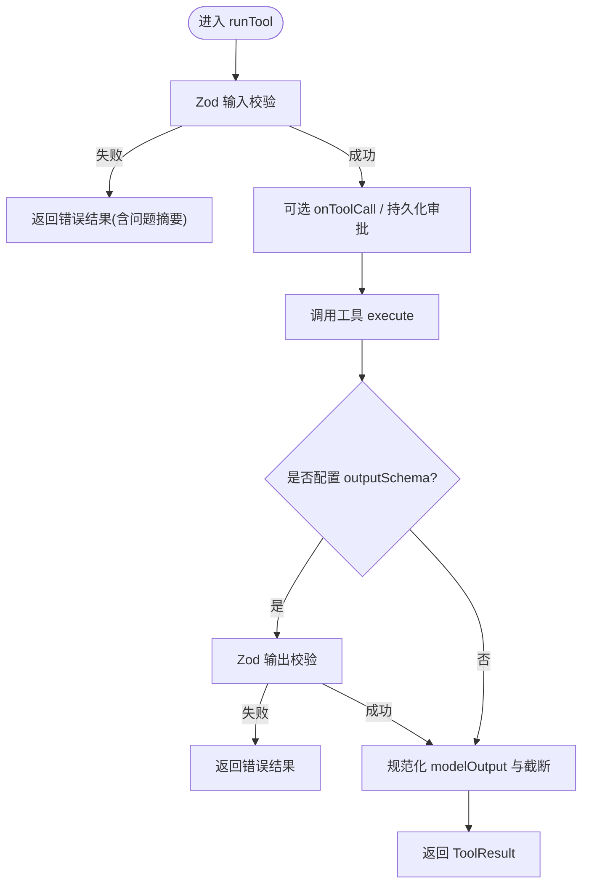
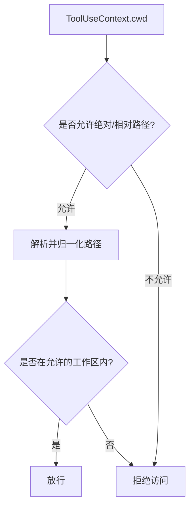
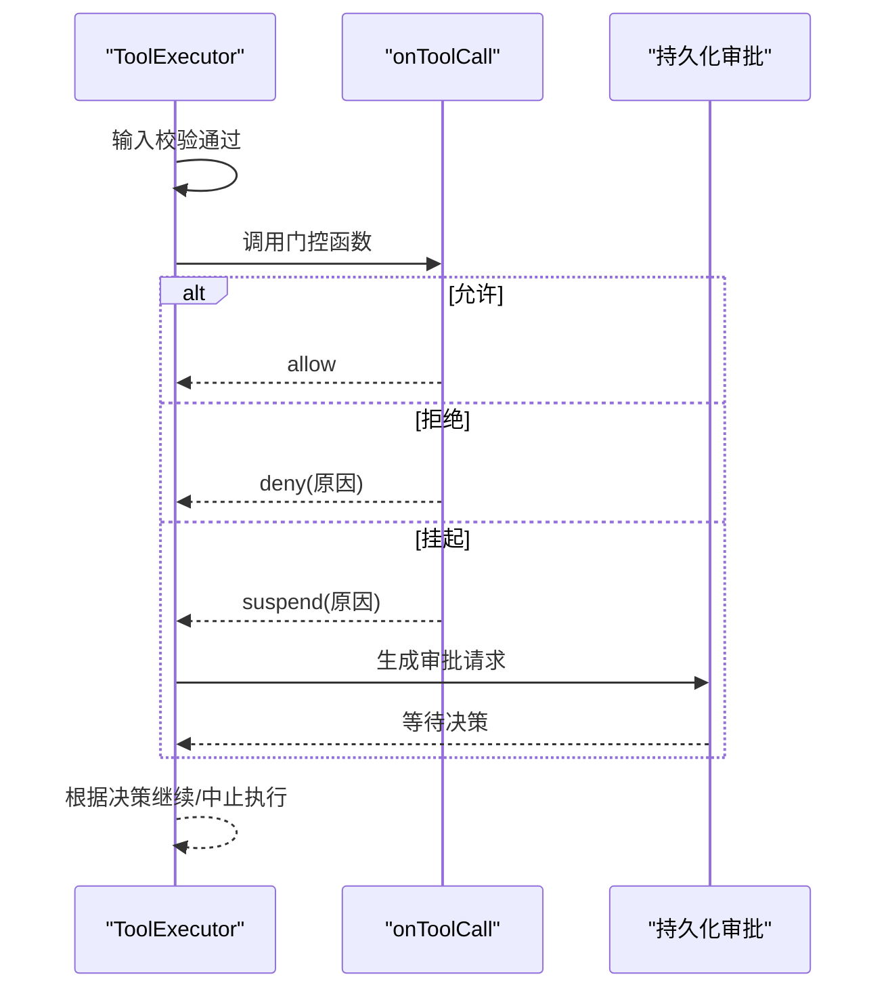
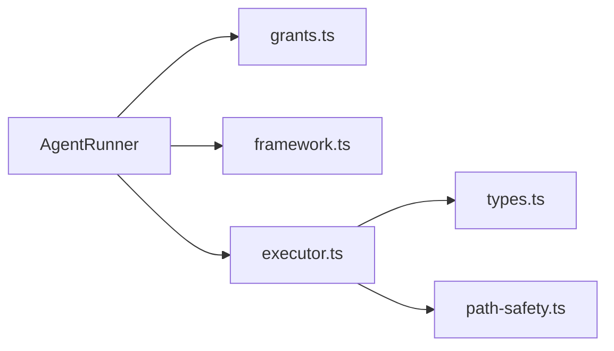

# 工具发现与验证

<cite>
**本文引用的文件**
- [packages/core/src/tool/grants.ts](file://packages/core/src/tool/grants.ts)
- [packages/core/src/tool/framework.ts](file://packages/core/src/tool/framework.ts)
- [packages/core/src/tool/executor.ts](file://packages/core/src/tool/executor.ts)
- [packages/core/src/agent/runner.ts](file://packages/core/src/agent/runner.ts)
- [packages/core/src/types.ts](file://packages/core/src/types.ts)
- [packages/core/src/tool/built-in/path-safety.ts](file://packages/core/src/tool/built-in/path-safety.ts)
</cite>

## 目录
1. [简介](#简介)
2. [项目结构](#项目结构)
3. [核心组件](#核心组件)
4. [架构总览](#架构总览)
5. [详细组件分析](#详细组件分析)
6. [依赖关系分析](#依赖关系分析)
7. [性能考量](#性能考量)
8. [故障排查指南](#故障排查指南)
9. [结论](#结论)
10. [附录](#附录)

## 简介
本文件系统性解析多智能体框架中的“工具发现与验证”机制，覆盖以下关键主题：
- 工具注册与定义（ToolRegistry、defineTool）
- 权限计算与工具授权（resolveGrantedToolDefinitions、TOOL_PRESETS）
- 参数校验与输出校验（Zod 模式、默认值处理、错误报告）
- 工具沙箱隔离（文件系统路径限制、网络与进程执行安全）
- 最佳实践与安全建议（权限配置、常见问题解决方案）

## 项目结构
围绕工具系统的关键代码集中在 core 包的 tool 子目录，以及 agent runner 的集成点：
- 工具框架与注册：framework.ts
- 工具授权与预设：grants.ts
- 工具执行与校验：executor.ts
- 运行期集成与权限注入：agent/runner.ts
- 类型与上下文：types.ts
- 内置工具与路径安全：tool/built-in/* 与 path-safety.ts

图表来源
- [packages/core/src/agent/runner.ts:817-827](file://packages/core/src/agent/runner.ts#L817-L827)
- [packages/core/src/tool/grants.ts:35-89](file://packages/core/src/tool/grants.ts#L35-L89)
- [packages/core/src/tool/framework.ts:127-222](file://packages/core/src/tool/framework.ts#L127-L222)
- [packages/core/src/tool/executor.ts:85-164](file://packages/core/src/tool/executor.ts#L85-L164)
- [packages/core/src/tool/built-in/path-safety.ts](file://packages/core/src/tool/built-in/path-safety.ts)

章节来源
- [packages/core/src/agent/runner.ts:140-166](file://packages/core/src/agent/runner.ts#L140-L166)
- [packages/core/src/tool/grants.ts:10-26](file://packages/core/src/tool/grants.ts#L10-L26)
- [packages/core/src/tool/framework.ts:127-222](file://packages/core/src/tool/framework.ts#L127-L222)
- [packages/core/src/tool/executor.ts:85-164](file://packages/core/src/tool/executor.ts#L85-L164)

## 核心组件
- ToolRegistry：集中管理工具定义，支持注册、查询、列表、转换为 LLM 可用的 JSON Schema。
- ToolExecutor：负责输入校验（Zod）、可选输出校验、并发控制、错误隔离、结果截断、可恢复审批流。
- resolveGrantedToolDefinitions：基于 toolPreset、allowedTools、disallowedTools 计算最终可用工具集合。
- TOOL_PRESETS：提供 readonly、readwrite、full 三种预设，分别对应不同能力范围。
- AgentRunner：在每次调用前进行工具授权过滤，并将上下文（cwd、credentials、agent 信息等）注入到工具执行中。

章节来源
- [packages/core/src/tool/framework.ts:127-222](file://packages/core/src/tool/framework.ts#L127-L222)
- [packages/core/src/tool/executor.ts:85-164](file://packages/core/src/tool/executor.ts#L85-L164)
- [packages/core/src/tool/grants.ts:35-89](file://packages/core/src/tool/grants.ts#L35-L89)
- [packages/core/src/agent/runner.ts:817-827](file://packages/core/src/agent/runner.ts#L817-L827)

## 架构总览
下图展示了从 AgentRunner 到工具执行的全链路：权限计算 → 工具选择 → 输入校验 → 可选审批门控 → 执行 → 输出校验 → 结果返回。

图表来源
- [packages/core/src/agent/runner.ts:817-827](file://packages/core/src/agent/runner.ts#L817-L827)
- [packages/core/src/tool/grants.ts:35-89](file://packages/core/src/tool/grants.ts#L35-L89)
- [packages/core/src/tool/executor.ts:181-338](file://packages/core/src/tool/executor.ts#L181-L338)
- [packages/core/src/tool/built-in/path-safety.ts](file://packages/core/src/tool/built-in/path-safety.ts)

## 详细组件分析

### 工具注册与定义（ToolRegistry、defineTool）
- defineTool：声明工具的名称、描述、输入 Zod 模式、可选输出模式、是否具副作用（consequential）、最大输出长度等，并生成 ToolDefinition。
- ToolRegistry：
  - register/unregister：增删工具，防止同名覆盖；支持标记“运行时添加”的工具。
  - list/get/has：查询工具。
  - toToolDefs/toLLMTools：将 Zod 模式转换为 LLM 所需的 JSON Schema（或采用自定义 llmInputSchema）。
  - toRuntimeToolDefs：仅返回运行时动态添加的工具定义。

图表来源
- [packages/core/src/tool/framework.ts:71-117](file://packages/core/src/tool/framework.ts#L71-L117)
- [packages/core/src/tool/framework.ts:127-222](file://packages/core/src/tool/framework.ts#L127-L222)

章节来源
- [packages/core/src/tool/framework.ts:71-117](file://packages/core/src/tool/framework.ts#L71-L117)
- [packages/core/src/tool/framework.ts:127-222](file://packages/core/src/tool/framework.ts#L127-L222)

### 权限计算与工具授权（resolveGrantedToolDefinitions、TOOL_PRESETS）
- 三层配置优先级：预设（preset）→ 白名单（allowedTools）→ 黑名单（disallowedTools），最后再应用框架级禁用清单。
- 运行时工具（runtime tools）与静态注册工具分开处理，黑名单同样适用于运行时工具。
- 冲突检测：当同时设置 preset 与 allowedTools，或在白/黑名单中出现重复项时，会发出警告。

图表来源
- [packages/core/src/tool/grants.ts:35-89](file://packages/core/src/tool/grants.ts#L35-L89)

章节来源
- [packages/core/src/tool/grants.ts:10-26](file://packages/core/src/tool/grants.ts#L10-L26)
- [packages/core/src/tool/grants.ts:35-89](file://packages/core/src/tool/grants.ts#L35-L89)

### 工具参数与输出的 Zod 验证流程
- 输入校验：在执行前对 rawInput 使用工具定义的 inputSchema 进行 safeParse，失败则返回错误 ToolResult，并附带可读的问题摘要。
- 默认值处理：Zod 的 default 会在 schema 转换时体现为 JSON Schema 的 default 字段；实际解析由 Zod 完成，未提供的可选字段将被填充默认值。
- 输出校验：若定义了 outputSchema，且结果为非错误，则对 result.data 再次校验；失败返回错误 ToolResult。
- 结果规范化：确保 modelOutput 存在且可复制；错误场景下 modelOutput 必须为字符串；支持 per-tool 与 agent-level 的输出长度截断。

图表来源
- [packages/core/src/tool/executor.ts:181-338](file://packages/core/src/tool/executor.ts#L181-L338)
- [packages/core/src/tool/framework.ts:279-491](file://packages/core/src/tool/framework.ts#L279-L491)

章节来源
- [packages/core/src/tool/executor.ts:181-338](file://packages/core/src/tool/executor.ts#L181-L338)
- [packages/core/src/tool/framework.ts:279-491](file://packages/core/src/tool/framework.ts#L279-L491)

### 工具预设（TOOL_PRESETS）的权限差异
- readonly：允许读取类工具（如文件读取、搜索、通配匹配），适合只读场景。
- readwrite：在 readonly 基础上增加写入与编辑能力（文件写入、编辑等）。
- full：在 readwrite 基础上开放 bash 等更强大的能力，需谨慎使用。

章节来源
- [packages/core/src/tool/grants.ts:10-15](file://packages/core/src/tool/grants.ts#L10-L15)

### 工具沙箱隔离机制
- 工作区根目录（cwd）：通过 AgentRunner 构建 ToolUseContext 时注入 cwd；默认回退到工作区子目录，可通过配置关闭沙箱（null）。
- 路径安全：内置文件系统工具遵循路径安全策略，所有路径需解析后位于允许的根目录下，避免越权访问。
- 进程与网络：bash 工具属于 full 预设，具备执行命令的能力；应仅在可信环境启用，并结合黑名单与审批门控限制。

图表来源
- [packages/core/src/agent/runner.ts:1796-1810](file://packages/core/src/agent/runner.ts#L1796-L1810)
- [packages/core/src/tool/built-in/path-safety.ts](file://packages/core/src/tool/built-in/path-safety.ts)

章节来源
- [packages/core/src/agent/runner.ts:1796-1810](file://packages/core/src/agent/runner.ts#L1796-L1810)
- [packages/core/src/tool/built-in/path-safety.ts](file://packages/core/src/tool/built-in/path-safety.ts)

### 工具执行门控与持久化审批
- onToolCall：可在输入校验后、执行前进行细粒度决策（allow/deny/suspend），并携带上下文信息（工具名、输入、agent、是否具副作用等）。
- 持久化审批：支持从检查点恢复已审批的调用，校验请求哈希一致性，避免篡改或过期决策导致的安全风险。

图表来源
- [packages/core/src/tool/executor.ts:206-295](file://packages/core/src/tool/executor.ts#L206-L295)
- [packages/core/src/types.ts:592-618](file://packages/core/src/types.ts#L592-L618)

章节来源
- [packages/core/src/tool/executor.ts:206-295](file://packages/core/src/tool/executor.ts#L206-L295)
- [packages/core/src/types.ts:592-618](file://packages/core/src/types.ts#L592-L618)

## 依赖关系分析
- AgentRunner 依赖 grants.ts 进行授权过滤，依赖 framework.ts 的 ToolRegistry 获取工具定义，依赖 executor.ts 执行工具。
- ToolExecutor 依赖 types.ts 的类型定义，并在执行过程中可能引用 path-safety.ts 的路径安全策略。
- 运行时工具（如 bash）通过 registry.toRuntimeToolDefs 暴露给授权逻辑，以便黑名单能正确拦截。

图表来源
- [packages/core/src/agent/runner.ts:817-827](file://packages/core/src/agent/runner.ts#L817-L827)
- [packages/core/src/tool/grants.ts:35-89](file://packages/core/src/tool/grants.ts#L35-L89)
- [packages/core/src/tool/executor.ts:85-164](file://packages/core/src/tool/executor.ts#L85-L164)

章节来源
- [packages/core/src/agent/runner.ts:817-827](file://packages/core/src/agent/runner.ts#L817-L827)
- [packages/core/src/tool/grants.ts:35-89](file://packages/core/src/tool/grants.ts#L35-L89)
- [packages/core/src/tool/executor.ts:85-164](file://packages/core/src/tool/executor.ts#L85-L164)

## 性能考量
- 并发控制：ToolExecutor 使用信号量限制并行工具调用数，避免资源争用。
- 输出截断：支持 per-tool 与 agent-level 的最大输出字符限制，减少模型上下文压力。
- 压缩与摘要：运行器会对工具结果进行压缩与摘要，降低消息体积。

章节来源
- [packages/core/src/tool/executor.ts:38-55](file://packages/core/src/tool/executor.ts#L38-L55)
- [packages/core/src/tool/executor.ts:355-379](file://packages/core/src/tool/executor.ts#L355-L379)
- [packages/core/src/agent/runner.ts:1759-1790](file://packages/core/src/agent/runner.ts#L1759-L1790)

## 故障排查指南
- 工具未授权：若工具未被授予，执行时会返回错误提示，需在 agent/orchestrator 配置中调整 toolPreset、allowedTools 或 disallowedTools。
- 输入校验失败：检查工具的 inputSchema 是否与模型传入的参数一致；关注错误摘要中的字段路径与问题描述。
- 输出校验失败：若定义了 outputSchema，确保工具返回的数据符合预期；必要时调整 schema 或修正工具实现。
- 门控拒绝：检查 onToolCall 的实现逻辑与返回值；如需审批，确认持久化审批的请求哈希一致性与状态。
- 沙箱路径错误：确认 cwd 与工作区目录设置合理；避免相对路径解析到工作区之外。

章节来源
- [packages/core/src/agent/runner.ts:1393-1403](file://packages/core/src/agent/runner.ts#L1393-L1403)
- [packages/core/src/tool/executor.ts:181-338](file://packages/core/src/tool/executor.ts#L181-L338)
- [packages/core/src/tool/executor.ts:206-295](file://packages/core/src/tool/executor.ts#L206-L295)

## 结论
该工具系统通过清晰的注册、授权、校验与执行分层，实现了灵活而安全的工具使用机制。借助预设与白/黑名单的组合，可以快速适配不同安全等级；Zod 模式贯穿输入与输出校验，保障数据契约；沙箱与门控进一步收敛了潜在风险。建议在生产环境中优先使用 readonly 或 readwrite 预设，谨慎启用 full，并结合 onToolCall 与持久化审批形成纵深防御。

## 附录
- 工具定义示例路径：[packages/core/src/tool/framework.ts:71-117](file://packages/core/src/tool/framework.ts#L71-L117)
- 工具授权计算路径：[packages/core/src/tool/grants.ts:35-89](file://packages/core/src/tool/grants.ts#L35-L89)
- 工具执行与校验路径：[packages/core/src/tool/executor.ts:181-338](file://packages/core/src/tool/executor.ts#L181-L338)
- 运行期上下文注入路径：[packages/core/src/agent/runner.ts:1796-1810](file://packages/core/src/agent/runner.ts#L1796-L1810)
- 类型与上下文定义路径：[packages/core/src/types.ts:592-618](file://packages/core/src/types.ts#L592-L618)