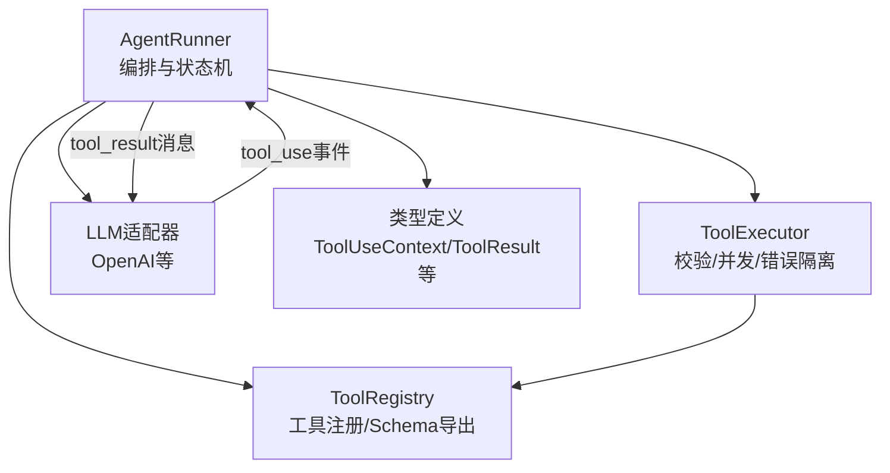
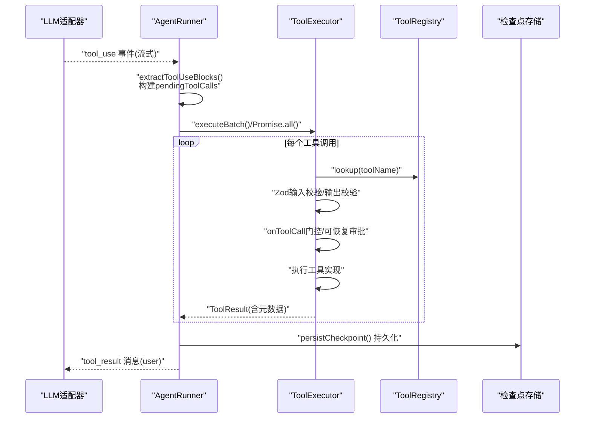
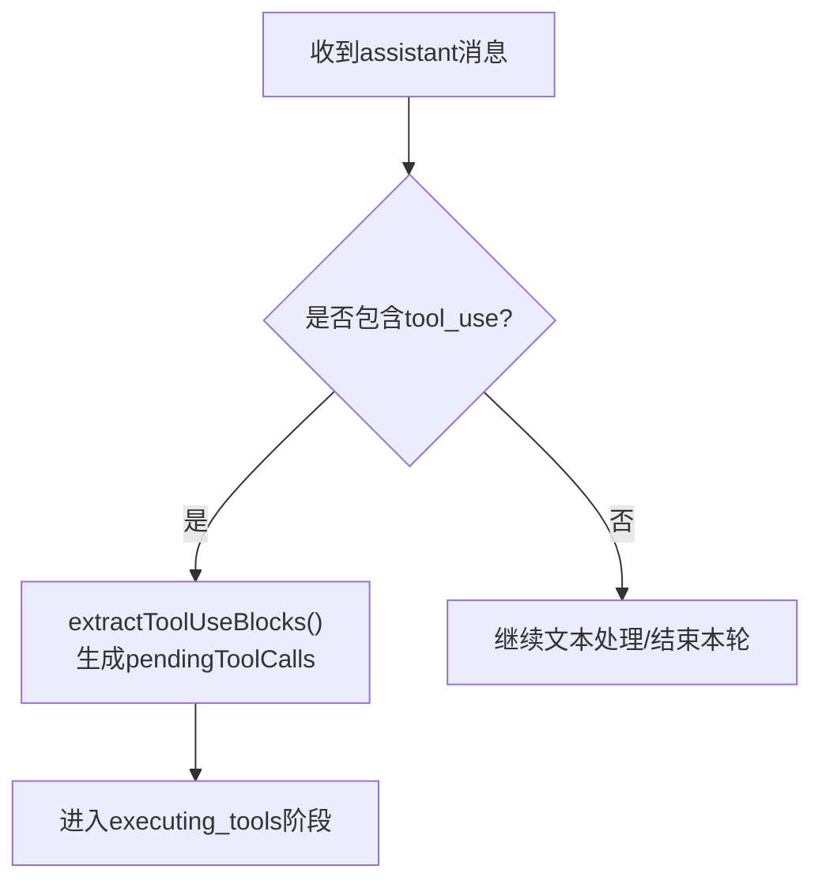
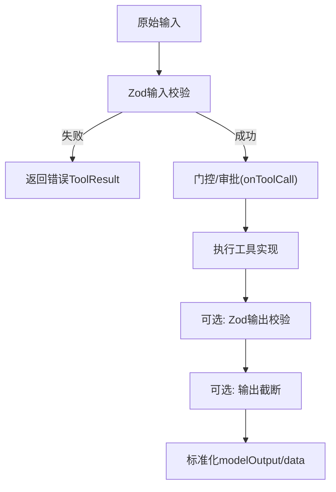
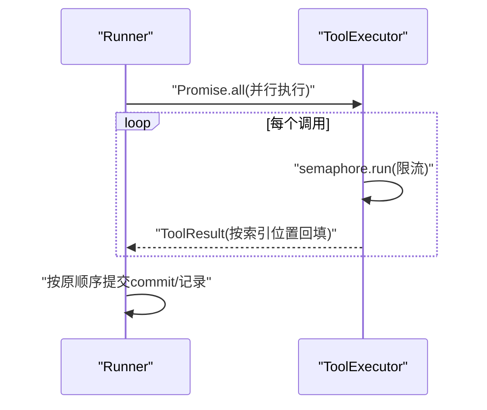
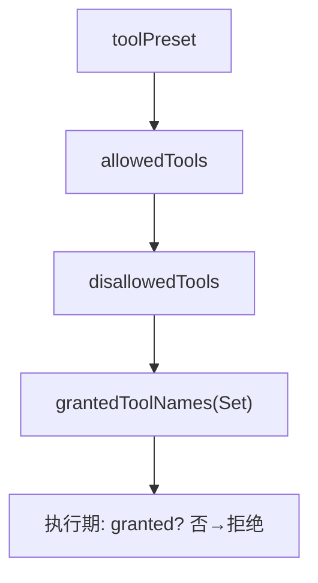
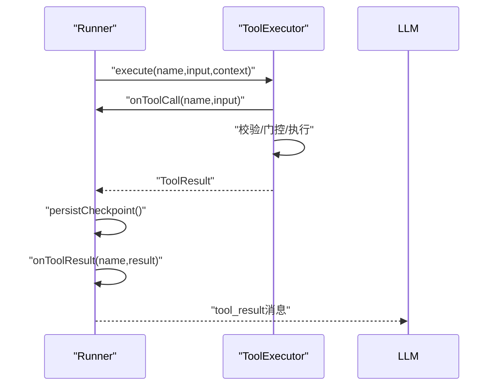
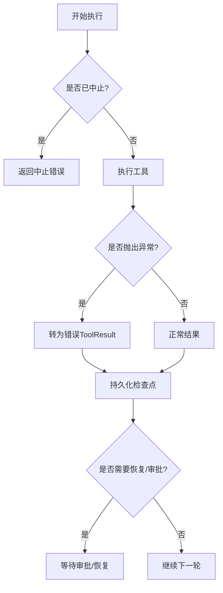
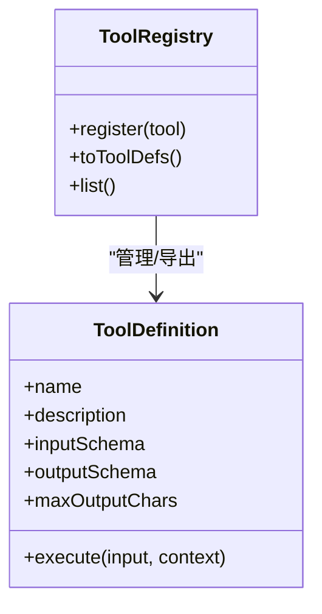
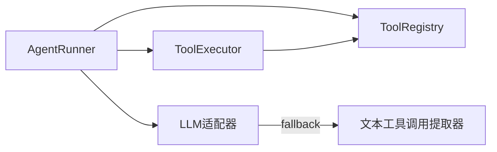

# 工具执行

<cite>
**本文引用的文件**
- [packages/core/src/agent/runner.ts](file://packages/core/src/agent/runner.ts)
- [packages/core/src/tool/executor.ts](file://packages/core/src/tool/executor.ts)
- [packages/core/src/tool/framework.ts](file://packages/core/src/tool/framework.ts)
- [packages/core/src/llm/openai.ts](file://packages/core/src/llm/openai.ts)
- [packages/core/src/tool/text-tool-extractor.ts](file://packages/core/src/tool/text-tool-extractor.ts)
- [packages/core/src/types.ts](file://packages/core/src/types.ts)
</cite>

## 目录
1. [简介](#简介)
2. [项目结构](#项目结构)
3. [核心组件](#核心组件)
4. [架构总览](#架构总览)
5. [详细组件分析](#详细组件分析)
6. [依赖关系分析](#依赖关系分析)
7. [性能考虑](#性能考虑)
8. [故障排查指南](#故障排查指南)
9. [结论](#结论)
10. [附录](#附录)

## 简介
本文面向“工具调用”的完整执行流程，覆盖从 LLM 响应中解析工具调用块、参数校验与转换、并行执行与顺序保证、权限控制（预设/白名单/黑名单）、生命周期回调（onToolCall/onToolResult）、沙箱与超时、错误恢复策略，以及自定义工具的集成方法与最佳实践。目标是帮助读者在不深入源码的情况下，也能理解并正确使用该框架的工具系统。

## 项目结构
围绕工具执行的关键代码分布在以下模块：
- 智能体运行器：编排对话轮次、提取工具调用、并发执行、结果回写与持久化
- 工具执行器：输入校验、输出校验、并发限制、错误隔离、可恢复审批
- 工具框架：定义工具、注册表、将 Zod 转为 LLM 可用的 JSON Schema
- LLM 适配层：流式解析 tool_calls，并在无原生 tool_calls 时尝试文本提取
- 类型定义：统一的数据结构与上下文对象

图表来源
- [packages/core/src/agent/runner.ts:902-1320](file://packages/core/src/agent/runner.ts#L902-L1320)
- [packages/core/src/tool/executor.ts:85-164](file://packages/core/src/tool/executor.ts#L85-L164)
- [packages/core/src/tool/framework.ts:127-214](file://packages/core/src/tool/framework.ts#L127-L214)
- [packages/core/src/llm/openai.ts:296-385](file://packages/core/src/llm/openai.ts#L296-L385)
- [packages/core/src/types.ts:544-572](file://packages/core/src/types.ts#L544-L572)

章节来源
- [packages/core/src/agent/runner.ts:902-1320](file://packages/core/src/agent/runner.ts#L902-L1320)
- [packages/core/src/tool/executor.ts:85-164](file://packages/core/src/tool/executor.ts#L85-L164)
- [packages/core/src/tool/framework.ts:127-214](file://packages/core/src/tool/framework.ts#L127-L214)
- [packages/core/src/llm/openai.ts:296-385](file://packages/core/src/llm/openai.ts#L296-L385)
- [packages/core/src/types.ts:544-572](file://packages/core/src/types.ts#L544-L572)

## 核心组件
- AgentRunner：负责对话轮次推进、工具调用发现、并发执行、结果聚合、检查点持久化、审批挂起与恢复。
- ToolExecutor：对每个工具进行输入/输出校验、并发限流、错误隔离、可恢复审批、输出截断。
- ToolRegistry：维护工具集合，提供 LLM 所需的工具定义（名称、描述、JSON Schema）。
- LLM 适配器（以 OpenAI 为例）：流式收集 tool_calls，组装为 tool_use 事件；若无原生 tool_calls，则尝试从文本中提取。
- 类型系统：统一 ToolUseContext、ToolResult、ContentBlock 等数据结构，贯穿整个执行链路。

章节来源
- [packages/core/src/agent/runner.ts:902-1320](file://packages/core/src/agent/runner.ts#L902-L1320)
- [packages/core/src/tool/executor.ts:85-164](file://packages/core/src/tool/executor.ts#L85-L164)
- [packages/core/src/tool/framework.ts:127-214](file://packages/core/src/tool/framework.ts#L127-L214)
- [packages/core/src/llm/openai.ts:296-385](file://packages/core/src/llm/openai.ts#L296-L385)
- [packages/core/src/types.ts:544-572](file://packages/core/src/types.ts#L544-L572)

## 架构总览
下图展示了从 LLM 返回到工具执行再到结果回写的端到端流程，包括并行执行、审批挂起、检查点持久化与结果回写。

图表来源
- [packages/core/src/llm/openai.ts:296-385](file://packages/core/src/llm/openai.ts#L296-L385)
- [packages/core/src/agent/runner.ts:990-1083](file://packages/core/src/agent/runner.ts#L990-L1083)
- [packages/core/src/tool/executor.ts:148-164](file://packages/core/src/tool/executor.ts#L148-L164)
- [packages/core/src/tool/framework.ts:204-214](file://packages/core/src/tool/framework.ts#L204-L214)

## 详细组件分析

### 工具调用发现：extractToolUseBlocks 与 LLM 适配
- AgentRunner 在收到 assistant 消息后，通过 extractToolUseBlocks 过滤出所有 type 为 tool_use 的块，作为待执行队列 pendingToolCalls。
- LLM 适配器（OpenAI）在流式结束时，会累积 tool_call 片段，解析参数 JSON，构造 ToolUseBlock，并以 tool_use 事件形式推送给 Runner。
- 若未收到原生 tool_calls，适配器会尝试从文本中抽取工具调用（支持多种格式），作为安全网。

图表来源
- [packages/core/src/agent/runner.ts:306-309](file://packages/core/src/agent/runner.ts#L306-L309)
- [packages/core/src/llm/openai.ts:322-385](file://packages/core/src/llm/openai.ts#L322-L385)
- [packages/core/src/tool/text-tool-extractor.ts:203-226](file://packages/core/src/tool/text-tool-extractor.ts#L203-L226)

章节来源
- [packages/core/src/agent/runner.ts:306-309](file://packages/core/src/agent/runner.ts#L306-L309)
- [packages/core/src/llm/openai.ts:322-385](file://packages/core/src/llm/openai.ts#L322-L385)
- [packages/core/src/tool/text-tool-extractor.ts:203-226](file://packages/core/src/tool/text-tool-extractor.ts#L203-L226)

### 工具参数验证与转换
- 输入校验：ToolExecutor 使用工具定义的 inputSchema（Zod）对原始输入进行严格校验，失败返回结构化错误信息。
- 输出校验：当工具定义了 outputSchema 且结果为非错误时，会对 result.data 再次校验，确保下游消费方拿到稳定结构。
- 模型可见输出：若工具返回 modelOutput，会被复制并用于模型侧展示；否则根据 data 类型决定记录内容。
- 输出截断：支持按工具或代理级别配置 maxOutputChars，对超长字符串输出进行头尾保留+标记的截断。

图表来源
- [packages/core/src/tool/executor.ts:181-338](file://packages/core/src/tool/executor.ts#L181-L338)
- [packages/core/src/tool/executor.ts:359-379](file://packages/core/src/tool/executor.ts#L359-L379)

章节来源
- [packages/core/src/tool/executor.ts:181-338](file://packages/core/src/tool/executor.ts#L181-L338)
- [packages/core/src/tool/executor.ts:359-379](file://packages/core/src/tool/executor.ts#L359-L379)

### 并行工具调用与执行顺序保证
- 并发机制：Runner 使用 Promise.all 对 pendingToolCalls 发起并行执行；ToolExecutor 内部通过信号量限制最大并发数，避免资源耗尽。
- 顺序保证：虽然执行是并行的，但 Runner 在后续步骤中以“原数组索引”顺序写入结果与提交记录，因此对外呈现的顺序与请求顺序一致。
- 批处理：ToolExecutor 提供 executeBatch，将多个调用封装为 Map<id, result>，便于上层聚合。

图表来源
- [packages/core/src/agent/runner.ts:990-1059](file://packages/core/src/agent/runner.ts#L990-L1059)
- [packages/core/src/tool/executor.ts:148-164](file://packages/core/src/tool/executor.ts#L148-L164)

章节来源
- [packages/core/src/agent/runner.ts:990-1059](file://packages/core/src/agent/runner.ts#L990-L1059)
- [packages/core/src/tool/executor.ts:148-164](file://packages/core/src/tool/executor.ts#L148-L164)

### 工具权限控制：toolPreset、allowedTools、disallowedTools
- 优先级规则：preset → allowedTools → disallowedTools。即先应用预设集，再叠加白名单，最后用黑名单排除。
- 默认拒绝：即使工具已注册，若未被 grantedToolNames 授予，执行时会返回“未授权”的错误结果，不会静默执行。
- 作用范围：这些配置来自 AgentConfig/OrchestratorConfig，影响 resolveTools() 产出的可用工具列表。

图表来源
- [packages/core/src/agent/runner.ts:140-147](file://packages/core/src/agent/runner.ts#L140-L147)
- [packages/core/src/agent/runner.ts:902-911](file://packages/core/src/agent/runner.ts#L902-L911)
- [packages/core/src/agent/runner.ts:1391-1399](file://packages/core/src/agent/runner.ts#L1391-L1399)

章节来源
- [packages/core/src/agent/runner.ts:140-147](file://packages/core/src/agent/runner.ts#L140-L147)
- [packages/core/src/agent/runner.ts:902-911](file://packages/core/src/agent/runner.ts#L902-L911)
- [packages/core/src/agent/runner.ts:1391-1399](file://packages/core/src/agent/runner.ts#L1391-L1399)

### 工具执行生命周期：onToolCall、实际执行、onToolResult、结果处理
- onToolCall：在执行前触发，可用于审计、限流、动态门控（允许/拒绝/挂起）。
- 实际执行：ToolExecutor 完成校验与门控后，调用工具实现，捕获异常并转换为错误结果。
- onToolResult：执行完成后，Runner 在持久化之后回调，供外部监听结果。
- 结果处理：Runner 将结果包装为 tool_result 块，追加到对话历史，并决定是否继续下一轮。

图表来源
- [packages/core/src/agent/runner.ts:1364-1545](file://packages/core/src/agent/runner.ts#L1364-L1545)
- [packages/core/src/tool/executor.ts:112-133](file://packages/core/src/tool/executor.ts#L112-L133)
- [packages/core/src/agent/runner.ts:1045-1057](file://packages/core/src/agent/runner.ts#L1045-L1057)

章节来源
- [packages/core/src/agent/runner.ts:1364-1545](file://packages/core/src/agent/runner.ts#L1364-L1545)
- [packages/core/src/tool/executor.ts:112-133](file://packages/core/src/tool/executor.ts#L112-L133)
- [packages/core/src/agent/runner.ts:1045-1057](file://packages/core/src/agent/runner.ts#L1045-L1057)

### 工具沙箱、超时控制与错误恢复
- 沙箱：内置文件系统工具受 cwd 约束，路径必须绝对且在沙箱目录内；可通过 null 显式禁用沙箱。
- 超时/取消：通过 AbortSignal 在关键节点检查中止；工具实现也应主动检查 abortSignal。
- 错误恢复：
  - 工具异常被捕获为错误结果，不中断整体循环。
  - 检查点在每步关键节点持久化，支持恢复后重放未提交的调用。
  - 可恢复审批：工具可请求挂起，等待人工审批后再继续；恢复时校验审批一致性。

图表来源
- [packages/core/src/tool/executor.ts:199-204](file://packages/core/src/tool/executor.ts#L199-L204)
- [packages/core/src/tool/executor.ts:297-337](file://packages/core/src/tool/executor.ts#L297-L337)
- [packages/core/src/agent/runner.ts:1045-1068](file://packages/core/src/agent/runner.ts#L1045-L1068)
- [packages/core/src/types.ts:544-572](file://packages/core/src/types.ts#L544-L572)

章节来源
- [packages/core/src/tool/executor.ts:199-204](file://packages/core/src/tool/executor.ts#L199-L204)
- [packages/core/src/tool/executor.ts:297-337](file://packages/core/src/tool/executor.ts#L297-L337)
- [packages/core/src/agent/runner.ts:1045-1068](file://packages/core/src/agent/runner.ts#L1045-L1068)
- [packages/core/src/types.ts:544-572](file://packages/core/src/types.ts#L544-L572)

### 自定义工具的集成方法与最佳实践
- 定义工具：使用 defineTool 声明 name、description、inputSchema、可选 outputSchema、maxOutputChars 与 execute。
- 注册工具：通过 ToolRegistry.register 加入注册表；运行时也可动态添加（runtimeAdded=true）。
- 暴露给 LLM：调用 toToolDefs/toLLMTools 将工具转为 LLM 期望的 JSON Schema。
- 最佳实践：
  - 始终为输入定义严格的 Zod schema，减少无效调用。
  - 对副作用工具设置 consequential=true，以便审批门控更谨慎。
  - 合理设置 maxOutputChars，避免长输出阻塞上下文。
  - 在工具内部检查 abortSignal，支持快速取消。
  - 对敏感字段使用 credentials 注入，避免硬编码。

图表来源
- [packages/core/src/tool/framework.ts:71-117](file://packages/core/src/tool/framework.ts#L71-L117)
- [packages/core/src/tool/framework.ts:127-214](file://packages/core/src/tool/framework.ts#L127-L214)

章节来源
- [packages/core/src/tool/framework.ts:71-117](file://packages/core/src/tool/framework.ts#L71-L117)
- [packages/core/src/tool/framework.ts:127-214](file://packages/core/src/tool/framework.ts#L127-L214)

## 依赖关系分析
- AgentRunner 依赖 ToolRegistry 获取可用工具定义，依赖 ToolExecutor 执行具体工具，依赖 LLM 适配器接收 tool_use 事件。
- ToolExecutor 依赖 ToolRegistry 查找工具实现，依赖类型系统传递上下文与结果。
- LLM 适配器依赖文本提取器作为 fallback，确保本地模型也能产出工具调用。

图表来源
- [packages/core/src/agent/runner.ts:902-1320](file://packages/core/src/agent/runner.ts#L902-L1320)
- [packages/core/src/tool/executor.ts:85-164](file://packages/core/src/tool/executor.ts#L85-L164)
- [packages/core/src/llm/openai.ts:358-369](file://packages/core/src/llm/openai.ts#L358-L369)
- [packages/core/src/tool/text-tool-extractor.ts:203-226](file://packages/core/src/tool/text-tool-extractor.ts#L203-L226)

章节来源
- [packages/core/src/agent/runner.ts:902-1320](file://packages/core/src/agent/runner.ts#L902-L1320)
- [packages/core/src/tool/executor.ts:85-164](file://packages/core/src/tool/executor.ts#L85-L164)
- [packages/core/src/llm/openai.ts:358-369](file://packages/core/src/llm/openai.ts#L358-L369)
- [packages/core/src/tool/text-tool-extractor.ts:203-226](file://packages/core/src/tool/text-tool-extractor.ts#L203-L226)

## 性能考虑
- 并发控制：ToolExecutor 使用信号量限制最大并发，避免过多 I/O 导致系统抖动。
- 输出截断：对超长输出进行头尾截取，降低上下文压力与传输成本。
- 检查点持久化：在关键节点持久化，减少恢复时的重复计算。
- 建议：
  - 合理设置 maxConcurrency，结合后端能力调优。
  - 为高延迟工具增加超时与重试策略。
  - 对大输出工具启用 maxOutputChars，并结合 compressToolResults 策略。

[本节为通用指导，无需特定文件引用]

## 故障排查指南
- 工具未授权：确认 agent/orchestrator 的 toolPreset/allowedTools/disallowedTools 是否正确；检查 grantedToolNames 是否包含目标工具。
- 参数校验失败：查看 ToolExecutor 返回的错误信息，修正 inputSchema 或传入参数。
- 输出校验失败：检查 outputSchema 是否与工具实现一致。
- 审批失败：若出现“审批过期/篡改”，需重新发起审批；确保任务具备 checkpoint 与 compareAndSet 能力。
- 文本提取失败：确认模型是否支持原生 tool_calls；如不支持，检查文本格式是否符合提取器预期。

章节来源
- [packages/core/src/agent/runner.ts:1391-1399](file://packages/core/src/agent/runner.ts#L1391-L1399)
- [packages/core/src/tool/executor.ts:181-197](file://packages/core/src/tool/executor.ts#L181-L197)
- [packages/core/src/tool/executor.ts:313-319](file://packages/core/src/tool/executor.ts#L313-L319)
- [packages/core/src/tool/executor.ts:213-248](file://packages/core/src/tool/executor.ts#L213-L248)
- [packages/core/src/llm/openai.ts:358-369](file://packages/core/src/llm/openai.ts#L358-L369)

## 结论
本框架将工具调用嵌入到稳定的执行流水线中：从 LLM 响应中发现工具调用，严格校验参数与输出，通过并发与限流保障稳定性，借助预设/白名单/黑名单实现细粒度权限控制，并通过检查点与可恢复审批提升可靠性。配合沙箱与超时/取消机制，可在生产环境中安全地驱动复杂工作流。

[本节为总结性内容，无需特定文件引用]

## 附录
- 相关类型参考：ToolUseContext、ToolResult、ContentBlock、TokenUsage 等，详见类型定义文件。
- 示例与文档：参见仓库根 README 与 packages/core 文档，了解安装、配置与示例用法。

[本节为补充说明，无需特定文件引用]