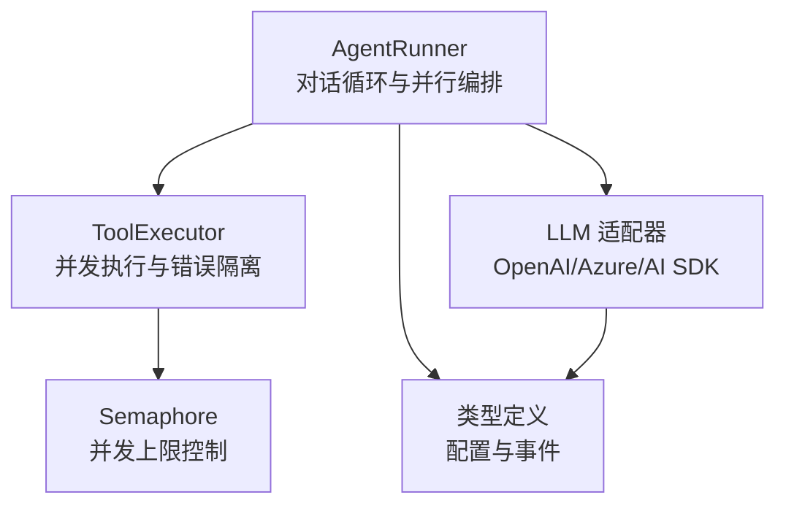
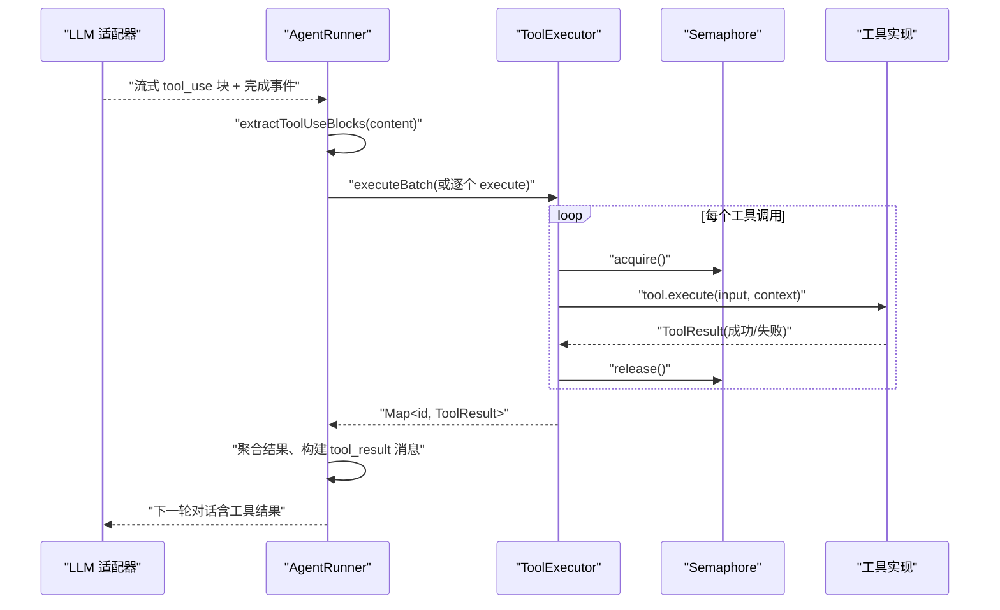
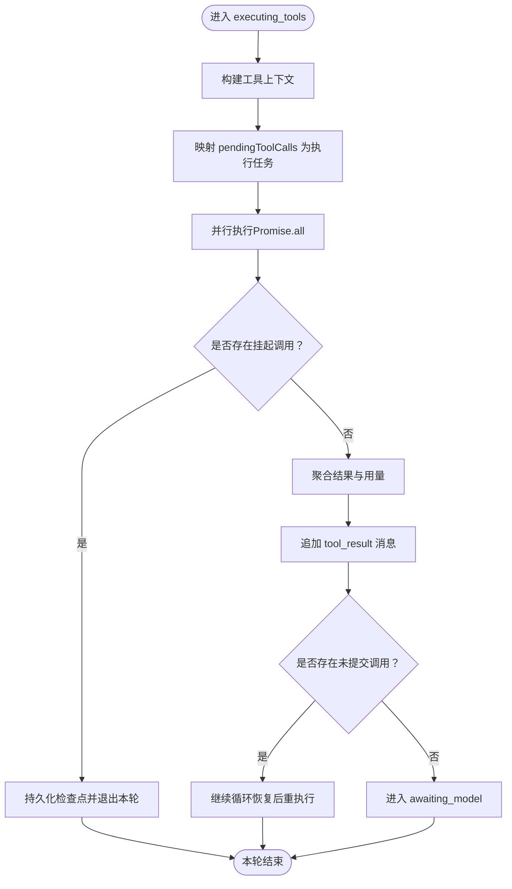
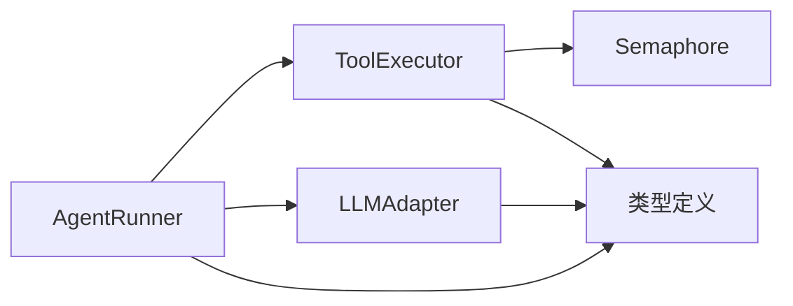

# 并行执行机制

<cite>
**本文引用的文件**
- [runner.ts](file://packages/core/src/agent/runner.ts)
- [executor.ts](file://packages/core/src/tool/executor.ts)
- [semaphore.ts](file://packages/core/src/utils/semaphore.ts)
- [types.ts](file://packages/core/src/types.ts)
- [openai.ts](file://packages/core/src/llm/openai.ts)
- [azure-openai.ts](file://packages/core/src/llm/azure-openai.ts)
- [ai-sdk.ts](file://packages/core/src/llm/ai-sdk.ts)
</cite>

## 目录
1. [简介](#简介)
2. [项目结构](#项目结构)
3. [核心组件](#核心组件)
4. [架构总览](#架构总览)
5. [详细组件分析](#详细组件分析)
6. [依赖关系分析](#依赖关系分析)
7. [性能考虑](#性能考虑)
8. [故障排查指南](#故障排查指南)
9. [结论](#结论)
10. [附录](#附录)

## 简介
本文件聚焦于工具调用的并行执行机制，围绕以下关键点展开：
- 从 LLM 响应中提取多个工具调用块（extractToolUseBlocks）
- parallelToolCalls 选项如何影响模型输出与执行路径
- 并发执行中的错误隔离与结果聚合
- 执行顺序保证、依赖关系分析与拓扑排序策略
- 并发控制：最大并发数、资源池与内存优化
- 错误处理：部分失败、重试与结果聚合
- 性能调优与最佳实践：批量调用模式与竞态规避

## 项目结构
与并行执行相关的关键代码分布在如下模块：
- AgentRunner：对话循环、工具调用提取与并行执行编排
- ToolExecutor：工具执行器，负责输入校验、门控、并发限制与错误封装
- Semaphore：轻量信号量，实现并发上限控制
- LLM 适配器：将 parallelToolCalls 透传到不同后端（OpenAI、Azure OpenAI、AI SDK）
- 类型定义：统一描述配置项、事件与运行时状态

图表来源
- [runner.ts:877-1320](file://packages/core/src/agent/runner.ts#L877-L1320)
- [executor.ts:85-164](file://packages/core/src/tool/executor.ts#L85-L164)
- [semaphore.ts:24-94](file://packages/core/src/utils/semaphore.ts#L24-L94)
- [openai.ts:223-264](file://packages/core/src/llm/openai.ts#L223-L264)
- [azure-openai.ts:145-193](file://packages/core/src/llm/azure-openai.ts#L145-L193)
- [ai-sdk.ts:436-437](file://packages/core/src/llm/ai-sdk.ts#L436-L437)
- [types.ts:1050-1059](file://packages/core/src/types.ts#L1050-L1059)

章节来源
- [runner.ts:877-1320](file://packages/core/src/agent/runner.ts#L877-L1320)
- [executor.ts:85-164](file://packages/core/src/tool/executor.ts#L85-L164)
- [semaphore.ts:24-94](file://packages/core/src/utils/semaphore.ts#L24-L94)
- [types.ts:1050-1059](file://packages/core/src/types.ts#L1050-L1059)
- [openai.ts:223-264](file://packages/core/src/llm/openai.ts#L223-L264)
- [azure-openai.ts:145-193](file://packages/core/src/llm/azure-openai.ts#L145-L193)
- [ai-sdk.ts:436-437](file://packages/core/src/llm/ai-sdk.ts#L436-L437)

## 核心组件
- AgentRunner
  - 负责对话主循环、工具调用块提取、并行执行编排、结果聚合与消息回写
  - 关键能力：extractToolUseBlocks、parallelToolCalls 透传、流式事件产出、检查点持久化
- ToolExecutor
  - 负责工具注册表查找、Zod 输入校验、可插拔门控（onToolCall）、并发上限（Semaphore）、输出截断与错误封装
  - 提供 executeBatch 用于批处理场景
- Semaphore
  - 无第三方依赖的计数信号量，支持 acquire/release/run 语义，保障并发上限
- LLM 适配器
  - 将 parallelToolCalls 映射到各后端字段（如 openai 的 parallel_tool_calls），并处理流式 tool_use 片段合并
- 类型系统
  - 统一描述 AgentConfig.parallelToolCalls、OrchestratorConfig.maxConcurrency、任务重试等

章节来源
- [runner.ts:307-309](file://packages/core/src/agent/runner.ts#L307-L309)
- [runner.ts:990-1137](file://packages/core/src/agent/runner.ts#L990-L1137)
- [executor.ts:85-164](file://packages/core/src/tool/executor.ts#L85-L164)
- [semaphore.ts:24-94](file://packages/core/src/utils/semaphore.ts#L24-L94)
- [types.ts:1050-1059](file://packages/core/src/types.ts#L1050-L1059)
- [types.ts:2132-2152](file://packages/core/src/types.ts#L2132-L2152)

## 架构总览
下图展示了从 LLM 响应到工具并行执行再到结果聚合的整体流程。

图表来源
- [runner.ts:1218-1320](file://packages/core/src/agent/runner.ts#L1218-L1320)
- [executor.ts:148-164](file://packages/core/src/tool/executor.ts#L148-L164)
- [semaphore.ts:76-83](file://packages/core/src/utils/semaphore.ts#L76-L83)
- [openai.ts:362-385](file://packages/core/src/llm/openai.ts#L362-L385)

## 详细组件分析

### 工具调用块提取：extractToolUseBlocks
- 作用：从 LLM 响应的 content 数组中筛选出所有 type 为 tool_use 的块，形成待执行的调用列表
- 行为：纯函数过滤，不改变原始消息；在 runner 中用于历史消息与新响应的统一处理
- 位置参考：[extractToolUseBlocks:307-309](file://packages/core/src/agent/runner.ts#L307-L309)

章节来源
- [runner.ts:307-309](file://packages/core/src/agent/runner.ts#L307-L309)
- [runner.ts:1218-1320](file://packages/core/src/agent/runner.ts#L1218-L1320)

### parallelToolCalls 的工作原理
- 配置入口：AgentConfig.parallelToolCalls（以及 RunnerOptions/CoordinatorConfig 对应字段）
- 传递路径：
  - Runner 在构造 chat 选项时透传 parallelToolCalls
  - 各适配器将其映射为后端字段（例如 OpenAI 的 parallel_tool_calls）
  - 当启用时，模型可能在单条 assistant 消息中返回多个 tool_use 块
- 行为约束：
  - 某些本地服务不支持并发 tool_call 增量，需显式关闭以避免截断或畸形输出
  - Anthropic 适配器忽略该字段
- 位置参考：
  - [AgentConfig.parallelToolCalls:1050-1059](file://packages/core/src/types.ts#L1050-L1059)
  - [OpenAI 适配器透传:223-264](file://packages/core/src/llm/openai.ts#L223-L264)
  - [Azure OpenAI 适配器透传:145-193](file://packages/core/src/llm/azure-openai.ts#L145-L193)
  - [AI SDK 适配器透传:436-437](file://packages/core/src/llm/ai-sdk.ts#L436-L437)

章节来源
- [types.ts:1050-1059](file://packages/core/src/types.ts#L1050-L1059)
- [openai.ts:223-264](file://packages/core/src/llm/openai.ts#L223-L264)
- [azure-openai.ts:145-193](file://packages/core/src/llm/azure-openai.ts#L145-L193)
- [ai-sdk.ts:436-437](file://packages/core/src/llm/ai-sdk.ts#L436-L437)

### 并行执行与结果聚合
- 执行方式：
  - Runner 在 executing_tools 阶段对 pendingToolCalls 进行并行执行
  - 使用 Promise.all 等待全部子任务完成，确保所有工具调用都被处理
  - 若某个调用被门控挂起（durable approval），会标记并提前结束本轮，等待外部决策
- 结果聚合：
  - 将每个执行的 commit.result 收集为 tool_result blocks
  - 追加到 conversationMessages 并作为 user 消息回传给 LLM
  - 同时产出 tool_result 流事件供上层消费
- 位置参考：
  - [并行执行与聚合:990-1137](file://packages/core/src/agent/runner.ts#L990-L1137)

注意：当前实现使用 Promise.all 而非 Promise.allSettled；但通过 ToolExecutor 的错误封装，单个工具异常不会导致整体失败，而是以 isError 的 ToolResult 形式返回，达到“部分失败不影响其他”的效果。

章节来源
- [runner.ts:990-1137](file://packages/core/src/agent/runner.ts#L990-L1137)
- [executor.ts:181-338](file://packages/core/src/tool/executor.ts#L181-L338)

### 执行顺序保证与依赖关系
- 同一 turn 内的多个 tool_use：
  - 由 Runner 按提取顺序生成 pendingToolCalls，并在后续聚合时保持顺序
  - 工具实际执行可能并行，但最终结果按原序写入 tool_result 消息
- 跨 turn 的依赖：
  - 框架在团队/任务编排层提供调度策略（如 dependency-first、composite），用于 DAG 级别的依赖优先执行
  - 这些策略作用于任务级拓扑，而非单 turn 的工具调用
- 位置参考：
  - [Runner 内顺序维护:1082-1102](file://packages/core/src/agent/runner.ts#L1082-L1102)
  - [调度策略定义:2132-2152](file://packages/core/src/types.ts#L2132-L2152)

章节来源
- [runner.ts:1082-1102](file://packages/core/src/agent/runner.ts#L1082-L1102)
- [types.ts:2132-2152](file://packages/core/src/types.ts#L2132-L2152)

### 并发控制策略
- 最大并发数：
  - ToolExecutor 默认并发上限为 4，可通过 maxConcurrency 调整
  - 基于内部 Semaphore 实现，避免过载
- 资源池管理：
  - Semaphore.run 自动 acquire/release，即使异常也能释放槽位
  - 适合 I/O 密集型工具（网络、磁盘）
- 内存使用优化：
  - 工具输出可配置最大字符数，超长输出会被截断（保留头尾与提示）
  - Runner 支持压缩已处理的工具结果，减少上下文膨胀
- 位置参考：
  - [并发上限与批处理:38-96](file://packages/core/src/tool/executor.ts#L38-96)
  - [信号量实现:24-94](file://packages/core/src/utils/semaphore.ts#L24-94)
  - [输出截断:490-518](file://packages/core/src/tool/executor.ts#L490-518)
  - [结果压缩](file://packages/core/src/types.ts:1111-1132)

章节来源
- [executor.ts:38-96](file://packages/core/src/tool/executor.ts#L38-L96)
- [semaphore.ts:24-94](file://packages/core/src/utils/semaphore.ts#L24-L94)
- [executor.ts:490-518](file://packages/core/src/tool/executor.ts#L490-L518)
- [types.ts:1111-1132](file://packages/core/src/types.ts#L1111-L1132)

### 错误处理策略
- 工具执行错误：
  - ToolExecutor 捕获所有异常，返回 isError=true 的 ToolResult，不抛出给调用方
  - 支持 onToolCall 门控拒绝或挂起（suspend）
- 部分失败与聚合：
  - Runner 聚合所有工具结果，包含失败结果，继续推进对话
  - 若存在未提交（shouldCommit=false）或挂起的调用，Runner 会停留在 executing_tools 并持久化检查点
- 重试机制：
  - 任务级重试配置（maxRetries、retryDelayMs、retryBackoff）适用于任务编排层
  - 工具级重试需在上层应用逻辑中实现（Runner 不内置工具重试）
- 位置参考：
  - [错误封装与门控:181-338](file://packages/core/src/tool/executor.ts#L181-338)
  - [Runner 聚合与挂起处理](file://packages/core/src/agent/runner.ts:1061-1137)
  - [任务重试配置](file://packages/core/src/types.ts:2082-2088)

章节来源
- [executor.ts:181-338](file://packages/core/src/tool/executor.ts#L181-L338)
- [runner.ts:1061-1137](file://packages/core/src/agent/runner.ts#L1061-L1137)
- [types.ts:2082-2088](file://packages/core/src/types.ts#L2082-L2088)

### 并发执行流程图（算法视角）

图表来源
- [runner.ts:990-1137](file://packages/core/src/agent/runner.ts#L990-L1137)

## 依赖关系分析
- Runner 依赖：
  - ToolRegistry/ToolExecutor：解析可用工具并执行
  - LLMAdapter：发送消息、接收 tool_use 与文本
  - 类型定义：统一配置与事件契约
- ToolExecutor 依赖：
  - Semaphore：并发上限控制
  - Zod：输入/输出校验
  - 门控回调：onToolCall 与 durable approval
- LLM 适配器依赖：
  - 将 parallelToolCalls 映射到具体后端参数

图表来源
- [runner.ts:877-1320](file://packages/core/src/agent/runner.ts#L877-L1320)
- [executor.ts:85-164](file://packages/core/src/tool/executor.ts#L85-L164)
- [semaphore.ts:24-94](file://packages/core/src/utils/semaphore.ts#L24-L94)
- [types.ts:1050-1059](file://packages/core/src/types.ts#L1050-L1059)

章节来源
- [runner.ts:877-1320](file://packages/core/src/agent/runner.ts#L877-L1320)
- [executor.ts:85-164](file://packages/core/src/tool/executor.ts#L85-L164)
- [semaphore.ts:24-94](file://packages/core/src/utils/semaphore.ts#L24-L94)
- [types.ts:1050-1059](file://packages/core/src/types.ts#L1050-L1059)

## 性能考虑
- 合理设置 parallelToolCalls：
  - 云 OpenAI 默认允许并发 tool calls；本地服务可能需关闭以避免截断
- 控制并发上限：
  - 根据工具 I/O 特性调整 ToolExecutor.maxConcurrency（默认 4）
- 输出大小控制：
  - 使用 maxToolOutputChars 或 per-tool maxOutputChars 防止大输出占用上下文
- 上下文压缩：
  - 启用 compressToolResults 或 contextStrategy（summarize/compact）降低长对话成本
- 超时与取消：
  - 使用 callTimeoutMs 限制单次模型调用耗时；结合 AbortSignal 实现整体取消

章节来源
- [types.ts:1050-1059](file://packages/core/src/types.ts#L1050-L1059)
- [executor.ts:38-96](file://packages/core/src/tool/executor.ts#L38-L96)
- [types.ts:1111-1132](file://packages/core/src/types.ts#L1111-L1132)
- [runner.ts:561-582](file://packages/core/src/agent/runner.ts#L561-L582)

## 故障排查指南
- 现象：部分工具失败但不影响整体
  - 原因：ToolExecutor 将异常封装为 isError ToolResult，Runner 聚合后继续
  - 处理：检查 tool_result 中的 error 信息，必要时在上层重试
- 现象：工具调用被挂起
  - 原因：onToolCall 返回 suspend 或 durable approval 未决
  - 处理：等待外部审批决策，Runner 会在恢复后重放未提交的调用
- 现象：本地服务 tool_calls 被截断
  - 原因：parallelToolCalls 开启但后端不支持并发 tool_call 增量
  - 处理：设置 parallelToolCalls=false
- 现象：上下文过大导致成本飙升
  - 原因：工具结果过长且未压缩
  - 处理：启用 compressToolResults 或设置 maxToolOutputChars

章节来源
- [executor.ts:181-338](file://packages/core/src/tool/executor.ts#L181-L338)
- [runner.ts:1061-1137](file://packages/core/src/agent/runner.ts#L1061-L1137)
- [types.ts:1050-1059](file://packages/core/src/types.ts#L1050-L1059)
- [types.ts:1111-1132](file://packages/core/src/types.ts#L1111-L1132)

## 结论
- 工具调用并行执行由 AgentRunner 编排，配合 ToolExecutor 的并发上限与错误封装，实现高吞吐与强鲁棒性
- parallelToolCalls 控制模型是否在同一 turn 返回多个 tool_use；适配层负责透传到具体后端
- 执行顺序在 turn 内保持原序，跨 turn 依赖由编排层的调度策略保证
- 错误处理采用“部分失败不中断整体”的策略，并通过检查点与挂起机制支持可恢复执行
- 性能调优应关注并发上限、输出截断、上下文压缩与超时控制

## 附录
- 关键配置项速查
  - AgentConfig.parallelToolCalls：是否允许单 turn 多工具调用
  - ToolExecutorOptions.maxConcurrency：工具执行最大并发
  - OrchestratorConfig.schedulingStrategy：任务级调度策略（dependency-first 等）
  - AgentConfig.compressToolResults：是否压缩已处理的工具结果
  - AgentConfig.callTimeoutMs：单次模型调用超时

章节来源
- [types.ts:1050-1059](file://packages/core/src/types.ts#L1050-L1059)
- [executor.ts:38-96](file://packages/core/src/tool/executor.ts#L38-L96)
- [types.ts:2132-2152](file://packages/core/src/types.ts#L2132-L2152)
- [types.ts:1111-1132](file://packages/core/src/types.ts#L1111-L1132)
- [runner.ts:561-582](file://packages/core/src/agent/runner.ts#L561-L582)