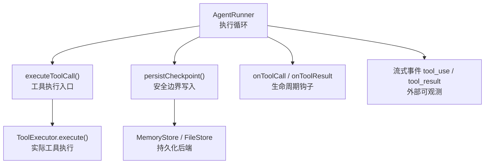
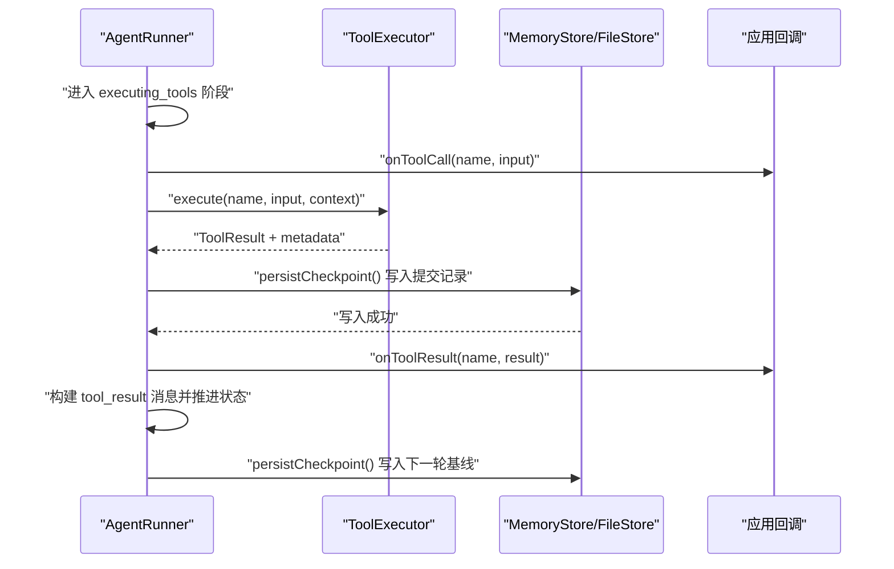
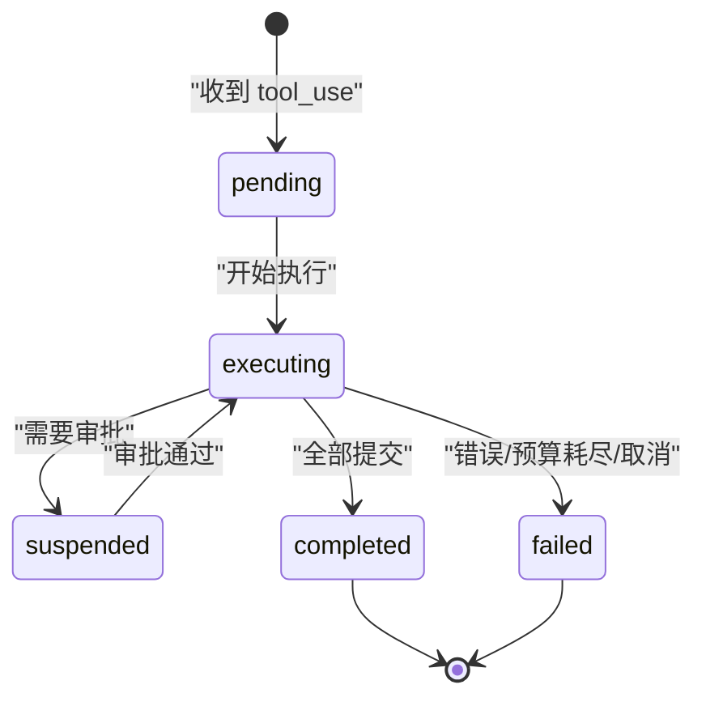
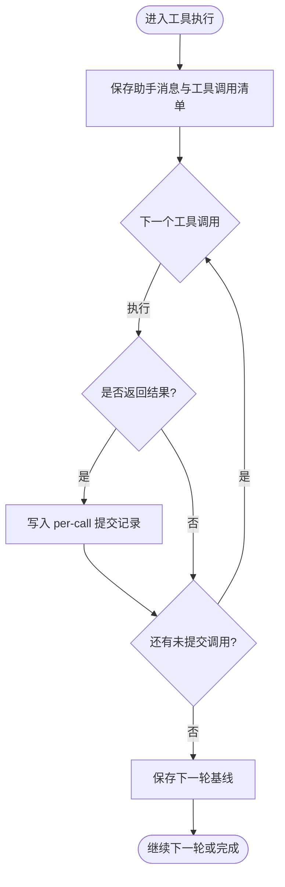
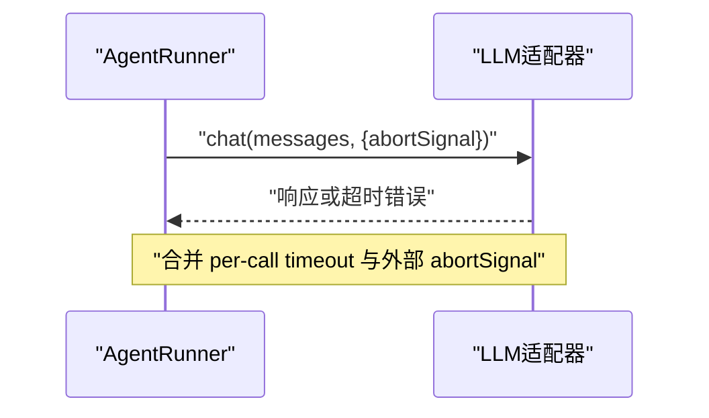
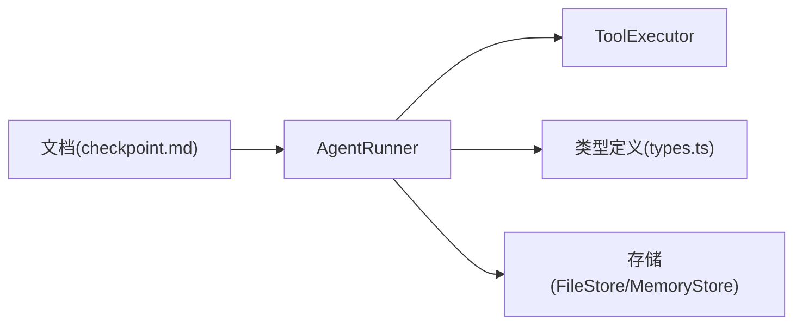

# 生命周期管理

<cite>
**本文引用的文件**
- [runner.ts](file://packages/core/src/agent/runner.ts)
- [types.ts](file://packages/core/src/types.ts)
- [checkpoint.md](file://docs/checkpoint.md)
- [tool-configuration.md](file://docs/tool-configuration.md)
- [file-store.ts](file://packages/core/src/memory/file-store.ts)
</cite>

## 目录
1. [简介](#简介)
2. [项目结构](#项目结构)
3. [核心组件](#核心组件)
4. [架构总览](#架构总览)
5. [详细组件分析](#详细组件分析)
6. [依赖关系分析](#依赖关系分析)
7. [性能考量](#性能考量)
8. [故障排查指南](#故障排查指南)
9. [结论](#结论)
10. [附录](#附录)

## 简介
本文件系统性解析工具调用的完整生命周期：从 onToolCall 回调触发、执行、结果处理到状态流转（pending → executing → completed/failed），并深入说明 checkpoint 机制在工具执行中的作用（持久化点、恢复策略与事务保证）、onToolResult 的工作机制（结果序列化、压缩与媒体内容剥离）、超时控制（单个工具、整体执行、取消信号）以及错误恢复策略（自动重试、降级、回滚）。最后提供自定义生命周期钩子的实现指南，涵盖监控集成、审计日志与性能分析的最佳实践。

## 项目结构
围绕工具调用生命周期的关键代码集中在 AgentRunner 的执行循环与工具执行辅助方法中；类型定义描述了检查点、任务队列、工具提交记录等数据结构；文档提供了检查点与恢复的规范说明；存储实现提供了持久化能力。

图表来源
- [runner.ts:990-1138](file://packages/core/src/agent/runner.ts#L990-L1138)
- [runner.ts:1364-1546](file://packages/core/src/agent/runner.ts#L1364-L1546)
- [types.ts:2482-2499](file://packages/core/src/types.ts#L2482-L2499)
- [file-store.ts:23-54](file://packages/core/src/memory/file-store.ts#L23-L54)

章节来源
- [runner.ts:990-1138](file://packages/core/src/agent/runner.ts#L990-L1138)
- [runner.ts:1364-1546](file://packages/core/src/agent/runner.ts#L1364-L1546)
- [types.ts:2482-2499](file://packages/core/src/types.ts#L2482-L2499)
- [file-store.ts:23-54](file://packages/core/src/memory/file-store.ts#L23-L54)

## 核心组件
- AgentRunner 执行循环：负责 LLM 回合、工具调用批处理、状态推进与检查点写入。
- executeToolCall：单条工具调用的执行封装，包含授权校验、执行、结果包装、追踪埋点、提交决策。
- ToolExecution 结构：承载 commit、result、shouldCommit、suspension、approvalRequest 等元信息。
- Checkpoint 机制：在安全边界写入 InFlightTaskCheckpoint，支持恢复时重放已提交结果或重跑未提交调用。
- 存储后端：MemoryStore/FileStore 提供原子写入与跨进程恢复语义。

章节来源
- [runner.ts:440-453](file://packages/core/src/agent/runner.ts#L440-L453)
- [runner.ts:916-938](file://packages/core/src/agent/runner.ts#L916-L938)
- [types.ts:2482-2499](file://packages/core/src/types.ts#L2482-L2499)
- [checkpoint.md:109-153](file://docs/checkpoint.md#L109-L153)

## 架构总览
下图展示了从模型请求工具到结果落盘、再到下一轮 LLM 调用的端到端流程，以及检查点在其中的作用。

图表来源
- [runner.ts:990-1138](file://packages/core/src/agent/runner.ts#L990-L1138)
- [runner.ts:1364-1546](file://packages/core/src/agent/runner.ts#L1364-L1546)
- [types.ts:2482-2499](file://packages/core/src/types.ts#L2482-L2499)

## 详细组件分析

### 工具调用状态机与流转规则
- pending：模型返回 tool_use 块后，构造 pendingToolCalls，尚未执行。
- executing：逐个执行工具调用，可能产生 suspension（需要审批）或正常结果。
- completed：所有调用均提交 commit 记录，合并为 tool_result 消息，推进到 awaiting_model 或 completed。
- failed：当出现不可恢复错误或预算耗尽时，标记完成并上报 error/budget_exceeded。

图表来源
- [runner.ts:990-1138](file://packages/core/src/agent/runner.ts#L990-L1138)
- [runner.ts:1307-1138](file://packages/core/src/agent/runner.ts#L1307-L1138)

章节来源
- [runner.ts:990-1138](file://packages/core/src/agent/runner.ts#L990-L1138)
- [runner.ts:1307-1138](file://packages/core/src/agent/runner.ts#L1307-L1138)

### checkpoint 机制：持久化点、恢复策略与事务保证
- 持久化点：在进入 executing_tools 前、每个工具提交后、审批挂起时、每轮结束等安全边界写入检查点。
- 恢复策略：恢复时重放已提交的 tool_result，跳过已完成任务；未提交的调用保守重跑；并行调用独立，互不影响。
- 事务保证：普通写入失败不中断运行（best-effort），但 suspension 必须严格持久化（fail closed）；FileStore 使用原子写（临时文件→fsync→rename）避免半写。

图表来源
- [checkpoint.md:206-220](file://docs/checkpoint.md#L206-L220)
- [runner.ts:1045-1057](file://packages/core/src/agent/runner.ts#L1045-L1057)
- [file-store.ts:49-73](file://packages/core/src/memory/file-store.ts#L49-L73)

章节来源
- [checkpoint.md:109-153](file://docs/checkpoint.md#L109-L153)
- [checkpoint.md:206-220](file://docs/checkpoint.md#L206-L220)
- [runner.ts:1045-1057](file://packages/core/src/agent/runner.ts#L1045-L1057)
- [file-store.ts:49-73](file://packages/core/src/memory/file-store.ts#L49-L73)

### onToolResult 工作机制：序列化、压缩与媒体剥离
- 结果序列化：ToolResult 的 modelOutput 会被拷贝并转换为模型可见的内容块；data 保持应用私有，不被直接序列化进对话。
- 压缩处理：旧的工具结果可在被消费后进行压缩以减少后续 token 成本；错误结果不会被压缩。
- 媒体内容剥离：对历史 trace/摘要输出进行文本化摘要，避免内联 base64 或 URL 泄露；富媒体仅在必要路径保留。

章节来源
- [tool-configuration.md:507-649](file://docs/tool-configuration.md#L507-L649)
- [runner.ts:1460-1520](file://packages/core/src/agent/runner.ts#L1460-L1520)

### 超时控制：单个工具、整体执行与取消信号
- 单个工具超时：工具执行本身由上层 executor 控制；若工具抛出异常，将被包装为 isError 的结果，不会中断整个运行。
- 整体执行超时：LLM 调用层支持 per-call 超时与 abortSignal 合并，超时会抛出特定错误类型。
- 取消信号：在执行循环各阶段检查 effectiveAbortSignal；若因取消导致工具结果为错误且未提交，则视为“无提交记录”，恢复时将重新执行该调用。

图表来源
- [runner.ts:566-582](file://packages/core/src/agent/runner.ts#L566-L582)
- [runner.ts:1104-1114](file://packages/core/src/agent/runner.ts#L1104-L1114)

章节来源
- [runner.ts:566-582](file://packages/core/src/agent/runner.ts#L566-L582)
- [runner.ts:1104-1114](file://packages/core/src/agent/runner.ts#L1104-L1114)

### 错误恢复策略：自动重试、降级与回滚
- 自动重试：框架未内置通用工具级重试；可通过外层调度器或工具自身实现幂等与重试。
- 降级：当工具不可用或被拒绝时，返回结构化错误结果，允许模型自适应调整下一步动作。
- 回滚：checkpoint 不支持跨系统事务回滚；建议工具侧使用 idempotency key（如 runId:taskId:toolCallId）避免重复副作用。

章节来源
- [checkpoint.md:221-250](file://docs/checkpoint.md#L221-L250)
- [runner.ts:1429-1433](file://packages/core/src/agent/runner.ts#L1429-L1433)

### 自定义生命周期钩子：监控、审计与性能分析
- onToolCall：在输入校验之后、工具执行之前调用，可用于权限校验、审计、限流、风险分类等。
- onToolResult：在结果持久化之后调用，适合指标收集、审计日志、下游通知等。
- 追踪埋点：工具执行会创建 span，携带 agent/tool/task 属性；legacy trace 事件包含 gated/gateAction/gateReason 等字段。
- 最佳实践：
  - 将敏感信息脱敏后再落盘或上报。
  - 使用统一的 span 命名与属性约定，便于查询与聚合。
  - 在 onToolCall 中快速失败，避免昂贵副作用。
  - 结合 checkpoint 与 approval gate 实现可恢复的人审流程。

章节来源
- [runner.ts:1374-1507](file://packages/core/src/agent/runner.ts#L1374-L1507)
- [tool-configuration.md:326-363](file://docs/tool-configuration.md#L326-L363)

## 依赖关系分析
- AgentRunner 依赖 ToolExecutor 执行具体工具逻辑，并通过 MemoryStore/FileStore 写入检查点。
- types.ts 定义了 ToolCallCommitCheckpoint、PendingToolCallCheckpoint 等关键结构，确保 checkpoint 与恢复的一致性。
- checkpoint.md 明确了保存范围与恢复语义，指导 runner 在正确时机写入。
- file-store.ts 提供原子写入保障，避免部分写入导致的损坏。

图表来源
- [runner.ts:990-1138](file://packages/core/src/agent/runner.ts#L990-L1138)
- [types.ts:2482-2499](file://packages/core/src/types.ts#L2482-L2499)
- [checkpoint.md:109-153](file://docs/checkpoint.md#L109-L153)
- [file-store.ts:49-73](file://packages/core/src/memory/file-store.ts#L49-L73)

章节来源
- [runner.ts:990-1138](file://packages/core/src/agent/runner.ts#L990-L1138)
- [types.ts:2482-2499](file://packages/core/src/types.ts#L2482-L2499)
- [checkpoint.md:109-153](file://docs/checkpoint.md#L109-L153)
- [file-store.ts:49-73](file://packages/core/src/memory/file-store.ts#L49-L73)

## 性能考量
- 批量执行：工具调用以 Promise.all 并发执行，提升吞吐；但需关注外部资源竞争与速率限制。
- 检查点频率：在安全边界写入，避免每次工具结果都落盘造成 I/O 压力。
- 结果压缩：对旧结果进行压缩可减少后续 token 成本，提高整体效率。
- 媒体内容：富媒体会增加请求体大小与存储体积，应谨慎使用并考虑引用而非内联。

[本节为通用指导，无需特定文件引用]

## 故障排查指南
- 工具未被授权：若模型请求了未授予的工具，将返回结构化错误结果，检查工具白名单与 preset 配置。
- 审批挂起：若工具请求 suspend，需确保 checkpoint 与 approval 基础设施可用，否则将转为错误。
- 恢复重跑：若工具未提交结果，恢复后会重跑；请确保工具具备幂等性或使用 idempotency key。
- 超时与取消：检查 per-call 超时设置与 abortSignal 传递；确认取消路径下 shouldCommit 判断是否正确。

章节来源
- [runner.ts:1391-1403](file://packages/core/src/agent/runner.ts#L1391-L1403)
- [runner.ts:1436-1458](file://packages/core/src/agent/runner.ts#L1436-L1458)
- [checkpoint.md:221-250](file://docs/checkpoint.md#L221-L250)

## 结论
工具调用的生命周期在 AgentRunner 中被严格编排，通过 checkpoint 机制在安全边界持久化状态，确保崩溃后可恢复；onToolCall/onToolResult 提供灵活的扩展点用于治理与可观测性；超时与取消信号贯穿执行链路，保障资源可控；错误处理以结构化结果为主，配合幂等与 idempotency key 实现稳健的恢复策略。生产环境建议结合审计、脱敏与监控，完善全链路可观测性与安全性。

[本节为总结，无需特定文件引用]

## 附录
- 关键类型参考：ToolCallCommitCheckpoint、PendingToolCallCheckpoint、CheckpointOptions、RestoreOptions。
- 存储实现参考：FileStore 的原子写入与单进程并发安全。
- 工具配置参考：默认拒绝、预设、白名单/黑名单、后果性工具确认、富结果与压缩策略。

章节来源
- [types.ts:2349-2377](file://packages/core/src/types.ts#L2349-L2377)
- [types.ts:2482-2499](file://packages/core/src/types.ts#L2482-L2499)
- [file-store.ts:49-73](file://packages/core/src/memory/file-store.ts#L49-L73)
- [tool-configuration.md:214-290](file://docs/tool-configuration.md#L214-L290)
- [tool-configuration.md:507-649](file://docs/tool-configuration.md#L507-L649)