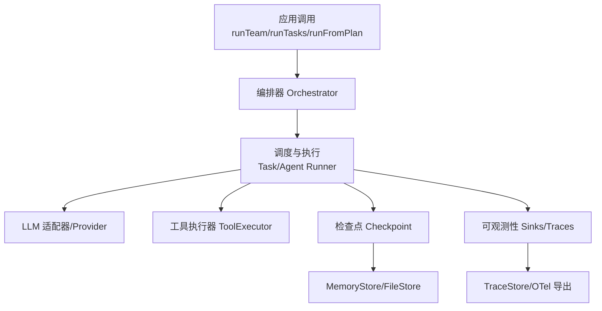
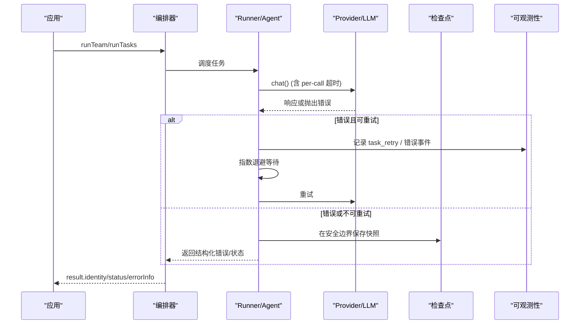
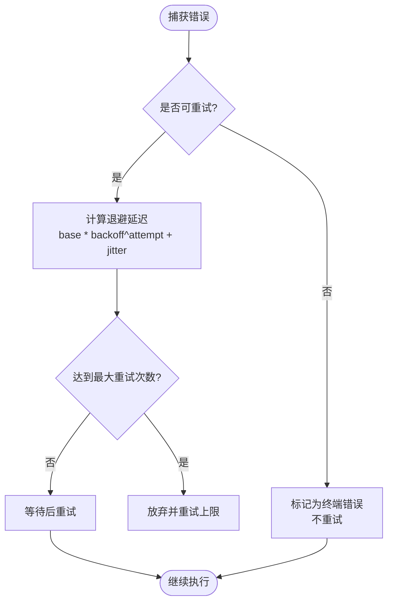
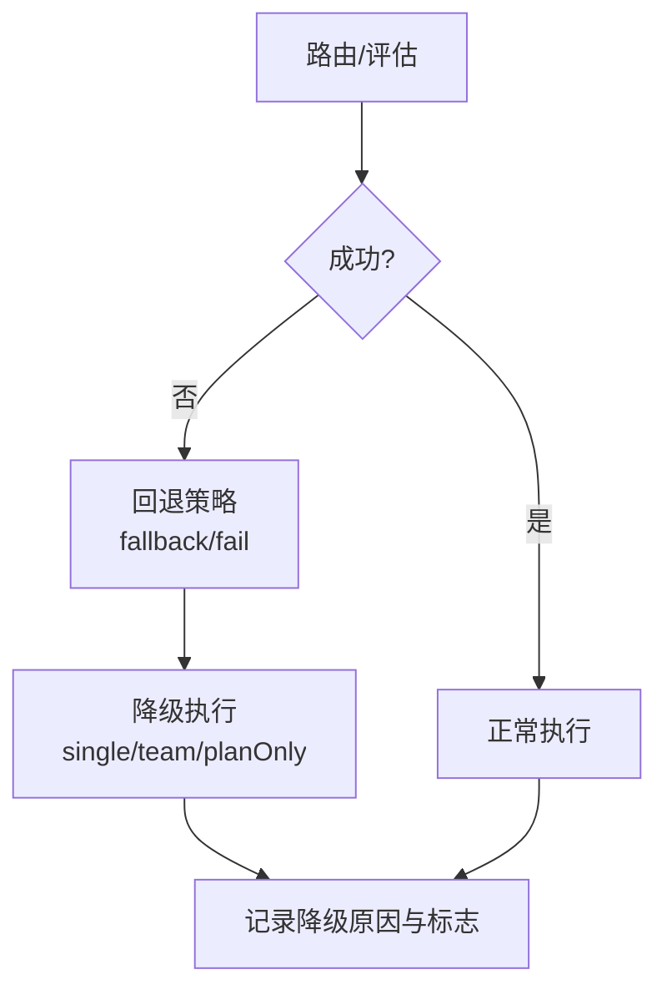
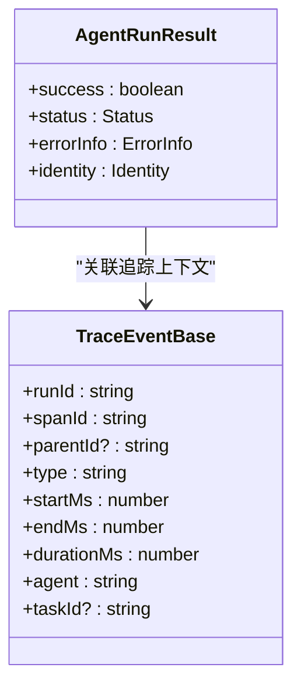
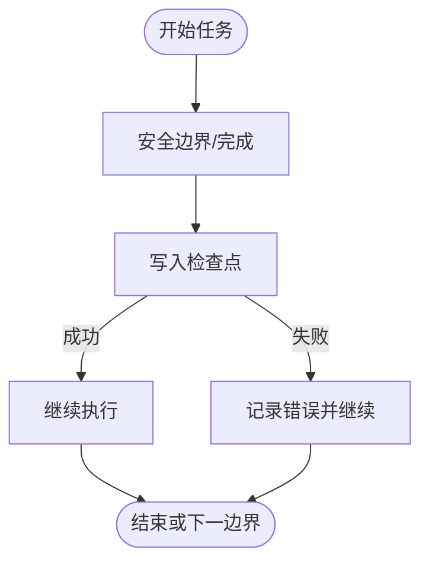
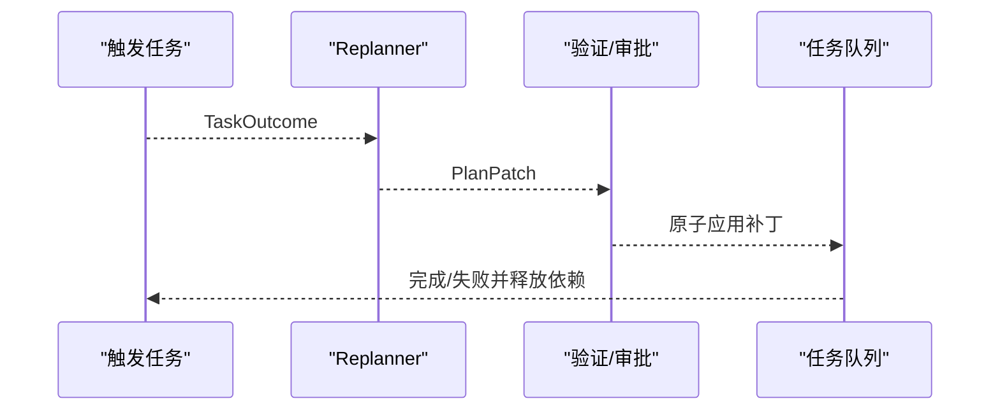
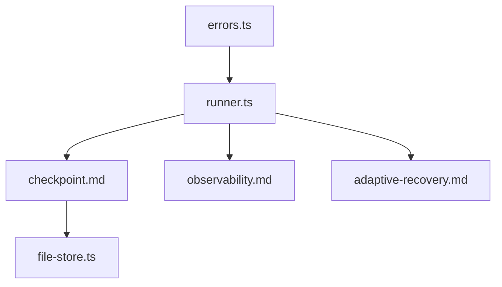

# 错误处理与恢复

<cite>
**本文引用的文件**
- [README.md](file://README.md)
- [adaptive-recovery.md](file://docs/adaptive-recovery.md)
- [checkpoint.md](file://docs/checkpoint.md)
- [observability.md](file://docs/observability.md)
- [tool-configuration.md](file://docs/tool-configuration.md)
- [errors.ts](file://packages/core/src/errors.ts)
- [types.ts](file://packages/core/src/types.ts)
- [runner.ts](file://packages/core/src/agent/runner.ts)
- [file-store.ts](file://packages/core/src/memory/file-store.ts)
</cite>

## 目录
1. [简介](#简介)
2. [项目结构](#项目结构)
3. [核心组件](#核心组件)
4. [架构总览](#架构总览)
5. [详细组件分析](#详细组件分析)
6. [依赖关系分析](#依赖关系分析)
7. [性能考量](#性能考量)
8. [故障排查指南](#故障排查指南)
9. [结论](#结论)
10. [附录](#附录)

## 简介
本文件系统性解析 Open Multi-Agent（OMA）在工具执行过程中的错误分类、重试机制、故障转移、异常传播、检查点恢复以及监控告警能力。重点覆盖网络错误、权限错误、超时错误与业务逻辑错误的处理策略；说明指数退避、最大重试次数与重试条件判断；阐述备用工具选择、降级执行与优雅降级；解释错误上下文保留、堆栈跟踪与调试信息收集；并给出检查点在断点保存、状态恢复和数据一致性中的作用，以及错误指标、日志与通知的配置方法。

## 项目结构
- 文档层：包含自适应恢复、检查点与恢复、可观测性、工具配置等专题文档，提供高层策略与使用方式。
- 代码层：核心包 packages/core/src 提供错误类型定义、运行时分类、任务与代理执行器、存储与持久化等实现。
- 关键入口：OpenMultiAgent 编排器负责运行团队/任务/计划，并在执行过程中集成重试、恢复、检查点与可观测性。

图表来源
- [runner.ts:597-666](file://packages/core/src/agent/runner.ts#L597-L666)
- [checkpoint.md:109-156](file://docs/checkpoint.md#L109-L156)
- [observability.md:185-222](file://docs/observability.md#L185-L222)

章节来源
- [README.md:140-157](file://README.md#L140-L157)
- [observability.md:1-41](file://docs/observability.md#L1-41)

## 核心组件
- 错误分类与重试判定：集中定义框架错误类型与“是否可重试”的判断逻辑，区分网络抖动、限流、超时、取消与业务不可重试错误。
- 执行器与 LLM 调用：为每次模型调用设置 per-call 超时，捕获并分类失败原因，输出结构化错误信息。
- 检查点与恢复：在安全边界持久化任务队列、共享内存、进行中 runner 状态与审批延续，支持崩溃后恢复与幂等重放。
- 自适应恢复：在任务结果屏障处提出仅追加的修复方案，经校验与审批后原子应用，避免下游任务提前启动。
- 可观测性与告警：通过 onProgress/onTrace/sinks 暴露事件与 span，支持批量导出、重试、丢弃与诊断。

章节来源
- [errors.ts:188-238](file://packages/core/src/errors.ts#L188-L238)
- [runner.ts:616-666](file://packages/core/src/agent/runner.ts#L616-L666)
- [checkpoint.md:109-156](file://docs/checkpoint.md#L109-L156)
- [adaptive-recovery.md:1-21](file://docs/adaptive-recovery.md#L1-L21)
- [observability.md:602-615](file://docs/observability.md#L602-L615)

## 架构总览
下图展示一次带重试、检查点与可观测性的典型执行流程，包括错误分类、退避重试、检查点保存与恢复路径。

图表来源
- [runner.ts:616-666](file://packages/core/src/agent/runner.ts#L616-L666)
- [checkpoint.md:109-156](file://docs/checkpoint.md#L109-L156)
- [observability.md:602-615](file://docs/observability.md#L602-L615)

## 详细组件分析

### 错误分类与重试机制
- 错误类型
  - 任务要求不满足、预算超限、消息格式非法、不支持的工具调用/结果内容、路由相关错误、LLM 调用超时、路由超时等。
- 可重试判定
  - 保守设计：除非明确为终端错误（如预算耗尽、输入非法、用户取消、非特定 4xx），否则视为可重试；网络抖动、请求超时(408)、冲突(409)、限流(429)与所有 5xx 均视为可重试。
- 重试参数
  - 每个任务可配置最大重试次数、基础延迟、指数退避倍数；进度事件会携带实际下一次延迟（含抖动）。
- 调用级超时
  - 对单次 LLM 调用设置 per-call 超时，独立于整个运行超时与调用方取消信号；超时会被分类为 timeout 并进入重试或终止策略。

图表来源
- [errors.ts:208-238](file://packages/core/src/errors.ts#L208-L238)
- [types.ts:2082-2088](file://packages/core/src/types.ts#L2082-L2088)
- [observability.md:602-615](file://docs/observability.md#L602-L615)

章节来源
- [errors.ts:7-180](file://packages/core/src/errors.ts#L7-L180)
- [errors.ts:188-238](file://packages/core/src/errors.ts#L188-L238)
- [types.ts:2082-2088](file://packages/core/src/types.ts#L2082-L2088)
- [runner.ts:616-666](file://packages/core/src/agent/runner.ts#L616-L666)

### 故障转移与降级执行
- 备用工具/代理选择
  - 通过执行路由与语义评估选择单代理或团队拓扑；当路由/评估失败或超时时，按策略回退到默认确定性路由或降级模式。
- 优雅降级
  - 在预算受限或高成本场景下，可将“首选治理角色”降级为尝试或跳过，并以标志位披露原因（例如 review-skipped-due-to-budget）。
- 工具授权与拒绝
  - 内置工具默认拒绝，需显式授权；未授权的调用返回明确的错误结果而非抛错，便于上层降级或提示。

图表来源
- [tool-configuration.md:52-138](file://docs/tool-configuration.md#L52-L138)
- [observability.md:632-667](file://docs/observability.md#L632-L667)

章节来源
- [tool-configuration.md:52-138](file://docs/tool-configuration.md#L52-L138)
- [tool-configuration.md:214-250](file://docs/tool-configuration.md#L214-L250)
- [observability.md:632-667](file://docs/observability.md#L632-L667)

### 异常传播与调试信息
- 结构化错误信息
  - 每次运行返回 identity、status、errorInfo；错误信息经过脱敏与 JSON 安全化处理，便于跨进程/存储传递。
- 上下文保留
  - 追踪事件携带 runId、spanId、parentId、duration、token/cost、agent/task/model/provider 等上下文；恢复时链接到前次尝试。
- 堆栈与诊断
  - 内部诊断不包含敏感数据；导出失败、丢弃、重试等统计可通过 sink 诊断获取；onProgress 提供轻量生命周期事件。

图表来源
- [observability.md:12-41](file://docs/observability.md#L12-L41)
- [observability.md:2668-2705](file://packages/core/src/types.ts#L2668-L2705)

章节来源
- [observability.md:12-41](file://docs/observability.md#L12-L41)
- [observability.md:572-600](file://docs/observability.md#L572-L600)

### 检查点与恢复
- 保存时机与内容
  - 在安全的执行边界与任务完成后保存快照，包含执行身份、任务队列状态、共享内存、已完成任务结果、进行中的 runner 状态、审批延续等。
- 恢复行为
  - restore 加载最新检查点，重建队列与共享内存，跳过已完成任务，必要时重新运行协调器综合步骤；若无可用的协调器配置则尽力而为。
- 中间工具恢复
  - 模型发起的工具调用具备每调用提交记录；恢复时已提交的结果直接回放，未提交的保守重跑；通过 toolCallId 保证幂等。
- 持久化与原子性
  - FileStore 以原子写入（临时文件→fsync→rename）确保断电/崩溃一致性；检查点保存失败不会中断运行，但挂起审批必须严格保存。

图表来源
- [checkpoint.md:109-156](file://docs/checkpoint.md#L109-L156)
- [checkpoint.md:206-249](file://docs/checkpoint.md#L206-L249)
- [file-store.ts:1-23](file://packages/core/src/memory/file-store.ts#L1-L23)

章节来源
- [checkpoint.md:109-156](file://docs/checkpoint.md#L109-L156)
- [checkpoint.md:206-249](file://docs/checkpoint.md#L206-L249)
- [file-store.ts:1-23](file://packages/core/src/memory/file-store.ts#L1-L23)

### 自适应恢复（故障转移与补丁）
- 任务结果屏障
  - 任务产生结果后，Replanner 可提议 PlanPatch（新增任务、重定向待执行任务、替换分支），经校验与审批后原子应用，再发布新就绪工作。
- 限制与边界
  - 限制修订次数与新增任务数；不接受对历史任务的改写；恢复仅向前，不撤销外部副作用。
- 与检查点协作
  - 接受修订后，若启用检查点则在派发新增工作前保存；保存失败则回滚补丁并走原失败路径。

图表来源
- [adaptive-recovery.md:1-21](file://docs/adaptive-recovery.md#L1-L21)
- [adaptive-recovery.md:82-129](file://docs/adaptive-recovery.md#L82-L129)

章节来源
- [adaptive-recovery.md:1-21](file://docs/adaptive-recovery.md#L1-L21)
- [adaptive-recovery.md:82-129](file://docs/adaptive-recovery.md#L82-L129)

### 监控与告警配置
- 进度事件
  - onProgress 提供 task_start/complete/retry/skipped/budget_exceeded/error 等事件；task_retry 携带下一次延迟。
- 追踪与导出
  - onTrace 或 observability.sinks 接收 v2 TraceRecord；BatchingTraceSink 支持批处理、重试、丢弃与诊断；支持 OTel 适配。
- 存储与查询
  - InMemoryTraceStore/FileTraceStore 用于本地/测试；支持查询、删除、保留策略；FileTraceStore 提供原子写入与压缩。
- 告警建议
  - 基于 status 过滤 error/timeout/budget_exhausted；结合 agent/task/model/provider 维度聚合；对 exporter 失败与丢弃计数设置阈值告警。

图表来源
- [observability.md:185-222](file://docs/observability.md#L185-L222)
- [observability.md:527-600](file://docs/observability.md#L527-L600)
- [observability.md:224-384](file://docs/observability.md#L224-L384)

章节来源
- [observability.md:602-615](file://docs/observability.md#L602-L615)
- [observability.md:185-222](file://docs/observability.md#L185-L222)
- [observability.md:527-600](file://docs/observability.md#L527-L600)

## 依赖关系分析
- 错误分类依赖 errors.ts 中 isRetryableError 与各类错误类型；执行器在 LLM 调用边界统一分类并产出结构化错误。
- 检查点依赖 MemoryStore/FileStore 的原子写入与一致性；恢复依赖 checkpoint 快照与审批延续记录。
- 自适应恢复依赖 Replanner/PlanPatch 与任务队列的版本化快照；与检查点协同保证原子应用与回滚。
- 可观测性依赖 sinks/exporters/trace store，与业务执行解耦，失败不影响主流程。

图表来源
- [errors.ts:188-238](file://packages/core/src/errors.ts#L188-L238)
- [runner.ts:616-666](file://packages/core/src/agent/runner.ts#L616-L666)
- [checkpoint.md:109-156](file://docs/checkpoint.md#L109-L156)
- [file-store.ts:1-23](file://packages/core/src/memory/file-store.ts#L1-L23)
- [adaptive-recovery.md:1-21](file://docs/adaptive-recovery.md#L1-L21)
- [observability.md:185-222](file://docs/observability.md#L185-L222)

章节来源
- [errors.ts:188-238](file://packages/core/src/errors.ts#L188-L238)
- [runner.ts:616-666](file://packages/core/src/agent/runner.ts#L616-L666)
- [checkpoint.md:109-156](file://docs/checkpoint.md#L109-L156)
- [file-store.ts:1-23](file://packages/core/src/memory/file-store.ts#L1-L23)
- [adaptive-recovery.md:1-21](file://docs/adaptive-recovery.md#L1-L21)
- [observability.md:185-222](file://docs/observability.md#L185-L222)

## 性能考量
- 重试退避
  - 指数退避配合抖动与上限，避免雪崩；仅在可重试错误上重试，减少无效开销。
- 检查点频率
  - 在安全边界与任务完成后保存，避免频繁 I/O；FileStore 原子写入降低竞争与损坏风险。
- 可观测性缓冲
  - BatchingTraceSink 默认队列与批次大小、导出超时与重试次数可控；溢出时按优先级丢弃，保障业务执行不受阻塞。
- 工具输出控制
  - maxToolOutputChars 与压缩策略减少上下文膨胀；富媒体结果谨慎使用 inline base64，优先 URL 引用以降低传输与存储成本。

[本节为通用指导，无需具体文件引用]

## 故障排查指南
- 常见错误场景
  - 网络抖动/限流：观察 task_retry 事件与错误码 429/5xx；调整 retryDelayMs、retryBackoff、maxRetries。
  - 超时错误：per-call 超时 vs 整体超时；检查 callTimeoutMs 与 provider 响应时间；必要时提升超时或优化模型输出。
  - 权限/授权错误：工具未授权或 gate 拒绝；确认 tools/toolPreset 与 onToolCall 策略；必要时开启确认或降级。
  - 预算耗尽：监控 budget_exceeded；调优 maxTokenBudget/maxCostBudget 或采用 preferredUnderBudget: degrade。
  - 检查点写入失败：关注 checkpoint_save_failed 事件；确保 FileStore 可用与磁盘空间充足。
- 定位手段
  - 使用 result.identity/status/errorInfo 快速定位运行与状态；通过 onTrace/sinks 获取 span 详情；利用 FileTraceStore 查询与渲染 Run Viewer。
- 恢复策略
  - 启用 checkpoint 并使用 FileStore；必要时使用 RedactingStore 脱敏；通过 restore 从最近检查点继续执行。

章节来源
- [observability.md:602-615](file://docs/observability.md#L602-L615)
- [observability.md:527-600](file://docs/observability.md#L527-L600)
- [checkpoint.md:154-170](file://docs/checkpoint.md#L154-L170)
- [tool-configuration.md:214-250](file://docs/tool-configuration.md#L214-L250)

## 结论
OMA 将错误处理、重试、故障转移、检查点恢复与可观测性深度整合：通过严格的错误分类与保守的重试策略保障稳定性；借助检查点与自适应恢复实现强一致与可恢复的执行图；通过丰富的追踪与事件体系支撑生产级监控与告警。合理配置超时、预算、重试与检查点，并结合降级策略，可在复杂多智能体环境中获得高可靠与可观测的运行体验。

## 附录
- 配置要点速查
  - 重试：maxRetries、retryDelayMs、retryBackoff
  - 超时：callTimeoutMs（per-call）、整体超时（由调用方控制）
  - 检查点：checkpoint.store（推荐 FileStore）、checkpoint.enabled
  - 恢复：restore(team, tasks/plan, { checkpoint })
  - 可观测性：onProgress、onTrace、observability.sinks、BatchingTraceSink
  - 降级：preferredUnderBudget、governanceIntent、mode
- 参考路径
  - 错误类型与重试判定：[errors.ts:188-238](file://packages/core/src/errors.ts#L188-L238)
  - 任务重试事件与延迟：[observability.md:602-615](file://docs/observability.md#L602-L615)
  - 检查点保存与恢复：[checkpoint.md:109-156](file://docs/checkpoint.md#L109-L156)
  - 自适应恢复策略：[adaptive-recovery.md:1-21](file://docs/adaptive-recovery.md#L1-L21)
  - 工具授权与降级：[tool-configuration.md:214-250](file://docs/tool-configuration.md#L214-L250)