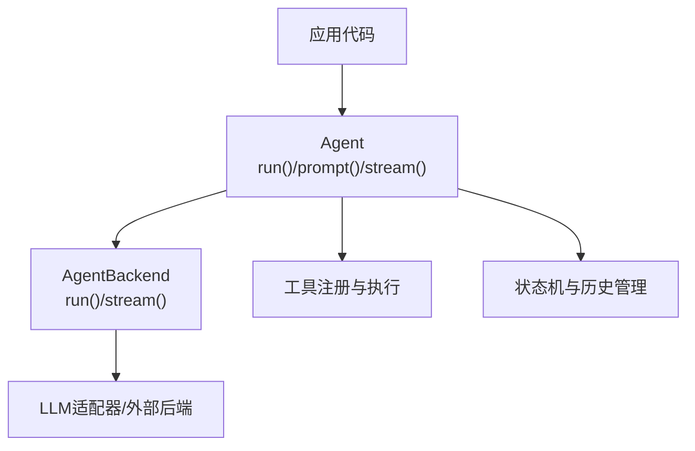
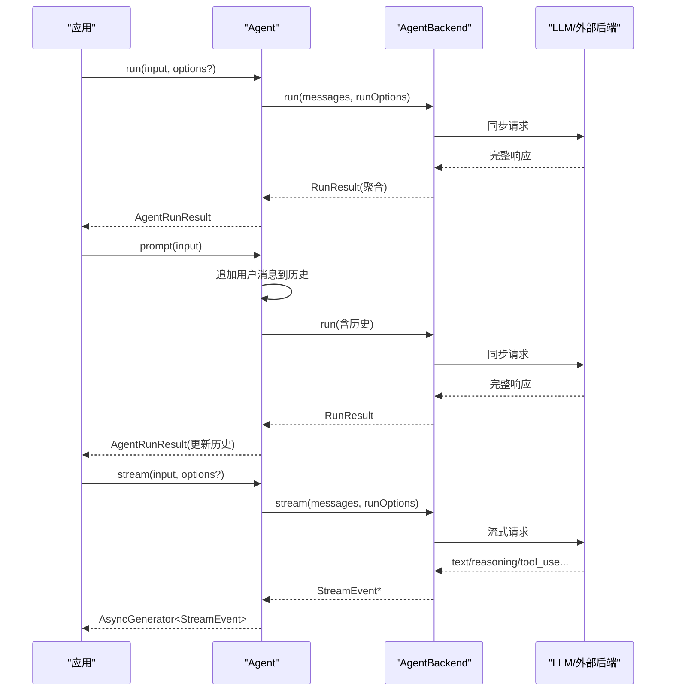
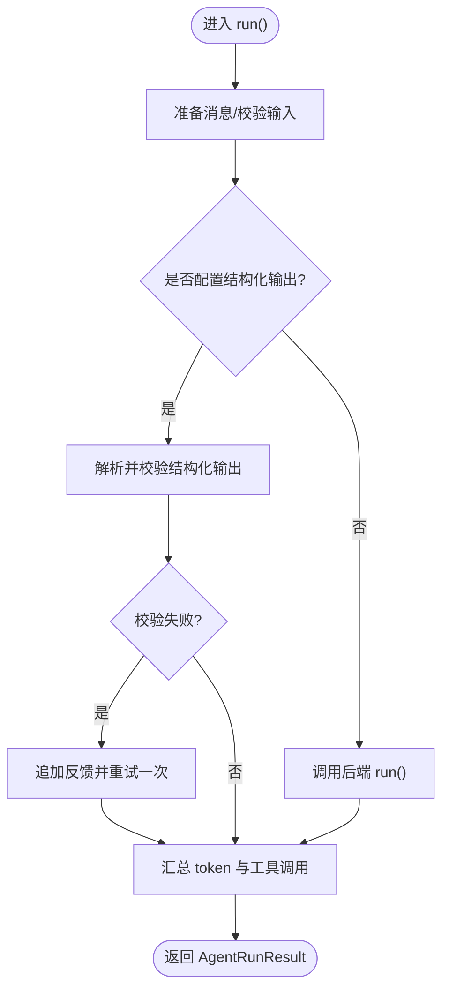
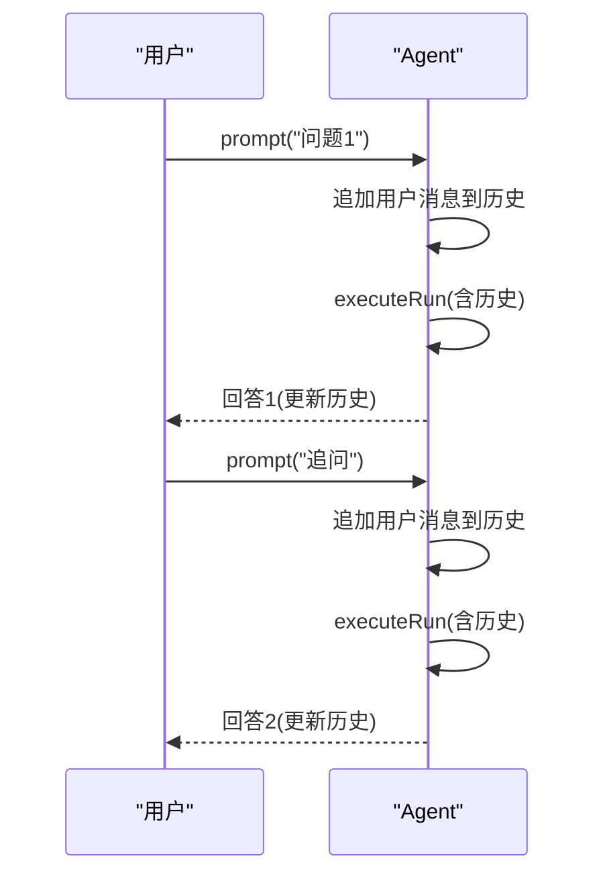
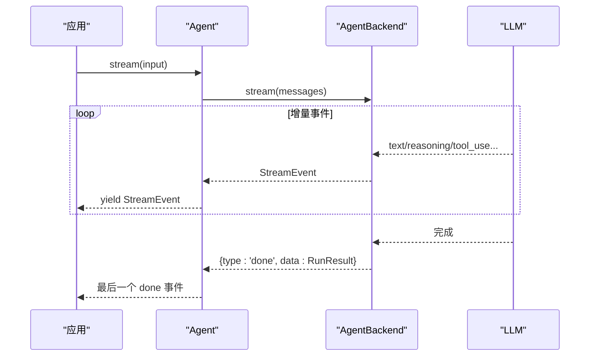
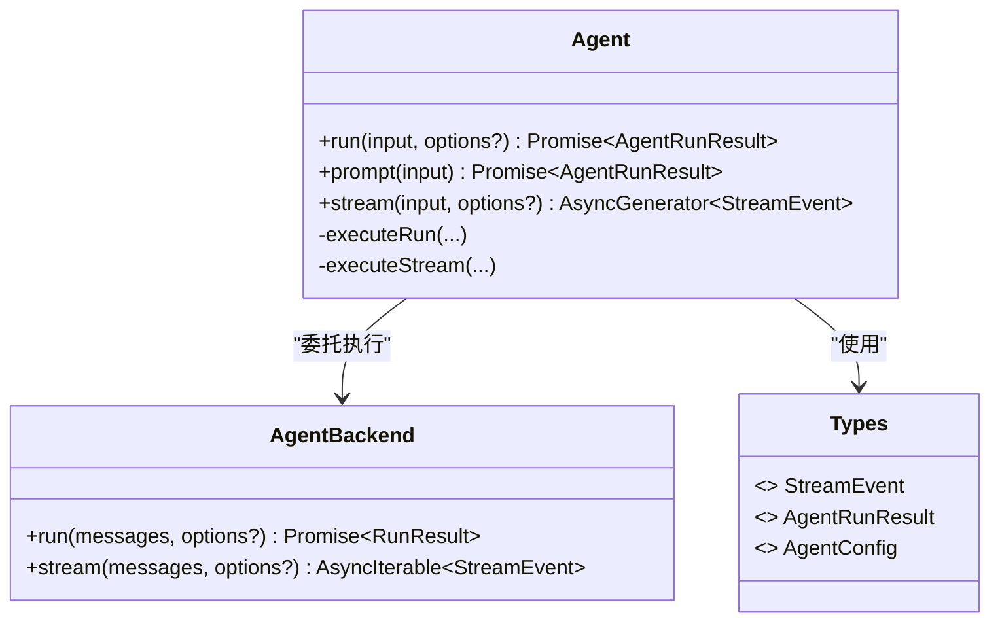

# 执行模式

<cite>
**本文引用的文件**
- [packages/core/src/agent/agent.ts](file://packages/core/src/agent/agent.ts)
- [packages/core/src/agent/runner.ts](file://packages/core/src/agent/runner.ts)
- [packages/core/src/orchestrator/orchestrator.ts](file://packages/core/src/orchestrator/orchestrator.ts)
- [packages/core/src/types.ts](file://packages/core/src/types.ts)
- [packages/core/src/index.ts](file://packages/core/src/index.ts)
- [packages/core/README.md](file://packages/core/README.md)
- [AGENTS.md](file://AGENTS.md)
</cite>

## 目录
1. [简介](#简介)
2. [项目结构](#项目结构)
3. [核心组件](#核心组件)
4. [架构总览](#架构总览)
5. [详细组件分析](#详细组件分析)
6. [依赖关系分析](#依赖关系分析)
7. [性能考量](#性能考量)
8. [故障排查指南](#故障排查指南)
9. [结论](#结论)
10. [附录](#附录)

## 简介
本文件聚焦智能体的三种执行模式：run()、prompt() 与 stream()，从同步执行、单次交互、流式处理三个维度说明其区别、适用场景、参数配置、返回值类型与错误处理机制，并给出代码片段路径以便快速定位实现。同时提供性能对比与选型建议，帮助在批量聚合、简单问答和实时增量输出等场景中做出正确选择。

## 项目结构
- 顶层入口与公开 API 由包索引导出，Agent 类对外暴露 run()/prompt()/stream() 三种调用方式。
- Agent 内部通过“后端抽象”（AgentBackend）统一调度 LLM 或外部进程/ACP 后端，屏蔽差异。
- 编排器 OpenMultiAgent 提供 runAgent/runTeam/runTasks 等高层能力；Agent 的三种模式是更细粒度的单智能体接口。

图表来源
- [packages/core/src/agent/agent.ts:104-231](file://packages/core/src/agent/agent.ts#L104-L231)
- [packages/core/src/agent/runner.ts:275-292](file://packages/core/src/agent/runner.ts#L275-L292)

章节来源
- [packages/core/src/index.ts:136-143](file://packages/core/src/index.ts#L136-L143)
- [packages/core/src/agent/agent.ts:104-231](file://packages/core/src/agent/agent.ts#L104-L231)
- [packages/core/src/agent/runner.ts:275-292](file://packages/core/src/agent/runner.ts#L275-L292)

## 核心组件
- Agent：封装对话历史、状态机、工具生命周期，并提供 run()/prompt()/stream() 三种执行入口。
- AgentBackend：统一的执行契约，定义 run() 返回聚合结果、stream() 产出事件流并以 done 结尾。
- 类型系统：StreamEvent、AgentRunResult、AgentConfig 等定义了事件、结果与配置的边界。

章节来源
- [packages/core/src/agent/agent.ts:104-231](file://packages/core/src/agent/agent.ts#L104-L231)
- [packages/core/src/agent/runner.ts:275-292](file://packages/core/src/agent/runner.ts#L275-L292)
- [packages/core/src/types.ts:483-504](file://packages/core/src/types.ts#L483-L504)
- [packages/core/src/types.ts:889-900](file://packages/core/src/types.ts#L889-L900)
- [packages/core/src/types.ts:1247-1282](file://packages/core/src/types.ts#L1247-L1282)

## 架构总览
下图展示了 Agent 层如何桥接上层调用与底层后端，以及三种模式在数据流上的差异。

图表来源
- [packages/core/src/agent/agent.ts:280-328](file://packages/core/src/agent/agent.ts#L280-L328)
- [packages/core/src/agent/runner.ts:275-292](file://packages/core/src/agent/runner.ts#L275-L292)

## 详细组件分析

### 模式一：run() —— 同步执行，适合批量处理与结果聚合
- 语义
  - 在“全新对话”中执行一次输入（字符串或完整消息列表），不读取也不更新持久化历史。
  - 适用于一次性查询、批处理任务、需要最终聚合结果的场景。
- 参数与选项
  - input：字符串或 LLMMessage[]。
  - runOptions：可携带 identity、traceRuntime、abortSignal、timeoutMs、onMessage 等运行时上下文。
- 返回值
  - Promise<AgentRunResult>，包含 success、output、messages、tokenUsage、toolCalls、structured（可选）、budgetExceeded、loopDetected 等。
- 错误处理
  - 超时/取消会转换为结构化错误信息；预算超限会标记 budgetExceeded。
  - 若配置了 outputSchema，会在首次失败后重试一次以增强结构化输出稳定性。
- 典型使用
  - 参考示例路径：[basics/single-agent](file://packages/core/examples/basics/single-agent.ts)

图表来源
- [packages/core/src/agent/agent.ts:280-328](file://packages/core/src/agent/agent.ts#L280-L328)
- [packages/core/src/agent/agent.ts:391-597](file://packages/core/src/agent/agent.ts#L391-L597)
- [packages/core/src/agent/agent.ts:644-735](file://packages/core/src/agent/agent.ts#L644-L735)

章节来源
- [packages/core/src/agent/agent.ts:280-328](file://packages/core/src/agent/agent.ts#L280-L328)
- [packages/core/src/agent/agent.ts:391-597](file://packages/core/src/agent/agent.ts#L391-L597)
- [packages/core/src/types.ts:1247-1282](file://packages/core/src/types.ts#L1247-L1282)
- [packages/core/README.md:103-111](file://packages/core/README.md#L103-L111)

### 模式二：prompt() —— 单次交互，维护持久对话历史
- 语义
  - 将一次用户输入（字符串或 ContentBlock[]）追加到 Agent 的持久历史中，并在下一次 prompt() 时继续该对话。
  - 适用于多轮问答、上下文延续的简单交互。
- 参数与选项
  - input：字符串或 ContentBlock[]。
  - 无额外 runOptions；内部复用 executeRun 的执行路径。
- 返回值
  - Promise<AgentRunResult>，结构与 run() 一致；历史会被自动扩展。
- 错误处理
  - 同 run()；支持 beforeRun/afterRun 钩子、超时/取消、预算控制与结构化输出重试。
- 典型使用
  - 参考示例路径：[basics/structured-input](file://packages/core/examples/basics/structured-input.ts)

图表来源
- [packages/core/src/agent/agent.ts:295-317](file://packages/core/src/agent/agent.ts#L295-L317)
- [packages/core/src/agent/agent.ts:391-597](file://packages/core/src/agent/agent.ts#L391-L597)

章节来源
- [packages/core/src/agent/agent.ts:295-317](file://packages/core/src/agent/agent.ts#L295-L317)
- [packages/core/src/types.ts:889-900](file://packages/core/src/types.ts#L889-L900)
- [packages/core/README.md:113-147](file://packages/core/README.md#L113-L147)

### 模式三：stream() —— 流式处理，支持实时响应与增量输出
- 语义
  - 在“全新对话”中执行流式生成，按块产出文本、推理过程、工具调用等事件，最终以 done 事件结束。
  - 适用于需要低延迟首字、逐步渲染、增量消费的场景。
- 参数与选项
  - input：字符串或 LLMMessage[]。
  - runOptions：可携带 abortSignal、traceRuntime、identity 等。
- 返回值
  - AsyncGenerator<StreamEvent>，事件类型包括 text、reasoning、tool_use、tool_result、budget_exceeded、done、error 等。
- 错误处理
  - 流结束时可能产出 error 事件；支持超时/取消；结构化输出在流结束后进行聚合校验（如需）。
- 典型使用
  - 参考示例路径：[basics/single-agent](file://packages/core/examples/basics/single-agent.ts)

图表来源
- [packages/core/src/agent/agent.ts:319-328](file://packages/core/src/agent/agent.ts#L319-L328)
- [packages/core/src/agent/runner.ts:275-292](file://packages/core/src/agent/runner.ts#L275-L292)
- [packages/core/src/types.ts:483-504](file://packages/core/src/types.ts#L483-L504)

章节来源
- [packages/core/src/agent/agent.ts:319-328](file://packages/core/src/agent/agent.ts#L319-L328)
- [packages/core/src/types.ts:483-504](file://packages/core/src/types.ts#L483-L504)

## 依赖关系分析
- Agent 依赖 AgentBackend 抽象，默认实现为基于 LLM 的循环执行器；也可替换为 ACP/Process 等外部后端。
- 类型 StreamEvent、AgentRunResult、AgentConfig 等被多处复用，保证三种模式的契约一致性。
- 编排器 OpenMultiAgent 提供 runAgent/runTeam/runTasks 等高层能力，但单智能体的三种模式仍由 Agent 直接暴露。

图表来源
- [packages/core/src/agent/agent.ts:104-231](file://packages/core/src/agent/agent.ts#L104-L231)
- [packages/core/src/agent/runner.ts:275-292](file://packages/core/src/agent/runner.ts#L275-L292)
- [packages/core/src/types.ts:483-504](file://packages/core/src/types.ts#L483-L504)
- [packages/core/src/types.ts:1247-1282](file://packages/core/src/types.ts#L1247-L1282)

章节来源
- [packages/core/src/index.ts:136-143](file://packages/core/src/index.ts#L136-L143)
- [packages/core/src/agent/agent.ts:104-231](file://packages/core/src/agent/agent.ts#L104-L231)
- [packages/core/src/agent/runner.ts:275-292](file://packages/core/src/agent/runner.ts#L275-L292)
- [packages/core/src/types.ts:483-504](file://packages/core/src/types.ts#L483-L504)

## 性能考量
- run()
  - 优点：天然聚合结果，便于批处理与后续合并；适合离线或批量任务。
  - 注意：整次运行受 timeoutMs 与 maxTurns/maxTokens 限制；预算超限时会提前终止并标记 budgetExceeded。
- prompt()
  - 优点：维护对话历史，减少重复上下文构造；适合多轮问答。
  - 注意：历史增长会影响上下文成本与模型窗口，需配合 contextStrategy 与压缩策略。
- stream()
  - 优点：首字节延迟更低，可边生成边消费；适合 UI 实时展示。
  - 注意：需在消费端处理中断/取消；结构化输出需在 done 后做最终校验。

[本节为通用指导，不直接分析具体文件]

## 故障排查指南
- 常见错误与状态
  - 超时/取消：run()/stream() 均支持 AbortSignal 与 timeoutMs；异常会被分类为 timeout/cancelled。
  - 预算超限：当累计 token 超过阈值时会触发 budgetExceeded，run() 返回对应标志，stream() 发出 budget_exceeded 事件。
  - 结构化输出失败：若配置 outputSchema，框架会在首次失败后重试一次；仍失败则返回 structured=undefined 并标记验证错误。
- 诊断要点
  - 检查 onTrace/onProgress 回调与 TraceStore，确认 span 状态与错误信息。
  - 核对 AgentConfig 的 tools/disallowedTools、callTimeoutMs、maxTokenBudget 等安全与预算配置。
  - 对于外部后端（ACP/Process），确认命令、工作目录、权限策略与输入模式。

章节来源
- [packages/core/src/agent/agent.ts:419-597](file://packages/core/src/agent/agent.ts#L419-L597)
- [packages/core/src/agent/agent.ts:741-800](file://packages/core/src/agent/agent.ts#L741-L800)
- [packages/core/src/types.ts:483-504](file://packages/core/src/types.ts#L483-L504)
- [packages/core/src/types.ts:1247-1282](file://packages/core/src/types.ts#L1247-L1282)
- [AGENTS.md:72-86](file://AGENTS.md#L72-L86)

## 结论
- 选择 run()：当你需要一次性、可聚合的结果，且对延迟不敏感，适合批量处理与离线分析。
- 选择 prompt()：当你需要维持对话上下文，进行多轮问答或渐进式澄清。
- 选择 stream()：当你需要即时反馈、增量渲染或边生成边消费，如聊天界面或实时看板。
- 三者共享同一套错误与预算控制机制，结合 trace/observability 可实现一致的排障与审计体验。

[本节为总结性内容，不直接分析具体文件]

## 附录
- 快速上手与示例
  - 单智能体示例：[basics/single-agent](file://packages/core/examples/basics/single-agent.ts)
  - 结构化输入示例：[basics/structured-input](file://packages/core/examples/basics/structured-input.ts)
- 相关文档
  - 执行模式概览与路由：[Execution Modes:103-111](file://packages/core/README.md#L103-L111)
  - 结构化输入与历史恢复：[Structured Input:113-147](file://packages/core/README.md#L113-L147)
  - 生产注意事项（预算、工具、恢复、观测）：[Production:288-316](file://packages/core/README.md#L288-L316)

章节来源
- [packages/core/README.md:103-147](file://packages/core/README.md#L103-L147)
- [packages/core/README.md:288-316](file://packages/core/README.md#L288-L316)