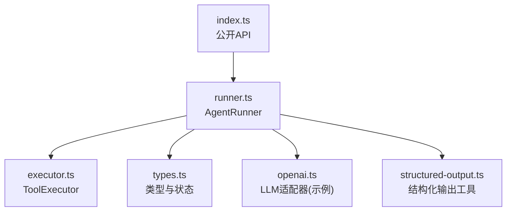
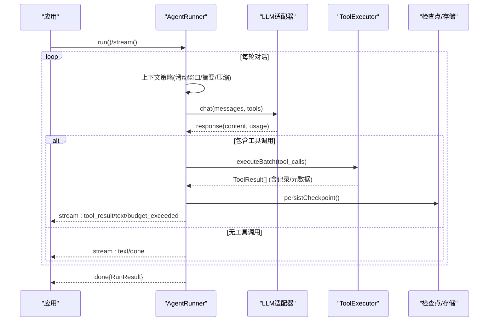
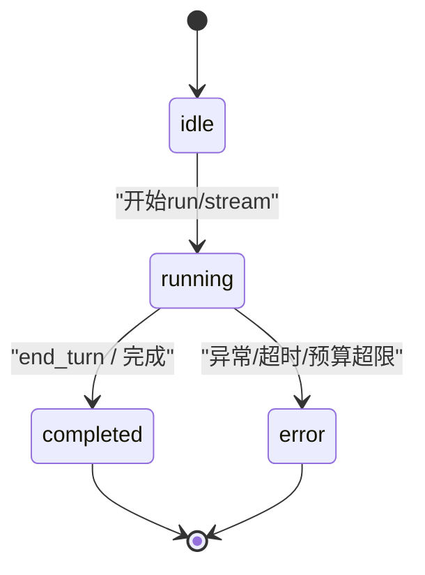
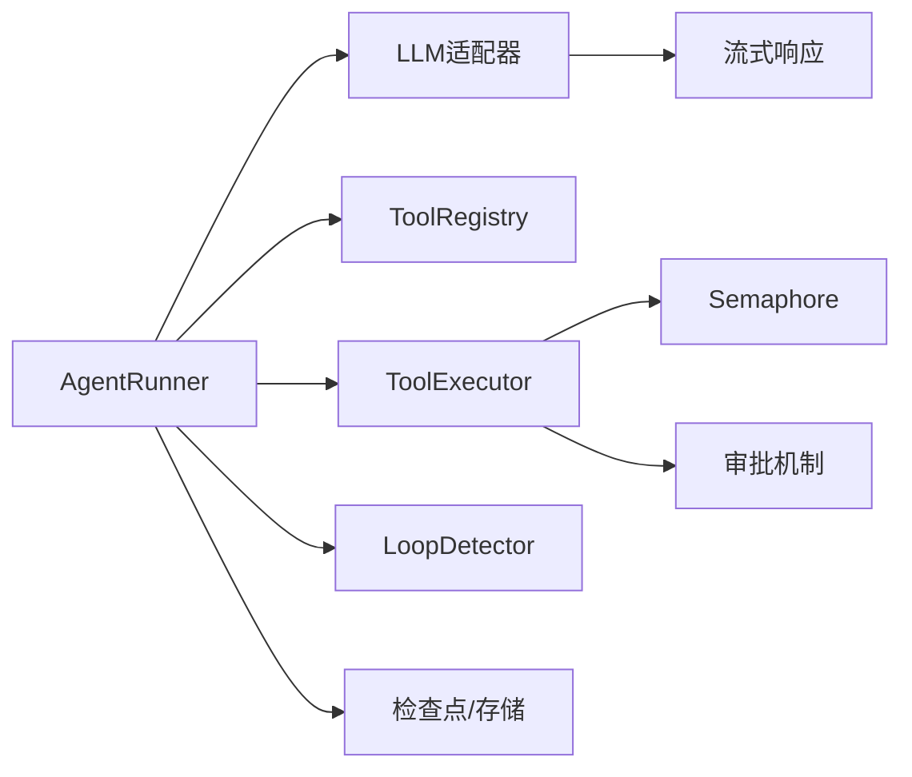

# 智能体执行

<cite>
**本文引用的文件**
- [packages/core/src/index.ts](file://packages/core/src/index.ts)
- [packages/core/src/agent/runner.ts](file://packages/core/src/agent/runner.ts)
- [packages/core/src/tool/executor.ts](file://packages/core/src/tool/executor.ts)
- [packages/core/src/agent/structured-output.ts](file://packages/core/src/agent/structured-output.ts)
- [packages/core/src/types.ts](file://packages/core/src/types.ts)
- [packages/core/src/llm/openai.ts](file://packages/core/src/llm/openai.ts)
- [AGENTS.md](file://AGENTS.md)
</cite>

## 目录
1. [简介](#简介)
2. [项目结构](#项目结构)
3. [核心组件](#核心组件)
4. [架构总览](#架构总览)
5. [详细组件分析](#详细组件分析)
6. [依赖关系分析](#依赖关系分析)
7. [性能考量](#性能考量)
8. [故障排查指南](#故障排查指南)
9. [结论](#结论)
10. [附录](#附录)

## 简介
本文件聚焦于 Open Multi-Agent 中“智能体执行循环”的机制，围绕以下目标展开：
- 解释 run()、prompt()、stream() 三种执行模式的区别与适用场景（以框架提供的 AgentBackend 接口为准）。
- 说明对话管理（消息历史）的维护策略：上下文保持、消息压缩与历史清理。
- 阐述结构化输出（outputSchema）的验证机制与重试逻辑。
- 详述工具调用（tool calls）的执行流程：工具发现、参数校验、执行结果处理。
- 描述执行状态（state）从 idle → running → completed/error 的变化过程。
- 覆盖错误处理机制：超时控制、预算限制、异常恢复。
- 提供执行监控与调试技巧。

## 项目结构
Open Multi-Agent 的核心执行循环位于 agent 层，由 AgentRunner 驱动；工具执行由 ToolExecutor 负责；类型定义集中在 types.ts；LLM 适配器在 llm 子模块中实现；公共 API 入口在 index.ts 暴露。



图表来源
- [packages/core/src/index.ts:57-143](file://packages/core/src/index.ts#L57-L143)
- [packages/core/src/agent/runner.ts:472-864](file://packages/core/src/agent/runner.ts#L472-L864)
- [packages/core/src/tool/executor.ts:85-164](file://packages/core/src/tool/executor.ts#L85-L164)
- [packages/core/src/types.ts:1247-1288](file://packages/core/src/types.ts#L1247-L1288)
- [packages/core/src/llm/openai.ts:296-331](file://packages/core/src/llm/openai.ts#L296-L331)
- [packages/core/src/agent/structured-output.ts:21-127](file://packages/core/src/agent/structured-output.ts#L21-L127)

章节来源
- [packages/core/src/index.ts:57-143](file://packages/core/src/index.ts#L57-L143)
- [packages/core/src/agent/runner.ts:472-864](file://packages/core/src/agent/runner.ts#L472-L864)

## 核心组件
- AgentRunner：实现 AgentBackend 接口，封装完整的对话循环，协调 LLM 调用、工具执行、上下文压缩、循环检测、检查点持久化与流式事件。
- ToolExecutor：负责工具发现、输入参数 Zod 校验、并发控制、输出可选校验、错误隔离（以 ToolResult 返回而非抛出），以及可挂起的审批流程。
- Structured Output：将 outputSchema 注入系统提示，解析并校验最终 JSON 输出。
- Types：定义运行状态、结果、事件、错误等关键数据结构。
- LLM 适配器：如 openai.ts，负责将模型响应转换为统一格式，并在流式模式下组装 tool_use 块。

章节来源
- [packages/core/src/agent/runner.ts:472-864](file://packages/core/src/agent/runner.ts#L472-L864)
- [packages/core/src/tool/executor.ts:85-164](file://packages/core/src/tool/executor.ts#L85-L164)
- [packages/core/src/agent/structured-output.ts:21-127](file://packages/core/src/agent/structured-output.ts#L21-L127)
- [packages/core/src/types.ts:1247-1288](file://packages/core/src/types.ts#L1247-L1288)
- [packages/core/src/llm/openai.ts:296-331](file://packages/core/src/llm/openai.ts#L296-L331)

## 架构总览
下图展示了 AgentRunner 在一次执行中的主循环、工具执行、上下文策略、检查点与事件流的关系。



图表来源
- [packages/core/src/agent/runner.ts:877-1358](file://packages/core/src/agent/runner.ts#L877-L1358)
- [packages/core/src/tool/executor.ts:148-164](file://packages/core/src/tool/executor.ts#L148-L164)
- [packages/core/src/llm/openai.ts:296-331](file://packages/core/src/llm/openai.ts#L296-L331)

## 详细组件分析

### 执行模式：run()、prompt()、stream()
- run()：阻塞式聚合。内部复用 stream() 收集所有事件，最终返回聚合后的 RunResult。适用于一次性任务或需要完整结果的场景。
- stream()：增量事件流。按顺序产出 text、tool_use、tool_result、budget_exceeded、done、error 等事件，适合实时展示、进度跟踪与流式消费。
- prompt()：当前代码库未暴露名为 prompt() 的独立方法；若需“仅提示一次并获取响应”，可直接使用 run() 或在外部自行构造消息后调用 stream() 消费首个文本片段。

差异与选择建议：
- 需要实时反馈或中间态（如逐步显示工具结果）：优先 stream()。
- 需要简单同步语义且不在意中间事件：使用 run()。
- 若上层框架要求“prompt 风格”的一次性交互，可用 run() 包装或直接基于 stream() 消费到 done。

章节来源
- [packages/core/src/agent/runner.ts:842-864](file://packages/core/src/agent/runner.ts#L842-L864)
- [packages/core/src/agent/runner.ts:877-1358](file://packages/core/src/agent/runner.ts#L877-L1358)

### 对话管理（message history）：上下文保持、压缩与清理
- 滑动窗口：通过 truncateToSlidingWindow 保留最近若干轮，避免拆分 tool_use/tool_result 对，保证语义原子性。
- 摘要压缩：summarizeMessages 将早期对话摘要为一段提示前缀，减少后续 token 消耗，同时保留近期对话。
- 规则压缩：compactMessages 在不调用 LLM 的前提下，对旧轮次进行选择性压缩（保留 tool_use、截断长文本、替换长 tool_result 为标记、不压缩错误结果与委派结果）。
- 已消费工具结果压缩：compressConsumedToolResults 在每轮开始前对已消费的 tool_result 做轻量压缩，降低上下文体积。
- 图像与媒体剥离：stripImageBlocksForSummary 在生成摘要时剥离大图片，避免膨胀摘要成本。

这些策略在每轮 LLM 调用前按需启用，确保既保持必要上下文又控制 token 成本。

章节来源
- [packages/core/src/agent/runner.ts:492-542](file://packages/core/src/agent/runner.ts#L492-L542)
- [packages/core/src/agent/runner.ts:683-805](file://packages/core/src/agent/runner.ts#L683-L805)
- [packages/core/src/agent/runner.ts:1566-1760](file://packages/core/src/agent/runner.ts#L1566-L1760)

### 结构化输出（outputSchema）：验证与重试
- 指令注入：buildStructuredOutputInstruction 将 Zod schema 转为 JSON Schema 并追加到系统提示，要求模型仅返回符合 schema 的 JSON。
- 解析与校验：extractJSON 支持多种包裹形式（纯 JSON、带 ```json 围栏、裸对象/数组），validateOutput 使用 Zod 严格校验。
- 重试逻辑：当 outputSchema 校验失败时，可将错误信息回灌给模型作为新消息，引导其修正输出；该策略可在上层编排中结合 maxTurns 与上下文策略实现多轮自修复。

注意：outputSchema 针对的是“智能体的最终答案”，不同于单个工具的 outputSchema（后者用于校验工具返回数据）。

章节来源
- [packages/core/src/agent/structured-output.ts:21-127](file://packages/core/src/agent/structured-output.ts#L21-L127)
- [packages/core/src/types.ts:1190-1196](file://packages/core/src/types.ts#L1190-L1196)

### 工具调用（tool calls）：发现、校验与执行
- 工具发现与授权：resolveTools 根据预设、允许/拒绝列表与框架安全策略，生成 LLM 可见的工具定义；grantedToolNames 作为白名单，防止未授权工具被误执行。
- 参数校验：ToolExecutor 使用工具定义的 inputSchema（Zod）校验输入，失败则返回错误 ToolResult。
- 并发控制：executeBatch 通过信号量限制最大并行度，避免资源争用。
- 执行与结果处理：工具执行异常被捕获并以 isError: true 的 ToolResult 返回，不会中断主循环；支持 onToolCall 门控、可挂起审批（durable approval）与结果回调。
- 流式工具调用组装：LLM 适配器（如 openai.ts）在流式结束时汇总 tool_use 块，供 runner 执行。

章节来源
- [packages/core/src/agent/runner.ts:817-827](file://packages/core/src/agent/runner.ts#L817-L827)
- [packages/core/src/tool/executor.ts:85-164](file://packages/core/src/tool/executor.ts#L85-L164)
- [packages/core/src/tool/executor.ts:181-200](file://packages/core/src/tool/executor.ts#L181-L200)
- [packages/core/src/llm/openai.ts:296-331](file://packages/core/src/llm/openai.ts#L296-L331)

### 执行状态（state）变化：idle → running → completed/error
- AgentState.status：'idle' | 'running' | 'completed' | 'error'，表示单轮/单次运行的生命周期。
- AgentRunner 内部 phase：'awaiting_model' → 'executing_tools' → 'completed'，配合 checkpoint 持久化实现可恢复执行。
- 终止条件：end_turn（无工具调用）、maxTurns 耗尽、中止信号触发、预算超限、循环检测触发终止。



图表来源
- [packages/core/src/types.ts:1247-1253](file://packages/core/src/types.ts#L1247-L1253)
- [packages/core/src/agent/runner.ts:897-902](file://packages/core/src/agent/runner.ts#L897-L902)
- [packages/core/src/agent/runner.ts:1134-1138](file://packages/core/src/agent/runner.ts#L1134-L1138)

章节来源
- [packages/core/src/types.ts:1247-1253](file://packages/core/src/types.ts#L1247-L1253)
- [packages/core/src/agent/runner.ts:897-902](file://packages/core/src/agent/runner.ts#L897-L902)
- [packages/core/src/agent/runner.ts:1134-1138](file://packages/core/src/agent/runner.ts#L1134-L1138)

### 错误处理：超时、预算与异常恢复
- 调用级超时：chatWithCallTimeout 为每次 LLM 调用创建独立的 AbortSignal.timeout，并与外层 abortSignal 合并；若因内部超时而中止，抛出 LLMCallTimeoutError，便于区分取消与超时。
- 预算限制：在每轮结束后统计 token 用量，超过 maxTokenBudget 时发出 budget_exceeded 事件并结束本轮；委派任务的 token 也会计入父任务预算。
- 异常恢复：checkpoint 在关键阶段（工具执行前后、审批挂起、完成）持久化；支持 resumeState 恢复执行，未提交的结果会在恢复后重放。
- 工具错误隔离：工具执行异常被转化为 ToolResult（isError: true），不会中断主循环，保证鲁棒性。

章节来源
- [packages/core/src/agent/runner.ts:561-582](file://packages/core/src/agent/runner.ts#L561-L582)
- [packages/core/src/agent/runner.ts:1204-1215](file://packages/core/src/agent/runner.ts#L1204-L1215)
- [packages/core/src/agent/runner.ts:1045-1054](file://packages/core/src/agent/runner.ts#L1045-L1054)
- [packages/core/src/tool/executor.ts:181-200](file://packages/core/src/tool/executor.ts#L181-L200)

### 监控与调试技巧
- 流式事件：订阅 text、tool_use、tool_result、budget_exceeded、loop_detected、done、error，构建实时面板。
- 追踪与跨度：tracedChat 与工具执行均产生 span，附带 agent/model/provider/phase/turn/token 等属性，便于离线回放与性能分析。
- 检查点：通过 onCheckpoint/onApprovalPrepare/onApprovalRequest/onApprovalConsumed 观察执行进度与审批节点，定位卡点。
- 循环检测：loop_detected 事件携带 kind（工具重复/文本重复），可按策略注入警告或终止。
- 日志脱敏：敏感字段在 trace 与工具输出中会被脱敏，避免泄露。

章节来源
- [packages/core/src/agent/runner.ts:584-681](file://packages/core/src/agent/runner.ts#L584-L681)
- [packages/core/src/agent/runner.ts:1217-1268](file://packages/core/src/agent/runner.ts#L1217-L1268)
- [packages/core/src/tool/executor.ts:169-200](file://packages/core/src/tool/executor.ts#L169-L200)

## 依赖关系分析
- AgentRunner 依赖：
  - LLMAdapter：统一模型调用与流式响应。
  - ToolRegistry/ToolExecutor：工具注册、授权、执行与并发控制。
  - LoopDetector：检测重复工具调用或重复文本，防止死循环。
  - 检查点/存储：持久化执行状态，支持恢复与审批。
- ToolExecutor 依赖：
  - ToolDefinition.inputSchema：Zod 输入校验。
  - Semaphore：并发限制。
  - 审批机制：支持可挂起的工具调用审批。
- LLM 适配器（如 openai.ts）：
  - 将流式 delta 拼装为 ToolUseBlock，供 runner 执行。



图表来源
- [packages/core/src/agent/runner.ts:472-864](file://packages/core/src/agent/runner.ts#L472-L864)
- [packages/core/src/tool/executor.ts:85-164](file://packages/core/src/tool/executor.ts#L85-L164)
- [packages/core/src/llm/openai.ts:296-331](file://packages/core/src/llm/openai.ts#L296-L331)

章节来源
- [packages/core/src/agent/runner.ts:472-864](file://packages/core/src/agent/runner.ts#L472-L864)
- [packages/core/src/tool/executor.ts:85-164](file://packages/core/src/tool/executor.ts#L85-L164)

## 性能考量
- 上下文压缩：优先使用 compact 或 summarize 策略，减少不必要 token 消耗；图像与媒体在摘要阶段剥离，避免膨胀。
- 并发控制：ToolExecutor 默认最大并发为 4，可根据后端能力调整，平衡吞吐与稳定性。
- 调用级超时：为每次 LLM 调用设置 callTimeoutMs，避免长时间阻塞；与整体 abortSignal 组合，确保及时退出。
- 预算上限：合理设置 maxTokenBudget，避免超额；委派任务 token 计入父任务预算，防止隐性超支。
- 工具输出截断：可通过 maxOutputChars 限制工具输出长度，减少传输与解析成本。

[本节为通用指导，无需特定文件引用]

## 故障排查指南
- 工具报错但循环继续：确认是否为 ToolResult.isError=true；检查 onToolCall 门控是否拒绝；查看 executor 的错误信息。
- 预算超限提前结束：检查 totalTokens 累计与委派任务 token 是否计入；必要时提高预算或优化上下文策略。
- 模型调用超时：确认 callTimeoutMs 设置与 provider SDK 默认超时；关注 LLMCallTimeoutError 与 abortSignal 原因。
- 循环检测触发：查看 loop_detected 的 kind；若为工具重复，检查工具参数是否固定；若为文本重复，考虑注入新信息或改变策略。
- 恢复执行异常：确认 checkpoint 是否成功持久化；审批请求是否满足 onCheckpoint/onApprovalPrepare/onApprovalRequest/onApprovalConsumed 的条件。

章节来源
- [packages/core/src/tool/executor.ts:181-200](file://packages/core/src/tool/executor.ts#L181-L200)
- [packages/core/src/agent/runner.ts:1204-1215](file://packages/core/src/agent/runner.ts#L1204-L1215)
- [packages/core/src/agent/runner.ts:561-582](file://packages/core/src/agent/runner.ts#L561-L582)
- [packages/core/src/agent/runner.ts:1217-1268](file://packages/core/src/agent/runner.ts#L1217-L1268)

## 结论
Open Multi-Agent 的执行循环以 AgentRunner 为核心，围绕“调用 LLM → 提取工具调用 → 执行工具 → 更新上下文 → 循环直至结束”的模式组织。通过上下文策略、循环检测、预算控制、检查点与流式事件，实现了高可控、可观测、可恢复的智能体执行环境。对于结构化输出，框架提供了从提示注入到解析校验的完整链路，并结合多轮对话实现自我修复。工具执行采用默认拒绝与白名单授权，结合门控与审批机制，确保安全与合规。

[本节为总结，无需特定文件引用]

## 附录
- 公开 API 入口：index.ts 暴露 orchestrator、agent、team、task、tool、llm、observability、memory 等子系统。
- 非明显不变式：内置工具默认拒绝；工具错误以值返回；外部后端替换 LLM runner 但保留队列/调度/内存/预算行为；遥测丢失不应回滚执行。

章节来源
- [packages/core/src/index.ts:57-227](file://packages/core/src/index.ts#L57-L227)
- [AGENTS.md:72-86](file://AGENTS.md#L72-L86)