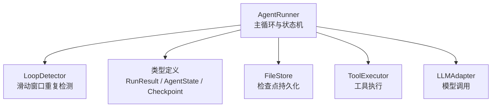
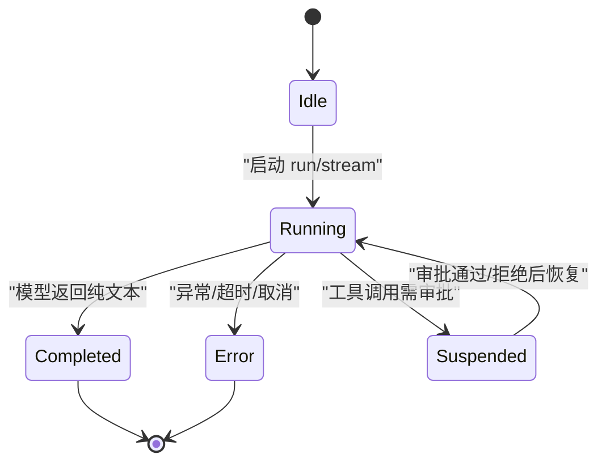
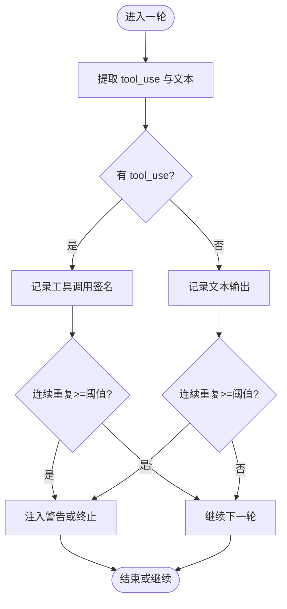
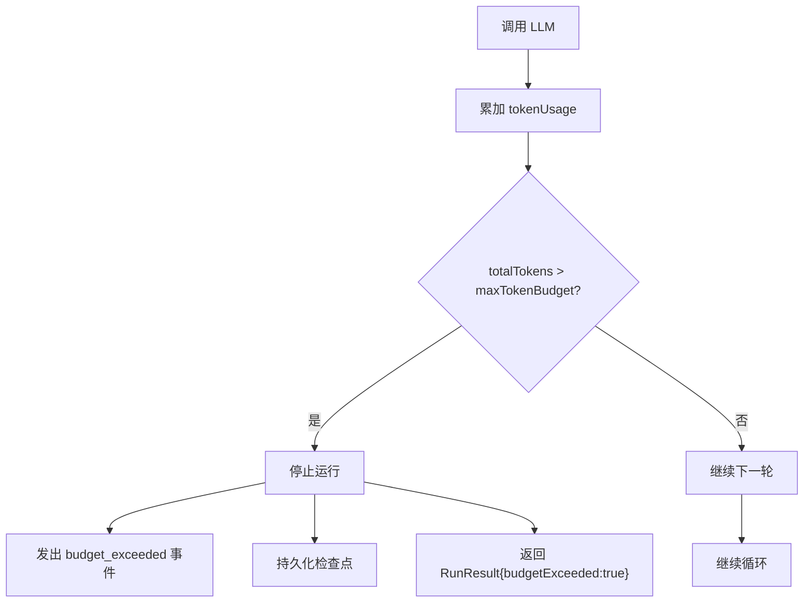
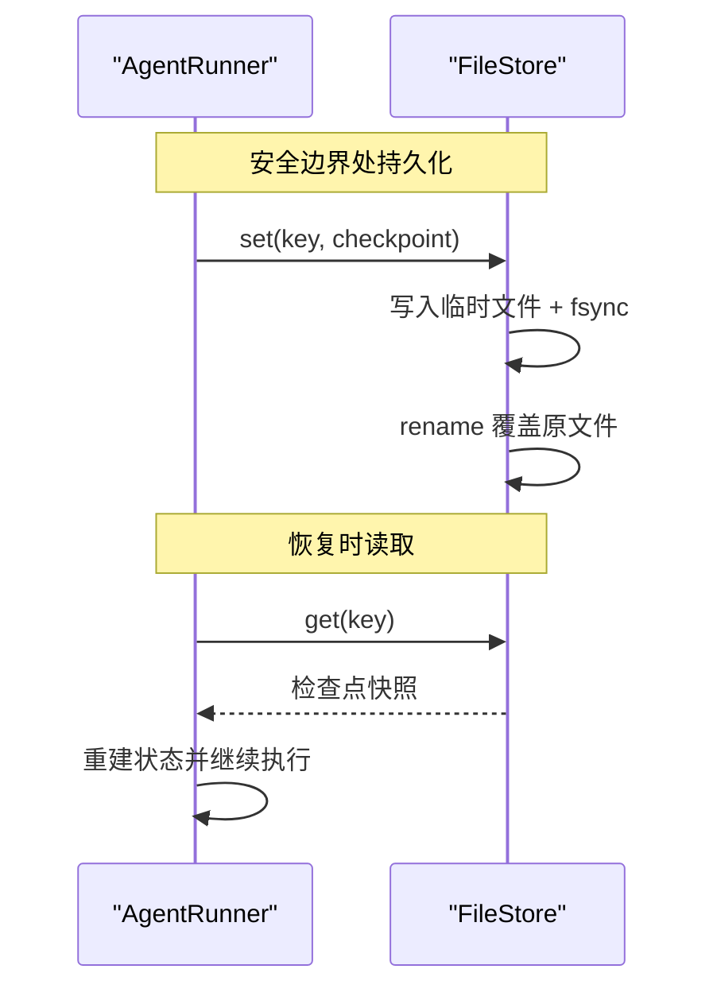
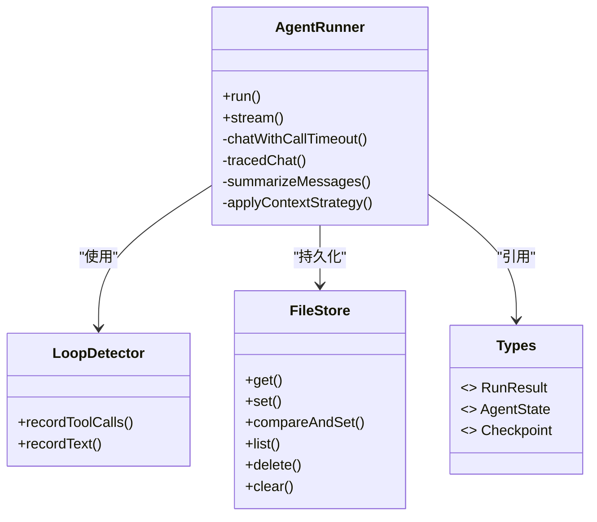

# 状态管理

<cite>
**本文引用的文件**
- [runner.ts](file://packages/core/src/agent/runner.ts)
- [types.ts](file://packages/core/src/types.ts)
- [loop-detector.ts](file://packages/core/src/agent/loop-detector.ts)
- [file-store.ts](file://packages/core/src/memory/file-store.ts)
</cite>

## 目录
1. [简介](#简介)
2. [项目结构](#项目结构)
3. [核心组件](#核心组件)
4. [架构总览](#架构总览)
5. [详细组件分析](#详细组件分析)
6. [依赖关系分析](#依赖关系分析)
7. [性能考量](#性能考量)
8. [故障排查指南](#故障排查指南)
9. [结论](#结论)
10. [附录](#附录)

## 简介
本文件聚焦智能体执行过程中的状态管理机制，围绕以下目标展开：
- RunResult 对象的结构与字段含义（messages、output、toolCalls、tokenUsage 等）
- 执行状态（state）从 idle → running → completed/error 的转换逻辑
- 循环检测（loop detection）机制：识别重复的工具调用与文本响应，防止无限循环
- 预算控制（token budget）：maxTokenBudget 配置与超预算处理策略
- 检查点（checkpoint）机制：支持中断恢复与持久化存储
- 状态监控与调试技巧：帮助理解执行流程并定位问题

## 项目结构
与状态管理直接相关的代码主要位于 core 包中：
- 运行器与主循环：packages/core/src/agent/runner.ts
- 类型定义与检查点结构：packages/core/src/types.ts
- 循环检测器：packages/core/src/agent/loop-detector.ts
- 检查点持久化存储（文件系统实现）：packages/core/src/memory/file-store.ts



图表来源
- [runner.ts:472-993](file://packages/core/src/agent/runner.ts#L472-L993)
- [types.ts:249-273](file://packages/core/src/types.ts#L249-L273)
- [loop-detector.ts:33-92](file://packages/core/src/agent/loop-detector.ts#L33-L92)
- [file-store.ts:80-159](file://packages/core/src/memory/file-store.ts#L80-L159)

章节来源
- [runner.ts:472-993](file://packages/core/src/agent/runner.ts#L472-L993)
- [types.ts:249-273](file://packages/core/src/types.ts#L249-L273)

## 核心组件
- AgentRunner：驱动对话循环，负责 LLM 调用、工具执行、上下文压缩、循环检测、预算控制、检查点持久化。
- LoopDetector：基于滑动窗口记录工具调用签名和文本输出，检测连续重复以触发“循环”动作。
- FileStore：原子写入 JSON 文件的内存式存储，用于检查点持久化，确保进程重启后可恢复。
- 类型系统：定义 RunResult、AgentState、Checkpoint 等关键数据结构，贯穿执行生命周期。

章节来源
- [runner.ts:472-993](file://packages/core/src/agent/runner.ts#L472-L993)
- [loop-detector.ts:33-92](file://packages/core/src/agent/loop-detector.ts#L33-L92)
- [file-store.ts:80-159](file://packages/core/src/memory/file-store.ts#L80-L159)
- [types.ts:249-273](file://packages/core/src/types.ts#L249-L273)

## 架构总览
下图展示了 AgentRunner 在单次运行中的状态流转与关键交互：

```mermaid
sequenceDiagram
participant Client as "调用方"
participant Runner as "AgentRunner"
participant Adapter as "LLMAdapter"
participant Detector as "LoopDetector"
participant Store as "FileStore(检查点)"
participant Executor as "ToolExecutor"
Client->>Runner : run(messages, options)
Runner->>Store : onCheckpoint(state) // 初始或阶段边界
loop 直到完成或达到限制
Runner->>Adapter : chat(messages, options)
Adapter-->>Runner : response(content, usage)
Runner->>Runner : 累计 tokenUsage
alt 超过 maxTokenBudget
Runner-->>Client : StreamEvent{type : 'budget_exceeded'}
Runner->>Store : 标记 budgetExceeded
Runner-->>Client : done(RunResult{budgetExceeded : true})
end
opt 存在 tool_use
Runner->>Detector : recordToolCalls(blocks)
Detector-->>Runner : 可能返回 loop_detected
alt 检测到循环
Runner->>Store : 标记 loopDetected/loopWarned
Runner-->>Client : StreamEvent{type : 'loop_detected'}
Runner-->>Client : done(RunResult{loopDetected : true})
else 未检测到循环
Runner->>Executor : execute(tool_use)
Executor-->>Runner : tool_result
Runner->>Store : onCheckpoint(state) // 提交工具结果
Runner->>Adapter : 将 tool_result 追加为 user 消息继续下一轮
end
else 无 tool_use最终文本
Runner->>Store : onCheckpoint(state) // 标记 completed
Runner-->>Client : done(RunResult{output, messages, ...})
end
end
```

图表来源
- [runner.ts:967-1326](file://packages/core/src/agent/runner.ts#L967-L1326)
- [types.ts:249-273](file://packages/core/src/types.ts#L249-L273)
- [loop-detector.ts:33-92](file://packages/core/src/agent/loop-detector.ts#L33-L92)
- [file-store.ts:112-159](file://packages/core/src/memory/file-store.ts#L112-L159)

## 详细组件分析

### RunResult 结构与字段说明
RunResult 是单次运行的聚合结果，包含：
- identity：可选的运行身份标识（供自定义后端回显）
- messages：本轮累积的所有消息（assistant + tool results）
- output：最后一个 assistant 回合的文本输出
- toolCalls：按执行顺序记录的每次工具调用（名称、输入、输出、耗时）
- tokenUsage：本轮所有 LLM 调用的 token 用量汇总
- turns：总 LLM 回合数（包括工具调用后的跟进）
- loopDetected：是否因循环检测被终止或警告
- budgetExceeded：是否因 token 预算超限而停止
- aborted：是否在下一个 LLM 调用前被中止信号打断
- suspended：是否有待持久化审批的工具调用
- pendingApprovals：导致暂停的具体审批请求列表

这些字段为上层编排与可观测性提供统一视图，便于诊断与审计。

章节来源
- [types.ts:249-273](file://packages/core/src/types.ts#L249-L273)

### 执行状态（AgentState）与状态转换
AgentState 表示运行期生命周期的状态：
- status：'idle' | 'running' | 'completed' | 'error'
- messages：当前会话消息
- tokenUsage：累计 token 使用量
- error：错误信息（可选）

状态转换逻辑（由 AgentRunner 主循环驱动）：
- idle → running：开始一次 run/stream
- running → completed：当模型返回纯文本（无 tool_use）时，标记 finalOutput 并进入 completed
- running → error：异常路径（如适配器错误、回调失败等）
- running → suspended：当工具调用需要持久化审批时，暂停并等待外部决策
- running → completed（带标志）：当检测到循环或预算超限时，提前结束并设置相应标志



图表来源
- [types.ts:1247-1253](file://packages/core/src/types.ts#L1247-L1253)
- [runner.ts:986-1326](file://packages/core/src/agent/runner.ts#L986-L1326)

章节来源
- [types.ts:1247-1253](file://packages/core/src/types.ts#L1247-L1253)
- [runner.ts:986-1326](file://packages/core/src/agent/runner.ts#L986-L1326)

### 循环检测（Loop Detection）机制
LoopDetector 使用滑动窗口跟踪最近若干轮的“工具调用签名”和“文本输出”，当连续重复次数达到阈值时触发：
- 工具调用签名：对每个 tool_use 的 name 与 input 进行键排序与序列化，保证参数顺序不影响比较
- 文本输出：归一化空白字符后比较
- 可配置项：
  - maxRepetitions：最大连续重复次数（默认 3）
  - loopDetectionWindow：滑动窗口大小（默认 4，且不小于阈值）
  - onLoopDetected：动作策略（warn/terminate/自定义回调）

当检测到循环时，Runner 会：
- 注入警告文本给模型（warn 模式），给予一次重试机会
- 若仍重复则终止运行，并在 RunResult 中标记 loopDetected
- 向流事件发出 loop_detected 事件



图表来源
- [loop-detector.ts:33-92](file://packages/core/src/agent/loop-detector.ts#L33-L92)
- [runner.ts:1217-1326](file://packages/core/src/agent/runner.ts#L1217-L1326)

章节来源
- [loop-detector.ts:33-92](file://packages/core/src/agent/loop-detector.ts#L33-L92)
- [runner.ts:1217-1326](file://packages/core/src/agent/runner.ts#L1217-L1326)

### 预算控制（Token Budget）
Runner 维护 totalTokens（input_tokens + output_tokens），在每轮 LLM 调用后累加。当 totalTokens 超过 RunnerOptions.maxTokenBudget 时：
- 立即停止后续 LLM 调用
- 发出 StreamEvent{type:'budget_exceeded'}
- 在 RunResult 中标记 budgetExceeded=true
- 持久化检查点以保留当前状态

该机制避免无界成本增长，同时保持可恢复性。



图表来源
- [runner.ts:1204-1215](file://packages/core/src/agent/runner.ts#L1204-L1215)
- [types.ts:249-273](file://packages/core/src/types.ts#L249-L273)

章节来源
- [runner.ts:1204-1215](file://packages/core/src/agent/runner.ts#L1204-L1215)
- [types.ts:249-273](file://packages/core/src/types.ts#L249-L273)

### 检查点（Checkpoint）机制
检查点用于在安全边界持久化运行状态，支持中断恢复：
- 触发时机：
  - 进入 executing_tools（工具调用前）
  - 工具结果提交后
  - 完成（completed）
- 持久化内容：
  - phase：awaiting_model / executing_tools / completed
  - conversationMessages / messages：完整上下文
  - tokenUsage / toolCalls / turns：统计与轨迹
  - pendingToolCalls / pendingToolResultText：未完成工具调用及附加警告
  - finalOutput / loopWarned / loopDetected / budgetExceeded：运行标志
- 存储实现：FileStore 原子写入 JSON 文件（写临时文件→fsync→rename），确保幂等与一致性

恢复流程：
- 读取最新检查点
- 重建 InFlightTaskCheckpoint
- 根据 phase 决定下一步动作（继续模型调用或执行工具）



图表来源
- [file-store.ts:112-159](file://packages/core/src/memory/file-store.ts#L112-L159)
- [types.ts:2510-2530](file://packages/core/src/types.ts#L2510-L2530)
- [runner.ts:928-946](file://packages/core/src/agent/runner.ts#L928-L946)

章节来源
- [file-store.ts:112-159](file://packages/core/src/memory/file-store.ts#L112-L159)
- [types.ts:2510-2530](file://packages/core/src/types.ts#L2510-L2530)
- [runner.ts:928-946](file://packages/core/src/agent/runner.ts#L928-L946)

### 状态监控与调试技巧
- 流事件（StreamEvent）：
  - text/reasoning：增量文本与推理片段
  - tool_use/tool_result：工具调用与结果
  - loop_detected/budget_exceeded：循环与预算事件
  - done/error：结束或错误
- 回调钩子：
  - onMessage：每条消息追加时触发
  - onToolCall/onToolResult：工具调用前后
  - onWarning：框架级配置问题告警
  - onTrace：可观测性埋点
- 建议：
  - 监听 budget_exceeded 与 loop_detected 事件，快速定位异常
  - 结合 onMessage 与 tool result 日志，追踪上下文变化
  - 使用 onCheckpoint 观察状态落盘时机与内容

章节来源
- [types.ts:484-504](file://packages/core/src/types.ts#L484-L504)
- [runner.ts:183-247](file://packages/core/src/agent/runner.ts#L183-L247)

## 依赖关系分析
- AgentRunner 依赖：
  - LLMAdapter：模型调用与响应
  - ToolRegistry/ToolExecutor：工具注册与执行
  - LoopDetector：循环检测
  - FileStore：检查点持久化
  - 类型系统：RunResult、AgentState、Checkpoint 等
- 耦合与内聚：
  - Runner 作为协调者，职责清晰；各子系统通过接口解耦
  - 检查点与存储抽象（MemoryStore）允许替换实现（内存/文件/数据库）



图表来源
- [runner.ts:472-993](file://packages/core/src/agent/runner.ts#L472-L993)
- [loop-detector.ts:33-92](file://packages/core/src/agent/loop-detector.ts#L33-L92)
- [file-store.ts:80-159](file://packages/core/src/memory/file-store.ts#L80-L159)
- [types.ts:249-273](file://packages/core/src/types.ts#L249-L273)

章节来源
- [runner.ts:472-993](file://packages/core/src/agent/runner.ts#L472-L993)
- [loop-detector.ts:33-92](file://packages/core/src/agent/loop-detector.ts#L33-L92)
- [file-store.ts:80-159](file://packages/core/src/memory/file-store.ts#L80-L159)
- [types.ts:249-273](file://packages/core/src/types.ts#L249-L273)

## 性能考量
- 上下文压缩：
  - sliding-window：按回合裁剪历史，避免过长上下文
  - summarize：对旧段落生成摘要，减少 token 消耗
  - compact：对工具结果与长文本进行截断与压缩
- 并行工具调用：parallelToolCalls 可减少往返延迟
- 预算控制：及时止损，避免无界成本
- 检查点频率：仅在安全边界落盘，降低 I/O 开销

[本节为通用指导，不直接分析具体文件]

## 故障排查指南
- 循环问题：
  - 检查 loop-detected 事件与 loopDetected 标志
  - 调整 maxRepetitions 与 loopDetectionWindow
  - 查看注入的警告文本，确认模型是否收到提示
- 预算超限：
  - 关注 budget_exceeded 事件与 budgetExceeded 标志
  - 调整 maxTokenBudget，或优化上下文压缩策略
- 检查点恢复：
  - 确认 FileStore 路径与权限
  - 验证检查点 JSON 格式与版本兼容
  - 使用 compareAndSet 避免并发写入冲突
- 工具调用失败：
  - 检查 onToolCall/onToolResult 回调日志
  - 确认工具授权与输入校验
  - 查看 pendingApprovals 是否需要人工审批

章节来源
- [runner.ts:1204-1326](file://packages/core/src/agent/runner.ts#L1204-L1326)
- [file-store.ts:112-159](file://packages/core/src/memory/file-store.ts#L112-L159)
- [types.ts:484-504](file://packages/core/src/types.ts#L484-L504)

## 结论
本系统通过 AgentRunner 统一管理执行状态，结合循环检测与预算控制保障稳定性与成本可控，并通过检查点机制实现中断恢复与持久化。RunResult 提供了完整的执行视图，便于监控与调试。开发者可通过流事件与回调深入理解执行流程，快速定位问题并进行优化。

[本节为总结，不直接分析具体文件]

## 附录
- 关键类型参考：
  - RunResult：聚合结果与标志位
  - AgentState：生命周期状态
  - LoopDetectionConfig：循环检测配置
  - CheckpointOptions/InFlightTaskCheckpoint：检查点配置与状态
- 实用建议：
  - 合理设置 maxTurns、maxTokenBudget、loopDetectionWindow
  - 启用上下文压缩以应对长对话
  - 使用 FileStore 确保检查点持久化
  - 利用 onTrace 与回调进行全链路可观测

[本节为补充信息，不直接分析具体文件]