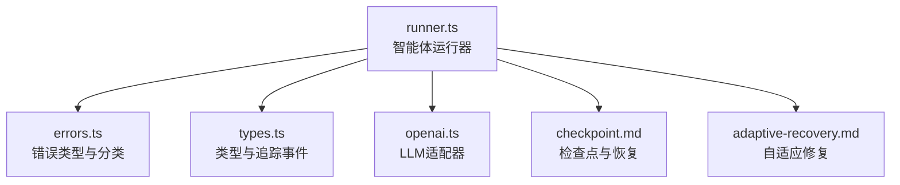
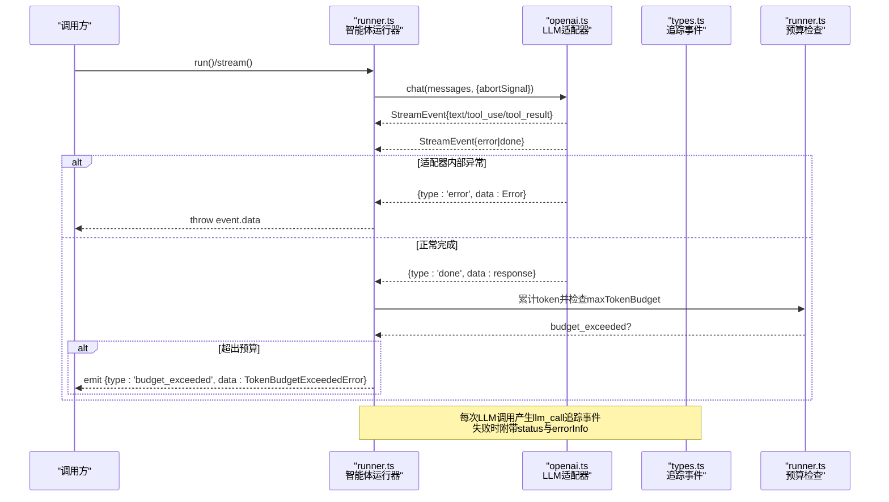
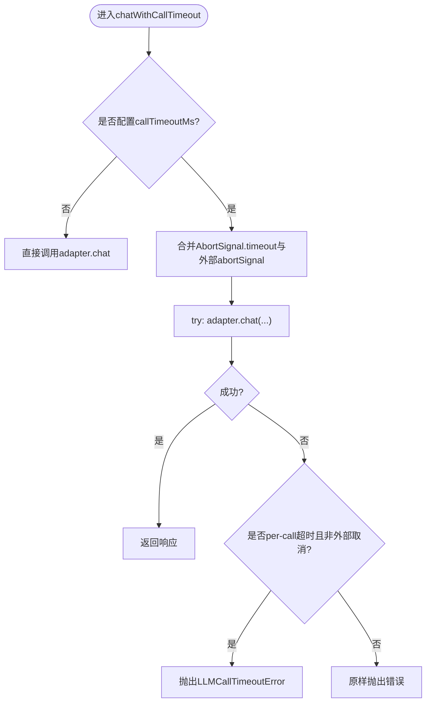
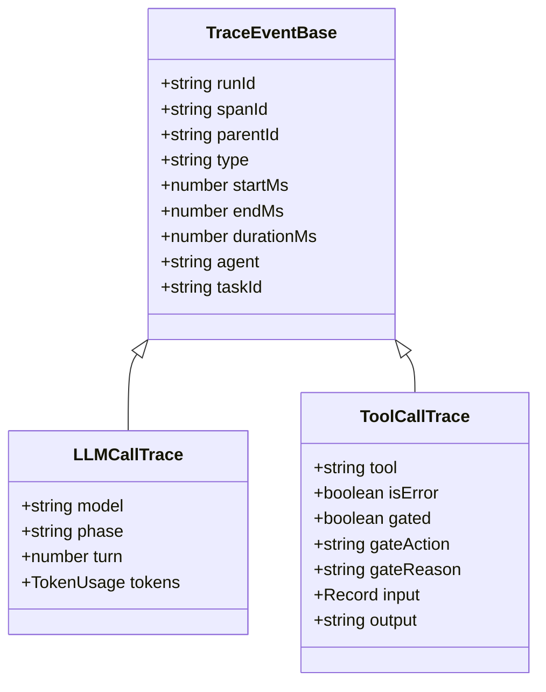
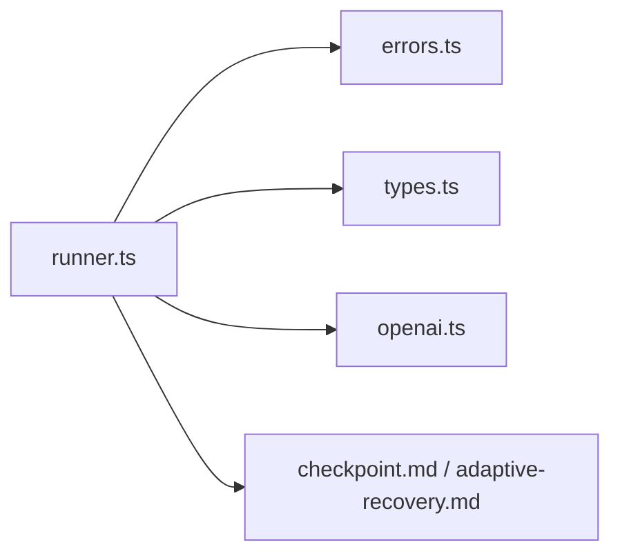

# 错误处理

<cite>
**本文引用的文件**
- [errors.ts](file://packages/core/src/errors.ts)
- [runner.ts](file://packages/core/src/agent/runner.ts)
- [types.ts](file://packages/core/src/types.ts)
- [openai.ts](file://packages/core/src/llm/openai.ts)
- [adaptive-recovery.md](file://docs/adaptive-recovery.md)
- [checkpoint.md](file://docs/checkpoint.md)
- [error-classification.test.ts](file://packages/core/tests/error-classification.test.ts)
- [errors.test.ts](file://packages/core/tests/errors.test.ts)
</cite>

## 目录
1. [简介](#简介)
2. [项目结构](#项目结构)
3. [核心组件](#核心组件)
4. [架构总览](#架构总览)
5. [详细组件分析](#详细组件分析)
6. [依赖关系分析](#依赖关系分析)
7. [性能考量](#性能考量)
8. [故障排查指南](#故障排查指南)
9. [结论](#结论)
10. [附录](#附录)

## 简介
本文件系统性解析智能体执行过程中的错误处理机制，覆盖内置异常类型、超时控制、重试策略、异常恢复流程、可观测性集成（TraceEvent）、常见错误诊断与解决方案，以及自定义错误处理器的实现要点。目标是帮助读者在开发与运维中构建健壮、可观测、可恢复的智能体执行链路。

## 项目结构
围绕错误处理的关键代码分布在以下位置：
- 错误类型与分类：packages/core/src/errors.ts
- 智能体运行器与流式执行：packages/core/src/agent/runner.ts
- 类型定义与追踪事件：packages/core/src/types.ts
- LLM 适配器（示例）：packages/core/src/llm/openai.ts
- 恢复与检查点文档：docs/adaptive-recovery.md、docs/checkpoint.md
- 错误分类测试：packages/core/tests/error-classification.test.ts、packages/core/tests/errors.test.ts



图表来源
- [runner.ts:566-666](file://packages/core/src/agent/runner.ts#L566-L666)
- [errors.ts:1-239](file://packages/core/src/errors.ts#L1-L239)
- [types.ts:2665-2705](file://packages/core/src/types.ts#L2665-L2705)
- [openai.ts:362-390](file://packages/core/src/llm/openai.ts#L362-L390)
- [checkpoint.md:1-290](file://docs/checkpoint.md#L1-L290)
- [adaptive-recovery.md:1-132](file://docs/adaptive-recovery.md#L1-L132)

章节来源
- [runner.ts:566-666](file://packages/core/src/agent/runner.ts#L566-L666)
- [errors.ts:1-239](file://packages/core/src/errors.ts#L1-L239)
- [types.ts:2665-2705](file://packages/core/src/types.ts#L2665-L2705)
- [openai.ts:362-390](file://packages/core/src/llm/openai.ts#L362-L390)
- [checkpoint.md:1-290](file://docs/checkpoint.md#L1-L290)
- [adaptive-recovery.md:1-132](file://docs/adaptive-recovery.md#L1-L132)

## 核心组件
- 错误类型与分类
  - 内置错误：TokenBudgetExceededError、CostBudgetExceededError、LLMCallTimeoutError、RoutingTimeoutError、RoutingProfilerFailedError、RoutingDeclarationRequiredError、InvalidMessageError、UnsupportedToolCallError、UnsupportedToolResultContentError、InvalidTaskRequirementsError
  - 分类工具：isRetryableError、isCancellationError
- 运行时错误传播
  - runner 将流式事件中的 error 类型抛出；budget_exceeded 通过事件上报
  - LLM 适配器在捕获异常后以 error 事件形式返回
- 超时控制
  - callTimeoutMs：为每次 LLM 调用设置独立超时，使用 AbortSignal.timeout 并与外部 abortSignal 合并
  - 当仅由 per-call 超时时抛出 LLMCallTimeoutError，区分于用户主动取消
- 预算控制
  - maxTokenBudget：在代理轮次或委托调用后累计 token 用量，超过则触发 TokenBudgetExceededError 并标记完成
- 可观测性
  - 通过 TraceEvent 记录 llm_call、tool_call、task 等事件，包含 startMs/endMs/durationMs、agent/model/provider/turn 等上下文
  - 失败时通过 classifyRunFailure 标注 status 与 errorInfo（如 timeout/cancellation）

章节来源
- [errors.ts:1-239](file://packages/core/src/errors.ts#L1-L239)
- [runner.ts:566-666](file://packages/core/src/agent/runner.ts#L566-L666)
- [runner.ts:837-876](file://packages/core/src/agent/runner.ts#L837-L876)
- [runner.ts:1107-1146](file://packages/core/src/agent/runner.ts#L1107-L1146)
- [openai.ts:362-390](file://packages/core/src/llm/openai.ts#L362-L390)
- [types.ts:2665-2705](file://packages/core/src/types.ts#L2665-L2705)

## 架构总览
下图展示一次智能体调用的错误路径与可观测性落点：



图表来源
- [runner.ts:566-666](file://packages/core/src/agent/runner.ts#L566-L666)
- [runner.ts:837-876](file://packages/core/src/agent/runner.ts#L837-L876)
- [runner.ts:1107-1146](file://packages/core/src/agent/runner.ts#L1107-L1146)
- [openai.ts:362-390](file://packages/core/src/llm/openai.ts#L362-L390)
- [types.ts:2665-2705](file://packages/core/src/types.ts#L2665-L2705)

## 详细组件分析

### 内置错误类型与使用场景
- TokenBudgetExceededError：当 agent 的 token 用量超过配置的 maxTokenBudget 时抛出，用于保护成本与配额。
- CostBudgetExceededError：当估算成本超过配置的成本预算时抛出。
- LLMCallTimeoutError：单次 LLM 调用超过 callTimeoutMs 时抛出，区别于整体运行超时与用户主动取消。
- RoutingTimeoutError / RoutingProfilerFailedError / RoutingDeclarationRequiredError：路由与语义分析阶段的错误。
- InvalidMessageError：输入消息不符合 LLMMessage[] 契约。
- UnsupportedToolCallError / UnsupportedToolResultContentError：模型返回了框架无法执行的工具调用或结果内容类型。
- InvalidTaskRequirementsError：任务无可用代理或显式指定代理不满足硬性要求。

这些错误均带有稳定的 code 字段与可读 message，便于上层按错误码进行分支处理与告警。

章节来源
- [errors.ts:11-180](file://packages/core/src/errors.ts#L11-L180)
- [errors.test.ts:10-131](file://packages/core/tests/errors.test.ts#L10-L131)

### 超时控制：callTimeoutMs 与 AbortSignal
- 每调用超时：runner 在发起 adapter.chat 前，若配置了 callTimeoutMs，则创建 AbortSignal.timeout 并与外部 abortSignal 合并，确保每个 LLM 调用都有统一上限。
- 超时判定：仅在“自身 per-call 超时”且“非调用方主动取消”的情况下抛出 LLMCallTimeoutError，避免误报。
- 可观测性：在 tracedChat 中根据 abortSignal.reason 判断是否为 TimeoutError，并在 span 结束时代码化状态（timeout/cancellation）。



图表来源
- [runner.ts:566-582](file://packages/core/src/agent/runner.ts#L566-L582)
- [runner.ts:616-640](file://packages/core/src/agent/runner.ts#L616-L640)

章节来源
- [runner.ts:566-582](file://packages/core/src/agent/runner.ts#L566-L582)
- [runner.ts:616-640](file://packages/core/src/agent/runner.ts#L616-L640)

### 重试机制：策略、退避与失败条件
- 可重试判定：isRetryableError 对错误进行分类，保守设计下默认可重试，除非明确为终端错误（如预算耗尽、非法输入、用户取消、非特定4xx）。
- 特殊状态码：408/409/429 视为可重试（请求超时、冲突、限流），其他 4xx 不可重试，5xx 可重试。
- 取消错误：AbortError 与 OpenAI SDK APIUserAbortError 被视为终端错误，不进行重试。
- 退避与次数：任务级别的重试参数包括 maxRetries、retryDelayMs、retryBackoff，用于指数退避与最大尝试次数控制。

```mermaid
flowchart TD
S(["收到错误"]) --> Kind{"错误类型/状态码"}
Kind --> |预算/消息/工具不支持/任务需求不满足| Terminal["终端错误(不重试)"]
Kind --> |取消错误| Terminal
Kind --> |4xx(除408/409/429)| Terminal
Kind --> |408/409/429/5xx/未知| Retry["可重试"]
Retry --> Backoff["应用退避算法"]
Backoff --> NextAttempt{"达到maxRetries?"}
NextAttempt --> |否| ReExec["重新执行"]
NextAttempt --> |是| Fail["最终失败"]
```

图表来源
- [errors.ts:188-239](file://packages/core/src/errors.ts#L188-L239)
- [types.ts:2082-2089](file://packages/core/src/types.ts#L2082-L2089)
- [error-classification.test.ts:14-92](file://packages/core/tests/error-classification.test.ts#L14-L92)

章节来源
- [errors.ts:188-239](file://packages/core/src/errors.ts#L188-L239)
- [types.ts:2082-2089](file://packages/core/src/types.ts#L2082-L2089)
- [error-classification.test.ts:14-92](file://packages/core/tests/error-classification.test.ts#L14-L92)

### 异常恢复流程：从捕获到清理与资源释放
- 流式错误传播：runner.stream 在遇到 error 事件时直接抛出，调用方可据此中断或降级。
- 预算超限恢复：当检测到预算超限时，设置 phase=completed 并持久化检查点，随后退出循环，保证状态一致。
- 中止信号：在进入下一次 LLM 调用前检查 effectiveAbortSignal，若已中止则标记 aborted 并退出。
- 检查点与恢复：
  - 检查点在安全边界写入，支持进程崩溃/重启后的恢复。
  - 恢复会重建任务队列、共享内存、已完成任务结果与进行中 runner 状态，跳过已完成任务，继续执行剩余工作。
  - 对于工具调用，采用逐条提交机制，未提交的在恢复时重放，已提交的直接回放结果。
- 自适应修复：在任务结果屏障处，可通过 Replanner 提出 PlanPatch，经校验与审批后原子应用，再发布新就绪工作。

```mermaid
sequenceDiagram
participant R as "runner.ts"
participant CP as "checkpoint.md"
participant AR as "adaptive-recovery.md"
R->>R : 检测预算/中止/异常
R->>CP : 在安全边界写入检查点
alt 预算超限
R-->>R : phase=completed; 持久化; 退出
else 异常
R-->>R : 抛出错误事件
end
R->>AR : 任务完成后评估是否需要修复
AR-->>R : 若批准则应用PlanPatch并发布新任务
```

图表来源
- [runner.ts:1107-1146](file://packages/core/src/agent/runner.ts#L1107-L1146)
- [checkpoint.md:1-290](file://docs/checkpoint.md#L1-L290)
- [adaptive-recovery.md:1-132](file://docs/adaptive-recovery.md#L1-L132)

章节来源
- [runner.ts:1107-1146](file://packages/core/src/agent/runner.ts#L1107-L1146)
- [checkpoint.md:1-290](file://docs/checkpoint.md#L1-L290)
- [adaptive-recovery.md:1-132](file://docs/adaptive-recovery.md#L1-L132)

### 可观测性集成：TraceEvent 记录错误与指标
- 事件类型：llm_call、tool_call、task、agent、plan_ready、agent_stream、consensus、routing_decision。
- 通用字段：runId、spanId、parentId、type、startMs、endMs、durationMs、agent、taskId。
- LLM 调用追踪：包含 model、phase、turn、tokens，失败时通过 classifyRunFailure 标注 status 与 errorInfo（kind/statusCode）。
- 工具调用追踪：记录 tool、isError、gated/gateAction/gateReason、input/output（脱敏）。



图表来源
- [types.ts:2665-2705](file://packages/core/src/types.ts#L2665-L2705)
- [runner.ts:597-666](file://packages/core/src/agent/runner.ts#L597-L666)

章节来源
- [types.ts:2665-2705](file://packages/core/src/types.ts#L2665-L2705)
- [runner.ts:597-666](file://packages/core/src/agent/runner.ts#L597-L666)

### 常见错误的诊断方法与解决方案
- LLM 调用超时
  - 现象：抛出 LLMCallTimeoutError，trace 中标记 kind=timeout。
  - 诊断：检查 callTimeoutMs 是否过小；确认 provider 响应时间；查看 trace 的 durationMs。
  - 解决：适当增大 callTimeoutMs；优化 prompt；切换更快模型；必要时启用重试（该错误被判定为可重试）。
- Token/Cost 预算超限
  - 现象：预算事件或抛出对应错误；运行提前完成。
  - 诊断：检查 maxTokenBudget/成本估算；查看 llm_call 的 tokens。
  - 解决：提高预算；压缩上下文；拆分任务；减少工具输出长度。
- 路由阶段失败
  - 现象：RoutingTimeoutError/RoutingProfilerFailedError/RoutingDeclarationRequiredError。
  - 诊断：检查路由配置与语义分析耗时；确认是否需要显式治理声明。
  - 解决：调整路由超时；完善声明；提供 profiler 所需信息。
- 工具调用不被支持
  - 现象：UnsupportedToolCallError/UnsupportedToolResultContentError。
  - 诊断：核对 provider 能力与 OMA 支持的 JSON-schema 工具；检查工具结果类型。
  - 解决：更换 provider；改造工具定义；避免传递无法序列化的结果。
- 输入消息无效
  - 现象：InvalidMessageError。
  - 诊断：检查传入消息是否符合 LLMMessage[] 契约。
  - 解决：修正消息结构；在适配层做前置校验。

章节来源
- [errors.ts:11-180](file://packages/core/src/errors.ts#L11-L180)
- [runner.ts:566-666](file://packages/core/src/agent/runner.ts#L566-L666)
- [types.ts:2665-2705](file://packages/core/src/types.ts#L2665-L2705)

### 错误监控与告警最佳实践
- 基于 TraceEvent 的监控
  - 采集 llm_call 的 durationMs、tokens、model/provider/turn，识别慢调用与高消耗。
  - 关注 tool_call 的 isError 与 gateAction，定位工具失败与门控拒绝。
- 错误分级与告警
  - 终端错误（预算耗尽、非法输入、取消）：立即告警并阻断后续重试。
  - 可重试错误（网络抖动、限流、服务器错误）：结合退避策略与熔断阈值进行告警。
- 检查点与恢复的可观测性
  - 记录 checkpoint 写入失败事件，持续观察存储健康度。
  - 恢复路径中记录 continued_from 与 attempt，便于审计。

章节来源
- [types.ts:2665-2705](file://packages/core/src/types.ts#L2665-L2705)
- [checkpoint.md:154-170](file://docs/checkpoint.md#L154-L170)

### 自定义错误处理器实现指南
- 在调用链顶层捕获 stream 的 error 事件或 run 抛出的异常，依据错误 code 分流处理。
- 利用 isRetryableError 决定是否需要重试；结合 maxRetries/retryDelayMs/retryBackoff 实现指数退避。
- 对预算类错误（Token/Cost）进行快速失败与告警，避免浪费资源。
- 对取消类错误（AbortError/APIUserAbortError）不做重试，直接清理资源并返回。
- 将错误与 TraceEvent 关联：在错误路径上补充 errorInfo（kind/statusCode），便于统一可视化。

章节来源
- [errors.ts:188-239](file://packages/core/src/errors.ts#L188-L239)
- [runner.ts:837-876](file://packages/core/src/agent/runner.ts#L837-L876)
- [runner.ts:616-640](file://packages/core/src/agent/runner.ts#L616-L640)

## 依赖关系分析
- runner.ts 依赖 errors.ts 的错误类型与分类函数，依赖 types.ts 的追踪事件与配置项。
- openai.ts 作为 LLM 适配器，将异常转换为 StreamEvent.error，供 runner 消费。
- adaptive-recovery.md 与 checkpoint.md 描述恢复与检查点机制，影响 runner 的状态管理与错误恢复路径。



图表来源
- [runner.ts:566-666](file://packages/core/src/agent/runner.ts#L566-L666)
- [errors.ts:1-239](file://packages/core/src/errors.ts#L1-L239)
- [types.ts:2665-2705](file://packages/core/src/types.ts#L2665-L2705)
- [openai.ts:362-390](file://packages/core/src/llm/openai.ts#L362-L390)
- [checkpoint.md:1-290](file://docs/checkpoint.md#L1-L290)
- [adaptive-recovery.md:1-132](file://docs/adaptive-recovery.md#L1-L132)

章节来源
- [runner.ts:566-666](file://packages/core/src/agent/runner.ts#L566-L666)
- [errors.ts:1-239](file://packages/core/src/errors.ts#L1-L239)
- [types.ts:2665-2705](file://packages/core/src/types.ts#L2665-L2705)
- [openai.ts:362-390](file://packages/core/src/llm/openai.ts#L362-L390)
- [checkpoint.md:1-290](file://docs/checkpoint.md#L1-L290)
- [adaptive-recovery.md:1-132](file://docs/adaptive-recovery.md#L1-L132)

## 性能考量
- 超时与重试的权衡：过短的 callTimeoutMs 会导致频繁超时与重试，增加负载；应结合模型特性与网络状况设定合理值。
- 预算控制：合理的 maxTokenBudget 能防止长尾消耗，但需兼顾复杂任务的上下文需求。
- 检查点写入频率：检查点在安全边界写入，避免对热路径造成压力；存储失败不影响运行，但需监控告警。
- 追踪开销：llm_call/tool_call 等事件包含丰富上下文，生产环境建议采样以降低存储与传输成本。

[本节为通用指导，不直接分析具体文件]

## 故障排查指南
- 快速定位
  - 查看 TraceEvent 中的 llm_call 与 tool_call，关注 durationMs、tokens、isError。
  - 检查错误 code：LLM_CALL_TIMEOUT、TOKEN_BUDGET_EXCEEDED、COST_BUDGET_EXCEEDED、INVALID_MESSAGE、UNSUPPORTED_TOOL_CALL 等。
- 常见问题
  - 模型响应慢：增大 callTimeoutMs 或切换模型；检查 provider 限流。
  - 预算不足：降低上下文长度或拆分任务；调整预算阈值。
  - 工具不兼容：核对 provider 能力；简化工具结果类型。
- 恢复与审计
  - 使用检查点恢复未完成的任务；查看 continued_from 与 attempt。
  - 通过自适应修复在失败后动态调整计划。

章节来源
- [types.ts:2665-2705](file://packages/core/src/types.ts#L2665-L2705)
- [errors.ts:11-180](file://packages/core/src/errors.ts#L11-L180)
- [checkpoint.md:100-170](file://docs/checkpoint.md#L100-L170)
- [adaptive-recovery.md:1-132](file://docs/adaptive-recovery.md#L1-L132)

## 结论
本框架提供了完善的错误类型体系、严格的超时与预算控制、稳健的重试分类与恢复机制，并通过 TraceEvent 实现了端到端可观测性。借助检查点与自适应修复，系统能够在异常情况下保持可控与可恢复。建议在工程中结合错误码、追踪指标与检查点日志，建立分层监控与告警体系，以提升稳定性与可维护性。

[本节为总结，不直接分析具体文件]

## 附录
- 关键配置项参考
  - AgentConfig.callTimeoutMs：单调用超时（毫秒）
  - AgentConfig.maxTokenBudget：令牌预算上限
  - Task.retryDelayMs、Task.retryBackoff、Task.maxRetries：重试退避与次数
- 相关文档
  - 检查点与恢复：docs/checkpoint.md
  - 自适应修复：docs/adaptive-recovery.md

[本节为参考资料，不直接分析具体文件]