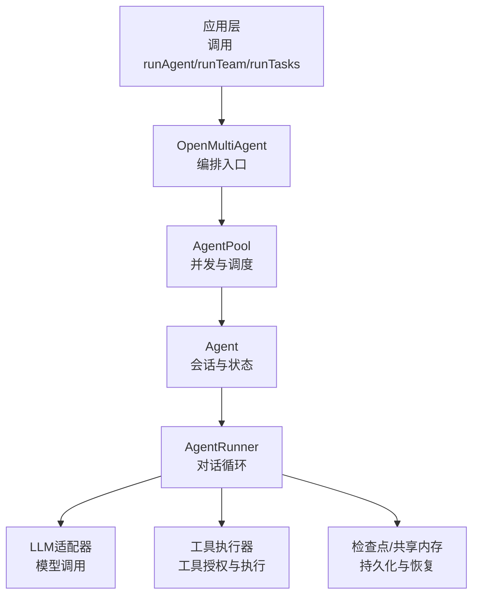
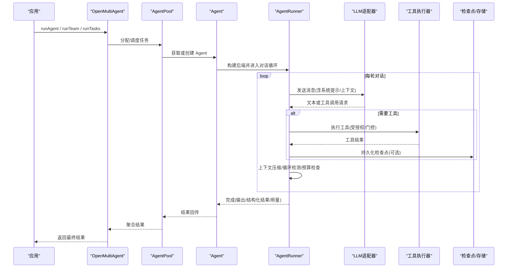
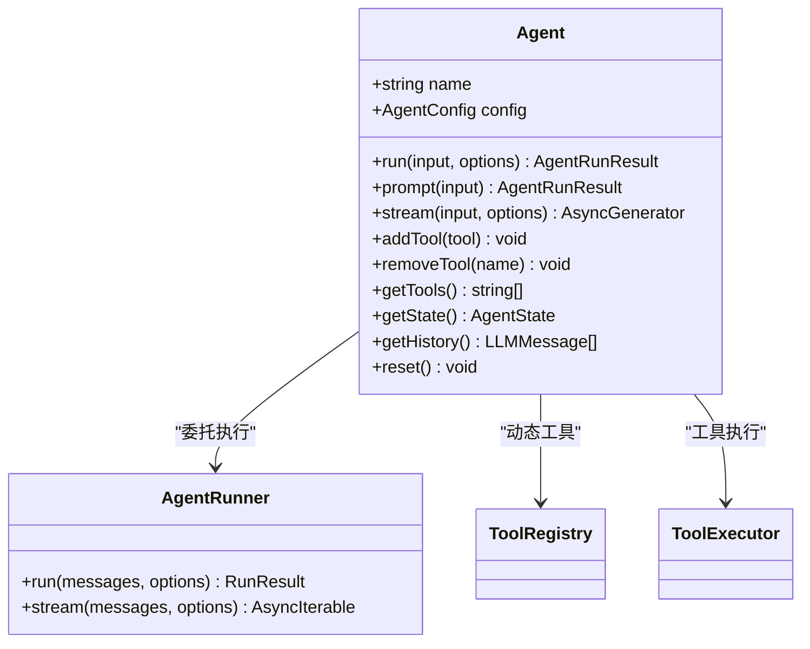
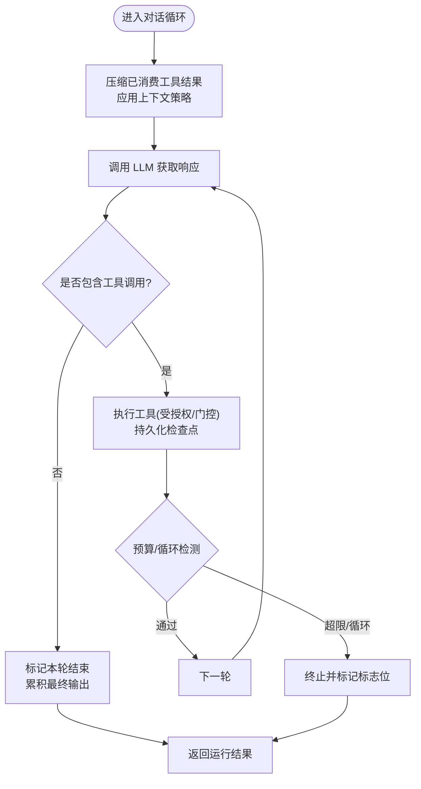
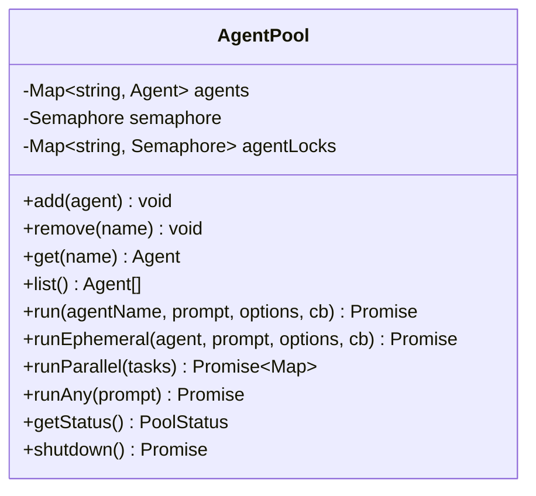
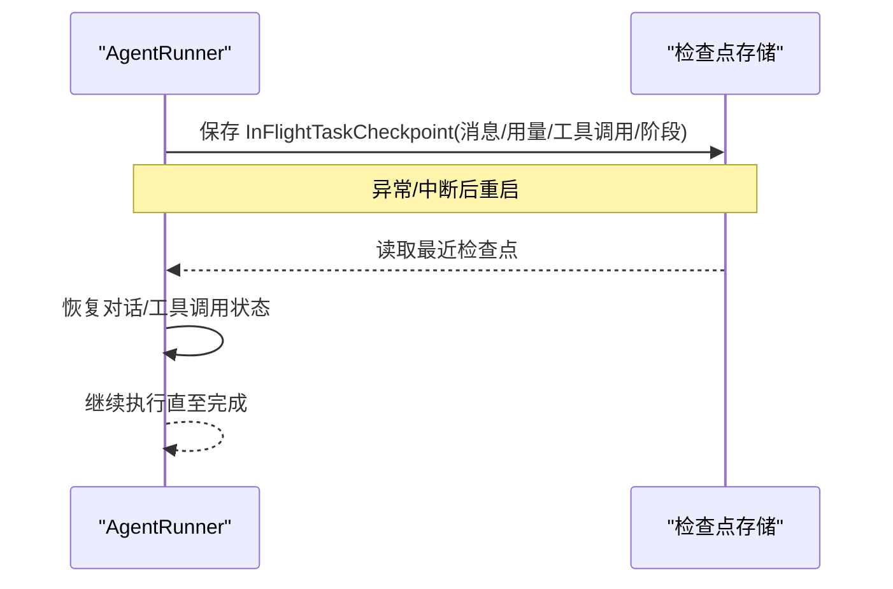
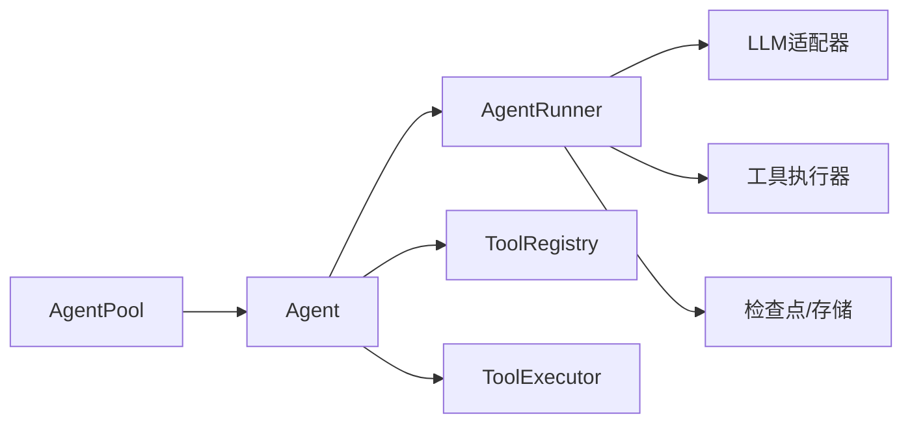

# 智能体生命周期

<cite>
**本文引用的文件**
- [README.md](file://README.md)
- [packages/core/README.md](file://packages/core/README.md)
- [AGENTS.md](file://AGENTS.md)
- [packages/core/src/types.ts](file://packages/core/src/types.ts)
- [packages/core/src/agent/agent.ts](file://packages/core/src/agent/agent.ts)
- [packages/core/src/agent/runner.ts](file://packages/core/src/agent/runner.ts)
- [packages/core/src/agent/pool.ts](file://packages/core/src/agent/pool.ts)
- [packages/core/src/memory/file-store.ts](file://packages/core/src/memory/file-store.ts)
</cite>

## 目录
1. [简介](#简介)
2. [项目结构](#项目结构)
3. [核心组件](#核心组件)
4. [架构总览](#架构总览)
5. [详细组件分析](#详细组件分析)
6. [依赖关系分析](#依赖关系分析)
7. [性能考虑](#性能考虑)
8. [故障排查指南](#故障排查指南)
9. [结论](#结论)
10. [附录：配置与使用示例路径](#附录：配置与使用示例路径)

## 简介
本文件系统性阐述 Open Multi-Agent（OMA）中“智能体（Agent）”的生命周期管理机制，覆盖创建、初始化、执行、销毁等阶段；解释 AgentConfig 的关键选项（系统提示词、工具权限、模型选择等）；说明执行循环（对话管理、上下文处理、结果返回）；介绍池化（AgentPool）管理与资源优化策略；并提供可落地的配置与使用指引、性能调优与故障处理建议。内容兼顾初学者入门与高级用户深入实现细节。

## 项目结构
- 顶层仓库提供多工作区组织，核心编排运行时位于 packages/core。
- 智能体相关代码集中在 packages/core/src/agent，包含高层 Agent、底层 Runner、池化 AgentPool 等。
- 类型定义集中在 types.ts，贯穿各模块的契约。
- 文档与示例在 README、packages/core/README.md 与 docs/ 下。

图表来源
- [packages/core/src/agent/agent.ts:100-231](file://packages/core/src/agent/agent.ts#L100-L231)
- [packages/core/src/agent/runner.ts:1-13](file://packages/core/src/agent/runner.ts#L1-L13)
- [packages/core/src/agent/pool.ts:1-21](file://packages/core/src/agent/pool.ts#L1-L21)
- [packages/core/src/types.ts:2131-2149](file://packages/core/src/types.ts#L2131-L2149)

章节来源
- [README.md:46-97](file://README.md#L46-L97)
- [packages/core/README.md:237-252](file://packages/core/README.md#L237-L252)
- [AGENTS.md:64-70](file://AGENTS.md#L64-L70)

## 核心组件
- Agent：高层封装，负责会话历史、状态机、工具动态注册、结构化输出校验、超时与取消、追踪埋点。
- AgentRunner：对话循环引擎，负责 LLM 调用、工具抽取与执行、上下文压缩、循环检测、预算控制、检查点持久化。
- AgentPool：智能体池，提供并发上限、按名称路由、轮询分发、并行执行与健康快照。
- 类型与配置：types.ts 集中定义 AgentConfig、OrchestratorConfig、RunOptions、CheckpointOptions 等关键契约。

章节来源
- [packages/core/src/agent/agent.ts:100-231](file://packages/core/src/agent/agent.ts#L100-L231)
- [packages/core/src/agent/runner.ts:1-13](file://packages/core/src/agent/runner.ts#L1-L13)
- [packages/core/src/agent/pool.ts:51-78](file://packages/core/src/agent/pool.ts#L51-L78)
- [packages/core/src/types.ts:2131-2149](file://packages/core/src/types.ts#L2131-L2149)

## 架构总览
下图展示从应用调用到智能体执行的端到端流程，包括编排、池化、对话循环、工具执行、检查点与观测。

图表来源
- [packages/core/src/agent/agent.ts:280-328](file://packages/core/src/agent/agent.ts#L280-L328)
- [packages/core/src/agent/runner.ts:986-1177](file://packages/core/src/agent/runner.ts#L986-L1177)
- [packages/core/src/agent/pool.ts:146-196](file://packages/core/src/agent/pool.ts#L146-L196)
- [packages/core/src/types.ts:2349-2362](file://packages/core/src/types.ts#L2349-L2362)

## 详细组件分析

### 智能体 Agent：创建、初始化、执行、销毁
- 创建与初始化
  - 构造时接收 AgentConfig，注入工具注册表与执行器；若未设置 model 且无外部 backend，会抛出错误以强制声明模型。
  - 懒加载后端：首次 run/prompt/stream 时根据 provider/adapter/backend 创建 LLM 适配器或外部后端（ACP/Process）。
  - 系统提示词增强：当配置 outputSchema 时，自动追加结构化输出指令到系统提示词。
- 执行
  - run：一次性对话，不修改持久历史；prompt：追加到持久历史；stream：流式事件。
  - 统一执行路径处理 beforeRun/afterRun 钩子、超时与取消、结构化输出重试与校验、追踪埋点与状态迁移。
- 销毁与重置
  - reset：清空历史并回到 idle，复用后端连接；shutdown（池级）批量 reset。

图表来源
- [packages/core/src/agent/agent.ts:100-231](file://packages/core/src/agent/agent.ts#L100-L231)
- [packages/core/src/agent/agent.ts:280-328](file://packages/core/src/agent/agent.ts#L280-L328)
- [packages/core/src/agent/agent.ts:361-381](file://packages/core/src/agent/agent.ts#L361-L381)
- [packages/core/src/agent/agent.ts:344-355](file://packages/core/src/agent/agent.ts#L344-L355)

章节来源
- [packages/core/src/agent/agent.ts:100-231](file://packages/core/src/agent/agent.ts#L100-L231)
- [packages/core/src/agent/agent.ts:280-328](file://packages/core/src/agent/agent.ts#L280-L328)
- [packages/core/src/agent/agent.ts:344-381](file://packages/core/src/agent/agent.ts#L344-L381)

### 执行循环（AgentRunner）：对话管理、上下文处理、结果返回
- 主循环
  - while(true) 直到 end_turn 或达到 maxTurns；每轮先压缩已消费的工具结果，再按 contextStrategy 进行上下文压缩。
  - 调用 LLM 得到响应，提取 tool_use 块；若无工具调用则视为本轮结束，累积最终输出。
- 工具执行
  - 基于 resolveTools 得到的 grantedToolNames 做白名单拦截，防止未授权工具被静默执行。
  - 支持 onToolCall 门控、并发执行、检查点持久化（executing_tools 阶段挂起点）。
- 循环检测与预算
  - LoopDetector 记录重复工具调用与文本，触发 warn/inject/terminate。
  - 预算检查在 turn/task 边界进行，超限时标记 budgetExceeded。
- 结果返回
  - 产出 messages、output、toolCalls、tokenUsage，以及 loopDetected/budgetExceeded/aborted/suspended 等标志。

图表来源
- [packages/core/src/agent/runner.ts:986-1177](file://packages/core/src/agent/runner.ts#L986-L1177)
- [packages/core/src/agent/runner.ts:1265-1357](file://packages/core/src/agent/runner.ts#L1265-L1357)
- [packages/core/src/agent/runner.ts:902-931](file://packages/core/src/agent/runner.ts#L902-L931)

章节来源
- [packages/core/src/agent/runner.ts:986-1177](file://packages/core/src/agent/runner.ts#L986-L1177)
- [packages/core/src/agent/runner.ts:1265-1357](file://packages/core/src/agent/runner.ts#L1265-L1357)
- [packages/core/src/agent/runner.ts:902-931](file://packages/core/src/agent/runner.ts#L902-L931)

### 智能体池 AgentPool：并发控制与资源优化
- 并发上限
  - 通过 Semaphore 限制全局并发；每个 Agent 实例有独立互斥锁，避免同一实例并发冲突。
- 调度方式
  - run：按名称查找 Agent 并执行；runAny：轮询选择可用 Agent；runParallel：扇出并行，返回 Map<agentName, result>。
- 健康与生命周期
  - getStatus 统计各状态数量；shutdown 批量 reset 所有 Agent。

图表来源
- [packages/core/src/agent/pool.ts:51-78](file://packages/core/src/agent/pool.ts#L51-L78)
- [packages/core/src/agent/pool.ts:99-140](file://packages/core/src/agent/pool.ts#L99-L140)
- [packages/core/src/agent/pool.ts:146-196](file://packages/core/src/agent/pool.ts#L146-L196)
- [packages/core/src/agent/pool.ts:244-318](file://packages/core/src/agent/pool.ts#L244-L318)
- [packages/core/src/agent/pool.ts:324-362](file://packages/core/src/agent/pool.ts#L324-L362)

章节来源
- [packages/core/src/agent/pool.ts:51-78](file://packages/core/src/agent/pool.ts#L51-L78)
- [packages/core/src/agent/pool.ts:146-196](file://packages/core/src/agent/pool.ts#L146-L196)
- [packages/core/src/agent/pool.ts:244-318](file://packages/core/src/agent/pool.ts#L244-L318)
- [packages/core/src/agent/pool.ts:324-362](file://packages/core/src/agent/pool.ts#L324-L362)

### 配置体系：AgentConfig 与 OrchestratorConfig
- AgentConfig 关键项
  - 模型与提供者：model、provider、baseURL、apiKey、region。
  - 系统提示词：systemPrompt；结构化输出：outputSchema（自动注入指令）。
  - 工具权限：tools/disallowedTools/toolPreset；工作目录 cwd（文件系统沙箱）。
  - 执行控制：maxTurns、callTimeoutMs、timeoutMs、parallelToolCalls、contextStrategy、loopDetection、maxTokenBudget、compressToolResults、preserveReasoningAsText、compressReasoningText。
  - 回调与凭据：beforeRun、afterRun、onToolCall、credentials。
- OrchestratorConfig 关键项
  - 默认模型与提供者：defaultModel、defaultProvider、defaultBaseURL、defaultApiKey。
  - 检查点与恢复：checkpoint、recovery。
  - 工具默认授权：defaultToolPreset。
  - 计划与任务审批：onPlanReady、onTaskDispatch、onAgentStream。
  - 成本估算：estimateCost。

章节来源
- [packages/core/src/types.ts:544-582](file://packages/core/src/types.ts#L544-L582)
- [packages/core/src/types.ts:1217-1245](file://packages/core/src/types.ts#L1217-L1245)
- [packages/core/src/types.ts:2208-2236](file://packages/core/src/types.ts#L2208-L2236)
- [packages/core/src/types.ts:2314-2342](file://packages/core/src/types.ts#L2314-L2342)
- [packages/core/src/types.ts:2349-2362](file://packages/core/src/types.ts#L2349-L2362)

### 检查点与恢复：持久化与断点续跑
- 检查点写入时机：对话循环中的安全边界（如 executing_tools 前），以及任务完成边界。
- 存储后端：可使用团队共享内存存储或自定义 MemoryStore；FileStore 提供进程内单文件持久化。
- 恢复语义：restore 读取最新检查点，重建任务队列与 Agent 状态，继续执行未完成部分。

图表来源
- [packages/core/src/agent/runner.ts:916-931](file://packages/core/src/agent/runner.ts#L916-L931)
- [packages/core/src/memory/file-store.ts:23-45](file://packages/core/src/memory/file-store.ts#L23-L45)
- [packages/core/src/types.ts:2349-2362](file://packages/core/src/types.ts#L2349-L2362)

章节来源
- [packages/core/src/agent/runner.ts:916-931](file://packages/core/src/agent/runner.ts#L916-L931)
- [packages/core/src/memory/file-store.ts:23-45](file://packages/core/src/memory/file-store.ts#L23-L45)
- [packages/core/src/types.ts:2349-2362](file://packages/core/src/types.ts#L2349-L2362)

## 依赖关系分析
- Agent 依赖 AgentRunner 作为执行后端，并通过 ToolRegistry/ToolExecutor 管理工具。
- AgentRunner 依赖 LLM 适配器与工具执行器，同时与检查点/共享内存交互。
- AgentPool 通过 Semaphore 协调并发，并对 Agent 实例加锁保证串行化。
- 类型定义集中在 types.ts，为各模块提供稳定契约。

图表来源
- [packages/core/src/agent/agent.ts:100-231](file://packages/core/src/agent/agent.ts#L100-L231)
- [packages/core/src/agent/runner.ts:1-13](file://packages/core/src/agent/runner.ts#L1-L13)
- [packages/core/src/agent/pool.ts:51-78](file://packages/core/src/agent/pool.ts#L51-L78)

章节来源
- [packages/core/src/agent/agent.ts:100-231](file://packages/core/src/agent/agent.ts#L100-L231)
- [packages/core/src/agent/runner.ts:1-13](file://packages/core/src/agent/runner.ts#L1-L13)
- [packages/core/src/agent/pool.ts:51-78](file://packages/core/src/agent/pool.ts#L51-L78)

## 性能考虑
- 上下文压缩
  - 启用 compressToolResults 减少历史膨胀；配置 contextStrategy（滑动窗口/摘要/紧凑）控制长对话开销。
- 循环检测
  - 合理设置 loopDetection.maxRepetitions 与 window，避免无效循环消耗 token。
- 预算控制
  - 设置 maxTokenBudget 与 estimateCost，结合 callTimeoutMs/timeoutMs 限制单次调用与整轮耗时。
- 并发与池化
  - 调整 AgentPool 的 maxConcurrency，避免过载；对同质 Agent 使用 runAny 轮询均衡负载。
- 工具执行
  - 最小化工具授权面，使用 disallowedTools 与 toolPreset 精准控制；必要时开启 onToolCall 门控。
- 检查点频率
  - 在安全边界写入检查点，平衡持久化开销与恢复粒度。

[本节为通用指导，无需具体文件引用]

## 故障排查指南
- 常见错误与定位
  - 缺少模型：独立 Agent 必须显式设置 model，否则构造时报错。
  - 工具未授权：内置工具默认拒绝，需在 tools/toolPreset/defaultToolPreset 中授予。
  - 预算超限：出现 budgetExceeded 标志，需调整 maxTokenBudget 或优化上下文。
  - 循环检测触发：出现 loopDetected，需调整 loopDetection 参数或优化提示词/工具。
  - 超时/取消：timeoutMs/abortSignal 触发，需检查外部依赖延迟与取消传播。
- 诊断手段
  - 使用 onWarning/onMessage/onTrace 收集中间信息；利用离线 Run Viewer 回放任务 DAG 与水瀑布图。
  - 启用检查点并 restore 验证恢复路径；对比前后 messages/toolCalls/tokenUsage 定位问题。

章节来源
- [packages/core/src/agent/agent.ts:122-149](file://packages/core/src/agent/agent.ts#L122-L149)
- [packages/core/src/agent/runner.ts:1265-1357](file://packages/core/src/agent/runner.ts#L1265-L1357)
- [packages/core/README.md:288-316](file://packages/core/README.md#L288-L316)

## 结论
OMA 的智能体生命周期围绕 Agent（会话与状态）、AgentRunner（对话循环与工具执行）、AgentPool（并发与调度）三大构件展开。通过 AgentConfig/OrchestratorConfig 精细控制模型、工具、上下文与预算；借助检查点与恢复机制保障可靠性；配合观测与评估能力实现生产级运维。遵循本文的配置与实践建议，可在不同规模与约束下稳定运行多智能体工作流。

[本节为总结性内容，无需具体文件引用]

## 附录：配置与使用示例路径
- 快速开始与团队协作示例
  - [packages/core/README.md:57-99](file://packages/core/README.md#L57-L99)
- 执行模式与治理意图
  - [packages/core/README.md:103-185](file://packages/core/README.md#L103-L185)
- 调度策略与并发
  - [packages/core/README.md:187-222](file://packages/core/README.md#L187-L222)
- 生产配置清单（预算、工具、恢复、观测）
  - [packages/core/README.md:288-316](file://packages/core/README.md#L288-L316)
- 检查点与恢复
  - [packages/core/src/types.ts:2349-2362](file://packages/core/src/types.ts#L2349-L2362)
  - [packages/core/src/memory/file-store.ts:23-45](file://packages/core/src/memory/file-store.ts#L23-L45)