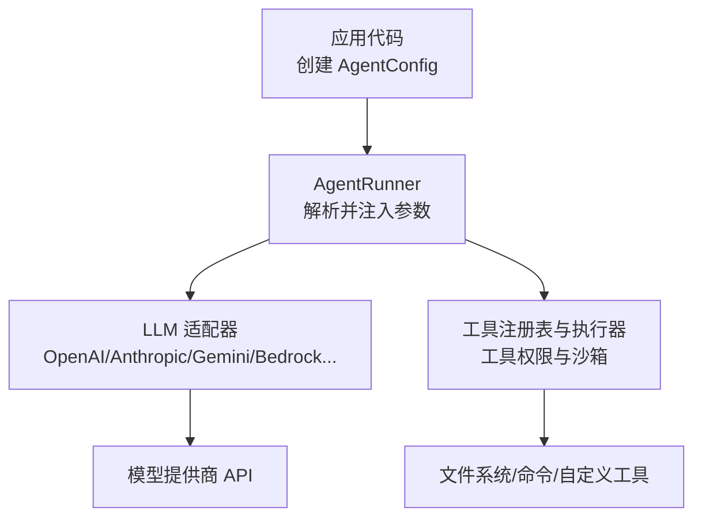
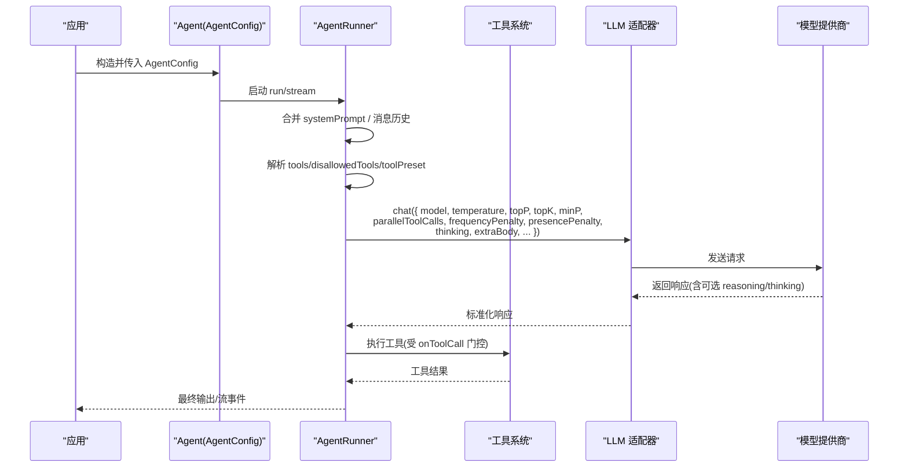
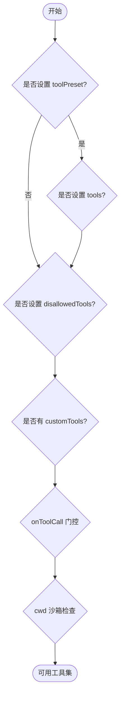
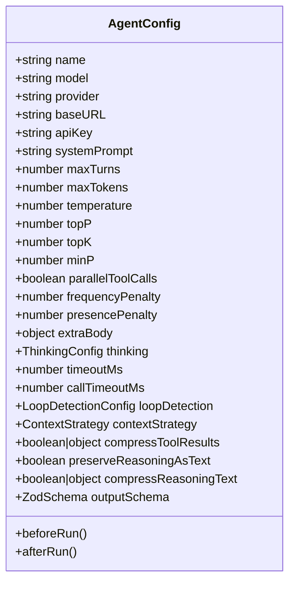
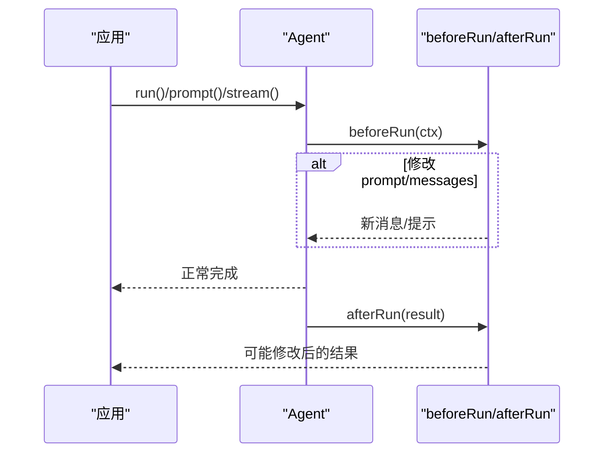
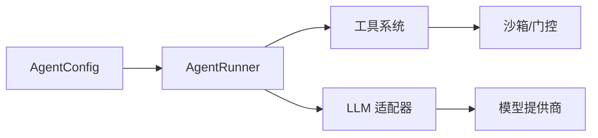

# 智能体配置

<cite>
**本文引用的文件**
- [packages/core/src/types.ts](file://packages/core/src/types.ts)
- [packages/core/src/agent/runner.ts](file://packages/core/src/agent/runner.ts)
- [packages/core/src/llm/openai.ts](file://packages/core/src/llm/openai.ts)
- [docs/providers.md](file://docs/providers.md)
- [docs/tool-configuration.md](file://docs/tool-configuration.md)
- [README.md](file://README.md)
- [packages/core/tests/agent-hooks.test.ts](file://packages/core/tests/agent-hooks.test.ts)
</cite>

## 目录
1. [简介](#简介)
2. [项目结构](#项目结构)
3. [核心组件](#核心组件)
4. [架构总览](#架构总览)
5. [详细组件分析](#详细组件分析)
6. [依赖关系分析](#依赖关系分析)
7. [性能考虑](#性能考虑)
8. [故障排查指南](#故障排查指南)
9. [结论](#结论)
10. [附录：常见配置模式与示例路径](#附录：常见配置模式与示例路径)

## 简介
本文件系统性说明 Open Multi-Agent 中智能体配置（AgentConfig）的选项、用途与最佳实践，覆盖系统提示词设计、模型与提供商选择、工具权限与安全控制、执行参数对行为的影响、回调函数使用方式，以及性能调优与故障排查建议。内容基于源码接口定义、运行器实现、提供商文档与工具配置文档进行归纳与可视化。

## 项目结构
围绕 AgentConfig 的关键代码与文档分布在以下位置：
- 类型与配置定义：packages/core/src/types.ts
- 运行期循环与参数透传：packages/core/src/agent/runner.ts
- 适配器侧推理/思考输出处理：packages/core/src/llm/openai.ts
- 提供商支持与本地/云端接入：docs/providers.md
- 工具白名单/黑名单与沙箱：docs/tool-configuration.md
- 快速上手与团队编排入口：README.md
- 钩子用例验证：packages/core/tests/agent-hooks.test.ts

图表来源
- [packages/core/src/agent/runner.ts:85-177](file://packages/core/src/agent/runner.ts#L85-L177)
- [packages/core/src/types.ts:890-1210](file://packages/core/src/types.ts#L890-L1210)
- [docs/providers.md:20-63](file://docs/providers.md#L20-L63)
- [docs/tool-configuration.md:214-290](file://docs/tool-configuration.md#L214-L290)

章节来源
- [packages/core/src/types.ts:890-1210](file://packages/core/src/types.ts#L890-L1210)
- [packages/core/src/agent/runner.ts:85-177](file://packages/core/src/agent/runner.ts#L85-L177)
- [docs/providers.md:20-63](file://docs/providers.md#L20-L63)
- [docs/tool-configuration.md:214-290](file://docs/tool-configuration.md#L214-L290)

## 核心组件
- AgentConfig：单智能体的静态配置，包含模型、提供商、系统提示词、工具权限、采样参数、上下文策略、超时、循环检测、结构化输出、回调等。
- RunnerOptions：运行器实例级参数，将 AgentConfig 中的关键项在每次 run/stream 时透传给 LLM 调用与工具解析。
- LLM 适配器：封装不同提供商的调用细节，负责将 AgentConfig 中的 thinking、采样参数、extraBody 等映射到具体请求。
- 工具系统：内置工具默认拒绝，需通过 toolPreset/tools/disallowedTools 显式授予；支持 per-call onToolCall 门控与沙箱 cwd。

章节来源
- [packages/core/src/types.ts:890-1210](file://packages/core/src/types.ts#L890-L1210)
- [packages/core/src/agent/runner.ts:85-177](file://packages/core/src/agent/runner.ts#L85-L177)
- [docs/tool-configuration.md:214-290](file://docs/tool-configuration.md#L214-L290)

## 架构总览
下图展示从 AgentConfig 到模型调用与工具执行的端到端流程，包括系统提示词注入、采样参数透传、工具权限解析与门控、以及思考/推理文本的处理。

图表来源
- [packages/core/src/agent/runner.ts:85-177](file://packages/core/src/agent/runner.ts#L85-L177)
- [packages/core/src/agent/runner.ts:948-961](file://packages/core/src/agent/runner.ts#L948-L961)
- [packages/core/src/llm/openai.ts:108-132](file://packages/core/src/llm/openai.ts#L108-L132)
- [docs/tool-configuration.md:326-363](file://docs/tool-configuration.md#L326-L363)

## 详细组件分析

### 系统提示词（systemPrompt）的设计原则与最佳实践
- 角色定义：用简洁明确的语言描述智能体的职责与边界，避免冗长背景。
- 行为约束：明确禁止或限制的行为（如不访问敏感数据、不执行破坏性命令），配合工具白名单/黑名单形成双重约束。
- 输出格式要求：指定结构化输出（可结合 outputSchema），减少自由文本歧义。
- 与工具协同：当启用思考/推理时，注意 provider 差异与文本回退策略（preserveReasoningAsText/compressReasoningText）。

章节来源
- [packages/core/src/types.ts:964-964](file://packages/core/src/types.ts#L964-L964)
- [packages/core/src/types.ts:1133-1185](file://packages/core/src/types.ts#L1133-L1185)
- [packages/core/src/llm/openai.ts:108-132](file://packages/core/src/llm/openai.ts#L108-L132)

### 模型选择（model）与提供商（provider）配置
- 内置提供商：Anthropic、Gemini、OpenAI、Azure OpenAI、GitHub Copilot、Grok、DeepSeek、Doubao、Hunyuan、MiniMax、MiMo、Qiniu、AWS Bedrock 等。
- OpenAI 兼容服务：Ollama、vLLM、LM Studio、llama.cpp、OpenRouter、Groq、Mistral、Zhipu GLM、Qwen、Moonshot、LiteLLM 等。
- 自定义适配器：可通过 adapter 字段直接注入 LLMAdapter，此时 provider/baseURL/apiKey/region 对该智能体无效。
- 环境变量：各提供商使用标准环境变量（如 OPENAI_API_KEY、ANTHROPIC_API_KEY 等），也可通过 apiKey/baseURL 覆盖。

章节来源
- [docs/providers.md:20-63](file://docs/providers.md#L20-L63)
- [docs/providers.md:44-63](file://docs/providers.md#L44-L63)
- [packages/core/src/types.ts:936-963](file://packages/core/src/types.ts#L936-L963)

### 工具权限配置（tools、disallowedTools、toolPreset）与安全机制
- 默认拒绝：未声明任何工具授予时，内置工具不可用。
- 预设集合：readonly/readwrite/full 三种预设，便于快速授权。
- 白名单/黑名单：tools 为允许列表，disallowedTools 为排除列表，二者叠加于预设之上。
- 自定义工具：customTools 绕过预设过滤但仍受 disallowedTools 限制。
- 每调用门控：onToolCall 可在输入校验后、执行前决定 allow/deny/suspend，支持风险分级与人类审批。
- 沙箱工作目录：cwd 限定文件系统工具路径；bash 不受沙箱限制，需谨慎授予。

图表来源
- [docs/tool-configuration.md:214-290](file://docs/tool-configuration.md#L214-L290)
- [docs/tool-configuration.md:326-363](file://docs/tool-configuration.md#L326-L363)
- [docs/tool-configuration.md:391-441](file://docs/tool-configuration.md#L391-L441)

章节来源
- [docs/tool-configuration.md:214-290](file://docs/tool-configuration.md#L214-L290)
- [docs/tool-configuration.md:326-363](file://docs/tool-configuration.md#L326-L363)
- [docs/tool-configuration.md:391-441](file://docs/tool-configuration.md#L391-L441)

### 执行参数配置及其影响
- maxTurns：限制工具调用轮次，防止无限循环。
- maxTokens：单次响应最大 token 数。
- temperature/topP/topK/minP：采样参数，影响多样性与稳定性；部分参数仅对特定提供商生效。
- parallelToolCalls：是否允许一次回复中并行多个工具调用；某些本地服务器需要关闭以避免流式截断。
- frequencyPenalty/presencePenalty：OpenAI 系列频率/存在惩罚；Anthropic 忽略。
- extraBody：透传适配器特定字段（如 vLLM repetition_penalty）。
- thinking：跨提供商的统一“思考/推理”开关与预算/努力级别映射。
- timeoutMs/callTimeoutMs：整体运行与单次模型调用的超时保护。
- loopDetection：重复工具调用/文本输出的检测与处置策略。
- contextStrategy/compressToolResults/preserveReasoningAsText/compressReasoningText：上下文压缩与推理文本保留策略，控制多轮对话的输入增长。

图表来源
- [packages/core/src/types.ts:890-1210](file://packages/core/src/types.ts#L890-L1210)
- [packages/core/src/types.ts:759-763](file://packages/core/src/types.ts#L759-L763)
- [packages/core/src/agent/runner.ts:85-177](file://packages/core/src/agent/runner.ts#L85-L177)

章节来源
- [packages/core/src/types.ts:890-1210](file://packages/core/src/types.ts#L890-L1210)
- [packages/core/src/agent/runner.ts:85-177](file://packages/core/src/agent/runner.ts#L85-L177)

### 回调函数（beforeRun、afterRun）的使用场景与实现
- beforeRun：在每次运行前接收消息与提示文本，可重写用户消息或完整消息列表；抛出异常会中止运行。
- afterRun：在成功完成后接收结果，可修改输出或附加元信息；抛出异常会将运行标记为失败。
- 流式模式：stream 模式下同样触发 beforeRun/afterRun，错误以 error 事件返回。
- 测试覆盖：单元测试覆盖了修改 prompt、异步钩子、组合顺序、history 完整性、结构化输出后处理等场景。

图表来源
- [packages/core/src/types.ts:1196-1210](file://packages/core/src/types.ts#L1196-L1210)
- [packages/core/tests/agent-hooks.test.ts:85-212](file://packages/core/tests/agent-hooks.test.ts#L85-L212)
- [packages/core/tests/agent-hooks.test.ts:218-311](file://packages/core/tests/agent-hooks.test.ts#L218-L311)

章节来源
- [packages/core/src/types.ts:1196-1210](file://packages/core/src/types.ts#L1196-L1210)
- [packages/core/tests/agent-hooks.test.ts:85-212](file://packages/core/tests/agent-hooks.test.ts#L85-L212)
- [packages/core/tests/agent-hooks.test.ts:218-311](file://packages/core/tests/agent-hooks.test.ts#L218-L311)

## 依赖关系分析
- AgentConfig 是上层编排（Team/Orchestrator）与底层运行器（Runner）之间的契约。
- Runner 将 AgentConfig 的采样参数、thinking、extraBody 等透传到 LLM 适配器；同时解析工具权限并注入工具定义。
- 适配器根据能力与配置决定是否保留/压缩推理文本，并将工具调用结果标准化。
- 工具系统遵循“默认拒绝 + 预设/白名单/黑名单 + 门控 + 沙箱”的多层安全模型。

图表来源
- [packages/core/src/types.ts:890-1210](file://packages/core/src/types.ts#L890-L1210)
- [packages/core/src/agent/runner.ts:85-177](file://packages/core/src/agent/runner.ts#L85-L177)
- [docs/tool-configuration.md:214-290](file://docs/tool-configuration.md#L214-L290)

章节来源
- [packages/core/src/types.ts:890-1210](file://packages/core/src/types.ts#L890-L1210)
- [packages/core/src/agent/runner.ts:85-177](file://packages/core/src/agent/runner.ts#L85-L177)
- [docs/tool-configuration.md:214-290](file://docs/tool-configuration.md#L214-L290)

## 性能考虑
- 控制输入增长：开启 compressToolResults 与 contextStrategy，避免多轮对话膨胀导致成本与延迟上升。
- 合理设置采样参数：temperature/topP/topK/minP 平衡创造性与稳定性；本地量化模型建议降低温度并关闭并行工具调用以防流式截断。
- 限制轮次与令牌：maxTurns/maxTokens/maxTokenBudget 防止无界消耗；callTimeoutMs 保障单次调用不会挂起。
- 思考/推理文本：谨慎启用 preserveReasoningAsText，必要时使用 compressReasoningText 控制长度。
- 工具输出裁剪：maxToolOutputChars 限制工具返回大小，减少传输与上下文占用。

[本节提供通用指导，无需特定文件引用]

## 故障排查指南
- 模型不调用工具：确认所选模型具备工具调用能力，或本地服务已正确暴露 function/tool 能力；参考提供商文档与本地模型类别。
- 代理/网络问题：本地服务被代理干扰时，设置 no_proxy 或使用直连地址。
- 工具未被执行：检查工具是否被授予（preset/tools），是否在 disallowedTools 中被排除；确认 onToolCall 未 deny。
- 沙箱路径错误：确保使用绝对路径且位于 cwd 内；bash 不受沙箱限制，请谨慎授予。
- 超时与卡顿：为慢速本地模型设置 timeoutMs 与 callTimeoutMs；必要时增大 maxTokens 或调整 sampling。
- 结构化输出失败：检查 outputSchema 与模型输出一致性；afterRun 可用于二次校验与修正。

章节来源
- [docs/providers.md:157-186](file://docs/providers.md#L157-L186)
- [docs/tool-configuration.md:214-290](file://docs/tool-configuration.md#L214-L290)
- [docs/tool-configuration.md:391-441](file://docs/tool-configuration.md#L391-L441)

## 结论
AgentConfig 提供了从模型、提供商、工具权限到执行参数与回调的全方位配置能力。通过“默认拒绝 + 预设/白名单/黑名单 + 门控 + 沙箱”的工具安全模型，结合采样参数、上下文压缩与思考/推理控制，可以在保证安全与可控的前提下，灵活适配多种提供商与本地环境。配合 beforeRun/afterRun 钩子，可实现输入改写、结果后处理与审计追踪，满足生产环境的可靠性与可观测性需求。

## 附录：常见配置模式与示例路径
- 只读读取型智能体：使用 readonly 预设，适合检索与摘要任务。
- 读写编辑型智能体：使用 readwrite 预设，适合代码编辑与文档生成。
- 全功能执行型智能体：使用 full 预设，适合自动化脚本与系统操作（注意 bash 风险）。
- 自定义工具注入：通过 customTools 扩展业务工具，仍受 disallowedTools 限制。
- 按角色授权：在团队编排中为不同 agent 配置不同的 tools/toolPreset，实现最小权限。
- 本地模型接入：通过 openai 兼容 baseURL 指向 Ollama/vLLM/LM Studio 等，按需设置 apiKey 占位与 timeoutMs。
- 思考/推理：为支持 provider 开启 thinking，并结合 preserveReasoningAsText 与 compressReasoningText 控制文本体积。

示例与参考路径
- 快速上手与团队编排：README.md
- 提供商与本地模型接入：docs/providers.md
- 工具权限与沙箱：docs/tool-configuration.md
- 钩子用法与行为验证：packages/core/tests/agent-hooks.test.ts

章节来源
- [README.md:46-97](file://README.md#L46-L97)
- [docs/providers.md:20-63](file://docs/providers.md#L20-L63)
- [docs/tool-configuration.md:251-290](file://docs/tool-configuration.md#L251-L290)
- [packages/core/tests/agent-hooks.test.ts:85-212](file://packages/core/tests/agent-hooks.test.ts#L85-L212)