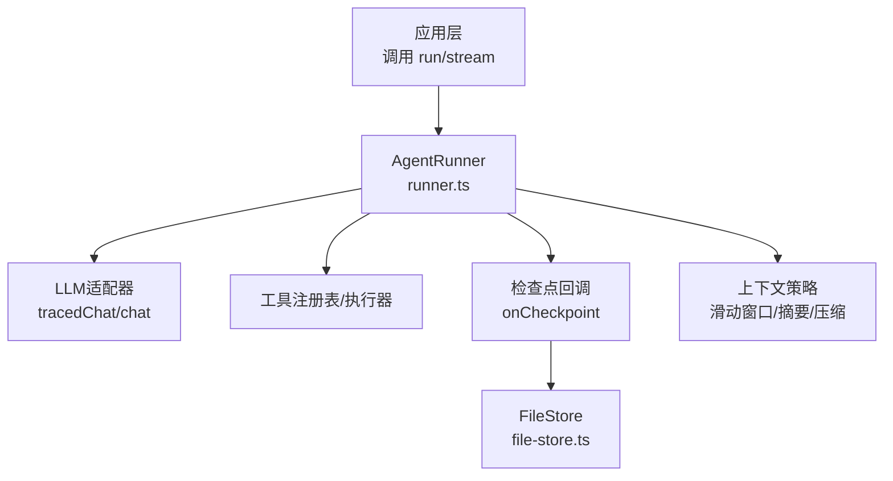
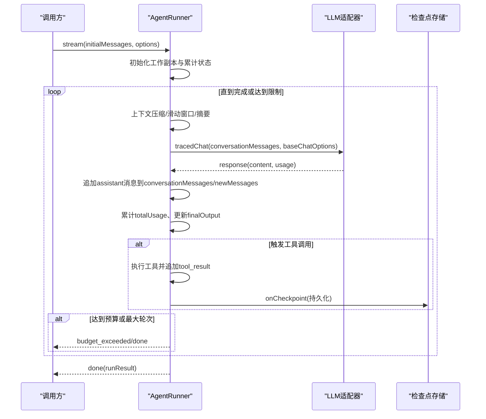
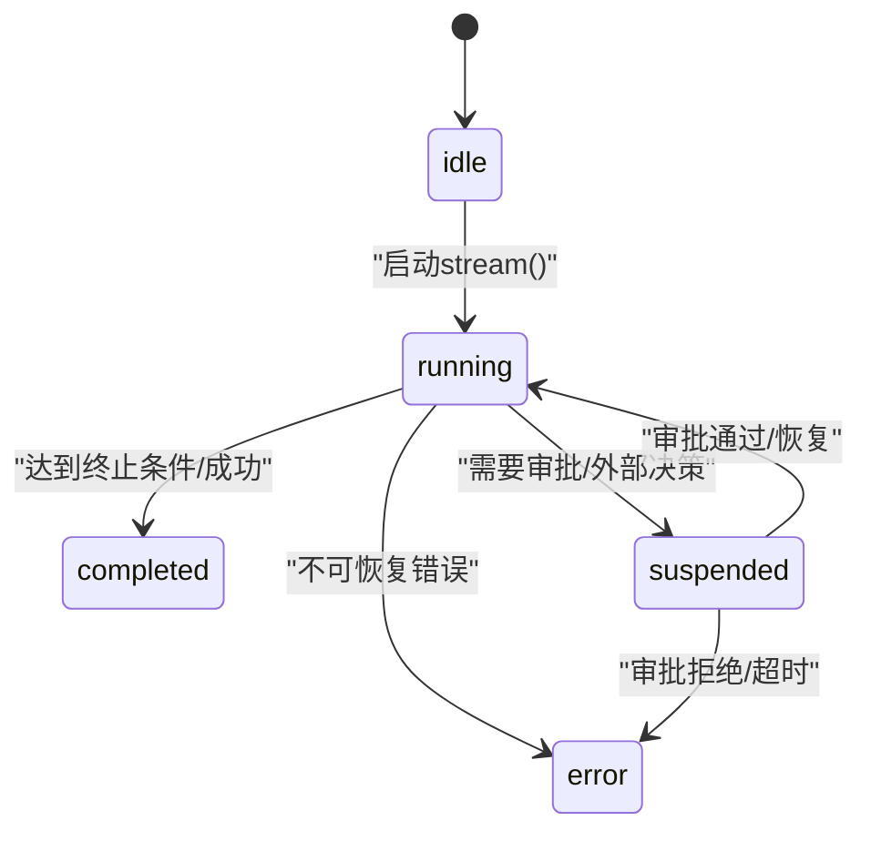
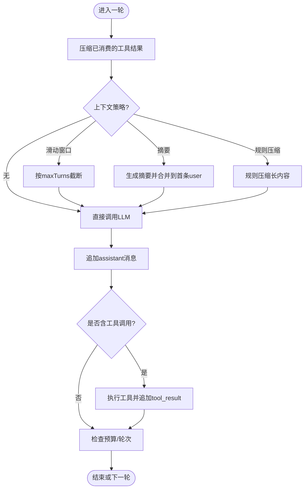
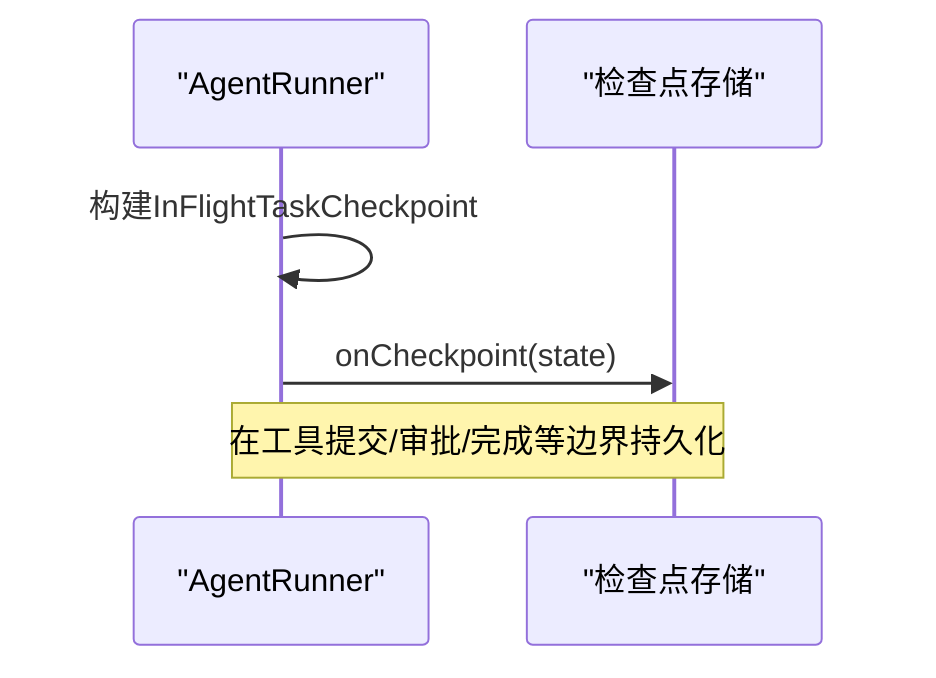
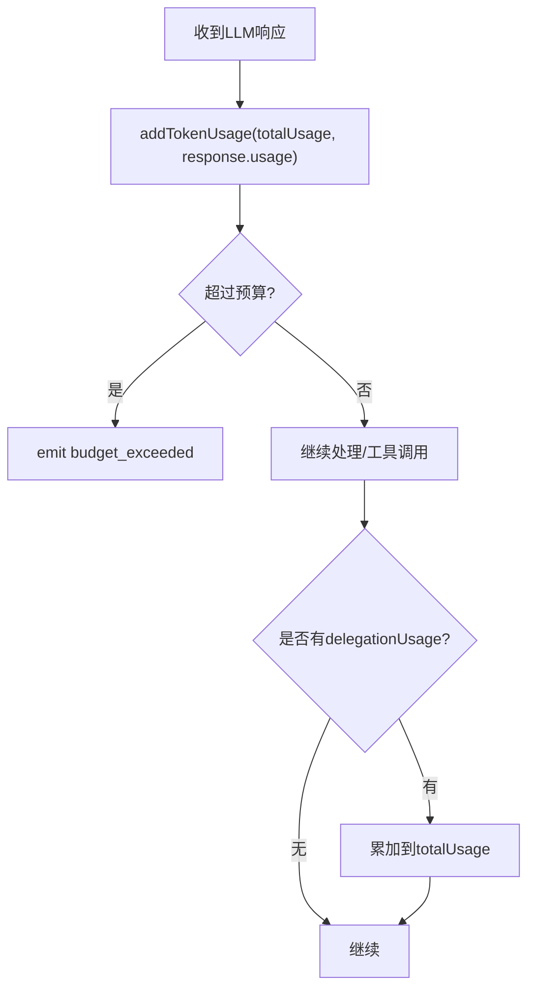
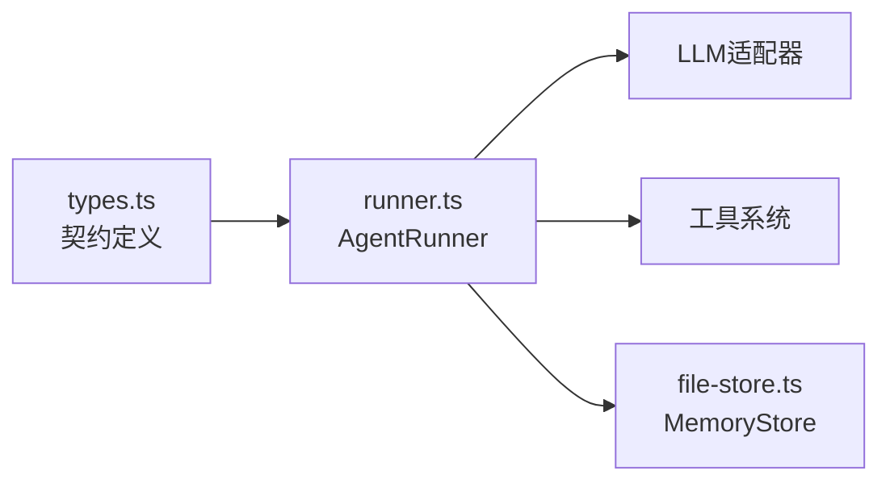

# 状态管理

<cite>
**本文引用的文件**
- [types.ts](file://packages/core/src/types.ts)
- [runner.ts](file://packages/core/src/agent/runner.ts)
- [file-store.ts](file://packages/core/src/memory/file-store.ts)
</cite>

## 目录
1. [简介](#简介)
2. [项目结构](#项目结构)
3. [核心组件](#核心组件)
4. [架构总览](#架构总览)
5. [详细组件分析](#详细组件分析)
6. [依赖关系分析](#依赖关系分析)
7. [性能考虑](#性能考虑)
8. [故障排查指南](#故障排查指南)
9. [结论](#结论)
10. [附录](#附录)

## 简介
本文件聚焦智能体（Agent）运行时的状态管理机制，围绕 AgentState 接口、状态转换规则、历史消息持久化策略、状态快照与监控、资源清理与重置、Token 使用量统计与累计、并发安全与同步，以及监控诊断最佳实践进行系统化说明。内容基于 core 包中的类型定义与执行器实现，确保与实际代码行为一致。

## 项目结构
- 类型与契约：集中在 types.ts，定义了 AgentState、StreamEvent、CheckpointSnapshot、MemoryStore 等关键类型。
- 执行器：runner.ts 实现了 AgentRunner，驱动对话轮次、工具调用、上下文压缩、循环检测、预算控制、检查点持久化与恢复。
- 持久化存储：file-store.ts 提供基于文件的 MemoryStore 实现，用于检查点与共享内存的原子写入与恢复。

图表来源
- [runner.ts:875-1074](file://packages/core/src/agent/runner.ts#L875-L1074)
- [runner.ts:1142-1204](file://packages/core/src/agent/runner.ts#L1142-L1204)
- [file-store.ts:1-54](file://packages/core/src/memory/file-store.ts#L1-L54)

章节来源
- [types.ts:1247-1253](file://packages/core/src/types.ts#L1247-L1253)
- [runner.ts:875-1074](file://packages/core/src/agent/runner.ts#L875-L1074)
- [file-store.ts:1-54](file://packages/core/src/memory/file-store.ts#L1-L54)

## 核心组件
- AgentState：描述一次运行的生命周期状态，包含 status、messages、tokenUsage、error。
- StreamEvent：流式事件，包括 text、reasoning、tool_use、tool_result、budget_exceeded、done、error。
- InFlightTaskCheckpoint：可恢复的检查点状态，包含 conversationMessages、messages、tokenUsage、turns、phase 等。
- MemoryStore：持久化存储抽象，支持 get/set/list/delete/clear，可选 compareAndSet 与 setWithExpiry。

章节来源
- [types.ts:1247-1253](file://packages/core/src/types.ts#L1247-L1253)
- [types.ts:484-504](file://packages/core/src/types.ts#L484-L504)
- [types.ts:2510-2530](file://packages/core/src/types.ts#L2510-L2530)
- [types.ts:2841-2872](file://packages/core/src/types.ts#L2841-L2872)

## 架构总览
AgentRunner 在 stream() 中维护多份“工作副本”：
- conversationMessages：完整对话上下文，参与每轮 LLM 调用。
- newMessages：仅记录本轮新增的消息，最终作为结果返回。
- totalUsage：累计 token 用量。
- allToolCalls：工具调用记录集合。
- finalOutput：最新助手文本输出。
- turns：已完成模型轮次数。
- phase：当前阶段 awaiting_model / executing_tools / completed。
- pendingToolCalls/pendingToolResultText：工具调用挂起与结果提示。
- loopDetected/budgetExceeded/aborted/suspended：运行标志位。

图表来源
- [runner.ts:875-1074](file://packages/core/src/agent/runner.ts#L875-L1074)
- [runner.ts:1142-1204](file://packages/core/src/agent/runner.ts#L1142-L1204)
- [runner.ts:1323-1358](file://packages/core/src/agent/runner.ts#L1323-L1358)

## 详细组件分析

### AgentState 字段含义与更新时机
- status：运行时状态机标识，取值 idle | running | completed | error。由上层编排与 runner 流程决定；在流式结束或错误时体现为 completed/error。
- messages：本轮新增消息列表，随每一轮 assistant/tool_result 追加而增长。
- tokenUsage：累计 token 用量，每次 LLM 响应后通过 addTokenUsage 累加。
- error：当运行失败时携带错误对象。

更新时机要点：
- 每轮 LLM 调用后，将 assistant 消息追加到 messages，并累加 usage。
- 工具结果以 user 角色追加到 messages，同时记录 tool_calls。
- 达到预算或最大轮次时，停止追加并产出 done 事件。

章节来源
- [types.ts:1247-1253](file://packages/core/src/types.ts#L1247-L1253)
- [runner.ts:1175-1204](file://packages/core/src/agent/runner.ts#L1175-L1204)
- [runner.ts:1323-1358](file://packages/core/src/agent/runner.ts#L1323-L1358)

### 状态转换（state transitions）规则与触发条件
- idle → running：进入 stream() 主循环开始处理首轮输入。
- running → completed：当达到终止条件（如 maxTurns、正常结束）且无异常时，产出 done 事件，status 标记为 completed。
- running → error：发生不可恢复错误时，产出 error 事件，status 标记为 error。
- running → suspended：当工具调用需要审批或外部决策时，进入挂起态，等待审批后再继续或中止。

图表来源
- [runner.ts:875-1074](file://packages/core/src/agent/runner.ts#L875-L1074)
- [runner.ts:1142-1204](file://packages/core/src/agent/runner.ts#L1142-L1204)
- [runner.ts:1323-1358](file://packages/core/src/agent/runner.ts#L1323-L1358)

章节来源
- [runner.ts:875-1074](file://packages/core/src/agent/runner.ts#L875-L1074)
- [runner.ts:1142-1204](file://packages/core/src/agent/runner.ts#L1142-L1204)
- [runner.ts:1323-1358](file://packages/core/src/agent/runner.ts#L1323-L1358)

### 历史消息（messageHistory）管理与策略
- 追加机制：每轮 assistant 回复与工具结果均以 LLMMessage 形式追加到 conversationMessages，同时新增消息追加到 newMessages。
- 复制与隔离：conversationMessages 与 newMessages 是独立的工作副本，避免污染初始种子消息；恢复时从 resumeState 拷贝历史。
- 清理与压缩：
  - 滑动窗口：按 maxTurns 截断旧消息，保留最近若干轮。
  - 摘要：对历史消息生成摘要前缀，合并到首个用户消息。
  - 规则压缩：对长工具结果与长助手文本进行压缩，保留 tool_use 与近期轮次。
- 顺序保证：先追加 tool_result，再判断是否因预算超限退出，以避免遗留未匹配的 tool_use 导致后续 API 报错。

图表来源
- [runner.ts:1142-1170](file://packages/core/src/agent/runner.ts#L1142-L1170)
- [runner.ts:1175-1204](file://packages/core/src/agent/runner.ts#L1175-L1204)
- [runner.ts:1566-1598](file://packages/core/src/agent/runner.ts#L1566-L1598)

章节来源
- [runner.ts:1142-1170](file://packages/core/src/agent/runner.ts#L1142-L1170)
- [runner.ts:1175-1204](file://packages/core/src/agent/runner.ts#L1175-L1204)
- [runner.ts:1566-1598](file://packages/core/src/agent/runner.ts#L1566-L1598)

### 状态快照（getState）的实现与用途
- 检查点快照：InFlightTaskCheckpoint 保存 conversationMessages、messages、tokenUsage、turns、phase、pendingToolCalls、finalOutput、loopDetected、budgetExceeded 等。
- 持久化时机：在工具执行前后、审批边界、完成阶段等安全边界调用 onCheckpoint 持久化。
- 用途：进程崩溃恢复、跨进程续跑、调试与审计、监控运行进度。

图表来源
- [runner.ts:916-946](file://packages/core/src/agent/runner.ts#L916-L946)
- [types.ts:2510-2530](file://packages/core/src/types.ts#L2510-L2530)

章节来源
- [runner.ts:916-946](file://packages/core/src/agent/runner.ts#L916-L946)
- [types.ts:2510-2530](file://packages/core/src/types.ts#L2510-L2530)

### reset() 方法与资源清理
- 设计说明：当前 runner 的 stream() 以函数式参数传递方式维护本地状态，没有全局单例式的 reset() 方法。资源清理主要通过以下方式实现：
  - 每轮结束后释放局部变量引用，交由垃圾回收。
  - 工具执行完成后，commit 记录被追加到 allToolCalls，不再持有临时引用。
  - 检查点回调 onCheckpoint 负责持久化，失败不影响主流程。
- 若需显式重置，可在调用方层面丢弃旧的 Runner 实例并创建新实例，或使用新的 initialMessages 与 resumeState 控制恢复。

章节来源
- [runner.ts:875-1074](file://packages/core/src/agent/runner.ts#L875-L1074)
- [runner.ts:1323-1358](file://packages/core/src/agent/runner.ts#L1323-L1358)

### Token 使用量的统计与累计逻辑
- 累计入口：每次 LLM 响应后，通过 addTokenUsage(totalUsage, response.usage) 累加 input_tokens 与 output_tokens。
- 上下文策略成本：摘要与自定义压缩可能产生额外 usage，同样累加到 totalUsage。
- 工具委托：工具执行可能产生 delegationUsage，也会被累加。
- 预算控制：当 totalUsage 超过 maxTokenBudget 时，触发 budget_exceeded 事件并停止后续调用。

图表来源
- [runner.ts:1075-1080](file://packages/core/src/agent/runner.ts#L1075-L1080)
- [runner.ts:1175-1204](file://packages/core/src/agent/runner.ts#L1175-L1204)

章节来源
- [runner.ts:1075-1080](file://packages/core/src/agent/runner.ts#L1075-L1080)
- [runner.ts:1175-1204](file://packages/core/src/agent/runner.ts#L1175-L1204)

### 状态同步与并发安全
- 单进程串行：stream() 在主循环内顺序推进，消息与状态的变更在同一线程内串行，避免竞态。
- 检查点原子性：FileStore 采用“写临时文件 + fsync + rename”的方式，确保读取要么看到完整旧状态，要么看到完整新状态。
- 审批边界：在需要外部审批的工具调用处，先持久化精确的 in-flight 状态，再发出 onApprovalRequest，确保恢复一致性。
- 并发范围：FileStore 文档明确为单进程并发安全；跨进程恢复是顺序进行的。

章节来源
- [runner.ts:916-946](file://packages/core/src/agent/runner.ts#L916-L946)
- [runner.ts:1020-1048](file://packages/core/src/agent/runner.ts#L1020-L1048)
- [file-store.ts:1-54](file://packages/core/src/memory/file-store.ts#L1-L54)

### 状态监控与诊断最佳实践
- 订阅流式事件：监听 text、reasoning、tool_use、tool_result、budget_exceeded、done、error，实时展示与诊断。
- 利用检查点：配置 onCheckpoint 与持久化存储，支持崩溃恢复与离线分析。
- 启用循环检测：配置 loopDetection 并在 onLoopDetected 中注入警告，防止重复调用或文本。
- 设置预算上限：配置 maxTokenBudget，及时捕获 budget_exceeded 事件并降级或终止。
- 观察上下文策略：根据场景选择滑动窗口、摘要或规则压缩，平衡上下文长度与质量。
- 审计工具调用：收集 tool_calls 与 duration，定位瓶颈与异常。

章节来源
- [types.ts:484-504](file://packages/core/src/types.ts#L484-L504)
- [runner.ts:916-946](file://packages/core/src/agent/runner.ts#L916-L946)
- [runner.ts:1142-1204](file://packages/core/src/agent/runner.ts#L1142-L1204)

## 依赖关系分析
- AgentRunner 依赖：
  - LLMAdapter：提供 chat/tracedChat 能力。
  - ToolRegistry/ToolExecutor：解析与执行工具。
  - MemoryStore：持久化检查点与共享内存。
- 类型契约：
  - AgentState、StreamEvent、CheckpointSnapshot、MemoryStore 等定义于 types.ts，约束 runner 与存储的行为。

图表来源
- [types.ts:1247-1253](file://packages/core/src/types.ts#L1247-L1253)
- [runner.ts:875-1074](file://packages/core/src/agent/runner.ts#L875-L1074)
- [file-store.ts:1-54](file://packages/core/src/memory/file-store.ts#L1-L54)

章节来源
- [types.ts:1247-1253](file://packages/core/src/types.ts#L1247-L1253)
- [runner.ts:875-1074](file://packages/core/src/agent/runner.ts#L875-L1074)
- [file-store.ts:1-54](file://packages/core/src/memory/file-store.ts#L1-L54)

## 性能考虑
- 上下文压缩优先：在每轮 LLM 调用前进行轻量级压缩（工具结果压缩、滑动窗口、规则压缩），减少 token 消耗与延迟。
- 摘要策略谨慎：摘要会引入额外 LLM 调用与 token 成本，仅在必要时启用。
- 工具结果压缩：开启 compressToolResults 可减少历史消息体积，提高吞吐。
- 预算控制：合理设置 maxTokenBudget，避免长时间高成本运行。
- 检查点频率：在安全边界（工具提交、审批、完成）持久化，兼顾可靠性与 I/O 开销。

## 故障排查指南
- 预算超限：关注 budget_exceeded 事件，检查 maxTokenBudget 与上下文策略。
- 循环检测：出现 loop_detected 事件时，调整 prompt 或工具参数，避免重复调用或文本。
- 工具审批失败：确认 onApprovalPrepare/onApprovalRequest/onApprovalConsumed 链路正确，检查持久化是否成功。
- 恢复不一致：确保 onCheckpoint 在严格模式下抛出错误，避免部分写入导致恢复异常。
- 存储异常：FileStore 的原子写入与 fsync 保障一致性；如遇磁盘空间不足或权限问题，参考错误码与重试策略。

章节来源
- [runner.ts:1142-1204](file://packages/core/src/agent/runner.ts#L1142-L1204)
- [runner.ts:916-946](file://packages/core/src/agent/runner.ts#L916-L946)
- [file-store.ts:1-54](file://packages/core/src/memory/file-store.ts#L1-L54)

## 结论
该状态管理机制通过清晰的类型契约与执行器实现，提供了可靠的状态追踪、消息历史管理、上下文压缩、预算控制与检查点恢复能力。结合流式事件与监控实践，可以在复杂的多智能体场景中实现可观测、可恢复、可控的运行过程。

## 附录
- 关键类型路径：
  - AgentState：[types.ts:1247-1253](file://packages/core/src/types.ts#L1247-L1253)
  - StreamEvent：[types.ts:484-504](file://packages/core/src/types.ts#L484-L504)
  - InFlightTaskCheckpoint：[types.ts:2510-2530](file://packages/core/src/types.ts#L2510-L2530)
  - MemoryStore：[types.ts:2841-2872](file://packages/core/src/types.ts#L2841-L2872)
- 关键实现路径：
  - 主循环与上下文策略：[runner.ts:1142-1170](file://packages/core/src/agent/runner.ts#L1142-L1170)
  - LLM调用与消息追加：[runner.ts:1175-1204](file://packages/core/src/agent/runner.ts#L1175-L1204)
  - 检查点持久化：[runner.ts:916-946](file://packages/core/src/agent/runner.ts#L916-L946)
  - 文件存储原子写入：[file-store.ts:1-54](file://packages/core/src/memory/file-store.ts#L1-L54)