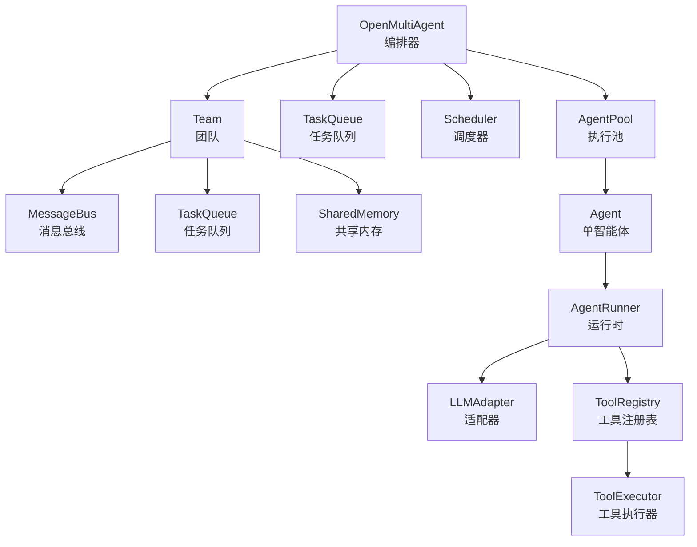
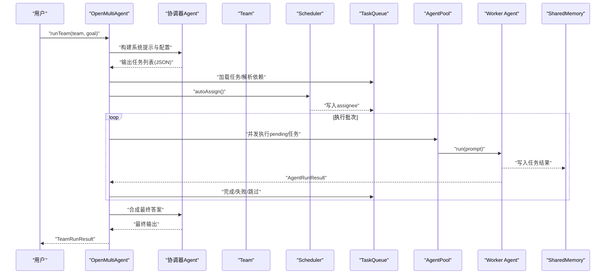
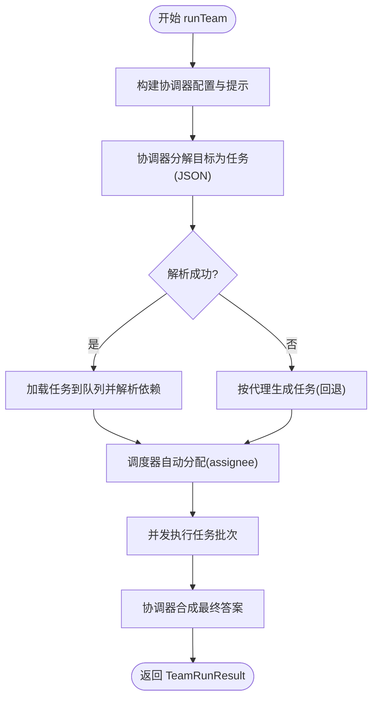
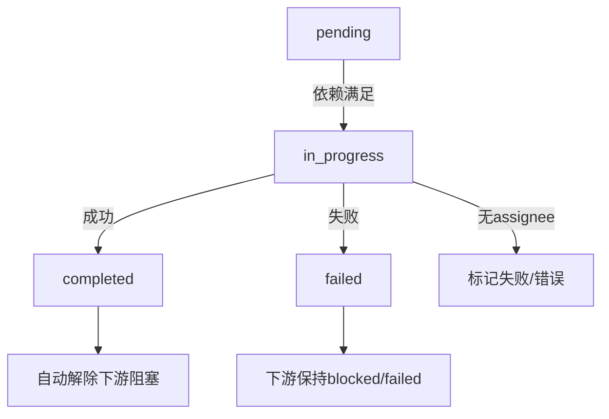
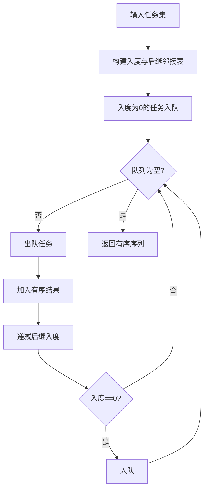
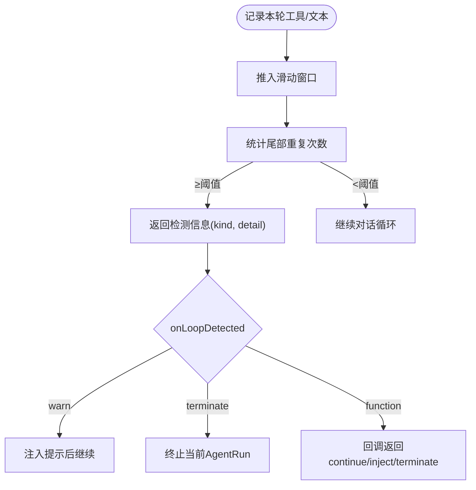
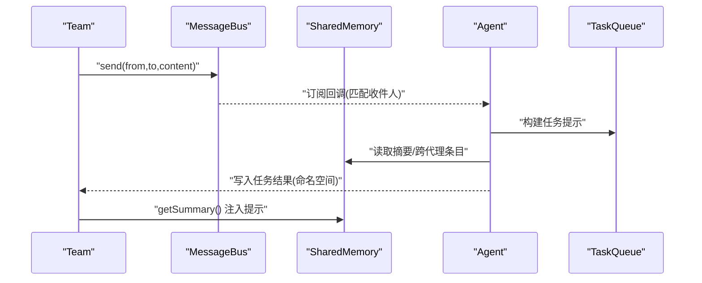
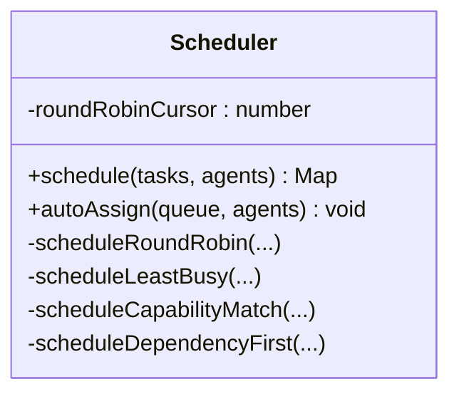
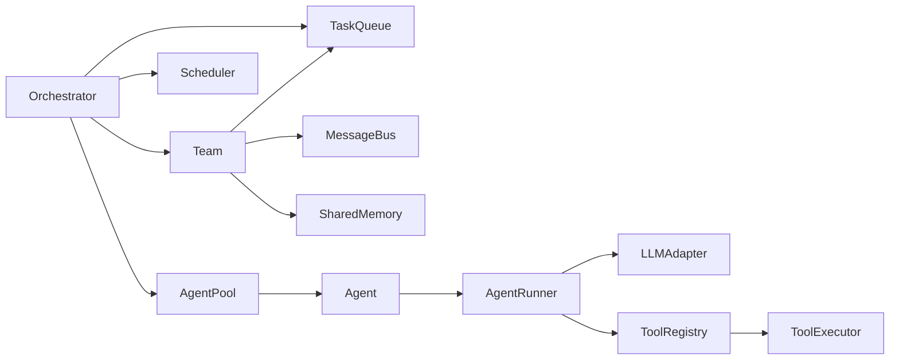

# 核心概念

<cite>
**本文引用的文件**
- [src/index.ts](file://src/index.ts)
- [src/types.ts](file://src/types.ts)
- [src/orchestrator/orchestrator.ts](file://src/orchestrator/orchestrator.ts)
- [src/orchestrator/scheduler.ts](file://src/orchestrator/scheduler.ts)
- [src/team/team.ts](file://src/team/team.ts)
- [src/team/messaging.ts](file://src/team/messaging.ts)
- [src/memory/shared.ts](file://src/memory/shared.ts)
- [src/task/task.ts](file://src/task/task.ts)
- [src/agent/agent.ts](file://src/agent/agent.ts)
- [src/agent/loop-detector.ts](file://src/agent/loop-detector.ts)
- [examples/02-team-collaboration.ts](file://examples/02-team-collaboration.ts)
- [examples/03-task-pipeline.ts](file://examples/03-task-pipeline.ts)
- [examples/11-trace-observability.ts](file://examples/11-trace-observability.ts)
- [README.md](file://README.md)
</cite>

## 目录
1. [简介](#简介)
2. [项目结构](#项目结构)
3. [核心组件](#核心组件)
4. [架构总览](#架构总览)
5. [详细组件分析](#详细组件分析)
6. [依赖关系分析](#依赖关系分析)
7. [性能考量](#性能考量)
8. [故障排查指南](#故障排查指南)
9. [结论](#结论)
10. [附录](#附录)

## 简介
本文件面向希望在 Open Multi-Agent 框架中构建多智能体协作系统的开发者，系统性阐述以下核心主题：
- 协调器代理的作用与工作流：如何从自然语言目标自动分解为任务图，并驱动执行。
- 任务分解与依赖管理：任务规范解析、依赖图构建、拓扑排序与环检测。
- 循环检测机制：工具调用与文本输出的滑动窗口重复检测，以及可配置的处置策略。
- 任务生命周期与并行执行：队列状态机、批处理调度、并发控制与失败传播。
- 团队协作模式：消息总线与共享内存的协同机制。
- 架构图表与实际代码示例路径，帮助快速上手与最佳实践落地。

## 项目结构
框架采用模块化分层设计：
- 入口与公共 API：通过统一导出入口暴露 Orchestrator、Agent、Team、Task、Memory、Tool 等能力。
- Orchestrator 层：编排器负责任务队列、调度器、执行池、事件与可观测性。
- Team 层：团队对象聚合代理清单、消息总线、任务队列与共享内存。
- Task 层：纯函数式任务工具（创建、就绪判断、依赖排序、环检测）。
- Agent 层：单智能体运行时封装（对话历史、流式输出、结构化输出、循环检测）。
- Memory 层：命名空间共享内存，支持摘要注入到上下文。
- 示例与文档：提供端到端协作、显式流水线与可观测性示例。

图表来源
- [src/index.ts:57-117](file://src/index.ts#L57-L117)
- [src/orchestrator/orchestrator.ts:44-66](file://src/orchestrator/orchestrator.ts#L44-L66)
- [src/team/team.ts:88-140](file://src/team/team.ts#L88-L140)
- [src/agent/agent.ts:81-114](file://src/agent/agent.ts#L81-L114)

章节来源
- [src/index.ts:57-117](file://src/index.ts#L57-L117)
- [README.md:137-178](file://README.md#L137-L178)

## 核心组件
- 编排器（OpenMultiAgent）
  - 提供 runTeam/runTasks/runAgent 等高层 API，内部组合 Team、TaskQueue、Scheduler、AgentPool、AgentRunner 等子系统。
  - 支持进度回调 onProgress、可观测性 onTrace、审批门 onApproval、重试策略等。
- 团队（Team）
  - 聚合代理清单、消息总线、任务队列与共享内存；提供事件总线桥接队列事件。
- 调度器（Scheduler）
  - 提供 round-robin、least-busy、capability-match、dependency-first 四种策略，支持自动分配未分配任务。
- 任务（Task）
  - 工具函数：创建任务、判断就绪、拓扑排序、依赖环检测。
- 智能体（Agent）
  - 封装运行、多轮对话、流式输出、结构化输出验证、循环检测、生命周期钩子。
- 循环检测（LoopDetector）
  - 基于滑动窗口的工具签名与文本重复检测，支持自定义处置策略。
- 共享内存（SharedMemory）
  - 命名空间键值存储，支持摘要生成注入到上下文。
- 消息总线（MessageBus）
  - 点对点与广播消息，保留历史、跟踪已读状态、订阅通知。

章节来源
- [src/orchestrator/orchestrator.ts:514-740](file://src/orchestrator/orchestrator.ts#L514-L740)
- [src/team/team.ts:88-335](file://src/team/team.ts#L88-L335)
- [src/orchestrator/scheduler.ts:127-353](file://src/orchestrator/scheduler.ts#L127-L353)
- [src/task/task.ts:29-240](file://src/task/task.ts#L29-L240)
- [src/agent/agent.ts:81-623](file://src/agent/agent.ts#L81-L623)
- [src/agent/loop-detector.ts:33-138](file://src/agent/loop-detector.ts#L33-L138)
- [src/memory/shared.ts:36-182](file://src/memory/shared.ts#L36-L182)
- [src/team/messaging.ts:68-233](file://src/team/messaging.ts#L68-L233)

## 架构总览
下图展示从目标到结果的端到端流程：协调器将自然语言目标分解为任务，构建依赖图，调度器分配任务，执行池并发执行，共享内存与消息总线贯穿协作，最终由协调器合成结果。

图表来源
- [src/orchestrator/orchestrator.ts:641-740](file://src/orchestrator/orchestrator.ts#L641-L740)
- [src/team/team.ts:109-140](file://src/team/team.ts#L109-L140)
- [src/orchestrator/scheduler.ts:187-198](file://src/orchestrator/scheduler.ts#L187-L198)

章节来源
- [src/orchestrator/orchestrator.ts:641-740](file://src/orchestrator/orchestrator.ts#L641-L740)

## 详细组件分析

### 协调器代理与任务分解
- 协调器职责
  - 使用临时“协调器”代理接收高层目标与团队代理清单，要求其以结构化 JSON 输出任务列表。
  - 解析 JSON 并映射标题到任务 ID，构建依赖图，随后进入执行阶段。
- 失败回退
  - 若协调器无法产出结构化输出，则按每个代理生成一个任务，直接进入执行。
- 合成最终结果
  - 在所有任务完成后，协调器读取共享内存与任务结果，合成最终回答。

图表来源
- [src/orchestrator/orchestrator.ts:641-740](file://src/orchestrator/orchestrator.ts#L641-L740)
- [src/orchestrator/orchestrator.ts:212-250](file://src/orchestrator/orchestrator.ts#L212-L250)

章节来源
- [src/orchestrator/orchestrator.ts:641-740](file://src/orchestrator/orchestrator.ts#L641-L740)
- [examples/02-team-collaboration.ts:120-128](file://examples/02-team-collaboration.ts#L120-L128)

### 任务生命周期与并行执行
- 队列状态机
  - 任务状态：pending → in_progress → completed / failed / skipped。
  - 依赖满足后变为 pending，调度器分配 assignee 后进入 in_progress。
- 批次执行
  - 每轮查找 pending 任务，批量并发执行；完成后自动解除下游阻塞。
  - 支持 onApproval 审批门：每轮结束后询问是否继续下一轮。
- 重试与追踪
  - 任务级重试策略（maxRetries、retryDelayMs、retryBackoff），指数退避上限保护。
  - onTrace 记录任务跨度、重试次数、令牌用量等。

图表来源
- [src/orchestrator/orchestrator.ts:280-464](file://src/orchestrator/orchestrator.ts#L280-L464)
- [src/task/task.ts:76-92](file://src/task/task.ts#L76-L92)

章节来源
- [src/orchestrator/orchestrator.ts:280-464](file://src/orchestrator/orchestrator.ts#L280-L464)
- [src/task/task.ts:76-92](file://src/task/task.ts#L76-L92)

### 依赖管理与拓扑排序
- 依赖就绪判断
  - 仅当任务 status 为 pending 且所有依赖均已完成时视为就绪。
- 拓扑排序
  - 使用 Kahn 算法按依赖顺序返回任务序列，便于顺序执行或可视化。
- 环检测
  - 使用 DFS 白灰黑三色法检测环，返回错误集合以便提前发现并报错。

图表来源
- [src/task/task.ts:115-160](file://src/task/task.ts#L115-L160)
- [src/task/task.ts:208-239](file://src/task/task.ts#L208-L239)

章节来源
- [src/task/task.ts:115-160](file://src/task/task.ts#L115-L160)
- [src/task/task.ts:208-239](file://src/task/task.ts#L208-L239)

### 循环检测机制
- 检测维度
  - 工具调用签名（名称+参数规范化 JSON）与文本输出（去空白归一化）。
- 滑动窗口
  - 维护固定大小窗口，统计尾部连续重复次数，达到阈值即触发。
- 处置策略
  - 默认“警告一次后终止”，也可选择“终止”或自定义回调（允许注入提示后继续）。

图表来源
- [src/agent/loop-detector.ts:33-138](file://src/agent/loop-detector.ts#L33-L138)
- [src/types.ts:247-276](file://src/types.ts#L247-L276)

章节来源
- [src/agent/loop-detector.ts:33-138](file://src/agent/loop-detector.ts#L33-L138)
- [src/types.ts:247-276](file://src/types.ts#L247-L276)

### 团队协作：消息传递与共享内存
- 消息总线
  - 点对点 send 与广播 broadcast，保留历史、跟踪已读、订阅回调同步触发。
  - 任务提示构建时注入来自消息总线的消息，使代理可见队友指令。
- 共享内存
  - 写入采用命名空间键（agent/key），读取支持全键与按代理列举。
  - 自动生成摘要，注入到任务提示，使代理了解队友工作进展。

图表来源
- [src/team/messaging.ts:68-233](file://src/team/messaging.ts#L68-L233)
- [src/memory/shared.ts:36-182](file://src/memory/shared.ts#L36-L182)
- [src/orchestrator/orchestrator.ts:474-502](file://src/orchestrator/orchestrator.ts#L474-L502)

章节来源
- [src/team/messaging.ts:68-233](file://src/team/messaging.ts#L68-L233)
- [src/memory/shared.ts:36-182](file://src/memory/shared.ts#L36-L182)
- [src/orchestrator/orchestrator.ts:474-502](file://src/orchestrator/orchestrator.ts#L474-L502)

### 调度策略与并行优化
- round-robin：按索引均匀分配，适合均衡负载。
- least-busy：统计 in_progress 数量，优先空闲代理。
- capability-match：基于关键词重叠评分，提升任务与代理能力匹配度。
- dependency-first：计算被阻塞下游数量，优先关键路径任务，再轮转分配。

图表来源
- [src/orchestrator/scheduler.ts:127-353](file://src/orchestrator/scheduler.ts#L127-L353)

章节来源
- [src/orchestrator/scheduler.ts:127-353](file://src/orchestrator/scheduler.ts#L127-L353)

### 结构化输出与生命周期钩子
- 结构化输出
  - 在 AgentConfig 中设置 outputSchema，Agent 自动提取 JSON、验证并通过一次重试修正。
- 生命周期钩子
  - beforeRun：修改提示或中止。
  - afterRun：后处理结果或中止。
- 令牌用量与追踪
  - Agent 运行期间累计 tokenUsage，onTrace 输出 agent、task、llm_call、tool_call 等跨度。

章节来源
- [src/agent/agent.ts:332-477](file://src/agent/agent.ts#L332-L477)
- [src/types.ts:185-241](file://src/types.ts#L185-L241)
- [examples/11-trace-observability.ts:45-74](file://examples/11-trace-observability.ts#L45-L74)

## 依赖关系分析
- 模块耦合
  - Orchestrator 依赖 Team、TaskQueue、Scheduler、AgentPool、Agent、ToolRegistry/Executor。
  - Team 聚合 MessageBus、TaskQueue、SharedMemory。
  - Agent 依赖 AgentRunner、LLMAdapter、ToolRegistry/Executor。
- 关键依赖链
  - runTeam → 协调器分解 → TaskQueue → Scheduler → AgentPool → Agent → LLMAdapter/ToolExecutor。
- 可能的循环
  - 通过纯函数工具与不可变数据结构降低循环风险；依赖图在 TaskQueue 之外由外部传入，避免自引用。

图表来源
- [src/orchestrator/orchestrator.ts:44-66](file://src/orchestrator/orchestrator.ts#L44-L66)
- [src/team/team.ts:88-140](file://src/team/team.ts#L88-L140)
- [src/agent/agent.ts:81-114](file://src/agent/agent.ts#L81-L114)

章节来源
- [src/orchestrator/orchestrator.ts:44-66](file://src/orchestrator/orchestrator.ts#L44-L66)
- [src/team/team.ts:88-140](file://src/team/team.ts#L88-L140)
- [src/agent/agent.ts:81-114](file://src/agent/agent.ts#L81-L114)

## 性能考量
- 并发控制
  - 通过 maxConcurrency 控制整体并发，避免 LLM/工具调用资源争用。
- 任务批处理
  - 每轮并发执行 pending 任务，减少调度开销；完成后统一推进依赖。
- 重试退避
  - 指数退避上限保护，避免雪崩效应。
- 上下文注入
  - 共享内存摘要与消息总线内容需控制长度，避免超出模型上下文窗口。
- 本地模型优化
  - 使用 timeoutMs 防止长时间阻塞；必要时启用结构化输出以减少无效重试。

## 故障排查指南
- 协调器无法解析任务
  - 检查协调器输出格式（JSON 块或数组），确保字段完整；若失败则回退为逐代理任务。
- 任务无法启动
  - 检查依赖是否全部完成；确认调度器已写入 assignee；查看 onProgress 错误事件。
- 代理陷入循环
  - 开启 loopDetection，观察 warn/terminate 行为；必要时自定义回调注入提示后继续。
- 令牌用量异常
  - 使用 onTrace 观察 llm_call 与 tool_call 的 tokens；确认重试累积。
- 共享内存/消息总线问题
  - 确认命名空间键格式；检查摘要生成与注入位置；核对订阅回调是否正确触发。

章节来源
- [src/orchestrator/orchestrator.ts:280-464](file://src/orchestrator/orchestrator.ts#L280-L464)
- [src/agent/loop-detector.ts:33-138](file://src/agent/loop-detector.ts#L33-L138)
- [examples/11-trace-observability.ts:45-74](file://examples/11-trace-observability.ts#L45-L74)

## 结论
Open Multi-Agent 框架通过“协调器 + 任务队列 + 调度器 + 执行池”的组合，实现了从自然语言目标到可执行任务图再到最终结果的自动化编排。其特性包括：
- 强大的任务分解与依赖管理；
- 可配置的循环检测与失败处理；
- 丰富的协作机制（消息总线、共享内存）；
- 可观测性与结构化输出；
- 易扩展的 LLM 与工具体系。

这些能力共同构成一个可扩展、可维护、可调试的多智能体协作平台。

## 附录
- 实际代码示例路径
  - 团队协作示例：[examples/02-team-collaboration.ts:1-168](file://examples/02-team-collaboration.ts#L1-L168)
  - 显式任务流水线示例：[examples/03-task-pipeline.ts:1-202](file://examples/03-task-pipeline.ts#L1-L202)
  - 可观测性示例：[examples/11-trace-observability.ts:1-134](file://examples/11-trace-observability.ts#L1-L134)
- 类型与接口参考
  - 核心类型定义：[src/types.ts:1-543](file://src/types.ts#L1-L543)
- 架构概览图
  - 参见 README 的架构图部分：[README.md:137-178](file://README.md#L137-L178)