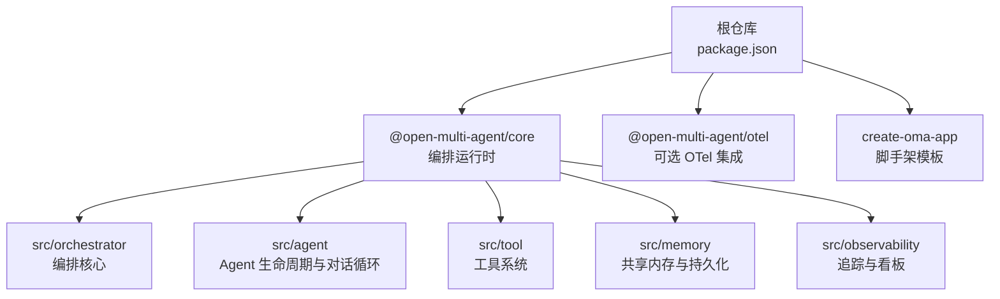
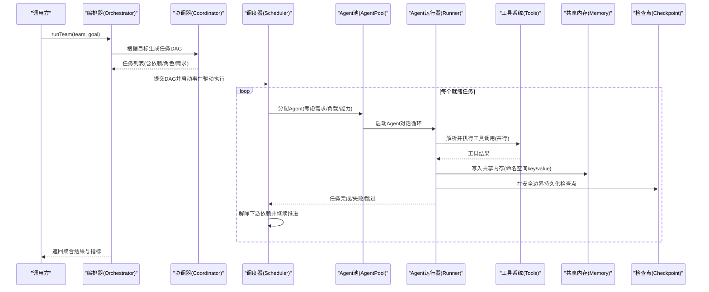
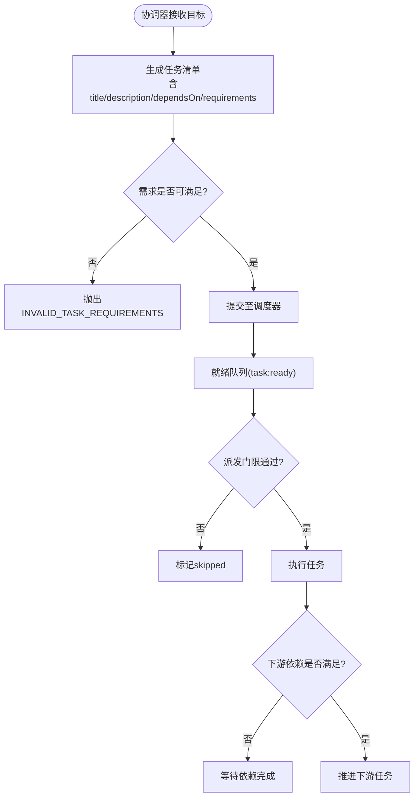
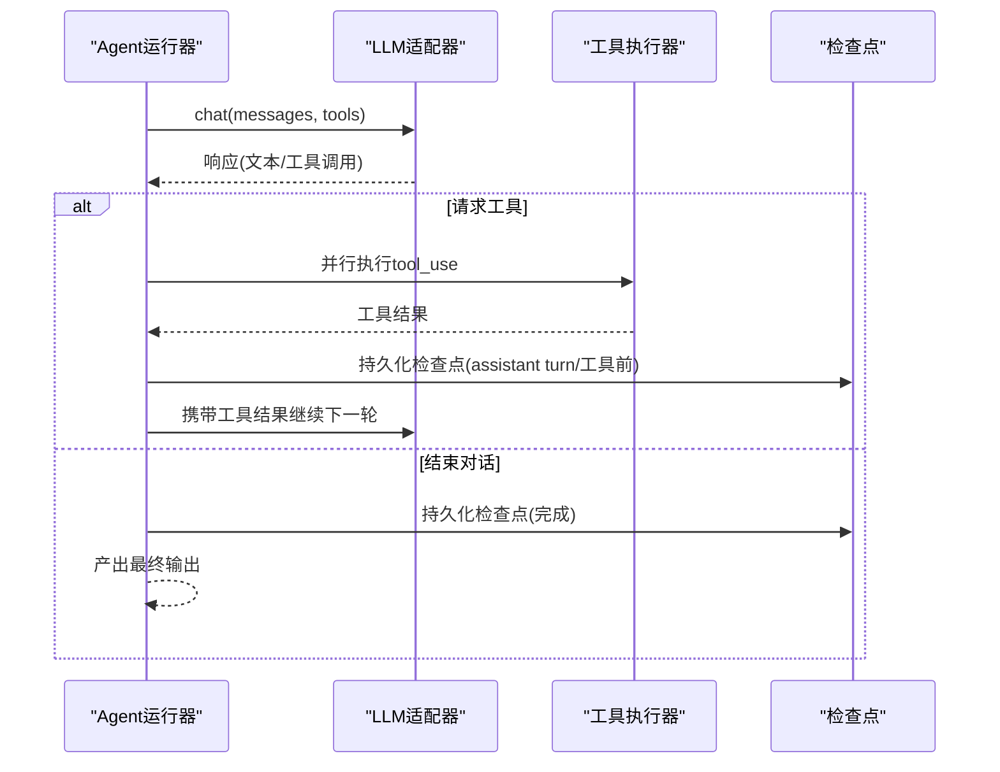
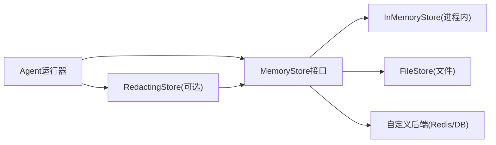
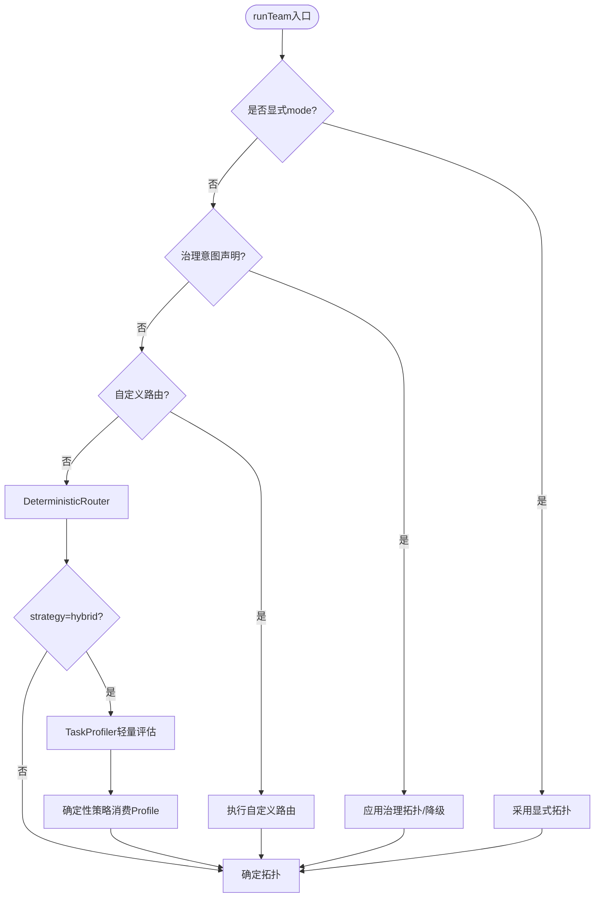
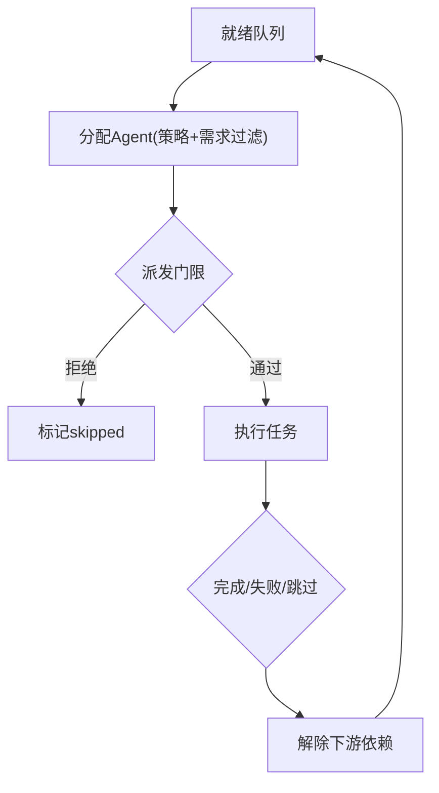
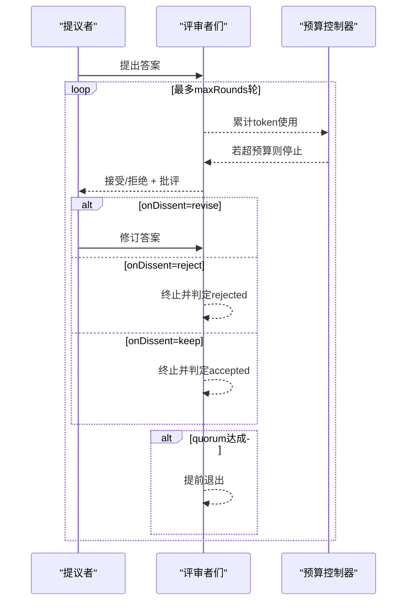
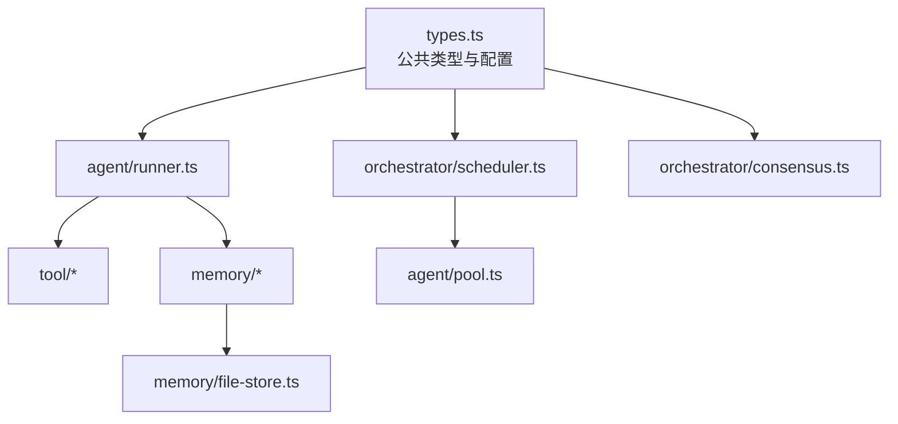

# 核心概念

<cite>
**本文引用的文件**
- [README.md](file://README.md)
- [README_zh.md](file://README_zh.md)
- [package.json](file://package.json)
- [types.ts](file://packages/core/src/types.ts)
- [runner.ts](file://packages/core/src/agent/runner.ts)
- [consensus.md](file://docs/consensus.md)
- [execution-routing.md](file://docs/execution-routing.md)
- [task-scheduling.md](file://docs/task-scheduling.md)
- [shared-memory.md](file://docs/shared-memory.md)
- [file-store.ts](file://packages/core/src/memory/file-store.ts)
</cite>

## 目录
1. [简介](#简介)
2. [项目结构](#项目结构)
3. [核心组件](#核心组件)
4. [架构总览](#架构总览)
5. [详细组件分析](#详细组件分析)
6. [依赖关系分析](#依赖关系分析)
7. [性能考量](#性能考量)
8. [故障排查指南](#故障排查指南)
9. [结论](#结论)
10. [附录](#附录)

## 简介
Open Multi-Agent（OMA）是一个面向 TypeScript 后端的“动态工作流”多智能体编排框架。其核心理念是“只描述目标，不画任务图”：在运行时由协调器将目标分解为任务有向无环图（DAG），由确定性调度器分派给团队执行，整个运行过程以可审计、可审批、可回放的数据形式存在。它提供工具系统、共享内存、检查点与恢复、观测与评测、模型路由与执行路由、共识验证等生产级能力。

**章节来源**
- [README.md:46-108](file://README.md#L46-L108)
- [README_zh.md:46-107](file://README_zh.md#L46-L107)

## 项目结构
仓库采用 monorepo 组织，核心编排运行时位于 packages/core，可选企业集成在 packages/otel，脚手架在 packages/create-oma-app。根 package.json 通过 workspaces 管理构建与测试脚本，要求 Node.js >= 20。

**图表来源**
- [package.json:1-34](file://package.json#L1-L34)

**章节来源**
- [package.json:1-34](file://package.json#L1-L34)

## 核心组件
- 协调器（Coordinator）：从目标生成任务 DAG、分配角色、合成最终结果；支持治理意图、计划审批与重放。
- 调度器（Scheduler）：事件驱动的执行引擎，维护就绪集合与进行中的任务映射，按依赖满足即时推进下游任务。
- Agent 运行器（Runner）：实现标准 agentic 对话循环，处理 LLM 调用、工具提取与并行执行、token 预算与循环检测、检查点持久化。
- 工具系统（Tool System）：默认拒绝策略、按 Agent 授予工具、沙箱工作目录、输出长度限制、可插拔后端。
- 共享内存（Shared Memory）：命名空间键值存储，支持进程内内存或文件/外部后端，写入时脱敏。
- 执行路由（Execution Routing）：决定 single/team 拓扑，内置确定性策略与可选混合语义路由。
- 模型路由（Model Routing）：为不同任务/角色选择模型与 Provider。
- 共识机制（Consensus）：提议者→评审者的多轮验证，支持拒绝/修订/保留策略与预算约束。
- 检查点与恢复（Checkpoint & Resume）：在安全边界持久化状态，支持中断恢复与仅追加修复。

**章节来源**
- [types.ts:2132-2236](file://packages/core/src/types.ts#L2132-L2236)
- [task-scheduling.md:1-26](file://docs/task-scheduling.md#L1-L26)
- [runner.ts:1-47](file://packages/core/src/agent/runner.ts#L1-L47)
- [shared-memory.md:1-47](file://docs/shared-memory.md#L1-L47)
- [execution-routing.md:1-222](file://docs/execution-routing.md#L1-L222)
- [consensus.md:1-64](file://docs/consensus.md#L1-L64)

## 架构总览
下图展示了从用户目标到任务 DAG 的生成、调度执行、工具调用、共享内存与检查点的整体数据流。

**图表来源**
- [task-scheduling.md:1-26](file://docs/task-scheduling.md#L1-L26)
- [runner.ts:902-1326](file://packages/core/src/agent/runner.ts#L902-L1326)
- [shared-memory.md:1-47](file://docs/shared-memory.md#L1-L47)
- [file-store.ts:23-54](file://packages/core/src/memory/file-store.ts#L23-L54)

## 详细组件分析

### 协调器与任务依赖图（DAG）
- 协调器职责：将自然语言目标转化为结构化任务清单，包含标题、描述、依赖、角色、工具/能力/Provider 需求、优先级等；支持治理意图（required/preferred/none）与计划审批边界。
- 任务依赖图：以 dependsOn 表达严格顺序，失败/跳过会立即级联到下游；事件驱动执行保证下游在依赖满足时即刻开始，无需等待同批其他任务。
- 依赖载荷：默认注入原始输出；可通过 dependencyPayload 选择结构化校验后的 JSON 或同时注入原始与结构化片段，缺失或不可序列化将触发机器可读验证错误。

**图表来源**
- [task-scheduling.md:1-26](file://docs/task-scheduling.md#L1-L26)
- [task-scheduling.md:27-65](file://docs/task-scheduling.md#L27-L65)

**章节来源**
- [types.ts:2132-2236](file://packages/core/src/types.ts#L2132-L2236)
- [task-scheduling.md:27-65](file://docs/task-scheduling.md#L27-L65)

### 协调器的角色与职责
- 拓扑选择：受 governanceIntent 影响，必要时绕过自动分解，直接按必需角色与顺序执行。
- 计划审批：在 plan_ready 边界暴露任务数量与详情，支持 onPlanReady 审批与固化重放。
- 模型路由：结合 OrchestratorConfig 的 modelRouting 规则，为不同任务/角色选择模型与 Provider。
- 治理与安全：严格 assignee 校验、工具默认拒绝、逐次调用 gate、隐私控制。

**章节来源**
- [types.ts:1758-1840](file://packages/core/src/types.ts#L1758-L1840)
- [types.ts:2132-2236](file://packages/core/src/types.ts#L2132-L2236)

### Agent 生命周期管理与对话循环
- 生命周期：idle → running → completed/error；记录消息、token 使用、工具调用、循环检测与预算超限标志。
- 对话循环：外层 while(true)，直到 end_turn 或达到最大轮数；每轮解析 tool_use 块，并行执行工具，回写结果并继续循环。
- 检查点：在 assistant turn 结束与工具执行前持久化，支持中断恢复与幂等重放未提交工具调用。
- 超时与预算：callTimeoutMs 与 maxTokenBudget 保障单次调用与整轮边界；超出则终止并上报。

**图表来源**
- [runner.ts:1-47](file://packages/core/src/agent/runner.ts#L1-L47)
- [runner.ts:902-1326](file://packages/core/src/agent/runner.ts#L902-L1326)

**章节来源**
- [types.ts:1247-1280](file://packages/core/src/types.ts#L1247-L1280)
- [runner.ts:902-1326](file://packages/core/src/agent/runner.ts#L902-L1326)

### 工具系统（Tool System）设计模式
- 默认拒绝：未显式授予的工具无法执行，防止误用与提示注入风险。
- 授予与过滤：resolveTools() 返回 LLM 可见的工具定义集合，实际执行基于 grantedToolNames 白名单。
- 沙箱与限制：cwd 指定工作目录，路径必须绝对且不能逃逸；maxToolOutputChars 限制输出长度；abortSignal 支持取消。
- 可观测性：每次工具调用记录名称、输入、输出、耗时，便于审计与回放。

**章节来源**
- [runner.ts:902-912](file://packages/core/src/agent/runner.ts#L902-L912)
- [types.ts:544-570](file://packages/core/src/types.ts#L544-L570)
- [types.ts:1092-1117](file://packages/core/src/types.ts#L1092-L1117)

### 共享内存与持久化
- 命名空间键值：键形如 agentName/key，便于隔离各 Agent 的发现与上下文。
- 存储后端：默认进程内；也可使用 FileStore 实现磁盘持久化，或通过自定义 MemoryStore 接入 Redis/Postgres 等。
- 写入脱敏：可使用 RedactingStore 包装，对凭证与敏感信息进行写入时脱敏，避免落盘泄露。

**图表来源**
- [shared-memory.md:1-47](file://docs/shared-memory.md#L1-L47)
- [file-store.ts:23-54](file://packages/core/src/memory/file-store.ts#L23-L54)

**章节来源**
- [shared-memory.md:1-47](file://docs/shared-memory.md#L1-L47)
- [file-store.ts:23-54](file://packages/core/src/memory/file-store.ts#L23-L54)

### 执行路由策略
- 决策层级：显式 mode > 治理拓扑/降级策略 > 自定义 ExecutionRouter > 内置 DeterministicRouter > 混合语义路由（hybrid）。
- 混合语义路由：仅在确定性路由选择 Single 时，进行一次无工具的轻量模型调用，依据 TaskProfile 决定是否升级为 Team；不会改变已确定的 Team 选择。
- 失败策略：默认 fallback 保持稳健；fail 模式会在路由失败时终止并上报错误码。

**图表来源**
- [execution-routing.md:1-222](file://docs/execution-routing.md#L1-L222)

**章节来源**
- [execution-routing.md:1-222](file://docs/execution-routing.md#L1-L222)

### 调度算法与任务派发
- 事件驱动：维护 ready set 与 in-flight map；任务完成后立即唤醒并解除下游依赖。
- 分配策略：round-robin、least-busy、capability-match、dependency-first、composite；所有策略先硬过滤任务需求再排序/轮换。
- 派发门限：在任务派发前检查取消、预算、审批与 AgentPool 容量；拒绝则停止新派发，进行中任务允许收尾，剩余任务标记 skipped。
- 中断与恢复：abort、预算耗尽、审批拒绝统一走“排空后跳过”路径；检查点在安全边界持久化，恢复时跳过已完成任务并重放已提交工具结果。

**图表来源**
- [task-scheduling.md:1-26](file://docs/task-scheduling.md#L1-L26)
- [task-scheduling.md:98-133](file://docs/task-scheduling.md#L98-L133)
- [task-scheduling.md:135-184](file://docs/task-scheduling.md#L135-L184)

**章节来源**
- [task-scheduling.md:1-26](file://docs/task-scheduling.md#L1-L26)
- [task-scheduling.md:98-133](file://docs/task-scheduling.md#L98-L133)
- [task-scheduling.md:135-184](file://docs/task-scheduling.md#L135-L184)

### 共识机制（Consensus）
- 流程：提议者给出答案，评审者按 refuter/lens 模式逐轮反驳/审视，达到法定人数即提前退出。
- 选项：quorum、maxRounds、onDissent（revise/reject/keep）、judgePrompt、verdictSchema。
- 预算：所有评审与修订的 token 计入父级预算，达到上限即停止后续评审。
- 可观测：每轮评审 verdict 作为 consensus trace 事件，分歧 critique 写入共享内存。

**图表来源**
- [consensus.md:1-64](file://docs/consensus.md#L1-L64)

**章节来源**
- [consensus.md:1-64](file://docs/consensus.md#L1-L64)

## 依赖关系分析
- 类型与配置集中在 types.ts，作为公共契约被 orchestrator、agent、scheduler、tool 等模块引用，确保解耦与无环依赖。
- runner.ts 依赖 types 中定义的 LLM 消息、工具定义、检查点与追踪事件，并通过 AgentPool 与 ToolExecutor 协作。
- scheduler 与 task-execution 依赖 OrchestratorConfig 中的调度策略、并发度、预算与恢复策略。
- memory/file-store.ts 实现 MemoryStore 接口，供 shared memory 与 checkpoint 使用。

**图表来源**
- [types.ts:2132-2236](file://packages/core/src/types.ts#L2132-L2236)
- [runner.ts:1-47](file://packages/core/src/agent/runner.ts#L1-L47)
- [file-store.ts:23-54](file://packages/core/src/memory/file-store.ts#L23-L54)

**章节来源**
- [types.ts:2132-2236](file://packages/core/src/types.ts#L2132-L2236)
- [runner.ts:1-47](file://packages/core/src/agent/runner.ts#L1-L47)
- [file-store.ts:23-54](file://packages/core/src/memory/file-store.ts#L23-L54)

## 性能考量
- 并发与负载：通过 maxConcurrency 与 least-busy/composite 策略平衡长尾任务；事件驱动减少批次等待开销。
- 工具输出与上下文：限制工具输出长度，避免上下文膨胀；结构化依赖载荷可减少冗余文本。
- 路由与模型选择：确定性路由零额外调用；混合路由仅在必要时进行一次轻量评估，降低开销。
- 预算控制：token/cost 双预算在关键节点检查，避免无限扩展。
- 检查点粒度：在安全边界持久化，避免频繁 IO；恢复时重放已提交工具调用，提升鲁棒性。

[本节为通用指导，不直接分析具体文件]

## 故障排查指南
- 路由失败：查看 routingDecision 的 status/routerVersion/fallbackCode，确认是否触发了 fallback 或 fail 策略。
- 任务需求不匹配：当 no eligible agent 或 assignee 不满足 requirements 时，会抛出 INVALID_TASK_REQUIREMENTS 并附带 issue code。
- 工具未执行：确认工具已授予且名称在白名单；本地模型需确认支持 tool calling。
- 预算超限：检查 maxTokenBudget/estimateCost/maxCostBudget，关注 budget_exceeded 事件。
- 中断恢复：确认 checkpoint store 可用；恢复后会跳过已完成任务并重放未提交工具调用。

**章节来源**
- [execution-routing.md:120-154](file://docs/execution-routing.md#L120-L154)
- [task-scheduling.md:98-133](file://docs/task-scheduling.md#L98-L133)
- [runner.ts:1294-1304](file://packages/core/src/agent/runner.ts#L1294-L1304)
- [task-scheduling.md:166-184](file://docs/task-scheduling.md#L166-L184)

## 结论
OMA 通过“目标→DAG→调度→执行→观测”的闭环，将多智能体协作从手工图维护转向动态编排与受控执行。协调器负责规划与治理，调度器保证高效推进，Agent 运行器封装对话与工具交互，共享内存与检查点提供跨任务记忆与可靠性，执行/模型路由与共识机制提供灵活性与质量保障。配合观测与评测，OMA 可将原型快速推进到生产环境。

[本节为总结性内容，不直接分析具体文件]

## 附录
- 快速开始示例：参考 README 中的最小可运行示例，展示 createTeam/runTeam 的基本用法与结果读取。
- 文档导航：安装与运行、模型与工具配置、稳定运行、控制编排等主题见 README 文档索引。

**章节来源**
- [README.md:48-97](file://README.md#L48-L97)
- [README_zh.md:48-96](file://README_zh.md#L48-L96)