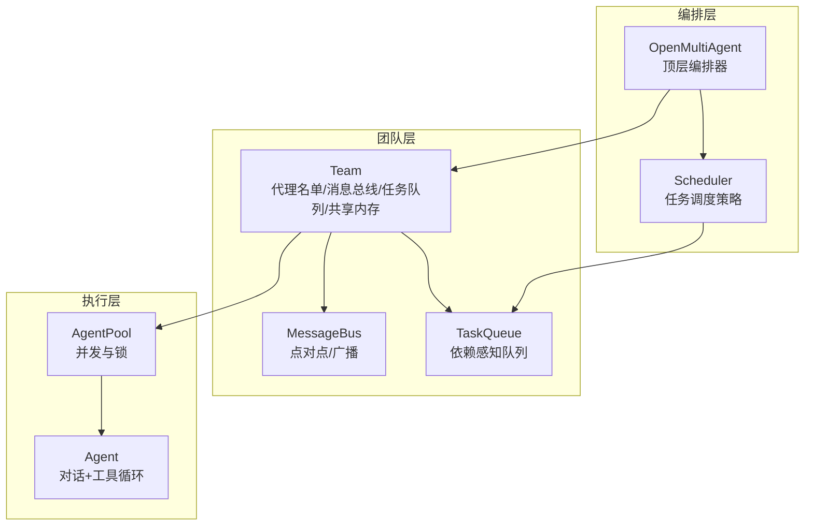
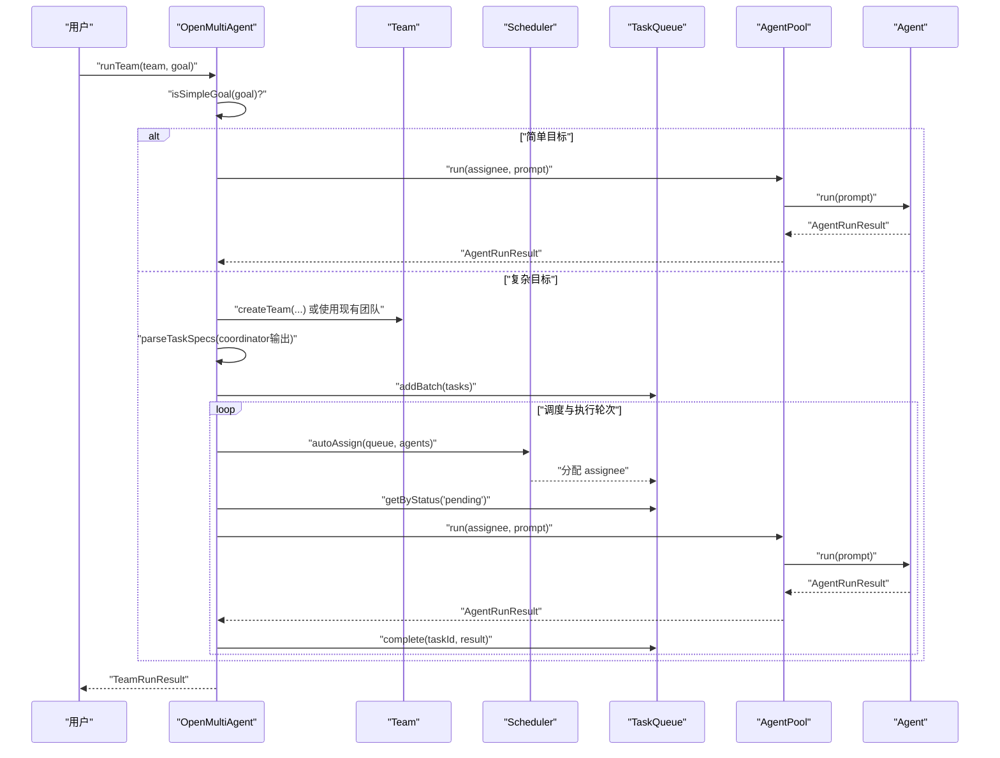
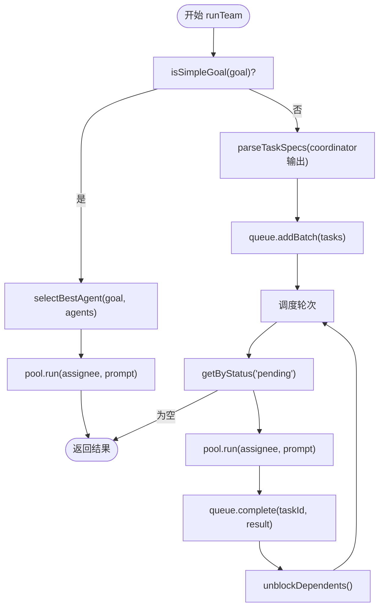
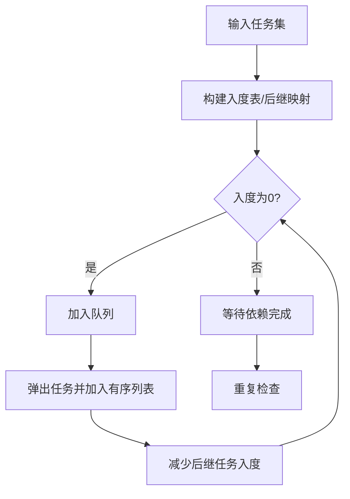
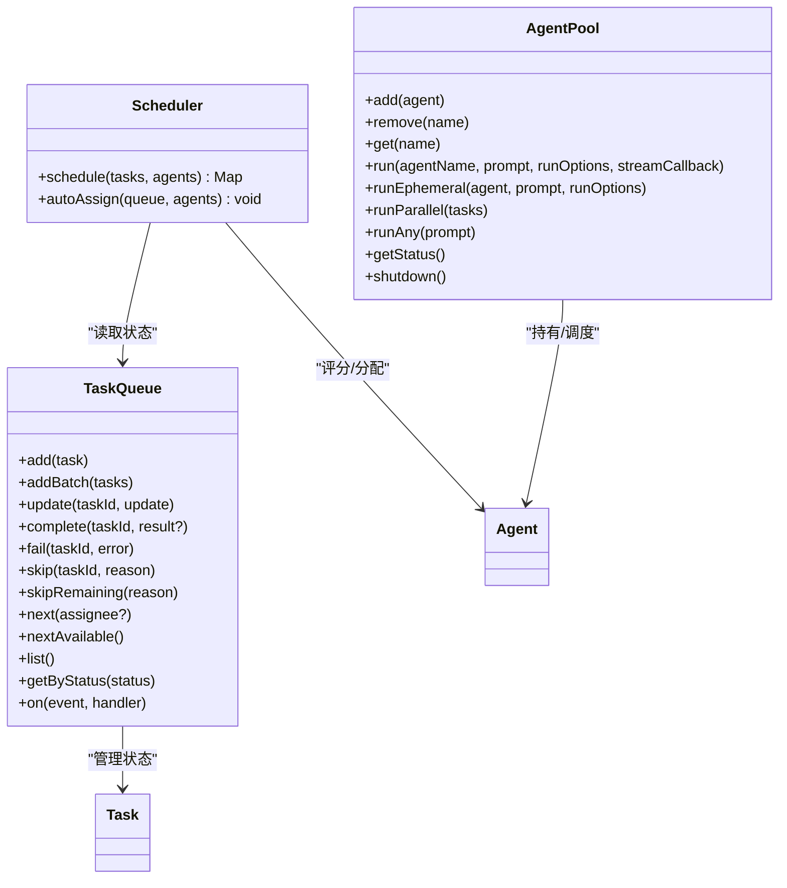
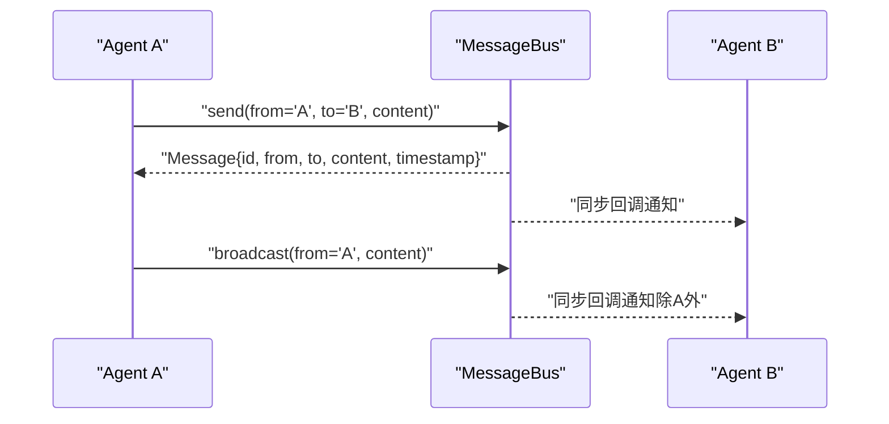
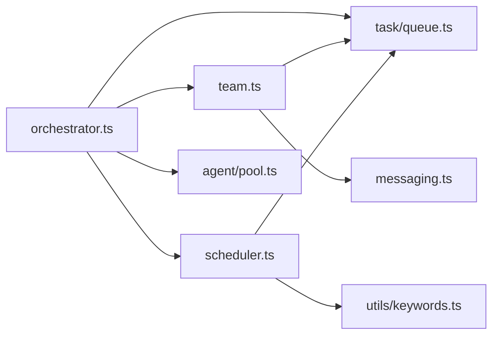

# 核心概念

<cite>
**本文引用的文件**
- [src/index.ts](file://src/index.ts)
- [src/orchestrator/orchestrator.ts](file://src/orchestrator/orchestrator.ts)
- [src/orchestrator/scheduler.ts](file://src/orchestrator/scheduler.ts)
- [src/team/team.ts](file://src/team/team.ts)
- [src/team/messaging.ts](file://src/team/messaging.ts)
- [src/task/task.ts](file://src/task/task.ts)
- [src/task/queue.ts](file://src/task/queue.ts)
- [src/agent/pool.ts](file://src/agent/pool.ts)
- [src/utils/keywords.ts](file://src/utils/keywords.ts)
- [examples/basics/team-collaboration.ts](file://examples/basics/team-collaboration.ts)
- [examples/cookbook/incident-postmortem-dag.ts](file://examples/cookbook/incident-postmortem-dag.ts)
- [examples/basics/multi-model-team.ts](file://examples/basics/multi-model-team.ts)
</cite>

## 目录
1. [引言](#引言)
2. [项目结构](#项目结构)
3. [核心组件](#核心组件)
4. [架构总览](#架构总览)
5. [详细组件分析](#详细组件分析)
6. [依赖关系分析](#依赖关系分析)
7. [性能考量](#性能考量)
8. [故障排查指南](#故障排查指南)
9. [结论](#结论)
10. [附录](#附录)

## 引言
本文件面向初学者与有经验的开发者，系统性阐述 Open Multi-Agent 框架的核心概念与实现原理，重点覆盖：
- 协调器模式（Coordinator Pattern）：如何将高层目标自动分解为可执行任务，并进行分配与合成。
- 任务 DAG（有向无环图）的自动生成与拓扑排序：从自然语言目标到可并行执行的任务集合。
- 智能体池化、任务队列与调度机制：并发控制、负载均衡与容错重试。
- 团队协作模式下的消息传递与状态同步：点对点与广播通信、共享内存。
- 架构图表与流程图：帮助理解组件关系与数据流。
- 具体示例路径：通过仓库中的示例文件定位实际用法。

## 项目结构
框架采用模块化分层设计，主要模块包括：
- Orchestrator（编排器）：顶层入口，负责任务分解、调度、执行与结果合成。
- Team（团队）：管理代理名单、消息总线、任务队列与共享内存。
- Task（任务）：任务工厂、就绪判断、拓扑排序与依赖校验。
- Agent（智能体）：对话与工具调用循环；AgentPool 提供并发与锁控制。
- Scheduler（调度器）：轮转、最少忙碌、能力匹配、关键路径优先等策略。
- Messaging（消息总线）：点对点与广播通信，保留历史以便审计。
- 示例（examples）：展示团队协作、DAG 并行、多模型与自定义工具等场景。

**图表来源**
- [src/orchestrator/orchestrator.ts:1-120](file://src/orchestrator/orchestrator.ts#L1-L120)
- [src/team/team.ts:88-151](file://src/team/team.ts#L88-L151)
- [src/task/queue.ts:55-120](file://src/task/queue.ts#L55-L120)
- [src/agent/pool.ts:58-120](file://src/agent/pool.ts#L58-L120)

**章节来源**
- [src/index.ts:57-124](file://src/index.ts#L57-L124)

## 核心组件
- 编排器（OpenMultiAgent）
  - 负责将高层目标分解为任务、选择最佳代理、构建提示、执行任务队列、处理预算与重试、收集结果。
  - 支持“简单目标短路”与“复杂目标分解”的双路径。
- 调度器（Scheduler）
  - 提供轮转、最少忙碌、能力匹配、关键路径优先四种策略，支持自动分配与手动调度。
- 团队（Team）
  - 组织代理、维护消息总线、任务队列与共享内存；桥接队列事件到团队事件总线。
- 任务（Task/TaskQueue）
  - 工厂创建任务、就绪判断、拓扑排序、依赖校验；队列驱动状态流转与级联失败/跳过。
- 智能体池（AgentPool）
  - 基于信号量的全局并发限制，基于每代理锁的串行化，避免竞态；支持临时运行以避免死锁。
- 消息总线（MessageBus）
  - 点对点与广播消息，保留历史、跟踪已读未读、订阅回调同步触发。
- 关键工具（关键词评分）
  - 用于能力匹配与代理选择的关键词提取与评分。

**章节来源**
- [src/orchestrator/orchestrator.ts:147-194](file://src/orchestrator/orchestrator.ts#L147-L194)
- [src/orchestrator/scheduler.ts:96-167](file://src/orchestrator/scheduler.ts#L96-L167)
- [src/team/team.ts:88-151](file://src/team/team.ts#L88-L151)
- [src/task/task.ts:29-94](file://src/task/task.ts#L29-L94)
- [src/task/queue.ts:55-120](file://src/task/queue.ts#L55-L120)
- [src/agent/pool.ts:58-120](file://src/agent/pool.ts#L58-L120)
- [src/utils/keywords.ts:18-39](file://src/utils/keywords.ts#L18-L39)

## 架构总览
下图展示从高层目标到任务执行与结果合成的关键流程，以及组件间的交互关系。

**图表来源**
- [src/orchestrator/orchestrator.ts:561-803](file://src/orchestrator/orchestrator.ts#L561-L803)
- [src/team/team.ts:218-242](file://src/team/team.ts#L218-L242)
- [src/task/queue.ts:131-158](file://src/task/queue.ts#L131-L158)
- [src/agent/pool.ts:147-191](file://src/agent/pool.ts#L147-L191)

## 详细组件分析

### 协调器模式（Coordinator Pattern）
- 目标短路判定：当目标长度较短且不包含复杂语言信号时，直接选择最佳代理执行，避免不必要的分解。
- 复杂目标分解：通过解析协调器输出的任务规范数组，生成任务集合；任务包含标题、描述、可选指派者、依赖、重试参数等。
- 执行队列：按轮次并行执行“待定”任务，完成后自动解除下游阻塞；支持预算超限、重试与流式进度回调。
- 代理委托：在执行过程中，任务可委托给其他代理，使用临时 Agent 实例与池信号量，避免相互委托导致的死锁。

**图表来源**
- [src/orchestrator/orchestrator.ts:147-194](file://src/orchestrator/orchestrator.ts#L147-L194)
- [src/orchestrator/orchestrator.ts:561-803](file://src/orchestrator/orchestrator.ts#L561-L803)
- [src/task/queue.ts:131-158](file://src/task/queue.ts#L131-L158)

**章节来源**
- [src/orchestrator/orchestrator.ts:147-194](file://src/orchestrator/orchestrator.ts#L147-L194)
- [src/orchestrator/orchestrator.ts:561-803](file://src/orchestrator/orchestrator.ts#L561-L803)

### 任务 DAG 的自动生成与拓扑排序
- 任务工厂：创建任务时生成唯一 ID、初始状态为“待定”，并记录创建/更新时间。
- 就绪判断：仅当所有依赖均已完成时，任务才视为“可运行”。
- 拓扑排序：使用 Kahn 算法对任务进行拓扑排序，确保依赖在前、被依赖在后。
- 依赖校验：检测未知依赖、自依赖与环依赖，保证图的合法性。

**图表来源**
- [src/task/task.ts:117-162](file://src/task/task.ts#L117-L162)
- [src/task/task.ts:186-241](file://src/task/task.ts#L186-L241)

**章节来源**
- [src/task/task.ts:29-94](file://src/task/task.ts#L29-L94)
- [src/task/task.ts:117-162](file://src/task/task.ts#L117-L162)
- [src/task/task.ts:186-241](file://src/task/task.ts#L186-L241)

### 智能体池化、任务队列与调度机制
- 池化并发控制：全局信号量限制最大并发；每代理锁保证同一实例的串行化，避免状态竞态。
- 任务队列：根据依赖状态在“待定/阻塞/进行中/完成/失败/跳过”之间流转；支持级联失败与跳过。
- 调度策略：
  - 轮转：按注册顺序均匀分配。
  - 最少忙碌：统计当前进行中任务数，优先分配给最空闲代理。
  - 能力匹配：基于关键词重叠评分，选择与任务最契合的代理。
  - 关键路径优先：统计每个任务被多少下游依赖阻塞，优先分配阻塞人数最多的任务。

**图表来源**
- [src/agent/pool.ts:58-120](file://src/agent/pool.ts#L58-L120)
- [src/task/queue.ts:55-120](file://src/task/queue.ts#L55-L120)
- [src/orchestrator/scheduler.ts:96-167](file://src/orchestrator/scheduler.ts#L96-L167)

**章节来源**
- [src/agent/pool.ts:58-120](file://src/agent/pool.ts#L58-L120)
- [src/task/queue.ts:55-120](file://src/task/queue.ts#L55-L120)
- [src/orchestrator/scheduler.ts:96-167](file://src/orchestrator/scheduler.ts#L96-L167)

### 团队协作模式下的消息传递与状态同步
- 点对点与广播：发送消息后立即持久化并同步通知订阅者；广播消息会投递给除发送者外的所有订阅者。
- 读取状态：按代理维度维护已读集合，支持查询未读消息、全部消息与特定对话历史。
- 事件桥接：任务队列事件被桥接到团队事件总线，便于外部监听与反应。

**图表来源**
- [src/team/messaging.ts:68-115](file://src/team/messaging.ts#L68-L115)
- [src/team/messaging.ts:185-200](file://src/team/messaging.ts#L185-L200)

**章节来源**
- [src/team/messaging.ts:68-115](file://src/team/messaging.ts#L68-L115)
- [src/team/messaging.ts:185-200](file://src/team/messaging.ts#L185-L200)
- [src/team/team.ts:120-151](file://src/team/team.ts#L120-L151)

### 关键术语与示例路径
- 协调器模式：通过临时协调者将高层目标分解为任务，再由调度器与池化执行。
- 任务 DAG：由依赖关系构成的有向无环图，拓扑排序决定执行顺序。
- 智能体池化：统一管理多个 Agent 实例，控制并发与串行化。
- 消息总线：团队内点对点与广播通信通道。
- 示例参考：
  - 团队协作：[examples/basics/team-collaboration.ts:103-128](file://examples/basics/team-collaboration.ts#L103-L128)
  - DAG 并行：[examples/cookbook/incident-postmortem-dag.ts:380-381](file://examples/cookbook/incident-postmortem-dag.ts#L380-L381)
  - 多模型与自定义工具：[examples/basics/multi-model-team.ts:187-218](file://examples/basics/multi-model-team.ts#L187-L218)

**章节来源**
- [examples/basics/team-collaboration.ts:103-128](file://examples/basics/team-collaboration.ts#L103-L128)
- [examples/cookbook/incident-postmortem-dag.ts:380-381](file://examples/cookbook/incident-postmortem-dag.ts#L380-L381)
- [examples/basics/multi-model-team.ts:187-218](file://examples/basics/multi-model-team.ts#L187-L218)

## 依赖关系分析
- 模块内聚与耦合
  - Orchestrator 与 Team 高内聚：编排器直接依赖团队的代理、消息与任务队列。
  - TaskQueue 与 Scheduler 解耦：调度器只读任务状态，不持有可变状态。
  - AgentPool 与 Agent 解耦：池化仅负责并发与锁，不关心具体对话逻辑。
- 外部依赖
  - LLM 适配器与工具系统通过注册表注入，避免硬编码耦合。
  - 关键词评分工具在调度与代理选择处复用，保持一致性。

**图表来源**
- [src/orchestrator/orchestrator.ts:61-70](file://src/orchestrator/orchestrator.ts#L61-L70)
- [src/team/team.ts:18-22](file://src/team/team.ts#L18-L22)
- [src/orchestrator/scheduler.ts:16-18](file://src/orchestrator/scheduler.ts#L16-L18)
- [src/utils/keywords.ts:1-5](file://src/utils/keywords.ts#L1-L5)

**章节来源**
- [src/orchestrator/orchestrator.ts:61-70](file://src/orchestrator/orchestrator.ts#L61-L70)
- [src/team/team.ts:18-22](file://src/team/team.ts#L18-L22)
- [src/orchestrator/scheduler.ts:16-18](file://src/orchestrator/scheduler.ts#L16-L18)
- [src/utils/keywords.ts:1-5](file://src/utils/keywords.ts#L1-L5)

## 性能考量
- 并发与锁
  - 全局信号量限制整体并发，避免资源耗尽；每代理锁防止同一实例的并发写入。
  - 临时运行（runEphemeral）避免相互委托导致的死锁风险。
- 任务批处理与轮次
  - 每轮并行派发“待定”任务，等待全部完成后再进入下一轮，降低上下文切换成本。
- 依赖计算优化
  - isTaskReady 与 getTaskDependencyOrder 使用预构建映射，避免 O(n^2) 复杂度。
- 重试与预算
  - 可配置指数退避与最大延迟，累计 token 使用用于预算告警与节流。

[本节为通用指导，无需特定文件来源]

## 故障排查指南
- 任务失败与级联
  - 队列 fail 会级联标记下游依赖为失败；确认上游任务是否成功完成。
- 任务跳过
  - 队列 skip 会级联标记下游依赖为跳过；通常用于审批拒绝或预算超限。
- 代理不可用
  - 运行时找不到代理或无可用槽位会返回错误；检查池容量与代理注册状态。
- 依赖缺失
  - 未知依赖 ID 或自依赖会导致任务无法就绪；使用 validateTaskDependencies 检测。
- 代理委托死锁
  - 相互委托可能造成死锁；使用 runEphemeral 与临时 Agent 实例规避。

**章节来源**
- [src/task/queue.ts:150-203](file://src/task/queue.ts#L150-L203)
- [src/agent/pool.ts:193-217](file://src/agent/pool.ts#L193-L217)

## 结论
Open Multi-Agent 框架通过协调器模式将高层目标转化为可并行执行的任务 DAG，结合智能体池化与调度策略，实现了高吞吐、低耦合、可观测的多智能体协作。消息总线与共享内存进一步增强了团队内的状态同步与知识沉淀。示例展示了从简单到复杂的多种应用场景，便于快速上手与深度定制。

[本节为总结，无需特定文件来源]

## 附录
- 示例参考路径
  - 团队协作：[examples/basics/team-collaboration.ts:103-128](file://examples/basics/team-collaboration.ts#L103-L128)
  - DAG 并行：[examples/cookbook/incident-postmortem-dag.ts:380-381](file://examples/cookbook/incident-postmortem-dag.ts#L380-L381)
  - 多模型与自定义工具：[examples/basics/multi-model-team.ts:187-218](file://examples/basics/multi-model-team.ts#L187-L218)

[本节为补充信息，无需特定文件来源]