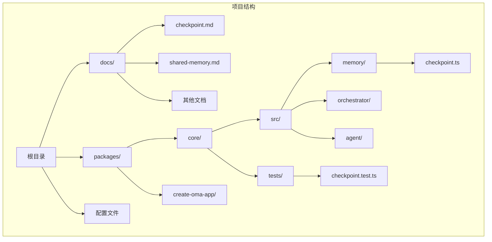
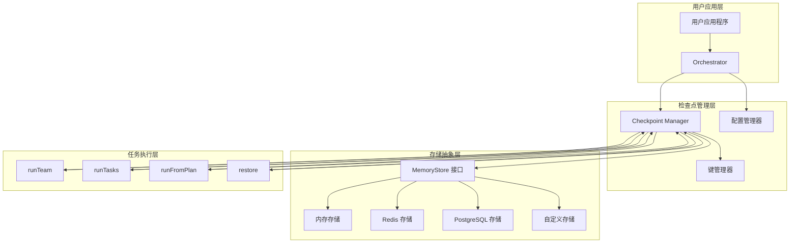
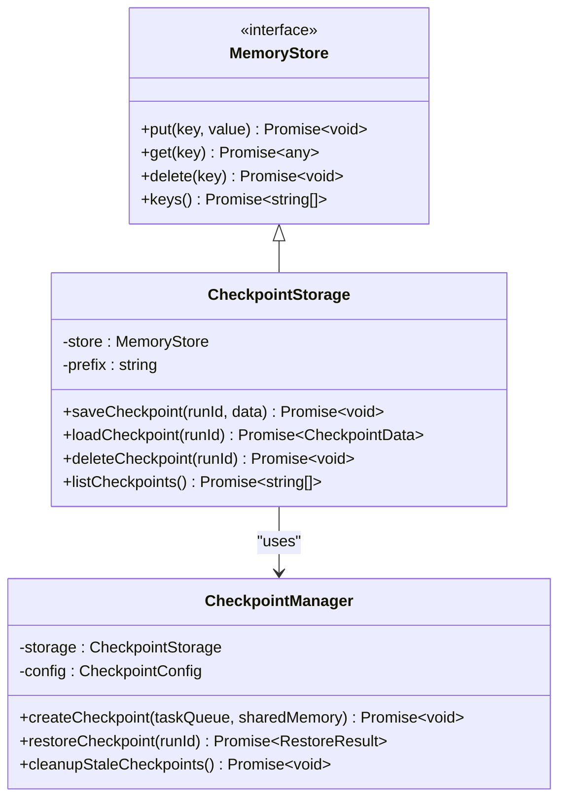
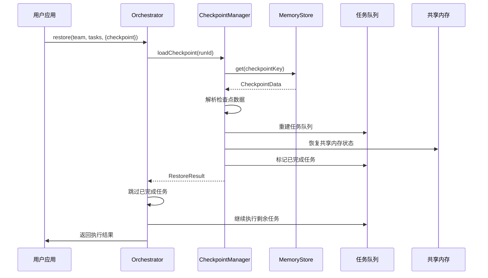
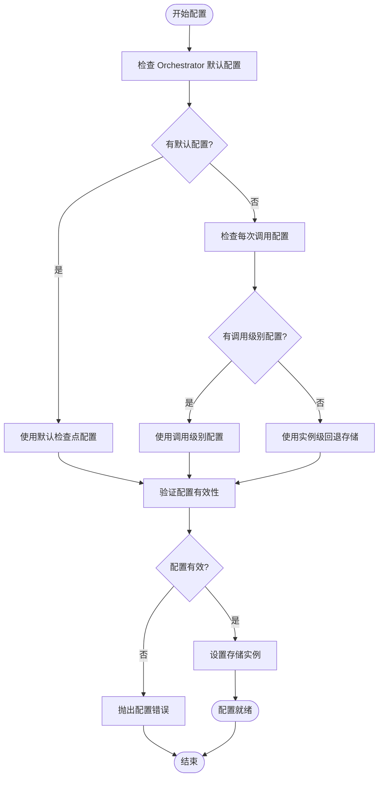
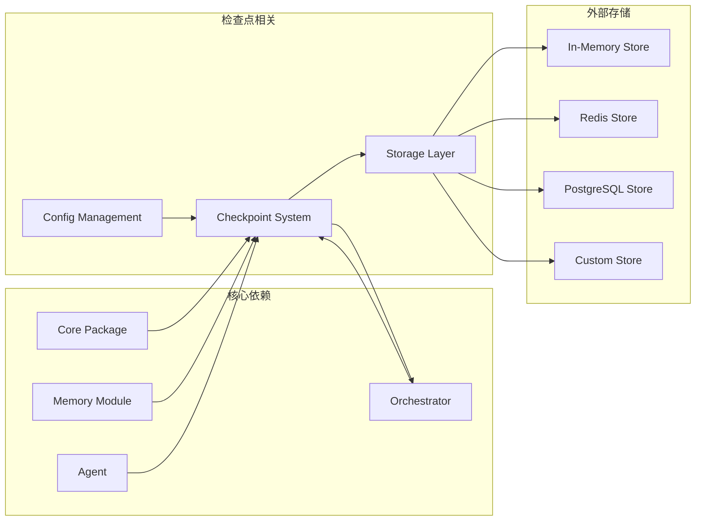

# 检查点与恢复系统

<cite>
**本文档引用的文件**
- [docs/checkpoint.md](file://docs/checkpoint.md)
- [packages/core/src/memory/checkpoint.ts](file://packages/core/src/memory/checkpoint.ts)
- [packages/core/tests/checkpoint.test.ts](file://packages/core/tests/checkpoint.test.ts)
- [README.md](file://README.md)
- [README_zh.md](file://README_zh.md)
- [CLAUDE.md](file://CLAUDE.md)
</cite>

## 目录
1. [简介](#简介)
2. [项目结构](#项目结构)
3. [核心组件](#核心组件)
4. [架构概览](#架构概览)
5. [详细组件分析](#详细组件分析)
6. [依赖关系分析](#依赖关系分析)
7. [性能考虑](#性能考虑)
8. [故障排除指南](#故障排除指南)
9. [结论](#结论)

## 简介

检查点与恢复系统是 Open Multi-Agent (OMA) 框架中的关键特性，它允许长期运行的任务工作流在崩溃、中止或进程重启后能够持久化进度并从中断处继续执行。该系统采用完全可选的设计，通过现有的 MemoryStore 接口运行，因此使用共享内存、Redis、PostgreSQL 或自定义后端存储的相同存储层也可以用于检查点持久化。

该系统覆盖编排路径（runTeam、runTasks、runFromPlan 和 restore），单次 runAgent 调用没有可恢复的内容且不会进行检查点记录。检查点功能通过 OrchestratorConfig.checkpoint 进行配置，默认情况下每个运行都可选择性地启用。

## 项目结构

OMA 项目采用模块化架构，检查点系统主要位于核心包中：

**图表来源**
- [packages/core/src/memory/checkpoint.ts](file://packages/core/src/memory/checkpoint.ts)
- [packages/core/tests/checkpoint.test.ts](file://packages/core/tests/checkpoint.test.ts)

**章节来源**
- [README.md:133](file://README.md#L133)
- [README_zh.md:133](file://README_zh.md#L133)

## 核心组件

检查点与恢复系统由以下核心组件构成：

### 1. 检查点存储接口
检查点系统通过 MemoryStore 接口实现，支持多种存储后端：
- 内存存储：用于测试和开发环境
- Redis 存储：提供分布式缓存能力
- PostgreSQL 存储：支持关系型数据库持久化
- 自定义存储：允许集成第三方存储解决方案

### 2. 恢复机制
系统提供完整的恢复能力，包括：
- 最新检查点加载
- 任务队列重建
- 共享内存恢复
- 已完成任务跳过
- 剩余任务继续执行

### 3. 配置管理
检查点功能支持灵活的配置选项：
- 每次调用级别的配置覆盖
- Orchestrator 级别的默认配置
- 存储实例级回退存储
- 运行 ID 管理

**章节来源**
- [docs/checkpoint.md:2](file://docs/checkpoint.md#L2)
- [docs/checkpoint.md:4](file://docs/checkpoint.md#L4)
- [docs/checkpoint.md:8](file://docs/checkpoint.md#L8)

## 架构概览

检查点与恢复系统的整体架构如下：

**图表来源**
- [packages/core/src/memory/checkpoint.ts](file://packages/core/src/memory/checkpoint.ts)
- [docs/checkpoint.md:2](file://docs/checkpoint.md#L2)

## 详细组件分析

### 检查点存储实现

检查点存储系统采用统一的接口设计，确保不同存储后端的一致性：

**图表来源**
- [packages/core/src/memory/checkpoint.ts](file://packages/core/src/memory/checkpoint.ts)

### 恢复流程序列图

**图表来源**
- [packages/core/src/memory/checkpoint.ts](file://packages/core/src/memory/checkpoint.ts)
- [docs/checkpoint.md:46](file://docs/checkpoint.md#L46)

### 配置管理流程

**图表来源**
- [docs/checkpoint.md:8](file://docs/checkpoint.md#L8)
- [docs/checkpoint.md:38](file://docs/checkpoint.md#L38)

**章节来源**
- [packages/core/src/memory/checkpoint.ts](file://packages/core/src/memory/checkpoint.ts)
- [docs/checkpoint.md:38](file://docs/checkpoint.md#L38)

## 依赖关系分析

检查点系统与其他组件的依赖关系如下：

**图表来源**
- [packages/core/src/memory/checkpoint.ts](file://packages/core/src/memory/checkpoint.ts)
- [docs/checkpoint.md:2](file://docs/checkpoint.md#L2)

**章节来源**
- [CLAUDE.md:81](file://CLAUDE.md#L81)
- [README.md:73](file://README.md#L73)

## 性能考虑

检查点系统在设计时充分考虑了性能因素：

### 存储性能优化
- **增量更新**：只保存变化的数据，减少存储写入操作
- **批量处理**：合并多个检查点操作，降低存储访问频率
- **缓存策略**：在内存中缓存最近使用的检查点数据

### 并发控制
- **锁机制**：防止多个运行实例同时修改同一检查点
- **事务支持**：确保检查点数据的一致性和完整性
- **冲突检测**：检测并处理并发访问冲突

### 内存管理
- **流式处理**：大检查点数据的流式读写
- **垃圾回收**：及时清理不再需要的检查点数据
- **内存限制**：避免检查点操作导致内存溢出

## 故障排除指南

### 常见问题及解决方案

#### 1. 检查点存储配置错误
**问题描述**：当团队没有共享内存存储时，必须提供明确的存储配置
**解决方案**：
- 明确指定 `store` 参数
- 提供唯一的 `runId`
- 确保存储实例可用

#### 2. 恢复失败
**问题描述**：restore() 操作无法找到有效的检查点
**解决方案**：
- 验证检查点是否存在于存储中
- 检查存储连接和权限
- 确认 runId 的正确性

#### 3. 并发冲突
**问题描述**：多个运行实例同时访问同一检查点
**解决方案**：
- 使用唯一标识符区分不同的运行实例
- 实现适当的锁定机制
- 检查存储后端的并发支持

**章节来源**
- [docs/checkpoint.md:42](file://docs/checkpoint.md#L42)
- [docs/checkpoint.md:70](file://docs/checkpoint.md#L70)

## 结论

检查点与恢复系统为 Open Multi-Agent 框架提供了强大的持久化和容错能力。通过统一的 MemoryStore 接口设计，系统能够在不增加额外存储层的情况下实现高效的检查点持久化。该系统的主要优势包括：

1. **灵活性**：支持多种存储后端，可根据需求选择最适合的存储方案
2. **可靠性**：提供完整的检查点和恢复机制，确保任务执行的连续性
3. **易用性**：简单的配置接口，支持灵活的配置选项
4. **性能**：优化的存储访问模式和并发控制机制

该系统特别适用于需要长时间运行的任务工作流，能够有效应对生产环境中的各种异常情况，确保业务连续性和数据完整性。