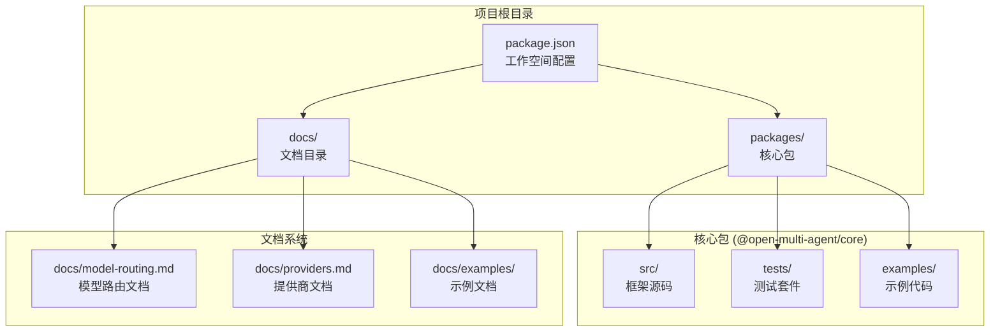
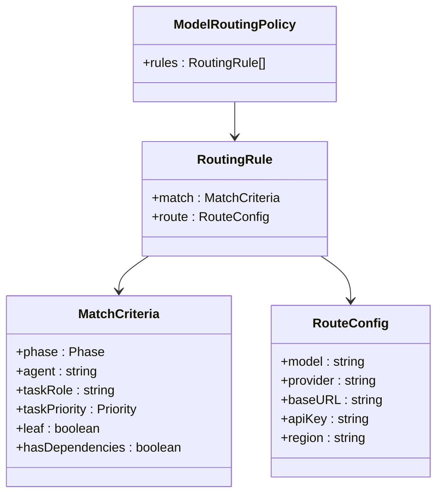
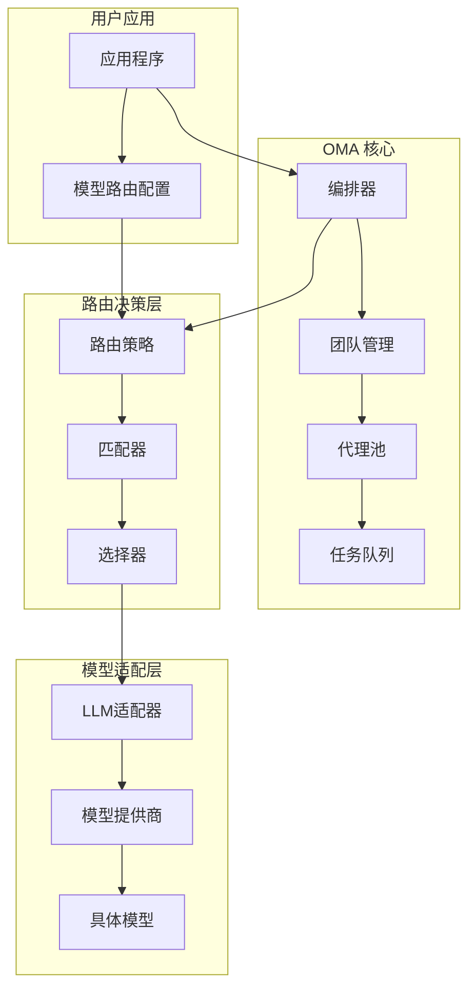
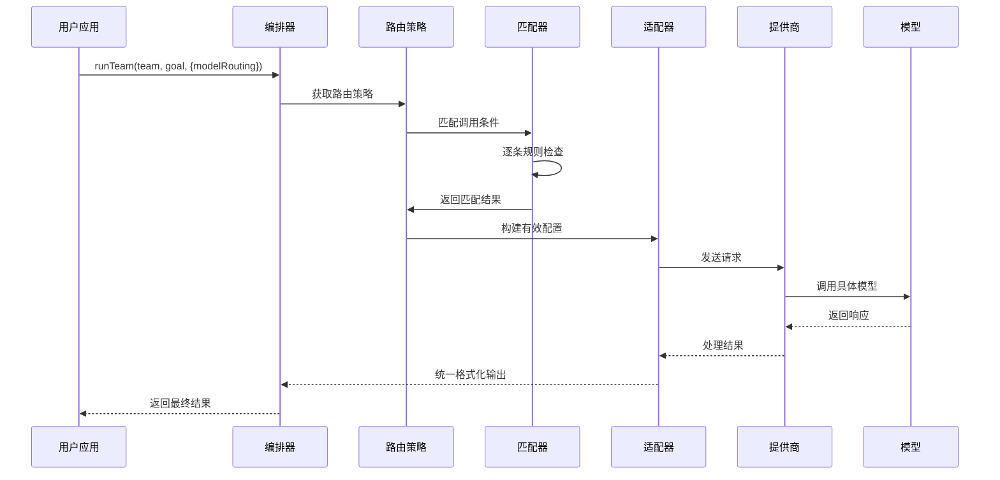
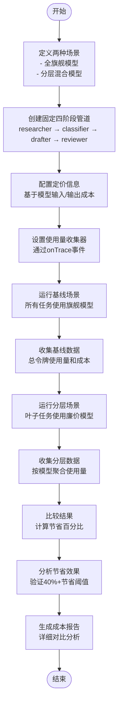
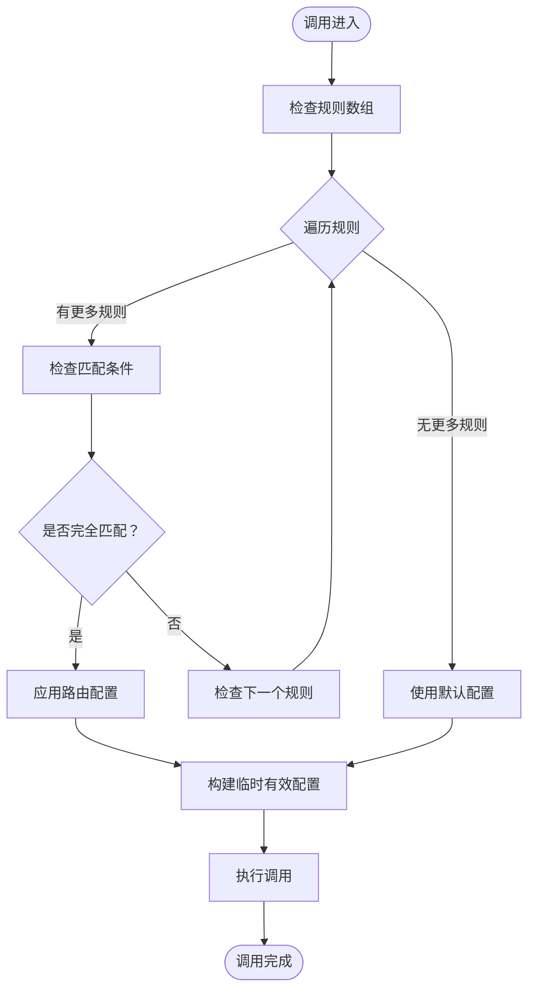
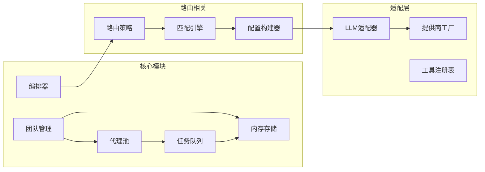
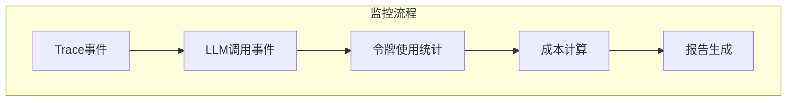

# 模型路由策略

<cite>
**本文档引用的文件**
- [docs/model-routing.md](file://docs/model-routing.md)
- [packages/core/README.md](file://packages/core/README.md)
- [packages/core/examples/patterns/cost-tiered-pipeline.ts](file://packages/core/examples/patterns/cost-tiered-pipeline.ts)
- [README.md](file://README.md)
- [package.json](file://package.json)
</cite>

## 目录
1. [简介](#简介)
2. [项目结构](#项目结构)
3. [核心组件](#核心组件)
4. [架构概览](#架构概览)
5. [详细组件分析](#详细组件分析)
6. [依赖关系分析](#依赖关系分析)
7. [性能考虑](#性能考虑)
8. [故障排除指南](#故障排除指南)
9. [结论](#结论)

## 简介

模型路由策略是 Open Multi-Agent (OMA) 框架中的一个关键功能，它允许开发者根据不同的条件将不同的编排调用路由到不同的模型，而无需修改团队或代理配置。这种策略采用确定性的规则匹配机制，通过 `modelRouting` 配置实现智能的成本优化和性能平衡。

该功能的核心理念是"旗舰模型负责规划，廉价模型执行叶子任务"的模式，通过在不同阶段和条件下选择最适合的模型来实现成本效益最大化。

## 项目结构

Open Multi-Agent 是一个基于 TypeScript 的多代理编排框架，采用 Monorepo 结构组织：



**图表来源**
- [package.json:1-28](file://package.json#L1-L28)
- [README.md:105-117](file://README.md#L105-L117)

**章节来源**
- [README.md:105-117](file://README.md#L105-L117)
- [package.json:6-8](file://package.json#L6-L8)

## 核心组件

### 模型路由策略定义

模型路由策略通过 `ModelRoutingPolicy` 接口定义，包含以下关键要素：



**图表来源**
- [docs/model-routing.md:8-16](file://docs/model-routing.md#L8-L16)
- [docs/model-routing.md:29-42](file://docs/model-routing.md#L29-L42)
- [docs/model-routing.md:44-55](file://docs/model-routing.md#L44-L55)

### 匹配维度详解

模型路由策略支持多种匹配维度，每种维度都有特定的适用场景：

| 匹配维度 | 适用范围 | 描述 | 使用场景 |
|---------|----------|------|----------|
| `phase` | 所有调用 | 编排阶段（coordinator、synthesis、short-circuit、worker、delegated） | 根据处理阶段选择不同能力的模型 |
| `agent` | 所有调用 | 运行代理的名称 | 为特定代理定制模型策略 |
| `taskRole` | worker/delegated 调用 | 任务角色（来自显式任务或协调器的JSON） | 基于任务类型分配模型 |
| `taskPriority` | worker/delegated 调用 | 任务优先级（low、normal、high、critical） | 根据重要性调整模型选择 |
| `leaf` | worker/delegated 调用 | 任务在执行图中无后续依赖 | 叶子任务使用低成本模型 |
| `hasDependencies` | worker/delegated 调用 | 任务的 dependsOn 非空 | 处理依赖任务时的特殊策略 |

**章节来源**
- [docs/model-routing.md:29-42](file://docs/model-routing.md#L29-L42)

### 路由配置选项

路由配置提供了灵活的模型覆盖选项：

| 配置项 | 类型 | 必需 | 默认值 | 描述 |
|--------|------|------|--------|------|
| `model` | string | 是 | - | 匹配调用使用的模型 |
| `provider` | string | 否 | 代理配置或默认提供程序 | 提供商覆盖（anthropic、openai、gemini等） |
| `baseURL` | string | 否 | - | OpenAI兼容或自托管端点的基础URL |
| `apiKey` | string | 否 | - | 匹配调用的API密钥 |
| `region` | string | 否 | - | AWS区域，用于Bedrock路由 |

**章节来源**
- [docs/model-routing.md:44-55](file://docs/model-routing.md#L44-L55)

## 架构概览

模型路由策略在整个 OMA 架构中的位置和交互关系：



**图表来源**
- [packages/core/README.md:298-339](file://packages/core/README.md#L298-L339)
- [docs/model-routing.md:56-65](file://docs/model-routing.md#L56-L65)

### 调用路由流程



**图表来源**
- [docs/model-routing.md:27-28](file://docs/model-routing.md#L27-L28)
- [docs/model-routing.md:18-25](file://docs/model-routing.md#L18-L25)

## 详细组件分析

### 成本分层管道示例

成本分层管道示例展示了如何在实际场景中应用模型路由策略：



**图表来源**
- [packages/core/examples/patterns/cost-tiered-pipeline.ts:505-517](file://packages/core/examples/patterns/cost-tiered-pipeline.ts#L505-L517)
- [packages/core/examples/patterns/cost-tiered-pipeline.ts:401-462](file://packages/core/examples/patterns/cost-tiered-pipeline.ts#L401-L462)

### 规则匹配算法

模型路由策略采用"第一个匹配获胜"的规则匹配机制：



**图表来源**
- [docs/model-routing.md:27-28](file://docs/model-routing.md#L27-L28)

### 实现特性

模型路由策略具有以下关键特性：

1. **确定性匹配**：规则按数组顺序评估，第一个匹配获胜
2. **非破坏性**：匹配的路由仅构建临时的有效配置，不修改原始团队配置
3. **可选启用**：省略 `modelRouting` 时保持字节相同的模型选择行为
4. **全面覆盖**：单个策略涵盖所有五种编排阶段

**章节来源**
- [docs/model-routing.md:66-71](file://docs/model-routing.md#L66-L71)

## 依赖关系分析

### 外部依赖关系

```mermaid
graph TB
subgraph "核心依赖"
Core[@open-multi-agent/core<br/>主包]
Types[Zod<br/>类型验证]
AnthropicSDK[@anthropic-ai/sdk<br/>Anthropic SDK]
OpenAISDK[openai<br/>OpenAI SDK]
end
subgraph "可选依赖"
GeminiSDK[@google/gemini<br/>Gemini SDK]
BedrockSDK[@aws-sdk/client-bedrock-runtime<br/>AWS Bedrock]
AISDK[ai + @ai-sdk/*<br/>Vercel AI SDK]
MCP[@modelcontextprotocol/sdk<br/>MCP工具]
end
subgraph "开发依赖"
Vitest[vitest<br/>测试框架]
TypeScript[typescript<br/>TypeScript编译]
ESLint[eslint<br/>代码检查]
end
Core --> Types
Core --> AnthropicSDK
Core --> OpenAISDK
Core -.-> GeminiSDK
Core -.-> BedrockSDK
Core -.-> AISDK
Core -.-> MCP
Vitest --> Core
TypeScript --> Core
ESLint --> Core
```

**图表来源**
- [packages/core/README.md:363-375](file://packages/core/README.md#L363-L375)

### 内部模块依赖



**图表来源**
- [packages/core/README.md:300-339](file://packages/core/README.md#L300-L339)

**章节来源**
- [packages/core/README.md:363-375](file://packages/core/README.md#L363-L375)

## 性能考虑

### 成本优化策略

模型路由策略通过以下方式实现成本优化：

1. **阶段化模型选择**：旗舰模型处理规划和合成阶段，廉价模型处理叶子任务
2. **按任务类型优化**：根据任务复杂度和重要性选择合适的模型
3. **动态资源分配**：根据任务依赖关系和优先级进行智能路由

### 性能监控

通过 `onTrace` 事件可以实时监控模型使用情况：



**图表来源**
- [packages/core/examples/patterns/cost-tiered-pipeline.ts:128-140](file://packages/core/examples/patterns/cost-tiered-pipeline.ts#L128-L140)

## 故障排除指南

### 常见问题及解决方案

1. **规则不生效**
   - 检查规则顺序：确保更具体的规则在前
   - 验证匹配条件：确认所有设置的字段都与调用匹配

2. **模型选择异常**
   - 确认提供商配置正确
   - 检查API密钥和基础URL设置

3. **成本统计不准确**
   - 验证 `onTrace` 事件处理逻辑
   - 确认模型定价配置正确

**章节来源**
- [docs/model-routing.md:27-28](file://docs/model-routing.md#L27-L28)

## 结论

模型路由策略为 Open Multi-Agent 框架提供了强大的成本优化和性能控制能力。通过灵活的规则匹配机制和非破坏性的配置覆盖，开发者可以在不影响现有配置的情况下实现智能的模型选择。

该策略的核心价值在于：
- **成本效益**：通过分层模型使用实现显著的成本节约
- **灵活性**：支持复杂的匹配条件和路由配置
- **安全性**：非破坏性设计确保配置完整性
- **可观测性**：完整的使用量统计和成本分析

随着 OMA 生态系统的不断发展，模型路由策略将继续演进，为多代理应用场景提供更加智能化和自动化的模型管理解决方案。