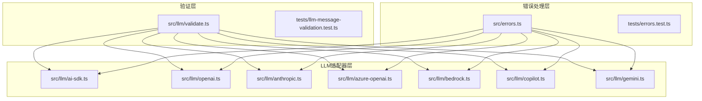
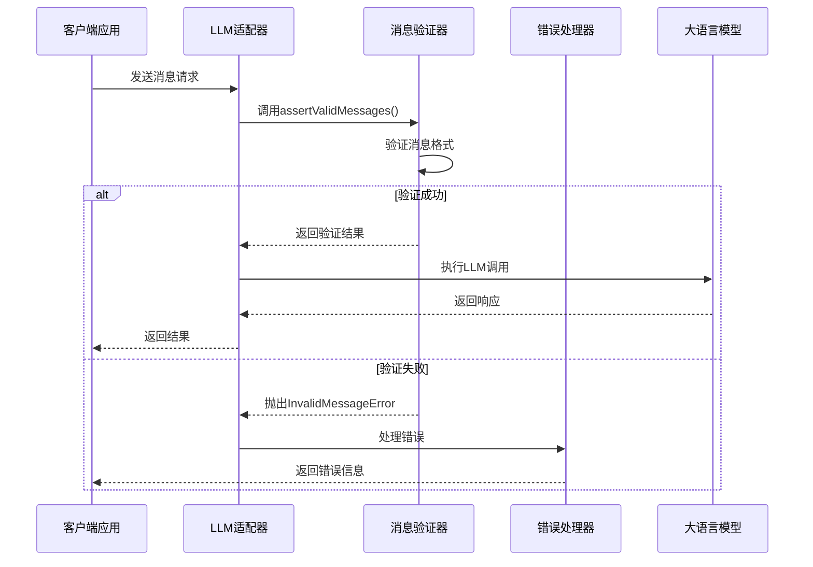
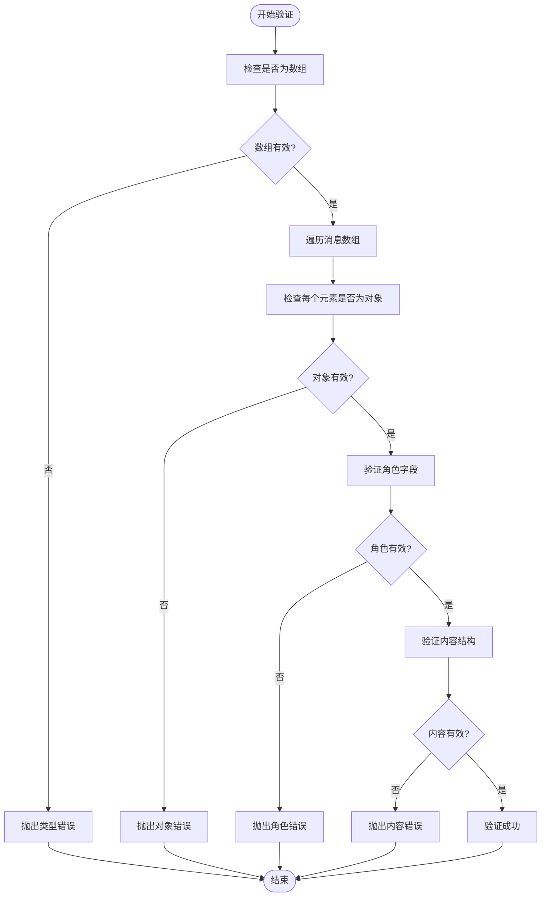
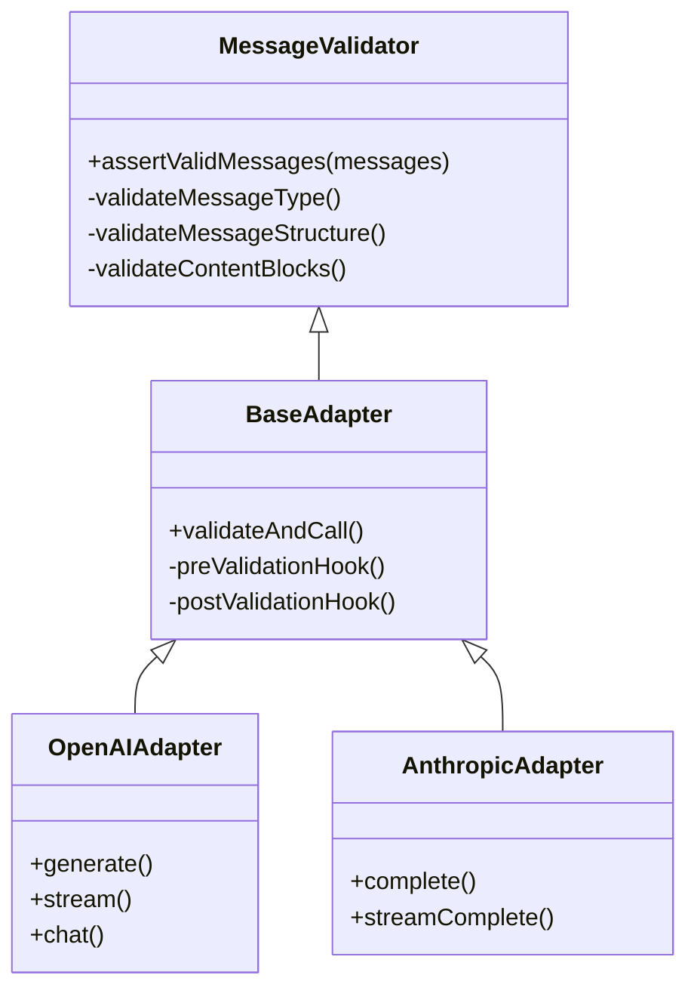
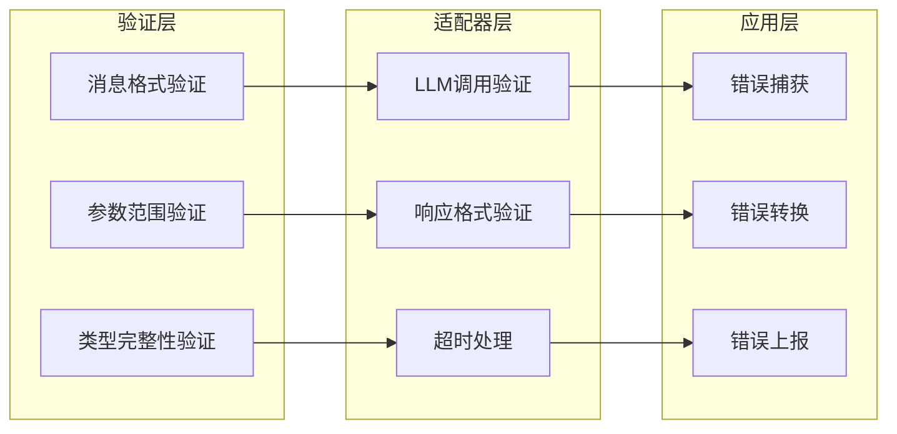
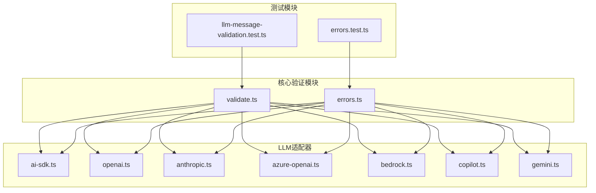

# 消息验证与错误处理

<cite>
**本文档引用的文件**
- [src/llm/validate.ts](file://src/llm/validate.ts)
- [src/errors.ts](file://src/errors.ts)
- [tests/llm-message-validation.test.ts](file://tests/llm-message-validation.test.ts)
- [tests/errors.test.ts](file://tests/errors.test.ts)
- [src/llm/ai-sdk.ts](file://src/llm/ai-sdk.ts)
- [src/llm/openai.ts](file://src/llm/openai.ts)
- [src/llm/anthropic.ts](file://src/llm/anthropic.ts)
- [src/llm/azure-openai.ts](file://src/llm/azure-openai.ts)
- [src/llm/bedrock.ts](file://src/llm/bedrock.ts)
- [src/llm/copilot.ts](file://src/llm/copilot.ts)
- [src/llm/gemini.ts](file://src/llm/gemini.ts)
</cite>

## 目录
1. [简介](#简介)
2. [项目结构](#项目结构)
3. [核心组件](#核心组件)
4. [架构概览](#架构概览)
5. [详细组件分析](#详细组件分析)
6. [依赖关系分析](#依赖关系分析)
7. [性能考虑](#性能考虑)
8. [故障排除指南](#故障排除指南)
9. [结论](#结论)

## 简介

本文件深入分析了 Open Multi-Agent 项目中的消息验证与错误处理机制。该系统通过统一的消息验证器确保所有 LLM 调用前的数据完整性，同时提供完善的错误处理体系来管理各种异常情况。本文档将详细解释验证逻辑、错误类型定义、适配器集成方式以及最佳实践。

## 项目结构

Open Multi-Agent 项目采用模块化架构设计，消息验证与错误处理功能分布在多个关键模块中：

**图表来源**
- [src/llm/validate.ts:1-50](file://src/llm/validate.ts#L1-L50)
- [src/errors.ts:1-100](file://src/errors.ts#L1-L100)

**章节来源**
- [src/llm/validate.ts:1-50](file://src/llm/validate.ts#L1-L50)
- [src/errors.ts:1-100](file://src/errors.ts#L1-L100)

## 核心组件

### 消息验证器 (assertValidMessages)

消息验证器是整个系统的入口点，负责确保所有传入的 LLM 消息都符合预期格式。该函数被设计为每个 LLM 适配器的前置检查器。

**主要功能特性：**
- 验证消息数组类型
- 检查每个消息对象的结构完整性
- 支持多模态内容块（text、tool_use等）
- 提供详细的错误定位信息

**验证规则：**
- 必须是数组类型
- 每个元素必须是对象
- 角色字段必须有效
- 内容必须是有效的 ContentBlock 数组

**章节来源**
- [src/llm/validate.ts:30-80](file://src/llm/validate.ts#L30-L80)

### 错误处理框架

项目实现了完整的错误处理层次结构，包括自定义错误类型和通用错误管理机制。

**核心错误类型：**
- InvalidMessageError：用于消息格式验证失败
- TokenBudgetExceededError：令牌预算超限
- AgentRuntimeError：代理运行时错误
- ToolExecutionError：工具执行错误

**章节来源**
- [src/errors.ts:1-200](file://src/errors.ts#L1-L200)

## 架构概览

消息验证与错误处理系统采用分层架构设计，确保验证逻辑的可重用性和错误处理的一致性：

**图表来源**
- [src/llm/validate.ts:30-80](file://src/llm/validate.ts#L30-L80)
- [src/llm/ai-sdk.ts:240-300](file://src/llm/ai-sdk.ts#L240-L300)

## 详细组件分析

### 消息验证器实现

消息验证器通过递归验证确保每个消息都符合规范要求：

**图表来源**
- [src/llm/validate.ts:30-80](file://src/llm/validate.ts#L30-L80)

**章节来源**
- [src/llm/validate.ts:1-100](file://src/llm/validate.ts#L1-L100)

### LLM适配器集成模式

所有 LLM 适配器都遵循相同的集成模式，确保一致的验证行为：

**图表来源**
- [src/llm/validate.ts:30-80](file://src/llm/validate.ts#L30-L80)
- [src/llm/openai.ts:140-200](file://src/llm/openai.ts#L140-L200)

**章节来源**
- [src/llm/ai-sdk.ts:240-300](file://src/llm/ai-sdk.ts#L240-L300)
- [src/llm/openai.ts:140-200](file://src/llm/openai.ts#L140-L200)
- [src/llm/anthropic.ts:340-410](file://src/llm/anthropic.ts#L340-L410)

### 错误处理策略

错误处理系统采用分层策略，从底层验证到上层应用都有相应的错误处理机制：

**图表来源**
- [src/errors.ts:1-200](file://src/errors.ts#L1-L200)
- [tests/errors.test.ts:30-70](file://tests/errors.test.ts#L30-L70)

**章节来源**
- [src/errors.ts:1-200](file://src/errors.ts#L1-L200)
- [tests/errors.test.ts:30-70](file://tests/errors.test.ts#L30-L70)

## 依赖关系分析

消息验证与错误处理系统在项目中的依赖关系呈现清晰的单向依赖结构：

**图表来源**
- [src/llm/validate.ts:1-50](file://src/llm/validate.ts#L1-L50)
- [src/errors.ts:1-100](file://src/errors.ts#L1-L100)

**章节来源**
- [src/llm/validate.ts:1-50](file://src/llm/validate.ts#L1-L50)
- [src/errors.ts:1-100](file://src/errors.ts#L1-L100)

## 性能考虑

消息验证系统在设计时充分考虑了性能优化：

### 验证性能优化
- **早期失败原则**：在发现第一个无效项时立即停止验证
- **内存效率**：避免不必要的数据复制
- **类型检查缓存**：对常用类型检查进行缓存

### 错误处理性能
- **异步错误处理**：使用 Promise 和 async/await 减少阻塞
- **错误分类**：快速区分可恢复和不可恢复错误
- **资源清理**：确保错误发生时正确释放资源

## 故障排除指南

### 常见验证错误及解决方案

| 错误类型 | 可能原因 | 解决方案 |
|---------|---------|---------|
| InvalidMessageError | 消息格式不正确 | 检查消息数组结构和字段完整性 |
| TokenBudgetExceededError | 令牌使用超出限制 | 优化提示词长度或调整预算设置 |
| AgentRuntimeError | 代理执行失败 | 检查代理配置和依赖服务状态 |
| ToolExecutionError | 工具调用失败 | 验证工具可用性和权限设置 |

### 调试技巧

1. **启用详细日志**：在开发环境中启用完整错误堆栈跟踪
2. **单元测试覆盖**：运行验证测试套件确保功能正常
3. **边界条件测试**：测试空消息、特殊字符等边界情况
4. **性能监控**：监控验证操作的执行时间

**章节来源**
- [tests/llm-message-validation.test.ts:28-80](file://tests/llm-message-validation.test.ts#L28-L80)
- [tests/errors.test.ts:30-70](file://tests/errors.test.ts#L30-L70)

## 结论

Open Multi-Agent 项目的消息验证与错误处理系统展现了优秀的工程实践：

1. **一致性**：通过统一的验证器确保所有 LLM 适配器的行为一致性
2. **可扩展性**：模块化设计支持新适配器的轻松集成
3. **可靠性**：完善的错误处理机制提高了系统的稳定性
4. **可维护性**：清晰的代码结构和全面的测试覆盖便于长期维护

该系统为构建可靠的多代理 AI 应用提供了坚实的基础，建议在实际项目中遵循既定的验证和错误处理模式，以确保系统的稳定性和可预测性。