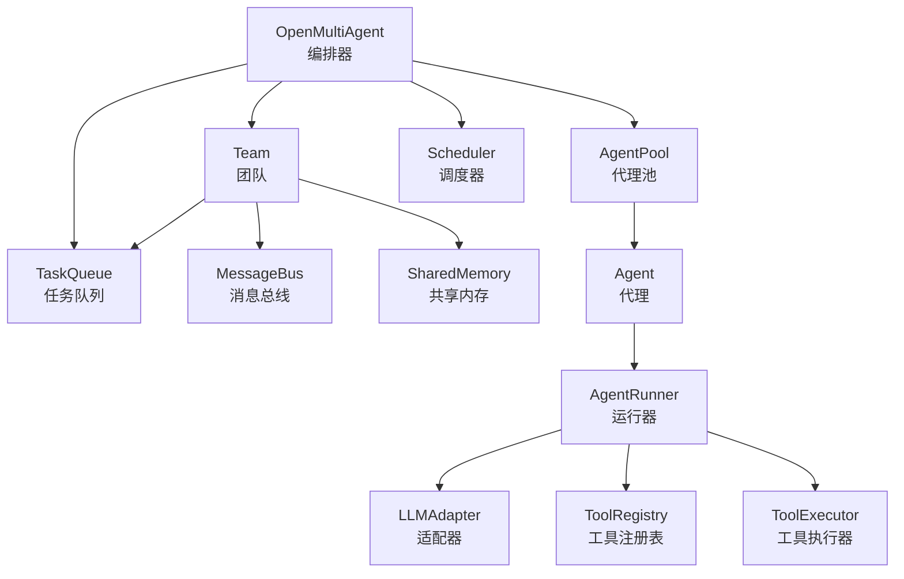
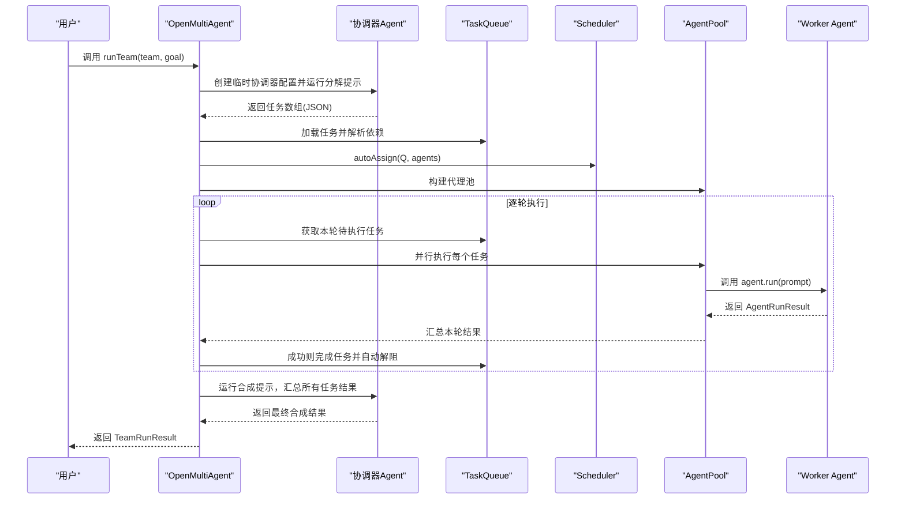
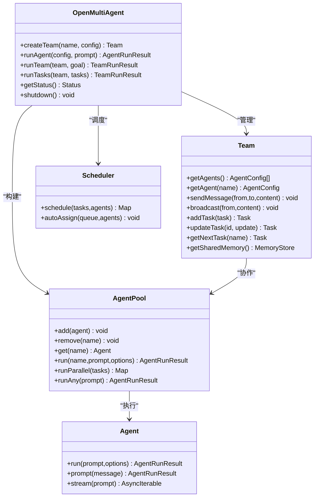

# OpenMultiAgent 核心类

<cite>
**本文档引用的文件**
- [src/index.ts](file://src/index.ts)
- [src/orchestrator/orchestrator.ts](file://src/orchestrator/orchestrator.ts)
- [src/team/team.ts](file://src/team/team.ts)
- [src/orchestrator/scheduler.ts](file://src/orchestrator/scheduler.ts)
- [src/types.ts](file://src/types.ts)
- [src/agent/agent.ts](file://src/agent/agent.ts)
- [src/agent/pool.ts](file://src/agent/pool.ts)
- [examples/01-single-agent.ts](file://examples/01-single-agent.ts)
- [examples/02-team-collaboration.ts](file://examples/02-team-collaboration.ts)
</cite>

## 目录
1. [简介](#简介)
2. [项目结构](#项目结构)
3. [核心组件](#核心组件)
4. [架构总览](#架构总览)
5. [详细组件分析](#详细组件分析)
6. [依赖关系分析](#依赖关系分析)
7. [性能考量](#性能考量)
8. [故障排查指南](#故障排查指南)
9. [结论](#结论)
10. [附录](#附录)

## 简介
本文件面向 OpenMultiAgent 的核心类 OpenMultiAgent，系统化阐述其设计理念与核心能力，重点覆盖：
- 构造函数配置选项与默认值
- 团队管理方法（创建团队、状态查询）
- 单代理执行方法（一次性执行 runAgent）
- 团队编排方法（自动编排 runTeam 与显式任务 runTasks）
- runTeam 完整执行流程：协调器代理创建、任务分解、依赖解析、调度分配、并发执行、结果合成
- 配置参数说明、默认值设置与最佳实践建议
- 结合示例文件展示初始化编排器、创建团队、执行任务的典型用法

## 项目结构
OpenMultiAgent 采用分层模块化设计，核心入口位于 orchestrator 层，围绕 Team、AgentPool、Scheduler、TaskQueue 等子系统协同工作，形成“编排器 + 团队 + 执行池 + 调度器 + 任务队列”的整体架构。

图表来源
- [src/orchestrator/orchestrator.ts:1-120](file://src/orchestrator/orchestrator.ts#L1-L120)
- [src/team/team.ts:88-140](file://src/team/team.ts#L88-L140)
- [src/orchestrator/scheduler.ts:127-136](file://src/orchestrator/scheduler.ts#L127-L136)
- [src/agent/pool.ts:58-70](file://src/agent/pool.ts#L58-L70)
- [src/agent/agent.ts:81-114](file://src/agent/agent.ts#L81-L114)

章节来源
- [src/index.ts:57-183](file://src/index.ts#L57-L183)
- [src/orchestrator/orchestrator.ts:1-120](file://src/orchestrator/orchestrator.ts#L1-L120)

## 核心组件
- OpenMultiAgent：顶层编排器，负责团队生命周期管理、单代理执行、自动编排团队任务、可观测性与状态统计。
- Team：团队实体，维护代理名单、消息总线、任务队列、可选共享内存，并提供事件总线。
- AgentPool：并发控制的代理池，基于信号量限制并行度，提供按名调度与轮询派发。
- Scheduler：任务调度策略集合，支持 round-robin、least-busy、capability-match、dependency-first。
- Agent：高阶代理封装，提供 run/prompt/stream 等接口，管理对话历史与工具调用。
- TaskQueue：带依赖图的任务队列，支持自动解阻、失败传播与级联回退。
- SharedMemory：跨代理共享键值存储，用于任务结果与上下文传递。

章节来源
- [src/orchestrator/orchestrator.ts:514-541](file://src/orchestrator/orchestrator.ts#L514-L541)
- [src/team/team.ts:88-140](file://src/team/team.ts#L88-L140)
- [src/orchestrator/scheduler.ts:127-136](file://src/orchestrator/scheduler.ts#L127-L136)
- [src/agent/pool.ts:58-70](file://src/agent/pool.ts#L58-L70)
- [src/agent/agent.ts:81-114](file://src/agent/agent.ts#L81-L114)

## 架构总览
OpenMultiAgent 将编排职责集中在单一入口，通过内部构建器与工具链完成从目标到结果的全链路自动化：
- 协调器分解：将高层目标分解为结构化任务数组
- 依赖解析：标题映射到任务 ID，构建依赖图
- 自动分配：调度器按策略分配未指派任务
- 并发执行：代理池在并发上限内并行执行
- 结果持久化：成功结果写入共享内存供后续代理读取
- 最终合成：协调器汇总所有任务输出生成最终答案

图表来源
- [src/orchestrator/orchestrator.ts:641-740](file://src/orchestrator/orchestrator.ts#L641-L740)
- [src/orchestrator/orchestrator.ts:280-464](file://src/orchestrator/orchestrator.ts#L280-L464)
- [src/orchestrator/orchestrator.ts:893-936](file://src/orchestrator/orchestrator.ts#L893-L936)

## 详细组件分析

### OpenMultiAgent 类详解
- 设计理念
  - 协调器模式：runTeam 通过临时协调器将高层目标结构化为任务，再由调度器与代理池执行，最后合成结果。
  - 并行优先：无共享依赖的独立任务在并发上限内并行执行。
  - 容错稳健：失败任务标记失败，直接依赖被阻塞，非依赖任务继续推进；支持重试与指数退避。
  - 可观测性：支持进度回调与追踪事件，便于调试与监控。

- 构造函数配置与默认值
  - maxConcurrency：默认 5
  - defaultModel：默认 'claude-opus-4-6'
  - defaultProvider：默认 'anthropic'
  - defaultBaseURL/defaultApiKey：可选，默认未设置
  - onProgress/onTrace/onApproval：可选回调，分别用于进度事件、追踪事件与审批门控

- 关键方法
  - createTeam(name, config)：注册并返回 Team 实例，名称唯一
  - runAgent(config, prompt)：一次性代理执行，适用于单次查询
  - runTeam(team, goal)：自动编排团队执行，包含分解、依赖解析、调度、执行、合成
  - runTasks(team, tasks)：显式任务列表执行，跳过协调器
  - getStatus()/shutdown()：运行时状态快照与资源清理

- runTeam 执行流程（完整版）
  1) 协调器创建与分解
     - 基于 defaultModel/defaultProvider/defaultBaseURL/defaultApiKey 构建协调器配置
     - 使用系统提示与分解提示让协调器输出结构化任务数组
     - 若失败则回退为按代理逐一生成任务
  2) 任务加载与依赖解析
     - 解析标题到任务 ID 的映射，构建依赖图
     - 支持 title 与真实 ID 混合引用
  3) 自动分配
     - 使用 dependency-first 策略进行任务分配
  4) 并发执行
     - 构建 AgentPool，按并发上限并行执行
     - 每个任务执行前构建提示：包含任务描述、共享内存摘要、消息总线内容
     - 支持任务级重试与指数退避，累计 tokenUsage
     - 成功后写入共享内存，失败则标记失败并传播
  5) 结果合成
     - 协调器读取已完成/失败/跳过的任务结果与共享内存摘要
     - 生成合成提示，汇总输出作为最终答案
  6) 结果聚合
     - 合并 per-agent 的结果，计算总 tokenUsage，统计成功状态

- runAgent 一次性执行模式
  - 以传入配置构建临时 Agent，注入默认提供商/基础地址/API 密钥
  - 触发 agent_start/agent_complete 进度事件
  - 执行一次对话回合，返回 AgentRunResult

- runTasks 显式任务执行
  - 直接加载任务列表，解析依赖，自动分配，执行队列
  - 适合已有明确任务规划的场景

- 配置参数与默认值
  - OrchestratorConfig
    - maxConcurrency: number（默认 5）
    - defaultModel: string（默认 'claude-opus-4-6'）
    - defaultProvider: 'anthropic' | 'copilot' | 'grok' | 'openai' | 'gemini'（默认 'anthropic'）
    - defaultBaseURL/defaultApiKey: string（可选）
    - onProgress: (event) => void（可选）
    - onTrace: (event) => void | Promise<void>（可选）
    - onApproval: (completedTasks, nextTasks) => Promise<boolean>（可选）

- 最佳实践
  - 并发控制：根据模型吞吐与本地资源设置 maxConcurrency，避免过载
  - 任务粒度：合理拆分任务，尽量减少共享依赖，提升并行度
  - 重试策略：为易失败任务设置合理的 maxRetries/retryDelayMs/retryBackoff
  - 审批门控：在复杂管线中使用 onApproval 控制批次间决策
  - 可观测性：启用 onProgress/onTrace 记录关键事件与耗时

章节来源
- [src/orchestrator/orchestrator.ts:514-541](file://src/orchestrator/orchestrator.ts#L514-L541)
- [src/orchestrator/orchestrator.ts:583-614](file://src/orchestrator/orchestrator.ts#L583-L614)
- [src/orchestrator/orchestrator.ts:641-740](file://src/orchestrator/orchestrator.ts#L641-L740)
- [src/orchestrator/orchestrator.ts:756-802](file://src/orchestrator/orchestrator.ts#L756-L802)
- [src/orchestrator/orchestrator.ts:846-877](file://src/orchestrator/orchestrator.ts#L846-L877)
- [src/orchestrator/orchestrator.ts:879-890](file://src/orchestrator/orchestrator.ts#L879-L890)
- [src/orchestrator/orchestrator.ts:893-936](file://src/orchestrator/orchestrator.ts#L893-L936)
- [src/orchestrator/orchestrator.ts:944-1001](file://src/orchestrator/orchestrator.ts#L944-L1001)
- [src/orchestrator/orchestrator.ts:1003-1017](file://src/orchestrator/orchestrator.ts#L1003-L1017)
- [src/orchestrator/orchestrator.ts:1028-1070](file://src/orchestrator/orchestrator.ts#L1028-L1070)
- [src/types.ts:385-411](file://src/types.ts#L385-L411)

### Team 组件
- 职责：维护代理清单、消息总线、任务队列、共享内存（可选），并提供事件总线
- 关键能力
  - getAgents()/getAgent(name)：查询代理配置
  - sendMessage()/broadcast()/getMessages()：点对点与广播通信
  - addTask()/getTasks()/updateTask()/getNextTask()：任务增删改查与下一条任务
  - getSharedMemory()/getSharedMemoryInstance()：共享内存访问
  - on()/emit()：自定义事件订阅与发布

章节来源
- [src/team/team.ts:88-334](file://src/team/team.ts#L88-L334)

### Scheduler 组件
- 策略：round-robin、least-busy、capability-match、dependency-first
- 特性：无状态、可直接对 TaskQueue 自动分配；支持关键字匹配与依赖路径关键性评估

章节来源
- [src/orchestrator/scheduler.ts:127-351](file://src/orchestrator/scheduler.ts#L127-L351)

### AgentPool 组件
- 并发控制：基于信号量限制最大并发
- 调度：按名运行、并行运行、轮询选择“最佳可用”
- 状态：提供池状态快照（总数、空闲、运行、完成、错误）

章节来源
- [src/agent/pool.ts:58-200](file://src/agent/pool.ts#L58-L200)

### Agent 组件
- 接口：run(prompt)/prompt(message)/stream(prompt)
- 生命周期：状态机（idle → running → completed | error），持久化历史
- 工具：动态注册与执行，支持结构化输出与循环检测

章节来源
- [src/agent/agent.ts:81-200](file://src/agent/agent.ts#L81-L200)

## 依赖关系分析

图表来源
- [src/orchestrator/orchestrator.ts:514-566](file://src/orchestrator/orchestrator.ts#L514-L566)
- [src/team/team.ts:88-140](file://src/team/team.ts#L88-L140)
- [src/agent/pool.ts:58-115](file://src/agent/pool.ts#L58-L115)
- [src/orchestrator/scheduler.ts:127-198](file://src/orchestrator/scheduler.ts#L127-L198)
- [src/agent/agent.ts:81-114](file://src/agent/agent.ts#L81-L114)

## 性能考量
- 并发上限：maxConcurrency 决定最大并行任务数，应结合模型吞吐与资源限制调整
- 任务粒度：细粒度任务更利于并行，但会增加调度与通信开销
- 重试策略：合理设置重试次数与退避系数，避免抖动放大
- 共享内存：频繁读写可能成为瓶颈，建议仅存放必要上下文摘要
- 调度策略：dependency-first 在复杂管线中通常最优，round-robin 适合均衡负载

## 故障排查指南
- 任务无分配者：检查任务 assignee 是否存在于代理名单
- 任务依赖环：确认 dependsOn 引用是否形成环或指向不存在的任务
- 失败传播：失败任务会阻断其直接依赖，需检查上游任务状态
- 循环检测：开启 loopDetection 并配置 onLoopDetected 行为
- 重试异常：onRetry 回调可用于记录重试信息与延迟

章节来源
- [src/orchestrator/orchestrator.ts:280-464](file://src/orchestrator/orchestrator.ts#L280-L464)
- [src/types.ts:247-276](file://src/types.ts#L247-L276)

## 结论
OpenMultiAgent 通过“协调器 + 任务队列 + 调度器 + 代理池”的组合，提供了从目标到结果的端到端自动化编排能力。其默认并行优先、容错稳健、可观测性强的设计，使其适用于多代理协作与复杂任务流水线。合理配置并发、任务粒度与重试策略，可显著提升吞吐与稳定性。

## 附录

### 示例用法与代码片段路径
- 初始化编排器与单代理执行
  - [examples/01-single-agent.ts:21-64](file://examples/01-single-agent.ts#L21-L64)
- 创建团队并执行团队任务
  - [examples/02-team-collaboration.ts:103-128](file://examples/02-team-collaboration.ts#L103-L128)
- 编排器公共 API 概览
  - [src/index.ts:57-183](file://src/index.ts#L57-L183)

### 配置参数速查
- OrchestratorConfig
  - maxConcurrency: number（默认 5）
  - defaultModel: string（默认 'claude-opus-4-6'）
  - defaultProvider: 'anthropic' | 'copilot' | 'grok' | 'openai' | 'gemini'（默认 'anthropic'）
  - defaultBaseURL/defaultApiKey: string（可选）
  - onProgress/onTrace/onApproval: 回调（可选）

章节来源
- [src/types.ts:385-411](file://src/types.ts#L385-L411)
- [src/orchestrator/orchestrator.ts:530-541](file://src/orchestrator/orchestrator.ts#L530-L541)