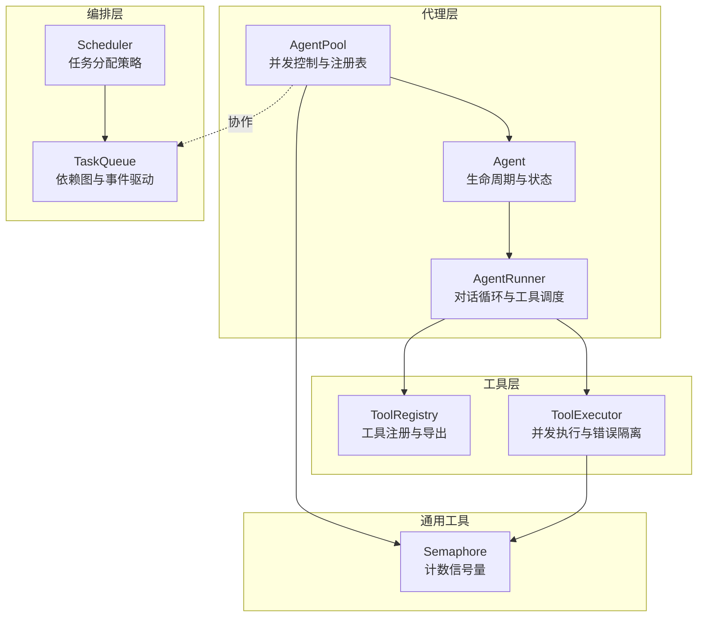
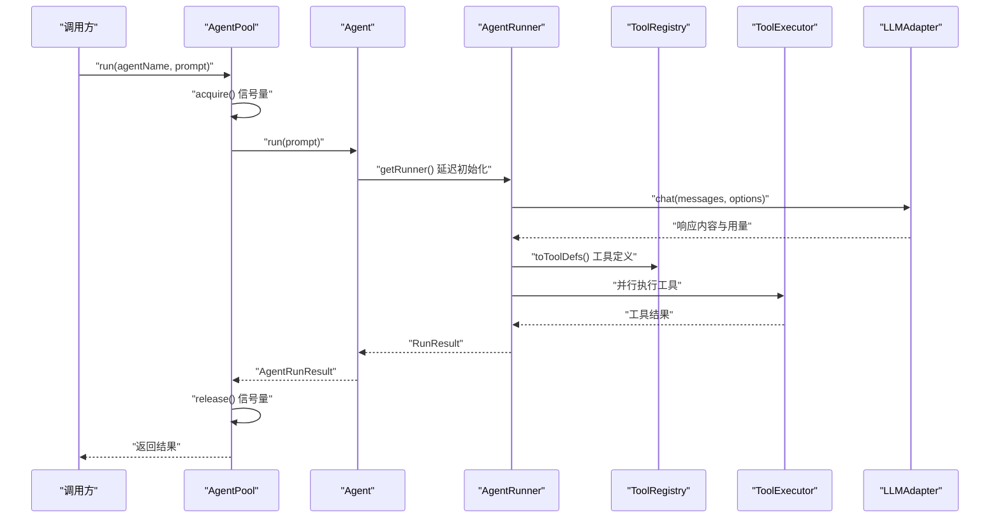
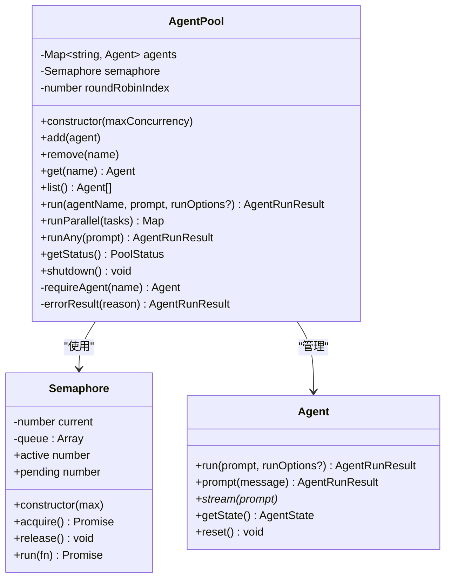
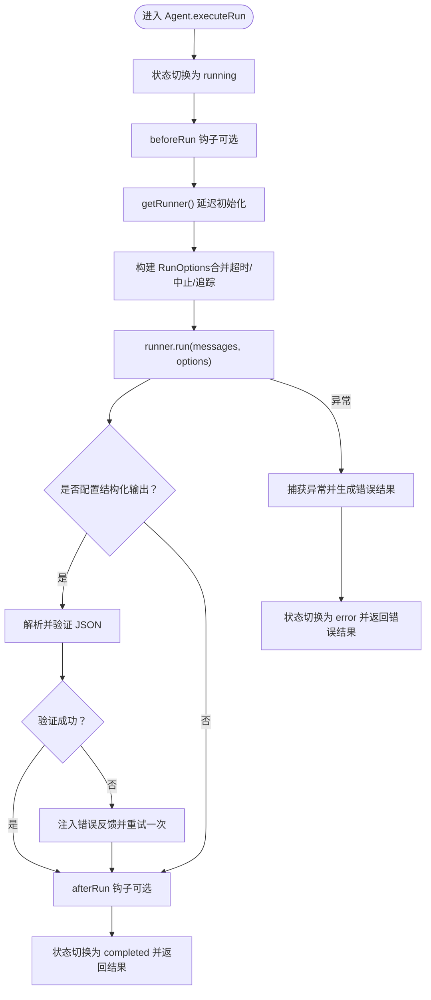
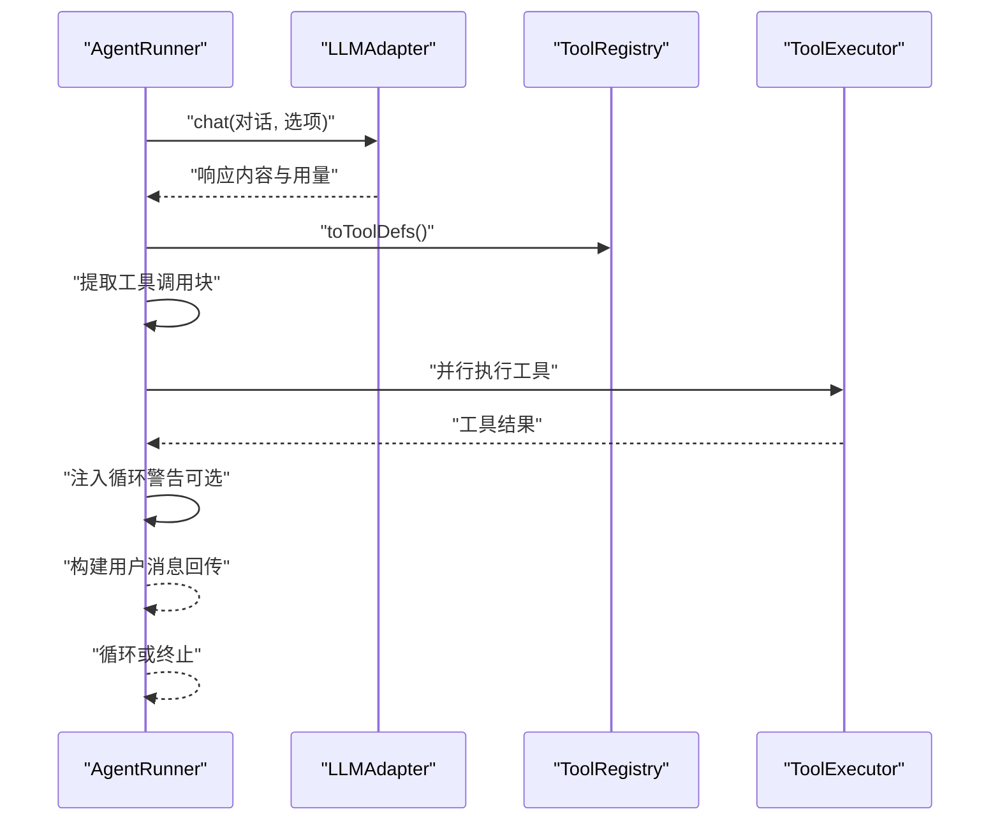
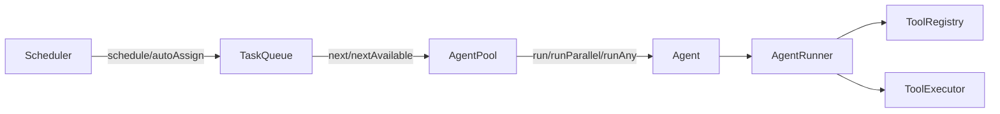
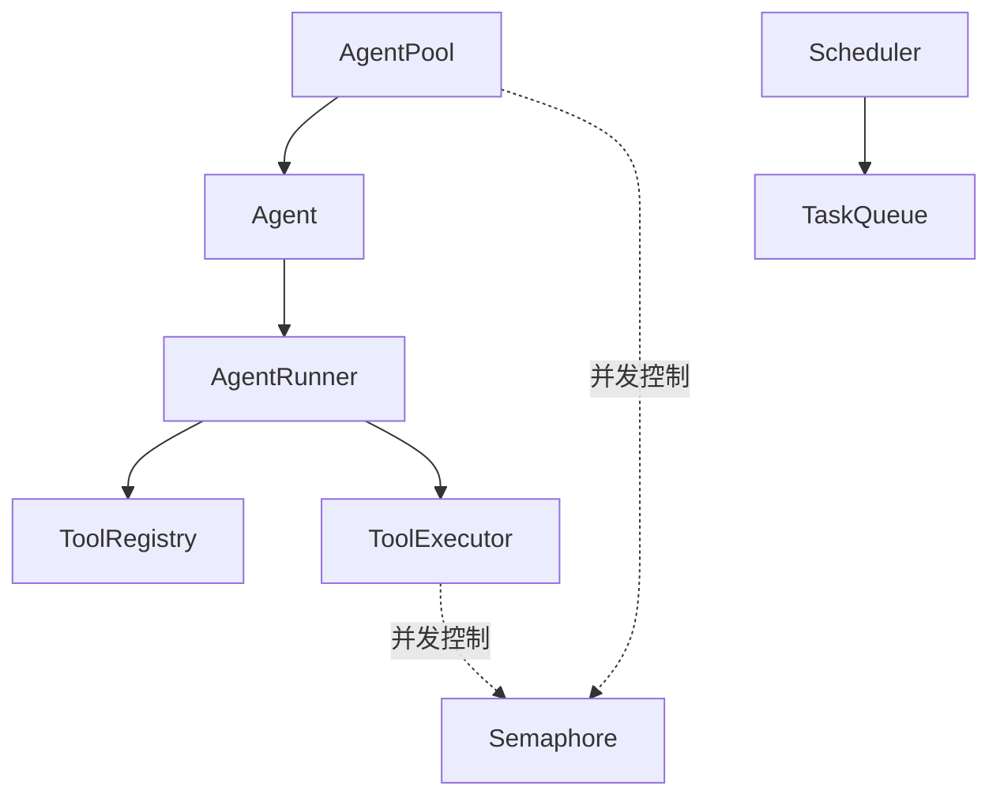

# 代理池管理

<cite>
**本文引用的文件**
- [src/agent/pool.ts](file://src/agent/pool.ts)
- [src/agent/agent.ts](file://src/agent/agent.ts)
- [src/agent/runner.ts](file://src/agent/runner.ts)
- [src/utils/semaphore.ts](file://src/utils/semaphore.ts)
- [src/orchestrator/scheduler.ts](file://src/orchestrator/scheduler.ts)
- [src/task/queue.ts](file://src/task/queue.ts)
- [src/types.ts](file://src/types.ts)
- [src/tool/executor.ts](file://src/tool/executor.ts)
- [src/tool/framework.ts](file://src/tool/framework.ts)
- [examples/03-task-pipeline.ts](file://examples/03-task-pipeline.ts)
- [tests/agent-pool.test.ts](file://tests/agent-pool.test.ts)
</cite>

## 目录
1. [简介](#简介)
2. [项目结构](#项目结构)
3. [核心组件](#核心组件)
4. [架构总览](#架构总览)
5. [详细组件分析](#详细组件分析)
6. [依赖关系分析](#依赖关系分析)
7. [性能考量](#性能考量)
8. [故障排除指南](#故障排除指南)
9. [结论](#结论)
10. [附录：使用示例与最佳实践](#附录使用示例与最佳实践)

## 简介
本文件面向“代理池管理系统”的设计与实现，重点围绕 AgentPool 类展开，系统性阐述其并发控制机制（基于计数信号量）、代理实例管理、并发限制与资源分配策略，并深入解析 pool.run() 的执行流程（代理获取、任务执行、结果收集、错误处理）。同时，文档说明代理池与调度器、任务队列的协作关系，给出可操作的配置与监控方法，并提供并发性能优化建议、资源管理最佳实践与故障排除指南。

## 项目结构
本项目采用按功能域分层的组织方式：
- agent：代理与运行器，负责对话循环、工具调用与状态管理
- orchestrator：编排与调度，提供多种任务分配策略
- task：任务队列，支持依赖图、阻塞/解阻、级联失败/跳过
- tool：工具框架与执行器，提供类型安全的工具定义与并发控制
- utils：通用工具，如计数信号量
- examples/tests：示例与测试，覆盖典型使用场景与边界行为

图表来源
- [src/agent/pool.ts:58-286](file://src/agent/pool.ts#L58-L286)
- [src/agent/agent.ts:81-623](file://src/agent/agent.ts#L81-L623)
- [src/agent/runner.ts:166-543](file://src/agent/runner.ts#L166-L543)
- [src/tool/framework.ts:93-200](file://src/tool/framework.ts#L93-L200)
- [src/tool/executor.ts:47-179](file://src/tool/executor.ts#L47-L179)
- [src/orchestrator/scheduler.ts:127-353](file://src/orchestrator/scheduler.ts#L127-L353)
- [src/task/queue.ts:55-465](file://src/task/queue.ts#L55-L465)
- [src/utils/semaphore.ts:24-90](file://src/utils/semaphore.ts#L24-L90)

章节来源
- [src/agent/pool.ts:1-286](file://src/agent/pool.ts#L1-L286)
- [src/orchestrator/scheduler.ts:1-353](file://src/orchestrator/scheduler.ts#L1-L353)
- [src/task/queue.ts:1-465](file://src/task/queue.ts#L1-L465)
- [src/utils/semaphore.ts:1-90](file://src/utils/semaphore.ts#L1-L90)

## 核心组件
- AgentPool：代理注册表与并发调度器，提供注册/注销/查询、单次运行、并行运行、轮询运行与状态快照等能力；通过内部计数信号量控制全局并发度。
- Agent：高阶代理封装，管理持久对话历史、状态转换、工具生命周期、结构化输出与钩子回调；内部持有 AgentRunner 并延迟初始化适配器。
- AgentRunner：对话循环引擎，负责与 LLM 适配器交互、提取工具调用块、并行执行工具、累积令牌用量与回合数、循环检测与可观测性事件。
- ToolRegistry/ToolExecutor：工具注册与并发执行器，提供输入校验、并发限制、中止信号、批量执行与错误归一化。
- Scheduler：任务分配策略集合，支持轮转、最少忙碌、能力匹配、依赖优先四种策略。
- TaskQueue：依赖感知的任务队列，支持阻塞/解阻、级联失败/跳过、进度统计与事件通知。
- Semaphore：轻量计数信号量，用于并发上限控制与自动释放。

章节来源
- [src/agent/pool.ts:58-286](file://src/agent/pool.ts#L58-L286)
- [src/agent/agent.ts:81-623](file://src/agent/agent.ts#L81-L623)
- [src/agent/runner.ts:166-543](file://src/agent/runner.ts#L166-L543)
- [src/tool/framework.ts:93-200](file://src/tool/framework.ts#L93-L200)
- [src/tool/executor.ts:47-179](file://src/tool/executor.ts#L47-L179)
- [src/orchestrator/scheduler.ts:127-353](file://src/orchestrator/scheduler.ts#L127-L353)
- [src/task/queue.ts:55-465](file://src/task/queue.ts#L55-L465)
- [src/utils/semaphore.ts:24-90](file://src/utils/semaphore.ts#L24-L90)

## 架构总览
下图展示了代理池在整体系统中的位置与交互关系：AgentPool 作为并发与注册中心，协调多个 Agent 的运行；Agent 内部通过 AgentRunner 驱动对话循环，借助 ToolRegistry/ToolExecutor 执行工具；Scheduler 与 TaskQueue 负责任务层面的分配与依赖管理；Semaphore 提供统一的并发控制。

图表来源
- [src/agent/pool.ts:127-140](file://src/agent/pool.ts#L127-L140)
- [src/agent/agent.ts:126-163](file://src/agent/agent.ts#L126-L163)
- [src/agent/runner.ts:191-211](file://src/agent/runner.ts#L191-L211)
- [src/tool/executor.ts:105-121](file://src/tool/executor.ts#L105-L121)

## 详细组件分析

### AgentPool 设计与并发控制
- 注册表与查询
  - add/remove/get/list 提供代理注册与检索能力，确保同名代理唯一注册。
- 并发控制
  - 内部维护一个计数信号量，构造时指定最大并发数；所有 run/runParallel/runAny 在实际执行前先 acquire，完成后 release，从而保证全局并发上限。
- 执行接口
  - run：按名称获取代理并执行，严格受并发限制。
  - runParallel：将多个任务映射为并行调用，使用 Promise.allSettled 收集结果，失败项转换为错误型 AgentRunResult 以保持返回完整性。
  - runAny：基于轮询游标选择下一个可用代理，仍受并发限制。
- 可观测性
  - getStatus：统计各状态代理数量，便于监控与诊断。
- 生命周期
  - shutdown：重置池内所有代理的历史与状态，但不移除注册。

图表来源
- [src/agent/pool.ts:58-286](file://src/agent/pool.ts#L58-L286)
- [src/utils/semaphore.ts:24-90](file://src/utils/semaphore.ts#L24-L90)
- [src/agent/agent.ts:177-210](file://src/agent/agent.ts#L177-L210)

章节来源
- [src/agent/pool.ts:58-286](file://src/agent/pool.ts#L58-L286)
- [src/utils/semaphore.ts:24-90](file://src/utils/semaphore.ts#L24-L90)

### Agent 运行流程与状态管理
- 初始化与延迟加载
  - getRunner：首次运行时异步创建适配器与 AgentRunner，避免无用开销。
- 执行路径
  - run/prompt/stream：三类入口，共享 executeRun/executeStream，负责状态转换、钩子、超时/中止、追踪与结果映射。
- 结构化输出与重试
  - 若配置了输出模式，会尝试解析并验证 JSON，失败时自动注入反馈消息进行一次重试。
- 错误处理
  - 捕获异常并生成错误型 AgentRunResult，触发状态切换与追踪事件。

图表来源
- [src/agent/agent.ts:287-372](file://src/agent/agent.ts#L287-L372)
- [src/agent/agent.ts:400-477](file://src/agent/agent.ts#L400-L477)

章节来源
- [src/agent/agent.ts:126-372](file://src/agent/agent.ts#L126-L372)
- [src/agent/agent.ts:400-477](file://src/agent/agent.ts#L400-L477)

### AgentRunner 对话循环与工具调度
- 主循环
  - while 循环直至 end_turn 或达到最大回合数；每轮根据工具定义与允许列表决定是否启用工具调用。
- 流式事件
  - 文本增量、工具请求、工具结果、循环检测、完成与错误事件，便于实时消费与可观测性。
- 工具执行
  - 并行执行所有工具调用，聚合结果与令牌用量；支持注入循环警告信息以维持交替角色约束。
- 中止与超时
  - 支持 per-call 与静态的 AbortSignal，优先级可配置。

图表来源
- [src/agent/runner.ts:223-522](file://src/agent/runner.ts#L223-L522)

章节来源
- [src/agent/runner.ts:191-522](file://src/agent/runner.ts#L191-L522)

### 任务队列与调度器协作
- TaskQueue
  - 维护任务生命周期与依赖图，支持阻塞/解阻、级联失败/跳过、进度统计与事件发布。
- Scheduler
  - 四种分配策略：轮转、最少忙碌、能力匹配、依赖优先；可直接对 TaskQueue 应用分配结果。
- 协作关系
  - 代理池负责并发控制与代理实例管理；调度器与任务队列负责任务级的分配与依赖推进；三者通过事件与状态协同工作。

图表来源
- [src/orchestrator/scheduler.ts:127-353](file://src/orchestrator/scheduler.ts#L127-L353)
- [src/task/queue.ts:55-465](file://src/task/queue.ts#L55-L465)
- [src/agent/pool.ts:58-286](file://src/agent/pool.ts#L58-L286)

章节来源
- [src/orchestrator/scheduler.ts:127-353](file://src/orchestrator/scheduler.ts#L127-L353)
- [src/task/queue.ts:55-465](file://src/task/queue.ts#L55-L465)

## 依赖关系分析
- 组件耦合
  - AgentPool 与 Agent 强耦合（池管理代理实例），与 Semaphore 弱耦合（仅并发控制）。
  - Agent 与 AgentRunner 强耦合（封装运行器），与 ToolRegistry/ToolExecutor 弱耦合（通过运行器间接使用）。
  - AgentRunner 与 ToolRegistry/ToolExecutor 强耦合（工具定义与执行）。
  - Scheduler 与 TaskQueue 强耦合（分配与状态变更）。
- 外部依赖
  - LLM 适配器（由 AgentRunner 使用），工具框架（Zod 输入校验），Node.js AbortSignal。
- 潜在循环
  - 未发现直接循环依赖；模块间通过接口与事件解耦。

图表来源
- [src/agent/pool.ts:58-286](file://src/agent/pool.ts#L58-L286)
- [src/agent/agent.ts:81-623](file://src/agent/agent.ts#L81-L623)
- [src/agent/runner.ts:166-543](file://src/agent/runner.ts#L166-L543)
- [src/tool/framework.ts:93-200](file://src/tool/framework.ts#L93-L200)
- [src/tool/executor.ts:47-179](file://src/tool/executor.ts#L47-L179)
- [src/orchestrator/scheduler.ts:127-353](file://src/orchestrator/scheduler.ts#L127-L353)
- [src/task/queue.ts:55-465](file://src/task/queue.ts#L55-L465)
- [src/utils/semaphore.ts:24-90](file://src/utils/semaphore.ts#L24-L90)

章节来源
- [src/agent/pool.ts:58-286](file://src/agent/pool.ts#L58-L286)
- [src/agent/agent.ts:81-623](file://src/agent/agent.ts#L81-L623)
- [src/agent/runner.ts:166-543](file://src/agent/runner.ts#L166-L543)
- [src/tool/executor.ts:47-179](file://src/tool/executor.ts#L47-L179)
- [src/orchestrator/scheduler.ts:127-353](file://src/orchestrator/scheduler.ts#L127-L353)
- [src/task/queue.ts:55-465](file://src/task/queue.ts#L55-L465)
- [src/utils/semaphore.ts:24-90](file://src/utils/semaphore.ts#L24-L90)

## 性能考量
- 并发上限设置
  - 合理设置 AgentPool 的最大并发数，避免过度竞争导致上下文切换与内存占用上升；结合任务队列与调度器策略，平衡吞吐与延迟。
- 工具执行并发
  - ToolExecutor 默认并发上限为 4，可根据工具 I/O 特性调整；对高延迟工具建议降低并发或独立限流。
- 轮询与负载均衡
  - runAny 的轮询游标在代理数量变化后会重置索引，建议配合最少忙碌策略或能力匹配策略提升整体效率。
- 超时与中止
  - 为每个任务设置合理的超时与中止信号，防止长尾任务阻塞池资源。
- 观测性与采样
  - 利用 onTrace 输出结构化跨度，结合池状态快照与任务进度，定位瓶颈与异常。

[本节为通用指导，无需特定文件来源]

## 故障排除指南
- 代理池空指针或未知代理
  - 症状：调用 run/runAny 抛出“未注册”或“空池”错误。
  - 排查：确认已通过 add 注册代理；检查代理名称拼写；runAny 前确保池非空。
- 并发超限导致排队
  - 症状：任务长时间等待，pending 数量上升。
  - 排查：检查 maxConcurrency 设置；观察 Semaphore.active/pending；考虑增加并发或减少单任务耗时。
- 工具执行失败
  - 症状：工具返回错误结果或抛错。
  - 排查：查看 ToolExecutor 的错误归一化结果；核对输入 Schema 与工具实现；确认中止信号状态。
- 循环检测与终止
  - 症状：出现 loop_detected 事件或提前终止。
  - 排查：检查 loopDetection 配置与动作；必要时放宽阈值或调整策略。
- 任务依赖未解阻
  - 症状：下游任务长期 blocked。
  - 排查：确认上游任务已完成；检查 TaskQueue 的 unblock 逻辑与事件链路。

章节来源
- [src/agent/pool.ts:192-209](file://src/agent/pool.ts#L192-L209)
- [src/agent/runner.ts:329-366](file://src/agent/runner.ts#L329-L366)
- [src/task/queue.ts:419-441](file://src/task/queue.ts#L419-L441)
- [src/tool/executor.ts:132-169](file://src/tool/executor.ts#L132-L169)

## 结论
AgentPool 通过“注册表 + 计数信号量”的组合，提供了简洁而强大的代理实例管理与并发控制能力。配合 Agent/AgentRunner 的状态机与工具执行链路，以及 Scheduler/TaskQueue 的任务级编排，形成了从代理到任务再到可观测性的完整闭环。合理配置并发上限、利用结构化输出与循环检测、结合调度策略与任务依赖管理，可在复杂多模型、多工具的多智能体场景中获得稳定且高效的运行表现。

[本节为总结，无需特定文件来源]

## 附录：使用示例与最佳实践

### 如何创建代理池与配置并发参数
- 创建池并设置并发上限
  - 示例参考：[examples/03-task-pipeline.ts:98-102](file://examples/03-task-pipeline.ts#L98-L102)
- 注册代理
  - 使用 AgentPool.add 注册已有 Agent 实例
  - 示例参考：[examples/03-task-pipeline.ts:104-108](file://examples/03-task-pipeline.ts#L104-L108)
- 并行执行多个任务
  - 使用 runParallel，传入任务数组（agent 名称 + prompt）
  - 示例参考：[examples/03-task-pipeline.ts:176-176](file://examples/03-task-pipeline.ts#L176-L176)
- 获取池状态
  - 使用 getStatus 查看 idle/running/completed/error 分布
  - 示例参考：[tests/agent-pool.test.ts:147-164](file://tests/agent-pool.test.ts#L147-L164)

章节来源
- [examples/03-task-pipeline.ts:98-108](file://examples/03-task-pipeline.ts#L98-L108)
- [examples/03-task-pipeline.ts:176-176](file://examples/03-task-pipeline.ts#L176-L176)
- [tests/agent-pool.test.ts:147-164](file://tests/agent-pool.test.ts#L147-L164)

### 监控代理状态与并发指标
- 池状态快照
  - 使用 getStatus 返回 total/idle/running/completed/error
- 信号量指标
  - 通过 Semaphore.active/pending 了解当前并发与排队情况
- 任务进度
  - 使用 TaskQueue.getProgress 获取任务完成/失败/跳过/进行中/待定/阻塞统计

章节来源
- [src/agent/pool.ts:218-234](file://src/agent/pool.ts#L218-L234)
- [src/utils/semaphore.ts:80-88](file://src/utils/semaphore.ts#L80-L88)
- [src/task/queue.ts:312-360](file://src/task/queue.ts#L312-L360)

### 并发性能优化建议
- 合理设置 maxConcurrency
  - 依据 LLM 速率限制与工具 I/O 特性设定；避免超过服务端 QPS 或本地资源瓶颈。
- 工具并发与批处理
  - 对独立工具尽量并行；对有依赖的工具序列化执行，减少锁争用。
- 超时与中止策略
  - 为每个任务设置超时，防止长尾任务拖累整体吞吐。
- 观测性与采样
  - 开启 onTrace 输出关键跨度，结合池状态与任务进度进行性能分析。

[本节为通用指导，无需特定文件来源]

### 资源管理最佳实践
- 代理复用
  - AgentRunner 延迟初始化，适配器连接复用，避免频繁重建。
- 历史与状态清理
  - 使用 Agent.reset 清空历史与状态；在池关闭时统一 reset。
- 任务生命周期
  - 正确使用 TaskQueue.complete/fail/skip/skipRemaining，确保依赖图正确推进与级联处理。

章节来源
- [src/agent/agent.ts:126-163](file://src/agent/agent.ts#L126-L163)
- [src/agent/agent.ts:244-251](file://src/agent/agent.ts#L244-L251)
- [src/task/queue.ts:131-203](file://src/task/queue.ts#L131-L203)

### 故障排除清单
- “代理未注册”或“空池”
  - 确认 add/remove/get/list 使用正确；runAny 前检查池大小
- “并发超限”
  - 降低 maxConcurrency 或优化单任务耗时；观察 Semaphore.active/pending
- “工具执行失败”
  - 检查输入 Schema 与工具实现；查看 ToolExecutor 错误归一化结果
- “循环检测”
  - 调整 loopDetection 阈值或动作；必要时注入提示缓解重复行为
- “任务长期阻塞”
  - 检查上游任务完成状态与 TaskQueue.unblock 逻辑

章节来源
- [src/agent/pool.ts:192-209](file://src/agent/pool.ts#L192-L209)
- [src/agent/runner.ts:329-366](file://src/agent/runner.ts#L329-L366)
- [src/task/queue.ts:419-441](file://src/task/queue.ts#L419-L441)
- [src/tool/executor.ts:132-169](file://src/tool/executor.ts#L132-L169)