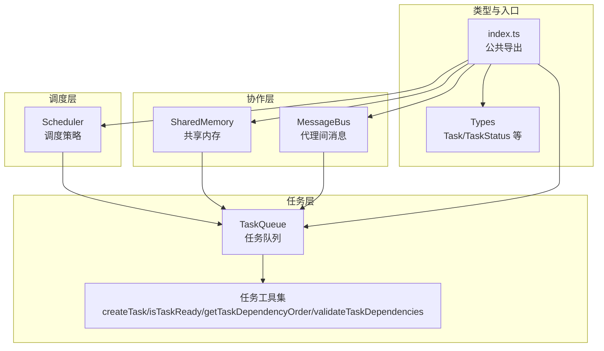
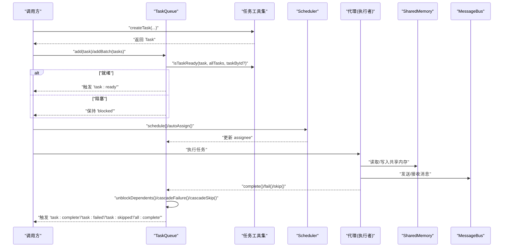
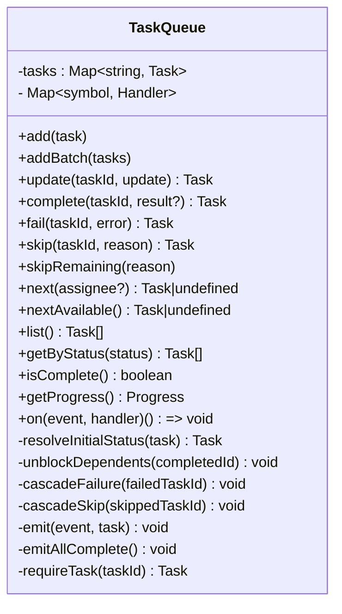
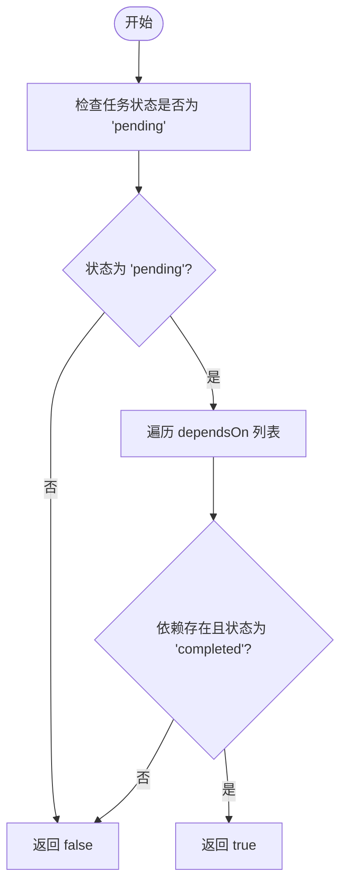
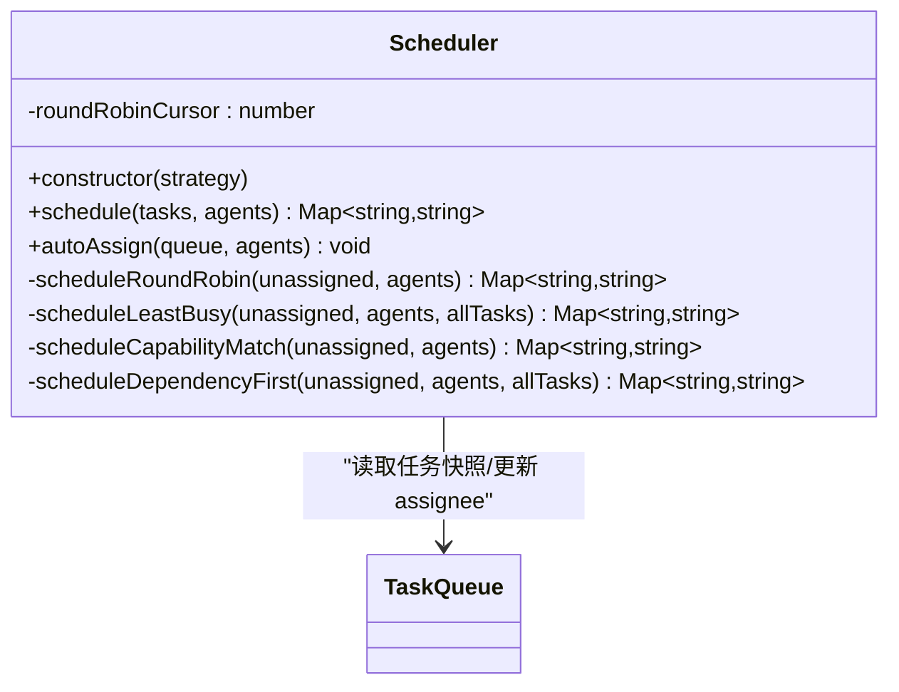
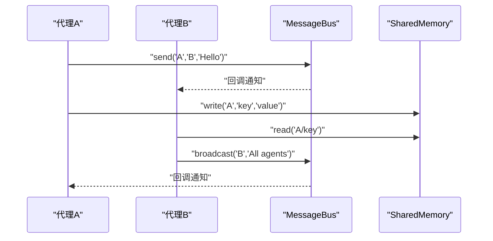
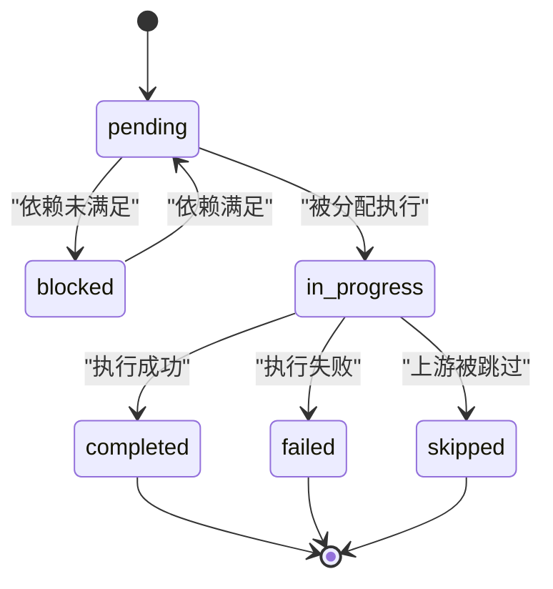
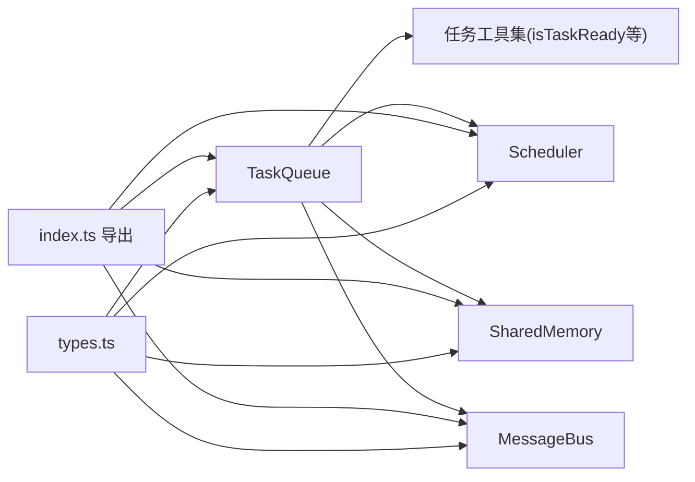

# 任务队列管理

<cite>
**本文引用的文件列表**
- [queue.ts](file://src/task/queue.ts)
- [task.ts](file://src/task/task.ts)
- [scheduler.ts](file://src/orchestrator/scheduler.ts)
- [shared.ts](file://src/memory/shared.ts)
- [types.ts](file://src/types.ts)
- [messaging.ts](file://src/team/messaging.ts)
- [index.ts](file://src/index.ts)
- [task-queue.test.ts](file://tests/task-queue.test.ts)
- [03-task-pipeline.ts](file://examples/03-task-pipeline.ts)
- [10-task-retry.ts](file://examples/10-task-retry.ts)
- [11-trace-observability.ts](file://examples/11-trace-observability.ts)
</cite>

## 目录
1. [简介](#简介)
2. [项目结构](#项目结构)
3. [核心组件](#核心组件)
4. [架构总览](#架构总览)
5. [详细组件分析](#详细组件分析)
6. [依赖关系分析](#依赖关系分析)
7. [性能考量](#性能考量)
8. [故障排查指南](#故障排查指南)
9. [结论](#结论)
10. [附录](#附录)

## 简介
本文件面向任务队列管理系统，聚焦 TaskQueue 类的设计与实现，涵盖任务添加、状态管理、依赖解析、优先级排序等关键能力。文档同时解释任务状态转换机制（pending、in_progress、completed、failed、blocked、skipped）、依赖关系建立与解析算法、任务提示构建过程中的共享内存上下文注入与代理间消息传递，并提供可直接定位到源码的示例路径，帮助读者快速上手与深度使用。

## 项目结构
任务队列相关代码主要位于以下模块：
- 任务队列与工具：src/task/queue.ts、src/task/task.ts
- 调度策略：src/orchestrator/scheduler.ts
- 共享内存：src/memory/shared.ts
- 类型定义：src/types.ts
- 代理间消息：src/team/messaging.ts
- 公共导出入口：src/index.ts
- 测试与示例：tests/task-queue.test.ts、examples/03-task-pipeline.ts、examples/10-task-retry.ts、examples/11-trace-observability.ts

图表来源
- [queue.ts:55-465](file://src/task/queue.ts#L55-L465)
- [task.ts:1-240](file://src/task/task.ts#L1-L240)
- [scheduler.ts:127-353](file://src/orchestrator/scheduler.ts#L127-L353)
- [shared.ts:36-182](file://src/memory/shared.ts#L36-L182)
- [messaging.ts:68-233](file://src/team/messaging.ts#L68-L233)
- [types.ts:336-358](file://src/types.ts#L336-L358)
- [index.ts:83-85](file://src/index.ts#L83-L85)

章节来源
- [queue.ts:1-465](file://src/task/queue.ts#L1-L465)
- [task.ts:1-240](file://src/task/task.ts#L1-L240)
- [scheduler.ts:1-353](file://src/orchestrator/scheduler.ts#L1-L353)
- [shared.ts:1-182](file://src/memory/shared.ts#L1-L182)
- [messaging.ts:1-233](file://src/team/messaging.ts#L1-L233)
- [types.ts:336-358](file://src/types.ts#L336-L358)
- [index.ts:83-85](file://src/index.ts#L83-L85)

## 核心组件
- TaskQueue：事件驱动的任务队列，负责任务生命周期管理、依赖阻塞解除、级联失败/跳过传播、进度统计与事件发布。
- 任务工具集：createTask、isTaskReady、getTaskDependencyOrder、validateTaskDependencies，提供任务创建、就绪判断、拓扑排序与依赖校验。
- Scheduler：调度器，支持轮询、最少忙碌、能力匹配、关键路径优先四种策略，将待执行任务映射到可用代理。
- SharedMemory：团队共享内存，按代理命名空间写入键值，生成摘要注入到代理上下文。
- MessageBus：代理间消息总线，支持点对点与广播，维护未读状态与订阅回调。
- 类型系统：Task、TaskStatus 等核心类型定义，确保跨模块一致性。

章节来源
- [queue.ts:55-465](file://src/task/queue.ts#L55-L465)
- [task.ts:29-92](file://src/task/task.ts#L29-L92)
- [scheduler.ts:127-353](file://src/orchestrator/scheduler.ts#L127-L353)
- [shared.ts:36-182](file://src/memory/shared.ts#L36-L182)
- [messaging.ts:68-233](file://src/team/messaging.ts#L68-L233)
- [types.ts:336-358](file://src/types.ts#L336-L358)

## 架构总览
下图展示了从任务创建、加入队列、依赖解析、调度分配、执行完成到事件通知的完整流程。

图表来源
- [queue.ts:74-178](file://src/task/queue.ts#L74-L178)
- [task.ts:76-92](file://src/task/task.ts#L76-L92)
- [scheduler.ts:157-198](file://src/orchestrator/scheduler.ts#L157-L198)
- [shared.ts:58-159](file://src/memory/shared.ts#L58-L159)
- [messaging.ts:96-231](file://src/team/messaging.ts#L96-L231)

## 详细组件分析

### TaskQueue 设计与实现
- 任务状态与事件
  - 状态：pending、in_progress、completed、failed、blocked、skipped。
  - 事件：task:ready、task:complete、task:failed、task:skipped、all:complete。
- 任务添加与初始状态
  - add/addBatch：根据当前队列中依赖是否满足，将任务置为 pending 或 blocked；pending 时立即触发 task:ready。
- 状态变更与传播
  - complete：标记完成并触发 task:complete，随后扫描所有 blocked 任务，对满足条件的任务进行 unblock 并触发 task:ready；若全部终止则触发 all:complete。
  - fail：标记失败并触发 task:failed，递归级联失败下游依赖；同样在完成后检查 all:complete。
  - skip/skipRemaining：标记跳过并触发 task:skipped，递归级联跳过下游依赖；批量跳过剩余非终止任务。
- 查询与进度
  - next/nextAvailable：按代理或无代理优先选择下一个 pending 任务。
  - list/getByStatus：快照式列出任务或按状态过滤。
  - getProgress：统计 total/completed/failed/skipped/inProgress/pending/blocked 数量。
- 依赖解析与阻塞解除
  - resolveInitialStatus：基于 isTaskReady 判断初始状态。
  - unblockDependents：扫描 blocked 任务，利用预建 taskById 映射 O(n) 检查就绪并提升为 pending，触发 task:ready。
- 事件系统
  - on：订阅事件，返回取消订阅函数；内部以 symbol 作为唯一标识符，避免重复监听。
- 错误处理
  - requireTask：当任务不存在时抛出错误，保证 update/complete/fail/skip 的健壮性。

图表来源
- [queue.ts:55-465](file://src/task/queue.ts#L55-L465)

章节来源
- [queue.ts:55-465](file://src/task/queue.ts#L55-L465)

### 任务工具集：依赖解析与拓扑排序
- createTask：生成带 UUID 的新任务，默认 pending，记录创建/更新时间戳，支持重试参数。
- isTaskReady：判断任务是否可立即开始，要求 status 为 pending 且所有依赖均已完成；缺失依赖视为不可解析。
- getTaskDependencyOrder：基于 Kahn 算法的拓扑排序，返回依赖满足顺序；可与 validateTaskDependencies 配合使用。
- validateTaskDependencies：检测未知依赖、自依赖与环依赖，返回 valid 与错误列表。

图表来源
- [task.ts:76-92](file://src/task/task.ts#L76-L92)

章节来源
- [task.ts:29-92](file://src/task/task.ts#L29-L92)
- [task.ts:115-160](file://src/task/task.ts#L115-L160)
- [task.ts:184-240](file://src/task/task.ts#L184-L240)

### 调度器：策略与分配
- 四种策略
  - round-robin：按代理索引循环分配。
  - least-busy：选择当前 in_progress 最少的代理。
  - capability-match：基于关键词重叠评分，匹配任务描述与代理角色/系统提示。
  - dependency-first：按“被多少下游任务阻塞”的数量排序，优先分配关键路径任务。
- autoAssign：从队列快照中筛选 pending 且未分配的任务，应用策略并更新 assignee。
- 关键算法
  - countBlockedDependents：正向 BFS 计算某任务能“解救”多少下游任务。
  - extractKeywords/keywordScore：提取关键词并计算重叠分数。

图表来源
- [scheduler.ts:127-353](file://src/orchestrator/scheduler.ts#L127-L353)
- [queue.ts:187-198](file://src/task/queue.ts#L187-L198)

章节来源
- [scheduler.ts:127-353](file://src/orchestrator/scheduler.ts#L127-L353)

### 共享内存与代理间消息
- SharedMemory
  - 命名空间写入：写入时自动加上 agentName/ 前缀，便于溯源与去重。
  - 摘要生成：按代理分组输出人类可读摘要，适合注入到代理上下文窗口。
  - 存储访问：暴露底层 MemoryStore 接口，便于扩展持久化。
- MessageBus
  - 发送/广播：支持点对点与广播，消息保留以便回放与审计。
  - 未读跟踪：按代理维护已读集合，提供未读消息查询。
  - 订阅：按代理订阅回调，返回取消订阅函数。

图表来源
- [shared.ts:58-159](file://src/memory/shared.ts#L58-L159)
- [messaging.ts:96-231](file://src/team/messaging.ts#L96-L231)

章节来源
- [shared.ts:36-182](file://src/memory/shared.ts#L36-L182)
- [messaging.ts:68-233](file://src/team/messaging.ts#L68-L233)

### 任务状态转换机制
- pending：初始状态，等待依赖满足。
- blocked：存在未完成依赖，保持阻塞。
- in_progress：已分配给代理执行（由外部执行器推进）。
- completed：成功完成，触发 unblock 与后续事件。
- failed：执行失败，触发级联失败。
- skipped：上游被跳过，触发级联跳过。

图表来源
- [queue.ts:131-178](file://src/task/queue.ts#L131-L178)
- [queue.ts:212-243](file://src/task/queue.ts#L212-L243)

章节来源
- [queue.ts:131-178](file://src/task/queue.ts#L131-L178)
- [queue.ts:212-243](file://src/task/queue.ts#L212-L243)

### 依赖关系建立与解析算法
- 建立依赖：在任务对象的 dependsOn 中声明上游任务 ID（建议使用稳定字符串，便于跨批排序与引用）。
- 解析算法：isTaskReady 对每个依赖检查是否存在且状态为 completed；getTaskDependencyOrder 使用 Kahn 算法进行拓扑排序；validateTaskDependencies 通过两次遍历检测未知依赖、自依赖与环依赖。
- 批次插入：addBatch 逐个插入，依赖满足顺序可通过 getTaskDependencyOrder 预先排序，避免中间态错误。

章节来源
- [task.ts:76-92](file://src/task/task.ts#L76-L92)
- [task.ts:115-160](file://src/task/task.ts#L115-L160)
- [task.ts:184-240](file://src/task/task.ts#L184-L240)
- [queue.ts:90-94](file://src/task/queue.ts#L90-L94)
- [queue.ts:402-410](file://src/task/queue.ts#L402-L410)

### 任务提示构建与上下文注入
- 共享内存摘要：SharedMemory.getSummary 生成按代理分组的摘要文本，适合注入到代理系统提示或用户消息中，使代理了解团队知识。
- 代理间消息：MessageBus 支持代理间通信，便于在执行过程中交换信息，减少对共享存储的耦合。
- 上下文注入：在代理执行前，将 SharedMemory 摘要拼接到系统提示或用户消息中，形成统一的团队上下文。

章节来源
- [shared.ts:107-159](file://src/memory/shared.ts#L107-L159)
- [messaging.ts:68-233](file://src/team/messaging.ts#L68-L233)

### 使用示例与最佳实践
- 创建任务与设置依赖
  - 参考示例：[03-task-pipeline.ts:114-166](file://examples/03-task-pipeline.ts#L114-L166)
  - 工具函数：[task.ts:29-53](file://src/task/task.ts#L29-L53)
- 查询任务状态与进度
  - 参考示例：[03-task-pipeline.ts:64-92](file://examples/03-task-pipeline.ts#L64-L92)
  - 查询接口：[queue.ts:255-320](file://src/task/queue.ts#L255-L320)
- 事件订阅与回调
  - 参考示例：[03-task-pipeline.ts:64-92](file://examples/03-task-pipeline.ts#L64-L92)
  - 事件注册：[queue.ts:378-392](file://src/task/queue.ts#L378-L392)
- 重试与可观测性
  - 参考示例：[10-task-retry.ts:47-67](file://examples/10-task-retry.ts#L47-L67)
  - 参考示例：[11-trace-observability.ts:45-74](file://examples/11-trace-observability.ts#L45-L74)
- 调度策略选择
  - 参考实现：[scheduler.ts:157-198](file://src/orchestrator/scheduler.ts#L157-L198)

章节来源
- [03-task-pipeline.ts:64-92](file://examples/03-task-pipeline.ts#L64-L92)
- [03-task-pipeline.ts:114-166](file://examples/03-task-pipeline.ts#L114-L166)
- [10-task-retry.ts:47-67](file://examples/10-task-retry.ts#L47-L67)
- [11-trace-observability.ts:45-74](file://examples/11-trace-observability.ts#L45-L74)
- [task.ts:29-53](file://src/task/task.ts#L29-L53)
- [queue.ts:255-320](file://src/task/queue.ts#L255-L320)
- [queue.ts:378-392](file://src/task/queue.ts#L378-L392)
- [scheduler.ts:157-198](file://src/orchestrator/scheduler.ts#L157-L198)

## 依赖关系分析
- 组件内聚与耦合
  - TaskQueue 与任务工具集紧密耦合，通过 isTaskReady 实现依赖解析；与调度器通过队列快照交互；与共享内存、消息总线通过执行阶段协作。
- 外部依赖
  - 类型系统来自 types.ts，确保跨模块一致的 Task/TaskStatus 定义。
  - 公共导出入口 index.ts 将 TaskQueue、Scheduler、SharedMemory、MessageBus 等统一导出，便于消费者使用。

图表来源
- [queue.ts:9-10](file://src/task/queue.ts#L9-L10)
- [task.ts:9-10](file://src/task/task.ts#L9-L10)
- [scheduler.ts:16-17](file://src/orchestrator/scheduler.ts#L16-L17)
- [shared.ts:10-11](file://src/memory/shared.ts#L10-L11)
- [messaging.ts](file://src/team/messaging.ts#L9)
- [index.ts:83-85](file://src/index.ts#L83-L85)
- [types.ts:336-358](file://src/types.ts#L336-L358)

章节来源
- [index.ts:83-85](file://src/index.ts#L83-L85)
- [types.ts:336-358](file://src/types.ts#L336-L358)

## 性能考量
- 依赖解析复杂度
  - isTaskReady 在单次调用中构建 id→task 映射，避免重复开销；在循环中传入预建映射可将 O(n²) 降为 O(n)。
  - unblockDependents 一次性扫描全量任务并维护映射，确保 O(n) 扫描。
- 拓扑排序
  - getTaskDependencyOrder 使用 Kahn 算法，时间复杂度 O(V+E)，适合大规模任务图。
- 调度策略
  - least-busy 与 capability-match 需要遍历代理负载或关键词评分，建议在任务批次较小或代理数量有限时使用。
  - dependency-first 通过 countBlockedDependents 进行一次 BFS，适合长链路管线。
- 内存与事件
  - 事件监听器使用 symbol 作为键，避免冲突；取消订阅为幂等操作，降低泄漏风险。
- 建议
  - 大规模任务图：先 validateTaskDependencies，再 getTaskDependencyOrder，最后 addBatch。
  - 高并发场景：结合 Scheduler 的 least-busy 或 dependency-first，配合队列 getProgress 动态观察。
  - 观测性：启用 onProgress/onTrace，结合 SharedMemory 摘要与 MessageBus 日志，快速定位瓶颈。

[本节为通用性能指导，不直接分析具体文件]

## 故障排查指南
- 任务未进入 pending
  - 检查 dependsOn 是否引用了不存在的 ID；使用 validateTaskDependencies 获取错误列表。
  - 参考测试用例：[task-queue.test.ts:192-230](file://tests/task-queue.test.ts#L192-L230)
- 依赖未解除阻塞
  - 确认上游任务确实完成（status 为 completed）；检查 isTaskReady 的依赖条件。
  - 参考测试用例：[task-queue.test.ts:74-89](file://tests/task-queue.test.ts#L74-L89)
- 级联失败/跳过异常
  - 检查 fail/skip 的调用时机与参数；确认下游依赖链是否正确。
  - 参考测试用例：[task-queue.test.ts:95-131](file://tests/task-queue.test.ts#L95-L131)
- 事件未触发
  - 确认订阅是否正确；检查取消订阅后是否再次订阅。
  - 参考测试用例：[task-queue.test.ts:218-229](file://tests/task-queue.test.ts#L218-L229)
- 任务不存在错误
  - complete/fail/skip 前确保任务 ID 正确；使用 list/getByStatus 校验状态。
  - 参考测试用例：[task-queue.test.ts:235-243](file://tests/task-queue.test.ts#L235-L243)

章节来源
- [task-queue.test.ts:95-131](file://tests/task-queue.test.ts#L95-L131)
- [task-queue.test.ts:218-229](file://tests/task-queue.test.ts#L218-L229)
- [task-queue.test.ts:235-243](file://tests/task-queue.test.ts#L235-L243)

## 结论
TaskQueue 提供了事件驱动、依赖感知、可扩展的多状态任务管理能力；配合任务工具集、调度器、共享内存与消息总线，能够支撑复杂的多代理协作流水线。通过拓扑排序与依赖校验，系统在设计阶段即能规避环依赖与未知依赖；运行期通过级联失败/跳过与进度统计，保障任务流的可观测与可控。建议在生产环境中结合 validateTaskDependencies、getTaskDependencyOrder 与合适的调度策略，以获得更稳定的执行体验。

[本节为总结性内容，不直接分析具体文件]

## 附录
- 类型定义参考：Task、TaskStatus、OrchestratorEvent、TraceEvent 等。
- 公共导出参考：TaskQueue、Scheduler、SharedMemory、MessageBus 等。

章节来源
- [types.ts:336-358](file://src/types.ts#L336-L358)
- [index.ts:83-85](file://src/index.ts#L83-L85)