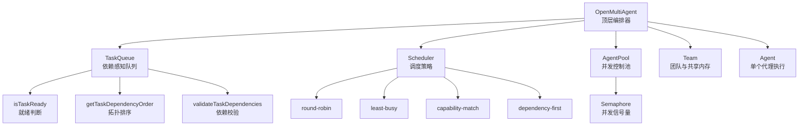
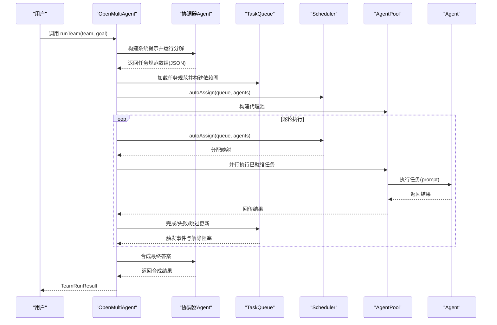
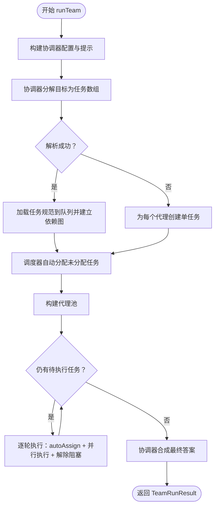
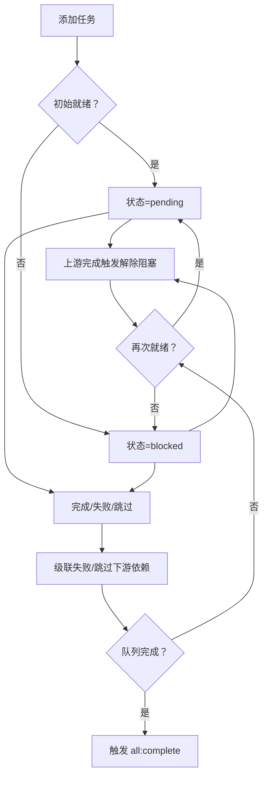
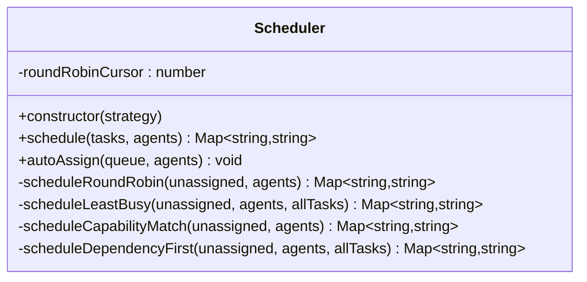
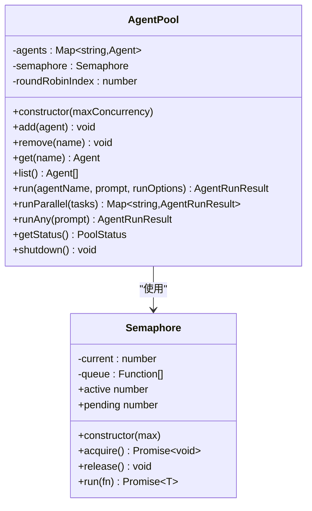
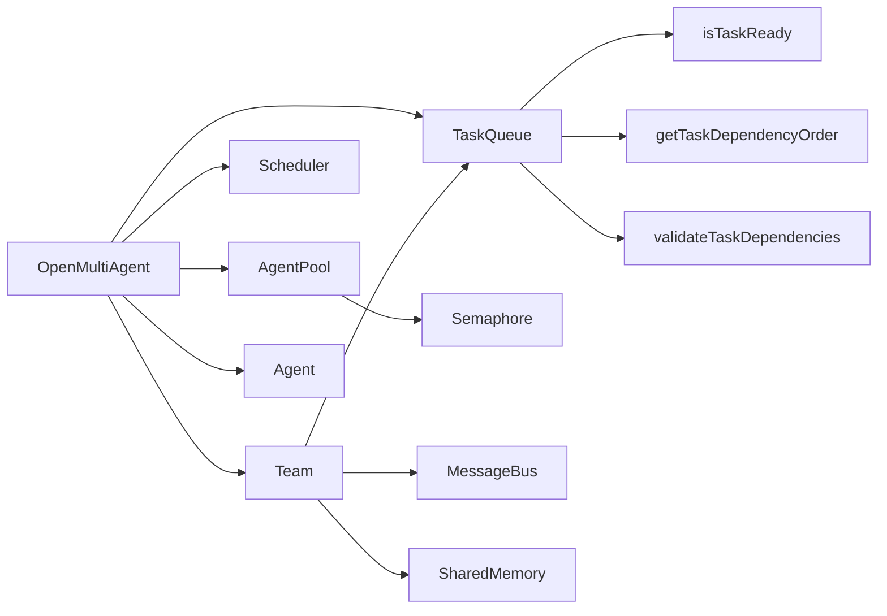

# 编排器系统

<cite>
**本文引用的文件**
- [orchestrator.ts](file://src/orchestrator/orchestrator.ts)
- [scheduler.ts](file://src/orchestrator/scheduler.ts)
- [team.ts](file://src/team/team.ts)
- [queue.ts](file://src/task/queue.ts)
- [task.ts](file://src/task/task.ts)
- [pool.ts](file://src/agent/pool.ts)
- [agent.ts](file://src/agent/agent.ts)
- [semaphore.ts](file://src/utils/semaphore.ts)
- [02-team-collaboration.ts](file://examples/02-team-collaboration.ts)
- [03-task-pipeline.ts](file://examples/03-task-pipeline.ts)
- [orchestrator.test.ts](file://tests/orchestrator.test.ts)
- [scheduler.test.ts](file://tests/scheduler.test.ts)
</cite>

## 目录
1. [简介](#简介)
2. [项目结构](#项目结构)
3. [核心组件](#核心组件)
4. [架构总览](#架构总览)
5. [详细组件分析](#详细组件分析)
6. [依赖关系分析](#依赖关系分析)
7. [性能考量](#性能考量)
8. [故障排除指南](#故障排除指南)
9. [结论](#结论)
10. [附录：使用示例与最佳实践](#附录使用示例与最佳实践)

## 简介
本文件面向 Open Multi-Agent 框架的编排器系统，重点围绕 OpenMultiAgent 类及其子系统（任务队列、调度器、代理池、团队协作）进行深入解析。文档将详细说明：
- 任务队列管理与依赖解析算法
- 调度策略（轮询、最少忙碌、能力匹配、依赖优先）
- 代理池并发控制与自动分配机制
- runTeam() 的完整执行流程（协调器任务分解、依赖解析、并行执行优化、合成结果）
- 具体的使用示例与性能优化建议
- 常见问题的诊断与处理方法

## 项目结构
编排器系统位于 src/orchestrator 目录，配合 src/task、src/team、src/agent、src/utils 等模块协同工作，形成“协调器 + 任务队列 + 调度器 + 代理池”的整体架构。

图表来源
- [orchestrator.ts:514-740](file://src/orchestrator/orchestrator.ts#L514-L740)
- [scheduler.ts:127-353](file://src/orchestrator/scheduler.ts#L127-L353)
- [queue.ts:55-465](file://src/task/queue.ts#L55-L465)
- [task.ts:76-160](file://src/task/task.ts#L76-L160)
- [pool.ts:58-286](file://src/agent/pool.ts#L58-L286)
- [semaphore.ts:24-90](file://src/utils/semaphore.ts#L24-L90)

章节来源
- [orchestrator.ts:514-740](file://src/orchestrator/orchestrator.ts#L514-L740)
- [scheduler.ts:127-353](file://src/orchestrator/scheduler.ts#L127-L353)
- [queue.ts:55-465](file://src/task/queue.ts#L55-L465)
- [task.ts:76-160](file://src/task/task.ts#L76-L160)
- [pool.ts:58-286](file://src/agent/pool.ts#L58-L286)
- [semaphore.ts:24-90](file://src/utils/semaphore.ts#L24-L90)

## 核心组件
- OpenMultiAgent：顶层编排器，负责团队管理、协调器任务分解、执行队列、进度回调与可观测性。
- TaskQueue：依赖感知的任务队列，支持就绪/阻塞/完成/失败/跳过状态转换与事件广播。
- Scheduler：四种调度策略（轮询、最少忙碌、能力匹配、依赖优先），用于将未分配的待执行任务映射到可用代理。
- AgentPool：并发控制代理池，基于信号量限制最大并发数，提供并行执行与轮询派发能力。
- Team：团队容器，维护代理名单、消息总线、任务队列与共享内存，并提供事件总线。
- Agent：单个代理执行单元，封装对话历史、工具调用、流式输出与生命周期状态。

章节来源
- [orchestrator.ts:514-740](file://src/orchestrator/orchestrator.ts#L514-L740)
- [queue.ts:55-465](file://src/task/queue.ts#L55-L465)
- [scheduler.ts:127-353](file://src/orchestrator/scheduler.ts#L127-L353)
- [pool.ts:58-286](file://src/agent/pool.ts#L58-L286)
- [team.ts:88-335](file://src/team/team.ts#L88-L335)
- [agent.ts:81-623](file://src/agent/agent.ts#L81-L623)

## 架构总览
编排器系统采用“协调器 + 任务队列 + 调度器 + 代理池”的分层设计：
- 协调器（临时）接收高层目标，生成任务规范（含标题、描述、可选指派者与依赖），写入任务队列。
- 调度器根据策略为未分配任务选择代理；随后由代理池并发执行。
- 任务完成后自动解除下游阻塞，进入下一轮调度；支持审批门控与重试机制。
- 结果通过共享内存与消息总线在团队内传播，最终由协调器合成最终答案。

图表来源
- [orchestrator.ts:641-740](file://src/orchestrator/orchestrator.ts#L641-L740)
- [orchestrator.ts:280-464](file://src/orchestrator/orchestrator.ts#L280-L464)
- [scheduler.ts:187-198](file://src/orchestrator/scheduler.ts#L187-L198)
- [queue.ts:131-158](file://src/task/queue.ts#L131-L158)

章节来源
- [orchestrator.ts:641-740](file://src/orchestrator/orchestrator.ts#L641-L740)
- [orchestrator.ts:280-464](file://src/orchestrator/orchestrator.ts#L280-L464)
- [scheduler.ts:187-198](file://src/orchestrator/scheduler.ts#L187-L198)
- [queue.ts:131-158](file://src/task/queue.ts#L131-L158)

## 详细组件分析

### OpenMultiAgent 类与 runTeam() 流程
- 团队管理：createTeam() 注册团队，内部以名称索引存储 Team 实例。
- 单代理执行：runAgent() 构造一次性 Agent 执行单次提示，适合简单查询。
- 自动编排执行：runTeam() 是核心入口，包含以下步骤：
  1) 协调器分解：构造临时协调器 Agent，基于团队代理清单与系统提示，要求其输出结构化的任务数组。
  2) 任务加载：若协调器输出可解析，则按标题映射依赖 ID，构建任务队列；否则回退为每个代理一个任务。
  3) 自动分配：调度器对未分配的待执行任务进行分配。
  4) 并行执行：构建代理池，逐轮调度待执行任务，等待所有任务完成或全部阻塞/失败。
  5) 审批门控：每轮结束后，若配置了 onApproval，可决定是否继续下一轮。
  6) 合成结果：协调器基于任务结果合成最终答案。
  7) 返回 TeamRunResult，包含成功标志、聚合令牌用量与各代理结果。

图表来源
- [orchestrator.ts:641-740](file://src/orchestrator/orchestrator.ts#L641-L740)
- [orchestrator.ts:280-464](file://src/orchestrator/orchestrator.ts#L280-L464)

章节来源
- [orchestrator.ts:641-740](file://src/orchestrator/orchestrator.ts#L641-L740)
- [orchestrator.ts:280-464](file://src/orchestrator/orchestrator.ts#L280-L464)

### 任务队列与依赖解析
- 状态机：pending → blocked → pending（依赖满足后）→ completed/failed/skipped。
- 就绪判断：isTaskReady() 检查任务依赖是否全部完成，缺失依赖视为不可解析。
- 拓扑排序：getTaskDependencyOrder() 使用 Kahn 算法对任务进行拓扑排序，便于顺序执行。
- 依赖校验：validateTaskDependencies() 检测未知依赖、自依赖与环形依赖。
- 事件驱动：add()/complete()/fail()/skip() 触发 task:ready/task:complete/task:failed/task:skipped/all:complete 等事件。

图表来源
- [queue.ts:74-203](file://src/task/queue.ts#L74-L203)
- [queue.ts:419-441](file://src/task/queue.ts#L419-L441)
- [task.ts:76-92](file://src/task/task.ts#L76-L92)
- [task.ts:115-160](file://src/task/task.ts#L115-L160)
- [task.ts:184-240](file://src/task/task.ts#L184-L240)

章节来源
- [queue.ts:74-203](file://src/task/queue.ts#L74-L203)
- [queue.ts:419-441](file://src/task/queue.ts#L419-L441)
- [task.ts:76-92](file://src/task/task.ts#L76-L92)
- [task.ts:115-160](file://src/task/task.ts#L115-L160)
- [task.ts:184-240](file://src/task/task.ts#L184-L240)

### 调度器与自动分配机制
- 四种策略：
  - round-robin：按游标循环分配，适合均衡负载。
  - least-busy：统计 in_progress 数量，优先分配给最空闲代理。
  - capability-match：基于关键词重叠评分，优先分配给更匹配的代理；无正分时回退。
  - dependency-first：计算每个任务被多少下游依赖阻塞，优先分配阻断更多任务，减少整体延迟。
- autoAssign()：直接将分配结果写回到 TaskQueue 中，保证一致性。

图表来源
- [scheduler.ts:127-353](file://src/orchestrator/scheduler.ts#L127-L353)

章节来源
- [scheduler.ts:127-353](file://src/orchestrator/scheduler.ts#L127-L353)

### 代理池并发控制策略
- 基于 Semaphore 的计数信号量，限制并发执行上限。
- 提供 run()（单任务）、runParallel()（并行执行多任务）、runAny()（轮询派发）等接口。
- 支持获取池状态（总数、空闲、运行中、已完成、错误）。

图表来源
- [pool.ts:58-286](file://src/agent/pool.ts#L58-L286)
- [semaphore.ts:24-90](file://src/utils/semaphore.ts#L24-L90)

章节来源
- [pool.ts:58-286](file://src/agent/pool.ts#L58-L286)
- [semaphore.ts:24-90](file://src/utils/semaphore.ts#L24-L90)

### 团队协作与消息总线
- Team 维护代理清单、消息总线、任务队列与共享内存。
- 提供点对点 sendMessage()/broadcast() 与 getMessages()。
- 队列事件桥接至团队事件总线，便于外部订阅。

章节来源
- [team.ts:88-335](file://src/team/team.ts#L88-L335)

### 单个代理执行与工具链
- Agent 封装对话历史、工具注册、结构化输出验证、流式输出与生命周期状态。
- 支持 beforeRun/afterRun 钩子，动态注册/注销工具，持久化历史与令牌用量统计。

章节来源
- [agent.ts:81-623](file://src/agent/agent.ts#L81-L623)

## 依赖关系分析
- OpenMultiAgent 依赖 Team、TaskQueue、Scheduler、AgentPool、Agent、ToolRegistry/ToolExecutor。
- TaskQueue 依赖 isTaskReady、getTaskDependencyOrder、validateTaskDependencies。
- Scheduler 依赖 TaskQueue（仅读取任务快照）。
- AgentPool 依赖 Semaphore。
- Team 内部组合 TaskQueue、MessageBus、SharedMemory。

图表来源
- [orchestrator.ts:61-66](file://src/orchestrator/orchestrator.ts#L61-L66)
- [queue.ts:9-10](file://src/task/queue.ts#L9-L10)
- [task.ts:9-10](file://src/task/task.ts#L9-L10)
- [pool.ts:24-26](file://src/agent/pool.ts#L24-L26)
- [team.ts:18-22](file://src/team/team.ts#L18-L22)

章节来源
- [orchestrator.ts:61-66](file://src/orchestrator/orchestrator.ts#L61-L66)
- [queue.ts:9-10](file://src/task/queue.ts#L9-L10)
- [task.ts:9-10](file://src/task/task.ts#L9-L10)
- [pool.ts:24-26](file://src/agent/pool.ts#L24-L26)
- [team.ts:18-22](file://src/team/team.ts#L18-L22)

## 性能考量
- 并发控制：通过 AgentPool 的 Semaphore 控制全局并发，避免资源争用与超载。
- 依赖优先调度：dependency-first 可显著减少关键路径上的等待时间，提升吞吐。
- 能力匹配：capability-match 在任务与代理角色匹配度高时，可减少无效尝试与重试成本。
- 最少忙碌：least-busy 在任务类型多样且负载不均时，有助于平衡代理负载。
- 事件驱动：TaskQueue 的事件机制避免轮询，降低 CPU 开销。
- 重试与指数退避：executeWithRetry 提供可配置的重试策略，累积令牌用量以准确计量成本。
- 拓扑排序：getTaskDependencyOrder 可预排序任务，减少依赖解析开销。

[本节为通用指导，无需特定文件来源]

## 故障排除指南
- 协调器输出不可解析：回退为每个代理一个任务，检查系统提示与模型输出格式。
- 任务无代理分配：确认调度策略与代理清单；使用 autoAssign() 检查未分配任务。
- 任务阻塞无法推进：检查依赖 ID 是否存在、是否形成环形依赖；使用 validateTaskDependencies() 排查。
- 并发超限导致排队：调整 maxConcurrency 或使用 least-busy 策略平衡负载。
- 审批门控拒绝：onApproval 回调返回 false 会跳过剩余任务，确保在 Promise.all() 后调用。
- 代理未找到：检查 AgentPool 中是否已注册该代理名称。
- 令牌用量异常：确认 executeWithRetry 是否正确汇总多次尝试的用量。

章节来源
- [orchestrator.ts:127-194](file://src/orchestrator/orchestrator.ts#L127-L194)
- [queue.ts:206-243](file://src/task/queue.ts#L206-L243)
- [scheduler.ts:187-198](file://src/orchestrator/scheduler.ts#L187-L198)
- [pool.ts:259-268](file://src/agent/pool.ts#L259-L268)
- [task.ts:184-240](file://src/task/task.ts#L184-L240)

## 结论
Open Multi-Agent 的编排器系统通过“协调器 + 任务队列 + 调度器 + 代理池”的解耦设计，实现了从高层目标到具体执行的自动化编排。其依赖感知的任务队列、多种调度策略与并发控制机制，使得复杂多代理协作既灵活又高效。结合事件驱动与可观测性，开发者可以轻松构建端到端的多代理流水线。

[本节为总结，无需特定文件来源]

## 附录：使用示例与最佳实践

### 示例一：团队协作（多代理流水线）
- 场景：架构师设计 → 开发者实现 → 评审员审查
- 关键点：设置 onProgress 观察任务与代理生命周期；启用 sharedMemory 以便结果共享；合理设置 maxConcurrency 以平衡吞吐与稳定性。

章节来源
- [02-team-collaboration.ts:103-168](file://examples/02-team-collaboration.ts#L103-L168)

### 示例二：显式任务流水线（依赖链）
- 场景：设计 → 实现 → 测试 + 审查（并行）
- 关键点：明确 dependsOn；利用 dependency-first 策略优先处理阻断更多任务；使用 runTasks() 直接执行显式任务列表。

章节来源
- [03-task-pipeline.ts:98-202](file://examples/03-task-pipeline.ts#L98-L202)

### 最佳实践
- 明确任务粒度：任务应足够小且可独立完成，便于并行与重试。
- 合理设置并发：根据代理能力与 LLM 速率调整 maxConcurrency，避免超载。
- 使用依赖优先策略：在复杂流水线中优先考虑 critical path，减少整体等待。
- 结构化输出：为需要稳定输出的代理配置 outputSchema，结合内置的结构化输出验证与重试。
- 事件与追踪：通过 onProgress/onTrace 记录执行轨迹，便于调试与审计。
- 审批门控：在关键阶段引入 onApproval，确保可控的阶段性推进。

[本节为通用指导，无需特定文件来源]