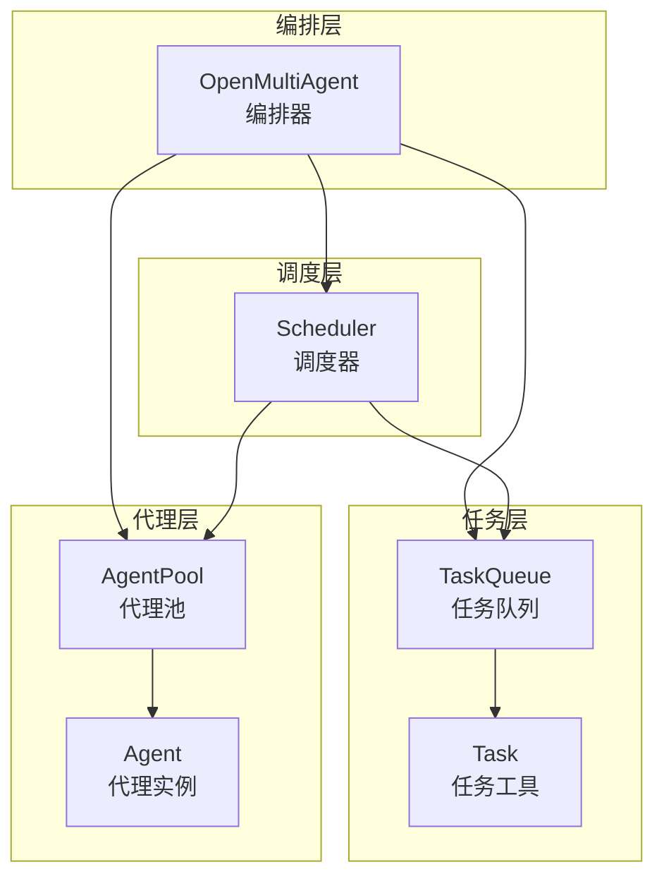
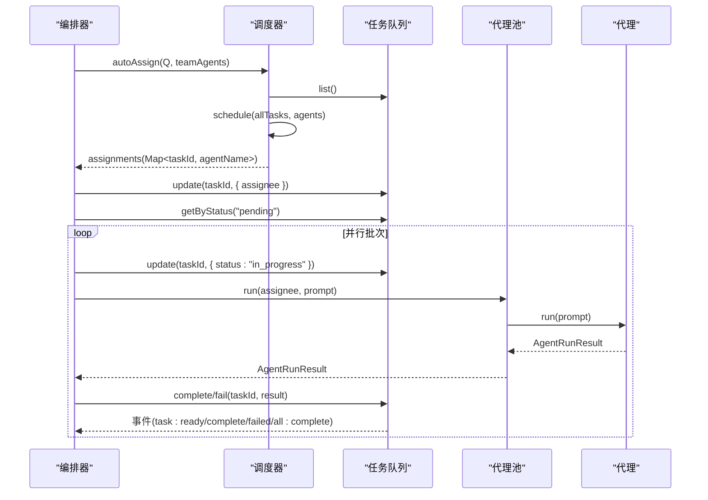
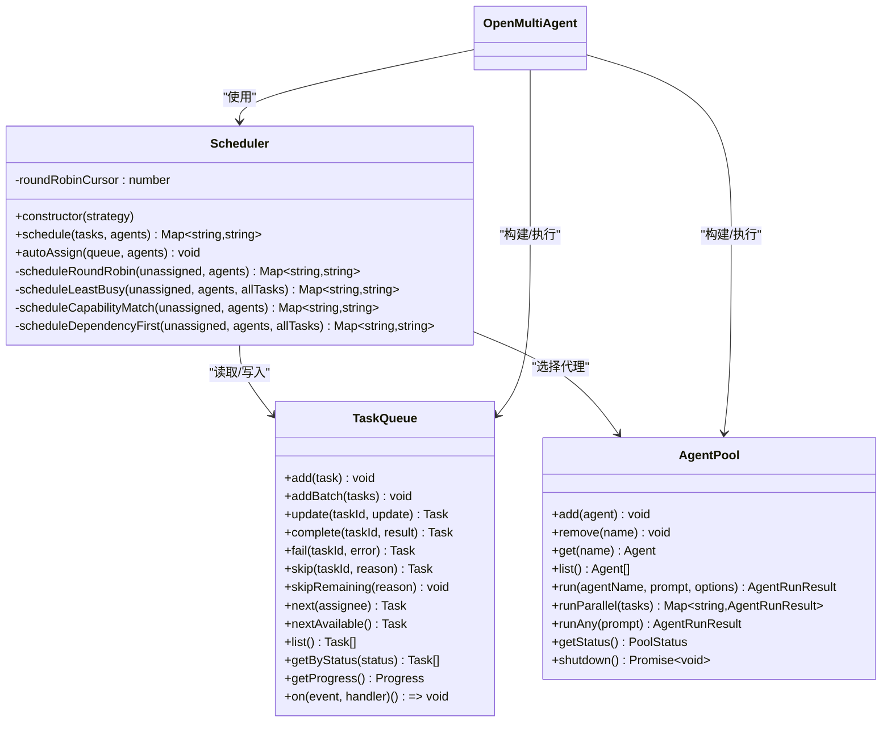
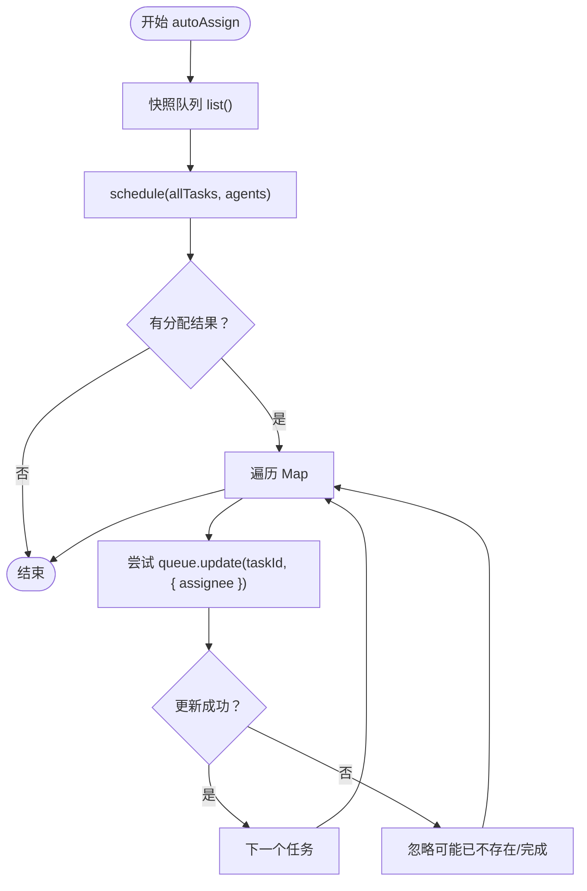
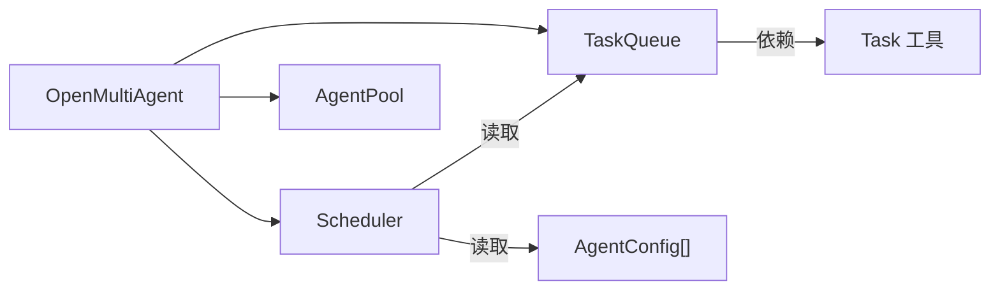

# 调度策略

<cite>
**本文引用的文件**
- [scheduler.ts](file://src/orchestrator/scheduler.ts)
- [queue.ts](file://src/task/queue.ts)
- [task.ts](file://src/task/task.ts)
- [orchestrator.ts](file://src/orchestrator/orchestrator.ts)
- [pool.ts](file://src/agent/pool.ts)
- [types.ts](file://src/types.ts)
- [scheduler.test.ts](file://tests/scheduler.test.ts)
- [02-team-collaboration.ts](file://examples/02-team-collaboration.ts)
</cite>

## 目录
1. [简介](#简介)
2. [项目结构](#项目结构)
3. [核心组件](#核心组件)
4. [架构总览](#架构总览)
5. [详细组件分析](#详细组件分析)
6. [依赖分析](#依赖分析)
7. [性能考虑](#性能考虑)
8. [故障排除指南](#故障排除指南)
9. [结论](#结论)
10. [附录](#附录)

## 简介
本文件面向调度策略系统，重点解析 Scheduler 类的设计理念与实现细节，涵盖四种调度策略：轮询（round-robin）、最少忙碌（least-busy）、能力匹配（capability-match）、依赖优先（dependency-first）。文档深入解释 autoAssign() 的工作原理，包括未分配任务的自动分配、代理可用性检查、冲突解决机制；阐明调度器与任务队列、代理池的交互关系；并提供配置、手动分配、监控调度效果的具体示例路径与最佳实践。

## 项目结构
调度策略位于 orchestrator 子系统中，与任务队列、代理池、编排器协同工作：
- 调度器：负责将待执行任务映射到可用代理
- 任务队列：维护任务生命周期、依赖关系与事件
- 代理池：并发控制、轮询派发与健康状态
- 编排器：驱动调度器与代理池在执行循环中协作

图表来源
- [orchestrator.ts:280-464](file://src/orchestrator/orchestrator.ts#L280-L464)
- [scheduler.ts:127-352](file://src/orchestrator/scheduler.ts#L127-L352)
- [queue.ts:55-464](file://src/task/queue.ts#L55-L464)
- [pool.ts:58-285](file://src/agent/pool.ts#L58-L285)

章节来源
- [orchestrator.ts:280-464](file://src/orchestrator/orchestrator.ts#L280-L464)
- [scheduler.ts:127-352](file://src/orchestrator/scheduler.ts#L127-L352)
- [queue.ts:55-464](file://src/task/queue.ts#L55-L464)
- [pool.ts:58-285](file://src/agent/pool.ts#L58-L285)

## 核心组件
- Scheduler：封装四种调度策略，提供 schedule() 与 autoAssign() 接口
- TaskQueue：维护任务状态、依赖图、事件发布与进度查询
- AgentPool：注册代理、并发限制、轮询派发与健康统计
- OpenMultiAgent：顶层编排器，协调调度器与代理池执行任务

章节来源
- [scheduler.ts:127-352](file://src/orchestrator/scheduler.ts#L127-L352)
- [queue.ts:55-464](file://src/task/queue.ts#L55-L464)
- [pool.ts:58-285](file://src/agent/pool.ts#L58-L285)
- [orchestrator.ts:514-800](file://src/orchestrator/orchestrator.ts#L514-L800)

## 架构总览
调度策略系统在执行循环中被调用，确保每次调度前对“已解阻但尚未分配”的任务进行再分配，并在并发批次执行后根据审批门控决定是否继续下一轮。

图表来源
- [orchestrator.ts:280-464](file://src/orchestrator/orchestrator.ts#L280-L464)
- [scheduler.ts:187-198](file://src/orchestrator/scheduler.ts#L187-L198)
- [queue.ts:108-158](file://src/task/queue.ts#L108-L158)
- [pool.ts:127-140](file://src/agent/pool.ts#L127-L140)

## 详细组件分析

### Scheduler 类设计与策略
- 设计理念
  - 无状态：调度器在每次调用时从任务快照与代理列表计算分配，内部不保存持久状态
  - 可插拔策略：通过构造函数选择策略，默认使用“依赖优先”
  - 纯函数式：schedule() 返回映射，autoAssign() 直接更新队列，便于测试与可观测性

- 四种策略
  - 轮询（round-robin）：按顺序分配，游标随调用前进，避免固定起点
  - 最少忙碌（least-busy）：基于当前 in_progress 计数选择负载最小的代理，同批内模拟负载以避免集中
  - 能力匹配（capability-match）：关键词重叠评分，双向评分取最大值，无正分时回退到轮询
  - 依赖优先（dependency-first）：按“被下游依赖数”排序，高优先级先选代理，同级采用轮询打散

- 关键方法
  - schedule(tasks, agents)：过滤 pending 且未分配的任务，返回 Map<taskId, agentName>
  - autoAssign(queue, agents)：对队列快照执行 schedule，逐条更新 assignee，忽略不存在或已完成的任务

- 内部辅助
  - countBlockedDependents()：BFS 正向遍历依赖图，统计某任务直接或间接阻塞的下游数量
  - keywordScore()/extractKeywords()：文本标准化、停用词过滤、关键词提取与评分

图表来源
- [scheduler.ts:127-352](file://src/orchestrator/scheduler.ts#L127-L352)
- [queue.ts:55-464](file://src/task/queue.ts#L55-L464)
- [pool.ts:58-285](file://src/agent/pool.ts#L58-L285)
- [orchestrator.ts:514-800](file://src/orchestrator/orchestrator.ts#L514-L800)

章节来源
- [scheduler.ts:127-352](file://src/orchestrator/scheduler.ts#L127-L352)
- [task.ts:76-92](file://src/task/task.ts#L76-L92)
- [scheduler.test.ts:23-79](file://tests/scheduler.test.ts#L23-L79)

### autoAssign() 工作原理详解
- 输入输出
  - 输入：TaskQueue 实例、可用代理数组
  - 输出：对队列中未分配的 pending 任务设置 assignee

- 执行流程
  1) 快照：queue.list() 获取当前所有任务
  2) 分配：调用 schedule() 计算 Map<taskId, agentName>
  3) 更新：遍历映射，对每个任务尝试 queue.update(taskId, { assignee })
  4) 容错：若任务在快照与更新之间已不存在或状态变化，则捕获异常并跳过

- 代理可用性检查
  - 在执行阶段（编排器循环）会再次校验 assignee 是否存在于代理池，否则标记失败并上报错误事件

- 冲突解决机制
  - 若任务已被分配或非 pending，schedule() 会跳过该任务
  - autoAssign() 不会覆盖已有 assignee
  - 同批内 least-busy 通过模拟负载避免同一代理被连续分配

图表来源
- [scheduler.ts:187-198](file://src/orchestrator/scheduler.ts#L187-L198)
- [queue.ts:108-120](file://src/task/queue.ts#L108-L120)

章节来源
- [scheduler.ts:187-198](file://src/orchestrator/scheduler.ts#L187-L198)
- [queue.ts:108-120](file://src/task/queue.ts#L108-L120)
- [scheduler.test.ts:190-221](file://tests/scheduler.test.ts#L190-L221)

### 策略实现要点与复杂度
- 轮询（round-robin）
  - 时间复杂度：O(U)，U 为未分配任务数
  - 特点：游标推进，跨多次调用保持均匀分布

- 最少忙碌（least-busy）
  - 初始化负载统计：O(T)，T 为全量任务数
  - 每任务选择：O(A)，A 为代理数
  - 总体：O(T + U·A)
  - 特点：同批内模拟负载，避免集中

- 能力匹配（capability-match）
  - 关键词预处理：O(K)，K 为代理总数
  - 任务评分：O(K·(T+K))，T 为任务关键词数，K 为代理关键词数
  - 无正分时回退轮询
  - 特点：基于关键词重叠，适合语义相近的任务与代理

- 依赖优先（dependency-first）
  - 依赖图反向邻接表构建：O(T)
  - BFS 统计阻塞下游：O(T + D)，D 为边数
  - 排序后轮询：O(U log U + U)
  - 特点：优先解阻关键路径，提升整体吞吐

章节来源
- [scheduler.ts:50-75](file://src/orchestrator/scheduler.ts#L50-L75)
- [scheduler.ts:211-222](file://src/orchestrator/scheduler.ts#L211-L222)
- [scheduler.ts:231-267](file://src/orchestrator/scheduler.ts#L231-L267)
- [scheduler.ts:276-315](file://src/orchestrator/scheduler.ts#L276-L315)
- [scheduler.ts:325-351](file://src/orchestrator/scheduler.ts#L325-L351)

### 与任务队列、代理池的交互
- 与任务队列
  - 读取：autoAssign 前后均依赖 queue.list() 与 getByStatus
  - 写入：autoAssign 直接更新 assignee；执行阶段更新状态并触发事件
  - 依赖解析：isTaskReady 与 unblockDependents 支持拓扑解阻

- 与代理池
  - 选择：schedule 结果映射到代理名称
  - 并发：AgentPool.run() 通过信号量控制并发
  - 轮询：AgentPool.runAny() 与 Scheduler 的轮询策略互补

章节来源
- [queue.ts:282-360](file://src/task/queue.ts#L282-L360)
- [queue.ts:419-441](file://src/task/queue.ts#L419-L441)
- [pool.ts:127-140](file://src/agent/pool.ts#L127-L140)
- [pool.ts:192-209](file://src/agent/pool.ts#L192-L209)

### 配置调度策略与手动分配示例
- 配置策略
  - 在编排器中创建调度器实例并传入策略字符串
  - 示例路径：[orchestrator.ts:680-702](file://src/orchestrator/orchestrator.ts#L680-L702)

- 手动分配任务
  - 使用 TaskQueue.add()/addBatch() 添加任务
  - 使用 Scheduler.schedule()/autoAssign() 进行分配
  - 示例路径：[scheduler.test.ts:190-221](file://tests/scheduler.test.ts#L190-L221)

- 监控调度效果
  - 通过 onProgress 回调订阅任务事件
  - 使用 queue.getProgress() 获取进度摘要
  - 示例路径：[02-team-collaboration.ts:63-97](file://examples/02-team-collaboration.ts#L63-L97)

章节来源
- [orchestrator.ts:680-702](file://src/orchestrator/orchestrator.ts#L680-L702)
- [scheduler.test.ts:190-221](file://tests/scheduler.test.ts#L190-L221)
- [02-team-collaboration.ts:63-97](file://examples/02-team-collaboration.ts#L63-L97)

## 依赖分析
- 组件耦合
  - Scheduler 仅依赖 TaskQueue 的只读接口与 AgentConfig 列表
  - 编排器在执行循环中反复调用 autoAssign，确保“解阻即分配”
  - 代理池与调度器解耦，调度器只关心名称映射

- 外部依赖
  - 任务工具 isTaskReady 用于拓扑判断
  - 类型定义 types.ts 提供 Task、AgentConfig、事件等契约

图表来源
- [scheduler.ts:157-174](file://src/orchestrator/scheduler.ts#L157-L174)
- [queue.ts:282-360](file://src/task/queue.ts#L282-L360)
- [task.ts:76-92](file://src/task/task.ts#L76-L92)
- [orchestrator.ts:280-464](file://src/orchestrator/orchestrator.ts#L280-L464)

章节来源
- [scheduler.ts:157-174](file://src/orchestrator/scheduler.ts#L157-L174)
- [task.ts:76-92](file://src/task/task.ts#L76-L92)
- [orchestrator.ts:280-464](file://src/orchestrator/orchestrator.ts#L280-L464)

## 性能考虑
- 策略选择
  - 复杂多步骤流水线：推荐“依赖优先”，减少关键路径等待
  - 任务语义明确：推荐“能力匹配”，提高任务-代理契合度
  - 负载均衡：推荐“最少忙碌”，结合同批模拟负载避免集中
  - 公平分配：推荐“轮询”，简单高效

- 复杂度优化
  - least-busy：预构建 in_progress 映射，单次扫描初始化
  - capability-match：预计算代理关键词，避免重复提取
  - dependency-first：BFS 反向邻接表，避免重复遍历

- 并发与吞吐
  - 编排器每轮并行执行 pending 任务，完成后统一 unblock
  - 代理池通过信号量限制并发，避免资源争用

- 观测与调试
  - onProgress 提供细粒度事件流
  - queue.getProgress 提供全局进度指标

[本节为通用指导，无需特定文件来源]

## 故障排除指南
- 任务未分配
  - 检查 autoAssign 是否在执行循环中被调用
  - 确认任务状态为 pending 且未被其他逻辑覆盖 assignee
  - 参考：[scheduler.test.ts:190-221](file://tests/scheduler.test.ts#L190-L221)

- 代理不存在
  - 执行阶段会检测 assignee 是否存在于代理池，不存在则标记失败
  - 参考：[orchestrator.ts:331-342](file://src/orchestrator/orchestrator.ts#L331-L342)

- 依赖循环或未知依赖
  - 使用 validateTaskDependencies 检测循环与未知引用
  - 参考：[task.ts:184-239](file://src/task/task.ts#L184-L239)

- 调度不均衡
  - least-busy 同批内已模拟负载，如仍不均衡可切换策略或调整并发
  - 参考：[scheduler.ts:231-267](file://src/orchestrator/scheduler.ts#L231-L267)

- 事件丢失或回调异常
  - onProgress 与 onTrace 的回调异常会被吞没，不影响执行
  - 参考：[orchestrator.ts:362-398](file://src/orchestrator/orchestrator.ts#L362-L398)

章节来源
- [scheduler.test.ts:190-221](file://tests/scheduler.test.ts#L190-L221)
- [orchestrator.ts:331-342](file://src/orchestrator/orchestrator.ts#L331-L342)
- [task.ts:184-239](file://src/task/task.ts#L184-L239)
- [orchestrator.ts:362-398](file://src/orchestrator/orchestrator.ts#L362-L398)

## 结论
Scheduler 通过“无状态 + 策略可插拔”的设计，将任务分配与执行解耦，配合 TaskQueue 的依赖解析与 AgentPool 的并发控制，形成高效的多代理调度体系。autoAssign() 在执行循环中确保“解阻即分配”，并在容错与冲突处理上提供了稳健保障。针对不同场景选择合适策略，辅以 onProgress 与 getProgress 的可观测性，可获得稳定且可预测的调度效果。

[本节为总结，无需特定文件来源]

## 附录
- 关键类型与契约
  - Task、TaskStatus、AgentConfig、OrchestratorEvent 等定义于 types.ts
  - 参考：[types.ts:336-411](file://src/types.ts#L336-L411)

- 示例参考
  - 团队协作示例展示了 onProgress 与任务事件流
  - 参考：[02-team-collaboration.ts:63-97](file://examples/02-team-collaboration.ts#L63-L97)

章节来源
- [types.ts:336-411](file://src/types.ts#L336-L411)
- [02-team-collaboration.ts:63-97](file://examples/02-team-collaboration.ts#L63-L97)