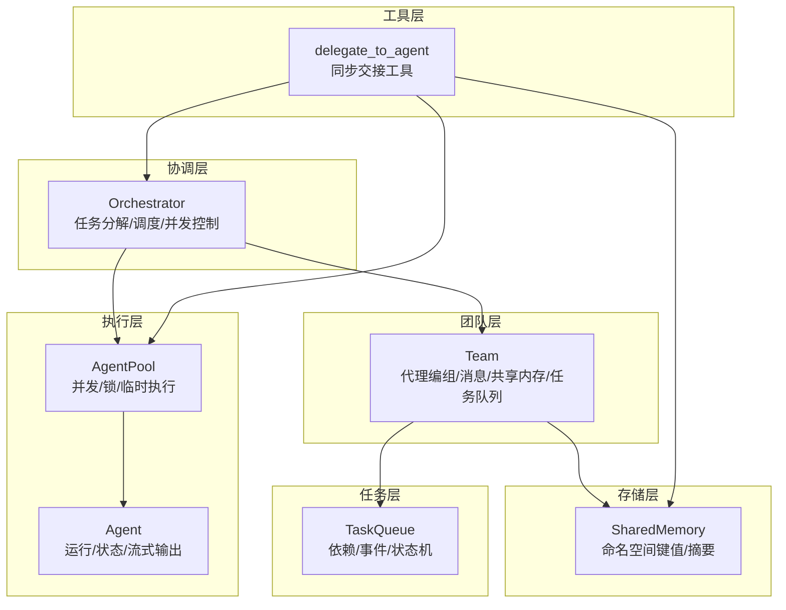
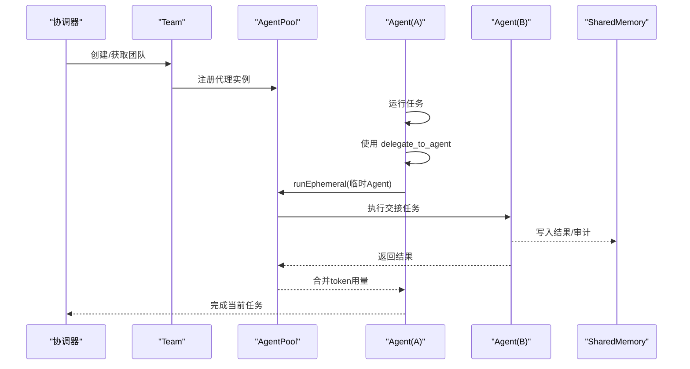
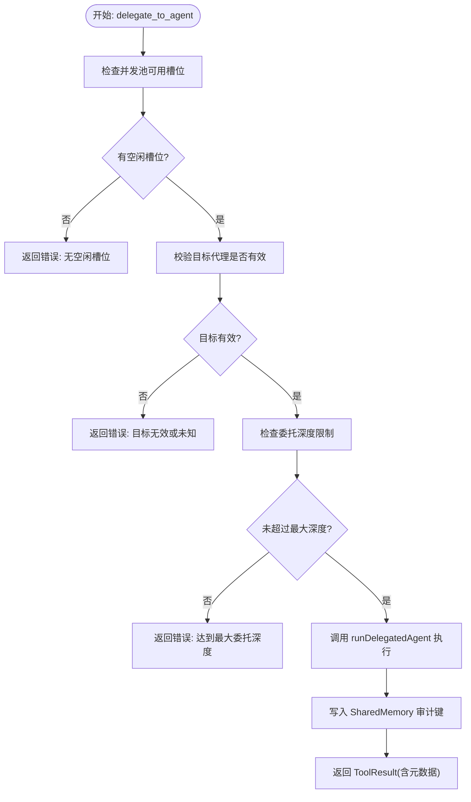
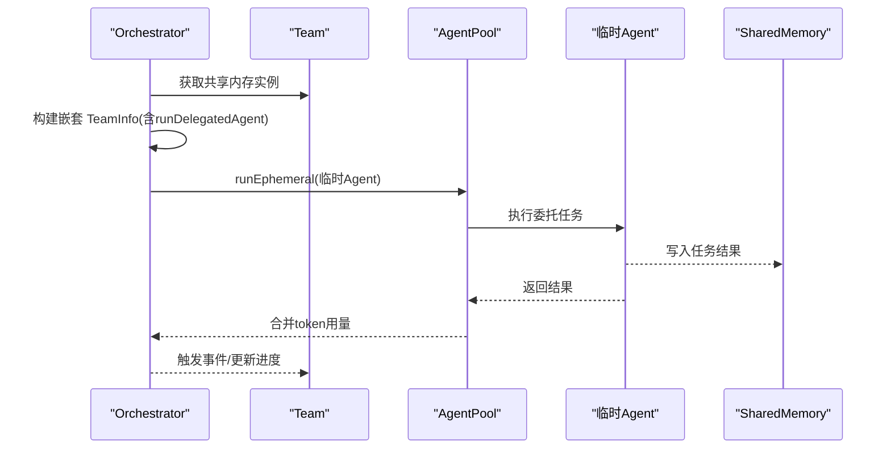
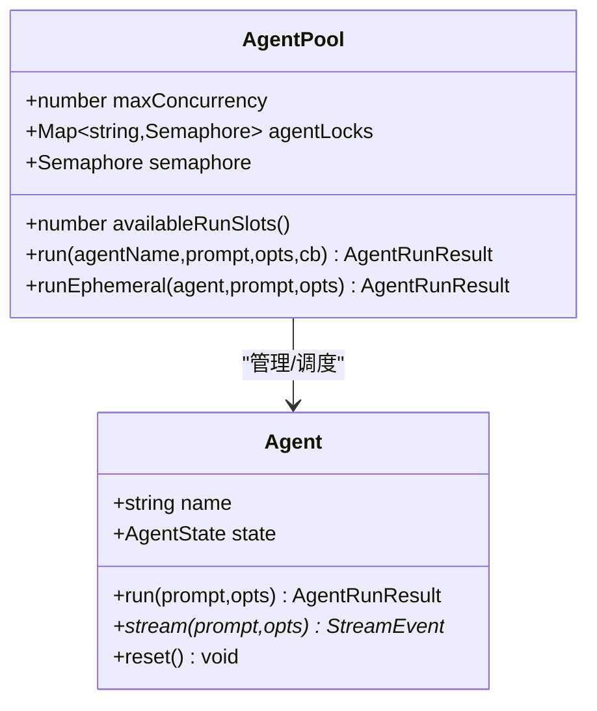
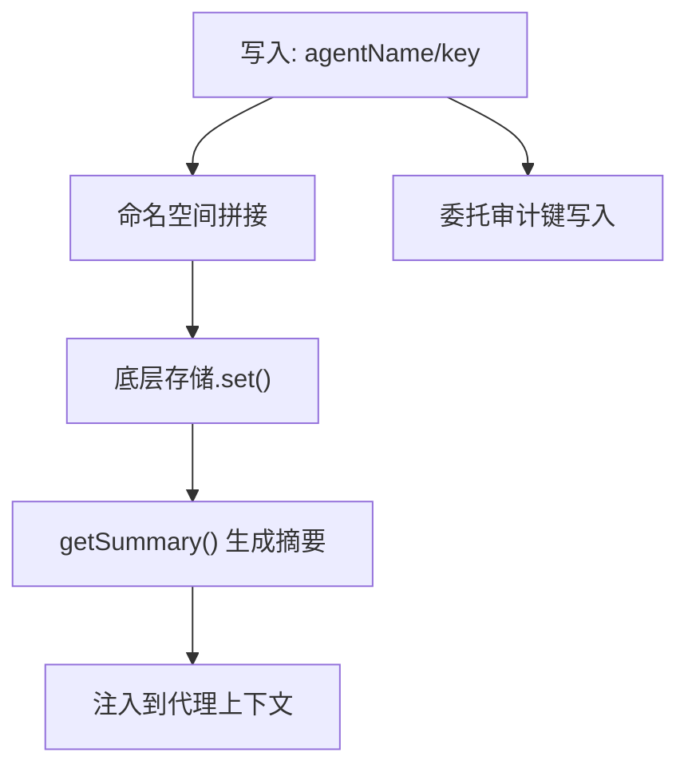
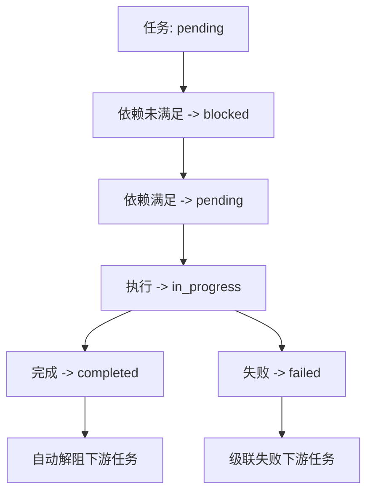
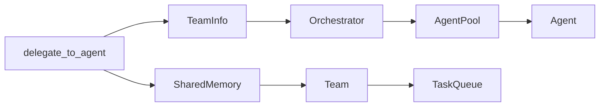

# 代理交接机制

<cite>
**本文档引用的文件**
- [src/team/team.ts](file://src/team/team.ts)
- [src/orchestrator/orchestrator.ts](file://src/orchestrator/orchestrator.ts)
- [src/tool/built-in/delegate.ts](file://src/tool/built-in/delegate.ts)
- [src/agent/agent.ts](file://src/agent/agent.ts)
- [src/agent/pool.ts](file://src/agent/pool.ts)
- [src/memory/shared.ts](file://src/memory/shared.ts)
- [src/task/queue.ts](file://src/task/queue.ts)
- [src/orchestrator/scheduler.ts](file://src/orchestrator/scheduler.ts)
- [examples/patterns/agent-handoff.ts](file://examples/patterns/agent-handoff.ts)
- [src/types.ts](file://src/types.ts)
</cite>

## 目录
1. [简介](#简介)
2. [项目结构](#项目结构)
3. [核心组件](#核心组件)
4. [架构总览](#架构总览)
5. [详细组件分析](#详细组件分析)
6. [依赖关系分析](#依赖关系分析)
7. [性能考量](#性能考量)
8. [故障排查指南](#故障排查指南)
9. [结论](#结论)
10. [附录](#附录)

## 简介
本文件系统化阐述 Open Multi-Agent 框架中的“代理交接（Agent Handoff）”机制，涵盖概念、设计原理与实现细节。重点说明如何在不同智能体之间无缝转移任务与上下文信息，包括状态保持、上下文传递与任务继承；提供完整的交接流程图与最佳实践，帮助读者在复杂协作场景中构建稳定、可观察且高性能的多智能体系统。

## 项目结构
围绕代理交接的关键模块如下：
- 团队协调：Team 负责代理编组、消息总线、共享内存与任务队列
- 协调器：Orchestrator 负责任务分解、调度、并发控制与交接执行
- 工具层：delegate_to_agent 内置工具实现同步交接
- 执行层：Agent/AgentPool 提供运行时生命周期与并发锁
- 存储层：SharedMemory 提供跨任务的上下文持久化
- 任务队列：TaskQueue 支持依赖驱动的任务流转与事件通知

图表来源
- [src/team/team.ts:88-346](file://src/team/team.ts#L88-L346)
- [src/orchestrator/orchestrator.ts:550-800](file://src/orchestrator/orchestrator.ts#L550-L800)
- [src/tool/built-in/delegate.ts:24-110](file://src/tool/built-in/delegate.ts#L24-L110)
- [src/agent/pool.ts:58-370](file://src/agent/pool.ts#L58-L370)
- [src/memory/shared.ts:55-335](file://src/memory/shared.ts#L55-L335)
- [src/task/queue.ts:55-470](file://src/task/queue.ts#L55-L470)

章节来源
- [src/team/team.ts:88-346](file://src/team/team.ts#L88-L346)
- [src/orchestrator/orchestrator.ts:550-800](file://src/orchestrator/orchestrator.ts#L550-L800)
- [src/tool/built-in/delegate.ts:24-110](file://src/tool/built-in/delegate.ts#L24-L110)
- [src/agent/pool.ts:58-370](file://src/agent/pool.ts#L58-L370)
- [src/memory/shared.ts:55-335](file://src/memory/shared.ts#L55-L335)
- [src/task/queue.ts:55-470](file://src/task/queue.ts#L55-L470)

## 核心组件
- Team：团队编组、消息总线、共享内存与任务队列的聚合入口，提供事件总线与任务管理能力
- Orchestrator：负责任务分解、调度策略、并发控制与交接执行，构建嵌套 Team 上下文
- Agent/AgentPool：提供运行时生命周期、并发锁与临时执行能力，避免相互委托死锁
- delegate_to_agent：内置工具，支持在同一团队内同步交接给指定代理
- SharedMemory：命名空间键值存储，支持 TTL、摘要生成与审计写入
- TaskQueue：依赖感知的任务队列，自动解阻、级联失败与事件通知

章节来源
- [src/team/team.ts:88-346](file://src/team/team.ts#L88-L346)
- [src/orchestrator/orchestrator.ts:461-548](file://src/orchestrator/orchestrator.ts#L461-L548)
- [src/tool/built-in/delegate.ts:24-110](file://src/tool/built-in/delegate.ts#L24-L110)
- [src/agent/pool.ts:58-370](file://src/agent/pool.ts#L58-L370)
- [src/memory/shared.ts:55-335](file://src/memory/shared.ts#L55-L335)
- [src/task/queue.ts:55-470](file://src/task/queue.ts#L55-L470)

## 架构总览
代理交接在框架内的端到端流程如下：
- 协调器根据目标与策略生成任务计划
- 任务进入队列，等待调度与执行
- 执行过程中，代理通过 delegate_to_agent 将子任务交接给其他代理
- Orchestrator 构建嵌套 Team 上下文，确保深度限制与并发安全
- SharedMemory 用于跨任务上下文传递与审计

图表来源
- [src/orchestrator/orchestrator.ts:515-548](file://src/orchestrator/orchestrator.ts#L515-L548)
- [src/agent/pool.ts:206-217](file://src/agent/pool.ts#L206-L217)
- [src/tool/built-in/delegate.ts:87-108](file://src/tool/built-in/delegate.ts#L87-L108)
- [src/memory/shared.ts:124-135](file://src/memory/shared.ts#L124-L135)

## 详细组件分析

### 1) 代理交接工具 delegate_to_agent
- 功能：在团队内同步交接子任务给另一代理，返回目标代理最终文本输出
- 安全检查：禁止自交接、未知代理、循环委托、超深度限制、无可用并发槽
- 审计：在 SharedMemory 中写入交接审计键，便于追踪与调试
- 结果封装：将子任务的 AgentRunResult 汇总到 ToolResult.metadata（含 tokenUsage）

图表来源
- [src/tool/built-in/delegate.ts:31-109](file://src/tool/built-in/delegate.ts#L31-L109)

章节来源
- [src/tool/built-in/delegate.ts:24-110](file://src/tool/built-in/delegate.ts#L24-L110)

### 2) Orchestrator 的交接执行与上下文构建
- 嵌套 TeamInfo：为每个委托层级构建独立的 TeamInfo，包含 delegationDepth、delegationChain、delegationPool 与 runDelegatedAgent
- runEphemeral：使用临时 Agent 实例执行委托任务，绕过 per-agent 锁，避免相互委托死锁
- 上下文注入：prependRevealCoordinatorContext 可向委托任务注入团队上下文
- 共享内存：委托完成后写入任务结果，供后续任务读取

图表来源
- [src/orchestrator/orchestrator.ts:461-548](file://src/orchestrator/orchestrator.ts#L461-L548)
- [src/agent/pool.ts:206-217](file://src/agent/pool.ts#L206-L217)
- [src/memory/shared.ts:77-85](file://src/memory/shared.ts#L77-L85)

章节来源
- [src/orchestrator/orchestrator.ts:461-548](file://src/orchestrator/orchestrator.ts#L461-L548)
- [src/agent/pool.ts:206-217](file://src/agent/pool.ts#L206-L217)

### 3) Agent/AgentPool 的并发与锁机制
- per-agent 锁：防止同一 Agent 实例被并发执行导致的状态竞争
- 池并发：Semaphore 控制全局并发度，避免资源争用
- runEphemeral：仅获取池信号量，不加 per-agent 锁，适合委托执行
- 死锁防护：相互委托时，父调用持有 per-agent 锁，子调用使用 runEphemeral 避免反向锁死

图表来源
- [src/agent/pool.ts:58-370](file://src/agent/pool.ts#L58-L370)
- [src/agent/agent.ts:94-670](file://src/agent/agent.ts#L94-L670)

章节来源
- [src/agent/pool.ts:58-370](file://src/agent/pool.ts#L58-L370)
- [src/agent/agent.ts:94-670](file://src/agent/agent.ts#L94-L670)

### 4) SharedMemory 的上下文传递与审计
- 命名空间键：以 agentName/ 开头，保证条目可归因且互不冲突
- TTL 机制：支持按 turn 计数过期，适合跨任务交接场景
- 摘要生成：可将共享记忆汇总注入到代理上下文中
- 审计写入：委托工具在 SharedMemory 中写入审计键，便于追踪

图表来源
- [src/memory/shared.ts:124-135](file://src/memory/shared.ts#L124-L135)
- [src/memory/shared.ts:251-294](file://src/memory/shared.ts#L251-L294)
- [src/tool/built-in/delegate.ts:89-101](file://src/tool/built-in/delegate.ts#L89-L101)

章节来源
- [src/memory/shared.ts:55-335](file://src/memory/shared.ts#L55-L335)
- [src/tool/built-in/delegate.ts:89-101](file://src/tool/built-in/delegate.ts#L89-L101)

### 5) 任务队列与交接后的状态流转
- 依赖驱动：完成任务自动解阻下游任务，触发 ready 事件
- 级联失败：上游失败会级联标记下游任务失败，避免卡死
- 事件系统：支持 task:ready/task:complete/task:failed/all:complete 等事件
- 交接后上下文：通过 SharedMemory 与 memoryScope 控制上下文注入范围

图表来源
- [src/task/queue.ts:131-158](file://src/task/queue.ts#L131-L158)
- [src/task/queue.ts:424-446](file://src/task/queue.ts#L424-L446)

章节来源
- [src/task/queue.ts:55-470](file://src/task/queue.ts#L55-L470)

### 6) 示例：同步代理交接
- 示例展示了如何在团队中使用 delegate_to_agent 实现同步交接
- 研究员代理通过工具请求分析师代理进行二次意见，随后合并输出
- 共享内存启用，便于跨任务上下文传递

章节来源
- [examples/patterns/agent-handoff.ts:1-65](file://examples/patterns/agent-handoff.ts#L1-L65)

## 依赖关系分析
- delegate_to_agent 依赖 TeamInfo 中的 runDelegatedAgent 与 SharedMemory
- Orchestrator 在构建 TeamInfo 时注入 delegationDepth、delegationChain、delegationPool
- AgentPool 的 runEphemeral 避免相互委托死锁
- SharedMemory 与 TaskQueue 的 memoryScope 协同控制上下文注入范围

图表来源
- [src/tool/built-in/delegate.ts:31-109](file://src/tool/built-in/delegate.ts#L31-L109)
- [src/orchestrator/orchestrator.ts:461-548](file://src/orchestrator/orchestrator.ts#L461-L548)
- [src/agent/pool.ts:206-217](file://src/agent/pool.ts#L206-L217)
- [src/memory/shared.ts:55-335](file://src/memory/shared.ts#L55-L335)
- [src/team/team.ts:88-346](file://src/team/team.ts#L88-L346)
- [src/task/queue.ts:55-470](file://src/task/queue.ts#L55-L470)

章节来源
- [src/tool/built-in/delegate.ts:31-109](file://src/tool/built-in/delegate.ts#L31-L109)
- [src/orchestrator/orchestrator.ts:461-548](file://src/orchestrator/orchestrator.ts#L461-L548)
- [src/agent/pool.ts:206-217](file://src/agent/pool.ts#L206-L217)
- [src/memory/shared.ts:55-335](file://src/memory/shared.ts#L55-L335)
- [src/team/team.ts:88-346](file://src/team/team.ts#L88-L346)
- [src/task/queue.ts:55-470](file://src/task/queue.ts#L55-L470)

## 性能考量
- 并发控制：maxConcurrency 限制整体并发，delegationPool.availableRunSlots 防止委托死锁
- 上下文压缩：Agent 的 contextStrategy 可减少长对话的上下文开销
- 重试与退避：executeWithRetry 统一处理失败重试，避免抖动
- 审计成本：委托审计键写入为 best-effort，避免影响主流程性能
- 令牌预算：委托链路的 tokenUsage 通过 ToolResult.metadata 汇总，确保预算准确

章节来源
- [src/orchestrator/orchestrator.ts:266-333](file://src/orchestrator/orchestrator.ts#L266-L333)
- [src/agent/agent.ts:129-191](file://src/agent/agent.ts#L129-L191)
- [src/tool/built-in/delegate.ts:103-108](file://src/tool/built-in/delegate.ts#L103-L108)

## 故障排查指南
- 委托失败：检查目标代理是否存在、是否自交接、是否超过最大委托深度、并发池是否有空闲槽位
- 循环委托：delegationChain 会阻止 A→B→A 的循环，出现错误提示时需重构计划
- 死锁问题：确保相互委托时使用 runEphemeral，避免同时持有 per-agent 锁
- 上下文丢失：确认 SharedMemory 是否启用、键命名是否正确、TTL 是否过早过期
- 令牌超限：委托链路的 tokenUsage 会汇总到父任务，注意 maxTokenBudget 配置

章节来源
- [src/tool/built-in/delegate.ts:45-85](file://src/tool/built-in/delegate.ts#L45-L85)
- [src/orchestrator/orchestrator.ts:515-536](file://src/orchestrator/orchestrator.ts#L515-L536)
- [src/agent/pool.ts:194-217](file://src/agent/pool.ts#L194-L217)
- [src/memory/shared.ts:162-184](file://src/memory/shared.ts#L162-L184)

## 结论
Open Multi-Agent 框架通过 Team/Orchestrator/AgentPool/SharedMemory 的协同，提供了安全、可观测且高性能的代理交接机制。delegate_to_agent 工具在团队内实现了同步交接，配合嵌套 TeamInfo、并发锁与 SharedMemory，确保上下文传递与状态一致性。通过合理的配置与最佳实践，可在复杂协作场景中实现稳定的任务继承与上下文延续。

## 附录

### A. 交接条件判断清单
- 目标代理存在且非自身
- 未超过最大委托深度
- 并发池有空闲槽位
- 无委托循环风险
- SharedMemory 可用（如需审计）

章节来源
- [src/tool/built-in/delegate.ts:45-85](file://src/tool/built-in/delegate.ts#L45-L85)

### B. 数据转换与验证机制
- 委托结果封装：ToolResult.data 为子任务最终文本，metadata 包含 tokenUsage
- 上下文注入：prependRevealCoordinatorContext 将团队上下文注入委托任务
- 输出验证：Agent 的 outputSchema 与委托链路的 tokenUsage 汇总

章节来源
- [src/tool/built-in/delegate.ts:103-108](file://src/tool/built-in/delegate.ts#L103-L108)
- [src/orchestrator/orchestrator.ts:531-535](file://src/orchestrator/orchestrator.ts#L531-L535)
- [src/agent/agent.ts:437-516](file://src/agent/agent.ts#L437-L516)

### C. 最佳实践
- 合理设置 maxDelegationDepth 与 maxConcurrency，避免深度过深与并发饱和
- 使用 SharedMemory 的 TTL 与摘要功能，平衡上下文完整性与性能
- 在相互委托场景中优先使用 runEphemeral，避免死锁
- 为委托审计键设置唯一后缀，便于追踪重复委托
- 对关键任务启用 onApproval 门控，确保交接质量

章节来源
- [src/orchestrator/orchestrator.ts:761-764](file://src/orchestrator/orchestrator.ts#L761-L764)
- [src/tool/built-in/delegate.ts:89-101](file://src/tool/built-in/delegate.ts#L89-L101)
- [src/agent/pool.ts:194-217](file://src/agent/pool.ts#L194-L217)

### D. 实际应用场景
- 多轮评审：研究员提出观点，分析师进行批判性评估，最终合并输出
- 专家咨询：通用代理无法解决的问题，转交给具备特定能力的专家代理
- 任务拆分：复杂任务分解为多个子任务，由不同代理并行执行后再汇总

章节来源
- [examples/patterns/agent-handoff.ts:1-65](file://examples/patterns/agent-handoff.ts#L1-L65)