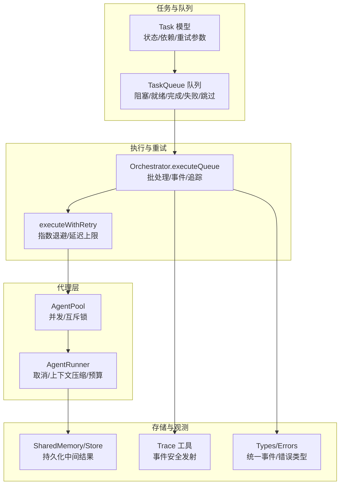
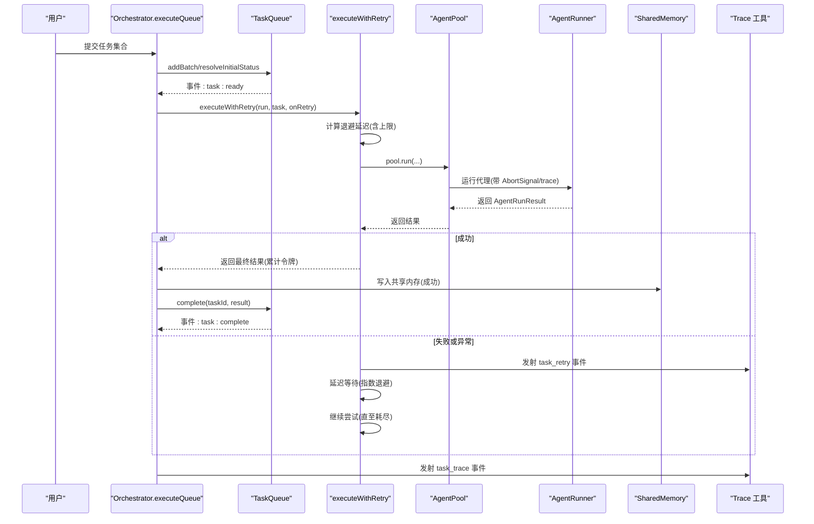
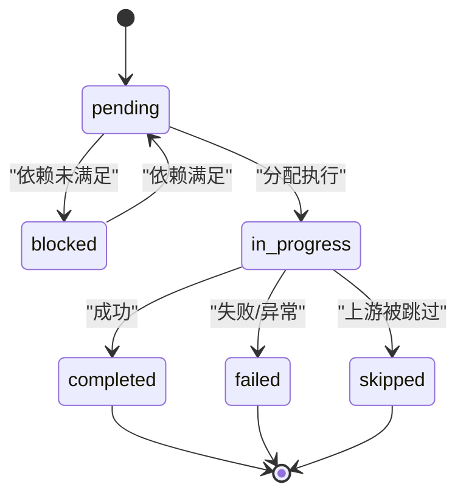
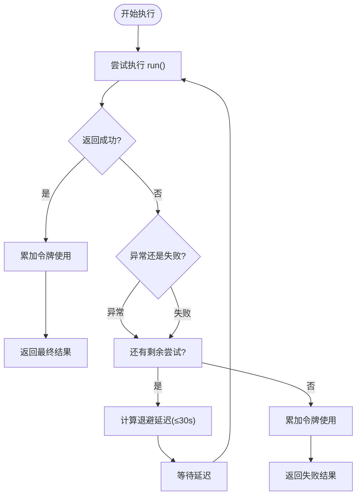
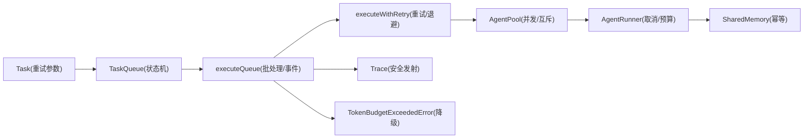

# 可靠性机制

<cite>
**本文引用的文件列表**
- [task.ts](file://src/task/task.ts)
- [queue.ts](file://src/task/queue.ts)
- [orchestrator.ts](file://src/orchestrator/orchestrator.ts)
- [task-retry.ts](file://examples/patterns/task-retry.ts)
- [task-retry.test.ts](file://tests/task-retry.test.ts)
- [trace.ts](file://src/utils/trace.ts)
- [types.ts](file://src/types.ts)
- [errors.ts](file://src/errors.ts)
- [runner.ts](file://src/agent/runner.ts)
- [pool.ts](file://src/agent/pool.ts)
- [store.ts](file://src/memory/store.ts)
</cite>

## 目录
1. [引言](#引言)
2. [项目结构](#项目结构)
3. [核心组件](#核心组件)
4. [架构总览](#架构总览)
5. [详细组件分析](#详细组件分析)
6. [依赖关系分析](#依赖关系分析)
7. [性能考量](#性能考量)
8. [故障排查指南](#故障排查指南)
9. [结论](#结论)
10. [附录](#附录)

## 引言
本文件面向 Open Multi-Agent 框架的可靠性机制，重点围绕“任务重试”展开，涵盖设计原理、实现细节与最佳实践。内容包括：
- 重试策略：最大重试次数、指数退避、延迟上限
- 错误分类与处理：异常抛出、结果失败（success=false）两类场景
- 幂等性保障：通过共享内存写入与令牌累计实现可恢复性
- 状态恢复：任务队列的阻塞/就绪/完成/失败/跳过状态机
- 超时与资源限制：AbortSignal、并发信号量、令牌预算
- 观测与降级：事件回调、追踪、预算耗尽降级
- 故障隔离：代理池互斥锁、并发控制、委托调用隔离

## 项目结构
Open Multi-Agent 的可靠性机制由以下模块协同实现：
- 任务模型与队列：定义任务状态、依赖与调度
- 执行器：封装重试、退避、事件上报与追踪
- 代理运行器与池：并发控制、取消信号、流式回调安全
- 共享内存：跨任务持久化中间结果，支持幂等与恢复
- 类型与错误：统一事件与错误类型，便于观测与降级

图表来源
- [task.ts:29-55](file://src/task/task.ts#L29-L55)
- [queue.ts:55-95](file://src/task/queue.ts#L55-L95)
- [orchestrator.ts:561-787](file://src/orchestrator/orchestrator.ts#L561-L787)
- [pool.ts:58-191](file://src/agent/pool.ts#L58-L191)
- [runner.ts:673-720](file://src/agent/runner.ts#L673-L720)
- [store.ts:31-104](file://src/memory/store.ts#L31-L104)
- [trace.ts:12-27](file://src/utils/trace.ts#L12-L27)
- [types.ts:704-729](file://src/types.ts#L704-L729)
- [errors.ts:8-19](file://src/errors.ts#L8-L19)

章节来源
- [task.ts:1-242](file://src/task/task.ts#L1-L242)
- [queue.ts:1-470](file://src/task/queue.ts#L1-L470)
- [orchestrator.ts:1-800](file://src/orchestrator/orchestrator.ts#L1-L800)
- [pool.ts:1-370](file://src/agent/pool.ts#L1-L370)
- [runner.ts:1-800](file://src/agent/runner.ts#L1-L800)
- [store.ts:1-149](file://src/memory/store.ts#L1-L149)
- [trace.ts:1-35](file://src/utils/trace.ts#L1-L35)
- [types.ts:1-1106](file://src/types.ts#L1-L1106)
- [errors.ts:1-20](file://src/errors.ts#L1-L20)

## 核心组件
- 任务模型与重试参数
  - 字段：maxRetries、retryDelayMs、retryBackoff
  - 语义：最大重试次数、基础延迟毫秒数、退避倍率
- 任务队列
  - 状态机：pending → blocked → in_progress → completed/failed/skipped
  - 自动解阻：上游完成后自动变为 ready
- 执行器与重试
  - executeWithRetry：指数退避、延迟上限、事件回调、令牌累计
  - Orchestrator.executeQueue：批处理、事件、追踪、预算检查
- 代理池与运行器
  - AgentPool：并发信号量、代理互斥锁、流回调安全
  - AgentRunner：AbortSignal、上下文压缩、预算检查
- 共享内存
  - 任务成功后写入共享内存，下游读取以实现幂等与恢复
- 观测与错误
  - 统一事件类型、追踪安全发射、预算超限错误

章节来源
- [task.ts:29-55](file://src/task/task.ts#L29-L55)
- [queue.ts:55-203](file://src/task/queue.ts#L55-L203)
- [orchestrator.ts:266-333](file://src/orchestrator/orchestrator.ts#L266-L333)
- [pool.ts:58-191](file://src/agent/pool.ts#L58-L191)
- [runner.ts:673-720](file://src/agent/runner.ts#L673-L720)
- [store.ts:31-104](file://src/memory/store.ts#L31-L104)
- [trace.ts:12-27](file://src/utils/trace.ts#L12-L27)
- [types.ts:704-729](file://src/types.ts#L704-L729)
- [errors.ts:8-19](file://src/errors.ts#L8-L19)

## 架构总览
下图展示了从任务提交到执行、重试、状态更新与观测的整体流程。

图表来源
- [orchestrator.ts:561-787](file://src/orchestrator/orchestrator.ts#L561-L787)
- [queue.ts:74-158](file://src/task/queue.ts#L74-L158)
- [orchestrator.ts:266-333](file://src/orchestrator/orchestrator.ts#L266-L333)
- [pool.ts:147-191](file://src/agent/pool.ts#L147-L191)
- [runner.ts:673-720](file://src/agent/runner.ts#L673-L720)
- [trace.ts:12-27](file://src/utils/trace.ts#L12-L27)

## 详细组件分析

### 任务模型与队列
- 任务字段
  - maxRetries：默认 0（不重试），正整数表示最多重试次数
  - retryDelayMs：默认 1000ms
  - retryBackoff：默认 2（指数退避）
- 队列状态机
  - 初始：pending 或 blocked（依赖未满足）
  - 就绪：上游完成，触发 task:ready
  - 执行中：in_progress
  - 结束：completed/failed/skipped
  - 失败传播：fail 会级联标记下游依赖为 failed
  - 跳过传播：skip 会级联标记下游依赖为 skipped

图表来源
- [queue.ts:55-203](file://src/task/queue.ts#L55-L203)
- [types.ts:679-680](file://src/types.ts#L679-L680)

章节来源
- [task.ts:29-55](file://src/task/task.ts#L29-L55)
- [queue.ts:55-203](file://src/task/queue.ts#L55-L203)
- [types.ts:679-729](file://src/types.ts#L679-L729)

### 执行器与重试策略
- 重试触发条件
  - 异常抛出：捕获异常并根据剩余尝试次数决定是否重试
  - 结果失败：AgentRunResult.success=false 时重试
- 退避算法
  - 延迟 = baseDelay × backoff^(attempt-1)
  - 最大延迟 30 秒（MAX_RETRY_DELAY_MS）
- 事件与追踪
  - 每次重试前触发 task_retry 事件，携带 attempt/maxAttempts/error/nextDelayMs
  - 执行结束后发射 task_trace 事件，记录 retries/duration/tokenUsage
- 令牌累计
  - 将每次尝试的 tokenUsage 累加，最终返回统一的 tokenUsage

图表来源
- [orchestrator.ts:266-333](file://src/orchestrator/orchestrator.ts#L266-L333)
- [orchestrator.ts:668-702](file://src/orchestrator/orchestrator.ts#L668-L702)

章节来源
- [orchestrator.ts:241-253](file://src/orchestrator/orchestrator.ts#L241-L253)
- [orchestrator.ts:266-333](file://src/orchestrator/orchestrator.ts#L266-L333)
- [task-retry.test.ts:33-49](file://tests/task-retry.test.ts#L33-L49)
- [task-retry.test.ts:107-137](file://tests/task-retry.test.ts#L107-L137)
- [task-retry.test.ts:157-180](file://tests/task-retry.test.ts#L157-L180)
- [task-retry.test.ts:198-221](file://tests/task-retry.test.ts#L198-L221)

### 幂等性与状态恢复
- 幂等性保障
  - 仅当任务成功时才写入共享内存，避免重复副作用
  - 任务完成后推进 turn 计数，便于后续读取时清理过期条目
- 状态恢复
  - 任务失败或异常时，队列将其标记为 failed/skipped，并级联影响下游
  - 重试成功后，下游任务可读取最新共享内存数据继续执行
- 示例参考
  - 任务依赖链：Fetch data（有重试）→ Analyze data（无重试）

章节来源
- [orchestrator.ts:749-757](file://src/orchestrator/orchestrator.ts#L749-L757)
- [store.ts:70-86](file://src/memory/store.ts#L70-L86)
- [task-retry.ts:88-105](file://examples/patterns/task-retry.ts#L88-L105)

### 超时与资源限制
- 超时与取消
  - AgentRunner 支持 per-call AbortSignal，可在任意 LLM 调用前检查
  - Orchestrator.executeQueue 在每轮批处理前检查 run-level AbortSignal
- 并发控制
  - AgentPool 使用 Semaphore 控制全局并发，每个代理实例使用互斥锁防止竞态
  - runEphemeral 用于委托调用，绕过代理互斥锁，避免相互委托死锁
- 令牌预算
  - Orchestrator 累计 tokenUsage，超过 maxTokenBudget 触发 TokenBudgetExceededError
  - 触发后跳过剩余任务，发出 budget_exceeded 事件

章节来源
- [runner.ts:692-720](file://src/agent/runner.ts#L692-L720)
- [orchestrator.ts:578-583](file://src/orchestrator/orchestrator.ts#L578-L583)
- [pool.ts:58-191](file://src/agent/pool.ts#L58-L191)
- [errors.ts:8-19](file://src/errors.ts#L8-L19)

### 观测与降级
- 事件与追踪
  - onProgress 接收 task_retry、task_complete、error 等事件
  - emitTrace 安全发射追踪事件，吞掉回调异常，避免影响执行
- 降级策略
  - 预算超限：停止继续执行，标记剩余任务为 skipped
  - 代理池无可用槽位：委托失败提示“无空闲并发槽位”
  - 代理不存在：返回错误 AgentRunResult

章节来源
- [orchestrator.ts:568-576](file://src/orchestrator/orchestrator.ts#L568-L576)
- [orchestrator.ts:748-749](file://src/orchestrator/orchestrator.ts#L748-L749)
- [trace.ts:12-27](file://src/utils/trace.ts#L12-L27)
- [pool.ts:483-506](file://src/agent/pool.ts#L483-L506)

## 依赖关系分析
- 组件耦合
  - Orchestrator.executeQueue 依赖 TaskQueue 的状态转换与事件
  - executeWithRetry 依赖 Task 的重试参数与 AgentPool 的 run 方法
  - AgentPool 依赖 AgentRunner 的 run/stream 实现
  - SharedMemory 在任务成功后写入，供下游任务读取
- 关键依赖链
  - Task → TaskQueue → Orchestrator.executeQueue → executeWithRetry → AgentPool → AgentRunner
  - Orchestrator → Trace 工具 → 观测事件
  - Orchestrator → TokenBudgetExceededError → 降级

图表来源
- [task.ts:29-55](file://src/task/task.ts#L29-L55)
- [queue.ts:55-203](file://src/task/queue.ts#L55-L203)
- [orchestrator.ts:561-787](file://src/orchestrator/orchestrator.ts#L561-L787)
- [pool.ts:58-191](file://src/agent/pool.ts#L58-L191)
- [runner.ts:673-720](file://src/agent/runner.ts#L673-L720)
- [trace.ts:12-27](file://src/utils/trace.ts#L12-L27)
- [errors.ts:8-19](file://src/errors.ts#L8-L19)

章节来源
- [task.ts:1-242](file://src/task/task.ts#L1-L242)
- [queue.ts:1-470](file://src/task/queue.ts#L1-L470)
- [orchestrator.ts:1-800](file://src/orchestrator/orchestrator.ts#L1-L800)
- [pool.ts:1-370](file://src/agent/pool.ts#L1-L370)
- [runner.ts:1-800](file://src/agent/runner.ts#L1-L800)
- [trace.ts:1-35](file://src/utils/trace.ts#L1-L35)
- [errors.ts:1-20](file://src/errors.ts#L1-L20)

## 性能考量
- 退避上限：最大延迟 30 秒，避免长时间退避导致整体吞吐下降
- 延迟注入：delayFn 可替换为测试用无延时函数，便于单元测试
- 令牌累计：重试不会重复计费，最终 tokenUsage 反映真实成本
- 并发与互斥：代理互斥锁避免同一代理实例并发写入状态，减少无效重试
- 上下文压缩：长对话通过滑窗/摘要/紧凑策略降低上下文开销，间接提升稳定性

## 故障排查指南
- 重试未生效
  - 检查 maxRetries 是否为正数；默认 0 不重试
  - 确认异常抛出或 AgentRunResult.success=false
- 重试频率过高
  - 调整 retryDelayMs 与 retryBackoff；注意最大延迟 30 秒
- 任务卡在 blocked
  - 检查上游任务是否完成；确认 dependsOn 正确
- 预算超限
  - 提升 maxTokenBudget 或优化上下文策略；查看 budget_exceeded 事件
- 代理池死锁
  - 避免相互委托；runEphemeral 用于委托场景
- 观测缺失
  - 确保 onProgress/onTrace 配置正确；emitTrace 已吞掉回调异常

章节来源
- [task-retry.test.ts:223-238](file://tests/task-retry.test.ts#L223-L238)
- [task-retry.test.ts:260-277](file://tests/task-retry.test.ts#L260-L277)
- [queue.ts:212-243](file://src/task/queue.ts#L212-L243)
- [orchestrator.ts:733-747](file://src/orchestrator/orchestrator.ts#L733-L747)
- [pool.ts:483-506](file://src/agent/pool.ts#L483-L506)
- [trace.ts:12-27](file://src/utils/trace.ts#L12-L27)

## 结论
Open Multi-Agent 的可靠性机制以“任务模型 + 队列状态机 + 执行器重试 + 并发与取消 + 观测与降级”为核心，形成闭环：
- 明确的重试策略与退避上限，兼顾稳定性与吞吐
- 通过共享内存与状态机实现幂等与恢复
- 通过 AbortSignal、并发信号量与预算检查实现资源限制与故障隔离
- 通过统一事件与追踪工具实现可观测与可降级

## 附录
- 示例参考
  - 任务重试示例：[task-retry.ts:88-105](file://examples/patterns/task-retry.ts#L88-L105)
  - 单元测试覆盖：[task-retry.test.ts:33-49](file://tests/task-retry.test.ts#L33-L49)、[task-retry.test.ts:107-137](file://tests/task-retry.test.ts#L107-L137)、[task-retry.test.ts:157-180](file://tests/task-retry.test.ts#L157-L180)、[task-retry.test.ts:198-221](file://tests/task-retry.test.ts#L198-L221)