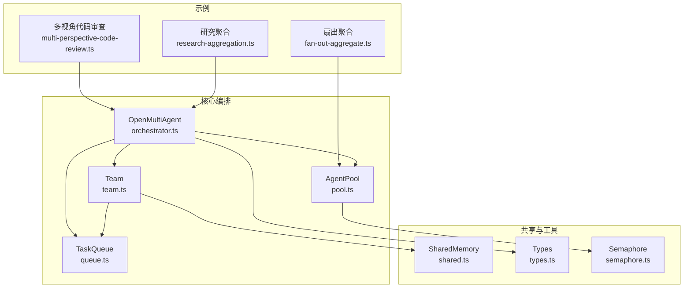
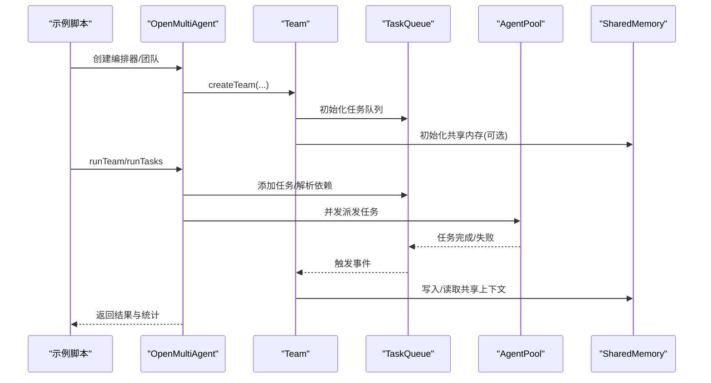
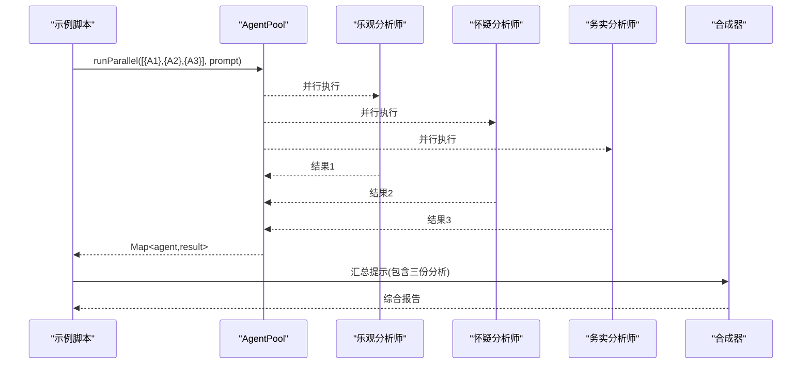
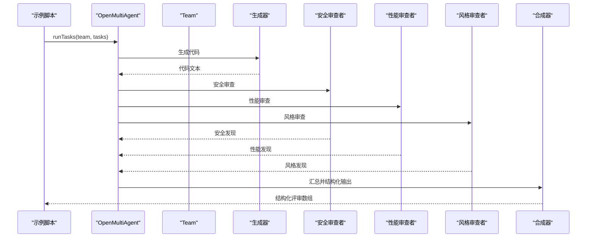
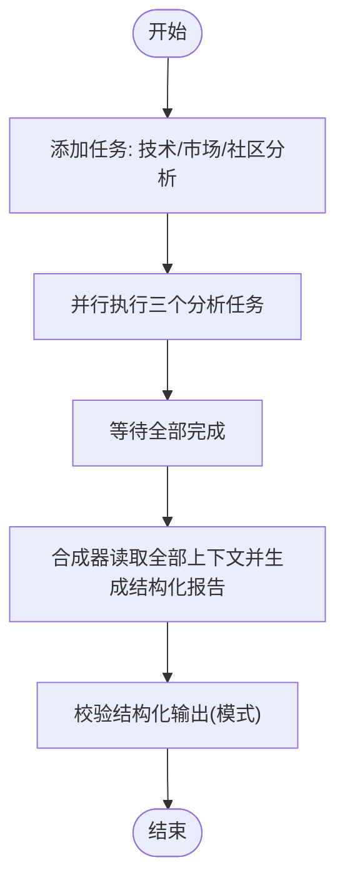
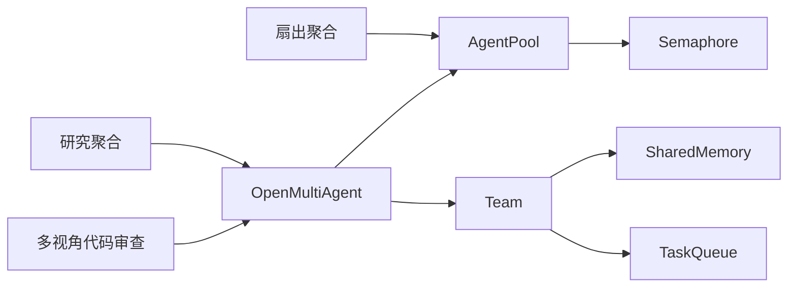

# 常见协作模式

<cite>
**本文引用的文件**
- [fan-out-aggregate.ts](file://examples/patterns/fan-out-aggregate.ts)
- [multi-perspective-code-review.ts](file://examples/patterns/multi-perspective-code-review.ts)
- [research-aggregation.ts](file://examples/patterns/research-aggregation.ts)
- [team.ts](file://src/team/team.ts)
- [orchestrator.ts](file://src/orchestrator/orchestrator.ts)
- [pool.ts](file://src/agent/pool.ts)
- [shared.ts](file://src/memory/shared.ts)
- [queue.ts](file://src/task/queue.ts)
- [agent-handoff.ts](file://examples/patterns/agent-handoff.ts)
- [types.ts](file://src/types.ts)
- [semaphore.ts](file://src/utils/semaphore.ts)
- [research-aggregation.test.ts](file://tests/research-aggregation.test.ts)
- [multi-perspective-code-review.test.ts](file://tests/multi-perspective-code-review.test.ts)
</cite>

## 目录
1. [简介](#简介)
2. [项目结构](#项目结构)
3. [核心组件](#核心组件)
4. [架构总览](#架构总览)
5. [详细组件分析](#详细组件分析)
6. [依赖关系分析](#依赖关系分析)
7. [性能考量](#性能考量)
8. [故障排查指南](#故障排查指南)
9. [结论](#结论)
10. [附录](#附录)

## 简介
本文件面向 Open Multi-Agent 框架的使用者与贡献者，系统化梳理三种常见协作模式：
- 扇出聚合（Fan-Out/Aggregate）模式：并行运行多个分析智能体，随后由合成器整合输出。
- 多视角代码审查模式：模拟多人协作审查流程，生成结构化评审意见。
- 研究聚合模式：从多个来源收集信息并进行统一整合与矛盾识别。

我们将解释每种模式的设计原理、适用场景、实现步骤、性能优势，并提供可直接参考的代码示例路径、错误处理策略与参数优化建议。读者无需深入源码即可理解并应用这些模式。

## 项目结构
Open Multi-Agent 的协作模式主要由以下模块协同实现：
- 示例层：examples/patterns 下的三个模式示例，演示不同协作策略与集成方式。
- 核心编排层：orchestrator 负责任务分解、调度、并发控制与事件回调。
- 团队与共享内存：team 提供代理编组、消息总线与共享记忆；shared 提供跨任务的命名空间存储。
- 并发与池化：agent/pool 提供并发上限与并行执行能力；task/queue 实现依赖感知的任务队列。
- 工具与类型：tool/framework、tool/executor 提供工具注册与执行；types 定义公共类型与接口。

图表来源
- [fan-out-aggregate.ts:1-210](file://examples/patterns/fan-out-aggregate.ts#L1-L210)
- [multi-perspective-code-review.ts:1-379](file://examples/patterns/multi-perspective-code-review.ts#L1-L379)
- [research-aggregation.ts:1-316](file://examples/patterns/research-aggregation.ts#L1-L316)
- [orchestrator.ts:1-800](file://src/orchestrator/orchestrator.ts#L1-L800)
- [team.ts:1-346](file://src/team/team.ts#L1-L346)
- [pool.ts:1-370](file://src/agent/pool.ts#L1-L370)
- [queue.ts:1-470](file://src/task/queue.ts#L1-L470)
- [shared.ts:1-335](file://src/memory/shared.ts#L1-L335)
- [semaphore.ts:1-95](file://src/utils/semaphore.ts#L1-L95)
- [types.ts:1-200](file://src/types.ts#L1-L200)

章节来源
- [fan-out-aggregate.ts:1-210](file://examples/patterns/fan-out-aggregate.ts#L1-L210)
- [multi-perspective-code-review.ts:1-379](file://examples/patterns/multi-perspective-code-review.ts#L1-L379)
- [research-aggregation.ts:1-316](file://examples/patterns/research-aggregation.ts#L1-L316)
- [orchestrator.ts:1-800](file://src/orchestrator/orchestrator.ts#L1-L800)
- [team.ts:1-346](file://src/team/team.ts#L1-L346)
- [pool.ts:1-370](file://src/agent/pool.ts#L1-L370)
- [queue.ts:1-470](file://src/task/queue.ts#L1-L470)
- [shared.ts:1-335](file://src/memory/shared.ts#L1-L335)
- [semaphore.ts:1-95](file://src/utils/semaphore.ts#L1-L95)
- [types.ts:1-200](file://src/types.ts#L1-L200)

## 核心组件
- OpenMultiAgent：顶层编排器，负责任务分解、调度、并发与可观测性回调。
- Team：团队对象，维护代理名单、消息总线、任务队列与共享内存。
- AgentPool：代理池，提供并发上限与并行执行（runParallel），并保证单代理串行安全。
- TaskQueue：依赖感知的任务队列，支持阻塞/就绪/完成/失败/跳过状态与级联传播。
- SharedMemory：命名空间共享内存，支持 TTL 过期与摘要注入到下游代理上下文。
- Semaphore：计数信号量，用于并发控制与等待队列管理。

章节来源
- [orchestrator.ts:1-800](file://src/orchestrator/orchestrator.ts#L1-L800)
- [team.ts:1-346](file://src/team/team.ts#L1-L346)
- [pool.ts:1-370](file://src/agent/pool.ts#L1-L370)
- [queue.ts:1-470](file://src/task/queue.ts#L1-L470)
- [shared.ts:1-335](file://src/memory/shared.ts#L1-L335)
- [semaphore.ts:1-95](file://src/utils/semaphore.ts#L1-L95)
- [types.ts:1-200](file://src/types.ts#L1-L200)

## 架构总览
下图展示了三种协作模式在框架中的共同调用路径：示例通过不同的入口（AgentPool 或 OpenMultiAgent）触发编排，最终落到 Team、TaskQueue、AgentPool 与 SharedMemory 的协作上。

图表来源
- [orchestrator.ts:561-800](file://src/orchestrator/orchestrator.ts#L561-L800)
- [team.ts:88-151](file://src/team/team.ts#L88-L151)
- [queue.ts:55-139](file://src/task/queue.ts#L55-L139)
- [pool.ts:58-191](file://src/agent/pool.ts#L58-L191)
- [shared.ts:55-107](file://src/memory/shared.ts#L55-L107)

## 详细组件分析

### 扇出聚合（Fan-Out/Aggregate）模式
- 设计原理
  - 并行启动多个“分析师”代理，每个代理独立思考同一问题的不同视角。
  - 使用 AgentPool.runParallel 并行执行，降低整体时延。
  - 合成器代理汇总所有输出，生成平衡的综合报告。
- 适用场景
  - 需要多视角评估的决策问题、风险与机会权衡、竞品对比等。
- 实现步骤
  - 定义多个分析师代理配置（不同系统提示词与温度）。
  - 构建 AgentPool 并注册分析师与合成器。
  - 使用 runParallel 并行执行，收集结果。
  - 将各分析师输出拼接至合成器提示，生成最终报告。
- 性能优势
  - 并行执行显著缩短总耗时；Token 统计便于成本控制。
- 错误处理
  - 对每个分析师的结果进行成功与否检查；任一失败则中止并记录原因。
- 参数优化
  - 并发度：根据模型配额与任务复杂度调整 AgentPool 并发上限。
  - 温度与最大轮次：平衡创造力与稳定性。
  - Token 预算：结合输出长度与并发度估算总消耗。

图表来源
- [fan-out-aggregate.ts:123-172](file://examples/patterns/fan-out-aggregate.ts#L123-L172)
- [pool.ts:230-257](file://src/agent/pool.ts#L230-L257)

章节来源
- [fan-out-aggregate.ts:1-210](file://examples/patterns/fan-out-aggregate.ts#L1-L210)
- [pool.ts:1-370](file://src/agent/pool.ts#L1-L370)

### 多视角代码审查模式
- 设计原理
  - 生成器产出代码，三个审查者（安全/性能/风格）并行审查。
  - 合成器对所有反馈进行去重、归类与结构化输出。
  - 使用 OpenMultiAgent 的 runTasks 与依赖声明，自动并行与顺序执行。
- 适用场景
  - CI/CD 流水线中的自动化代码审查、批量代码质量评估。
- 实现步骤
  - 定义生成器与三个审查者代理配置。
  - 创建团队并启用共享内存。
  - 定义任务依赖链：生成器完成后，三个审查者并行；合成器等待全部审查完成。
  - 执行 runTasks，获取结构化评审结果。
- 性能优势
  - 依赖声明确保并行最大化；共享内存减少重复输入。
  - 结构化输出（Zod Schema）保证下游消费稳定。
- 错误处理
  - 审查者失败不影响其他分支；合成器失败时回退到非结构化输出。
- 参数优化
  - 并发度：根据审查者数量与模型吞吐设置。
  - 输出模式：优先使用结构化输出以减少后处理成本。

图表来源
- [multi-perspective-code-review.ts:302-346](file://examples/patterns/multi-perspective-code-review.ts#L302-L346)
- [orchestrator.ts:561-800](file://src/orchestrator/orchestrator.ts#L561-L800)

章节来源
- [multi-perspective-code-review.ts:1-379](file://examples/patterns/multi-perspective-code-review.ts#L1-L379)
- [orchestrator.ts:1-800](file://src/orchestrator/orchestrator.ts#L1-L800)
- [multi-perspective-code-review.test.ts:1-89](file://tests/multi-perspective-code-review.test.ts#L1-L89)

### 研究聚合模式
- 设计原理
  - 三个分析师分别从技术、市场、社区三个维度独立研究同一主题。
  - 合成器基于结构化模式提取要点、识别矛盾并生成统一报告。
  - 使用 runTasks 显式依赖声明，确保并行与顺序的可控性。
- 适用场景
  - 投资研究、产品路线图规划、技术趋势研判。
- 实现步骤
  - 定义三个分析师与一个合成器代理配置（含结构化输出模式）。
  - 创建团队并启用共享内存。
  - 定义任务：三个分析并行，合成器等待全部完成后执行。
  - 执行 runTasks，校验并行时间窗口是否满足预期。
- 性能优势
  - 并行执行显著缩短分析周期；结构化输出便于后续处理。
- 错误处理
  - 分析师失败会阻断合成器；合成器失败时保留原始输出以便诊断。
- 参数优化
  - 并发度：根据分析师数量与模型限制设置。
  - 结构化模式：严格约束输出格式，减少后处理与验证成本。

图表来源
- [research-aggregation.ts:221-243](file://examples/patterns/research-aggregation.ts#L221-L243)
- [research-aggregation.test.ts:141-198](file://tests/research-aggregation.test.ts#L141-L198)

章节来源
- [research-aggregation.ts:1-316](file://examples/patterns/research-aggregation.ts#L1-L316)
- [research-aggregation.test.ts:1-200](file://tests/research-aggregation.test.ts#L1-L200)

## 依赖关系分析
- 示例与编排器
  - 扇出聚合：直接使用 AgentPool.runParallel，适合轻量并行与简单聚合。
  - 多视角代码审查与研究聚合：使用 OpenMultiAgent.runTasks，适合复杂依赖与可观测性。
- 编排器内部
  - Orchestrator.executeQueue 负责轮次调度、并发派发、事件上报与预算控制。
  - Team 作为编排器的子系统，提供消息总线与共享内存。
  - AgentPool 通过 Semaphore 控制并发，避免资源争用。
  - TaskQueue 通过拓扑排序与级联传播保证依赖正确性。
  - SharedMemory 通过命名空间键值对实现跨任务上下文传递。

图表来源
- [fan-out-aggregate.ts:123-172](file://examples/patterns/fan-out-aggregate.ts#L123-L172)
- [multi-perspective-code-review.ts:286-296](file://examples/patterns/multi-perspective-code-review.ts#L286-L296)
- [research-aggregation.ts:203-215](file://examples/patterns/research-aggregation.ts#L203-L215)
- [orchestrator.ts:561-800](file://src/orchestrator/orchestrator.ts#L561-L800)
- [team.ts:88-151](file://src/team/team.ts#L88-L151)
- [pool.ts:58-191](file://src/agent/pool.ts#L58-L191)
- [queue.ts:55-139](file://src/task/queue.ts#L55-L139)
- [shared.ts:55-107](file://src/memory/shared.ts#L55-L107)
- [semaphore.ts:24-95](file://src/utils/semaphore.ts#L24-L95)

章节来源
- [orchestrator.ts:561-800](file://src/orchestrator/orchestrator.ts#L561-L800)
- [team.ts:88-151](file://src/team/team.ts#L88-L151)
- [pool.ts:58-191](file://src/agent/pool.ts#L58-L191)
- [queue.ts:55-139](file://src/task/queue.ts#L55-L139)
- [shared.ts:55-107](file://src/memory/shared.ts#L55-L107)
- [semaphore.ts:1-95](file://src/utils/semaphore.ts#L1-L95)

## 性能考量
- 并发与吞吐
  - AgentPool 的并发上限直接影响吞吐与延迟；过高可能导致配额或超时。
  - Semaphore 的 FIFO 等待机制避免饥饿，但需关注排队长度。
- 任务并行度
  - runTasks 通过依赖图自动并行独立任务；合理拆分任务可提升整体效率。
- Token 与成本
  - 合理设置 maxTurns 与输出长度，结合结构化输出减少无效对话。
  - 使用共享内存避免重复注入上下文，降低 Token 成本。
- 可观测性
  - onProgress/onTrace 提供任务级事件与追踪，便于定位瓶颈与异常。

章节来源
- [orchestrator.ts:561-800](file://src/orchestrator/orchestrator.ts#L561-L800)
- [pool.ts:58-191](file://src/agent/pool.ts#L58-L191)
- [semaphore.ts:24-95](file://src/utils/semaphore.ts#L24-L95)

## 故障排查指南
- 任务失败与级联
  - TaskQueue.fail 会级联标记下游依赖失败，避免僵尸任务；检查失败原因与依赖链。
- 并发死锁
  - 单代理锁与池信号量配合防止竞态；若出现死锁，检查代理实例复用与嵌套委托。
- 结构化输出校验
  - 多视角代码审查与研究聚合均使用 Zod Schema 校验；失败时回退到非结构化输出。
- 共享内存过期
  - TTL 依赖回合计数；在并行批处理中注意写入/读取顺序，必要时显式删除。
- 代理手递手（委托）
  - 使用 delegate_to_agent 时需在工具白名单中启用；确保目标代理存在且有可用槽位。

章节来源
- [queue.ts:150-243](file://src/task/queue.ts#L150-L243)
- [pool.ts:147-191](file://src/agent/pool.ts#L147-L191)
- [shared.ts:162-184](file://src/memory/shared.ts#L162-L184)
- [agent-handoff.ts:1-65](file://examples/patterns/agent-handoff.ts#L1-L65)
- [multi-perspective-code-review.test.ts:57-89](file://tests/multi-perspective-code-review.test.ts#L57-L89)
- [research-aggregation.test.ts:141-198](file://tests/research-aggregation.test.ts#L141-L198)

## 结论
- 扇出聚合：适合需要快速多视角评估的场景，强调并行与简洁聚合。
- 多视角代码审查：适合需要结构化输出与流水线集成的场景，强调依赖与一致性。
- 研究聚合：适合需要矛盾识别与统一报告的场景，强调结构化模式与上下文传递。
- 在实际应用中，应根据任务复杂度、依赖关系与输出形态选择合适的入口与参数配置，并结合可观测性与错误处理策略保障稳定性。

## 附录
- 代码示例路径（仅列出关键位置，避免粘贴完整代码）
  - 扇出聚合：[示例入口:123-172](file://examples/patterns/fan-out-aggregate.ts#L123-L172)
  - 多视角代码审查：[任务定义与执行:302-346](file://examples/patterns/multi-perspective-code-review.ts#L302-L346)
  - 研究聚合：[任务定义与并行断言:221-283](file://examples/patterns/research-aggregation.ts#L221-L283)
- 关键实现路径
  - 编排循环与并发执行：[执行队列:561-800](file://src/orchestrator/orchestrator.ts#L561-L800)
  - 代理池并行与锁：[AgentPool.runParallel:230-257](file://src/agent/pool.ts#L230-L257)
  - 任务队列与级联：[TaskQueue.fail/cascade:150-243](file://src/task/queue.ts#L150-L243)
  - 共享内存命名空间与 TTL：[SharedMemory:113-184](file://src/memory/shared.ts#L113-L184)
  - 并发控制信号量：[Semaphore:24-95](file://src/utils/semaphore.ts#L24-L95)